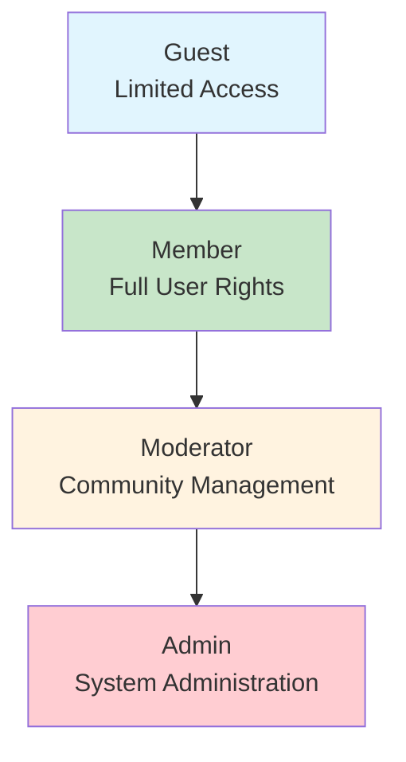
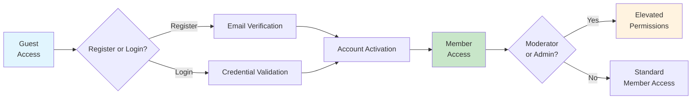

# User Actors and Authentication Requirements for Community Platform

## Executive Summary

This document defines the complete user authentication and authorization framework for the Reddit-like community platform. It establishes the foundation for secure user management, access control, and permission hierarchies that will govern all platform interactions. The authentication system must support four distinct user actors with graduated permission levels, ensuring appropriate access controls while maintaining platform security and user privacy.

### Platform Authentication Vision
The authentication system provides a seamless, secure experience that balances user convenience with robust security measures. Users can easily register, authenticate, and manage their accounts while the platform maintains strict security standards and compliance with global privacy regulations.

## User Actor Definitions

### Guest (Unauthenticated Users)

**Description**: Users who access the platform without authentication. These users can browse public content but have limited interaction capabilities.

**Core Capabilities**:
- Browse public communities and content
- View posts, comments, and voting statistics
- Access community information and descriptions
- View user profiles (public information only)
- Register for a new account
- Login to existing account

**Authentication Status**: No authentication required

**Business Rules**:
- WHEN guests browse public content, THE system SHALL display content without requiring authentication
- WHERE guests attempt authenticated actions, THE system SHALL prompt for registration or login
- IF guests register successfully, THE system SHALL transition them to Member status

### Member (Authenticated Users)

**Description**: Registered users who have completed the authentication process. Members form the core user base and have full interaction capabilities within platform guidelines.

**Core Capabilities**:
- Create and manage posts in communities
- Comment on posts with nested replies
- Upvote/downvote posts and comments
- Subscribe to communities
- Manage personal profile and settings
- Participate in karma system
- Report inappropriate content
- Create and manage their own communities (subreddits)

**Authentication Status**: Valid authentication token required

**Business Rules**:
- WHEN members create content, THE system SHALL validate content against community rules
- WHERE members exceed posting limits, THE system SHALL enforce rate limiting
- IF members violate platform rules, THE system SHALL apply appropriate penalties

### Moderator (Community Administrators)

**Description**: Users with elevated permissions for specific communities. Moderators are responsible for content quality, community guidelines enforcement, and user management within their assigned communities.

**Core Capabilities**:
- All Member capabilities PLUS:
- Moderate content within assigned communities
- Remove posts and comments
- Ban users from communities
- Manage community settings and rules
- Handle content reports
- Appoint additional moderators
- Pin important posts
- Manage community flair and tags

**Authentication Status**: Valid authentication token with moderator permissions

**Business Rules**:
- WHEN moderators take action, THE system SHALL log all moderation activities
- WHERE moderation decisions are disputed, THE system SHALL provide appeal process
- IF moderators abuse their powers, THE system SHALL allow community member reporting

### Admin (System Administrators)

**Description**: Users with system-wide administrative privileges. Admins have ultimate control over platform operations, user management, and system configuration.

**Core Capabilities**:
- All Moderator capabilities PLUS:
- Manage all users and communities
- System-wide content moderation
- Platform configuration and settings
- Analytics and reporting access
- User account management (suspension, deletion)
- Emergency system operations
- Data export and management

**Authentication Status**: Valid authentication token with admin permissions

**Business Rules**:
- WHEN admins perform system operations, THE system SHALL maintain audit trails
- WHERE admin actions affect users, THE system SHALL provide clear communication
- IF emergency actions are required, THE system SHALL allow expedited procedures

## Authentication System Requirements

### Registration Process

**WHEN** a guest attempts to register, **THE system SHALL** provide a registration form with the following requirements:
- Email address validation (unique, valid format)
- Username requirements (3-20 characters, alphanumeric)
- Password requirements (minimum 8 characters, complexity rules)
- Terms of service acceptance
- Email verification process

**WHEN** registration form is submitted, **THE system SHALL**:
- Validate all input fields according to business rules
- Check for duplicate email and username
- Create user account in pending verification state
- Send verification email with secure token
- Log registration attempt

**WHEN** email verification link is clicked, **THE system SHALL**:
- Validate verification token
- Activate user account
- Redirect to login page with success message
- Log verification completion

### Login Process

**WHEN** a user attempts to login, **THE system SHALL**:
- Accept email/username and password
- Validate credentials against stored hash
- Check account status (active, suspended, banned)
- Generate JWT access token with user claims
- Generate secure refresh token
- Update last login timestamp
- Log successful login attempt

**JWT Token Requirements**:
- Access token expiration: 30 minutes
- Refresh token expiration: 30 days
- Token payload must include:
  - userId (unique identifier)
  - username (display name)
  - email (verified email address)
  - roles (array of user roles)
  - permissions (array of specific permissions)
  - communityModerator (array of moderated community IDs)
  - iat (issued at timestamp)
  - exp (expiration timestamp)

### Session Management

**WHEN** an access token expires, **THE system SHALL**:
- Accept valid refresh token
- Validate refresh token against stored hash
- Issue new access token
- Maintain user session continuity
- Log token refresh activity

**WHEN** a user logs out, **THE system SHALL**:
- Invalidate current access token
- Optionally invalidate refresh token
- Clear session data
- Log logout activity

### Password Management

**WHEN** a user requests password reset, **THE system SHALL**:
- Validate email address exists in system
- Generate secure reset token (expires in 1 hour)
- Send password reset email
- Log reset request

**WHEN** password reset form is submitted, **THE system SHALL**:
- Validate reset token
- Enforce new password complexity rules
- Update password hash
- Invalidate all existing sessions
- Send confirmation email
- Log password change

## Permission Hierarchy and Capabilities

### Actor Capabilities Matrix

| Action | Guest | Member | Moderator | Admin |
|--------|-------|--------|-----------|-------|
| Browse public content | ✅ | ✅ | ✅ | ✅ |
| View user profiles | ✅ | ✅ | ✅ | ✅ |
| Register account | ✅ | ❌ | ❌ | ❌ |
| Login to account | ✅ | ❌ | ❌ | ❌ |
| Create posts | ❌ | ✅ | ✅ | ✅ |
| Comment on posts | ❌ | ✅ | ✅ | ✅ |
| Upvote/downvote | ❌ | ✅ | ✅ | ✅ |
| Subscribe to communities | ❌ | ✅ | ✅ | ✅ |
| Create communities | ❌ | ✅ | ✅ | ✅ |
| Moderate content | ❌ | ❌ | ✅* | ✅ |
| Manage community settings | ❌ | ❌ | ✅* | ✅ |
| Ban users from community | ❌ | ❌ | ✅* | ✅ |
| System-wide user management | ❌ | ❌ | ❌ | ✅ |
| Platform configuration | ❌ | ❌ | ❌ | ✅ |

*Moderator permissions apply only to assigned communities

### Permission Inheritance

The permission hierarchy follows a strict inheritance model:

### Community-Specific Permissions

**WHEN** a user creates a community, **THE system SHALL**:
- Grant creator moderator permissions for that community
- Allow creator to appoint additional moderators
- Track community ownership and moderation history

**WHEN** a moderator is appointed, **THE system SHALL**:
- Add community ID to user's moderator array
- Update JWT token claims (if token refresh required)
- Notify user of new moderation responsibilities

## Security and Privacy Requirements

### Authentication Security

**THE authentication system SHALL**:
- Use industry-standard password hashing (bcrypt with appropriate work factor)
- Implement rate limiting on login attempts (max 5 attempts per 15 minutes)
- Enforce secure password policies (minimum 8 characters, mixed characters)
- Use HTTPS for all authentication communications
- Implement CSRF protection for authentication forms
- Store refresh tokens securely (hashed in database)

### Session Security

**WHEN** handling user sessions, **THE system SHALL**:
- Validate JWT signatures for all authenticated requests
- Implement token revocation for suspicious activity
- Monitor for abnormal session patterns
- Provide session timeout warnings
- Support manual session revocation from user settings

### Privacy Requirements

**THE system SHALL** protect user privacy by:
- Not exposing email addresses in public APIs
- Allowing users to control profile visibility
- Providing data export capabilities
- Implementing proper data retention policies
- Complying with relevant privacy regulations (GDPR, CCPA)

### Data Protection

**WHEN** storing user data, **THE system SHALL**:
- Encrypt sensitive personal information
- Implement proper access controls for user data
- Maintain audit logs for sensitive operations
- Provide data deletion capabilities for account closure

## Implementation Guidelines

### Authentication Flow

### Token Management Strategy

**Access Token Storage**:
- Recommended: HTTP-only cookies for enhanced security
- Alternative: localStorage with CSRF protection
- Must include secure flag and same-site restrictions

**Refresh Token Strategy**:
- Store hashed refresh tokens in database
- Implement automatic token rotation
- Support token revocation for security incidents

### Error Handling

**WHEN** authentication fails, **THE system SHALL** provide appropriate error responses:
- Invalid credentials: Generic error message (no specific details)
- Account locked: Clear explanation and unlock procedure
- Token expired: Redirect to refresh flow
- Permission denied: Specific authorization error

### Performance Requirements

**THE authentication system SHALL**:
- Respond to login requests within 2 seconds under normal load
- Support concurrent authentication for 10,000+ users
- Maintain session state efficiently across server instances
- Scale horizontally to handle peak traffic

## Compliance and Standards

### Regulatory Compliance

**THE system SHALL** comply with:
- GDPR requirements for EU users
- CCPA requirements for California users
- COPPA requirements for under-13 users
- Industry-standard security practices

### Technical Standards

**THE system SHALL** implement:
- OWASP security guidelines
- Industry-standard JWT implementation
- Secure password storage practices
- Regular security audits and penetration testing

## Integration Requirements

### User Profile Integration
**WHEN** authentication succeeds, **THE system SHALL** seamlessly integrate with user profile systems to display appropriate user information and permissions.

### Community System Integration
**WHERE** community-specific permissions are required, **THE system SHALL** validate user permissions against community membership and moderator status.

### Content Moderation Integration
**WHEN** content moderation actions occur, **THE system SHALL** verify user authentication and authorization levels before allowing moderation actions.

## Error Handling Scenarios

### Account Recovery
**IF** a user loses access to their account, **THEN THE system SHALL** provide secure account recovery options including email verification and security questions.

### Suspicious Activity Detection
**WHEN** unusual login patterns are detected, **THE system SHALL** implement additional verification steps and notify users of potential security issues.

### System Maintenance
**WHILE** authentication systems undergo maintenance, **THE system SHALL** provide clear communication to users and maintain service availability where possible.

## Success Metrics

The authentication system shall be considered successful when:
- 99.9% of login attempts succeed within 2 seconds
- Account registration completion rate exceeds 95%
- Password reset success rate exceeds 90%
- Security incident rate remains below 0.01%
- User satisfaction with authentication process exceeds 4.5/5.0

> *Developer Note: This document defines **business requirements only**. All technical implementations (architecture, APIs, database design, etc.) are at the discretion of the development team.*