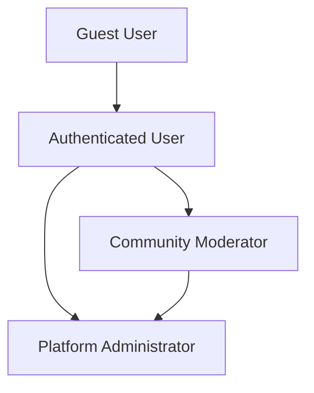

# User Actors and Authentication Specification

## Introduction

This document defines the complete authentication system and user actor hierarchy for the Reddit-like community platform. The authentication system provides secure access control while enabling the rich community interactions that define the platform experience.

## User Actor Definitions

### User Actor Hierarchy

The platform supports three distinct user actor types with escalating permissions:

### Actor Descriptions

#### 1. Guest User (Unauthenticated)
- **Description**: Users who have not logged in or created an account
- **Capabilities**:
  - Browse public content (Popular Feed, Community Feeds)
  - View community listings and search
  - Read posts and comments
  - View user profiles (public information only)
- **Restrictions**:
  - Cannot create content (posts, comments)
  - Cannot vote on content
  - Cannot subscribe to communities
  - Cannot access Home Feed

#### 2. Authenticated User
- **Description**: Registered users with verified accounts
- **Capabilities**:
  - All Guest User capabilities PLUS:
  - Create, edit, and delete their own posts
  - Create, edit, and delete their own comments
  - Vote on posts and comments
  - Subscribe/unsubscribe to communities
  - Access Home Feed (subscribed communities)
  - Create and manage their user profile
  - Report inappropriate content
- **Restrictions**:
  - Cannot moderate content they don't own
  - Cannot ban users from communities
  - Cannot access moderation tools

#### 3. Community Moderator
- **Description**: Users granted moderation privileges for specific communities
- **Capabilities**:
  - All Authenticated User capabilities PLUS:
  - Delete any post within their moderated communities
  - Delete any comment within their moderated communities
  - Ban users from their moderated communities
  - Unban users from their moderated communities
  - View and manage reports within their communities
  - Add other moderators (if community owner)
- **Restrictions**:
  - Permissions are community-specific
  - Cannot moderate communities they're not assigned to
  - Cannot remove community owner
  - Cannot remove other moderators (only owner can)

#### 4. Platform Administrator
- **Description**: System-wide administrators with full platform control
- **Capabilities**:
  - All Moderator capabilities PLUS:
  - Moderate ALL communities
  - Manage ALL users (suspend, delete accounts)
  - Access system-wide analytics and reports
  - Configure platform settings
  - Manage all community ownership transfers
- **Restrictions**:
  - Must follow platform governance policies
  - Actions are logged for audit purposes

## Authentication System Requirements

### Core Authentication Functions

**WHEN** a user attempts to register, **THE** system **SHALL**:
- Validate email format and uniqueness
- Validate password meets security requirements (minimum 8 characters)
- Validate username is unique and meets format requirements
- Send email verification to confirm account ownership
- Create user account with pending verification status

**WHEN** a user logs in with email and password, **THE** system **SHALL**:
- Validate credentials against stored user data
- Generate JWT access token with user identity and permissions
- Set token expiration to 15 minutes
- Generate refresh token with 30-day expiration
- Log successful login attempt

**WHEN** a user logs out, **THE** system **SHALL**:
- Invalidate the current access token
- Remove refresh token association
- Clear session data
- Redirect to login page

**WHEN** a user requests password reset, **THE** system **SHALL**:
- Verify email exists in the system
- Generate secure reset token with 1-hour expiration
- Send password reset email with secure link
- Allow password change only with valid reset token

### Account Management Requirements

**WHEN** a user changes their password, **THE** system **SHALL**:
- Require current password verification
- Validate new password meets security standards
- Update password hash in database
- Invalidate all existing sessions (require re-login)
- Send confirmation email to user

**WHEN** a user deletes their account, **THE** system **SHALL**:
- Require password confirmation for security
- Anonymize all user content (posts, comments)
- Remove personal information from database
- Maintain platform integrity by preserving content structure
- Send confirmation of account deletion

## Permission Matrix

### Content Permissions

| Action | Guest User | Authenticated User | Moderator | Administrator |
|--------|------------|-------------------|-----------|----------------|
| View public content | ✅ | ✅ | ✅ | ✅ |
| Create posts | ❌ | ✅ (subscribed communities) | ✅ (moderated communities) | ✅ (all communities) |
| Edit own posts | ❌ | ✅ | ✅ | ✅ |
| Delete own posts | ❌ | ✅ | ✅ | ✅ |
| Delete any post | ❌ | ❌ | ✅ (moderated communities) | ✅ (all communities) |
| Create comments | ❌ | ✅ | ✅ | ✅ |
| Edit own comments | ❌ | ✅ | ✅ | ✅ |
| Delete own comments | ❌ | ✅ | ✅ | ✅ |
| Delete any comment | ❌ | ❌ | ✅ (moderated communities) | ✅ (all communities) |
| Vote on content | ❌ | ✅ | ✅ | ✅ |

### Community Permissions

| Action | Guest User | Authenticated User | Moderator | Administrator |
|--------|------------|-------------------|-----------|----------------|
| Browse communities | ✅ | ✅ | ✅ | ✅ |
| Search communities | ✅ | ✅ | ✅ | ✅ |
| Subscribe to communities | ❌ | ✅ | ✅ | ✅ |
| Create communities | ❌ | ✅ | ✅ | ✅ |
| Edit community info | ❌ | ❌ (only owner) | ✅ (moderated communities) | ✅ (all communities) |
| Add moderators | ❌ | ❌ (only owner) | ✅ (if owner) | ✅ (all communities) |
| Remove moderators | ❌ | ❌ (only owner) | ❌ (only owner can) | ✅ (all communities) |
| Ban users | ❌ | ❌ | ✅ (moderated communities) | ✅ (all communities) |
| Unban users | ❌ | ❌ | ✅ (moderated communities) | ✅ (all communities) |

### User Management Permissions

| Action | Guest User | Authenticated User | Moderator | Administrator |
|--------|------------|-------------------|-----------|----------------|
| View own profile | ❌ | ✅ | ✅ | ✅ |
| Edit own profile | ❌ | ✅ | ✅ | ✅ |
| View other profiles | ✅ (public info) | ✅ | ✅ | ✅ |
| Report content | ❌ | ✅ | ✅ | ✅ |
| Manage reports | ❌ | ❌ | ✅ (moderated communities) | ✅ (all communities) |
| Delete user accounts | ❌ | ❌ (only own) | ❌ | ✅ |

## JWT Token Management

### Token Structure Requirements

**THE** JWT access token **SHALL** contain the following claims:
- `userId`: Unique identifier for the user
- `username`: User's chosen username
- `email`: User's email address
- `role`: User's primary role ("user", "moderator", "admin")
- `moderatedCommunities`: Array of community IDs where user has moderation rights
- `iat`: Issued at timestamp
- `exp`: Expiration timestamp (15 minutes from issuance)

**THE** refresh token **SHALL**:
- Be stored securely in the database
- Have 30-day expiration period
- Be associated with the user's device information
- Be revoked upon logout or password change

### Token Security Requirements

**WHEN** generating JWT tokens, **THE** system **SHALL**:
- Use strong cryptographic algorithms (HS256 or stronger)
- Store secret keys securely with rotation policies
- Validate token signature on every authenticated request
- Reject tokens with invalid signatures or expired timestamps

**WHEN** a token expires, **THE** system **SHALL**:
- Return HTTP 401 Unauthorized status
- Provide clear error message indicating token expiration
- Allow automatic refresh using valid refresh token

## Session Management

### Active Session Requirements

**THE** system **SHALL** maintain user sessions with the following characteristics:
- Maximum session duration: 30 days with refresh tokens
- Concurrent sessions allowed per user: Unlimited
- Session termination triggers: Logout, password change, account deletion

**WHEN** managing user sessions, **THE** system **SHALL**:
- Track active sessions for security monitoring
- Allow users to view and terminate their own sessions
- Log session creation and termination events
- Implement session timeout warnings for user convenience

## Security Requirements

### Authentication Security

**THE** authentication system **SHALL** implement the following security measures:
- Password hashing using bcrypt with appropriate work factor
- Rate limiting on login attempts (5 attempts per 15 minutes)
- Account lockout after 10 failed login attempts
- Secure password reset process with time-limited tokens
- HTTPS enforcement for all authentication endpoints

**WHEN** handling sensitive operations, **THE** system **SHALL**:
- Require re-authentication for password changes
- Require confirmation for account deletion
- Log all authentication-related events
- Implement CSRF protection for state-changing operations

### Permission Enforcement

**WHEN** authorizing user actions, **THE** system **SHALL**:
- Validate user permissions before processing requests
- Return HTTP 403 Forbidden for unauthorized actions
- Provide clear error messages for permission denials
- Log permission validation failures for security monitoring

## Error Handling and Recovery

### Authentication Errors

**IF** authentication fails, **THEN THE** system **SHALL**:
- Return appropriate HTTP status codes (401, 403)
- Provide user-friendly error messages
- Not log sensitive information in error responses
- Maintain security by not revealing whether email exists

**WHEN** handling token-related errors, **THE** system **SHALL**:
- Clear invalid tokens from client storage
- Redirect to login page when authentication is required
- Provide clear guidance for token renewal

### Account Recovery

**WHEN** a user forgets their password, **THE** system **SHALL**:
- Provide secure password reset flow
- Send reset instructions to verified email address
- Allow password change only through secure reset tokens
- Confirm password change completion

## Integration Points

This authentication system integrates with:
- [User Profile Management](./03-user-profile-management.md) for profile data access
- [Community Management](./04-community-management.md) for community-specific permissions
- [Content Creation Systems](./05-content-creation-posts.md) for content ownership validation
- [Moderation System](./09-moderation-system.md) for moderator privilege enforcement

## Performance Requirements

**THE** authentication system **SHALL** meet the following performance standards:
- Login response time: < 2 seconds under normal load
- Token validation: < 100 milliseconds per request
- Concurrent user support: 10,000+ active sessions
- Session data retrieval: < 50 milliseconds

## Compliance Requirements

**THE** authentication system **SHALL** comply with:
- GDPR requirements for user data protection
- Privacy-by-design principles
- Data minimization for authentication data
- Secure storage of sensitive information

> *Developer Note: This document defines **business requirements only**. All technical implementations (architecture, APIs, database design, etc.) are at the discretion of the development team.*