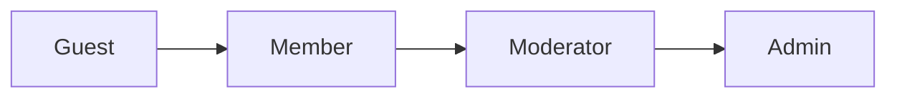
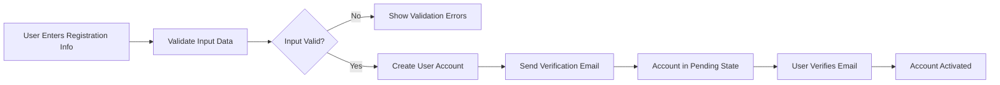
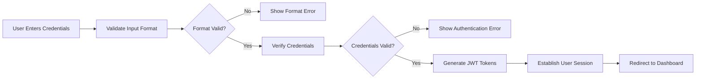

# User Actors and Authentication System Specification

## Authentication System Overview

This document defines the complete authentication and authorization framework for the Reddit-like community platform. The system provides secure user authentication, role-based access control, and comprehensive permission management for all platform features.

### Core Authentication Architecture
The platform implements a JWT-based authentication system with four distinct user actors, each with specific permissions and capabilities. The system ensures secure access to community features while maintaining user privacy and platform integrity.

## User Actor Definitions and Hierarchy

### Actor Hierarchy Structure


### Guest User
**Description**: Unauthenticated users who can browse public content without creating an account.

**Permissions**:
- View public posts and comments
- Browse community listings
- Access public community information
- Search platform content
- View user profiles (public information only)

**Restrictions**:
- Cannot create posts or comments
- Cannot vote on content
- Cannot subscribe to communities
- Cannot access member-only features
- Cannot send messages or interact with users

### Member User
**Description**: Registered users who actively participate in community discussions and content creation.

**Permissions**:
- Create and manage posts in subscribed communities
- Submit and edit comments
- Upvote/downvote posts and comments
- Subscribe to communities
- Manage personal profile and preferences
- Send and receive private messages
- Save posts for later viewing
- Report inappropriate content

**Authentication Requirements**:
- Email verification required for full access
- Password complexity enforcement
- Session management with automatic logout

### Moderator User
**Description**: Community moderators responsible for maintaining community standards and content quality.

**Permissions**:
- All Member permissions
- Remove posts and comments in moderated communities
- Ban users from specific communities
- Approve/remove reported content
- Manage community settings and rules
- Pin important posts in communities
- Access moderation logs and analytics

**Authentication Requirements**:
- Additional moderator verification
- Enhanced security logging
- Two-factor authentication recommended

### Admin User
**Description**: System administrators with full platform access and management capabilities.

**Permissions**:
- All Moderator permissions
- Manage all users and communities
- Access system-wide analytics and logs
- Configure platform settings
- Manage payment and subscription systems
- Handle escalated moderation cases
- Perform system maintenance operations

**Authentication Requirements**:
- Mandatory two-factor authentication
- Session timeout after 15 minutes of inactivity
- Comprehensive audit logging

## Authentication Flow Requirements

### User Registration Process


**Registration Requirements**:
- WHEN a user submits registration information, THE system SHALL validate email format and password strength
- THE system SHALL require unique email addresses for each account
- IF email verification fails, THEN THE system SHALL allow resending verification emails
- WHERE email verification is pending, THE user SHALL have limited platform access

### User Login Process


**Login Requirements**:
- WHEN a user attempts to log in, THE system SHALL validate credentials within 2 seconds
- IF login attempts exceed 5 failures, THEN THE system SHALL temporarily lock the account
- THE system SHALL maintain user sessions securely with automatic timeout after 30 days of inactivity

### Password Management
**Password Reset Flow**:
- WHEN a user requests password reset, THE system SHALL send reset instructions to verified email
- THE password reset link SHALL expire after 1 hour
- WHERE password is reset, THE system SHALL invalidate all existing sessions

**Password Requirements**:
- THE system SHALL enforce minimum password length of 8 characters
- THE system SHALL require at least one uppercase letter, one lowercase letter, and one number
- THE system SHALL prevent password reuse for the last 5 passwords

## JWT Token Management Specification

### Token Structure
**Access Token Payload**:
```json
{
  "userId": "uuid-string",
  "email": "user@example.com",
  "role": "member|moderator|admin",
  "permissions": ["post:create", "comment:vote", "community:subscribe"],
  "communities": ["community-id-1", "community-id-2"],
  "iat": 1234567890,
  "exp": 1234567890
}
```

**Refresh Token Requirements**:
- THE refresh token SHALL be stored securely with HTTP-only cookies
- THE refresh token SHALL expire after 30 days
- WHEN refreshing access tokens, THE system SHALL validate refresh token integrity

### Token Security
- THE system SHALL use strong cryptographic algorithms for token generation
- THE JWT secret key SHALL be securely managed and rotated periodically
- THE system SHALL implement token revocation for compromised accounts
- WHERE tokens are compromised, THE system SHALL immediately invalidate all user sessions

## Permission Matrix and Access Control

### Comprehensive Permission Matrix
| Action | Guest | Member | Moderator | Admin |
|--------|-------|--------|-----------|-------|
| View Public Posts | ✅ | ✅ | ✅ | ✅ |
| View Public Comments | ✅ | ✅ | ✅ | ✅ |
| Browse Communities | ✅ | ✅ | ✅ | ✅ |
| Search Content | ✅ | ✅ | ✅ | ✅ |
| Create Posts | ❌ | ✅ | ✅ | ✅ |
| Edit Own Posts | ❌ | ✅ | ✅ | ✅ |
| Delete Own Posts | ❌ | ✅ | ✅ | ✅ |
| Create Comments | ❌ | ✅ | ✅ | ✅ |
| Edit Own Comments | ❌ | ✅ | ✅ | ✅ |
| Delete Own Comments | ❌ | ✅ | ✅ | ✅ |
| Upvote/Downvote | ❌ | ✅ | ✅ | ✅ |
| Subscribe to Communities | ❌ | ✅ | ✅ | ✅ |
| Report Content | ❌ | ✅ | ✅ | ✅ |
| Remove Posts (Moderated) | ❌ | ❌ | ✅ | ✅ |
| Remove Comments (Moderated) | ❌ | ❌ | ✅ | ✅ |
| Ban Users from Community | ❌ | ❌ | ✅ | ✅ |
| Manage Community Settings | ❌ | ❌ | ✅ | ✅ |
| Manage All Users | ❌ | ❌ | ❌ | ✅ |
| Manage All Communities | ❌ | ❌ | ❌ | ✅ |
| System Configuration | ❌ | ❌ | ❌ | ✅ |

### Access Control Rules
- WHILE a user is authenticated as Member, THE system SHALL grant access to content creation features
- WHEN a Moderator accesses moderation tools, THE system SHALL verify community assignment
- IF an Admin performs system operations, THEN THE system SHALL log all actions for audit purposes
- WHERE content moderation occurs, THE system SHALL notify affected users of actions taken

## Security Requirements and Best Practices

### Authentication Security
- THE system SHALL implement rate limiting on authentication endpoints
- THE system SHALL use HTTPS for all authentication communications
- THE system SHALL store passwords using bcrypt with appropriate salt rounds
- WHERE sensitive operations occur, THE system SHALL require re-authentication

### Session Management
- THE access token SHALL expire after 15 minutes of inactivity
- THE system SHALL provide secure token refresh mechanisms
- WHEN users log out, THE system SHALL invalidate both access and refresh tokens
- THE system SHALL maintain session activity logs for security monitoring

### Threat Protection
- THE system SHALL detect and prevent brute force attacks
- THE system SHALL implement CSRF protection for all state-changing operations
- WHERE suspicious activity is detected, THE system SHALL trigger security alerts
- THE system SHALL provide account recovery mechanisms for compromised accounts

## Error Handling and Recovery Scenarios

### Authentication Error Scenarios
**Invalid Credentials**:
- WHEN authentication fails due to invalid credentials, THE system SHALL return HTTP 401 with error code "AUTH_INVALID_CREDENTIALS"
- THE error message SHALL not specify whether email or password was incorrect

**Account Locked**:
- IF an account is temporarily locked, THEN THE system SHALL return HTTP 423 with error code "ACCOUNT_LOCKED"
- THE response SHALL include lock duration and unlock time

**Token Expired**:
- WHEN an access token expires, THE system SHALL return HTTP 401 with error code "TOKEN_EXPIRED"
- THE client SHALL automatically attempt token refresh

### Recovery Processes
**Password Reset**:
- WHEN a user forgets their password, THE system SHALL provide secure password reset functionality
- THE password reset process SHALL require email verification
- WHERE password is successfully reset, THE system SHALL notify the user via email

**Account Recovery**:
- IF an account is compromised, THEN THE system SHALL provide account recovery procedures
- THE recovery process SHALL include identity verification steps
- WHERE recovery is complete, THE system SHALL secure the account with new credentials

### Security Incident Response
- WHEN security incidents are detected, THE system SHALL immediately log the event
- THE system SHALL notify administrators of critical security events
- WHERE necessary, THE system SHALL temporarily suspend affected accounts

## Implementation Guidelines

### Development Priorities
1. Implement core authentication flows (registration, login, logout)
2. Develop JWT token management system
3. Create permission validation middleware
4. Implement security features and threat protection
5. Develop comprehensive error handling

### Testing Requirements
- ALL authentication endpoints SHALL undergo security penetration testing
- THE permission system SHALL be tested for all user actor combinations
- Error handling scenarios SHALL be validated for proper user experience
- Performance testing SHALL verify authentication response times under load

### Monitoring and Analytics
- THE system SHALL track authentication success/failure rates
- Security events SHALL be monitored in real-time
- User session analytics SHALL inform platform improvements
- Authentication performance metrics SHALL be collected and analyzed

This specification provides the complete foundation for implementing a secure, scalable authentication system that supports the Reddit-like community platform's user hierarchy and permission structure. All requirements are written in natural language using EARS format where applicable to ensure clear understanding by backend developers.