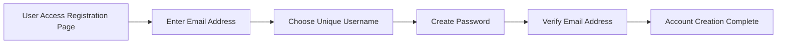
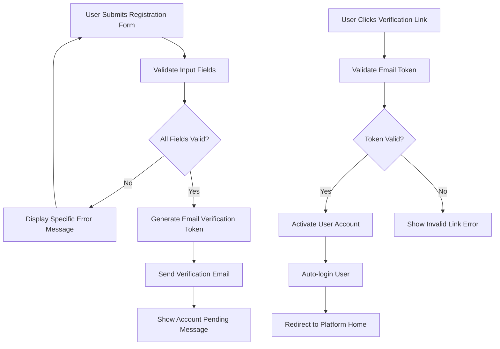
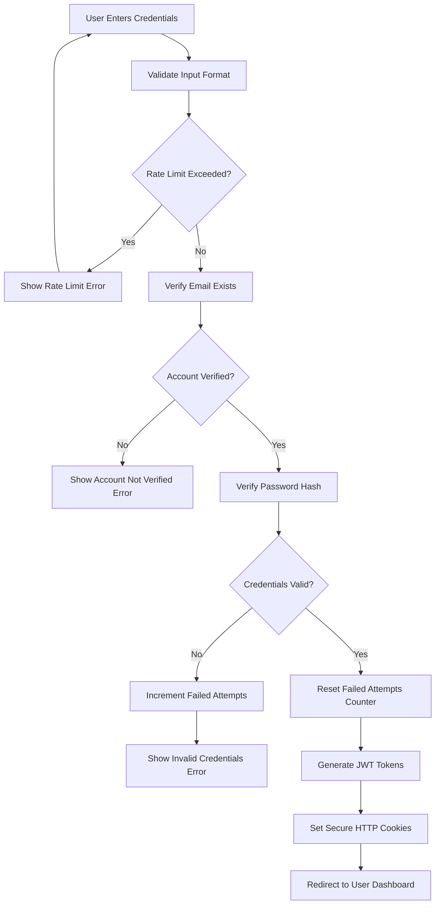
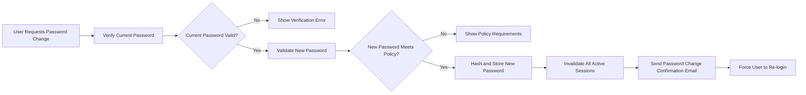
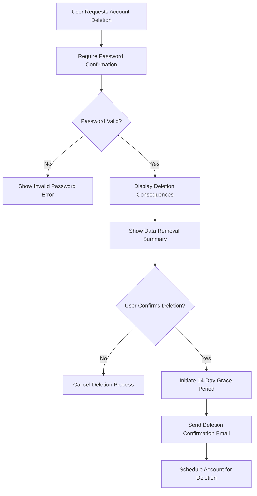
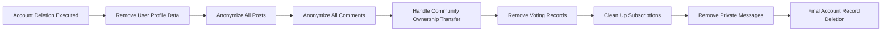

# User Authentication Requirements

## Authentication System Overview

The community platform implements a comprehensive JWT-based authentication system designed for security and scalability. The system supports user registration, secure login, session management, and account lifecycle operations while maintaining platform integrity during user account deletion processes.

### Core Authentication Architecture

The authentication system utilizes JSON Web Tokens (JWT) for stateless session management with the following key components:

- **Access Token**: Short-lived token (15-minute expiration) for API authentication
- **Refresh Token**: Long-lived token (30-day expiration) for session renewal
- **Token Storage**: Secure HTTP-only cookies preferred for production deployments
- **Token Rotation**: Automatic refresh token rotation on each access token renewal

The authentication flow must support both web browser and mobile application clients while maintaining consistent security standards across all platforms.

## User Registration Process

### User Registration Requirements

#### Registration Form Fields


#### Field Validation Rules
- **Email Address**: 
  - Must be valid email format
  - Maximum 254 characters
  - Unique across the platform
  - Verified through confirmation email

- **Username**:
  - Minimum 3 characters, maximum 20 characters
  - Alphanumeric characters only (a-z, 0-9)
  - Case insensitive, stored in lowercase
  - Unique across the platform
  - Cannot contain reserved words or offensive terms

- **Password**:
  - Minimum 8 characters
  - Must contain at least one uppercase letter
  - Must contain at least one lowercase letter
  - Must contain at least one number
  - Must contain at least one special character
  - Maximum 128 characters
  - Checked against known password breaches

### Registration Flow Implementation



#### Email Verification Process
- WHEN a user submits registration, THE system SHALL generate a unique verification token valid for 24 hours
- THE system SHALL send a verification email containing a secure verification link
- WHEN the verification link expires, THE system SHALL require the user to request a new verification email
- IF the verification token is used, THE system SHALL immediately invalidate it to prevent replay attacks
- THE system SHALL automatically delete unverified accounts after 7 days of inactivity

#### Username Reservation System
- WHEN a username is entered during registration, THE system SHALL temporarily reserve it to prevent race conditions
- THE system SHALL release reserved usernames if registration is not completed within 1 hour
- THE system SHALL prevent username squatting by enforcing account activation requirements

## Login and Session Management

### Secure Login Requirements

#### Login Interface
- Users can log in using their email address (not username)
- Password fields must be masked for security
- Login attempts must be rate-limited to prevent brute-force attacks
- Failed login attempts must trigger progressive delays



#### Failed Login Protection
- WHEN login fails, THE system SHALL increment a failed attempts counter
- THE system SHALL lock accounts after 5 consecutive failed login attempts
- Account lockouts SHALL last for 15 minutes before automatic unlock
- THE system SHALL notify users via email when their account is locked
- THE system SHALL provide password reset options for locked accounts

#### Session Management
- **Access Token Lifetime**: 15 minutes maximum
- **Refresh Token Lifetime**: 30 days maximum
- **Token Rotation**: New refresh token issued on each access token refresh
- **Concurrent Sessions**: Users can have multiple active sessions
- **Session Revocation**: Users can logout from all devices simultaneously

### JWT Token Structure

#### Access Token Payload
```json
{
  "userId": "uuid-string",
  "username": "user's chosen username",
  "email": "user's verified email",
  "role": "user/moderator/admin",
  "communities": ["array of community IDs where user is moderator"],
  "iat": "issued at timestamp",
  "exp": "expiration timestamp"
}
```

#### Refresh Token Requirements
- Stored securely in database with user association
- Automatically revoked on password changes
- Can be manually revoked by users via security settings
- Supports granular session management per device

## Password Management

### Password Security Requirements

#### Password Storage
- THE system SHALL store passwords using bcrypt with work factor of 12
- THE system SHALL never store plaintext passwords
- THE system SHALL use unique salt per password
- Password hashes SHALL be stored in a secure, encrypted database

#### Password Change Process


#### Password Reset Flow
- WHEN a user initiates password reset, THE system SHALL generate a reset token valid for 1 hour
- Password reset links SHALL be single-use only
- WHEN password reset is successful, THE system SHALL invalidate all active sessions
- THE system SHALL send password reset confirmation to the user's email

### Password Policy Enforcement

**Complexity Requirements**:
- Minimum length: 8 characters
- Maximum length: 128 characters
- Required character classes: uppercase, lowercase, numbers, special characters
- Cannot contain the username or email address
- Cannot be one of the 10,000 most common passwords

**Historical Password Prevention**:
- Users cannot reuse their last 5 passwords
- Password history is maintained for security compliance
- Password changes require a 24-hour cooldown period to prevent rapid changes

## Account Deletion Process

### Account Deletion Requirements

#### Deletion Initiation


#### Grace Period Implementation
- WHEN account deletion is requested, THE system SHALL initiate a 14-day grace period
- During grace period, accounts are marked as "pending deletion"
- Users can cancel deletion during the grace period
- All user content remains accessible during grace period
- Users receive reminder emails at 7 days and 24 hours before deletion

### Data Removal Process

#### Content Cascade Deletion


#### Specific Data Handling Rules

**Posts and Comments**:
- WHEN account deletion occurs, THE system SHALL anonymize all user-generated content
- Anonymized content SHALL display "[deleted user]" as author
- Content statistics (vote counts, comment counts) SHALL be preserved
- Community integrity SHALL be maintained despite user deletion

**Community Ownership**:
- IF a user owns communities, THE system SHALL transfer ownership
- Ownership transfer priority: existing moderators → platform administrators
- Community subscribers SHALL be notified of ownership changes
- Community settings and rules SHALL be preserved

**Voting Records**:
- User voting records SHALL be removed completely
- Post and comment scores SHALL be recalculated without the user's votes
- Karma calculations SHALL be updated to reflect vote removal

### Deletion Confirmation and Audit

#### Confirmation Requirements
- Users must confirm deletion via email before execution
- Deletion confirmation links SHALL be valid for 24 hours
- Successful deletion SHALL trigger final confirmation email
- All deletion actions SHALL be logged for audit purposes

#### Audit Trail
- THE system SHALL maintain deletion logs for 90 days
- Logs SHALL include deletion timestamp and method
- Platform administrators SHALL have access to deletion audit trails
- Data recovery procedures SHALL be documented for legal compliance

## Security Requirements

### General Security Measures

#### Data Protection
- All authentication endpoints SHALL use HTTPS exclusively
- Passwords SHALL never be transmitted in plaintext
- User sessions SHALL timeout after 24 hours of inactivity
- Security headers SHALL be implemented (HSTS, CSP, XSS protection)

#### Token Security
- JWT tokens SHALL include audience and issuer claims
- Token signing keys SHALL be rotated regularly
- Token revocation lists SHALL be maintained for security incidents
- Refresh tokens SHALL be stored securely with limited exposure

### Brute Force Protection

#### Rate Limiting Implementation
- Login endpoints: maximum 5 attempts per IP per minute
- Registration endpoints: maximum 3 attempts per IP per hour
- Password reset endpoints: maximum 3 attempts per email per hour
- API endpoints: tiered rate limits based on user authentication status

#### Suspicious Activity Detection
- THE system SHALL monitor for unusual login patterns
- Login attempts from new locations SHALL trigger additional verification
- Rapid succession of failed attempts SHALL trigger temporary IP blocking
- Security teams SHALL receive alerts for potential attack patterns

### Compliance and Privacy

#### Data Retention Policies
- User activity logs SHALL be retained for 90 days
- Deleted account records SHALL be purged after 30 days
- Backup retention SHALL follow company data policies
- Legal hold procedures SHALL be documented for compliance

#### Privacy Considerations
- User consent SHALL be obtained for data processing
- Privacy policy SHALL be presented during registration
- Data export functionality SHALL be available to users
- Right to erasure SHALL be implemented according to regulations

### System Monitoring and Alerting

#### Security Monitoring
- Authentication failures SHALL be logged and monitored
- Unusual patterns SHALL trigger security alerts
- System administrators SHALL receive real-time security notifications
- Regular security audits SHALL be conducted

#### Performance Monitoring
- Authentication response times SHALL be monitored
- Token generation performance SHALL be optimized
- Database query performance for auth operations SHALL be tracked
- System scalability SHALL be tested regularly

## Integration Requirements

### External Service Integration

#### Email Service Requirements
- THE system SHALL integrate with reliable email delivery services
- Email templates SHALL be customizable for different notification types
- Email delivery status SHALL be monitored and logged
- Email sending SHALL have rate limiting to prevent abuse

#### Third-Party Authentication (Future)
- Architecture SHALL support OAuth 2.0 integration
- Social login options SHALL be modular and optional
- Account linking SHALL be securely implemented
- Migration paths SHALL be available between authentication methods

### Mobile Application Support

#### Mobile-Specific Authentication
- Mobile apps SHALL use the same authentication endpoints
- Token refresh mechanisms SHALL work reliably on mobile devices
- Offline authentication considerations SHALL be documented
- Push notification authentication SHALL be securely implemented

#### Cross-Platform Consistency
- Authentication flows SHALL be consistent across web and mobile
- User experience SHALL be optimized for each platform
- Security requirements SHALL be enforced equally across all platforms
- Token management SHALL handle platform-specific constraints

## Enhanced Authentication Scenarios

### Multi-Device Authentication Management

Users frequently access the platform from multiple devices including desktop browsers, mobile apps, and tablets. The authentication system must handle concurrent sessions securely while providing users with visibility and control over their active sessions.

#### Session Management Interface
- Users SHALL be able to view all active sessions with device information
- Each session SHALL display location data, last activity timestamp, and device type
- Users SHALL have the ability to terminate individual sessions remotely
- Session termination SHALL trigger immediate token revocation

#### Cross-Device Security
- WHEN a user logs in from a new device, THE system SHALL send a security notification
- Unusual login patterns SHALL trigger additional verification steps
- Users SHALL receive email alerts for suspicious login attempts
- Session timeouts SHALL be enforced based on device trust levels

### Account Recovery Options

#### Recovery Flow Enhancements
- WHEN users forget their password, THE system SHALL provide multiple recovery options
- Security questions SHALL be optional but recommended for enhanced security
- Backup email addresses SHALL be configurable for recovery purposes
- Recovery codes SHALL be generated for emergency access

#### Identity Verification
- FOR sensitive account operations, THE system SHALL require additional verification
- Identity verification SHALL use multi-factor authentication when configured
- Recovery attempts SHALL be rate-limited to prevent abuse
- Successful recovery SHALL trigger security notifications to the account owner

### Advanced Security Features

#### Two-Factor Authentication (2FA)
- THE system SHALL support optional two-factor authentication
- 2FA methods SHALL include authenticator apps and SMS verification
- Backup codes SHALL be provided for 2FA recovery
- 2FA setup SHALL require verification of primary authentication method

#### Security Event Logging
- All authentication-related events SHALL be logged with timestamps
- Security logs SHALL include IP addresses, user agents, and outcome status
- Users SHALL be able to review their own security event history
- Suspicious activity SHALL trigger automated security responses

### Performance and Scalability Considerations

#### Authentication Service Performance
- Authentication endpoints SHALL respond within 200ms under normal load
- Token generation SHALL be optimized for high-throughput scenarios
- Database queries for authentication SHALL use efficient indexing
- Caching strategies SHALL be implemented for frequently accessed auth data

#### Scalability Architecture
- THE authentication system SHALL support horizontal scaling
- Token validation SHALL be designed for distributed deployment
- Session data SHALL be stored in scalable, distributed storage
- Rate limiting SHALL be implemented at multiple architectural layers

### Business Continuity and Disaster Recovery

#### Authentication Service Availability
- THE system SHALL maintain 99.9% uptime for authentication services
- Redundant authentication endpoints SHALL be available across regions
- Failover mechanisms SHALL be implemented for critical auth components
- Backup authentication methods SHALL be available during service disruptions

#### Data Recovery Procedures
- Authentication data SHALL be backed up regularly with point-in-time recovery
- Recovery procedures SHALL be documented and tested periodically
- User account recovery SHALL be prioritized during system restoration
- Audit trails SHALL be preserved through disaster recovery processes

This enhanced authentication requirements document provides comprehensive coverage of all business processes, security considerations, and user scenarios required for a production-ready community platform authentication system.