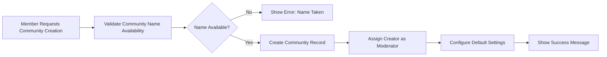
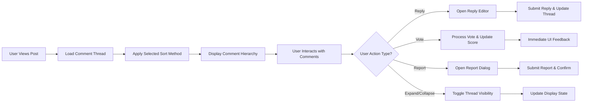

# Core Features Requirements Specification for Community Platform

## 1. Introduction and Scope

This document defines the complete business requirements for the core features of the Reddit-like community platform. The platform enables users to create communities, share content, engage in discussions through voting and commenting, and participate in community moderation.

### Platform Vision
WHEN users participate in the platform, THE system SHALL provide a space where users can discover, create, and participate in communities around shared interests, enabling democratic content curation through community voting and robust moderation tools.

## 2. Community Management Features

### 2.1 Community Creation
WHEN a member wants to create a new community, THE system SHALL allow community creation with the following requirements:

- Members can create communities with unique names and descriptions
- Each community SHALL have a unique URL-friendly identifier
- Community creators automatically become moderators of their communities
- Communities can be set as public (anyone can view) or private (approval required)
- Community descriptions SHALL support markdown formatting for rich content

### 2.2 Community Settings Management
WHERE a user is a moderator or admin, THE system SHALL allow management of community settings including:

- Community name, description, and banner image updates
- Community rules and guidelines configuration
- Post submission requirements (text-only, links, images, etc.)
- Moderation queue settings and approval workflows
- User joining requirements (open, approval-based, or invite-only)

### 2.3 Community Membership
WHEN a member wants to join a community, THE system SHALL handle membership requests based on community settings:

- FOR public communities: instant joining with subscription
- FOR private communities: approval-based joining with moderator review
- FOR invite-only communities: invitation-based access only

## 3. Post Creation and Management System

### 3.1 Post Submission
WHEN a member creates a post within a community, THE system SHALL support multiple post types:

- **Text Posts**: Rich text content with markdown support
- **Link Posts**: URL sharing with automatic preview generation
- **Image/Video Posts**: Media uploads with format validation
- **Poll Posts**: Multiple-choice questions with voting options

### 3.2 Post Validation Rules
THE system SHALL enforce the following validation rules for all posts:

- Posts require a title between 5-300 characters
- Text posts require content between 10-40,000 characters
- Link posts require valid URLs with proper formatting
- Media posts support images (JPEG, PNG, GIF) and videos (MP4, WebM)
- Poll posts require 2-6 options with 1-7 day duration

### 3.3 Post Management
WHERE a user is the post author, moderator, or admin, THE system SHALL allow:

- Post editing within 24 hours of creation
- Post deletion with confirmation
- Post locking (preventing new comments)
- Post pinning to community top (moderators/admins only)
- Post flair assignment for categorization

## 4. Voting System Requirements

### 4.1 Voting Mechanism
WHEN a member interacts with content, THE system SHALL provide upvote/downvote functionality:

- Members can upvote or downvote posts and comments
- Each vote affects the content's score calculation
- Users cannot vote on their own content
- Vote changes are allowed within 5 minutes of initial vote

### 4.2 Score Calculation
THE system SHALL calculate content scores using the following algorithm:

- Base score = upvotes - downvotes
- Content age affects score weight (newer content has higher visibility)
- Controversial content (similar up/down votes) receives adjusted ranking
- Highly upvoted content receives "hot" status for increased visibility

### 4.3 Voting Limitations
TO prevent abuse, THE system SHALL implement voting restrictions:

- Rate limiting: maximum 100 votes per user per hour
- New users have reduced voting weight until established
- Vote manipulation detection for suspicious patterns

## 5. Comment System Functionality

### 5.1 Comment Creation
WHEN a member comments on a post, THE system SHALL support:

- Nested comment threads with unlimited depth
- Rich text formatting with markdown support
- Comment editing within 30 minutes of posting
- Comment deletion with thread preservation
- Media embedding in comments (images, GIFs)

### 5.2 Comment Sorting
THE system SHALL provide multiple comment sorting options:

- **Best**: Algorithm-based ranking considering votes and replies
- **Top**: Highest voted comments first
- **New**: Most recent comments first
- **Controversial**: Comments with similar up/down vote ratios
- **Old**: Chronological order from oldest

### 5.3 Comment Moderation
WHERE content requires moderation, THE system SHALL allow:

- Comment removal by moderators with removal reason
- Comment locking to prevent further replies
- User comment history review for moderation purposes
- Automated spam detection and filtering

## 6. Subscription Management

### 6.1 Community Subscriptions
WHEN a member subscribes to a community, THE system SHALL:

- Add community posts to user's personalized feed
- Track subscription count for community popularity
- Allow easy subscription management (subscribe/unsubscribe)
- Provide subscription recommendations based on user activity

### 6.2 Feed Personalization
THE system SHALL personalize user feeds based on:

- Subscribed community content
- Popular content from similar communities
- Trending topics across the platform
- User voting history and engagement patterns

### 6.3 Notification Preferences
WHERE users want to manage notifications, THE system SHALL provide:

- Email notifications for important events
- Push notifications for trending content
- Digest emails for weekly community summaries
- Granular control over notification types

## 7. Content Moderation Tools

### 7.1 Moderator Tools
WHERE a user has moderator privileges, THE system SHALL provide:

- Content removal with customizable removal reasons
- User banning from specific communities
- Moderation queue for reported content
- Moderation log for audit purposes
- Automated rule enforcement for repetitive violations

### 7.2 User Reporting
WHEN users encounter inappropriate content, THE system SHALL allow:

- Content reporting with specific violation categories
- Anonymous reporting to protect user privacy
- Report tracking and status updates
- Escalation to platform admins for severe violations

### 7.3 Automated Moderation
THE system SHALL implement automated content filtering:

- Spam detection using pattern recognition
- Hate speech filtering based on keyword analysis
- Duplicate content detection
- NSFW (Not Safe For Work) content identification

## 8. Search and Discovery Features

### 8.1 Content Search
WHEN users search for content, THE system SHALL provide:

- Full-text search across posts, comments, and communities
- Advanced search filters (by community, author, date, content type)
- Search result ranking based on relevance and popularity
- Search suggestions and auto-completion

### 8.2 Community Discovery
THE system SHALL help users discover new communities through:

- Trending communities based on growth and activity
- Similar community recommendations
- Category-based browsing
- Featured communities highlighted by platform

### 8.3 User Discovery
WHERE privacy settings allow, THE system SHALL enable:

- User profile browsing and content history
- Following other users for content recommendations
- User search with privacy-respecting results

## 9. User Interaction Workflows

### 9.1 Content Engagement
THE system SHALL track and display engagement metrics:

- View counts for posts and communities
- Engagement rates (comments/votes per view)
- User activity levels and participation history
- Content sharing statistics

### 9.2 User Reputation System
THE system SHALL implement a reputation scoring system:

- Karma points based on post/comment upvotes
- Community-specific reputation for specialized knowledge
- Badge system for achievements and milestones
- Trust scores for content quality assessment

### 9.3 Social Features
WHERE users want social interaction, THE system SHALL provide:

- Direct messaging between users
- User following for content recommendations
- Profile customization and bio information
- Achievement badges and trophies

## 10. Business Rules and Constraints

### 10.1 Content Guidelines
THE system SHALL enforce the following content policies:

- No hate speech, harassment, or discriminatory content
- Respect for copyright and intellectual property
- Age-appropriate content labeling and filtering
- Prohibition of illegal activities and harmful content

### 10.2 Performance Requirements
FROM user perspective, THE system SHALL meet performance expectations:

- Page loads should feel instantaneous (under 2 seconds)
- Search results should appear as user types
- Voting actions should register immediately
- Large media files should upload with progress indication

### 10.3 Error Handling
WHEN errors occur, THE system SHALL provide user-friendly responses:

- Clear error messages explaining what went wrong
- Recovery suggestions for common issues
- Support contact information for unresolved problems
- Graceful degradation when features are unavailable

### 10.4 Data Retention Policies
THE system SHALL implement data management policies:

- User content preservation according to platform policies
- Account deletion with content anonymization options
- Backup and recovery procedures for data protection
- Compliance with data protection regulations

## User Actor Permission Matrix

| Feature | Guest | Member | Moderator | Admin |
|---------|-------|--------|-----------|-------|
| Browse public content | ✅ | ✅ | ✅ | ✅ |
| View posts/comments | ✅ | ✅ | ✅ | ✅ |
| Create account | ✅ | ❌ | ❌ | ❌ |
| Create posts | ❌ | ✅ | ✅ | ✅ |
| Vote on content | ❌ | ✅ | ✅ | ✅ |
| Comment on posts | ❌ | ✅ | ✅ | ✅ |
| Create communities | ❌ | ✅ | ✅ | ✅ |
| Moderate content | ❌ | ❌ | ✅ (assigned communities) | ✅ |
| Manage users | ❌ | ❌ | ✅ (community level) | ✅ |
| System configuration | ❌ | ❌ | ❌ | ✅ |

## Workflow Diagrams

### Community Creation Flow


### Post Submission Process
```mermaid
graph LR
  A["Member Selects Community"] --> B["Choose Post Type"]
  B --> C["Enter Post Content"]
  C --> D["Validate Content Against Rules"]
  D --> E{"Validation Passed?"}
  E -->|"No"| F["Show Specific Error Message"]
  E -->|"Yes"| G["Submit for Moderation (if required)"]
  G --> H{"Moderation Required?"}
  H -->|"No"| I["Publish Immediately"]
  H -->|"Yes"| J["Add to Moderation Queue"]
  I --> K["Show Success & Update Feed"]
  J --> L["Show "Pending Approval" Message"]
```

### Comment Thread Management


> *Developer Note: This document defines **business requirements only**. All technical implementations (architecture, APIs, database design, etc.) are at the discretion of the development team.*