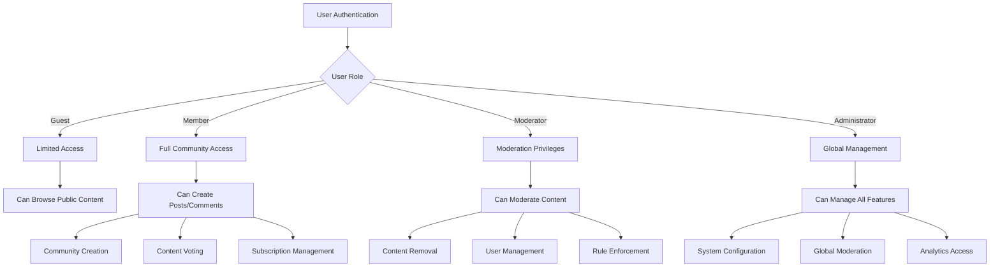

# Core Features Requirements for Reddit-like Community Platform

## 1. Introduction

This document specifies the functional requirements for the core features of the Reddit-like community platform. These requirements define the fundamental building blocks that enable users to create communities, share content, interact through voting, and discover relevant content through sophisticated sorting algorithms.

## 2. Community Management Features

### 2.1 Community Creation and Management

**Community Creation Process:**
WHEN a member creates a new community, THE system SHALL validate the community name for uniqueness and format compliance.
THE community name SHALL be between 3-21 characters and contain only alphanumeric characters and underscores.
THE system SHALL automatically generate a unique community URL identifier.
THE community creator SHALL become the initial moderator with full administrative privileges.

**Community Settings Management:**
WHERE a moderator manages community settings, THE system SHALL allow configuration of:
- Community description and rules
- Content submission guidelines
- Post flair requirements
- Moderation queue settings
- User posting permissions

**Community Discovery:**
THE system SHALL provide community discovery features including:
- Trending communities based on recent activity
- New communities sorted by creation date
- Search functionality for finding communities by name or topic

### 2.2 Community Subscription System

**Subscription Management:**
WHEN a member subscribes to a community, THE system SHALL add the community to their personal feed.
WHEN a member unsubscribes from a community, THE system SHALL remove it from their feed.
THE system SHALL track subscription counts for each community.

**Personalized Feed:**
THE member's home feed SHALL display content from all subscribed communities.
THE feed SHALL support multiple sorting algorithms (hot, new, top, controversial).
THE system SHALL remember the user's preferred sorting method.

## 3. Content Creation & Management

### 3.1 Post Types and Creation

**Supported Post Types:**
THE system SHALL support three primary post types:
- Text posts with title and body content
- Link posts with URL and optional description
- Image posts with image upload and caption

**Post Creation Workflow:**
WHEN a member creates a post, THE system SHALL:
- Validate post content against community rules
- Check for spam and duplicate content
- Apply appropriate content filters
- Generate unique post identifier

**Post Content Validation:**
IF a post exceeds character limits, THEN THE system SHALL reject the submission with specific error message.
WHERE community requires post flair, THE system SHALL enforce flair selection before submission.
THE system SHALL validate image formats and size limits.

### 3.2 Post Management Features

**Post Editing and Deletion:**
THE member who created a post SHALL be able to edit the post content within 24 hours of creation.
THE post creator SHALL be able to delete their post at any time.
WHEN a post is deleted, THE system SHALL remove all associated comments and votes.

**Post Visibility Controls:**
THE system SHALL support post locking to prevent further comments.
Moderators SHALL be able to remove posts that violate community guidelines.
Administrators SHALL be able to globally remove inappropriate content.

## 4. Voting System Requirements

### 4.1 Vote Mechanics

**Vote Registration:**
WHEN a member upvotes or downvotes a post or comment, THE system SHALL record the vote.
THE system SHALL prevent duplicate voting from the same user.
THE vote score SHALL be calculated as upvotes minus downvotes.

**Vote Validation:**
THE system SHALL validate that the voter has appropriate permissions.
IF a user attempts to vote on their own content, THEN THE system SHALL reject the vote.
THE system SHALL implement vote rate limiting to prevent abuse.

### 4.2 Karma System Integration

**Karma Calculation:**
THE system SHALL calculate user karma based on post and comment votes.
Upvotes on user content SHALL increase karma.
Downvotes on user content SHALL decrease karma.
THE karma calculation SHALL use a weighted algorithm that considers:
- Recent activity (recent votes have higher impact)
- Content type (posts vs comments)
- Community size and engagement

**Karma Display Rules:**
THE user's total karma SHALL be displayed on their profile.
THE system SHALL show karma breakdown by post karma and comment karma.
Karma SHALL be updated in real-time as votes are cast.

## 5. Subscription System

### 5.1 Subscription Management

**Subscription Features:**
THE system SHALL allow members to subscribe to unlimited communities.
THE subscription list SHALL be accessible from the user's profile.
THE system SHALL provide one-click subscription/unsubscription.

**Subscription Notifications:**
WHERE a member enables notifications, THE system SHALL send updates for:
- Popular posts in subscribed communities
- Community announcements from moderators
- Trending discussions in subscribed topics

### 5.2 Feed Customization

**Feed Personalization:**
THE system SHALL remember the user's preferred feed sorting method.
THE feed SHALL support filtering by post type (text, link, image).
THE system SHALL provide "hide read posts" functionality.

## 6. Content Sorting Algorithms

### 6.1 Sorting Method Specifications

**"Hot" Sorting Algorithm:**
THE "hot" algorithm SHALL prioritize posts based on:
- Vote score (upvotes minus downvotes)
- Post age (newer posts get temporary boost)
- Comment activity (high engagement boosts ranking)
- Community engagement factors

**"New" Sorting Algorithm:**
THE "new" algorithm SHALL display posts in reverse chronological order.
THE system SHALL ensure precise timestamp ordering.

**"Top" Sorting Algorithm:**
THE "top" algorithm SHALL sort posts by highest vote score.
THE system SHALL provide time filters (today, this week, this month, all time).

**"Controversial" Sorting Algorithm:**
THE "controversial" algorithm SHALL identify posts with high engagement but mixed votes.
THE calculation SHALL consider the ratio of upvotes to downvotes and total vote count.

### 6.2 Algorithm Performance Requirements

**Response Time Expectations:**
WHEN loading the home feed, THE system SHALL return results within 2 seconds.
THE sorting algorithms SHALL be optimized for large datasets.
THE system SHALL implement caching for frequently accessed sorted results.

## 7. Business Rules & Validation

### 7.1 Content Guidelines

**Community-Specific Rules:**
EACH community SHALL be able to define and enforce its own content guidelines.
THE system SHALL provide template rule sets for common community types.
Moderators SHALL be able to customize rule enforcement levels.

**Platform-Wide Content Policies:**
THE system SHALL enforce platform-wide content policies including:
- No hate speech or harassment
- No illegal content
- No spam or commercial solicitation
- Respect for intellectual property rights

### 7.2 User Behavior Rules

**Posting Frequency Limits:**
THE system SHALL implement rate limiting to prevent spam.
New users SHALL have lower posting limits until they establish positive karma.
Established users with high karma SHALL have higher posting limits.

**Vote Manipulation Prevention:**
THE system SHALL detect and prevent vote manipulation patterns.
IF suspicious voting activity is detected, THEN THE system SHALL flag for moderator review.
THE system SHALL invalidate votes from accounts engaged in manipulation.

## 8. Error Handling Scenarios

### 8.1 User-Facing Errors

**Content Submission Errors:**
IF a post submission fails validation, THEN THE system SHALL provide specific error messages indicating:
- Which rule was violated
- How to correct the issue
- Reference to relevant community guidelines

**Voting Errors:**
WHEN a vote cannot be processed, THE system SHALL indicate the reason:
- Permission denied
- Rate limit exceeded
- Content no longer available

### 8.2 System Recovery Processes

**Feed Loading Failures:**
IF the feed fails to load, THEN THE system SHALL:
- Provide clear error message
- Offer retry functionality
- Suggest alternative sorting methods if primary method fails

**Community Access Issues:**
WHEN a community becomes unavailable, THE system SHALL:
- Inform users of the issue
- Provide estimated restoration time if available
- Offer similar communities as alternatives

## 9. Performance Requirements

### 9.1 User Experience Expectations

**Content Loading Performance:**
THE home feed SHALL load within 2 seconds for users with average subscriptions.
Post pages SHALL load completely within 3 seconds.
Comment threads SHALL load within 2 seconds.

**Voting Response Time:**
WHEN a user casts a vote, THE system SHALL update the interface within 500 milliseconds.
Karma updates SHALL be reflected in real-time.

### 9.2 Scalability Requirements

**Community Growth Handling:**
THE system SHALL support communities with millions of subscribers.
Sorting algorithms SHALL remain performant with high-volume content.
THE voting system SHALL handle thousands of votes per minute.

**Data Management:**
THE system SHALL implement efficient data archiving for old content.
Popular content SHALL be cached for improved performance.
THE database SHALL be optimized for read-heavy operations.

## 10. Authentication Integration Requirements

### 10.1 Actor-Based Access Controls

**Permission Matrix for Core Features:**

| Feature | Guest | Member | Moderator | Administrator |
|---------|-------|--------|-----------|---------------|
| Browse Communities | ✅ | ✅ | ✅ | ✅ |
| Create Community | ❌ | ✅ | ✅ | ✅ |
| Create Posts | ❌ | ✅ | ✅ | ✅ |
| Vote on Content | ❌ | ✅ | ✅ | ✅ |
| Subscribe to Communities | ❌ | ✅ | ✅ | ✅ |
| Moderate Content | ❌ | ❌ | ✅ | ✅ |
| Manage Community Settings | ❌ | ❌ | ✅ | ✅ |
| Global Content Management | ❌ | ❌ | ❌ | ✅ |

### 10.2 Authentication Flow Integration

## 11. Integration Points

### 11.1 Comment System Integration
WHEN posts are created, THE system SHALL integrate with the comment system to:
- Enable threaded discussions
- Support nested replies
- Track comment counts for sorting algorithms
- Maintain comment voting integration

### 11.2 User Profile Integration
THE core features SHALL integrate with user profiles to:
- Track user activity and contributions
- Update karma scores based on voting
- Display user statistics and achievements
- Maintain privacy settings

### 11.3 Moderation System Integration
WHEN content is created or modified, THE system SHALL integrate with moderation to:
- Flag content for review based on rules
- Support user reporting functionality
- Enable moderator actions on content
- Maintain audit trails

## 12. Business Process Completeness

### 12.1 Complete User Workflows

**Community Creation Workflow:**
1. User selects "Create Community"
2. System validates user permissions
3. User provides community details
4. System validates community name uniqueness
5. Community is created with user as moderator
6. System applies default community settings

**Post Creation Workflow:**
1. User selects target community
2. User chooses post type (text/link/image)
3. User creates post content
4. System validates against community rules
5. Post is published to community
6. System updates user activity and feed

### 12.2 Error Handling Workflows

**Content Validation Failure:**
1. User submits content
2. System detects rule violation
3. System displays specific error message
4. User corrects the issue
5. System re-validates content
6. Content is published upon success

**Permission Denied Workflow:**
1. User attempts restricted action
2. System verifies user permissions
3. System denies access with explanation
4. System suggests required permissions
5. User can request elevation if applicable

## 13. Performance Benchmarks

### 13.1 Response Time Benchmarks
- Home feed loading: < 2 seconds (95th percentile)
- Post creation: < 3 seconds (including validation)
- Vote processing: < 500 milliseconds
- Community search: < 1 second
- Subscription management: < 800 milliseconds

### 13.2 Scalability Benchmarks
- Support for 10,000+ concurrent users
- Handle 1,000+ new posts per hour
- Process 10,000+ votes per minute
- Support communities with 1M+ subscribers
- Maintain performance with 10M+ total posts

## 14. Security Requirements

### 14.1 Content Security
THE system SHALL validate all user-generated content for:
- Malicious code injection attempts
- Cross-site scripting vulnerabilities
- Data leakage prevention
- Privacy compliance

### 14.2 Access Security
THE system SHALL enforce:
- Role-based access controls
- Session management security
- API endpoint protection
- Data encryption at rest and in transit

## Implementation Considerations

These requirements define WHAT the system should do from a business perspective. The HOW (technical implementation details including database design, API specifications, and architectural decisions) is left to the development team's discretion based on their expertise and the specific technology stack chosen.

The core features described here form the foundation of the community platform experience. Each component must work seamlessly together to create an engaging environment where users can discover, share, and discuss content that matters to them.