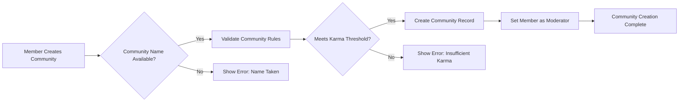
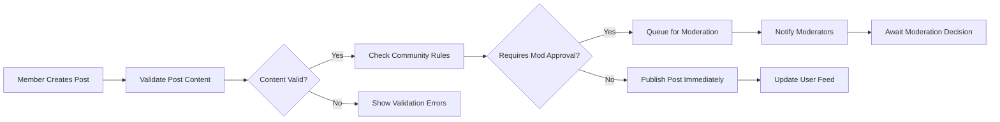
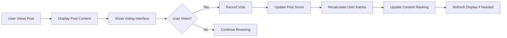

# Functional Requirements Specification for Community Platform

## 1. Introduction and Overview

This document defines the complete functional requirements for the Reddit-like community platform. The platform enables users to create communities, share content, engage in discussions, and build reputation through a karma system. All requirements are written using EARS (Easy Approach to Requirements Syntax) format to ensure clarity and testability.

### 1.1 Platform Vision
The community platform provides a space for users to connect around shared interests, engage in meaningful discussions, and build communities around topics they care about. The system prioritizes user-generated content, democratic content curation through voting, and community-driven moderation.

### 1.2 Core Features Overview
The platform includes the following key functional areas:
- Community creation and management
- Content posting and organization
- Voting and ranking algorithms
- User interaction and engagement
- Content moderation and reporting

## 2. Community Management Features

### 2.1 Community Creation
WHEN an authenticated member creates a new community, THE system SHALL validate community name availability and create the community with the member as the first moderator.

**Business Rules:**
- Community names must be unique across the platform
- Community names must be between 3-21 characters
- Community names can contain letters, numbers, and hyphens
- Community descriptions can be up to 500 characters
- Community creation requires minimum karma threshold (configurable)

### 2.2 Community Subscription
WHEN a member subscribes to a community, THE system SHALL add the community to the member's subscription list and include its content in their personalized feed.

**Subscription Management:**
- Members can subscribe/unsubscribe from communities
- Subscription count is visible on community pages
- Subscribed communities appear in the member's navigation
- Feed prioritizes content from subscribed communities

### 2.3 Community Moderation
WHILE a member is a moderator of a community, THE system SHALL provide moderation tools for content management and community settings.

**Moderator Capabilities:**
- Approve/remove posts and comments
- Manage community rules and description
- Assign additional moderators
- Handle user reports within the community
- Configure community-specific settings



## 3. Content Creation and Management

### 3.1 Post Creation
WHEN a member creates a post in a community, THE system SHALL validate content and publish the post according to community rules.

**Post Types and Requirements:**
- **Text Posts**: Require title (3-300 characters) and body content (optional)
- **Link Posts**: Require title and valid URL
- **Image Posts**: Require title and valid image upload
- All posts must comply with community and platform rules

### 3.2 Post Visibility and Access
THE system SHALL display posts according to user permissions and community visibility settings.

**Visibility Rules:**
- Public communities: Posts visible to all users
- Restricted communities: Posts visible to subscribers only
- Private communities: Posts visible to approved members only
- Posts from banned users are hidden from public view

### 3.3 Content Editing and Deletion
WHEN a member edits their post, THE system SHALL track edit history and display "edited" indicator.

**Editing Rules:**
- Members can edit their own posts within 24 hours of creation
- Edited posts show revision history to moderators
- Members can delete their own posts at any time
- Deleted posts are removed from public view but retained for moderation



## 4. Voting and Ranking System

### 4.1 Post Voting
WHEN a member votes on a post, THE system SHALL record the vote and update the post's score.

**Voting Rules:**
- Members can upvote or downvote posts
- Members cannot vote on their own posts
- Vote changes are allowed within 24 hours
- Vote score affects post ranking and user karma

### 4.2 Comment Voting
WHEN a member votes on a comment, THE system SHALL record the vote and update the comment's score.

**Comment Voting Rules:**
- Same voting rules as posts apply to comments
- Comment scores affect comment sorting within threads
- High-scoring comments receive visual prominence

### 4.3 Content Sorting Algorithms
THE system SHALL provide multiple sorting options for content display.

**Sorting Methods:**
- **Hot**: Combination of votes, comments, and time decay
- **New**: Chronological order, newest first
- **Top**: Highest vote score within time period (day/week/month/year/all)
- **Controversial**: High engagement with mixed votes
- **Rising**: Recently popular content gaining traction

**Hot Algorithm Formula:**
```
hot_score = (log10(votes) + (comments / 10) + age_in_hours) / time_decay_factor
```

## 5. User Interaction Features

### 5.1 Comment System
WHEN a member comments on a post, THE system SHALL create a comment thread with proper nesting.

**Comment Features:**
- Members can comment on posts and other comments
- Comments support nested replies up to 10 levels deep
- Comment formatting supports markdown
- Comments can be edited within 1 hour of posting
- Deleted comments show "[deleted]" placeholder

### 5.2 User Karma System
THE system SHALL calculate user karma based on voting activity and content quality.

**Karma Calculation:**
- Post karma: Upvotes minus downvotes on user's posts
- Comment karma: Upvotes minus downvotes on user's comments
- Award karma: Special awards from other users
- Karma decay: Older contributions weigh less over time

### 5.3 User Profiles
THE system SHALL display comprehensive user profiles showing activity and statistics.

**Profile Information:**
- User join date and karma breakdown
- Recent posts and comments
- Top communities by participation
- Trophy case for achievements
- User preferences and settings



## 6. Moderation and Reporting System

### 6.1 Content Reporting
WHEN a user reports inappropriate content, THE system SHALL queue the report for moderator review.

**Reporting Workflow:**
- Users can report posts, comments, or users
- Reports include reason selection and optional details
- Reports are prioritized by severity and frequency
- Moderators receive notification of new reports

### 6.2 Moderation Actions
WHEN a moderator reviews reported content, THE system SHALL provide appropriate moderation tools.

**Moderation Options:**
- Remove content with removal reason
- Approve content and dismiss report
- Ban user from community
- Escalate to platform administrators
- Apply temporary restrictions

### 6.3 Automated Content Filtering
THE system SHALL automatically filter content based on community rules and platform guidelines.

**Filtering Mechanisms:**
- Keyword filtering for prohibited content
- Spam detection based on posting patterns
- Duplicate content detection
- Rate limiting for new users

## 7. Integration Requirements

### 7.1 Authentication Integration
THE functional features SHALL integrate seamlessly with the platform's authentication system.

**Integration Points:**
- User actions require valid authentication
- Permission checks based on user roles
- Session management for continuous interaction
- Secure token validation for API calls

### 7.2 Data Consistency
THE system SHALL maintain data consistency across all functional areas.

**Consistency Requirements:**
- Vote counts must match actual votes
- Karma calculations must be accurate and timely
- Content statistics must reflect current state
- User activity must be properly tracked

## 8. Performance and Scalability Requirements

### 8.1 Response Time Requirements
THE system SHALL provide responsive user experience across all functional areas.

**Performance Targets:**
- Page load time: Under 2 seconds
- Vote recording: Under 200 milliseconds
- Comment posting: Under 500 milliseconds
- Feed generation: Under 1 second
- Search results: Under 1.5 seconds

### 8.2 Scalability Considerations
THE system SHALL handle increasing user load without degradation.

**Scalability Requirements:**
- Support 10,000 concurrent users
- Handle 100 posts per minute during peak
- Process 1,000 votes per minute
- Support 10,000 community subscriptions per user
- Maintain performance with 1 million+ posts

## 9. Error Handling and User Experience

### 9.1 Error Scenarios
IF the system encounters an error during user interaction, THEN THE system SHALL provide clear error messages and recovery options.

**Common Error Handling:**
- Network connectivity issues
- Permission denied errors
- Content validation failures
- Rate limiting exceeded
- System maintenance periods

### 9.2 User Feedback
THE system SHALL provide appropriate feedback for user actions.

**Feedback Mechanisms:**
- Success confirmation for completed actions
- Progress indicators for lengthy operations
- Warning messages for potentially destructive actions
- Help text and guidance for complex features

## 10. Business Rules Summary

### 10.1 Content Guidelines
- All content must comply with platform terms of service
- Communities can establish additional rules
- Prohibited content includes harassment, spam, and illegal material
- Age-restricted content requires proper labeling

### 10.2 User Behavior Rules
- Users must respect community guidelines
- Vote manipulation is strictly prohibited
- Multiple accounts for circumventing restrictions are not allowed
- Constructive criticism is encouraged; personal attacks are not

### 10.3 Moderation Principles
- Moderation should be fair and consistent
- Clear communication for moderation actions
- Appeal process for disputed moderation decisions
- Transparency in community rule enforcement

> *Developer Note: This document defines **business requirements only**. All technical implementations (architecture, APIs, database design, etc.) are at the discretion of the development team.*