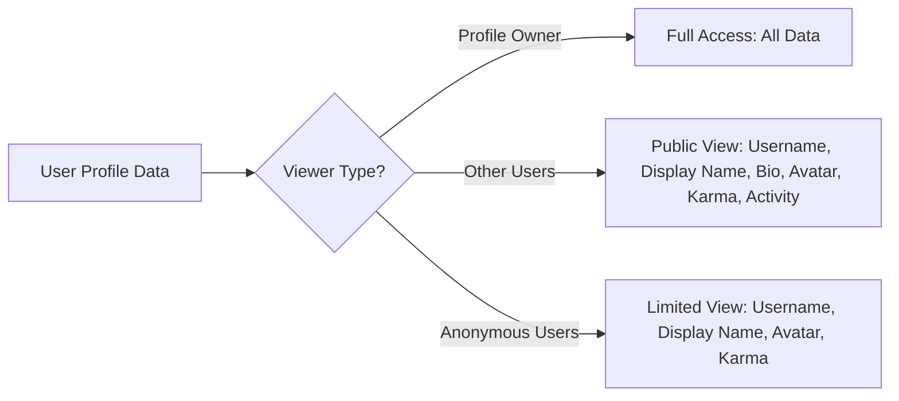
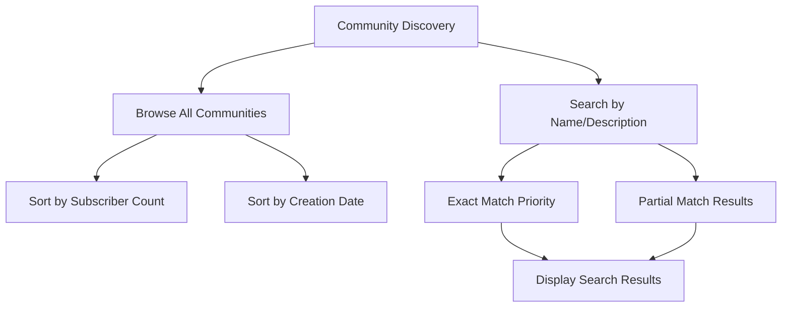
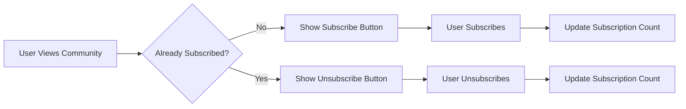
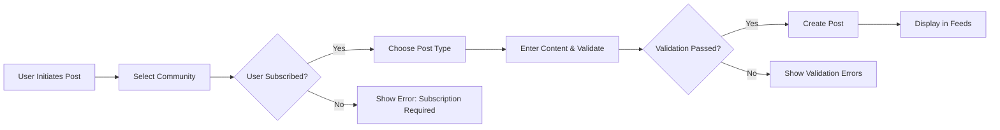
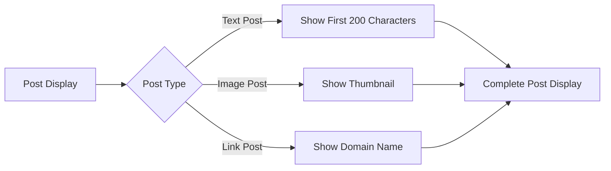
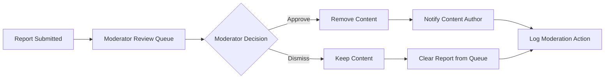

# Reddit-like Community Platform Requirements Specification

## Executive Summary

This document provides complete business requirements for a Reddit-like community platform that enables users to create communities, share content, engage through voting systems, and build reputation through karma scoring. The platform supports comprehensive moderation tools, multi-tier feed systems, and robust user management capabilities.

## User Account Management System

### Account Creation Requirements

**WHEN** a user registers for an account, **THE** system **SHALL** require:
- Valid email address for account verification
- Unique username meeting character requirements (3-20 alphanumeric characters)
- Secure password meeting complexity requirements (minimum 8 characters with uppercase, lowercase, number, and special character)

**THE** registration process **SHALL** include email verification before full account activation.

### Authentication Requirements

**WHEN** users log in, **THE** system **SHALL** authenticate using email and password credentials.
**THE** system **SHALL** implement JWT-based session management with proper token expiration.
**WHERE** authentication fails, **THE** system **SHALL** implement rate limiting to prevent brute force attacks.

### Account Management

**USERS** **SHALL** be able to change their password with current password verification.
**WHEN** a user deletes their account, **THE** system **SHALL** remove all associated content including posts, comments, and profile information.
**THE** account deletion process **SHALL** include a 14-day grace period for recovery.

## User Profile Management System

### Profile Structure Requirements

**EACH** user profile **SHALL** contain the following information:
- Display name (editable, maximum 50 characters)
- Bio text (optional, maximum 500 characters)
- Avatar image (optional, maximum 2MB, supported formats: JPG, PNG, GIF)

**THE** profile **SHALL** automatically track and display:
- Account creation date
- Total karma score
- Post creation count
- Comment creation count

### Profile Viewing and Editing

**ALL** users **SHALL** be able to view any other user's public profile information.
**PROFILE** owners **SHALL** have full editing rights to their display name, bio, and avatar.
**PROFILE** changes **SHALL** take effect immediately across the platform.

### Profile Visibility Rules

## Karma Scoring System

### Karma Calculation Rules

**WHEN** another user upvotes a post or comment, **THE** content creator's karma **SHALL** increase by 1 point.
**WHEN** another user downvotes a post or comment, **THE** content creator's karma **SHALL** decrease by 1 point.
**WHEN** a user changes their vote, **THE** karma **SHALL** adjust by the net vote change (-2 for upvote→downvote, +2 for downvote→upvote).

### Karma System Properties

**THE** karma score **SHALL** be capable of reaching negative values.
**KARMA** updates **SHALL** occur in real-time as voting actions happen.
**THE** system **SHALL** display karma scores on user profiles and next to usernames throughout the platform.

## Community Management System

### Community Creation Rules

**ANY** authenticated user **SHALL** be able to create a community.
**COMMUNITY** names **SHALL** be unique across the platform and meet formatting requirements (3-21 alphanumeric characters with hyphens/underscores).
**THE** community creator **SHALL** automatically become the community owner with full administrative rights.

### Community Properties

**EACH** community **SHALL** have:
- Unique name identifier
- Display name
- Description text (maximum 500 characters)
- Optional icon image
- Public subscriber count
- Creation timestamp

### Community Discovery

## Subscription System

### Subscription Requirements

**USERS** **SHALL** be able to subscribe to any community.
**SUBSCRIBING** to a community **SHALL** be required for creating posts in that community.
**USERS** **SHALL** be able to unsubscribe from communities at any time.

### Subscription Process

## Post Management System

### Post Types and Requirements

**THE** platform **SHALL** support three post types:

**Text Posts:**
- **REQUIRE** title and text content
- **SUPPORT** rich text formatting
- **MAXIMUM** content length: 40,000 characters

**Link Posts:**
- **REQUIRE** title and valid URL
- **VALIDATE** URL format and extract domain information
- **PREVENT** duplicate link submissions

**Image Posts:**
- **REQUIRE** title and image file
- **VALIDATE** file type (JPG, PNG, GIF, WebP)
- **ENFORCE** maximum file size: 10MB
- **GENERATE** thumbnails for feed display

### Post Creation Workflow

### Post Editing and Deletion

**USERS** **SHALL** be able to edit their own posts within 24 hours of creation.
**POST** authors **SHALL** be able to delete their posts, removing all associated content.
**MODERATORS** **SHALL** have authority to delete any post within their community.

## Voting System

### Vote Mechanics

**EACH** user **SHALL** have exactly one vote per content item (post or comment).
**USERS** **SHALL** be able to upvote, downvote, or remove their vote.
**VOTE** scores **SHALL** calculate as total upvotes minus total downvotes.

### Vote Change Rules

**WHEN** a user changes from upvote to downvote, **THE** score **SHALL** decrease by 2.
**WHEN** a user changes from downvote to upvote, **THE** score **SHALL** increase by 2.
**WHEN** a user removes their vote, **THE** score **SHALL** adjust by the inverse of their previous vote.

### Anti-Gaming Measures

**THE** system **SHALL** prevent users from voting on their own content.
**VOTE** manipulation detection **SHALL** monitor for suspicious voting patterns.
**RATE** limiting **SHALL** prevent excessive voting from individual users.

## Feed Management System

### Feed Types and Access

**Home Feed:**
- **SHOWS** posts only from subscribed communities
- **REQUIRES** user authentication
- **SUPPORTS** all sorting algorithms

**Popular Feed:**
- **SHOWS** posts from all communities
- **ACCESSIBLE** to all users (including logged-out)
- **DISPLAYS** platform-wide content

**Community Feed:**
- **SHOWS** posts from a single community
- **ACCESSIBLE** to all users
- **RESPECTS** community privacy settings

### Sorting Algorithms

**Hot Sorting:**
- **PRIORITIZES** recent posts with high engagement
- **USES** time decay algorithm balancing recency and popularity

**New Sorting:**
- **DISPLAYS** posts in reverse chronological order
- **SHOWS** most recently created posts first

**Top Sorting:**
- **RANKS** posts by vote score (highest first)
- **SUPPORTS** time filters: today, week, month, year, all-time

**Controversial Sorting:**
- **HIGHLIGHTS** posts with many votes but scores near zero
- **IDENTIFIES** contentious discussion topics

### Post Display Requirements

**WHEN** displaying posts in feeds, **THE** system **SHALL** show:
- Post title
- Author username
- Community name
- Vote score
- Comment count
- Time since posting
- Content preview (type-specific)

## Comment System

### Comment Creation Rules

**AUTHENTICATED** users **SHALL** be able to comment on any post.
**COMMENTS** **SHALL** support unlimited nesting depth through threaded replies.
**COMMENT** content **SHALL** have minimum 1 character and maximum 10,000 characters.

### Comment Structure

**EACH** comment **SHALL** maintain:
- Parent post reference
- Parent comment reference (for nesting)
- Author information
- Creation and edit timestamps
- Vote score
- Depth level indicator
- Path identifier for hierarchical traversal

### Comment Management

**USERS** **SHALL** be able to edit their comments within 24 hours of creation.
**COMMENT** authors **SHALL** be able to delete their comments.
**MODERATORS** **SHALL** have authority to delete any comment within their community.

### Comment Sorting Options

**Best Sort:**
- **USES** Wilson score confidence interval
- **BALANCES** vote score and engagement
- **PREVENTS** new comments from dominating

**New Sort:**
- **DISPLAYS** comments in chronological order
- **SHOWS** most recent comments first

**Controversial Sort:**
- **PRIORITIZES** comments with balanced voting
- **HIGHLIGHTS** divisive discussions

## Moderation System

### Moderator Hierarchy

**Community Owner:**
- **HAS** ultimate authority over the community
- **CAN** appoint and remove moderators
- **CAN** perform all moderation actions

**Community Moderator:**
- **APPOINTED** by owner or existing moderators
- **CAN** perform content moderation actions
- **CANNOT** remove other moderators or owner

### Moderation Permissions

**MODERATORS** **SHALL** be able to:
- Delete any post or comment within their community
- Ban users from their community
- View and manage reported content
- Access moderation logs and statistics

### User Banning System

**MODERATORS** **SHALL** be able to ban users with specified durations:
- Temporary bans: 1, 3, 7, 14, or 30 days
- Permanent bans: indefinite duration

**BANNED** users **SHALL** retain read-only access to community content.
**BAN** notifications **SHALL** include reason and duration information.

## Reporting System

### Report Creation Process

**WHEN** users identify inappropriate content, **THE** system **SHALL** provide reporting functionality.
**REPORTS** **SHALL** require selection from predefined categories:
- Harassment or bullying
- Hate speech
- Spam or promotional content
- Misinformation
- Inappropriate content
- Copyright infringement
- Other (requires additional details)

### Report Review Workflow

### Report Management

**MODERATORS** **SHALL** see all reports for their communities in a dedicated interface.
**EACH** report **SHALL** display:
- Reported content
- Reporter information
- Report reason and timestamp
- Report status (pending, approved, dismissed)

**THE** system **SHALL** prevent report spam through rate limiting and user accountability tracking.

## System Performance Requirements

### Response Time Standards

**PAGE** loads **SHALL** complete within 2 seconds for 95% of requests.
**VOTE** actions **SHALL** register and display updated scores within 500 milliseconds.
**COMMENT** posting **SHALL** show the new comment within 1 second.
**FEED** generation **SHALL** complete within 3 seconds even with large datasets.

### Scalability Requirements

**THE** system **SHALL** support:
- 10,000 concurrent users
- 1 million posts and 10 million comments
- 1,000 votes per second peak load
- Efficient pagination with cursor-based navigation

## Security and Compliance

### Data Protection

**USER** email addresses **SHALL** never be displayed publicly.
**PASSWORD** storage **SHALL** use industry-standard hashing with salt.
**USER** session data **SHALL** be encrypted in transit and at rest.

### Content Security

**UPLOADED** images **SHALL** be scanned for malicious content.
**URL** validation **SHALL** prevent phishing and malicious link posting.
**USER**-generated content **SHALL** be sanitized to prevent XSS attacks.

### Legal Compliance

**THE** system **SHALL** maintain audit logs of all moderation actions.
**CONTENT** removal **SHALL** preserve evidence for legal requirements.
**USER** reports **SHALL** be retained for 90 days for dispute resolution.

## Business Rules Summary

### Core Platform Rules
1. User registration requires email verification
2. Community subscription required for post creation
3. Single vote per user per content item
4. Real-time karma updates based on voting
5. Unlimited comment nesting with proper threading

### Moderation Rules
1. Community owners have ultimate authority
2. Moderators can delete content and ban users
3. Reporting system requires specific reason categories
4. Ban decisions include duration and reason
5. All moderation actions are logged for accountability

### Content Management Rules
1. Three post types with specific validation requirements
2. Post editing available for 24 hours after creation
3. Comment editing available with time limits
4. Feed algorithms prioritize engagement and recency
5. Content deletion follows specific cascade rules

This comprehensive requirements specification provides the complete business foundation for developing a Reddit-like community platform with robust functionality, scalable architecture, and comprehensive moderation capabilities.