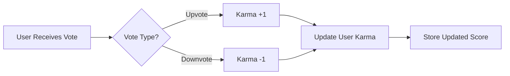

# User Profile Management Specification

## Introduction and Overview

The User Profile Management system provides comprehensive functionality for users to create, manage, and view profiles within the Reddit-like community platform. This document specifies the business requirements for user profiles, karma scoring, and content history display.

### Purpose
- Enable users to establish their identity and reputation within the community
- Provide mechanisms for users to manage their personal information
- Display user contributions and reputation through karma scoring
- Support community engagement through profile visibility

### Scope
This specification covers all aspects of user profile management including:
- Profile creation and initial setup
- Profile editing and self-management
- Public profile viewing capabilities
- Karma score calculation and display
- Content history organization and presentation

## Profile Creation and Setup

### Initial Profile Creation
WHEN a user successfully registers with email and password, THE system SHALL automatically create a basic user profile with default values.

### Profile Data Structure
Each user profile SHALL contain the following required information:
- **Display Name**: User-chosen public display name (required, 2-50 characters)
- **Bio Text**: Optional biography text (maximum 500 characters)
- **Avatar Image**: Optional profile picture (supported formats: JPG, PNG, WebP)
- **Username**: Unique identifier chosen during registration
- **Email Address**: Primary contact and authentication email
- **Registration Date**: Date and time when account was created
- **Karma Score**: Numeric reputation score (initial value: 0)

### Profile Validation Rules
THE system SHALL enforce the following validation rules during profile creation:
- Display name must be unique across all users
- Username must be unique and contain only alphanumeric characters and underscores
- Email address must be valid and unique
- Bio text must not exceed 500 characters
- Avatar image must be under 5MB in size

## Profile Editing Capabilities

### Self-Management Features
Users SHALL be able to edit their own profile information through a dedicated profile management interface.

### Editing Workflows
**WHEN** a user accesses their profile editing interface, **THE** system **SHALL** provide the following editing capabilities:
- Update display name (subject to uniqueness validation)
- Modify bio text with real-time character count
- Upload new avatar image with preview functionality
- Change email address (requires email verification)
- Update password (requires current password confirmation)

### Real-time Validation
**WHILE** a user is editing their profile, **THE** system **SHALL** provide immediate feedback on:
- Display name availability
- Bio text character count
- Avatar image format and size validation
- Email format verification

### Save and Confirmation
**WHEN** a user saves profile changes, **THE** system **SHALL**:
- Validate all input data
- Apply changes immediately upon successful validation
- Display confirmation message
- Log the profile modification activity

## Public Profile Viewing

### Profile Visibility
All user profiles **SHALL** be publicly viewable to both authenticated and unauthenticated users.

### Profile Page Content
**WHEN** viewing any user's profile page, **THE** system **SHALL** display:
- User's display name prominently
- Avatar image (if set)
- Bio text (if provided)
- Current karma score
- Account creation date
- Total number of posts created
- Total number of comments written

### Content Organization
**THE** profile page **SHALL** organize user content into two main sections:

#### Posts Section
- Display all posts created by the user
- Show post title, community name, vote score, and creation time
- Provide pagination for posts (20 items per page)
- Include sorting options: newest first, highest scoring

#### Comments Section
- Display all comments written by the user
- Show comment content preview, post title, vote score, and creation time
- Provide pagination for comments (25 items per page)
- Include sorting options: newest first, highest scoring

### Content Filtering
**WHERE** content filtering is available, **THE** system **SHALL** provide options to:
- Filter by community
- Filter by time range (today, this week, this month, all time)
- Search within user's content

## Karma Score System

### Karma Calculation Logic
**THE** karma score **SHALL** represent the user's reputation within the community and **SHALL** be calculated as follows:

### Vote Impact Rules
**WHEN** someone upvotes a user's post or comment, **THE** system **SHALL** increase the user's karma by 1.

**WHEN** someone downvotes a user's post or comment, **THE** system **SHALL** decrease the user's karma by 1.

**WHEN** someone removes their vote from a user's post or comment, **THE** system **SHALL** adjust the user's karma accordingly (+1 for removed upvote, -1 for removed downvote).

### Karma Display Rules
**THE** karma score **SHALL**:
- Be displayed as a single numeric value
- Support negative values (can go below zero)
- Update in real-time as votes are cast or removed
- Be visible on the user's profile page and next to their username throughout the platform

### Karma Integrity
**THE** system **SHALL** ensure karma score integrity by:
- Preventing users from voting on their own content
- Enforcing one vote per user per content item
- Maintaining audit trail of all karma changes
- Preventing karma manipulation through automated processes

## Content History Display

### Posts Display Requirements
**WHEN** displaying a user's posts on their profile, **THE** system **SHALL** show for each post:
- Post title (clickable link to full post)
- Community name with link to community
- Current vote score
- Number of comments
- Time since posting (e.g., "3 hours ago")
- Content preview based on post type:
  - **Text posts**: First 200 characters of content
  - **Image posts**: Thumbnail of the image
  - **Link posts**: Domain name of the URL (e.g., "youtube.com")

### Comments Display Requirements
**WHEN** displaying a user's comments on their profile, **THE** system **SHALL** show for each comment:
- Comment content (truncated to 150 characters with "read more" option)
- Post title with link to the full post
- Current vote score of the comment
- Time since comment was posted
- Community name where the comment was made

### Pagination and Performance
**THE** content history display **SHALL** implement pagination with the following requirements:
- Posts: 20 items per page
- Comments: 25 items per page
- Load additional pages via "Load More" functionality
- Display loading indicators during content retrieval
- Cache frequently accessed profile content for performance

### Sorting Options
Users **SHALL** be able to sort their content history by:
- **Newest**: Most recent content first
- **Oldest**: Earliest content first
- **Highest Scoring**: Content with highest vote score first
- **Most Commented**: Posts with most comments first

## Error Handling Scenarios

### Profile Editing Errors
**IF** a user attempts to save invalid profile data, **THEN THE** system **SHALL**:
- Display specific error messages for each validation failure
- Highlight the problematic fields
- Preserve user's input data
- Provide clear instructions for correction

### Content Display Errors
**IF** content cannot be loaded for a user's profile, **THEN THE** system **SHALL**:
- Display appropriate error message
- Provide retry mechanism
- Log the error for system monitoring
- Gracefully degrade the user experience

### Karma Calculation Errors
**IF** karma calculation encounters an error, **THEN THE** system **SHALL**:
- Maintain the last known valid karma score
- Queue the karma update for retry
- Notify system administrators of calculation failures
- Ensure data consistency through transaction rollback

## Performance Requirements

### Response Time Expectations
**THE** system **SHALL** meet the following performance requirements:
- Profile page load: Under 2 seconds for authenticated users
- Profile editing: Save operations complete within 1 second
- Content history loading: Additional pages load within 1.5 seconds
- Karma updates: Real-time updates process within 500 milliseconds

### Scalability Considerations
**THE** profile management system **SHALL** be designed to handle:
- Concurrent profile views from multiple users
- High-frequency karma updates during peak activity
- Efficient pagination for users with extensive content history
- Caching of frequently accessed profile data

### Data Integrity
**THE** system **SHALL** ensure data integrity through:
- Atomic transactions for karma updates
- Consistent data validation across all profile operations
- Regular backup of user profile data
- Conflict resolution for concurrent profile edits

## User Experience Guidelines

### Profile Completion Encouragement
**THE** system **SHALL** encourage users to complete their profiles by:
- Displaying profile completion percentage
- Highlighting the benefits of a complete profile
- Providing easy access to profile editing
- Showing examples of well-completed profiles

### Accessibility Requirements
**THE** profile interface **SHALL** be accessible to users with disabilities by:
- Supporting screen readers for all profile content
- Providing keyboard navigation for all profile functions
- Ensuring sufficient color contrast for all text elements
- Offering alternative text for avatar images

### Mobile Responsiveness
**THE** profile management interface **SHALL** provide optimal experience on mobile devices through:
- Responsive design that adapts to screen size
- Touch-friendly interface elements
- Efficient data loading for mobile networks
- Offline capability for basic profile viewing

> *Developer Note: This document defines **business requirements only**. All technical implementations (architecture, APIs, database design, etc.) are at the discretion of the development team.*