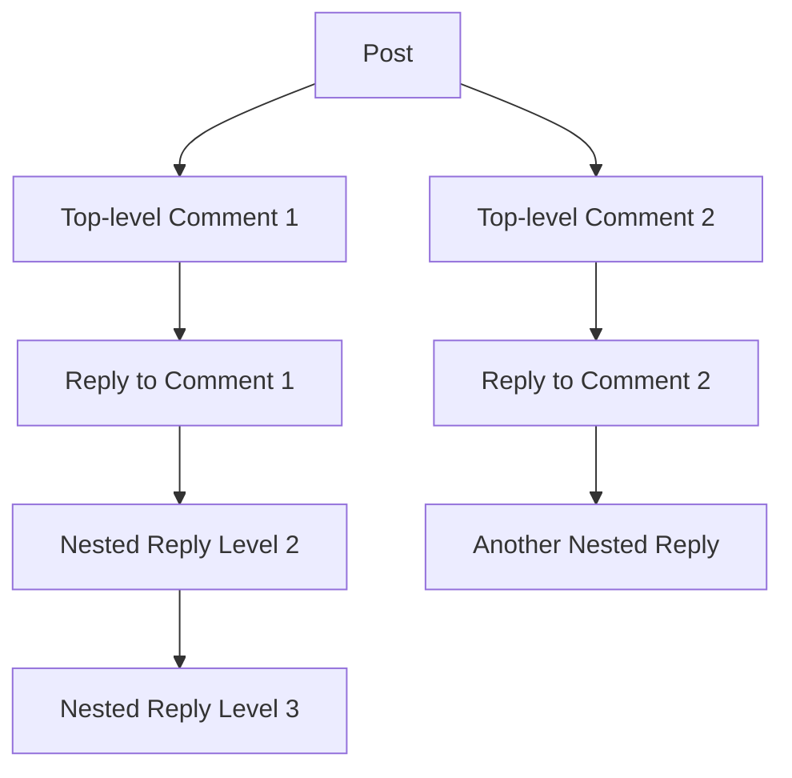

# Comment System Requirements Specification

## Executive Summary

This document specifies the requirements for the threaded comment system that enables rich discussions and nested conversations within the Reddit-like community platform. The comment system supports hierarchical replies, voting mechanisms, moderation workflows, and real-time user interactions that form the core of community engagement.

## Comment Creation & Structure

### Comment Creation Requirements

WHEN a member creates a comment on a post, THE system SHALL validate the comment content and associate it with the correct post and parent comment if applicable.

THE comment creation process SHALL support the following content types:
- Text comments with markdown formatting support
- Maximum comment length of 10,000 characters
- Basic formatting options (bold, italic, code blocks, links)

WHEN creating a comment, THE system SHALL enforce the following validation rules:
- Comments cannot be empty
- Comments must not exceed character limit
- Comments must not contain prohibited content patterns
- Comments must be associated with an existing post

### Comment Hierarchy Structure

THE comment system SHALL support nested replies with the following hierarchy structure:

THE system SHALL support comment nesting up to 10 levels deep to prevent infinite nesting while maintaining conversation readability.

### Comment Data Structure Requirements

Each comment SHALL contain the following metadata:
- Unique comment identifier
- Author user ID
- Parent post ID
- Parent comment ID (for nested replies)
- Creation timestamp
- Last edit timestamp
- Vote count (upvotes minus downvotes)
- Total vote count (upvotes plus downvotes)
- Comment content
- Edit history (if applicable)
- Moderation status

## Nested Reply System

### Reply Creation Requirements

WHEN a member replies to an existing comment, THE system SHALL create a nested comment that maintains the conversation hierarchy.

THE reply system SHALL support the following functionality:
- Members can reply to any comment in the thread
- Replies maintain the parent-child relationship
- The nesting level is visually indicated to users
- Deeply nested comments are collapsible for better readability

### Thread Management Requirements

THE system SHALL provide thread management features including:
- Collapsing/expanding comment threads
- Highlighting new comments since last visit
- Sorting comments by various criteria (newest, top voted, controversial)
- Pagination for long comment threads

### Real-time Comment Updates

WHILE users are viewing a comment thread, THE system SHALL provide real-time updates for:
- New comments being added to the thread
- Vote count changes on existing comments
- Comment edits and deletions
- Moderation actions affecting comments

## Comment Voting System

### Voting Mechanism Requirements

WHEN a member votes on a comment, THE system SHALL record the vote and update the comment's score immediately.

THE voting system SHALL support:
- Upvotes to indicate agreement or appreciation
- Downvotes to indicate disagreement or poor quality
- Each member can only vote once per comment
- Members can change their vote at any time
- Members cannot vote on their own comments

### Vote Counting Algorithm

THE vote counting algorithm SHALL:
- Calculate net score as upvotes minus downvotes
- Display total vote count (upvotes + downvotes)
- Apply vote weighting based on comment age (hot algorithm)
- Prevent vote manipulation through rate limiting

### Karma Integration

WHEN a comment receives votes, THE comment author's karma SHALL be affected as follows:
- Each upvote on a comment adds +1 karma to the author
- Each downvote on a comment subtracts -1 karma from the author
- Karma changes are applied in real-time
- Deleted comments do not affect karma

## Comment Moderation

### Moderation Actions

WHEN a moderator reviews a comment, THE system SHALL provide the following moderation actions:
- Approve comment (make visible)
- Remove comment (hide from public view)
- Lock comment (prevent further replies)
- Distinguish comment (highlight as moderator)
- Apply user bans based on comment violations

### Reporting System Integration

WHEN a user reports a comment, THE system SHALL:
- Record the report with reason and reporter information
- Notify moderators of the reported comment
- Track report status (pending, reviewed, action taken)
- Provide reporting guidelines to users

### Automated Moderation

THE system SHALL implement automated moderation features including:
- Spam detection based on content patterns
- Rate limiting for comment frequency
- Profanity filtering with customizable word lists
- Duplicate content detection
- Suspicious activity alerts

## User Interaction Features

### Comment Editing

WHEN a member edits their comment, THE system SHALL:
- Allow editing within 24 hours of original posting
- Maintain edit history for transparency
- Display "edited" indicator on modified comments
- Preserve original content for moderation purposes

### Comment Deletion

WHEN a member deletes their comment, THE system SHALL:
- Remove the comment content from public view
- Preserve the comment structure for thread continuity
- Display "[deleted]" placeholder for deleted comments
- Allow moderators to see original content

### User Engagement Features

THE comment system SHALL support the following user engagement features:
- Comment saving for later reference
- Comment sharing via direct links
- User mentions using @username syntax
- Comment awards and recognition system
- Comment search within threads

## Performance Requirements

### Response Time Expectations

THE comment system SHALL meet the following performance requirements:
- Comment loading: < 2 seconds for threads with up to 500 comments
- Vote processing: < 500 milliseconds response time
- Comment creation: < 1 second for text comments
- Real-time updates: < 100 milliseconds for push notifications

### Scalability Requirements

THE system SHALL be designed to handle:
- Concurrent users: 10,000+ simultaneous comment interactions
- Comment volume: 1,000+ new comments per minute during peak traffic
- Thread depth: Support for threads with 10,000+ comments
- Data storage: Efficient storage and retrieval of comment hierarchies

### Caching Strategy

THE system SHALL implement caching for:
- Frequently accessed comment threads
- User vote history
- Moderator action logs
- Comment sorting algorithms

## Error Handling

### User-Facing Error Scenarios

IF a comment fails to post due to validation errors, THEN THE system SHALL display specific error messages indicating the nature of the failure.

Common error scenarios include:
- "Comment is too long" when exceeding character limit
- "Comment contains prohibited content" for filtered content
- "You cannot comment on locked posts" for restricted content
- "Rate limit exceeded" for spam prevention

### System Recovery Requirements

WHEN comment system errors occur, THE system SHALL:
- Preserve comment data integrity
- Provide graceful degradation of features
- Maintain user session continuity
- Log errors for system monitoring

### Data Consistency Requirements

THE comment system SHALL ensure data consistency through:
- Atomic operations for vote counting
- Transactional integrity for nested replies
- Conflict resolution for concurrent edits
- Backup and recovery procedures

## Integration Requirements

### Authentication Integration

THE comment system SHALL integrate with the platform's authentication system to:
- Verify user permissions for comment actions
- Track user activity and reputation
- Enforce community-specific moderation rules
- Maintain user session context

### Notification System Integration

THE comment system SHALL trigger notifications for:
- Replies to user comments
- Mentions using @username syntax
- Moderation actions affecting user comments
- Comment awards and recognition

### Search Integration

THE comment system SHALL support search functionality for:
- Finding comments by specific users
- Searching comment content across the platform
- Filtering comments by date, votes, or community
- Advanced search with boolean operators

## Business Rules and Validation

### Comment Quality Guidelines

WHEN users create comments, THE system SHALL encourage quality content through:
- Minimum character requirements for substantive comments
- Encouragement of constructive discussion
- Prevention of spam and low-effort comments
- Promotion of community-specific discussion norms

### User Behavior Rules

THE system SHALL implement behavior rules including:
- Rate limiting to prevent comment spam
- Content quality thresholds for new users
- Progressive trust building for established contributors
- Automated quality assessment for comment ranking

### Community-Specific Rules

WHERE communities have specific commenting guidelines, THE system SHALL:
- Display community rules during comment creation
- Enforce community-specific moderation standards
- Support custom comment formatting requirements
- Implement community voting weight algorithms

## Security Requirements

### Content Security

THE comment system SHALL implement security measures including:
- Input sanitization to prevent XSS attacks
- Content filtering for malicious code
- User authentication verification for all actions
- Secure transmission of comment data

### User Privacy

WHEN handling user comments, THE system SHALL:
- Protect user privacy according to platform policies
- Implement appropriate data retention policies
- Support user deletion requests
- Maintain audit trails for compliance

### Moderation Security

THE moderation system SHALL ensure:
- Secure access to moderation tools
- Audit trails for all moderation actions
- Protection against moderator abuse
- Escalation paths for contentious decisions

## Success Metrics

### Performance Metrics

THE comment system SHALL track the following performance indicators:
- Average comment load time
- Comment creation success rate
- Vote processing accuracy
- Real-time update reliability

### Engagement Metrics

THE system SHALL monitor engagement metrics including:
- Comments per post ratio
- Reply depth distribution
- User participation rates
- Comment quality scores

### Quality Metrics

THE platform SHALL measure comment system quality through:
- User satisfaction with commenting experience
- Moderation effectiveness rates
- Spam detection accuracy
- Content quality assessments

> *Developer Note: This document defines **business requirements only**. All technical implementations (architecture, APIs, database design, etc.) are at the discretion of the development team.*