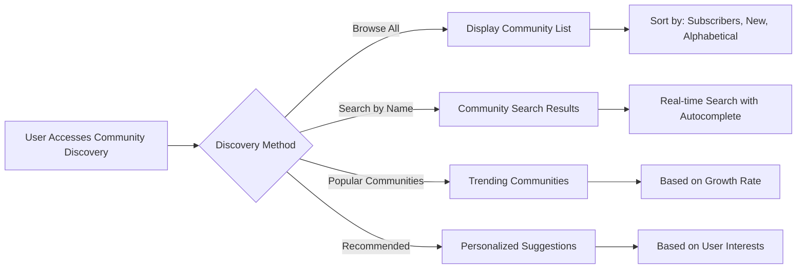
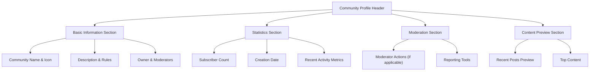

# Community Management Requirements Specification

## Introduction

This document defines the complete community management system for the Reddit-like community platform. Communities serve as the foundational organizational units where users create content, interact, and build communities around shared interests.

## Community Creation Process

### Community Creation Requirements

**WHEN** a user wants to create a new community, **THE** system **SHALL** provide a community creation interface with required fields.

**THE** community creation process **SHALL** require the following information:
- Unique community name (required, must be unique across platform)
- Community description text (required, minimum 10 characters)
- Community icon image (optional, supported formats: JPG, PNG, WebP)

**IF** a user attempts to create a community with a name that already exists, **THEN THE** system **SHALL** display an error message and require a unique name.

**WHEN** a community is successfully created, **THE** creating user **SHALL** automatically become the community owner with full administrative privileges.

### Community Name Validation Rules

**THE** community name **SHALL** adhere to the following validation rules:
- Minimum length: 3 characters
- Maximum length: 21 characters
- Allowed characters: letters, numbers, underscores, hyphens
- Must start with a letter
- Must be unique across the entire platform
- Cannot contain spaces or special characters

### Community Description Requirements

**THE** community description **SHALL** have the following constraints:
- Minimum length: 10 characters
- Maximum length: 500 characters
- Supports markdown formatting for rich text
- Must provide meaningful context about the community's purpose

## Community Browsing and Search Functionality

### Community Discovery

**WHEN** users browse the platform, **THE** system **SHALL** provide multiple ways to discover communities:

### Community List Display

**WHEN** viewing a community list, **THE** system **SHALL** display the following information for each community:
- Community name
- Community icon (if available)
- Community description (truncated to 150 characters)
- Subscriber count
- Date created
- Community owner username

**THE** community list **SHALL** support the following sorting options:
- **Subscriber count** (highest first)
- **New communities** (most recently created first)
- **Alphabetical order** (A-Z)
- **Active communities** (based on recent post activity)

### Community Search Requirements

**WHEN** users search for communities, **THE** system **SHALL** provide real-time search functionality with the following capabilities:

**THE** search system **SHALL**:
- Support partial name matching
- Provide search suggestions as users type
- Search community names and descriptions
- Display results with relevance scoring
- Support pagination for large result sets

**WHEN** search returns multiple results, **THE** system **SHALL** prioritize:
- Exact name matches first
- Communities with higher subscriber counts
- Active communities with recent content

## Subscription Management System

### Subscription Requirements

**WHEN** a user wants to subscribe to a community, **THE** system **SHALL** provide a clear subscription mechanism.

**THE** subscription process **SHALL**:
- Allow any authenticated user to subscribe to any public community
- Require subscription for posting in that community
- Track subscription status per user per community
- Update subscriber counts in real-time

### Subscription Prerequisites for Posting

**WHEN** a user attempts to create a post in a community, **THE** system **SHALL** verify subscription status.

**IF** a user is not subscribed to the target community, **THEN THE** system **SHALL**:
- Prevent post creation
- Display a message explaining subscription requirement
- Provide a one-click subscription option
- Redirect to subscription flow if user chooses to subscribe

### Subscription Management Interface

**WHEN** users manage their subscriptions, **THE** system **SHALL** provide:
- A comprehensive list of all subscribed communities
- Ability to unsubscribe from any community with one click
- Search functionality within subscribed communities
- Sorting options (alphabetical, subscription date, activity level)

**THE** subscription management interface **SHALL** display:
- Community name and icon
- Subscription date
- Recent activity indicator
- Quick unsubscribe option

### Subscription Statistics

**THE** system **SHALL** maintain and display subscription statistics:
- Total number of communities a user is subscribed to
- Subscription growth trends per community
- Active vs. inactive community indicators
- Recommendations based on subscription patterns

## Community Statistics and Display Requirements

### Community Profile Page

**WHEN** users view a community profile, **THE** system **SHALL** display comprehensive community information:

### Community Statistics Requirements

**THE** community statistics **SHALL** include:
- Current subscriber count
- Total number of posts
- Total number of comments
- Daily active users
- Growth rate (subscribers per day)
- Most active time periods

**WHEN** displaying statistics, **THE** system **SHALL**:
- Update counts in real-time
- Provide historical trends where available
- Show comparative data (platform averages)
- Highlight community growth milestones

### Community Content Display

**WHEN** browsing community content, **THE** system **SHALL** provide:
- Community-specific post feed
- Community rules and guidelines display
- Moderator actions visibility
- Community announcement section
- Pinned posts highlighting

## Owner and Moderator Role Definitions

### Community Owner Privileges

**WHEN** a user owns a community, **THE** system **SHALL** grant the following privileges:

**THE** community owner **SHALL** have authority to:
- Add and remove moderators
- Edit community information (name, description, rules)
- Manage community settings and preferences
- Perform all moderator actions
- Transfer ownership to another user
- Delete the community (with appropriate safeguards)

### Moderator Management System

**WHEN** managing community moderators, **THE** system **SHALL** provide:

**THE** moderator management interface **SHALL** allow:
- Adding new moderators by username
- Removing existing moderators (owner only)
- Viewing current moderator list with join dates
- Setting moderator permissions granularly
- Tracking moderator activity and performance

### Moderator Role Hierarchy

**THE** moderator hierarchy **SHALL** follow these rules:
- Community owner has highest authority
- Owner can add/remove any moderator
- Moderators can add other moderators
- Moderators cannot remove other moderators
- Moderators cannot remove the owner

### Moderator Permission Matrix

| Action | Community Owner | Moderator | Regular User |
|--------|----------------|-----------|--------------|
| Edit community info | ✅ | ❌ | ❌ |
| Add moderators | ✅ | ✅ | ❌ |
| Remove moderators | ✅ | ❌ | ❌ |
| Delete posts | ✅ | ✅ | ❌ (own only) |
| Delete comments | ✅ | ✅ | ❌ (own only) |
| Ban users | ✅ | ✅ | ❌ |
| View reports | ✅ | ✅ | ❌ |
| Manage community settings | ✅ | ❌ | ❌ |

## Integration with Other Systems

### Integration with User Authentication

**WHEN** managing community interactions, **THE** system **SHALL** integrate with user authentication to:
- Verify user subscription status before allowing posts
- Enforce community-specific bans and restrictions
- Track user activity within each community
- Maintain moderation actions audit trail

### Integration with Content Feeds

**THE** community system **SHALL** integrate with content feeds to provide:
- Community-specific post feeds
- Home feed filtering based on subscriptions
- Popular feed inclusion of community content
- Content sorting within community contexts

### Integration with Moderation System

**WHEN** handling community moderation, **THE** system **SHALL** integrate with:
- Reporting system for community-specific reports
- Ban management for community-level restrictions
- Content removal workflows
- Moderator action logging

## Business Rules and Validation

### Community Creation Limits

**THE** system **SHALL** enforce community creation limits:
- Maximum 5 communities per user (initial limit)
- Community creation rate limit: 1 per hour
- Minimum account age for community creation: 7 days
- Verification required for high-traffic community names

### Community Name Reservation

**THE** system **SHALL** implement community name reservation rules:
- Protected names cannot be used (admin, support, etc.)
- Trademarked names require verification
- Inactive communities may be reclaimed after 6 months
- Name change cooldown period: 30 days

### Subscription Limits and Controls

**THE** system **SHALL** manage subscription limits:
- Maximum subscriptions per user: 1,000
- Subscription rate limit: 50 per hour
- Inactive subscription cleanup after 1 year
- Subscription preference persistence across devices

## Performance Requirements

### Community Discovery Performance

**WHEN** users browse communities, **THE** system **SHALL** provide:
- Community list loading within 2 seconds
- Search results appearing within 1 second
- Real-time subscriber count updates
- Smooth pagination with no performance degradation

### Subscription Management Performance

**THE** subscription system **SHALL** handle:
- Instant subscription/unsubscription actions
- Real-time sync across all user devices
- Efficient management of large subscription lists
- Quick access to subscribed communities

## Error Handling and Recovery

### Community Creation Errors

**IF** community creation fails, **THEN THE** system **SHALL** provide clear error messages for:
- Duplicate community names
- Invalid community name format
- Description length violations
- Image upload failures
- Rate limit exceeded

### Subscription Management Errors

**WHEN** subscription actions fail, **THE** system **SHALL** handle:
- Already subscribed notifications
- Subscription limit exceeded
- Community not found errors
- Permission denied scenarios

## Success Metrics

**THE** community management system **SHALL** be measured by:
- Community creation success rate (>95%)
- Average time to create community (<30 seconds)
- Subscription conversion rate (>80%)
- Community discovery satisfaction (>4/5 rating)
- Moderator action response time (<1 hour for reports)

> *Developer Note: This document defines **business requirements only**. All technical implementations (architecture, APIs, database design, etc.) are at the discretion of the development team.*