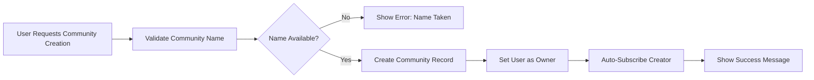
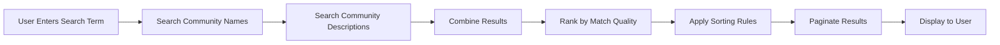
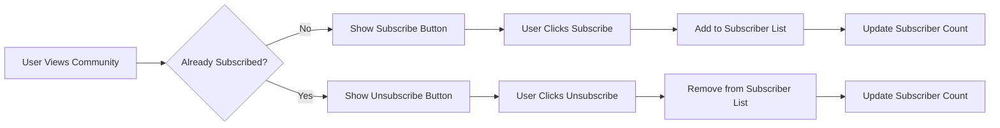

# Community Management Requirements Specification

## Executive Summary

This document defines the complete business requirements for community management within the Reddit-like community platform. It covers community creation, discovery, subscription mechanics, and ownership structures that form the foundation of the platform's community-driven content organization.

## Community Creation Rules

### Community Creation Eligibility

**WHEN** any authenticated user attempts to create a community, **THE** system **SHALL** allow creation if the community name is unique and available.

**THE** system **SHALL** validate that community names contain only alphanumeric characters, hyphens, and underscores.

**THE** system **SHALL** enforce a minimum length of 3 characters and maximum length of 21 characters for community names.

**THE** system **SHALL** prevent creation of community names that conflict with reserved system terms.

### Community Creation Process

### Community Properties

Each community **MUST** have the following properties:

- **Unique Name**: Permanent identifier used in URLs (e.g., "programming", "gaming")
- **Display Name**: Human-readable name that can include spaces and special characters
- **Description**: Text description explaining the community's purpose (max 500 characters)
- **Icon Image**: Optional community avatar image
- **Creation Date**: Timestamp when community was created
- **Owner**: User who created the community
- **Subscriber Count**: Total number of subscribed users
- **Public Visibility**: Boolean indicating if community appears in public listings

### Community Name Validation Rules

**THE** system **SHALL** implement comprehensive name validation:

- **Character Restrictions**: Only alphanumeric characters, hyphens, and underscores allowed
- **Length Requirements**: Minimum 3 characters, maximum 21 characters
- **Reserved Terms**: Prevent names matching system keywords (admin, moderator, support, etc.)
- **Case Insensitivity**: Names are case-insensitive for uniqueness checking
- **URL Safety**: Names must be URL-safe and not contain special characters

### Community Creation Error Handling

**IF** community name validation fails, **THEN THE** system **SHALL** display specific error messages:

- **Name Too Short**: "Community name must be at least 3 characters"
- **Name Too Long**: "Community name cannot exceed 21 characters"
- **Invalid Characters**: "Community name can only contain letters, numbers, hyphens, and underscores"
- **Name Taken**: "This community name is already taken. Please choose another"
- **Reserved Name**: "This name is reserved. Please choose a different name"

## Community Discovery and Search

### Community Browsing

**THE** system **SHALL** provide a paginated list of all public communities.

**THE** browsing interface **SHALL** display communities sorted by subscriber count (highest first) by default.

**THE** system **SHALL** support alternative sorting options: newest communities first, alphabetical order.

### Community Search Functionality

**WHEN** a user searches for communities, **THE** system **SHALL** perform case-insensitive matching on community names and descriptions.

**THE** search results **SHALL** prioritize exact name matches followed by partial matches.

**THE** search interface **SHALL** display matching communities with their subscriber counts and brief descriptions.

### Search Algorithm Requirements

### Search Result Ranking

**THE** search algorithm **SHALL** rank results based on:

- **Exact Name Match**: Communities with names exactly matching search term
- **Partial Name Match**: Communities with names containing search term
- **Description Match**: Communities with descriptions containing search term
- **Subscriber Count**: Higher subscriber communities ranked higher
- **Activity Level**: More active communities ranked higher

### Search Performance Requirements

**THE** search functionality **SHALL** return results within 1 second for typical query volumes.

**THE** system **SHALL** implement search indexing to maintain performance as community count grows.

## Subscription System Rules

### Subscription Requirements

**WHEN** a user subscribes to a community, **THE** system **SHALL** add them to the subscriber list.

**WHEN** a user unsubscribes from a community, **THE** system **SHALL** remove them from the subscriber list.

**THE** subscription status **SHALL** be required for post creation in that community.

### Subscription Process Flow

### Subscription-Based Permissions

**WHERE** a user is subscribed to a community, **THE** user **SHALL** be permitted to create posts in that community.

**WHERE** a user is not subscribed to a community, **THE** user **SHALL** be prohibited from creating posts in that community.

**THE** subscription requirement **SHALL** not apply to comment creation - users can comment on any post regardless of subscription status.

### Subscription Limits and Constraints

**THE** system **SHALL** not impose limits on the number of communities a user can subscribe to.

**THE** subscription system **SHALL** efficiently manage users subscribing to thousands of communities.

**WHEN** a user subscribes to a community, **THE** system **SHALL** immediately update their home feed content.

## Community Ownership and Management

### Owner Privileges

**THE** community owner **SHALL** have full administrative control over their community.

**THE** owner **SHALL** be able to edit community description and icon.

**THE** owner **SHALL** be able to appoint moderators from among community subscribers.

**THE** owner **SHALL** be able to remove appointed moderators.

**THE** owner **SHALL** not be able to transfer ownership to another user.

**THE** owner **SHALL** not be able to delete the community.

### Moderator Appointment Rules

**WHEN** appointing moderators, **THE** owner **SHALL** select from current community subscribers.

**THE** system **SHALL** prevent appointment of banned users as moderators.

**THE** system **SHALL** maintain an audit trail of moderator appointments and removals.

### Moderator Invitation Process

**WHEN** inviting a user to become a moderator, **THE** system **SHALL**:

- Send an invitation notification to the user
- Allow the user to accept or decline the invitation
- Set a 7-day expiration period for unanswered invitations
- Notify the owner when the invitation is accepted or declined

### Community Settings Management

**THE** community owner **SHALL** be able to configure:

- **Community Type**: Public (anyone can view) or Restricted (approved subscribers only)
- **Posting Permissions**: Who can post (subscribers only or approved users)
- **Content Restrictions**: Age restrictions, content guidelines
- **Moderation Settings**: Auto-moderation rules, reporting thresholds

## Community Statistics Visibility

### Subscriber Count Display

**THE** subscriber count **SHALL** be visible to all users regardless of authentication status.

**THE** subscriber count **SHALL** update in real-time as users subscribe/unsubscribe.

**THE** system **SHALL** display subscriber counts in abbreviated format for large numbers (e.g., "1.2k", "5.7m").

### Community Activity Metrics

**THE** system **SHALL** track and display recent post activity levels.

**THE** community listings **SHALL** indicate activity status (e.g., "Very Active", "Moderately Active", "Low Activity").

**THE** activity metrics **SHALL** be based on post frequency over the last 30 days.

### Activity Level Classification

**THE** system **SHALL** classify communities based on posting frequency:

- **Very Active**: 10+ posts per day average
- **Moderately Active**: 1-9 posts per day average
- **Low Activity**: Less than 1 post per day average
- **Inactive**: No posts in the last 30 days

## Integration Requirements

### User Profile Integration

**WHEN** viewing a user's profile, **THE** system **SHALL** display a list of communities they moderate.

**THE** profile **SHALL** show communities the user is subscribed to (if privacy settings allow).

**THE** system **SHALL** highlight communities where the user holds moderator status.

### Feed System Integration

**THE** home feed **SHALL** include posts only from communities the user is subscribed to.

**THE** community feed **SHALL** display posts from a specific community to all users.

**THE** popular feed **SHALL** include posts from all public communities regardless of subscription status.

### Moderation System Integration

**THE** community management **SHALL** integrate with the moderation system for content oversight.

**THE** moderator appointments **SHALL** trigger notification to the appointed user.

**THE** community settings **SHALL** include moderation queue visibility options.

## Business Rules and Constraints

### Community Name Reservation

**THE** system **SHALL** reserve common platform-related terms (e.g., "admin", "moderator", "support").

**THE** system **SHALL** prevent creation of communities with offensive or inappropriate names.

**THE** community name disputes **SHALL** be resolved through platform administrator intervention.

### Subscription Limits

**THE** system **SHALL** not impose limits on the number of communities a user can subscribe to.

**THE** subscription counts **SHALL** be efficiently managed to support users subscribing to thousands of communities.

### Community Inactivity

**WHERE** a community has no posts for 6 consecutive months, **THE** system **SHALL** mark it as inactive.

**THE** inactive communities **SHALL** remain accessible but may be deprioritized in search results.

**THE** community owners **SHALL** receive notifications when their community approaches inactivity status.

## Error Handling Scenarios

### Community Creation Errors

**IF** community name is already taken, **THEN THE** system **SHALL** suggest alternative available names.

**IF** community name contains invalid characters, **THEN THE** system **SHALL** display specific character requirements.

**IF** user exceeds rate limits for community creation, **THEN THE** system **SHALL** enforce cooling-off periods.

### Subscription Errors

**IF** subscription fails due to technical issues, **THEN THE** system **SHALL** retry the operation automatically.

**IF** user attempts to subscribe to a banned community, **THEN THE** system **SHALL** display appropriate error message.

**IF** subscription count update fails, **THEN THE** system **SHALL** maintain data consistency through transaction rollback.

### Ownership Transfer Scenarios

**IF** a community owner deletes their account, **THEN THE** system **SHALL** transfer ownership to the most active moderator.

**IF** no moderators exist, **THEN THE** community **SHALL** enter read-only mode until admin intervention.

**THE** ownership transfer **SHALL** notify all community subscribers of the change.

## Performance Requirements

### Community Discovery Performance

**THE** community browsing interface **SHALL** load initial results within 2 seconds.

**THE** search functionality **SHALL** return results within 1 second for typical query volumes.

**THE** subscriber count updates **SHALL** occur in real-time without perceptible delay.

### Scalability Considerations

**THE** system **SHALL** support creation of up to 100,000 distinct communities.

**THE** subscription system **SHALL** handle users subscribing to up to 5,000 communities each.

**THE** community search **SHALL** remain performant with full-text indexing of community names and descriptions.

### Database Performance

**THE** community data **SHALL** be optimized for:

- Fast community lookup by name
- Efficient subscriber count queries
- Quick community listing with sorting
- Real-time subscription status checks

## Data Retention and Privacy

### Community Data Persistence

**THE** community records **SHALL** be permanently retained unless required by legal compliance.

**THE** deleted user accounts **SHALL** not automatically delete communities they owned.

**THE** community ownership **SHALL** transfer to system administrators if original owner account is deleted.

### Subscription Privacy

**THE** list of communities a user is subscribed to **SHALL** be private by default.

**THE** users **SHALL** have option to make their subscription list publicly visible.

**THE** system **SHALL** not expose subscription patterns for data mining without user consent.

### Data Export and Portability

**THE** system **SHALL** allow users to export their subscription list.

**THE** community owners **SHALL** be able to export community member lists for administrative purposes.

**THE** data export **SHALL** comply with data protection regulations.

## Success Metrics

### Community Engagement Metrics

**THE** system **SHALL** track:

- Average number of communities per active user
- Subscription-to-post conversion rate
- Community discovery through search vs browsing
- Moderator appointment frequency and distribution

### Platform Growth Indicators

**THE** system **SHALL** monitor:

- Monthly new community creation rate
- Subscriber growth per community cohort
- Community activity retention rates
- Search effectiveness metrics

### Quality Metrics

**THE** system **SHALL** measure:

- Community health scores based on engagement and moderation
- User satisfaction with community discovery and management
- Moderator effectiveness and response times
- Content quality within communities

### Technical Performance Metrics

**THE** system **SHALL** ensure:

- Community creation success rate > 99%
- Subscription processing time < 100ms
- Search response time < 1 second
- System uptime > 99.9%

This document provides the complete business requirements for community management functionality. All technical implementation decisions including database design, API structure, and architectural choices are at the discretion of the development team.

> *Developer Note: This document defines **business requirements only**. All technical implementations (architecture, APIs, database design, etc.) are at the discretion of the development team.*