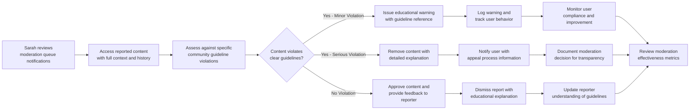
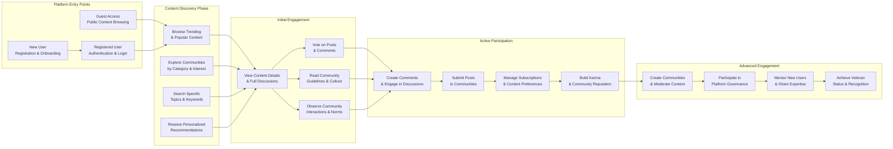

# User Personas and Journey Maps for Community Platform

## Executive Summary

This document defines the comprehensive user personas and their journeys through the Reddit-like community platform. By understanding the diverse user types, their motivations, and interaction patterns, we ensure the platform serves real user needs and provides intuitive experiences across all touchpoints. The platform must accommodate users ranging from casual browsers to dedicated community builders, each with distinct goals and engagement patterns.

## User Persona Definitions

### Primary Personas

#### 1. Alex - The Content Creator
**Demographics**: 28-year-old software developer, active online community participant with 5+ years of technical writing experience
**Motivations**: Share specialized knowledge, build professional reputation, engage in technical discussions, establish thought leadership
**Goals**: Become recognized expert in specific domains, accumulate high karma scores, lead community discussions, mentor new users
**Pain Points**: Complex posting interfaces, poor content discovery algorithms, limited engagement feedback, difficulty gaining initial traction

**Key Characteristics**:
- Posts detailed technical tutorials with code examples and real-world applications
- Engages extensively in comment discussions providing expert-level insights
- Values upvotes as recognition of content quality and technical accuracy
- Seeks to build authority within specific technical communities
- Prefers communities with high-quality moderation and expert participation
- Uses platform analytics to track content performance and audience engagement

**Technical Proficiency**: Advanced - comfortable with markdown formatting, code blocks, and technical documentation standards
**Platform Usage**: Daily active user, spends 2-3 hours daily creating and engaging with content

#### 2. Sarah - The Community Moderator
**Demographics**: 35-year-old community manager with 8 years of online moderation experience across multiple platforms
**Motivations**: Maintain community quality standards, foster positive interactions, prevent abuse and spam, grow community membership
**Goals**: Create welcoming environment for diverse users, enforce community guidelines consistently, develop effective moderation workflows
**Pain Points**: Inefficient moderation tools, unclear reporting processes, time-consuming content review, lack of moderator collaboration features

**Key Characteristics**:
- Proactive in identifying and addressing community issues before they escalate
- Balances strict enforcement with community building and user education
- Values clear, consistently applied guidelines and transparent moderation processes
- Seeks tools that streamline moderation workflows and enable efficient team collaboration
- Maintains detailed moderation logs and communicates decisions clearly to users
- Focuses on community health metrics and user satisfaction indicators

**Moderation Style**: Balanced approach combining automated tools with human judgment
**Time Commitment**: 10-15 hours weekly across multiple communities

#### 3. Mike - The Power User
**Demographics**: 42-year-old marketing professional, heavy social media user with expertise in content consumption and community dynamics
**Motivations**: Stay informed about trending topics, discover high-quality content efficiently, participate in viral discussions, build broad network
**Goals**: Maximize content consumption efficiency, build extensive community network, maintain high karma reputation, identify emerging trends
**Pain Points**: Information overload, irrelevant content recommendations, difficulty finding quality communities, inefficient navigation

**Key Characteristics**:
- Subscribes to 50+ communities across diverse topics and interest areas
- Uses advanced sorting, filtering, and search capabilities extensively
- Values karma as social proof of content quality and user credibility
- Seeks efficient content discovery mechanisms and personalized recommendations
- Maintains organized subscription lists with priority rankings
- Tracks platform trends and algorithm changes to optimize engagement

**Content Consumption**: High-volume reader, processes 100+ posts daily
**Platform Expertise**: Advanced understanding of ranking algorithms and community dynamics

#### 4. Emma - The New User
**Demographics**: 22-year-old college student studying computer science, new to community platforms but technically proficient
**Motivations**: Find like-minded communities, learn from domain experts, share academic experiences, build online presence
**Goals**: Understand platform mechanics and community norms, build initial reputation, find relevant communities, gain confidence in participation
**Pain Points**: Platform complexity, unclear community etiquette, difficulty gaining initial traction, fear of making social mistakes

**Key Characteristics**:
- Cautious about initial posts and comments, seeks guidance before participating
- Values clear onboarding processes and helpful community members
- Gradually increases participation as comfort and understanding grow
- Prefers communities with welcoming atmospheres and clear guidelines
- Uses platform features incrementally as familiarity increases
- Appreciates positive reinforcement and constructive feedback

**Learning Curve**: Moderate - quick to adapt but values guidance and clear expectations
**Engagement Pattern**: Starts as observer, gradually becomes active participant over 2-4 weeks

### Secondary Personas

#### 5. David - The Casual Browser
**Demographics**: 30-year-old graphic designer, occasional platform user with limited time for deep engagement
**Motivations**: Quick entertainment during breaks, light information gathering, casual social interaction without commitment
**Goals**: Consume interesting content without deep engagement, minimize time investment, avoid platform complexity
**Pain Points**: Content relevance issues, time-consuming navigation, overwhelming interface options, pressure to create content

**Key Characteristics**:
- Prefers curated content feeds over active searching
- Values simplicity and minimal interaction requirements
- Uses platform primarily during breaks or leisure time
- Rarely creates content but may vote on interesting posts
- Prefers mobile access for convenience and quick browsing

**Usage Pattern**: 15-30 minutes daily, primarily mobile access
**Engagement Level**: Low-interaction consumption with minimal participation

#### 6. Lisa - The Content Reporter
**Demographics**: 29-year-old high school teacher, community standards advocate with experience in educational content moderation
**Motivations**: Maintain platform safety standards, protect community members from harmful content, uphold community guidelines, promote positive discourse
**Goals**: Identify and report inappropriate content efficiently, support community moderation efforts, contribute to platform safety
**Pain Points**: Inefficient reporting processes, unclear violation categories, slow response times, lack of feedback on reports

**Key Characteristics**:
- Proactive in identifying content that violates community standards
- Values clear reporting categories and efficient submission processes
- Seeks transparency in moderation decisions and outcomes
- Prefers educational approaches over punitive measures when possible
- Maintains detailed records of reported content and outcomes

**Reporting Frequency**: 5-10 reports weekly across various communities
**Motivation**: Community safety and positive user experience

## Primary User Scenarios

### New User Onboarding Journey (Emma)

```mermaid
graph LR
  A["Emma discovers platform<br>through university forums"] --> B["Registration with<br>academic email verification"]
  B --> C["Interest-based<br>community discovery wizard"]
  C --> D["First community<br>subscription (r/learnprogramming)"]
  D --> E["Browse content without<br>initial engagement pressure"]
  E --> F["Read comprehensive<br>community guidelines"]
  F --> G["Make first comment<br>with guided formatting"]
  G --> H["Receive positive<br>feedback and upvotes"]
  H --> I["Gain confidence to<br>create first post"]
  I --> J["Build initial karma<br>and community reputation"]
  J --> K["Become active<br>community contributor"]
```

**WHEN Emma registers for the platform, THE system SHALL provide personalized community recommendations based on her academic interests and stated preferences.**

**WHEN Emma makes her first comment, THE system SHALL highlight community guidelines specific to constructive feedback and provide positive reinforcement for quality contributions.**

**WHILE Emma is browsing as a new user, THE system SHALL surface welcoming communities with active moderation and clear onboarding resources.**

### Content Creator Journey (Alex)

```mermaid
graph LR
  A["Alex identifies knowledge gap<br>in machine learning community"] --> B["Research existing content<br>and community discussions"]
  B --> C["Plan comprehensive tutorial<br>with practical examples"]
  C --> D["Use advanced editor with<br>code formatting and preview"]
  D --> E["Submit post for<br>community review and feedback"]
  E --> F["Monitor initial<br>engagement and comments"]
  F --> G["Respond to technical<br>questions and clarifications"]
  G --> H["Refine content based<br>on community feedback"]
  H --> I["Achieve high karma<br>and expert recognition"]
  I --> J["Receive moderator<br>invitation for community"]
  J --> K["Become trusted<br>community authority"]
```

**WHEN Alex creates a technical tutorial post, THE system SHALL provide rich text editing tools with code formatting capabilities, syntax highlighting, and live preview functionality.**

**WHEN Alex's post receives significant engagement, THE system SHALL notify him of rising karma scores, trending status, and provide analytics on audience reach.**

**WHERE Alex achieves consistent high-quality contributions, THE system SHALL recognize his expertise through reputation badges and community leadership opportunities.**

### Community Moderator Journey (Sarah)

**WHEN Sarah receives a content report, THE system SHALL provide clear context about the reported content, user history, previous similar cases, and relevant community guidelines.**

**WHEN Sarah takes moderation action, THE system SHALL automatically notify the content creator with specific violation details, educational resources, and clear appeal options.**

**WHILE Sarah is moderating complex cases, THE system SHALL provide collaboration tools for consulting with other moderators and maintaining consistent decision-making.**

### Power User Journey (Mike)

```mermaid
graph LR
  A["Mike logs in to<br>personalized trending feed"] --> B["Quick scan of<br>hot posts across subscriptions"]
  B --> C["Filter by top<br>communities by engagement"]
  C --> D["Apply advanced sorting<br>(hot/top/controversial/rising)"]
  D --> E["Engage with high-quality<br>content through voting"]
  E --> F["Discover new<br>communities through recommendations"]
  F --> G["Manage subscription<br>list with priority rankings"]
  G --> H["Track karma growth<br>and reputation metrics"]
  H --> I["Optimize content<br>consumption patterns"]
  I --> J["Participate in<br>platform governance voting"]
  J --> K["Achieve veteran<br>status with exclusive access"]
```

**WHEN Mike accesses his personalized feed, THE system SHALL prioritize content from his most-engaged communities, trending topics of interest, and highly-rated contributors.**

**WHEN Mike discovers a new community, THE system SHALL show relevant statistics about community size, activity level, content quality scores, and member engagement patterns.**

**WHERE Mike demonstrates consistent high-quality engagement, THE system SHALL provide advanced features like bulk operations, custom filters, and early access to new platform capabilities.**

## Secondary User Scenarios

### Casual Browser Journey (David)

**WHEN David visits the platform without logging in, THE system SHALL display popular content from diverse communities showcasing platform value, with clear pathways to relevant content based on browsing behavior.**

**WHEN David encounters content requiring registration, THE system SHALL provide clear value proposition highlighting personalized recommendations, community engagement benefits, and simplified content discovery.**

**WHILE David browses casually, THE system SHALL maintain lightweight interface options with minimal cognitive load, focusing on content consumption rather than creation pressures.**

### Content Reporter Journey (Lisa)

**WHEN Lisa identifies inappropriate content, THE system SHALL provide intuitive reporting interface with specific violation categories, contextual guidance, and examples of acceptable vs. prohibited content.**

**WHEN Lisa submits a report, THE system SHALL acknowledge receipt immediately, provide estimated response timeline, and offer tracking for report status updates.**

**WHERE Lisa demonstrates accurate reporting patterns, THE system SHALL recognize her contributions through reputation benefits and potentially expanded reporting capabilities.**

## Edge Case Scenarios

### Content Dispute Resolution

**WHEN a content creator disputes moderation action, THE system SHALL provide clear appeal process with escalation path to higher-level moderators, detailed case review, and transparent decision documentation.**

**WHEN multiple users report the same content, THE system SHALL prioritize review based on reporter credibility, report consistency, content severity, and potential community impact.**

**IF moderation decisions require community input, THE system SHALL facilitate democratic review processes while maintaining platform standards and legal compliance.**

### Account Recovery Journey

**WHEN a user forgets their password, THE system SHALL provide secure recovery process with multiple verification methods, clear instructions, and account security confirmation.**

**WHEN a user's account is compromised, THE system SHALL allow account recovery while preserving content history, karma achievements, and community relationships through secure identity verification.**

**IF recovery attempts fail, THE system SHALL provide alternative verification methods and human support options for complex account issues.**

### Community Migration Journey

**WHEN a community becomes inactive, THE system SHALL suggest similar active communities to subscribed members, facilitate content migration where appropriate, and provide closure communication.**

**WHEN a user wants to leave a community, THE system SHALL preserve their content contributions while removing community affiliation, maintain karma earned from contributions, and respect privacy settings.**

**WHERE communities merge or split, THE system SHALL manage member transitions, content reorganization, and notification processes to minimize disruption.**

## User Journey Maps

### Comprehensive User Flow Diagram

### Key Pain Points and Optimization Opportunities

1. **New User Onboarding Complexity**
   - **Pain Point**: Overwhelming interface and unclear participation expectations
   - **Opportunity**: Guided community discovery and simplified initial interactions
   - **Solution**: Progressive engagement model with clear milestones, welcome tutorials, and mentor matching

2. **Content Discovery Overload**
   - **Pain Point**: Difficulty finding relevant content among volume of posts
   - **Opportunity**: Intelligent filtering and personalized recommendations
   - **Solution**: Machine learning-based content relevance scoring, interest-based curation, and quality indicators

3. **Moderation Workflow Inefficiency**
   - **Pain Point**: Time-consuming review processes and unclear guidelines
   - **Opportunity**: Streamlined tools and automated pattern detection
   - **Solution**: Bulk action capabilities, smart reporting categorization, and moderator collaboration features

4. **Community Quality Maintenance**
   - **Pain Point**: Inconsistent content quality and community standards
   - **Opportunity**: Proactive quality metrics and community health indicators
   - **Solution**: Automated trend analysis, moderator performance tracking, and community health dashboards

### Success Metrics for User Journeys

- **Registration Completion Rate**: Target: 85% of visitors complete registration
- **First Content Creation Rate**: Target: 60% of new users create content within 7 days
- **Community Retention Rate**: Target: 75% of users active in communities after 30 days
- **Moderation Response Time**: Target: 90% of reports addressed within 24 hours
- **User Satisfaction Score**: Target: 4.5/5.0 measured through periodic feedback surveys
- **Karma Growth Rate**: Target: Average 50+ karma per active user monthly
- **Content Quality Score**: Target: 80%+ of content meets platform quality standards

## User Behavior Patterns and Platform Implications

### Content Creation Patterns
**WHEN users create content, THEY typically follow these behavior patterns:**
- Initial cautious posting followed by increased frequency as comfort grows (2-4 week adaptation period)
- Preference for communities where they have established reputation and familiar audience
- Higher engagement with content that receives quick positive feedback and constructive comments
- Seasonal variation in posting frequency based on academic calendars and work schedules

**Platform Implications**: THE system MUST provide gradual onboarding, reputation building mechanisms, and positive reinforcement systems.

### Community Interaction Patterns
**WHEN users interact with communities, THEY demonstrate these characteristics:**
- Loyalty to communities with active moderation, quality content, and responsive leadership
- Preference for communities with clear guidelines, consistent enforcement, and transparent processes
- Willingness to contribute more in communities with welcoming atmospheres and recognition systems
- Migration behavior when communities become inactive, toxic, or fail to meet quality standards

**Platform Implications**: THE system MUST support community health monitoring, moderator training, and quality maintenance features.

### Engagement Lifecycle Patterns
**WHEN users progress through engagement levels, THEY typically experience:**
- Observation phase (1-2 weeks): Learning platform norms and community cultures
- Initial participation phase (2-4 weeks): Testing engagement with comments and voting
- Active contribution phase (1-3 months): Regular content creation and discussion participation
- Community leadership phase (3+ months): Moderation, mentoring, and platform governance

**Platform Implications**: THE system MUST provide progressive engagement pathways, recognition milestones, and leadership development opportunities.

### Platform Growth Implications
**THE platform design MUST accommodate these growth considerations:**
- Scalable community discovery mechanisms as user base expands from thousands to millions
- Maintainable content quality standards as volume increases from hundreds to millions of posts
- Sustainable moderation workflows with growing user activity and content complexity
- Adaptive algorithms that maintain relevance while preventing filter bubbles and echo chambers

**Technical Requirements**: THE system architecture MUST support horizontal scaling, efficient content distribution, and real-time engagement processing.

## Integration Requirements with Other Systems

### Authentication System Integration
**WHEN user personas interact with the platform, THE system SHALL integrate seamlessly with authentication systems to provide:**
- Role-based access control matching persona permissions and capabilities
- Session management supporting different usage patterns and time commitments
- Secure token validation for all user interactions across persona types

### Content Management Integration
**WHERE content creation and consumption occur, THE system SHALL integrate with content management systems to enable:**
- Rich media support for different content types (text, images, links, code)
- Advanced formatting capabilities for technical and creative content
- Efficient content distribution and caching for optimal performance

### Moderation System Integration
**WHILE moderators perform their duties, THE system SHALL integrate with moderation systems to provide:**
- Comprehensive reporting tools with context and history
- Efficient workflow management for different moderation scenarios
- Transparent decision tracking and communication capabilities

### Analytics System Integration
**WHERE user behavior tracking occurs, THE system SHALL integrate with analytics systems to support:**
- Detailed engagement metrics across different persona types
- Performance monitoring for journey optimization
- Success measurement against defined KPIs and targets

## Error Handling and Recovery Scenarios

### Platform Access Issues
**IF users experience platform access problems, THEN THE system SHALL provide:**
- Clear error messages with guidance for resolution
- Alternative access methods during outages
- Status updates and estimated resolution times
- Data preservation during technical issues

### Content Submission Failures
**WHEN content submission fails, THE system SHALL implement:**
- Automatic draft saving with recovery options
- Clear error explanations with specific correction guidance
- Technical support access for persistent issues
- Content validation before submission to prevent common failures

### Moderation Decision Appeals
**WHERE moderation decisions are contested, THE system SHALL facilitate:**
- Structured appeal processes with clear timelines
- Multi-level review for complex or disputed cases
- Transparent communication of appeal outcomes
- Learning opportunities from appealed decisions

### Account Security Incidents
**IF account security issues occur, THE system SHALL provide:**
- Immediate security notifications and protective actions
- Clear recovery procedures with identity verification
- Security education and prevention recommendations
- Support for account restoration and damage mitigation

> *Developer Note: This document defines **business requirements only**. All technical implementations (architecture, APIs, database design, etc.) are at the discretion of the development team.*