# User Scenarios and Interaction Flows - Community Platform

## 1. Introduction and Overview

This document defines the complete user journeys and interaction flows for the Reddit-like community platform. These scenarios provide the foundation for understanding how users will interact with the platform's core features and how the system should respond to various user actions.

### 1.1 Document Purpose
The purpose of this document is to:
- Define all major user interaction patterns
- Specify complete user journeys from start to finish
- Document error handling and recovery processes
- Provide clear flow diagrams for development reference
- Ensure consistent user experience across all platform features

### 1.2 Scope Coverage
This document covers interaction flows for:
- User registration and authentication
- Community creation and management
- Post submission and management
- Commenting and discussion workflows
- Voting and engagement scenarios
- Moderation and administration flows
- Error handling and recovery processes

## 2. User Registration and Onboarding Journey

### 2.1 Guest User Registration Flow

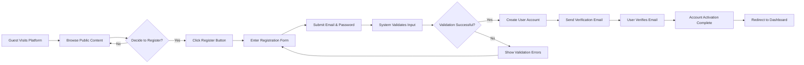

**WHEN a guest decides to register, THE system SHALL present a registration form with email and password fields.**

**WHEN a user submits registration information, THE system SHALL validate the email format and password strength.**

**IF validation fails, THEN THE system SHALL display specific error messages and allow correction.**

**WHEN registration is successful, THE system SHALL send a verification email to the provided address.**

**WHILE the user is unverified, THE system SHALL restrict posting and voting capabilities.**

### 2.2 Email Verification Flow

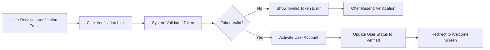

**WHEN a user clicks the verification link, THE system SHALL validate the token and activate the account.**

**IF the token is invalid or expired, THEN THE system SHALL provide an option to resend verification.**

### 2.3 User Login Flow

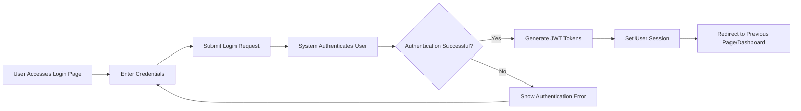

**WHEN a user attempts to log in, THE system SHALL validate credentials against stored user data.**

**IF authentication fails, THEN THE system SHALL provide clear error messages without revealing specific failure reasons.**

**WHEN authentication succeeds, THE system SHALL generate access and refresh tokens for session management.**

## 3. Community Creation and Management Flows

### 3.1 Community Creation Flow

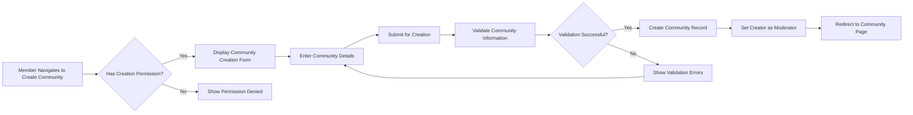

**WHEN a verified member attempts to create a community, THE system SHALL verify the user has creation permissions.**

**WHEN creating a community, THE system SHALL validate the community name for uniqueness and appropriate content.**

**THE system SHALL automatically assign the creator as the first moderator of the community.**

### 3.2 Community Subscription Flow

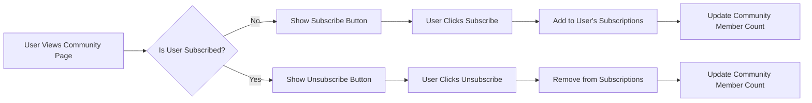

**WHEN a user subscribes to a community, THE system SHALL add the community to the user's subscription list.**

**WHEN a user unsubscribes from a community, THE system SHALL remove the community from the user's subscription list.**

**THE system SHALL maintain accurate member counts for each community.**

## 4. Post Creation and Management Workflows

### 4.1 Post Submission Flow

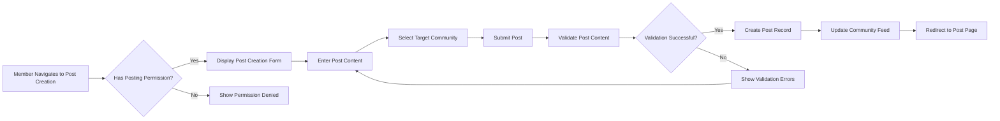

**WHEN a member creates a post, THE system SHALL validate that the user has posting permissions in the selected community.**

**THE system SHALL validate post content for length, format, and community-specific rules.**

**WHEN a post is successfully created, THE system SHALL update the community feed and notify subscribers.**

### 4.2 Post Editing Flow

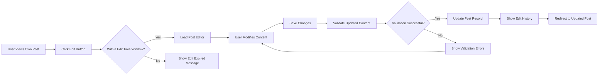

**WHEN a user attempts to edit a post, THE system SHALL verify the post is within the allowed edit time window.**

**THE system SHALL maintain an edit history for each post to track changes.**

### 4.3 Post Deletion Flow

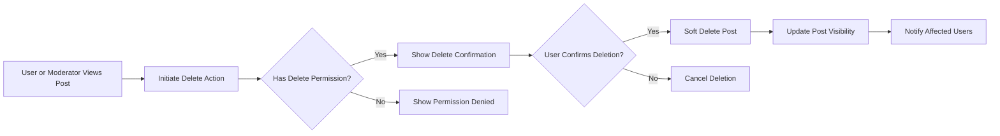

**WHEN a post deletion is requested, THE system SHALL require confirmation to prevent accidental deletion.**

**THE system SHALL use soft deletion to maintain data integrity while removing content from public view.**

## 5. Commenting and Discussion Flows

### 5.1 Comment Submission Flow

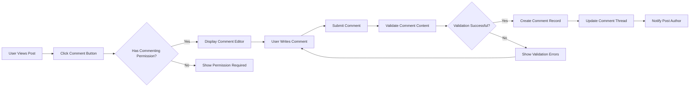

**WHEN a user submits a comment, THE system SHALL validate the comment content against length and content guidelines.**

**THE system SHALL maintain proper threading for nested comments and replies.**

### 5.2 Comment Thread Navigation

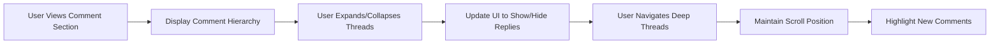

**THE system SHALL provide intuitive navigation for deep comment threads.**

**WHEN new comments are added, THE system SHALL highlight them for easy identification.**

## 6. Voting and Engagement Scenarios

### 6.1 Upvote/Downvote Flow

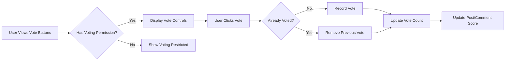

**WHEN a user votes on content, THE system SHALL ensure each user can only vote once per item.**

**THE system SHALL calculate and display accurate vote scores for all content.**

### 6.2 Vote Validation Rules

**THE system SHALL prevent users from voting on their own content.**

**WHILE a user is viewing content, THE system SHALL reflect their current vote status accurately.**

## 7. Moderation and Administration Flows

### 7.1 Content Moderation Flow

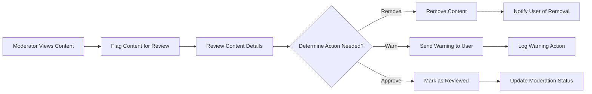

**WHEN a moderator reviews content, THE system SHALL provide clear action options with appropriate consequences.**

**THE system SHALL maintain a complete moderation log for accountability.**

### 7.2 User Management Flow

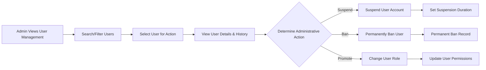

**WHEN an administrator manages users, THE system SHALL provide comprehensive user history for informed decisions.**

**THE system SHALL enforce role-based permissions for all administrative actions.**

## 8. Error Handling and Recovery Scenarios

### 8.1 Authentication Error Scenarios

**IF a user's session expires, THEN THE system SHALL redirect to login with a clear message.**

**IF JWT token validation fails, THEN THE system SHALL attempt token refresh before requiring re-authentication.**

**WHEN network connectivity is lost during authentication, THE system SHALL provide offline guidance and retry options.**

### 8.2 Content Submission Error Scenarios

**IF content validation fails due to format issues, THEN THE system SHALL provide specific guidance for correction.**

**WHEN a submission fails due to server error, THE system SHALL preserve the user's draft content.**

**IF a user attempts to submit duplicate content, THEN THE system SHALL detect and prevent the duplication.**

### 8.3 Permission Error Scenarios

**WHEN a user attempts an action without sufficient permissions, THE system SHALL explain the required permissions.**

**IF a moderator action is challenged, THEN THE system SHALL provide an appeal process for users.**

## 9. Performance Expectations and User Experience

### 9.1 Response Time Expectations

**THE system SHALL load community pages within 2 seconds for returning visitors.**

**WHEN submitting content, THE system SHALL provide confirmation within 1 second.**

**WHILE browsing comment threads, THE system SHALL maintain smooth scrolling performance.**

### 9.2 User Experience Guidelines

**THE system SHALL provide clear feedback for all user actions, including success and error states.**

**WHEN processing takes longer than expected, THE system SHALL display progress indicators.**

**THE system SHALL maintain consistent navigation patterns across all user flows.**

### 9.3 Mobile Experience Requirements

**WHERE users access the platform via mobile devices, THE system SHALL provide responsive design that adapts to screen size.**

**THE system SHALL optimize touch interactions for mobile users, including appropriate button sizes and gesture support.**

> *Developer Note: This document defines **user interaction flows and scenarios only**. All technical implementations (API design, database schemas, architectural patterns) are at the discretion of the development team.*