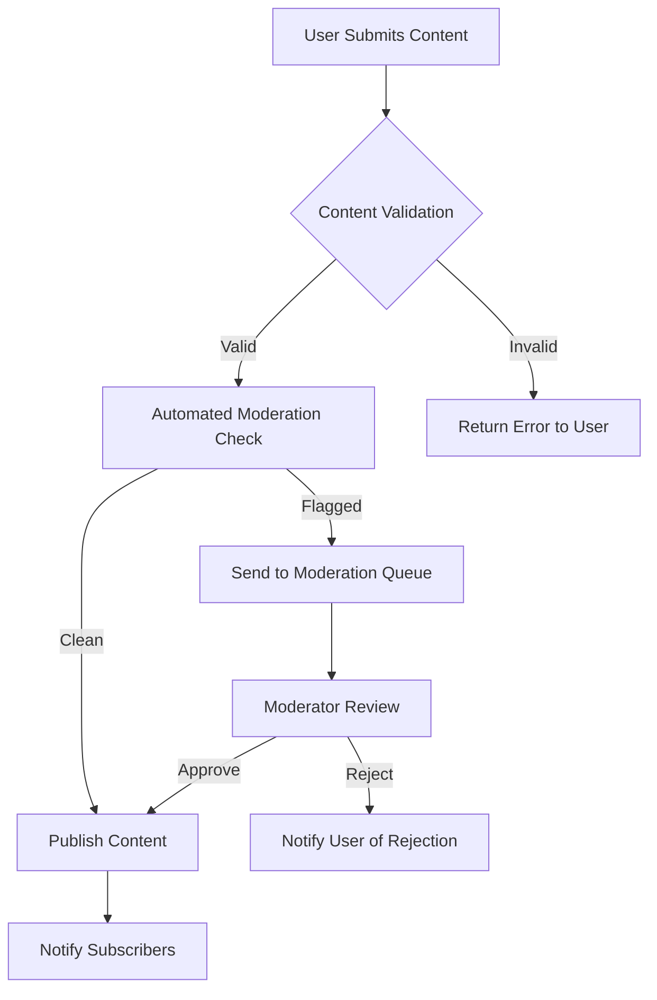

# Business Rules and Constraints Specification

## 1. Introduction and Overview

This document defines the complete business logic, validation rules, content policies, and operational constraints for the Reddit-like community platform. These rules govern how the platform operates, how content is managed, and what standards users must adhere to when participating in the community.

## 2. Content Validation Rules

### 2.1 Post Creation Validation

**WHEN** a user creates a new post, **THE system SHALL** validate the following requirements:
- Post title must be between 5 and 300 characters
- Post content must be between 1 and 40,000 characters
- Post must belong to exactly one community
- Post must have a valid content type (text, link, image, video)
- User must have permission to post in the selected community

**IF** a post contains a URL, **THEN THE system SHALL** validate that the URL is properly formatted and accessible

**WHILE** a post is being created, **THE system SHALL** prevent duplicate submissions within the same community

### 2.2 Comment Validation Rules

**WHEN** a user submits a comment, **THE system SHALL** ensure:
- Comment text is between 1 and 10,000 characters
- Comment belongs to a valid post
- User has not exceeded comment rate limits
- Comment does not contain prohibited content patterns

**WHERE** a comment thread exists, **THE system SHALL** maintain proper nesting levels up to 10 levels deep

### 2.3 Community Creation Rules

**WHEN** a member creates a new community, **THE system SHALL** validate:
- Community name is unique and between 3 and 21 characters
- Community name contains only alphanumeric characters and underscores
- Community description is between 10 and 500 characters
- Creating user has sufficient account age and karma requirements

**IF** a community name violates platform naming policies, **THEN THE system SHALL** reject the creation request

## 3. Community Guidelines and Policies

### 3.1 Content Standards

**THE platform SHALL** enforce the following content standards:
- No hate speech, harassment, or discrimination
- No illegal content or activities
- No personal information sharing without consent
- No spam or commercial promotion without authorization
- No NSFW content in non-NSFW communities

**WHEN** content violates platform standards, **THE system SHALL** provide clear violation reasons

### 3.2 Community-Specific Rules

**WHERE** individual communities have additional rules, **THE system SHALL** display them prominently

**WHILE** a user is participating in a community, **THE system SHALL** enforce that community's specific moderation policies

## 4. User Behavior and Conduct Rules

### 4.1 Voting Behavior

**WHEN** a user votes on content, **THE system SHALL** enforce:
- Users can only vote once per content item
- Voting power may be weighted based on user karma
- Vote manipulation through multiple accounts is prohibited

**IF** vote manipulation is detected, **THEN THE system SHALL** apply appropriate sanctions

### 4.2 Rate Limiting

**THE system SHALL** implement the following rate limits:
- New users: 5 posts per hour, 20 comments per hour
- Established users: 50 posts per hour, 200 comments per hour
- Moderators: 100 posts per hour, 500 comments per hour

**WHILE** a user is under rate limit, **THE system SHALL** provide clear countdown information

### 4.3 Account Standing

**THE system SHALL** maintain user account standing based on:
- Karma score from upvotes/downvotes
- Community-specific reputation
- Moderation history and violations
- Account age and activity level

## 5. Content Moderation Framework

### 5.1 Automated Moderation

**WHEN** content is submitted, **THE system SHALL** automatically flag content that:
- Contains banned words or phrases
- Matches known spam patterns
- Comes from suspicious IP addresses
- Shows characteristics of bot activity

**IF** automated systems flag content, **THEN THE system SHALL** route it for moderator review

### 5.2 Community Moderation

**WHEN** community moderators take action, **THE system SHALL** support:
- Removing posts and comments
- Banning users from communities
- Locking posts from further interaction
- Sticky-ing important posts
- Distinguishing moderator actions

**WHERE** moderator actions are taken, **THE system SHALL** maintain audit logs

### 5.3 User Reporting System

**THE system SHALL** provide reporting functionality for:
- Inappropriate content
- Harassment or abuse
- Spam or manipulation
- Rule violations

**WHEN** a report is submitted, **THE system SHALL** notify appropriate moderators

## 6. System Operational Constraints

### 6.1 Performance Requirements

**THE system SHALL** meet the following performance standards:
- Page load times under 2 seconds for 95% of requests
- Post submission processing under 1 second
- Voting actions processed within 500 milliseconds
- Search results returned within 3 seconds

**WHILE** under heavy load, **THE system SHALL** maintain core functionality

### 6.2 Scalability Requirements

**THE system SHALL** support:
- 1,000,000+ registered users
- 10,000+ active communities
- 100,000+ concurrent users
- 1,000+ posts per minute during peak

### 6.3 Availability Requirements

**THE system SHALL** maintain:
- 99.9% uptime for core services
- Graceful degradation during maintenance
- Data backup and recovery procedures

## 7. Compliance and Legal Requirements

### 7.1 Content Removal

**WHEN** legal requests are received, **THE system SHALL** have procedures for:
- DMCA takedown requests
- Court orders and legal demands
- Government content removal requests

**IF** content is removed for legal reasons, **THE system SHALL** maintain proper documentation

### 7.2 Data Privacy

**THE system SHALL** comply with data privacy regulations including:
- User data access and deletion rights
- Data retention policies
- Privacy policy enforcement
- Cookie consent management

### 7.3 Age Restrictions

**WHERE** age-restricted content exists, **THE system SHALL** implement:
- Age verification for NSFW communities
- Parental controls where applicable
- Clear content warnings

## 8. Implementation Guidelines

### 8.1 Rule Enforcement Priority

Business rules should be enforced in this priority:
1. Safety and legal compliance rules
2. Platform integrity rules
3. Community-specific rules
4. User experience rules

### 8.2 Error Handling

**WHEN** business rules are violated, **THE system SHALL** provide:
- Clear error messages explaining the violation
- Guidance on how to correct the issue
- Consistent error codes for development tracking

### 8.3 Rule Configuration

**THE system SHALL** allow configuration of:
- Community-specific rule sets
- Moderator permission levels
- Automated moderation thresholds
- Rate limiting parameters

## 9. Success Metrics

**THE platform SHALL** track the following metrics to measure rule effectiveness:
- Content moderation accuracy rate
- User satisfaction with moderation
- Rule violation frequency
- Appeal success rates
- Moderator workload efficiency

## 10. Authentication and Authorization Workflows

### 10.1 User Registration Process

**WHEN** a new user registers for the platform, **THE system SHALL**:
- Validate email address format and uniqueness
- Require password strength meeting security standards
- Send verification email with secure token
- Create user account with default permissions
- Track registration source and timestamp

**IF** email verification fails, **THEN THE system SHALL** prevent account activation

### 10.2 Login and Session Management

**WHEN** a user attempts to login, **THE system SHALL**:
- Validate credentials against stored hash
- Implement secure session token generation
- Track login attempts and implement lockout after failures
- Maintain session timeout after 24 hours of inactivity
- Support remember-me functionality with extended sessions

**WHILE** a user is logged in, **THE system SHALL** maintain proper authorization context

### 10.3 Permission Matrix

**THE system SHALL** implement role-based access control with the following permissions:

**Regular Users** can:
- Create posts in communities they can access
- Comment on posts
- Vote on content
- Join/leave communities
- Report content
- Edit own profile

**Community Moderators** can:
- All regular user permissions
- Moderate content within their communities
- Ban users from their communities
- Pin/unpin posts
- Manage community settings
- Access moderation logs

**Administrators** can:
- All moderator permissions across all communities
- Manage platform-wide settings
- Access system-wide analytics
- Handle escalated moderation cases
- Manage user accounts globally

### 10.4 Password and Security Policies

**THE system SHALL** enforce:
- Minimum password length of 8 characters
- Password complexity requirements
- Regular password change reminders
- Multi-factor authentication options
- Secure password reset procedures

**IF** suspicious activity is detected, **THEN THE system SHALL** trigger security protocols

## 11. Content Lifecycle Management

### 11.1 Content Creation Flow

**WHEN** content is created, **THE system SHALL** follow this workflow:

### 11.2 Content Moderation Workflow

**WHEN** content requires moderation, **THE system SHALL**:
- Route flagged content to appropriate moderator queues
- Provide moderation tools for quick decision-making
- Track moderation actions for accountability
- Notify users of moderation outcomes
- Support content appeals process

## 12. Error Handling and User Experience

### 12.1 Validation Error Scenarios

**WHEN** validation errors occur, **THE system SHALL** provide:
- Specific error messages indicating the exact issue
- Guidance on how to correct the problem
- Preserved user input where possible
- Clear calls to action for resolution

### 12.2 System Error Handling

**IF** system errors occur, **THEN THE system SHALL**:
- Display user-friendly error messages
- Log detailed error information for debugging
- Maintain system stability during partial failures
- Provide recovery options when available

## 13. Business Rule Evolution

### 13.1 Rule Modification Process

**WHEN** business rules need modification, **THE system SHALL** support:
- Versioning of rule changes
- Audit trails for rule modifications
- Testing of new rules before deployment
- Rollback capabilities for problematic changes

### 13.2 Community Feedback Integration

**THE system SHALL** incorporate community feedback into rule evolution through:
- User suggestion systems
- Community voting on rule changes
- Moderator feedback mechanisms
- Analytics-driven rule optimization

> *Developer Note: This document defines **business requirements only**. All technical implementations (architecture, APIs, database design, etc.) are at the discretion of the development team.*