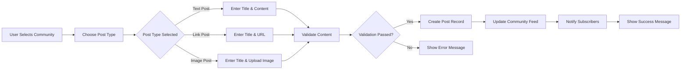
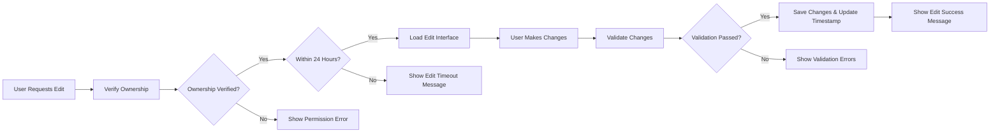
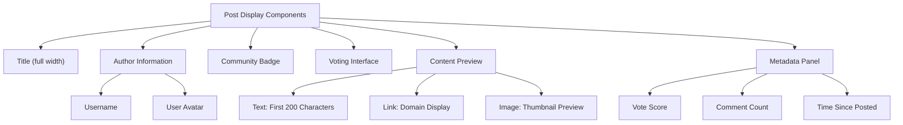

# Content Creation Posts Specification

## Document Overview
This document specifies the complete requirements for post creation, management, and display within the Reddit-like community platform. It covers all aspects of post lifecycle from creation through deletion, including content validation, editing capabilities, and display requirements across different contexts.

## Post Types and Requirements

### Available Post Types
The platform supports three distinct post types, each with specific content requirements:

#### Text Posts
- **Purpose**: For sharing written content and discussions
- **Content Requirements**:
  - MUST have a title (minimum 5 characters, maximum 300 characters)
  - MUST have text content (minimum 10 characters, maximum 40,000 characters)
  - SHALL support basic text formatting (line breaks, paragraphs)
  - SHALL NOT support rich text formatting or HTML
- **Validation Rules**:
  - WHEN creating a text post, THE system SHALL validate title length and content length
  - IF title length is below 5 characters, THEN THE system SHALL reject the post with error "Title too short"
  - IF content length is below 10 characters, THEN THE system SHALL reject the post with error "Content too short"

#### Link Posts
- **Purpose**: For sharing external web content
- **Content Requirements**:
  - MUST have a title (minimum 5 characters, maximum 300 characters)
  - MUST have a valid URL (must pass URL validation)
  - SHALL extract and display the domain name from the URL
  - SHALL validate URL accessibility (basic connectivity check)
- **Validation Rules**:
  - WHEN creating a link post, THE system SHALL validate URL format and accessibility
  - IF URL format is invalid, THEN THE system SHALL reject the post with error "Invalid URL format"
  - IF URL is inaccessible after validation attempts, THEN THE system SHALL display warning but allow post creation

#### Image Posts
- **Purpose**: For sharing visual content
- **Content Requirements**:
  - MUST have a title (minimum 5 characters, maximum 300 characters)
  - MUST have an uploaded image file
  - SHALL support common image formats (JPEG, PNG, GIF, WebP)
  - SHALL enforce maximum file size (10MB per image)
  - SHALL generate thumbnails for feed display
  - SHALL validate image dimensions (minimum 100x100 pixels, maximum 4000x4000 pixels)
- **Validation Rules**:
  - WHEN creating an image post, THE system SHALL validate image format, size, and dimensions
  - IF image format is unsupported, THEN THE system SHALL reject the post with error "Unsupported image format"
  - IF image file exceeds 10MB, THEN THE system SHALL reject the post with error "File too large"

## Post Creation Process

### Prerequisites for Post Creation
Before creating any post, users must meet specific requirements:

- **Authentication Requirement**: WHERE user authentication is required, THE user SHALL be logged in to create posts
- **Community Subscription**: WHERE community subscription is required, THE user SHALL be subscribed to the target community
- **Account Status**: IF user account is suspended or banned from target community, THEN THE system SHALL prevent post creation

### Post Creation Workflow
The post creation process follows a standardized workflow:

### Creation Interface Requirements
The post creation interface must provide:

- **Community Selection**: WHERE community selection is required, THE interface SHALL display subscribed communities only
- **Post Type Selection**: THE interface SHALL clearly distinguish between text, link, and image post options
- **Real-time Validation**: WHILE user is entering content, THE system SHALL provide real-time feedback on validation rules
- **Draft Saving**: THE system SHALL automatically save post drafts every 30 seconds to prevent data loss

### Post Submission Rules
- WHEN user submits a post, THE system SHALL perform final validation
- IF validation fails, THEN THE system SHALL display specific error messages
- IF validation succeeds, THEN THE system SHALL create the post and return success confirmation
- THE system SHALL timestamp each post with creation date and time
- THE system SHALL associate the post with the creating user and target community

## Post Editing and Deletion

### Editing Capabilities
Users have specific editing rights for their own posts:

- **Editing Window**: WHERE post editing is allowed, THE user SHALL be able to edit their own posts within 24 hours of creation
- **Edit History**: THE system SHALL maintain edit history for transparency
- **Content Changes**: Users CAN edit post title and content, but CANNOT change post type after creation
- **Community Transfer**: Users CANNOT move posts between different communities after creation

### Editing Process Requirements

### Deletion Process
Post deletion follows specific rules and consequences:

- **User Deletion Rights**: WHERE post deletion is allowed, THE user SHALL be able to delete their own posts at any time
- **Immediate Removal**: WHEN user deletes a post, THE system SHALL immediately remove it from all feeds and listings
- **Cascade Deletion**: THE system SHALL automatically delete all comments associated with the deleted post
- **Karma Impact**: THE system SHALL remove any karma points earned from the deleted post
- **Moderator Override**: WHERE moderator authority exists, community moderators SHALL be able to delete any post in their community

### Deletion Confirmation
- WHEN user attempts to delete a post, THE system SHALL show confirmation dialog
- THE confirmation dialog SHALL warn about cascade deletion of comments
- IF user confirms deletion, THEN THE system SHALL execute immediate removal
- THE system SHALL provide feedback about successful deletion

## Content Validation Rules

### Universal Validation Requirements
All posts must pass these validation rules regardless of type:

- **Title Validation**:
  - WHEN validating post title, THE system SHALL check length (5-300 characters)
  - THE system SHALL reject titles containing only whitespace
  - THE system SHALL sanitize title text to remove harmful characters
  
- **Content Safety**:
  - THE system SHALL scan all content for prohibited material (spam, malicious links, inappropriate content)
  - IF content triggers safety filters, THEN THE system SHALL flag for moderator review
  - WHERE automated detection is uncertain, THE system SHALL allow post creation but mark for review

### Type-Specific Validation

#### Text Post Validation
- WHEN validating text posts, THE system SHALL check for minimum content length (10 characters)
- THE system SHALL prevent excessively repetitive content
- THE system SHALL detect and prevent spam patterns

#### Link Post Validation
- WHEN validating link posts, THE system SHALL verify URL format and accessibility
- THE system SHALL check against known malicious domain lists
- THE system SHALL prevent duplicate link submissions within same community (24-hour cooldown)

#### Image Post Validation
- WHEN validating image posts, THE system SHALL verify image integrity and safety
- THE system SHALL scan images for inappropriate content
- THE system SHALL compress images to optimal sizes for performance

### Community-Specific Rules
- WHERE community-specific rules exist, THE system SHALL apply additional validation
- Community moderators SHALL be able to define custom validation rules for their communities
- THE system SHALL enforce community-specific content guidelines during post creation

## Post Display Requirements

### Feed Display Format
When posts appear in feeds, they must display specific information:

### Detailed View Requirements
When viewing a single post in detail, the display must include:

- **Full Content Display**: THE system SHALL show complete post content without truncation
- **Author Information**: THE system SHALL display author username with link to profile
- **Community Context**: THE system SHALL show community name with subscription status
- **Engagement Metrics**: THE system SHALL display current vote score and comment count
- **Timing Information**: THE system SHALL show precise posting time and edit history if applicable
- **Action Controls**: THE system SHALL provide voting, commenting, and sharing options

### Responsive Display Rules
- WHERE different screen sizes exist, THE system SHALL adapt post display appropriately
- ON mobile devices, THE system SHALL prioritize essential information
- ON desktop devices, THE system SHALL provide enhanced layout options
- THE system SHALL maintain consistent branding and readability across all devices

### Performance Expectations
- WHEN loading post feeds, THE system SHALL display initial content within 2 seconds
- THE system SHALL implement lazy loading for images below the fold
- WHERE pagination is used, THE system SHALL load subsequent pages within 1 second
- THE system SHALL cache frequently accessed post content for performance optimization

## Error Handling and User Feedback

### Creation Error Scenarios
- IF network connection is lost during post creation, THEN THE system SHALL save draft locally and attempt recovery
- IF server validation fails, THEN THE system SHALL display specific, actionable error messages
- IF user lacks permissions for target community, THEN THE system SHALL suggest subscribing first

### Editing Error Handling
- IF another user edits the same post simultaneously, THEN THE system SHALL implement conflict resolution
- IF post becomes locked for editing (moderator action), THEN THE system SHALL notify the user
- IF edit session times out, THEN THE system SHALL preserve draft content

### Deletion Confirmation Flow
- WHEN user deletes a post, THE system SHALL require explicit confirmation
- THE confirmation dialog SHALL clearly state consequences (comment deletion, karma impact)
- IF deletion affects active discussions, THEN THE system SHALL warn about community impact

## Business Rules and Constraints

### Content Ownership and Rights
- THE system SHALL respect intellectual property rights for all uploaded content
- Users SHALL retain ownership of their original content while granting the platform necessary usage rights
- THE system SHALL provide mechanisms for copyright infringement reports

### Community Guidelines Enforcement
- WHERE community guidelines exist, THE system SHALL enforce them during post creation
- Community moderators SHALL have tools to educate users about guideline violations
- THE system SHALL provide clear escalation paths for content disputes

### Data Retention Policies
- THE system SHALL maintain post data according to platform retention policies
- Deleted posts SHALL be removed from public view but may be retained for audit purposes
- User-requested data exports SHALL include all post content created by the user

## Integration Requirements

### Authentication Integration
- WHEN creating posts, THE system SHALL verify user authentication status
- WHERE community subscription is required, THE system SHALL validate subscription status
- THE system SHALL enforce community bans and restrictions during post creation

### Voting System Integration
- WHEN posts are created, THE system SHALL initialize voting counters
- THE system SHALL update vote scores in real-time across all post displays
- Post deletion SHALL properly handle karma score adjustments

### Comment System Integration
- WHEN posts are created, THE system SHALL initialize comment threading
- Post deletion SHALL cascade to all associated comments
- THE system SHALL maintain comment count accuracy across all displays

### Feed System Integration
- WHEN posts are created, THE system SHALL immediately include them in relevant feeds
- Post updates SHALL trigger feed cache invalidation
- THE system SHALL maintain proper sorting across all feed types

## Performance and Scalability

### Content Creation Performance
- THE system SHALL handle 100 concurrent post creations per minute
- Post submission SHALL complete within 1 second under normal load
- Image processing SHALL complete within 3 seconds for files up to 10MB

### Content Retrieval Performance
- Feed loading SHALL complete within 2 seconds for users with up to 100 subscribed communities
- Single post view SHALL load within 3 seconds including all comments
- Search functionality SHALL return results within 500ms

### Scalability Considerations
- THE system SHALL support horizontal scaling for post creation and retrieval
- Database queries SHALL be optimized with proper indexing
- Caching strategies SHALL be implemented for frequently accessed content

## Security Requirements

### Content Security
- THE system SHALL sanitize all user-generated content to prevent XSS attacks
- Image uploads SHALL be scanned for malicious content
- URL validation SHALL prevent phishing and malicious link propagation

### Access Control
- Post creation SHALL require proper authentication and authorization
- Editing permissions SHALL be strictly enforced based on ownership
- Deletion permissions SHALL follow the defined role-based access control

### Data Protection
- User content SHALL be stored securely with proper access controls
- Backup and recovery procedures SHALL be implemented for content protection
- Data retention policies SHALL comply with privacy regulations

## Monitoring and Analytics

### Content Creation Metrics
- THE system SHALL track post creation rates by community and user type
- Success and failure rates SHALL be monitored for quality improvement
- Performance metrics SHALL be collected for system optimization

### User Engagement Analytics
- Post engagement metrics SHALL be tracked (views, votes, comments)
- Content quality indicators SHALL be monitored for community health
- User behavior patterns SHALL be analyzed for feature improvement

### System Health Monitoring
- Error rates SHALL be monitored for system stability
- Performance bottlenecks SHALL be identified and addressed
- Security incidents SHALL be logged and analyzed

## Future Enhancements

### Content Type Extensions
- THE system SHALL be designed to support additional post types in the future
- Video post support SHALL be considered for future implementation
- Poll post functionality SHALL be planned as a potential enhancement

### Advanced Features
- Scheduled post publication SHALL be considered for future releases
- Cross-posting between communities SHALL be evaluated as a potential feature
- Advanced content formatting options SHALL be planned for future iterations

This specification provides comprehensive requirements for implementing the content creation system that forms the foundation of user engagement on the Reddit-like community platform.

> *Developer Note: This document defines **business requirements only**. All technical implementations (architecture, APIs, database design, etc.) are at the discretion of the development team.*