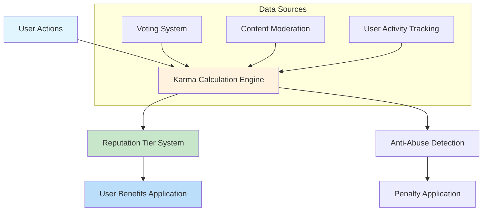
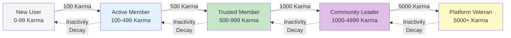

# Karma and Reputation System Specification

## Executive Summary

The karma system serves as the core reputation mechanism for the community platform, providing users with tangible recognition for their contributions while discouraging low-quality behavior. This document defines the complete karma calculation rules, reputation tiers, and anti-abuse measures required for a robust user reputation system that aligns with the platform's vision of fostering quality discussions and community trust.

## 1. Karma System Overview

### 1.1 Business Purpose
The karma system exists to:
- **Reward Quality Contributions**: Encourage users to post valuable content and engage constructively
- **Establish Community Trust**: Provide visible indicators of user credibility and experience
- **Drive Platform Engagement**: Create a progression system that motivates continued participation
- **Deter Low-Quality Behavior**: Discourage spam, trolling, and other disruptive activities

### 1.2 Core Principles
WHEN implementing the karma system, THE system SHALL operate on the following principles:
- **Transparency**: Users can understand how karma is earned and lost
- **Fairness**: All users have equal opportunity to earn karma through quality contributions
- **Proportionality**: Karma gains/losses reflect the impact and quality of contributions
- **Anti-Gaming**: Systems prevent manipulation and artificial karma inflation

### 1.3 System Architecture


## 2. Karma Calculation Rules

### 2.1 Karma Sources and Values

#### 2.1.1 Post Creation Karma
WHEN a user creates a post, THE system SHALL award karma based on post performance:
- **Base award**: +1 karma for creating any post
- **Upvote bonus**: +1 karma for each upvote received (maximum +100 per post)
- **Quality multiplier**: Posts receiving >10 upvotes gain additional +2 karma
- **Community impact**: Posts reaching >50 upvotes gain +5 karma
- **Viral content bonus**: Posts exceeding 500 upvotes gain +10 karma

**Formula**: 
```
Post Karma = 1 + min(upvotes, 100) + (upvotes > 10 ? 2 : 0) + (upvotes > 50 ? 5 : 0) + (upvotes > 500 ? 10 : 0)
```

#### 2.1.2 Comment Creation Karma
WHEN a user creates a comment, THE system SHALL award karma:
- **Base award**: +1 karma for creating any comment
- **Upvote bonus**: +1 karma for each upvote received (maximum +50 per comment)
- **Discussion value**: Comments generating >5 replies gain +2 karma
- **Depth bonus**: Nested comments beyond level 3 gain +1 karma
- **Helpful recognition**: Comments marked as "helpful" by OP gain +3 karma

**Formula**:
```
Comment Karma = 1 + min(upvotes, 50) + (replies > 5 ? 2 : 0) + (depth > 3 ? 1 : 0) + (helpful ? 3 : 0)
```

#### 2.1.3 Voting Karma
WHEN a user votes on content, THE system SHALL award karma:
- **Voting participation**: +1 karma per day for casting at least 10 votes
- **Voting accuracy**: Users whose votes align with community consensus gain +1 karma per 10 aligned votes
- **Early engagement**: Votes cast within first hour of post creation gain +0.5 karma bonus

### 2.2 Karma Loss Mechanisms

#### 2.2.1 Content Removal Penalties
IF a user's post is removed by moderators, THEN THE system SHALL deduct karma:
- **Post removal**: -5 karma per removed post
- **Comment removal**: -2 karma per removed comment
- **Spam removal**: -10 karma for content flagged as spam
- **Repeat violations**: Additional -5 karma for users with multiple removals

#### 2.2.2 Downvote Impact
WHEN a user's content receives downvotes, THE system SHALL reduce karma:
- **Downvote penalty**: -1 karma for each downvote received (maximum -20 per item)
- **Community rejection**: Content receiving >10 downvotes incurs additional -5 karma
- **Rapid downvoting**: Multiple downvotes within short period trigger abuse detection

#### 2.2.3 Abuse Penalties
WHERE users engage in abusive behavior, THE system SHALL impose karma penalties:
- **Vote manipulation**: -50 karma for detected vote manipulation
- **Multiple account abuse**: -100 karma and account suspension
- **Harassment**: -25 karma per harassment incident
- **Spam posting**: -15 karma for excessive low-quality posting

### 2.3 Karma Calculation Formulas

#### 2.3.1 Daily Karma Calculation
```
Daily Karma = (Post Karma + Comment Karma + Voting Karma) - (Removal Penalties + Downvote Penalties + Abuse Penalties)
```

#### 2.3.2 Karma Decay Prevention
WHILE users remain active, THE system SHALL prevent karma decay for ongoing contributions.
IF a user becomes inactive for more than 90 days, THEN THE system SHALL apply gradual karma decay of 1% per month.

## 3. Reputation Tiers and Benefits

### 3.1 Reputation Tier System

| Tier | Karma Range | Title | Color | Benefits |
|------|-------------|--------|-------|----------|
| 1 | 0-99 | New User | Gray | Basic posting and voting rights |
| 2 | 100-499 | Active Member | Blue | Create communities, custom user flair |
| 3 | 500-999 | Trusted Member | Green | Post in restricted communities, early feature access |
| 4 | 1,000-4,999 | Community Leader | Purple | Moderation tools, community analytics |
| 5 | 5,000+ | Platform Veteran | Gold | Platform governance voting, exclusive features |

### 3.2 Tier-Specific Benefits

#### 3.2.1 Active Member (Tier 2)
WHEN a user reaches 100 karma, THE system SHALL grant:
- Community creation privileges (up to 3 communities)
- Custom user flair customization
- Increased post frequency limits (10 posts/hour vs 5/hour)
- Priority in community moderation queues
- Access to basic analytics for own content

#### 3.2.2 Trusted Member (Tier 3)
WHILE a user maintains 500+ karma, THE system SHALL provide:
- Access to restricted communities requiring minimum karma
- Early beta feature testing opportunities
- Higher voting weight in community polls (1.5x multiplier)
- Expanded moderation capabilities in own communities
- Ability to gift small karma amounts to helpful users

#### 3.2.3 Community Leader (Tier 4)
WHERE a user achieves 1,000+ karma, THE system SHALL enable:
- Advanced moderation tools and analytics for managed communities
- Community growth insights and member statistics
- Platform-wide content recommendation influence
- Community event hosting capabilities with platform support
- Priority support response times

#### 3.2.4 Platform Veteran (Tier 5)
IF a user reaches 5,000+ karma, THEN THE system SHALL grant:
- Participation in platform governance decisions and feature voting
- Exclusive veteran-only communities and discussion groups
- Platform advisory board eligibility for major decisions
- Special recognition badges and profile highlighting
- Invitation to platform events and beta programs

### 3.3 Tier Progression and Maintenance



## 4. User Behavior Impact

### 4.1 Positive Behavior Rewards

#### 4.1.1 Quality Content Creation
WHEN users create content that receives high engagement, THE system SHALL reward:
- **High-quality posts**: Content with >80% upvote ratio gains +3 karma bonus
- **Educational content**: Tutorials and guides receive +5 karma bonus
- **Community building**: Content that sparks constructive discussion gains +2 karma
- **Original content**: Verified original creations gain +4 karma bonus
- **Helpful answers**: Responses marked as solving problems gain +3 karma

#### 4.1.2 Helpful Moderation
WHERE users contribute to community moderation, THE system SHALL recognize:
- **Helpful reports**: Accurate content reports earn +1 karma each
- **Constructive feedback**: Helpful comments on rule violations gain +2 karma
- **Community guidance**: Mentoring new users earns +1 karma per helped user
- **Conflict resolution**: Successfully mediated disputes gain +5 karma

### 4.2 Negative Behavior Consequences

#### 4.2.1 Low-Quality Content
IF users repeatedly post low-quality content, THEN THE system SHALL impose:
- **Content quality flags**: Posts with <20% upvote ratio deduct -2 karma
- **Spam detection**: Automated spam detection results in -10 karma per incident
- **Duplicate content**: Reposting existing content deducts -3 karma
- **Misinformation**: Content flagged as misinformation deducts -8 karma

#### 4.2.2 Toxic Behavior
WHILE users engage in toxic behavior, THE system SHALL apply penalties:
- **Personal attacks**: -5 karma per harassment incident
- **Hate speech**: -15 karma and immediate content removal
- **Brigading**: -20 karma for organized vote manipulation
- **Trolling**: -10 karma for deliberate disruption

### 4.3 Behavior Pattern Analysis

THE system SHALL monitor user behavior patterns to detect:
- **Rapid karma farming**: Unusual posting/voting patterns
- **Vote manipulation**: Coordinated voting across accounts
- **Content spamming**: Excessive low-quality submissions
- **Community hopping**: Joining/leaving communities for karma

## 5. Anti-Abuse Measures

### 5.1 Karma Gaming Prevention

#### 5.1.1 Vote Manipulation Detection
THE system SHALL detect and prevent karma manipulation through:
- **Vote pattern analysis**: Identifying unusual voting clusters and timing
- **IP address monitoring**: Preventing multiple account voting from same source
- **Relationship mapping**: Identifying connected account networks
- **Behavioral analysis**: Detecting artificial engagement patterns

#### 5.1.2 Content Quality Validation
WHERE users attempt to game the system, THE system SHALL implement:
- **Content originality checks**: Preventing duplicate or AI-generated content
- **Engagement authenticity**: Verifying genuine user interactions
- **Growth rate limits**: Capping maximum daily karma gains to 200
- **Quality thresholds**: Requiring minimum content quality for karma rewards

### 5.2 Fairness Enforcement

#### 5.2.1 Equal Opportunity
THE system SHALL ensure all users have fair karma earning opportunities:
- **No advantage for early users**: Karma calculations normalize for join date
- **Community size normalization**: Karma from small/large communities weighted equally
- **Content type fairness**: All content types have equal karma potential
- **Time zone equity**: Global user base considered in timing calculations

#### 5.2.2 Transparency and Appeals
IF users question karma calculations, THEN THE system SHALL provide:
- **Detailed karma breakdown**: Users can see exact karma sources and calculations
- **Appeal process**: Mechanism to contest unfair karma deductions within 30 days
- **Moderator oversight**: Human review of automated karma adjustments
- **Regular audits**: Systematic review of karma system fairness quarterly

## 6. Integration Requirements

### 6.1 Voting System Integration
WHEN the voting system processes user interactions, THE karma system SHALL:
- Receive real-time vote data for karma calculations within 5 seconds
- Apply karma adjustments immediately upon vote registration
- Sync karma changes with user profile displays in real-time
- Update reputation tiers immediately upon threshold crossing

### 6.2 Moderation System Integration
WHERE content moderation occurs, THE karma system SHALL:
- Receive moderation actions for penalty calculations within 1 minute
- Apply karma penalties proportional to moderation severity
- Provide karma data to inform moderation decisions
- Support moderator karma adjustment capabilities for special cases

### 6.3 User Profile Integration
THE karma system SHALL integrate seamlessly with user profiles by:
- Displaying current karma score prominently on user profiles
- Showing reputation tier badges and benefits
- Providing karma history and breakdown views
- Integrating with user activity tracking

### 6.4 Performance Requirements
THE karma system SHALL meet the following performance standards:
- **Calculation speed**: Process karma updates within 30 seconds of user actions
- **Scalability**: Support 1 million+ concurrent users with real-time updates
- **Accuracy**: 99.9% calculation accuracy rate with audit trail
- **Availability**: 99.5% system uptime requirement with failover mechanisms

## 7. Monitoring and Analytics

### 7.1 System Health Monitoring
THE system SHALL monitor karma system performance including:
- Karma calculation latency and throughput
- Error rates in karma processing
- System resource utilization during peak loads
- Database performance for karma transactions

### 7.2 User Behavior Analytics
THE system SHALL track karma-related user behavior patterns:
- Karma distribution across user base
- Average karma gains/losses by user tier
- Karma manipulation attempt detection rates
- User satisfaction with karma system

### 7.3 Abuse Detection Metrics
THE system SHALL measure anti-abuse effectiveness through:
- False positive/negative rates in abuse detection
- Karma gaming attempt success rates
- User appeal volumes and resolution times
- Moderator intervention requirements

## 8. Business Rules and Validation

### 8.1 Karma Validation Rules
- **Minimum karma**: Users cannot have negative karma below -100
- **Maximum daily gain**: Users cannot gain more than 200 karma per day
- **Activity requirement**: Users must have recent activity to maintain tier benefits
- **Content quality minimum**: Posts must meet minimum quality standards for karma eligibility

### 8.2 Reputation Progression Rules
- **Tier persistence**: Users maintain tier for 30 days after dropping below threshold
- **Accelerated progression**: New users gain 2x karma for first 30 days
- **Community specialization**: Karma earned in specific communities influences specialized reputation
- **Cross-community recognition**: High karma in one community provides reputation boost in similar communities

### 8.3 Error Handling Scenarios
IF karma calculation errors occur, THEN THE system SHALL:
- Log detailed error information for investigation
- Continue processing other karma calculations
- Provide manual correction mechanisms for administrators
- Notify users of calculation delays exceeding 5 minutes

## 9. Implementation Guidelines

### 9.1 Data Model Requirements
THE karma system SHALL maintain comprehensive data tracking including:
- User karma history with timestamps and sources
- Tier progression and change history
- Abuse detection logs and penalty records
- Calculation audit trails for transparency

### 9.2 Security Considerations
THE system SHALL implement security measures for karma data:
- Encryption of karma transaction records
- Access controls for karma adjustment capabilities
- Audit logging for all karma-related operations
- Rate limiting for karma calculation requests

### 9.3 Scalability Architecture
THE karma system SHALL be designed for horizontal scaling:
- Distributed calculation engines for high throughput
- Caching layers for frequently accessed karma data
- Database partitioning for large user bases
- Queue-based processing for peak load handling

> *Developer Note: This document defines **business requirements only**. All technical implementations (architecture, APIs, database design, etc.) are at the discretion of the development team.*