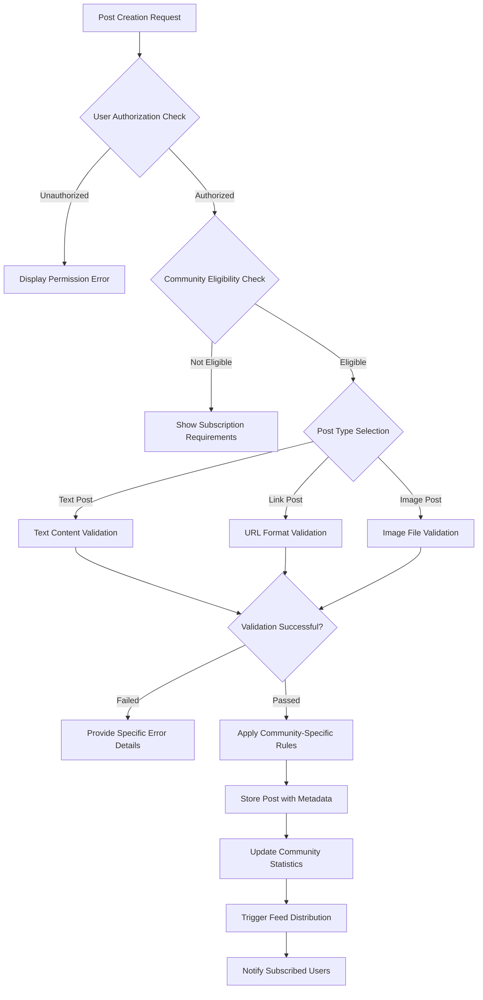
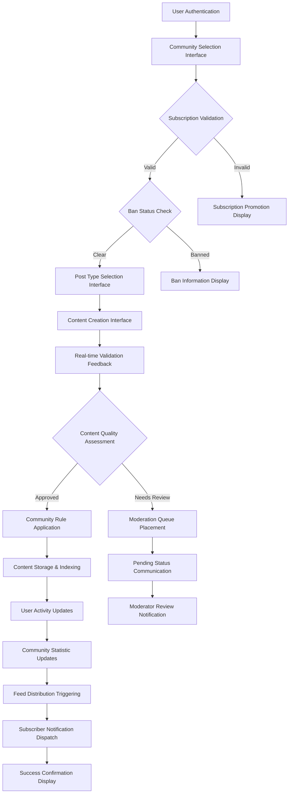

# Post System Requirements Specification

## Executive Summary

This document defines the comprehensive business requirements for the post management system within the community platform. The post system enables users to create, share, and manage content across communities, supporting three distinct post types with specific validation rules and business logic. The system must handle diverse content formats while maintaining platform integrity, user engagement, and community standards.

## Post Types and Structure

### Post Type Definitions

The platform supports three distinct post types, each with specific content requirements that must be strictly enforced:

**Text Post Requirements**
- THE post system SHALL support text-based content creation for detailed discussions
- WHEN creating a text post, THE system SHALL require a descriptive title and substantive text content
- THE text content SHALL support rich text formatting including paragraphs, code blocks, and lists for enhanced readability
- THE text content SHALL have a maximum length of 40,000 characters to balance depth with performance
- THE system SHALL validate text posts for minimum engagement quality standards

**Link Post Requirements**
- THE post system SHALL support URL-based content sharing for external resource discovery
- WHEN creating a link post, THE system SHALL require compelling title and valid URL format verification
- THE system SHALL extract domain information and display it appropriately in feeds
- THE system SHALL implement duplicate detection to prevent identical link submissions within communities
- THE system SHALL validate URLs against security databases to prevent malicious content

**Image Post Requirements**
- THE post system SHALL support visual content sharing through image uploads
- WHEN creating an image post, THE system SHALL require meaningful title and properly formatted image file
- THE system SHALL validate image file types against JPEG, PNG, GIF, and WebP formats
- THE system SHALL enforce reasonable file size limits of 10MB per image
- THE system SHALL automatically generate optimized thumbnails for efficient feed display
- THE system SHALL encourage alternative text descriptions for accessibility compliance

### Comprehensive Post Structure Requirements

**Core Post Attributes Specification**
- THE post SHALL have globally unique identifier for system-wide reference
- THE post title SHALL be mandatory with length constraints of 5-300 characters
- THE post SHALL maintain accurate author reference for attribution and accountability
- THE post SHALL be properly associated with its respective community
- Creation and modification timestamps SHALL be precise and tamper-proof
- Vote score tracking SHALL be real-time and consistent across all views
- Comment count maintenance SHALL be accurate and efficiently updated

The complete post lifecycle must integrate seamlessly with user authentication, community management, and moderation systems.

## Post Creation Rules

### Comprehensive Permission Framework

**Subscription-Based Authorization**
- WHEN any user attempts to create content, THE system SHALL verify active subscription to target community
- IF subscription validation fails, THEN THE system SHALL prevent post creation with clear instructional messaging
- THE subscription requirement SHALL apply uniformly across all post types without exceptions
- Subscription status verification SHALL be performed synchronously during post creation

**Community Ban Enforcement**
- WHILE any user is under community ban, THE system SHALL completely prevent content creation in that community
- Ban status checking SHALL include temporary and permanent ban types
- Banned users SHALL retain read-only access to maintain transparency
- Ban messaging SHALL include duration information and appeal procedures where applicable

### Rigorous Content Validation Framework

**Title Quality Standards**
- THE post title SHALL be mandatory across all post creation scenarios
- Title length SHALL be constrained between 5 and 300 meaningful characters
- THE system SHALL automatically trim extraneous whitespace from title inputs
- Title content SHALL be screened for spam patterns and prohibited terminology
- Descriptive title quality SHALL be encouraged through algorithmic recommendations

**Post-Type Specific Content Validation**

**Text Post Content Standards**
- Text content SHALL be mandatory with minimum 10 character substantive requirement
- Maximum length limitation of 40,000 characters SHALL balance depth and performance
- Content sanitization SHALL prevent XSS attacks while preserving legitimate formatting
- Automated quality assessment SHALL identify low-effort content patterns
- Content categorization SHALL enable better community organization

**Link Post URL Integrity Requirements**
- Valid URL format verification SHALL use industry-standard URI validation techniques
- Protocol restriction to HTTP/HTTPS SHALL ensure security compliance
- Domain extraction and categorization SHALL enhance user experience
- Real-time security scanning SHALL protect against malicious content
- Link shortening services SHALL be properly handled for transparency

**Image Post Media Management**
- File format validation SHALL include comprehensive signature checking
- Automated content analysis SHALL identify inappropriate imagery
- Image compression optimization SHALL balance quality and performance
- Multiple resolution generation SHALL support diverse display scenarios
- Storage efficiency SHALL be maintained through intelligent caching strategies

### Advanced Duplicate Prevention Systems

**Intelligent Duplicate Detection**
- Community-level duplicate checking SHALL prevent identical content reproduction
- Similarity algorithms SHALL identify substantially similar submissions
- Cross-community duplicate awareness SHALL preserve content diversity
- Duplicate handling SHALL provide user-friendly redirection options

**User Experience in Duplicate Scenarios**
- WHEN duplicate content is detected, THE system SHALL display existing discussions
- Users SHALL have option to proceed with creation despite similarity warnings
- Community moderators SHALL configure duplicate sensitivity thresholds
- Historical duplicate patterns SHALL inform user behavior recommendations

## Post Editing and Deletion Frameworks

### Comprehensive Editing Capabilities

**User Editing Rights Management**
- THE post author SHALL have exclusive editing rights for limited duration
- Edit history preservation SHALL maintain content integrity and transparency
- Visual editing indicators SHALL inform readers of content modifications
- Time-limited editing windows SHALL balance flexibility and authenticity

**Editing Constraints and Safeguards**
- Post type conversion SHALL be prohibited after initial creation
- Core content structure SHALL remain consistent during editing
- Automated re-moderation MAY be triggered for substantial content changes
- Editing interface SHALL provide real-time validation feedback

### Structured Deletion Protocols

**User-Initiated Content Removal**
- Post authors SHALL have irrevocable deletion authority over their content
- Deletion confirmation SHALL include comprehensive impact disclosure
- Cascading content removal SHALL maintain system consistency
- Karma adjustment calculations SHALL reflect deletion consequences

**Moderator Content Management Authority**
- Community moderators SHALL have comprehensive deletion powers
- Moderator actions SHALL require documented justification
- Affected users SHALL receive transparent notification of moderator actions
- Moderator deletion patterns SHALL be subject to supervisory review

**System-Wide Deletion Consistency**
- Account termination SHALL trigger complete content removal
- Mass deletion operations SHALL maintain referential integrity
- Statistical systems SHALL properly reflect deletion impacts
- Archive systems SHALL comply with legal retention requirements

The post lifecycle management must balance user autonomy with community standards and platform integrity.

## Content Validation and Quality Assurance

### Automated Content Screening Systems

**Proactive Moderation Integration**
- Real-time content scanning SHALL identify policy violations automatically
- Machine learning algorithms SHALL continuously improve detection accuracy
- Manual review queues SHALL be efficiently managed during peak activity
- False positive minimization SHALL be prioritized in algorithm training

**Spam and Abuse Prevention**
- Behavioral pattern analysis SHALL identify coordinated abuse campaigns
- Rate limiting enforcement SHALL prevent content flooding attacks
- Reputation systems SHALL inform moderation priority decisions
- Automated response systems SHALL adapt to evolving abuse tactics

### Content Quality Enhancement Framework

**Quality Metric Implementation**
- Engagement-based quality scoring SHALL identify valuable content
- User feedback systems SHALL continuously refine quality algorithms
- Community-specific quality standards SHALL be configurable by moderators
- Quality decay algorithms SHALL account for content aging appropriately

**Accessibility and Inclusivity Standards**
- Image accessibility requirements SHALL include mandatory alternative text
- Content structure guidelines SHALL support diverse consumption methods
- Language processing SHALL identify and accommodate diverse communication styles
- Internationalization support SHALL enable global content accessibility

## Post Visibility and Distribution Systems

### Multi-Tier Feed Architecture

**Personalized Home Feed Implementation**
- Subscription-based content curation SHALL create personalized user experiences
- Feed freshness algorithms SHALL balance recency and relevance appropriately
- User engagement patterns SHALL inform personalized ranking adjustments
- Content diversity SHALL be maintained despite personalization algorithms

**Global Popular Feed Standards**
- Platform-wide content discovery SHALL be accessible to all users
- Engagement-based ranking SHALL promote high-quality content universally
- Geographical and cultural relevance SHALL be considered in global distribution
- Content moderation consistency SHALL be maintained across all visibility tiers

**Community-Centric Feed Management**
- Community identity preservation SHALL be prioritized in feed design
- Moderator feed customization options SHALL support community standards
- Cross-community content sharing SHALL be properly attributed and contextualized
- Community growth incentives SHALL be balanced with content quality maintenance

### Advanced Sorting Algorithm Specifications

**Hot Algorithm Technical Requirements**
- Time decay calculations SHALL properly balance content aging
- Engagement velocity measurements SHALL identify trending content accurately
- Vote manipulation detection SHALL maintain algorithm integrity
- Community size normalization SHALL ensure fair content promotion

**New Content Chronological Management**
- Precise timestamp ordering SHALL guarantee chronological accuracy
- Content creation rate handling SHALL maintain system performance
- Timezone-aware display SHALL provide consistent user experience
- Content backlog management SHALL prevent information overload

**Top Content Quality Assessment**
- Vote score calculation SHALL be mathematically sound and transparent
- Time-based filtering options SHALL provide meaningful content discovery
- Score normalization techniques SHALL accommodate varying community sizes
- Historical score preservation SHALL maintain content legacy appropriately

**Controversial Content Identification**
- Controversy scoring algorithms SHALL identify genuine discourse
- Polarization measurement SHALL distinguish healthy debate from toxicity
- Community standards SHALL influence controversy threshold settings
- Discussion quality metrics SHALL inform controversy classification

### Scalable Pagination Implementation

**Performance-Optimized Pagination Design**
- Cursor-based pagination SHALL provide consistent content navigation
- Page size configurability SHALL accommodate diverse user preferences
- Caching strategies SHALL optimize frequently accessed content delivery
- Database query optimization SHALL maintain performance at scale

**User Experience in Pagination Systems**
- Navigation interface SHALL provide clear content exploration pathways
- Loading state management SHALL maintain responsive user experience
- Content preview systems SHALL enable efficient content evaluation
- Bookmarking capabilities SHALL support interrupted browsing sessions

The visibility and distribution systems must scale efficiently while maintaining content quality and user engagement.

## Platform Content Policy Framework

### Comprehensive Content Governance

**Legal and Regulatory Compliance**
- Content removal protocols SHALL comply with applicable legal requirements
- Government takedown requests SHALL be processed according to established procedures
- User notification systems SHALL maintain transparency in legal compliance actions
- Jurisdictional complexity SHALL be properly managed in global operations

**Community Standards Enforcement**
- Policy documentation SHALL be clear, accessible, and consistently applied
- Moderator training programs SHALL ensure uniform standard application
- Appeal processes SHALL provide fair recourse for contested decisions
- Policy evolution SHALL incorporate community feedback appropriately

### Advanced Moderation Systems

**Reporting Workflow Optimization**
- Streamlined reporting interfaces SHALL encourage responsible community participation
- Report categorization SHALL enable efficient moderator workload distribution
- False report pattern detection SHALL prevent system abuse
- Report resolution tracking SHALL provide accountability and transparency

**Automated Moderation Integration**
- AI-powered content analysis SHALL augment human moderation capabilities
- Continuous learning systems SHALL adapt to emerging content patterns
- Moderation effectiveness metrics SHALL drive system improvements
- Human oversight SHALL remain central to contentious decision-making

## Comprehensive Business Logic Implementation

### End-to-End Post Creation Workflow

### User-Initiated Deletion Protocol
- WHEN users request content deletion, THE system SHALL require explicit confirmation
- Deletion impact disclosure SHALL include karma adjustments and comment removal details
- Irreversible deletion SHALL be clearly communicated before final action
- Post-deletion user experience SHALL provide appropriate closure and redirection

### Moderator Action Framework
- Moderator content management SHALL follow established procedural guidelines
- Action documentation SHALL support audit and review requirements
- User notification systems SHALL maintain transparency in moderation actions
- Escalation pathways SHALL be available for contentious moderation decisions

## Scalability and Performance Excellence

### System Performance Benchmarks

**Content Creation Performance Standards**
- Post creation processing SHALL complete within 2 seconds under normal operating conditions
- System resilience SHALL be maintained during peak usage periods exceeding 100 concurrent creations
- Geographic distribution SHALL ensure consistent performance across global user base

**Feed Generation Optimization**
- Personalized feed generation SHALL achieve sub-second response times for typical users
- Caching strategies SHALL maintain performance during traffic spikes
- Database query optimization SHALL support exponential user growth scenarios

### Advanced Scalability Architecture

**Horizontal Scaling Capabilities**
- Database sharding strategies SHALL support unlimited content storage requirements
- Content distribution networks SHALL optimize global media delivery
- Microservice architecture SHALL enable independent scaling of system components

**Performance Monitoring and Optimization**
- Real-time performance metrics SHALL drive continuous system improvements
- Capacity planning SHALL anticipate growth requirements proactively
- Load testing SHALL validate system stability under extreme conditions

## Success Measurement and Continuous Improvement

### Comprehensive Performance Metrics

**Content Creation Analytics**
- Daily post volume tracking SHALL inform resource allocation decisions
- Post type distribution analysis SHALL guide feature development priorities
- Creation success rate monitoring SHALL identify user experience improvements

**User Engagement Intelligence**
- Content engagement correlation analysis SHALL identify quality indicators
- User retention metrics SHALL measure platform value proposition effectiveness
- Community growth patterns SHALL inform strategic development initiatives

### Quality Assurance Evolution

**Content Quality Enhancement**
- Automated quality scoring SHALL continuously improve assessment accuracy
- User feedback integration SHALL refine quality measurement algorithms
- A/B testing methodologies SHALL validate quality improvement initiatives

**Moderation Effectiveness Optimization**
- Resolution time tracking SHALL drive moderation efficiency improvements
- Moderator performance analytics SHALL support training and development
- User satisfaction measurement SHALL guide moderation policy refinements

This comprehensive post system specification establishes the foundation for a scalable, user-friendly content management platform that balances creator freedom with community standards and platform integrity.