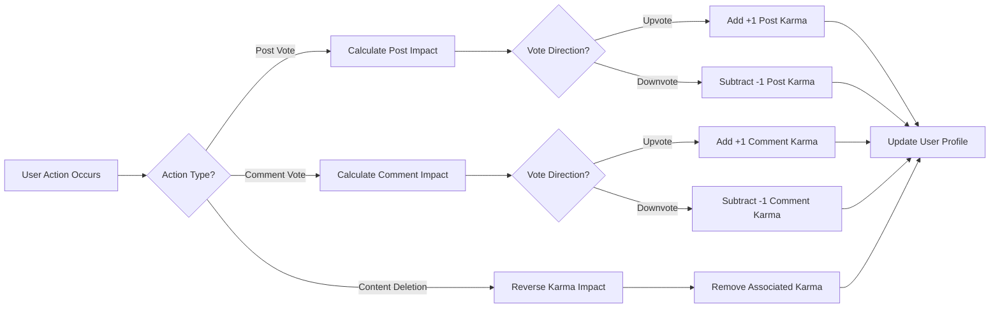

# User Profile and Karma System Requirements

## Document Overview
This document specifies the complete requirements for user profiles, karma scoring, and reputation management systems in the Reddit-like community platform. The profile system serves as the user's identity hub, while the karma system provides gamification and reputation tracking mechanisms that drive user engagement and content quality.

## User Profile Features

### Profile Data Structure
THE system SHALL maintain comprehensive user profiles containing the following core information:

**Basic Profile Information:**
- Display name (editable by user)
- Avatar/Profile picture
- Bio/About section (text field)
- Account creation date
- Online status indicator

**Account Statistics:**
- Total karma points (separated by post karma and comment karma)
- Number of posts created
- Number of comments made
- Number of communities subscribed to
- Account age in days
- Trophy case (achievements and badges)

**Activity Indicators:**
- Recent activity timestamp
- Last login date
- Streak counter (consecutive days active)
- Content distribution by community

### Profile Management Functions
WHEN a user accesses their profile page, THE system SHALL provide editing capabilities for customizable sections.

WHEN a user updates their profile information, THE system SHALL validate changes and apply updates immediately.

THE system SHALL maintain profile integrity by preventing duplicate display names and enforcing character limits.

## Karma System Mechanics

### Karma Point Fundamentals
THE karma system SHALL track two primary karma types: post karma and comment karma.

**Karma Scoring Rules:**
- Upvote on user's post: +1 post karma
- Downvote on user's post: -1 post karma
- Upvote on user's comment: +1 comment karma
- Downvote on user's comment: -1 comment karma
- Post deletion: karma points from that post are removed
- Comment deletion: karma points from that comment are removed

### Karma Calculation Algorithm

### Karma Weighting and Anti-abuse Measures
WHEN calculating karma from votes, THE system SHALL apply weighting based on voter reputation to prevent manipulation.

IF suspicious voting patterns are detected (e.g., rapid downvoting from new accounts), THEN THE system SHALL apply reduced karma impact from those votes.

WHERE high-reputation users are involved, THE system SHALL maintain standard karma weighting to preserve system integrity.

## Reputation and Ranking System

### Reputation Tiers and Badges
THE system SHALL implement reputation tiers based on total karma accumulation:

| Karma Range | Tier Name | Badge Color | Special Privileges |
|-------------|-----------|-------------|---------------------|
| 0-99 | New User | Gray | Basic posting rights |
| 100-999 | Active Member | Green | Extended posting limits |
| 1,000-4,999 | Trusted User | Blue | Higher voting weight |
| 5,000-9,999 | Community Leader | Purple | Early feature access |
| 10,000+ | Elite Contributor | Gold | Moderator nomination eligibility |

### Achievement System
THE system SHALL award achievement badges for specific accomplishments:
- **First Post**: First content submission
- **Comment Champion**: 100+ comment karma
- **Content Creator**: 500+ post karma
- **Community Builder**: Create 5+ active communities
- **Helpful User**: Receive 10+ helpful awards
- **Consistent Contributor**: 30-day activity streak

## Activity History and Metrics

### Comprehensive Activity Tracking
WHEN a user performs any significant action, THE system SHALL record the activity with timestamp and context.

**Activity Types Tracked:**
- Post creation and edits
- Comment submissions and replies
- Voting actions (upvotes/downvotes given and received)
- Community subscriptions and unsubscriptions
- Profile updates and settings changes
- Moderation actions (for moderators/admins)

### Activity Visualization
WHEN displaying user activity, THE system SHALL provide multiple view options:
- Chronological activity feed
- Activity by content type (posts vs comments)
- Activity by community
- Voting history and patterns
- Contribution metrics over time

### Performance Metrics
THE system SHALL calculate and display user engagement metrics:
- Average votes per post
- Comment-to-post ratio
- Most successful content types
- Peak activity times
- Community participation distribution

## Privacy and Visibility Settings

### Profile Visibility Controls
THE system SHALL provide granular privacy controls for profile information:

**Visibility Levels Available:**
- Public (visible to anyone)
- Community Members Only (visible to logged-in users)
- Followers Only (visible to users who follow the profile)
- Private (visible only to the user)

**Controllable Profile Elements:**
- Email address
- Join date
- Karma breakdown
- Voting history
- Subscription list
- Online status

### Activity Privacy Settings
WHEN a user adjusts privacy settings, THE system SHALL immediately apply changes to existing and future content visibility.

IF a user sets their voting history to private, THEN THE system SHALL hide voted content from other users' views.

WHERE community-specific settings exist, THE system SHALL prioritize community privacy rules over individual settings.

## Integration Requirements

### Authentication System Integration
THE profile system SHALL integrate with the platform's authentication system to maintain synchronized user data.

### Content System Integration
WHEN content is created or modified, THE profile system SHALL update user statistics and activity records.

### Voting System Integration
THE karma system SHALL receive real-time voting updates to calculate and apply karma changes instantly.

### Moderation System Integration
WHEN moderation actions affect user content, THE profile system SHALL reflect those changes in user statistics.

## Performance and Scalability Requirements

### Response Time Expectations
WHEN loading a user profile, THE system SHALL display basic information within 500 milliseconds.

WHEN calculating karma updates, THE system SHALL process changes within 100 milliseconds to maintain real-time accuracy.

### Data Management Requirements
THE system SHALL maintain 30 days of detailed activity history with aggregated data available for longer periods.

WHILE handling high-traffic scenarios, THE system SHALL maintain profile accessibility and karma calculation accuracy.

## Business Impact and Success Metrics

### Key Performance Indicators
THE platform SHALL track the following metrics to measure profile and karma system effectiveness:

- User profile completion rate (target: 85%+)
- Daily karma changes per active user (target: ±5 points)
- Achievement badge acquisition rate (target: 2+ badges per user monthly)
- Profile edit frequency (target: 1+ edits per user monthly)
- Privacy setting adoption rate (target: 60%+ users configure settings)

### Engagement Enhancement Goals
THE karma system SHALL contribute to overall platform engagement by providing clear progression indicators and reputation incentives.

WHEN users achieve karma milestones, THE system SHALL provide positive reinforcement through badge awards and tier promotions.

> *Developer Note: This document defines **business requirements only**. All technical implementations (architecture, APIs, database design, etc.) are at the discretion of the development team.*