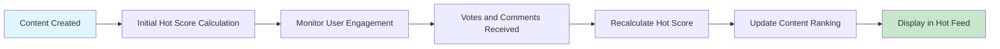
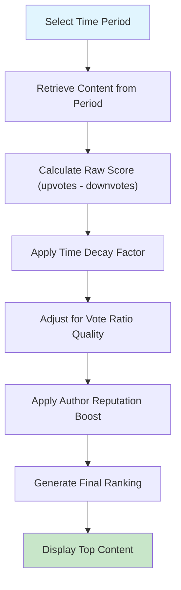
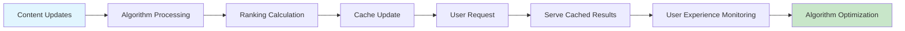

# Content Sorting and Ranking Algorithms Specification

## Executive Summary

This document defines the comprehensive sorting algorithms and ranking mechanisms for the communityPlatform service. These algorithms are critical for delivering the optimal user experience by ensuring content is displayed in the most relevant and engaging order based on user preferences and platform dynamics.

## Sorting Algorithm Overview

The platform provides four primary content sorting methods, each serving distinct user needs and content discovery patterns:

### Available Sorting Methods
1. **Hot** - Algorithmic ranking based on engagement, recency, and popularity
2. **New** - Chronological sorting of content by creation time
3. **Top** - Score-based ranking considering votes and time decay
4. **Controversial** - Identification of content with high engagement but polarized opinions

### User Experience Requirements
WHEN users select a sorting method, THE system SHALL apply the corresponding algorithm instantly and consistently across all content views.

WHEN content is displayed using any sorting method, THE system SHALL provide clear visual indicators showing the active sorting method.

## Hot Ranking Algorithm

The "Hot" algorithm balances content freshness with engagement metrics to surface trending content.

### Algorithm Formula
```
Hot Score = (log10(max(1, upvotes - downvotes)) + (comments_count / 10) + ((current_time - creation_time) / 45000)) * sign(upvotes - downvotes)
```

### Key Components
- **Engagement Weight**: Logarithmic scaling prevents domination by extremely popular content
- **Time Decay**: Content loses "hotness" over time at a controlled rate
- **Vote Balance**: Considers both upvotes and downvotes for balanced ranking
- **Comment Engagement**: Includes comment count as secondary engagement metric

### Business Rules
WHEN calculating hot scores, THE system SHALL:
- Apply logarithmic scaling to prevent viral content from dominating indefinitely
- Weight recent content more heavily than older content
- Consider both positive and negative engagement
- Ensure content with negative net votes appears lower in rankings
- Update hot scores every 5 minutes to reflect changing engagement

### Performance Requirements
THE hot ranking algorithm SHALL process content updates within 2 seconds of vote changes.



## New Content Sorting

This method provides chronological ordering of content based on creation time.

### Algorithm Specification
WHEN sorting by "new", THE system SHALL display content in descending order of creation timestamp.

### Content Freshness Rules
- Posts created within the last 24 hours receive priority placement
- Content older than 7 days may be deprioritized in certain views
- Creation time is determined by the server timestamp, not user device time

### Edge Case Handling
IF content creation times are identical, THEN THE system SHALL use content ID as secondary sorting criteria.

WHEN multiple posts are created simultaneously, THE system SHALL maintain consistent ordering across page refreshes.

## Top Content Ranking

Top ranking focuses on content quality and user consensus over time periods.

### Time Period Categories
THE system SHALL provide top content rankings for the following periods:
- Past hour
- Past 24 hours
- Past week
- Past month
- Past year
- All time

### Score Calculation
```
Top Score = (upvotes - downvotes) / (1 + (current_time - creation_time) / time_decay_factor)
```

### Time Decay Factors
| Time Period | Decay Factor | Description |
|-------------|--------------|-------------|
| Hour | 3600 | Minimal decay for recent content |
| Day | 86400 | Moderate decay for daily content |
| Week | 604800 | Standard decay for weekly content |
| Month | 2592000 | Increased decay for monthly content |
| Year | 31536000 | Significant decay for yearly content |
| All Time | 315360000 | Maximum decay for historical content |

### Content Quality Considerations
WHILE calculating top scores, THE system SHALL consider:
- Vote ratio (upvotes/total votes) for quality assessment
- Comment engagement as secondary quality indicator
- Author reputation for content credibility weighting



## Controversial Content Detection

Controversial content identification focuses on posts with high engagement but polarized opinions.

### Controversy Score Formula
```
Controversy Score = (total_votes) * abs(upvotes - downvotes) / (total_votes)^2
```

### Controversy Thresholds
THE system SHALL classify content as controversial WHEN:
- Total votes exceed 50
- Controversy score exceeds 0.7
- Upvote percentage is between 30% and 70%
- Content has at least 10 comments

### Business Rules for Controversial Content
WHEN displaying controversial content, THE system SHALL:
- Provide clear labeling indicating controversial nature
- Maintain neutral presentation without bias
- Allow users to filter controversial content if desired
- Ensure controversial detection doesn't suppress legitimate discussion

### Anti-Abuse Measures
IF content receives artificial vote manipulation, THEN THE system SHALL exclude it from controversial rankings.

WHEN vote manipulation is detected, THE system SHALL flag the content for moderator review.

## Algorithm Integration with Karma System

### User Reputation Impact
WHERE users have high karma, THEIR content SHALL receive slight ranking boosts in hot and top algorithms.

### Karma-Based Weighting
```
Ranking Boost = 1 + min((user_karma / 10000) * 0.1, 0.1)
```

### Limitations
THE karma-based boost SHALL NOT exceed 10% of the base ranking score.

WHEN users have negative karma, THEIR content SHALL receive reduced ranking visibility.

## Performance Requirements

### Response Time Expectations
WHEN users change sorting methods, THE system SHALL display re-sorted content within 1 second.

WHEN new content is added, THE system SHALL update rankings within 30 seconds.

### Scalability Considerations
WHILE processing large content volumes, THE algorithm SHALL maintain performance through:
- Database indexing optimization
- Caching of pre-calculated scores
- Batch processing of ranking updates
- Distributed computing for ranking calculations

### Concurrent Update Handling
THE system SHALL handle simultaneous vote updates without ranking inconsistencies.

WHEN multiple users vote on the same content simultaneously, THE system SHALL maintain vote integrity.

## Implementation Guidelines

### Database Design Considerations
- Store pre-calculated ranking scores for performance
- Implement efficient timestamp-based indexing
- Consider materialized views for complex calculations
- Partition content tables by creation date for better performance

### Caching Strategy
- Cache sorted content lists with appropriate TTL
- Implement cache invalidation on content updates
- Use distributed caching for scalability
- Cache algorithm results for frequently accessed content

### Monitoring and Analytics
THE system SHALL track:
- Algorithm performance metrics
- User sorting preference patterns
- Content discovery effectiveness
- Ranking accuracy and user satisfaction



## User Experience Specifications

### Sorting Method Persistence
WHEN users select a sorting method, THE system SHALL remember their preference across sessions.

WHEN users return to the platform, THE system SHALL restore their last used sorting method.

### Default Sorting Behavior
THE platform SHALL default to "Hot" sorting for authenticated users and "New" for logged-out users.

### Mobile Optimization
WHERE users access via mobile devices, THE sorting algorithms SHALL maintain performance and responsiveness.

WHEN mobile users have limited bandwidth, THE system SHALL optimize content delivery for sorting operations.

## Edge Cases and Special Handling

### Zero-Vote Content
IF content has zero votes, THEN THE system SHALL sort it by creation time within its score category.

WHEN new content has no engagement, THE system SHALL give it initial visibility in "New" sorting.

### Negative Score Content
WHILE content has negative net votes, IT SHALL appear lower in rankings but remain accessible.

WHEN content receives excessive downvotes, THE system SHALL consider automatic moderation review.

### Content Age Considerations
CONTENT older than 30 days SHALL receive reduced weighting in hot algorithms unless experiencing recent engagement.

WHEN old content receives new engagement, THE system SHALL recalculate its ranking appropriately.

## Integration with Authentication System

### User Role Impact
WHILE users are guests, THE system SHALL provide limited sorting options focused on discovery.

WHEN users are authenticated members, THE system SHALL provide full sorting capabilities.

WHERE users are moderators, THE system SHALL include moderation-specific sorting options.

### Permission-Based Sorting
THE system SHALL respect community privacy settings when applying sorting algorithms.

WHEN content is restricted, THE system SHALL exclude it from public sorting results.

## Success Metrics

### Algorithm Effectiveness
THE sorting algorithms SHALL be measured by:
- User engagement rates with sorted content
- Time spent viewing content
- Content discovery effectiveness
- User satisfaction with sorting options

### Performance Benchmarks
- 95th percentile response time under 2 seconds
- 99.9% algorithm calculation accuracy
- Support for 1 million+ concurrent content items
- Ranking consistency across different user sessions

### Business Impact Metrics
THE success of sorting algorithms SHALL contribute to:
- User retention rates
- Content creation frequency
- Community growth metrics
- Platform engagement levels

## Error Handling and Recovery

### Algorithm Failures
IF ranking calculations fail, THEN THE system SHALL fall back to basic chronological sorting.

WHEN algorithm errors occur, THE system SHALL log detailed error information for debugging.

### Data Consistency
THE system SHALL maintain data consistency across ranking updates.

WHEN ranking data becomes inconsistent, THE system SHALL have recovery procedures.

### Performance Degradation
IF system performance degrades, THEN THE system SHALL implement graceful degradation of sorting features.

WHEN under heavy load, THE system SHALL prioritize core sorting functionality over advanced features.

This specification provides the complete business requirements for content sorting and ranking algorithms. Developers have full autonomy over technical implementation details including database design, API structure, and architectural decisions.

> *Developer Note: This document defines **business requirements only**. All technical implementations (architecture, APIs, database design, etc.) are at the discretion of the development team.*