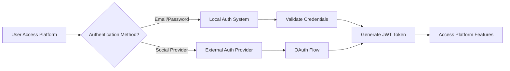
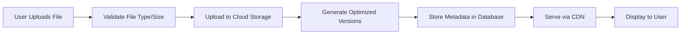
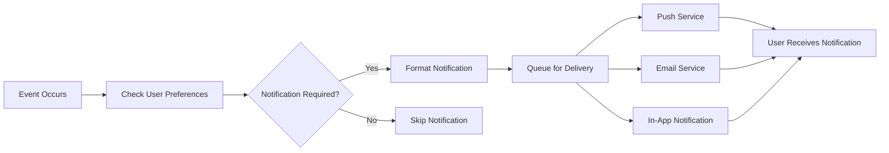

# External Integrations and Data Flow Requirements

## Introduction and Overview

This document defines the external service integrations, data flow architecture, and system interoperability requirements for the Reddit-like community platform. The platform requires seamless integration with various third-party services to provide a complete user experience while maintaining data security and performance standards.

### Integration Objectives
- Enable users to authenticate using external identity providers
- Provide reliable media storage and content delivery
- Implement robust notification systems
- Support comprehensive analytics and monitoring
- Ensure data flows efficiently between integrated services

## Third-Party Service Integrations

### Authentication Providers

**OAuth and Social Login Integration Requirements:**

WHEN a user chooses to register using an external provider, THE system SHALL support integration with major OAuth providers including Google, Facebook, Twitter, and GitHub.

THE authentication system SHALL:
- Allow users to link multiple external accounts to a single platform account
- Provide seamless login experience across integrated providers
- Maintain secure token management for external authentication
- Handle authentication failures gracefully with user-friendly error messages

**Social Profile Integration:**
WHERE users authenticate via social providers, THE system SHALL optionally import basic profile information (display name, avatar) with user consent.

### Media Storage and CDN Integration

**File Upload and Storage Requirements:**

WHEN users upload images or media files, THE system SHALL integrate with a cloud storage service for reliable file management.

THE media handling system SHALL:
- Support image uploads up to 10MB per file
- Automatically optimize images for web delivery
- Generate multiple thumbnail sizes for different display contexts
- Provide secure file access with expiration for sensitive content

**Content Delivery Requirements:**
THE platform SHALL integrate with a Content Delivery Network (CDN) to ensure fast media delivery globally.

### Email Service Integration

**Transactional Email Requirements:**

WHEN user registration is completed, THE system SHALL send email verification messages.
WHEN users request password reset, THE system SHALL send secure reset instructions.
WHEN important platform notifications occur, THE system SHALL notify users via email.

THE email integration SHALL:
- Support HTML and plain-text email formats
- Provide delivery status tracking and failure handling
- Maintain email templates for different notification types
- Handle bounce management and invalid email addresses

### Notification Service Integration

**Real-time Notification Requirements:**

WHEN users receive new replies to their posts or comments, THE system SHALL deliver real-time notifications.
WHEN moderators take action on user content, THE system SHALL notify affected users.

THE notification system SHALL:
- Support push notifications for mobile and web
- Provide in-app notification feeds
- Allow users to customize notification preferences
- Maintain notification history for user reference

## Data Flow Architecture

### User Authentication Flow

### Media Upload and Processing Flow

### Notification Delivery Flow

## API Integration Requirements

### External API Integration

**Rate Limiting and Throttling:**
WHILE integrating with external APIs, THE system SHALL implement appropriate rate limiting to prevent service abuse.

**Error Handling for External Services:**
IF an external service becomes unavailable, THEN THE system SHALL provide graceful degradation and informative error messages.

**Data Synchronization:**
WHERE external data sources are used, THE system SHALL maintain data consistency and handle synchronization conflicts appropriately.

### Internal API Requirements

**API Versioning:**
THE platform SHALL support API versioning to ensure backward compatibility during updates.

**Documentation Standards:**
ALL internal APIs SHALL have comprehensive documentation following OpenAPI specifications.

## File and Media Handling

### Supported File Types

THE platform SHALL support the following file types for upload:
- Images: JPEG, PNG, GIF, WebP
- Documents: PDF (for community guidelines and rules)
- Archives: ZIP (for community resource packs)

### File Processing Requirements

**Image Optimization:**
WHEN users upload images, THE system SHALL automatically optimize them for web delivery while maintaining quality.

**Virus Scanning:**
ALL uploaded files SHALL be scanned for malware before being made available to users.

**Storage Organization:**
Files SHALL be organized in a logical directory structure based on community, user, and content type.

## Notification Systems

### Notification Types

THE platform SHALL support the following notification categories:
- **Content Notifications**: New replies, mentions, post approvals
- **Community Notifications**: New members, community updates, moderator actions
- **System Notifications**: Platform updates, policy changes, security alerts

### Delivery Methods

**Push Notifications:**
WHERE users have enabled push notifications, THE system SHALL deliver real-time alerts for important events.

**Email Notifications:**
Users SHALL receive email notifications for critical account activities and important platform updates.

**In-App Notifications:**
ALL users SHALL have access to an in-app notification center showing recent activities.

## Analytics and Reporting Requirements

### User Analytics

THE platform SHALL integrate analytics to track:
- User engagement metrics (posts, comments, votes)
- Community growth and activity patterns
- Content performance and popularity
- User retention and churn rates

### Performance Monitoring

**System Health Monitoring:**
THE platform SHALL monitor key performance indicators including:
- API response times
- Server resource utilization
- Database performance metrics
- External service availability

**Error Tracking:**
ALL system errors and exceptions SHALL be logged and tracked for analysis and resolution.

### Business Intelligence

**Reporting Requirements:**
Administrators SHALL have access to comprehensive reports showing:
- Platform usage statistics
- Revenue metrics (if applicable)
- User demographic information
- Content moderation statistics

## Data Security and Compliance

### Data Protection

**Encryption Requirements:**
ALL sensitive user data SHALL be encrypted both in transit and at rest.

**Data Retention Policies:**
THE platform SHALL implement data retention policies compliant with relevant privacy regulations.

### Compliance Requirements

**GDPR Compliance:**
WHERE applicable, THE system SHALL provide features for GDPR compliance including data export and deletion requests.

**Access Logging:**
ALL access to user data and administrative functions SHALL be logged for security auditing.

## Integration Testing Requirements

### Test Scenarios

THE development team SHALL create comprehensive test scenarios covering:
- External authentication provider integrations
- File upload and processing workflows
- Notification delivery across all channels
- API integration error handling
- Data synchronization between services

### Performance Testing

**Load Testing:**
ALL integrated services SHALL be tested under expected load conditions to ensure performance requirements are met.

**Failure Recovery Testing:**
Integration points SHALL be tested for graceful degradation when external services fail.

## Success Criteria

### Integration Success Metrics

- External authentication success rate: >99%
- File upload success rate: >99.5%
- Notification delivery rate: >98%
- API integration uptime: >99.9%
- Data synchronization accuracy: 100%

### User Experience Metrics

- Authentication process completion time: <5 seconds
- File upload processing time: <10 seconds for typical images
- Notification delivery latency: <30 seconds for critical notifications
- External service failure recovery time: <1 minute

## Future Integration Considerations

### Scalability Requirements

THE integration architecture SHALL be designed to support future scaling including:
- Additional authentication providers
- Enhanced media processing capabilities
- Expanded notification channels
- Advanced analytics features

### Extensibility

THE platform SHALL provide clear interfaces for adding new integrations without major architectural changes.

## Integration Error Handling and Recovery

### Authentication Service Failures

WHEN an external authentication provider becomes unavailable, THE system SHALL:
- Provide clear error messages to users
- Allow fallback to email/password authentication
- Queue authentication requests for retry
- Notify administrators of service disruption

### Media Service Disruptions

IF the media storage service experiences downtime, THEN THE system SHALL:
- Continue operating with existing media files
- Queue new uploads for processing when service resumes
- Provide temporary local storage for critical uploads
- Implement graceful degradation for media-dependent features

### Notification Delivery Failures

WHERE notification services fail to deliver messages, THE system SHALL:
- Retry delivery with exponential backoff
- Log delivery failures for analysis
- Provide alternative notification methods
- Notify users of delivery issues when appropriate

## Integration Performance Monitoring

### Real-time Monitoring

THE system SHALL implement comprehensive monitoring for all integrated services:
- API response time tracking
- Service availability monitoring
- Error rate analysis
- Performance trend reporting

### Alerting and Notification

WHEN integration performance degrades below acceptable thresholds, THE system SHALL:
- Trigger immediate alerts to operations team
- Provide detailed diagnostic information
- Suggest potential remediation actions
- Escalate based on severity and impact

## Integration Security Requirements

### API Security

ALL external API integrations SHALL implement:
- Secure authentication mechanisms
- API key rotation policies
- Rate limiting and throttling
- Request validation and sanitization

### Data Privacy

WHERE user data is shared with external services, THE system SHALL:
- Implement data minimization principles
- Ensure proper data encryption
- Maintain data processing agreements
- Provide user consent mechanisms

## Integration Documentation Standards

### Technical Documentation

EACH external integration SHALL have comprehensive documentation covering:
- Integration architecture and flow
- API specifications and endpoints
- Error codes and handling procedures
- Performance characteristics and limitations

### Operational Documentation

THE platform SHALL maintain operational runbooks for all integrations including:
- Troubleshooting procedures
- Service recovery steps
- Contact information for vendor support
- Escalation protocols for critical issues

> *Developer Note: This document defines **business requirements only**. All technical implementations (architecture, APIs, database design, etc.) are at the discretion of the development team.*