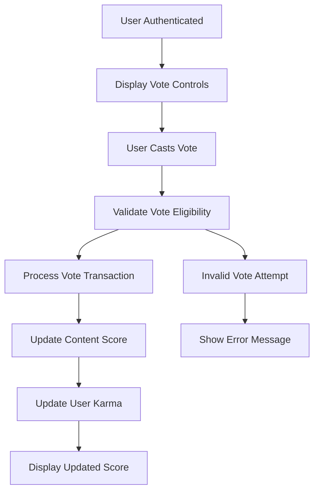
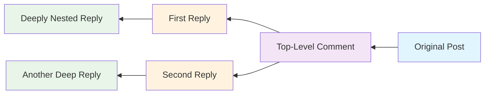

# Voting Systems Requirements Specification

## Executive Summary
The voting system is a core component enabling users to express opinions on content through upvotes and downvotes. This system maintains content quality, user reputation via karma scores, and drives engagement across posts and comments while preventing manipulation and ensuring atomic operations.

## System Architecture Overview

The voting system provides consistent evaluation mechanisms for all platform content, ensuring immediate score updates and karma tracking while maintaining data integrity.

### Core Voting Flow

## Post Voting System Requirements

### Vote Casting Rules
WHEN a user is authenticated AND views content, THE system SHALL display vote controls with current score indication.

WHEN a user clicks the upvote button on content they haven't voted on, THE system SHALL increase the content's vote score by 1 point immediately.

WHEN a user clicks the downvote button on content they haven't voted on, THE system SHALL decrease the content's vote score by 1 point immediately.

### Single Vote Enforcement
THE system SHALL ensure each user maintains exactly one vote per content item.

IF a user attempts multiple votes on the same content, THE system SHALL reject additional votes and maintain existing vote state.

### Vote Score Calculation
THE system SHALL calculate content vote scores as: total upvotes minus total downvotes.

WHERE content receives more upvotes than downvotes, THE vote score SHALL be positive.

WHERE content receives more downvotes than upvotes, THE vote score SHALL be negative.

### Vote Change Mechanics
WHEN a user changes vote from upvote to downvote, THE system SHALL subtract 2 from content score (removing +1 upvote, adding -1 downvote).

WHEN a user changes vote from downvote to upvote, THE system SHALL add 2 to content score (removing -1 downvote, adding +1 upvote).

WHEN a user removes vote entirely, THE system SHALL adjust content score by inverse of previous vote (+1 if removing downvote, -1 if removing upvote).

## Comment Voting System Requirements

### Consistent Voting Implementation
THE voting system SHALL apply identical rules and mechanics to comments as posts.

### Nested Comment Voting Integrity
WHEN voting on nested comments, THE system SHALL treat each comment as independent voting entity.

EACH comment voting action SHALL impact only that specific comment's score and author's karma.

## Karma Calculation System

### Real-time Karma Updates
WHEN content receives upvote, THE content creator's karma SHALL increase by 1 point immediately.

WHEN content receives downvote, THE content creator's karma SHALL decrease by 1 point immediately.

WHEN vote action changes or removes, THE karma SHALL adjust accordingly to reflect net change.

### Karma Score Properties
THE karma scoring system SHALL support both positive and negative values.

THE karma display SHALL update in real-time across all user interfaces.

### Atomic Karma Operations
THE system SHALL perform karma updates atomically to prevent race conditions and ensure data consistency.

## Anti-Gaming and Abuse Prevention

### Self-Voting Prevention
THE system SHALL prohibit users from voting on their own content.

IF self-voting attempt occurs, THE system SHALL reject vote and display appropriate error message.

### Rate Limiting Implementation
The system SHALL enforce vote rate limiting:
- Maximum 50 votes per user per minute
- Progressive delays for rapid voting patterns
- Temporary lockouts for excessive voting activity

### Vote Manipulation Detection
THE system SHALL monitor voting patterns for:
- Coordinated voting from connected accounts
- Rapid voting bursts targeting specific content
- Unusual voting patterns indicating manipulation
The system SHALL flag suspicious activity for moderator review.

## User Interface Requirements

### Vote Status Visibility
WHEN user has voted on content, THE system SHALL visually indicate current vote state:
- Upvote button highlighted for active upvote
- Downvote button highlighted for active downvote
- Neutral state for no vote or vote removal

### Score Display Standards
WHERE vote counts exceed readability thresholds, THE system SHALL display abbreviated formats:
- 1,000-999,999: Display as 1.2k, 45.7k, 999k
- 1,000,000+: Display as 1.2m, 15.7m

## Performance and Scalability

### Response Time Targets
Vote processing SHALL complete within 200 milliseconds under normal load.

Score updates SHALL propagate to all connected clients within 500 milliseconds.

### Concurrent Vote Handling
THE system SHALL handle 1,000 concurrent votes per second during peak loads.

Vote processing SHALL maintain consistency under high concurrency through optimistic locking.

### Database Optimization
Vote records SHALL use efficient indexing on user-content pairs for fast vote state lookups.

Karma updates SHALL use atomic operations to prevent race conditions.

## Integration Points

### Authentication System Integration
Voting actions SHALL require valid authentication credentials.

The system SHALL validate user permissions before processing votes.

### Content Management Integration
Vote counts SHALL update content scores immediately in content management system.

Content deletion SHALL trigger automatic vote record cleanup.

### User Profile Integration
Karma score updates SHALL reflect immediately in user profile displays.

Profile karma history SHALL track contribution reputation accurately.

## Audit and Logging Requirements

### Comprehensive Vote Tracking
THE system SHALL log all vote activities with:
- User identifier
- Content identifier
- Vote type and timestamp
- IP address for security auditing

### Karma Change History
WHEN karma changes occur, THE system SHALL record:
- User affected
- Magnitude and direction of change
- Content causing change
- Timestamp of karma adjustment

### Security Event Monitoring
Vote manipulation attempts SHALL trigger security alerts for administrator review.

Unusual voting patterns SHALL be logged for pattern analysis.

## Business Logic Scenarios

### New User Voting Flow

### Content Lifecycle Voting Impact
WHEN content is created, THE vote score SHALL initialize to zero.

AS content receives votes, THE score SHALL reflect community sentiment.

WHEN content achieves high scores, THE system SHALL promote it through feed algorithms.

WHEN content receives excessive downvotes, THE system SHALL consider automatic moderation review.

### Vote Integrity Verification
THE system SHALL regularly verify vote-karma consistency through reconciliation processes.

Data inconsistencies SHALL trigger automatic correction routines.

## Error Handling and Recovery

### Vote Processing Failures
IF vote processing encounters system errors, THE transaction SHALL roll back completely.

Users SHALL receive clear error messages for failed vote attempts.

### Data Consistency Maintenance
WHEN vote-karma inconsistencies are detected, THE system SHALL initiate automatic reconciliation.

Manual correction tools SHALL be available to administrators for complex inconsistency resolution.

### Network Failure Scenarios
IF network interruption occurs during vote processing, THE system SHALL maintain vote state consistency upon recovery.

Pending votes SHALL be queued and processed when connectivity returns.

## Compliance and Privacy

### Data Protection Compliance
Vote records SHALL be retained according to data protection regulations.

User voting history SHALL be accessible for user data export requests.

### Privacy Considerations
Individual vote records SHALL remain private and visible only to system administrators.

Aggregate voting patterns MAY be used for platform analytics while protecting user anonymity.

## Success Metrics and Monitoring

### Key Performance Indicators
- Vote completion rate (>99.5% success)
- Average vote processing time (<200ms)
- Karma update accuracy (100% consistency)
- User voting participation rate

### System Health Monitoring
- Vote queue processing rates
- Database connection utilization
- Error rate tracking for vote operations
- Performance degradation alerts

### Quality Assurance Metrics
- Vote manipulation detection effectiveness
- User satisfaction with voting experience
- System reliability during peak voting periods
- Data consistency audit results

## Implementation Guidelines

### Development Priority
Voting system implementation SHALL prioritize:
1. Vote processing reliability and atomicity
2. Real-time score and karma updates
3. Anti-gaming and manipulation prevention
4. Performance optimization for scale

### Testing Requirements
UNIT tests SHALL verify vote state transitions and karma calculations.

INTEGRATION tests SHALL validate voting system interactions with authentication and content management.

LOAD tests SHALL simulate peak voting scenarios to ensure system stability.

### Deployment Considerations
Voting system deployment SHALL include:
- Gradual feature rollout with monitoring
- Performance benchmarking against targets
- Backup and recovery procedures verification
- Migration strategies for existing voting data

This enhanced specification provides comprehensive requirements for implementing a robust, scalable voting system that maintains data integrity, prevents manipulation, and delivers responsive user experience.