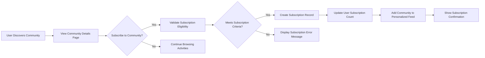

# Community Subscription and Feed Management Requirements

## Executive Summary

This document defines the complete business requirements for the community subscription system and personalized feed generation for the communityPlatform service. The subscription system enables users to follow communities of interest, while the personalized feed aggregates content from subscribed communities based on user preferences, engagement patterns, and platform algorithms.

## 1. Community Subscription Model

### 1.1 Subscription Types and Definitions
WHEN a user registers for the platform, THE system SHALL provide two distinct subscription types:
- **Active Subscriptions**: Communities the user explicitly chooses to follow through manual selection
- **Suggested Subscriptions**: Communities automatically recommended based on user interests, behavior patterns, and platform trends

### 1.2 Subscription Creation Workflow
WHEN a user discovers a community they wish to follow, THE system SHALL execute the following subscription workflow:



**Business Rules for Subscription Eligibility:**
- Users must have minimum 10 karma points to subscribe to new communities
- Maximum 500 active subscriptions per user account
- Rate limit: 10 subscription changes per minute per user
- Private communities require moderator approval before subscription

### 1.3 Subscription Management Interface
WHEN a user accesses their subscription management dashboard, THE system SHALL provide comprehensive management capabilities:

**Subscription Actions Available:**
- Subscribe to new communities through search and discovery
- Unsubscribe from existing communities with one-click removal
- Reorder community priority for feed customization
- Temporarily mute communities (1-30 days) without unsubscribing
- Export subscription list in CSV format for backup purposes

**WHEN managing subscriptions, THE system SHALL enforce:**
- Real-time synchronization across all user devices
- Immediate feed updates upon subscription changes
- Privacy controls for subscription visibility
- Bulk subscription management for power users

## 2. Personalized Feed Generation Logic

### 2.1 Feed Content Aggregation Sources
THE personalized feed SHALL aggregate content from multiple sources to ensure comprehensive content discovery:

**Primary Content Sources:**
- Posts from actively subscribed communities (70% weighting)
- Trending posts from suggested communities based on interests (15% weighting)
- Popular posts from user's geographic region and language (10% weighting)
- Posts from communities with similar topic interests (5% weighting)

### 2.2 Multi-Factor Feed Ranking Algorithm
WHEN generating personalized feed content, THE system SHALL apply the following ranking formula:

```
Feed Score = (Post_Score × 0.4) + (Time_Decay × 0.25) + (User_Engagement × 0.2) + (Community_Popularity × 0.1) + (Content_Type_Preference × 0.05)
```

**Detailed Algorithm Components:**

**Post Score Calculation:**
```
Post_Score = (upvotes - downvotes) / (1 + abs(upvotes - downvotes)^0.8)
```

**Time Decay Function:**
```
Time_Decay = max(0, 1 - (current_time - post_time) / 604800)  // 7-day linear decay
```

**User Engagement Factor:**
```
User_Engagement = min(1, user_community_interactions / 100)  // Normalized to 0-1 range
```

### 2.3 Feed Personalization Based on User Behavior
WHERE user engagement patterns exist, THE system SHALL personalize feed content using machine learning algorithms that consider:

**Behavioral Factors:**
- User voting history and patterns across different content types
- Commenting frequency and engagement depth with specific communities
- Time-of-day activity patterns and content consumption preferences
- Content type preferences (text vs. image vs. link content)
- Community interaction levels and moderator participation

**WHEN processing user behavior data, THE system SHALL:**
- Update personalization models daily based on recent activity
- Maintain privacy by anonymizing behavioral data for model training
- Provide users with transparency about personalization factors
- Allow users to reset personalization preferences

## 3. Subscription Management Features

### 3.1 Comprehensive Subscription Interface
WHEN a user accesses subscription management, THE system SHALL provide an intuitive interface with:

**Interface Components:**
- Visual list of current subscriptions with community statistics (member count, activity level)
- Advanced search and filter capabilities by community size, activity, and topic
- Bulk subscription management for adding/removing multiple communities
- Subscription export functionality for data portability
- Subscription analytics showing engagement metrics per community

### 3.2 Intelligent Community Discovery
THE system SHALL provide sophisticated community discovery mechanisms:

**Discovery Algorithms:**
- Content-based recommendations using natural language processing
- Collaborative filtering based on users with similar subscription patterns
- Trending communities detection using engagement velocity metrics
- Geographic and language-based community suggestions
- New community highlighting for platform growth

**WHEN recommending communities, THE system SHALL:**
- Display recommendation confidence scores
- Explain recommendation rationale to users
- Limit recommendations to 10 per day to prevent overload
- Allow users to provide feedback on recommendation quality

### 3.3 Subscription Notification System
WHEN new content is posted in subscribed communities, THE system SHALL provide configurable notifications:

**Notification Types:**
- Push notifications for highly engaged communities (>80% interaction rate)
- Email digests for daily/weekly summaries of top content
- In-app notification badges for new posts in priority communities
- Browser notifications for breaking news or trending content

**Notification Configuration:**
- Users can set notification preferences per community
- Frequency controls (immediate, daily digest, weekly summary)
- Content type filters for notification triggers
- Quiet hours scheduling to respect user availability

## 4. Feed Customization and User Control

### 4.1 Multiple Feed View Modes
THE system SHALL provide diverse feed viewing options to accommodate different user preferences:

**Available View Modes:**
- **Algorithmic View**: Default personalized ranking using the multi-factor algorithm
- **Chronological View**: Pure reverse-chronological order from all subscriptions
- **Community Group View**: Posts grouped by community with collapsible sections
- **Compact View**: Minimalist display optimized for rapid content scanning
- **Card View**: Rich media display with enhanced visual presentation

### 4.2 Advanced Content Filtering Options
WHERE users require specific content filtering, THE system SHALL provide granular control:

**Filtering Capabilities:**
- Content type filtering (text posts, image posts, link posts, discussions)
- Post score threshold filtering (show only posts above specific vote counts)
- Community size-based filtering (small, medium, large communities)
- Content age filtering (past hour, day, week, month)
- Author reputation filtering based on karma thresholds

**WHEN applying filters, THE system SHALL:**
- Maintain filter preferences across sessions
- Provide quick filter presets for common use cases
- Show filter result counts for transparency
- Allow combination of multiple filters

### 4.3 Feed Refresh and Content Loading
WHEN users interact with their feed, THE system SHALL provide responsive content loading:

**Refresh Mechanisms:**
- Manual refresh with pull-to-refresh gesture on mobile devices
- Automatic background refresh every 5 minutes when application is active
- Intelligent content preloading based on user scrolling behavior
- Offline content caching for 24 hours of recent feed content

**Performance Requirements:**
- Initial feed load complete within 2 seconds for 95% of users
- Feed refresh operations complete within 1 second
- Infinite scroll loading of additional content within 500ms
- Support for 1,000+ posts in continuous scroll without performance degradation

## 5. Performance and Scalability Requirements

### 5.1 Feed Loading Performance Standards
THE system SHALL meet stringent performance targets to ensure optimal user experience:

**Response Time Requirements:**
- **Initial Feed Load**: Under 2 seconds for 95% of requests
- **Feed Refresh**: Under 1 second for 95% of requests
- **Subscription Updates**: Under 500ms for 95% of requests
- **Content Filtering**: Under 300ms for filter application

**Throughput Capacity:**
- Support 1 million concurrent users during peak traffic
- Process 10,000 feed requests per second
- Handle 100,000 subscription updates per minute
- Maintain performance with 10 million+ active subscriptions

### 5.2 Scalability Architecture Requirements
WHILE the platform experiences growth, THE system SHALL implement scalable architecture:

**Database Scaling Strategy:**
- Read replicas for feed generation queries
- Database sharding by user ID for subscription data
- Content partitioning by creation date for archival
- Connection pooling with minimum 500 concurrent connections

**Caching Implementation:**
- Multi-level caching (Redis → CDN → Browser) for feed content
- User-specific feed cache with 5-minute TTL
- Community content cache with 1-minute TTL
- Trending content cache with 30-minute TTL
- Cache invalidation on content updates within 10 seconds

## 6. Error Handling and Edge Case Management

### 6.1 Subscription Failure Scenarios
IF subscription operations encounter errors, THE system SHALL provide graceful handling:

**Common Error Scenarios:**
- **Network Connectivity Issues**: Retry mechanism with exponential backoff
- **Database Unavailability**: Fallback to cached subscription data
- **Rate Limit Exceeded**: Clear error message with retry timing information
- **Community Access Restrictions**: Explain permission requirements

**WHEN subscription errors occur, THE system SHALL:**
- Provide specific error codes for troubleshooting
- Maintain user interface stability during errors
- Offer alternative actions when primary operations fail
- Log errors for system monitoring and improvement

### 6.2 Empty Feed Handling
IF a user has no subscriptions or subscribed communities have no content, THE system SHALL:

**Empty State Management:**
- Display community discovery suggestions with explanation
- Show trending content from across the platform
- Provide onboarding guidance for new users
- Offer quick subscription options based on user interests

**WHEN handling empty feeds, THE system SHALL:**
- Avoid showing completely blank pages
- Provide clear calls-to-action for feed population
- Track empty state frequency for user experience improvement
- Offer personalized recommendations based on registration information

### 6.3 Content Access Changes
IF subscribed communities change access permissions, THE system SHALL handle transitions gracefully:

**Access Change Scenarios:**
- **Community Goes Private**: Remove from feed with explanation
- **Community Becomes Restricted**: Show content preview with subscription requirement
- **Community Deletion**: Remove with notification and alternative suggestions
- **User Banned from Community**: Explain moderation action and appeal process

## 7. Integration with Authentication and Security

### 7.1 Authentication System Integration
THE subscription system SHALL integrate seamlessly with platform authentication:

**Authentication Requirements:**
- All subscription operations require valid user authentication
- Subscription data is user-specific and privacy-protected
- Session management ensures subscription persistence across devices
- Secure token validation for all API calls involving subscription data

**WHEN authentication state changes, THE system SHALL:**
- Clear subscription caches on logout
- Restore subscriptions on login from any device
- Support subscription transfer during account merging
- Maintain subscription integrity during password changes

### 7.2 Security and Privacy Protections
THE system SHALL implement robust security measures for subscription data:

**Data Protection:**
- Encrypt subscription data at rest using AES-256 encryption
- Implement proper access controls for subscription APIs
- Audit subscription changes for security monitoring
- Comply with GDPR requirements for subscription data management

**Privacy Considerations:**
- Subscription lists are private by default
- Opt-in sharing for public subscription display
- Clear privacy controls for subscription visibility
- Data minimization in subscription analytics

## 8. Data Retention and Compliance

### 8.1 Subscription Data Retention
THE system SHALL implement appropriate data retention policies:

**Retention Periods:**
- Active subscription records: Retained for user account lifetime
- Subscription history: Retained for 2 years for analytics
- Feed interaction data: Retained for 1 year for personalization
- Community discovery data: Retained for 6 months for recommendation improvement

### 8.2 Regulatory Compliance
THE subscription system SHALL comply with relevant regulations:

**Compliance Requirements:**
- GDPR compliance for EU user data protection
- CCPA compliance for California user privacy
- Data portability requirements for subscription exports
- Right to be forgotten implementation for account deletion

## 9. Success Metrics and Monitoring

### 9.1 Key Performance Indicators
THE success of the subscription and feed system SHALL be measured by:

**Engagement Metrics:**
- User subscription retention rate (target: 85% monthly retention)
- Daily active users engaging with feed (target: 70% DAU feed interaction)
- Average time spent in feed per session (target: 8+ minutes)
- Subscription-to-engagement conversion rate (target: 60%)

**Technical Metrics:**
- Feed load time 95th percentile under 2 seconds
- Subscription update success rate above 99.9%
- System availability 99.9% uptime
- Error rate below 0.1% for all operations

### 9.2 User Satisfaction Measurement
THE system SHALL track user satisfaction through multiple channels:

**Feedback Mechanisms:**
- In-app satisfaction surveys for feed relevance
- Subscription growth rate monitoring
- User-reported content discovery effectiveness
- Reduction in manual community searching behavior

**WHEN collecting user feedback, THE system SHALL:**
- Provide easy feedback channels within the interface
- Act on feedback for continuous improvement
- Measure satisfaction changes after feature updates
- Benchmark against industry standards for community platforms

> *Developer Note: This document defines **business requirements only**. All technical implementations (architecture, APIs, database design, etc.) are at the discretion of the development team.*