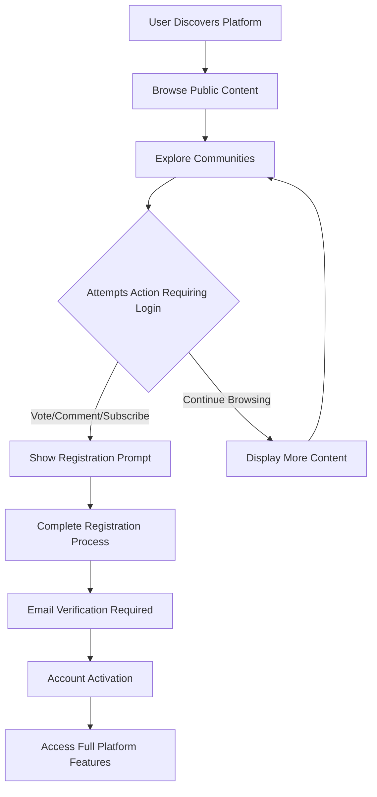
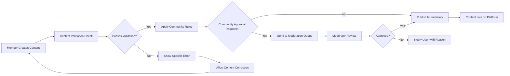
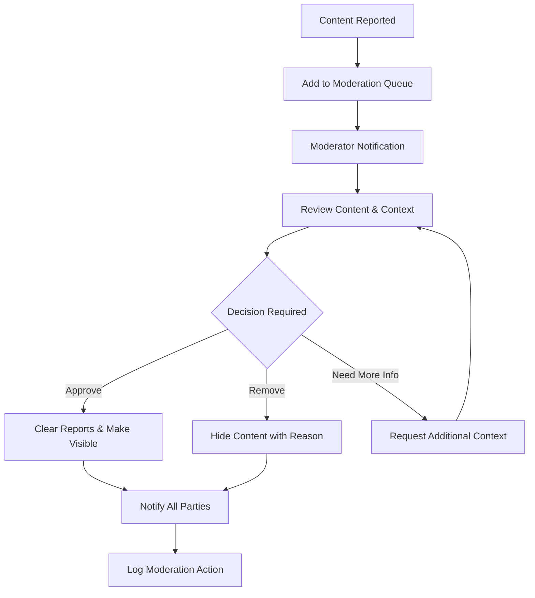
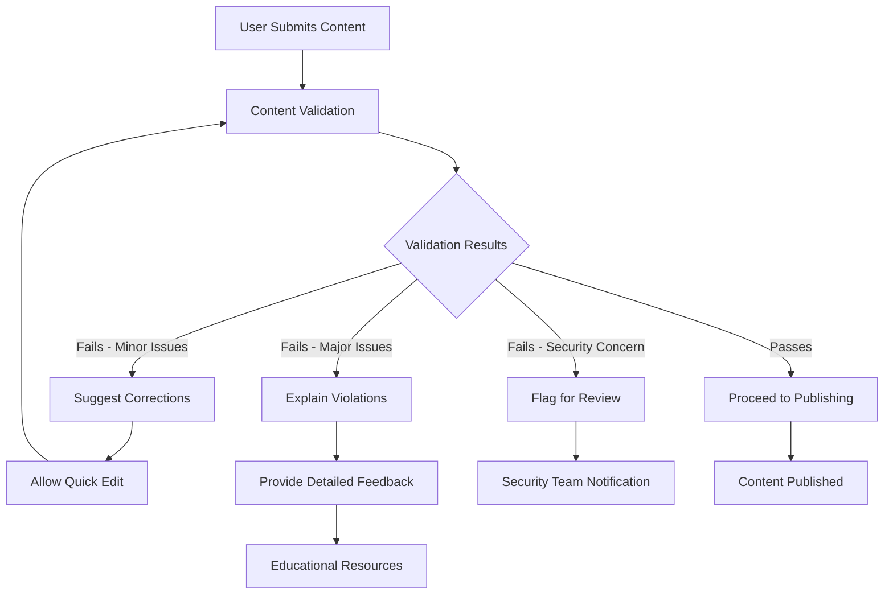

# User Journey Scenarios - Reddit-like Community Platform

## Introduction
This document outlines the comprehensive user journeys and scenarios for the Reddit-like community platform. These scenarios provide detailed business requirements and practical examples of how different user types interact with the platform, helping product managers and developers understand the expected user experience flows with specific, measurable requirements.

## 1. New User Onboarding Journey

### 1.1 Guest Discovery and Exploration
**Scenario**: A new visitor discovers the platform through search or social media

**Business Requirements**:
- WHEN a guest user lands on the homepage, THE system SHALL display trending content from popular communities
- WHERE guest users browse public content, THE system SHALL provide community discovery features
- IF a guest attempts to vote or comment, THEN THE system SHALL redirect to registration with clear messaging
- THE guest browsing experience SHALL load content within 2 seconds for optimal user retention

**User Flow**:

**Performance Requirements**:
- THE guest browsing interface SHALL load within 1.5 seconds
- THE community discovery feature SHALL return results within 2 seconds
- THE registration redirect SHALL occur within 500 milliseconds

### 1.2 Registration and First Engagement
**Scenario**: User completes registration and makes first platform interactions

**Registration Process Requirements**:
- WHEN a user initiates registration, THE system SHALL validate email format and uniqueness
- THE registration form SHALL enforce password complexity (8+ characters with mixed case and numbers)
- AFTER successful registration, THE system SHALL send verification email within 2 minutes
- WHERE email verification is completed, THE system SHALL activate the account immediately

**First Engagement Requirements**:
- AFTER account activation, THE system SHALL suggest 5-10 relevant communities based on browsing history
- THE new user onboarding SHALL include tutorial prompts for core features (voting, commenting, subscribing)
- WHEN new users complete their first post or comment, THE system SHALL award the "First Contribution" badge

**Security Requirements**:
- THE registration process SHALL implement CAPTCHA verification after 3 failed attempts
- THE system SHALL prevent automated registration through rate limiting (max 5 registrations per IP per hour)
- WHERE suspicious registration patterns are detected, THE system SHALL flag for manual review

## 2. Content Creator Journey

### 2.1 Regular Member Content Creation Flow
**Scenario**: An established member creates and manages content

**Post Creation Business Requirements**:
- WHEN a member selects a community for posting, THE system SHALL display community rules and guidelines
- THE post creation interface SHALL validate content against community-specific requirements
- IF a post exceeds 40,000 characters, THEN THE system SHALL reject submission with specific error
- WHERE image posts are created, THE system SHALL validate file size (max 10MB) and format (JPEG, PNG, GIF)

**Comment Creation Requirements**:
- WHEN a member replies to a comment, THE system SHALL maintain proper thread hierarchy
- THE comment system SHALL support nested replies up to 10 levels deep
- IF a comment thread becomes too deep, THEN THE system SHALL provide collapse/expand functionality
- WHERE comment formatting is used, THE system SHALL support markdown syntax

**Content Validation Workflow**:

### 2.2 Content Management and Engagement
**Scenario**: Member manages their existing content and engages with community

**Content Management Requirements**:
- WHEN a member edits their post, THE system SHALL allow edits within 24 hours of creation
- THE edit history SHALL be preserved for moderation purposes
- IF a post receives comments, THEN THE system SHALL notify the author of edit limitations
- WHERE content is deleted, THE system SHALL remove associated votes and comments

**Engagement Tracking Requirements**:
- THE system SHALL provide real-time notifications for new comments on user content
- WHEN votes are cast on user content, THE karma score SHALL update within 500 milliseconds
- THE engagement dashboard SHALL display metrics including views, votes, and comments
- WHERE content performs well, THE system SHALL suggest similar posting strategies

**Performance Requirements**:
- THE content creation interface SHALL respond within 1 second
- THE engagement notifications SHALL deliver within 3 seconds of activity
- THE content metrics SHALL update in real-time without page refresh

## 3. Community Moderator Workflow

### 3.1 Daily Moderation Activities
**Scenario**: Moderator performs routine community management tasks

**Moderation Queue Requirements**:
- WHEN content is reported, THE system SHALL add it to the moderation queue within 30 seconds
- THE queue interface SHALL prioritize content by report severity and age
- WHERE multiple reports exist for same content, THE system SHALL group them together
- IF moderators are unavailable, THEN THE system SHALL escalate to platform administrators after 24 hours

**Moderation Action Requirements**:
- WHEN a moderator reviews content, THE system SHALL provide complete context including user history
- THE moderation actions SHALL include: approve, remove, lock, spoiler, NSFW, quarantine
- AFTER moderation action, THE system SHALL notify both reporter and content creator within 5 minutes
- WHERE content is removed, THE system SHALL provide specific rule violation details

**Moderation Workflow**:

### 3.2 Community Building and Management
**Scenario**: Moderator works to grow and improve their community

**Community Growth Requirements**:
- WHEN new members join, THE system SHALL send welcome messages with community guidelines
- THE moderator tools SHALL provide analytics on member engagement and content trends
- WHERE community growth stalls, THE system SHALL suggest promotion strategies
- IF negative behavior patterns emerge, THEN THE system SHALL flag for moderator attention

**Rule Enforcement Requirements**:
- THE moderation system SHALL allow custom rule creation for each community
- WHEN rules are violated, THE system SHALL provide templated response options
- THE rule enforcement SHALL be consistent across all moderators in a community
- WHERE repeated violations occur, THE system SHALL suggest progressive discipline

## 4. Administrator Operations

### 4.1 System Management
**Scenario**: Administrator performs platform-wide management tasks

**User Management Requirements**:
- WHEN reviewing user accounts, THE system SHALL provide comprehensive activity history
- THE administrator tools SHALL allow bulk actions for user management
- WHERE suspicious activity is detected, THE system SHALL provide investigation tools
- IF user appeals are submitted, THEN THE system SHALL ensure timely response within 48 hours

**Community Management Requirements**:
- THE platform SHALL support community creation approval workflow
- WHEN communities violate platform rules, THE system SHALL provide graduated response options
- THE community health metrics SHALL include engagement rates, report frequency, and moderator activity
- WHERE communities require intervention, THE system SHALL allow temporary administrative control

**System Monitoring Requirements**:
- THE administration dashboard SHALL display real-time system health metrics
- WHEN performance degrades, THE system SHALL trigger alerts to administrators
- THE error tracking SHALL categorize issues by severity and frequency
- WHERE security threats are detected, THE system SHALL implement automatic protective measures

### 4.2 Data and Analytics
**Scenario**: Administrator reviews platform metrics and makes data-driven decisions

**Analytics Requirements**:
- THE analytics system SHALL provide daily, weekly, and monthly trend reports
- WHEN reviewing user growth, THE system SHALL segment by acquisition source and geography
- THE content performance metrics SHALL include engagement rates by content type
- WHERE community health declines, THE system SHALL provide intervention recommendations

**Reporting Requirements**:
- THE platform SHALL generate compliance reports for regulatory requirements
- WHEN data exports are requested, THE system SHALL ensure data privacy protection
- THE reporting tools SHALL allow custom date ranges and metric selection
- WHERE anomalies are detected, THE system SHALL highlight for administrator review

## 5. Edge Cases & Error Scenarios

### 5.1 Permission and Access Errors
**Scenario**: User attempts actions beyond their permission level

**Error Handling Requirements**:
- WHEN unauthorized access is attempted, THE system SHALL log the event for security monitoring
- THE error messages SHALL be user-friendly and suggest corrective actions
- WHERE permission errors occur frequently, THE system SHALL flag for UX improvement
- IF malicious access patterns are detected, THEN THE system SHALL implement temporary blocks

**Recovery Procedures**:
- THE system SHALL provide clear pathways for permission escalation where appropriate
- WHEN users encounter permission errors, THE system SHALL offer alternative actions
- THE error resolution SHALL include contact information for support assistance
- WHERE permissions can be requested, THE system SHALL streamline the application process

### 5.2 Content Validation Failures
**Scenario**: User submits content that violates rules or fails validation

**Validation Error Requirements**:
- WHEN content validation fails, THE system SHALL provide specific, actionable error messages
- THE validation system SHALL check content against both platform and community rules
- WHERE possible, THE system SHALL suggest corrections for common validation issues
- IF automated detection flags content, THEN THE system SHALL explain the reasoning

**User Experience Flow**:

### 5.3 Network and System Failures
**Scenario**: Platform experiences technical issues affecting user experience

**Failure Recovery Requirements**:
- WHEN network connectivity is lost during content creation, THE system SHALL save drafts locally
- THE system SHALL provide clear status indicators during service interruptions
- WHERE data corruption occurs, THE system SHALL have restoration procedures
- IF prolonged outages occur, THEN THE system SHALL communicate expected resolution timelines

**User Communication Requirements**:
- THE system SHALL provide friendly error pages during outages
- WHEN services are degraded, THE system SHALL indicate affected functionality
- THE status communication SHALL be timely and accurate
- WHERE possible, THE system SHALL offer workarounds for critical functions

## 6. Cross-Actor Interactions

### 6.1 Member-Moderator Interactions
**Scenario**: Regular members interact with community moderators

**Interaction Requirements**:
- WHEN members contact moderators, THE system SHALL provide structured communication channels
- THE moderator response SHALL occur within 24 hours for non-urgent matters
- WHERE rule clarification is needed, THE system SHALL provide reference to specific guidelines
- IF disputes arise, THEN THE system SHALL offer mediation and escalation paths

**Appeal Process Requirements**:
- THE content removal appeals SHALL be processed within 48 hours
- WHEN appeals are submitted, THE system SHALL assign to different moderator than original decision
- THE appeal outcomes SHALL include detailed explanations of the ruling
- WHERE appeals are successful, THE system SHALL restore content with visibility of the process

### 6.2 Moderator-Administrator Interactions
**Scenario**: Community moderators work with platform administrators

**Collaboration Requirements**:
- THE platform SHALL provide secure communication channels between moderators and administrators
- WHEN escalations occur, THE system SHALL transfer complete case history
- THE administrator support SHALL be available for complex moderation scenarios
- WHERE policy interpretation is needed, THE system SHALL provide official guidance

**Tool Integration Requirements**:
- THE moderation tools SHALL integrate with administrative oversight systems
- WHEN new features are developed, THE system SHALL include moderator feedback mechanisms
- THE tool improvements SHALL be communicated through release notes and training
- WHERE tool limitations exist, THE system SHALL provide workaround recommendations

### 6.3 User Support Scenarios
**Scenario**: Users at all levels require support for various issues

**Support System Requirements**:
- THE help center SHALL contain comprehensive documentation for common issues
- WHEN users contact support, THE system SHALL provide ticket tracking with expected response times
- THE support escalation SHALL follow clear priority levels based on issue severity
- WHERE multilingual support is needed, THE system SHALL provide translation services

**Self-Service Requirements**:
- THE platform SHALL offer intuitive self-resolution for common problems
- WHEN users search for help, THE system SHALL return relevant solutions quickly
- THE knowledge base SHALL be continuously updated based on user feedback
- WHERE video tutorials are helpful, THE system SHALL provide multimedia guidance

## Success Metrics for User Journeys

### Journey Completion Rates
- **Registration Completion**: Target 85% of visitors who start registration complete it
- **First Post Rate**: Target 40% of new users create content within first week
- **Moderation Efficiency**: Target 95% of moderation queue items resolved within 24 hours
- **Support Resolution**: Target 90% of support tickets resolved on first contact

### User Satisfaction Indicators
- **Content Engagement**: Target 5+ interactions (votes/comments) per active user daily
- **Community Retention**: Target 70% of users return to their subscribed communities weekly
- **Moderator Effectiveness**: Target 4.5/5 satisfaction rating from community members
- **Platform Stability**: Target 99.9% uptime with sub-2-second response times

### Performance Benchmarks
- **Page Load Times**: 95% of pages load within 2 seconds
- **API Response**: 99% of API calls respond within 1 second
- **Search Performance**: Search results returned within 1.5 seconds
- **Notification Delivery**: 95% of notifications delivered within 3 seconds

## Security and Compliance Requirements

### Data Protection
- WHEN handling user data, THE system SHALL encrypt sensitive information at rest and in transit
- THE data retention policies SHALL comply with GDPR and other privacy regulations
- WHERE users request data deletion, THE system SHALL process within 30 days
- IF data breaches occur, THEN THE system SHALL notify affected users within 72 hours

### Access Security
- THE authentication system SHALL require multi-factor authentication for administrative accounts
- WHEN suspicious login patterns are detected, THE system SHALL trigger additional verification
- THE session management SHALL automatically log out inactive users after 30 minutes
- WHERE API access is granted, THE system SHALL implement strict rate limiting

> *Developer Note: This document defines **user journey scenarios and business requirements only**. All technical implementations (architecture, APIs, database design, etc.) are at the discretion of the development team.*