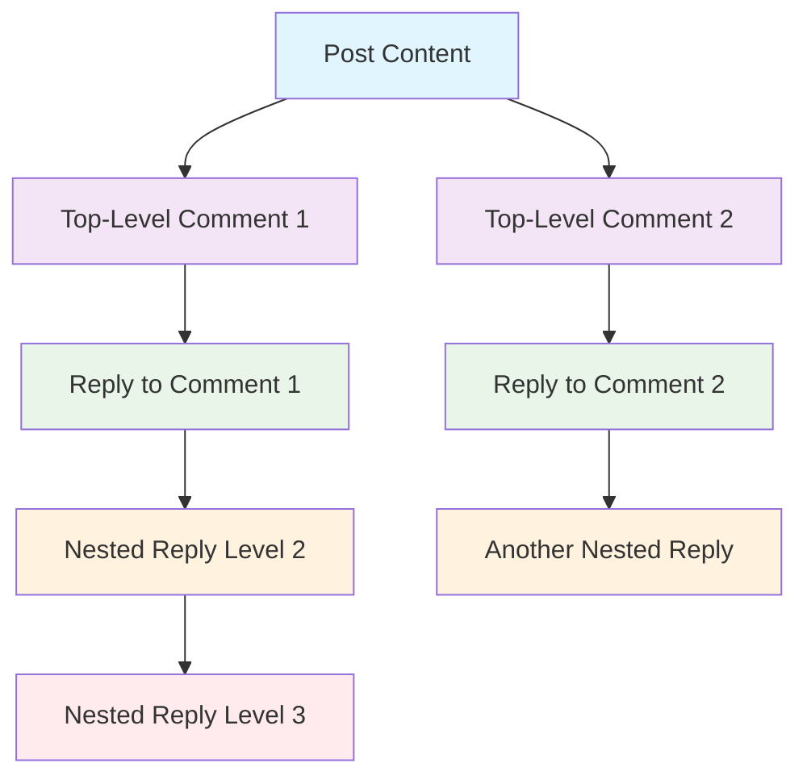
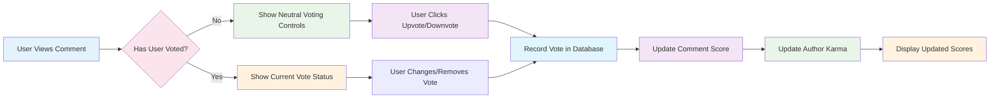

# Comment System Requirements Specification

## Introduction

This document defines the complete comment system requirements for the Reddit-like community platform. The comment system enables users to engage in discussions through threaded conversations under posts, with unlimited nesting depth for replies.

### Purpose and Scope
The comment system serves as the primary discussion mechanism for the platform, allowing users to:
- Engage in meaningful conversations around shared content
- Build community through interactive discussions
- Express opinions through voting and reputation systems
- Maintain conversation history and context

### System Overview
The comment system integrates with multiple platform components including:
- User authentication and profile systems
- Post content management
- Voting and karma scoring
- Moderation and reporting tools
- Notification systems

## Core Comment System Architecture

### Comment Structure Requirements

**WHEN** creating a comment record, **THE** system **SHALL** store the following required information:
- Unique comment identifier (UUID format)
- Author user ID with reference to user profile
- Parent post ID with foreign key constraint
- Parent comment ID (nullable for top-level comments)
- Comment content text (maximum 10,000 characters)
- Vote score calculated from upvotes minus downvotes
- Creation timestamp with timezone information
- Last edit timestamp (nullable for unedited comments)
- Deletion status flag with deletion timestamp
- Content moderation status (pending, approved, flagged)

### Threading Capabilities Specification

**THE** comment system **SHALL** support unlimited nesting depth for replies, allowing for deeply threaded conversations without artificial limitations.

**WHEN** displaying threaded comments, **THE** system **SHALL**:
- Render comments in proper hierarchical structure
- Indent replies appropriately to show nesting depth
- Provide visual indicators for comment depth levels
- Support collapsible thread sections for long discussions
- Maintain thread integrity when comments are deleted

## Comment Creation and Threading Requirements

### Comment Creation Process

**WHEN** a user clicks the "Add Comment" button on a post, **THE** system **SHALL** display a comment input form with the following validation rules:
- Content field with character counter (0/10,000)
- Real-time content validation
- Preview functionality for formatted text
- Cancel and submit action buttons

**WHEN** a user submits a comment, **THE** system **SHALL** validate that:
- The comment content contains at least 1 character after whitespace removal
- The comment content does not exceed 10,000 characters including whitespace
- The user has permission to comment on the post (not banned from community)
- The parent post exists and is not deleted or locked
- The user is authenticated and their account is in good standing

### Reply Creation Process

**WHEN** a user clicks the "Reply" button on any comment, **THE** system **SHALL**:
- Display a reply input form positioned appropriately within the thread hierarchy
- Pre-fill the form with @username reference to the comment author
- Maintain focus on the reply form for uninterrupted typing
- Provide context of the parent comment being replied to

**WHEN** creating a reply, **THE** system **SHALL** establish the parent-child relationship between comments to maintain proper threading structure.

### Comment Content Validation Rules

**THE** system **SHALL** validate comment content against the following business rules:
- Content must contain at least 1 character after whitespace removal
- Content must not exceed 10,000 characters including whitespace
- Content must not contain prohibited content (moderated separately)
- Content must pass spam detection algorithms
- URLs in content must be properly formatted and safe

**WHEN** content validation fails, **THE** system **SHALL**:
- Display specific error messages for each validation failure
- Highlight problematic content sections
- Preserve user input for correction
- Provide clear guidance for compliance

## Comment Voting and Scoring System

### Voting Mechanics Specification

**WHEN** a user views a comment, **THE** system **SHALL** display the current vote score and provide voting controls (upvote/downvote buttons) with the following behavior:

**WHEN** a user upvotes a comment, **THE** system **SHALL**:
- Apply +1 to the comment's vote score immediately
- Apply +1 to the comment author's karma score
- Record the vote in the user's voting history
- Update the vote count display in real-time
- Provide visual feedback of successful vote

**WHEN** a user downvotes a comment, **THE** system **SHALL**:
- Apply -1 to the comment's vote score immediately
- Apply -1 to the comment author's karma score
- Record the vote in the user's voting history
- Update the vote count display in real-time
- Provide visual feedback of successful vote

### Vote Management Constraints

**EACH** user **SHALL** be permitted only one vote per comment. Users **SHALL** be able to:
- Change their vote from upvote to downvote
- Change their vote from downvote to upvote
- Remove their vote entirely (returning to neutral)

**WHEN** a user changes their vote, **THE** system **SHALL** adjust the comment's vote score and author's karma score accordingly with the following calculations:
- Upvote → Downvote: Score decreases by 2, Karma decreases by 2
- Downvote → Upvote: Score increases by 2, Karma increases by 2
- Any vote → No vote: Score and karma return to original values

### Vote Score Calculation Algorithm

**THE** comment vote score **SHALL** be calculated as:
- Vote Score = Total Upvotes - Total Downvotes
- Scores can be positive, negative, or zero
- Vote totals **SHALL** be stored separately for audit purposes
- Real-time score updates **SHALL** be propagated to all viewers

## Comment Editing and Management Controls

### Comment Editing Workflow

**WHEN** a comment author views their own comment, **THE** system **SHALL** display editing controls with the following functionality:
- Edit button that expands into full editing interface
- Content field with current text pre-loaded
- Character counter showing current/maximum length
- Save and cancel action buttons

**WHEN** a user edits their comment, **THE** system **SHALL**:
- Preserve the original comment content in edit history
- Update the last edit timestamp with current time
- Display "edited" indicator to other users with edit timestamp
- Allow editing within 24 hours of original post creation
- Validate edited content against same rules as new comments

### Comment Deletion Process

**WHEN** a comment author chooses to delete their comment, **THE** system **SHALL**:
- Display confirmation dialog explaining consequences
- Mark the comment as deleted in the database
- Preserve the comment structure (show "[deleted]" placeholder)
- Maintain voting records and thread integrity
- Update author's karma if vote score was positive
- Remove the comment from all feeds and searches

**WHEN** a comment is deleted, **THE** system **SHALL** handle replies by:
- Maintaining reply structure under the deleted comment
- Showing "[deleted]" for the parent comment
- Allowing replies to remain visible with proper threading

### Moderation Controls Specification

**WHEN** a moderator views a comment in their community, **THE** system **SHALL** provide moderation actions including:
- Delete comment with removal reason selection
- View comment edit history with timestamps
- Access reporting information and user history
- Ban user from community with duration options
- Approve or dismiss reports on the comment

## Comment Sorting and Display Logic

### Sorting Algorithms Implementation

**THE** system **SHALL** provide three comment sorting options with the following algorithms:

**Best Sort (Default Algorithm)**
**THE** system **SHALL** sort comments using a confidence algorithm that prioritizes:
- Comments with higher vote scores using Wilson score interval
- Comments with significant voting activity and engagement
- Balance between score and number of votes for reliability
- Recent comments with rapid upvote accumulation

**New Sort (Chronological)**
**THE** system **SHALL** sort comments chronologically by creation timestamp, with newest comments appearing first.

**Controversial Sort (Engagement Focus)**
**THE** system **SHALL** sort comments based on controversy score, prioritizing comments with:
- High total vote count (upvotes + downvotes)
- Vote score close to zero indicating disagreement
- Significant engagement from both sides of discussion
- Recent activity and ongoing conversation

### Thread Display Logic Requirements

**WHEN** displaying comment threads, **THE** system **SHALL**:
- Render comments in proper hierarchical structure with visual indentation
- Indent replies appropriately to show nesting depth (15px per level)
- Provide visual indicators for comment depth (border colors, icons)
- Support collapsible thread sections for long discussions
- Maintain proper pagination within threads (50 comments per page)
- Load additional comments dynamically with "Load More" functionality
- Display comment nesting levels up to 10 levels deep with special handling

### Performance Requirements for Comment Display

**THE** system **SHALL** load comment threads efficiently, with the following performance expectations:
- Initial comment load for a post: under 2 seconds for up to 200 comments
- Loading additional nested comments: under 1 second per batch
- Comment submission response: under 500 milliseconds
- Voting action response: under 200 milliseconds
- Real-time comment updates: within 1 second of other users' actions

## User Experience Requirements

### Comment Display Format Specifications

**EACH** displayed comment **SHALL** include the following elements:
- Author username with profile link and avatar
- Comment content with Markdown formatting support
- Vote score with colored indicator (green/red/gray)
- Time since posting (relative timestamp)
- Reply count display for parent comments
- Editing controls (for authors only)
- Voting controls (for authenticated users)
- Moderation actions (for authorized moderators)
- Report button for inappropriate content

### Mobile Responsiveness Requirements

**THE** comment interface **SHALL** be fully responsive and functional on mobile devices, with:
- Touch-friendly voting controls with adequate touch targets
- Optimized text input for mobile keyboards with suggestions
- Proper indentation scaling for nested comments on small screens
- Smooth scrolling through long threads with position memory
- Gesture support for common actions (swipe to vote)
- Offline capability for reading existing comments

### Accessibility Requirements Compliance

**THE** comment system **SHALL** meet WCAG 2.1 AA accessibility standards, including:
- Keyboard navigation support for all interactive elements
- Screen reader compatibility with proper ARIA labels
- Color contrast requirements for text and interface elements
- Focus management for modal dialogs and editing interfaces
- Text resizing support without breaking layout
- Alternative text for all non-text content

## Error Handling and Edge Cases

### Common Error Scenarios

**IF** a user attempts to comment on a deleted post, **THEN THE** system **SHALL**:
- Display an appropriate error message indicating the post is unavailable
- Prevent comment submission with disabled submit button
- Provide navigation back to the post list or home feed

**IF** a user attempts to edit a comment beyond the allowed time window, **THEN THE** system **SHALL**:
- Disable editing controls with explanatory message
- Notify the user of the 24-hour editing limitation
- Provide contact information for exceptional circumstances

**IF** a banned user attempts to comment, **THEN THE** system **SHALL**:
- Prevent comment submission with clear ban notification
- Display ban duration and reason if available
- Provide moderator contact information for appeal

### Comment Loading Failure Handling

**WHILE** loading comments for a post with high engagement, **THE** system **SHALL** implement:
- Progressive loading to prevent timeout issues
- Loading indicators with estimated remaining time
- Error recovery with retry mechanisms
- Graceful degradation for partial content loading

**WHEN** encountering network failures during comment submission, **THE** system **SHALL**:
- Preserve draft content in local storage
- Provide automatic retry mechanisms when connection restores
- Display offline status with queue management
- Synchronize successfully when back online

### Data Consistency and Integrity

**THE** system **SHALL** maintain data consistency through:
- Atomic transactions for vote operations
- Conflict resolution for simultaneous edits
- Proper locking mechanisms for critical operations
- Audit trails for all moderation actions
- Data validation at multiple levels (client, API, database)

## Integration Requirements

### Karma System Integration

**THE** comment system **SHALL** integrate with the platform's karma system, ensuring that:
- Comment votes properly affect author karma in real-time
- Karma changes are reflected immediately in user profiles
- Deleted comments adjust karma scores appropriately
- Karma calculations account for vote changes and removals

### Reporting System Integration

**THE** comment system **SHALL** support the platform's reporting functionality by:
- Allowing users to report comments with specific reason categories
- Providing contextual reporting with comment content pre-filled
- Integrating with moderator workflows for report resolution
- Tracking report history and resolution status

### Notification System Integration

**WHEN** a user receives a reply to their comment, **THE** system **SHALL** generate appropriate notifications based on:
- User notification preferences (email, push, in-app)
- Reply context and relationship to original comment
- Frequency and volume of notification settings
- Importance and engagement level of the conversation

### User Authentication Integration

**THE** comment system **SHALL** integrate with user authentication to:
- Verify user permissions before allowing comment actions
- Enforce community-specific bans and restrictions
- Track user activity for moderation purposes
- Maintain session consistency across comment interactions

## Business Rules and Validation

### Content Moderation Policies

**THE** system **SHALL** implement content validation to prevent:
- Spam comments through rate limiting and pattern detection
- Hate speech and prohibited content through automated filtering
- Excessive posting in short timeframes through cooldown periods
- Duplicate content through similarity detection algorithms

### User Engagement Limits

**WHERE** user engagement limits are configured, **THE** system **SHALL** enforce:
- Maximum comments per hour per user (configurable by community)
- Minimum time between comments to prevent rapid-fire posting
- Anti-spam measures for new accounts with graduated limits
- Quality-based limits for users with negative karma

### Data Retention Policies

**THE** system **SHALL** maintain comment data according to platform retention policies, including:
- Permanent storage for active comments and discussions
- Archival procedures for old discussions after 2 years
- Compliance with data protection regulations (GDPR, CCPA)
- User data export capabilities for compliance requests

## Success Metrics and Quality Assurance

### Performance Metrics

The comment system shall be measured against the following performance criteria:
- Average comment load time: < 2 seconds
- Comment submission success rate: > 99%
- Vote processing reliability: > 99.9%
- Concurrent user support: 1,000+ simultaneous comment interactions

### User Engagement Metrics

Success shall be measured by user engagement indicators including:
- Average comment engagement rate per post: > 15%
- User satisfaction with comment threading: > 4.0/5.0 rating
- Comment reply rate: > 25% of comments receive replies
- User retention through engaging discussion features

### Moderation Effectiveness

Moderation system performance shall be evaluated by:
- Report resolution time: < 4 hours for 90% of reports
- False positive moderation rate: < 2%
- User satisfaction with moderation fairness: > 4.0/5.0
- Reduction in moderation workload through effective automation

### Technical Quality Metrics

System quality shall be measured by:
- Uptime availability: > 99.9%
- Error rate: < 0.1% of requests
- Data consistency: > 99.99% accuracy
- Security incident rate: < 1 incident per quarter

## Implementation Guidelines for Backend Developers

### Database Design Considerations

**WHEN** designing the comment database schema, **THE** system **SHALL** consider:
- Efficient parent-child relationship representation
- Indexing strategies for common query patterns
- Partitioning strategies for large comment volumes
- Backup and recovery procedures for comment data

### API Design Specifications

**THE** comment API **SHALL** provide endpoints for:
- Comment creation with validation
- Comment retrieval with pagination and sorting
- Vote management with atomic operations
- Editing and deletion with permission checks
- Moderation actions with audit logging

### Caching Strategy Implementation

**THE** system **SHALL** implement caching for:
- Frequently accessed comment threads
- User vote status to reduce database queries
- Comment scores for sorting optimization
- User permission checks for performance

This enhanced specification provides comprehensive business requirements for implementing a production-ready comment system that supports rich discussion features while maintaining performance, security, and user experience standards.