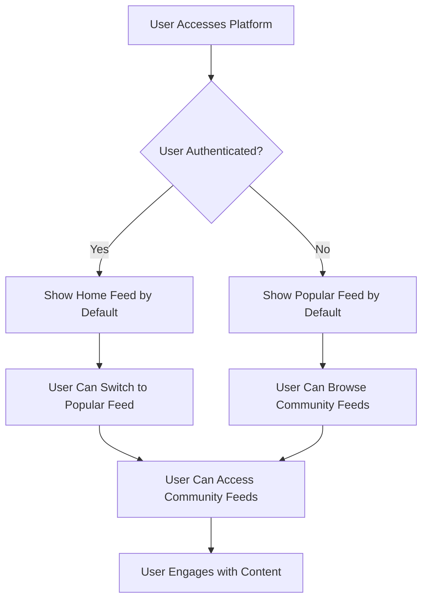
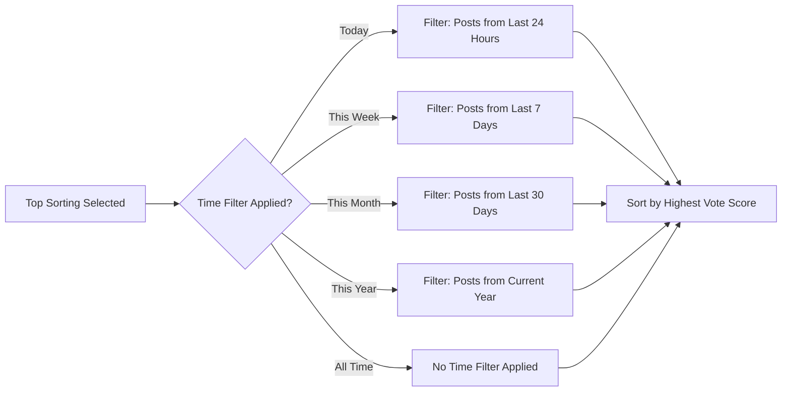

# Feed Management Requirements Specification

## 1. Executive Summary

This document specifies the comprehensive feed management system for the Reddit-like community platform, defining three distinct feed types with their respective content selection rules, sorting algorithms, pagination requirements, and performance expectations. The feed system serves as the primary content discovery mechanism, balancing personalized content delivery with platform-wide content visibility while maintaining optimal performance under varying user loads.

The feed management system enables users to discover relevant content through intelligent curation based on their subscriptions, community preferences, and engagement patterns. The system supports both authenticated and unauthenticated access scenarios while ensuring content quality and platform safety through robust filtering and moderation integration.

## 2. Feed Types Overview

The platform implements three primary feed types to serve different user needs and content discovery patterns, each with specific access requirements and content scoping rules.

### 2.1 Feed Access Matrix

The following table defines the access characteristics and content scope for each feed type:

| Feed Type | Authentication Required | Content Scope | Target Audience | Primary Purpose |
|-----------|------------------------|---------------|-----------------|-----------------|
| Home Feed | ✅ Required | Subscribed communities only | Authenticated users | Personalized content discovery |
| Popular Feed | ❌ Optional | All communities | All users (including guests) | Platform-wide content exploration |
| Community Feed | ❌ Optional | Single community | Community visitors | Focused community engagement |

### 2.2 Feed Selection Workflow

## 3. Home Feed Requirements

The Home Feed provides personalized content exclusively for authenticated users based on their community subscriptions, serving as the primary content consumption interface for returning users.

### 3.1 Content Selection Rules

**WHEN** a user accesses their Home Feed, **THE system SHALL** display posts only from communities the user is currently subscribed to.

**WHEN** a user subscribes to a new community, **THE system SHALL** immediately include posts from that community in the Home Feed refresh cycles.

**WHEN** a user unsubscribes from a community, **THE system SHALL** immediately remove posts from that community from subsequent Home Feed views.

### 3.2 Subscription-Based Content Filtering

**THE Home Feed SHALL** implement real-time content filtering based on the user's current subscription state:
- **WHERE** a user has active subscriptions, posts SHALL be sourced exclusively from subscribed communities
- **WHERE** a user has no subscriptions, the Home Feed SHALL display community discovery suggestions
- **WHILE** subscription changes occur, the feed SHALL reflect updates within 5 minutes maximum

### 3.3 Access Control and Authentication

**IF** an unauthenticated user attempts to access the Home Feed, **THEN THE system SHALL** redirect them to the login page with appropriate messaging.

**WHILE** a user remains authenticated, **THE Home Feed SHALL** continuously update based on their evolving subscription profile.

## 4. Popular Feed Requirements

The Popular Feed provides platform-wide content discovery accessible to all users, including unauthenticated guests, serving as the entry point for new users and content exploration.

### 4.1 Universal Access Rules

**WHEN** any user accesses the Popular Feed, **THE system SHALL** display posts from all public communities across the platform.

**WHERE** content filtering is required for legal or platform policy compliance, **THE system SHALL** apply uniform filtering standards regardless of user authentication status.

### 4.2 Guest User Experience

**THE Popular Feed SHALL** provide identical content visibility to both authenticated and unauthenticated users.

**WHEN** guest users interact with Popular Feed content, **THE system SHALL** prompt for authentication only when voting or commenting is attempted.

## 5. Community Feed Requirements

The Community Feed displays content from a single, specific community, providing focused content consumption for community enthusiasts and new visitors.

### 5.1 Single-Community Content Scope

**WHEN** a user accesses a Community Feed, **THE system SHALL** display posts exclusively from the specified community.

**WHERE** community-specific content policies exist, **THE system SHALL** apply them consistently to the Community Feed display.

### 5.2 Community Access Rules

**THE Community Feed SHALL** be accessible to both authenticated and unauthenticated users, with the following exceptions:
- **WHEN** a community is set to private, **THE system SHALL** restrict access to subscribed members only
- **WHEN** a community is banned or suspended, **THE system SHALL** display appropriate access restriction messaging
- **WHERE** age-restricted content exists, **THE system SHALL** implement appropriate age verification

## 6. Sorting Algorithms and Feed Organization

All three feed types support identical sorting algorithms to ensure consistent user experience while accommodating different content discovery patterns.

### 6.1 Hot Sorting Algorithm

**WHEN** "Hot" sorting is selected, **THE system SHALL** prioritize posts based on a combination of recency, engagement velocity, and vote patterns using the following scoring formula:

`hot_score = (vote_score + comment_count) / (hours_since_posted + 2)^gravity`

**WHERE** gravity is a configurable parameter (default value: 1.8), **THE system SHALL** use it to balance recency against sustained engagement.

**THE Hot algorithm SHALL** prevent content gaming through vote velocity analysis and temporal decay factors.

### 6.2 New Sorting Algorithm

**WHEN** "New" sorting is selected, **THE system SHALL** display posts in strict reverse chronological order based on creation timestamp.

**THE New sorting SHALL** ignore engagement metrics entirely, providing raw chronological content discovery.

### 6.3 Top Sorting Algorithm

**WHEN** "Top" sorting is selected, **THE system SHALL** display posts ordered by net vote score (total upvotes minus total downvotes).

### 6.4 Controversial Sorting Algorithm

**WHEN** "Controversial" sorting is selected, **THE system SHALL** prioritize posts with high engagement but neutral or balanced vote scores using the controversy calculation:

`controversy_score = min(upvotes, downvotes) * total_votes / max(1, abs(upvotes - downvotes))`

**WHERE** posts demonstrate significant disagreement among voters, **THE system SHALL** rank them higher to highlight contentious discussions.

## 7. Feed Display Requirements and User Interface

### 7.1 Post List Item Specifications

**WHEN** displaying posts in any feed, **THE system SHALL** present the following information consistently for each post item:

| Information Element | Display Format | Required | Description |
|---------------------|----------------|----------|-------------|
| Post Title | Plain text, linked to full post | ✅ Required | Primary content identifier |
| Author Username | Linked to user profile | ✅ Required | Content attribution |
| Community Name | Linked to community page | ✅ Required | Content context |
| Vote Score | Numeric display with icons | ✅ Required | Community feedback indicator |
| Comment Count | Numeric display with icon | ✅ Required | Engagement level indicator |
| Time Since Posted | Relative time format | ✅ Required | Content freshness indicator |
| Content Preview | Type-specific display | Conditional | Content type context |

### 7.2 Content Type-Specific Previews

**WHEN** displaying text posts in feed view, **THE system SHALL** show the first 200 characters of content with ellipsis indication for truncated text.

**WHEN** displaying image posts in feed view, **THE system SHALL** show a thumbnail of the uploaded image with consistent dimensions and aspect ratio preservation.

**WHEN** displaying link posts in feed view, **THE system SHALL** show the domain name of the URL along with a relevant favicon or domain indicator.

### 7.3 Feed Item Interaction Patterns

**THE system SHALL** support standard interactions for each feed item:
- Clicking post title opens full post view
- Clicking author username navigates to user profile
- Clicking community name navigates to community page
- Voting controls provide immediate feedback
- Comment count links to post discussion

## 8. Pagination and Feed Navigation

### 8.1 Cursor-Based Pagination Implementation

**THE system SHALL** implement efficient cursor-based pagination for all feed types to support large content volumes.

**WHEN** loading any feed, **THE system SHALL** return a maximum of 25 posts per page to balance performance with content discovery.

**THE pagination system SHALL** provide the following navigation elements:
- Next page cursor for forward navigation
- Previous page cursor for backward navigation
- Current page indicator (when feasible)
- Total post count estimation for user context

### 8.2 Infinite Scroll Considerations

**WHERE** infinite scroll implementation is preferred, **THE system SHALL** maintain efficient memory usage through:
- Virtualized rendering of off-screen content
- Progressive loading of additional content batches
- Memory cleanup for distant scroll positions
- Performance monitoring for scroll smoothness

## 9. Feed Access Rules and Content Filtering

### 9.1 Content Visibility Rules

**IF** a post is deleted by its author, **THEN THE system SHALL** remove it from all feeds immediately upon deletion.

**IF** a post is removed by a moderator, **THEN THE system SHALL** remove it from all feeds and update feed caches accordingly.

**IF** a user is banned from a community, **THEN THE system SHALL** exclude their posts from that community's feed while respecting existing content visibility rules.

### 9.2 Content Quality Filtering

**THE system SHALL** implement content quality thresholds for feed inclusion:
- Posts with excessive downvote ratios may be deprioritized
- Content from new communities may receive visibility boosts
- Highly engaging content may receive extended visibility periods

### 9.3 Spam and Abuse Prevention

**THE system SHALL** integrate with platform moderation systems to:
- Filter out identified spam content from all feeds
- Deprioritize content from frequently reported users
- Apply community-specific content safety rules
- Maintain feed integrity through automated quality checks

## 10. Performance and Scalability Requirements

### 10.1 Response Time Targets

The feed system SHALL meet the following performance benchmarks under normal operating conditions:

| Feed Type | Target Response Time | Maximum Acceptable Time | Performance Goal |
|-----------|---------------------|------------------------|------------------|
| Home Feed | < 300ms | 500ms | Personalized content delivery |
| Popular Feed | < 400ms | 700ms | Platform-wide content aggregation |
| Community Feed | < 200ms | 400ms | Focused community content |

### 10.2 Concurrent User Scaling

**THE system SHALL** support at least 10,000 concurrent users accessing feeds simultaneously.

**THE feed generation infrastructure SHALL** scale horizontally to accommodate increasing user loads through:
- Distributed query processing across database clusters
- Content delivery network integration for global performance
- Intelligent caching strategies for frequently accessed content
- Load-balanced API endpoint distribution

### 10.3 Database Optimization Strategies

**THE system SHALL** implement optimized database query patterns for feed generation:
- Efficient indexing on post timestamps, community IDs, and vote scores
- Batch processing for multi-feed content aggregation
- Read replica distribution for query load balancing
- Query result caching with appropriate TTL settings

## 11. Integration Requirements

### 11.1 Authentication System Integration

**THE feed system SHALL** securely integrate with platform authentication to:
- Determine user subscription status for Home Feed content selection
- Validate user permissions for community access
- Maintain session continuity during feed interactions
- Support secure token-based API access

### 11.2 Community Management Integration

**THE feed system SHALL** respect community configuration including:
- Privacy settings that determine content visibility
- Membership requirements for private community access
- Community-specific content moderation rules
- Banned user state and content restrictions

### 11.3 Notification System Integration

**THE feed system SHALL** integrate with platform notifications to:
- Alert users about highly engaged content in their feeds
- Provide subscription recommendations based on feed engagement
- Support real-time feed updates for active user sessions

## 12. Monitoring and Analytics Requirements

### 12.1 Performance Monitoring

**THE system SHALL** implement comprehensive performance tracking including:
- Feed load time distribution analysis
- User engagement patterns by feed type
- Content discovery effectiveness metrics
- System resource utilization during feed generation

### 12.2 User Behavior Analytics

**THE system SHALL** track key user engagement indicators:
- Feed switching patterns and preferences
- Sorting algorithm usage frequency
- Pagination depth analysis
- Content interaction rates by feed position

### 12.3 Quality and Satisfaction Metrics

**THE system SHALL** monitor feed quality through:
- User retention correlated with feed engagement
- Content relevance scoring based on user interactions
- User feedback mechanisms for feed improvement
- A/B testing capabilities for algorithm enhancements

## 13. Business Rules Summary

### 13.1 Content Delivery Principles

1. **Personalization Priority**: Home Feed content is curated based on user subscriptions and engagement history
2. **Platform Discovery**: Popular Feed serves as the primary content discovery mechanism for all users
3. **Community Focus**: Community Feeds provide specialized content consumption within specific interest groups
4. **Performance Assurance**: All feeds maintain responsive load times regardless of content volume

### 13.2 User Experience Standards

1. **Consistent Interaction**: Feed navigation and content interaction patterns remain uniform across feed types
2. **Intelligent Sorting**: Users can choose sorting algorithms that match their content discovery preferences
3. **Progressive Disclosure**: Content is delivered in manageable batches through efficient pagination
4. **Accessibility Compliance**: All feed interfaces meet WCAG 2.1 AA accessibility standards

## 14. Technical Constraints and Considerations

### 14.1 Architectural Constraints

- Feed generation must support distributed processing across multiple application instances
- Content aggregation must maintain data consistency across partitioned databases
- Real-time updates must synchronize efficiently across connected user sessions
- Caching strategies must balance performance with content freshness

### 14.2 Data Management Considerations

- Post visibility rules must be efficiently enforced at query time
- User subscription state must be reliably reflected in content selection
- Vote score calculations must maintain accuracy during concurrent updates
- Content moderation decisions must propagate quickly to all feed instances

This specification provides comprehensive requirements for implementing a robust, scalable feed management system that delivers personalized content discovery while maintaining platform-wide content visibility and engagement opportunities.