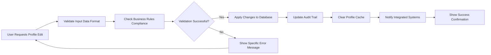
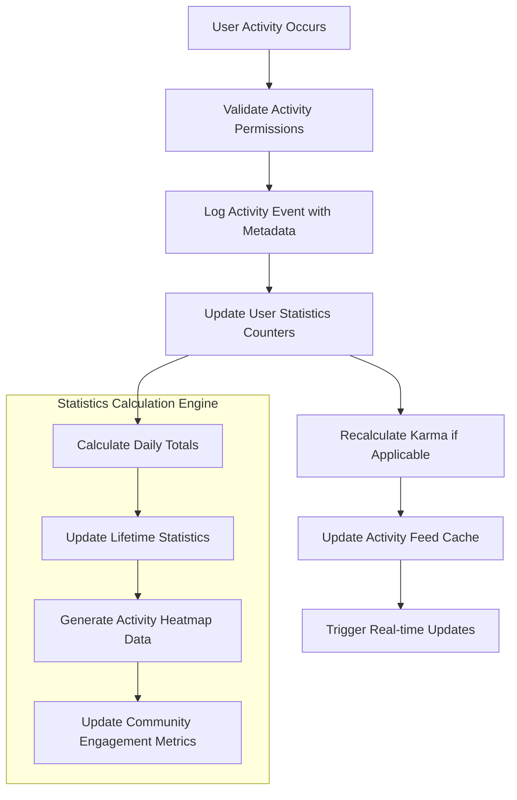
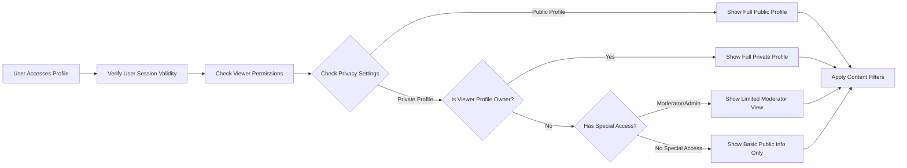

# User Profiles and Activity Management Requirements

## Executive Summary

This document defines the complete requirements for user profile management and activity tracking within the community platform. User profiles serve as the central hub for user identity, reputation display, and activity history. The system must provide comprehensive profile management capabilities while ensuring user privacy and data security. This specification covers all aspects from profile creation through advanced activity analytics, ensuring backend developers have complete implementation guidance.

## User Profile Management Requirements

### Profile Data Structure

**WHEN** the system creates a user profile, **THE system SHALL** maintain comprehensive user profile information including:
- Basic identity information: username (3-20 characters, alphanumeric), display name (optional, 1-50 characters), verified email address
- Account metadata: creation timestamp (ISO 8601 format), last login timestamp, account status (active, suspended, banned)
- Reputation data: current karma score (integer), reputation tier (1-5), achievement badges array
- Profile content: bio text (max 5000 characters with markdown support), avatar image URL, profile banner image URL
- Community data: subscribed communities array, moderator communities array, favorite communities list
- Preferences: theme preference (light/dark/auto), notification settings, privacy preferences
- Statistics: total posts count, total comments count, total karma earned, average post score

**WHEN** a user views their own profile, **THE system SHALL** display all profile information including private metrics such as:
- Email address and account verification status
- Private moderation history (if applicable)
- Account security settings and active sessions
- Revenue statistics (if monetization features exist)

**WHEN** a user views another user's profile, **THE system SHALL** display only public information based on the viewed user's privacy settings:
- Public profile information (username, display name, avatar)
- Public karma score and reputation tier
- Public bio content (if visibility allowed)
- Public activity history (posts, comments within visibility rules)
- Community subscriptions (if visibility allowed)

### Profile Creation and Registration

**WHEN** a new user registers for the platform, **THE system SHALL** create a basic profile with default values:
- Generate unique username if not provided (format: user123456)
- Set default avatar from predefined selection
- Initialize karma score to 1
- Set bio field to empty string
- Record account creation timestamp
- Set initial privacy settings to platform defaults
- Create empty arrays for communities and achievements

**WHILE** a user is completing registration, **THE system SHALL** validate username according to business rules:
- Check username uniqueness across entire platform
- Validate username format (3-20 alphanumeric characters, hyphens allowed)
- Prevent reserved usernames (admin, moderator, system terms)
- Perform profanity filter check on username

**IF** username validation fails, **THEN THE system SHALL** provide specific error messages:
- "Username already taken" for uniqueness violations
- "Username must be 3-20 characters" for length violations
- "Username contains invalid characters" for format violations
- "Username not available" for reserved terms

### Profile Editing and Updates

**WHEN** a user edits their profile information, **THE system SHALL**:
- Validate all input fields for format, length, and content compliance
- Apply changes immediately upon successful validation
- Maintain audit trail of profile changes for security purposes
- Update profile last modified timestamp
- Clear relevant caches to ensure consistency
- Notify integrated systems of profile changes

**WHERE** username changes are requested, **THE system SHALL** enforce business rules:
- Limit username changes to once per 30 days
- Require password verification for sensitive changes
- Maintain previous username history for 90 days
- Update all references to ensure consistency
- Notify community moderators of username changes in their communities

## Activity Tracking and History

### Comprehensive Activity Logging

**THE system SHALL** track and display comprehensive user activities including:
- **Post activities**: creation, editing, deletion, viewing statistics
- **Comment activities**: creation, editing, deletion, nested reply chains
- **Voting actions**: upvotes/downvotes given and received with timestamps
- **Community interactions**: subscriptions, unsubscriptions, moderation actions
- **Social interactions**: awards given/received, user follows, message exchanges
- **System interactions**: login/logout, password changes, privacy setting updates

**WHEN** a user performs any platform activity, **THE system SHALL** record detailed metadata:
- Action type and precise timestamp (millisecond precision)
- Target content ID, community ID, or user ID as applicable
- Action-specific metadata (vote direction, comment depth, edit reasons)
- User agent information and IP address for security monitoring
- Geographic location data (country-level) for analytics
- Success/failure status of the action

### Activity Feed Generation

**WHEN** generating a user's activity feed, **THE system SHALL** implement sophisticated filtering and aggregation:
- Aggregate activities from the past 90 days as default view
- Support filtering by specific activity types (posts only, comments only, votes only)
- Provide pagination with 25 activities per page for optimal performance
- Cache frequently accessed activity data with 5-minute TTL
- Implement lazy loading for activity history beyond initial view
- Group similar activities (multiple votes in same thread) for cleaner display

**WHILE** displaying activity history, **THE system SHALL** respect privacy settings:
- Hide activities from private communities unless viewer has access
- Obscure sensitive actions (moderation, private messages) based on permissions
- Apply user-specific content filters for inappropriate content
- Respect block/mute relationships when displaying social interactions

### Activity Statistics and Analytics

**THE system SHALL** calculate and display comprehensive user statistics:
- **Content statistics**: total posts created, total comments written, average post score
- **Engagement metrics**: total upvotes received, total downvotes received, net engagement score
- **Temporal patterns**: daily activity heatmap, most active hours, weekly engagement trends
- **Community distribution**: top 5 most active communities, engagement distribution across communities
- **Quality metrics**: post success rate, comment reply rate, content longevity statistics

## Profile Customization Features

### Avatar Management System

**WHEN** a user uploads a profile avatar, **THE system SHALL** implement robust validation and processing:
- Validate image format (JPEG, PNG, WebP) and size constraints (max 5MB)
- Automatically resize to standard dimensions (256x256, 128x128, 64x64, 32x32)
- Generate multiple resolution versions for different display contexts
- Store avatar with user profile data using efficient storage strategy
- Maintain avatar change history with rollback capability
- Implement CDN distribution for optimal loading performance

**WHERE** avatar changes are made, **THE system SHALL** provide user-friendly features:
- Real-time preview before finalizing avatar selection
- Cropping and editing tools for optimal image composition
- Avatar history with easy reversion to previous versions
- Bulk avatar update across connected platforms (if applicable)

### Profile Theme and Display Customization

**THE system SHALL** provide comprehensive profile customization options:
- **Theme selection**: light mode, dark mode, auto (system preference)
- **Layout customization**: compact view, detailed view, card-based layout
- **Content density**: control over information displayed on profile page
- **Trophy display**: customizable trophy case organization and visibility
- **Activity feed preferences**: control over what activities are highlighted

**WHEN** theme preferences change, **THE system SHALL** ensure seamless transition:
- Apply theme changes immediately without page refresh
- Persist theme preferences across devices using account synchronization
- Provide theme preview before application
- Maintain accessibility compliance across all theme options

### Bio and Profile Information Management

**WHEN** users edit their profile bio, **THE system SHALL** provide rich editing capabilities:
- Support rich text formatting (bold, italics, links, lists) with markdown support
- Enforce character limits (5000 characters maximum) with real-time counter
- Validate content for appropriateness using automated moderation tools
- Provide version history for bio changes with comparison view
- Support bio templates for different community contexts

## Privacy and Security Requirements

### Granular Privacy Controls

**THE system SHALL** implement comprehensive privacy controls allowing users to:
- Make entire profile public, private, or visible to followers only
- Control visibility of specific activity types (hide votes, show posts only)
- Hide specific communities from public profile view
- Block other users from viewing profile entirely
- Set different privacy levels for different profile sections

**WHEN** privacy settings change, **THE system SHALL** ensure immediate enforcement:
- Update access controls within 30 seconds of setting change
- Clear relevant caches to prevent information leakage
- Notify integrated systems of privacy setting updates
- Log privacy setting changes for audit purposes

### Data Security Implementation

**THE system SHALL** implement enterprise-grade security measures:
- Encrypt sensitive profile data at rest using AES-256 encryption
- Implement secure session management with token rotation
- Enforce rate limiting on profile operations (max 100 changes per hour)
- Maintain comprehensive audit logs for all profile changes
- Implement security headers (CSP, HSTS) for web interface

**WHEN** unauthorized access attempts occur, **THE system SHALL** respond appropriately:
- Log security events with detailed context for investigation
- Notify user of suspicious access patterns via email
- Temporarily lock account after multiple failed access attempts
- Provide administrators with security incident reporting tools

### Account Security Features

**WHEN** users access security settings, **THE system SHALL** provide comprehensive security management:
- Password change functionality with strength validation
- Two-factor authentication options (SMS, authenticator app, backup codes)
- Active session management with remote logout capability
- Login history review with geographic and device information
- Account recovery options with identity verification

## Data Export and Management

### Comprehensive Data Export

**WHEN** users request data export, **THE system SHALL** provide complete data packages:
- Profile information in standardized JSON format with all metadata
- Complete activity history with precise timestamps and context
- Community subscriptions list with join dates and engagement statistics
- Message history (if applicable) with conversation threads
- Export in multiple formats (JSON, CSV, PDF summary)

**WHILE** processing data exports, **THE system SHALL** implement proper data handling:
- Respect data retention policies and privacy settings during export
- Compress export packages for efficient download
- Provide progress indicators for large export operations
- Implement secure download links with expiration
- Log export requests for compliance tracking

### Account Deletion and Data Retention

**WHEN** users request account deletion, **THE system SHALL** implement careful deletion process:
- Provide clear confirmation process with deletion implications explained
- Offer comprehensive data export before deletion completion
- Implement 30-day grace period with account recovery option
- Permanently anonymize user data after retention period expires
- Maintain necessary records for legal compliance requirements

**IF** account deletion is requested, **THEN THE system SHALL** maintain essential records:
- Basic account information for legal and security purposes
- Moderation actions taken by the user
- Financial transactions (if applicable)
- Legal compliance records as required by jurisdiction

### Data Backup and Recovery Procedures

**THE system SHALL** implement robust backup procedures for user profile data:
- Perform daily incremental backups of all user data
- Maintain weekly full backups for disaster recovery
- Store backups in geographically separate locations
- Test backup restoration procedures quarterly
- Implement point-in-time recovery capability for critical data

**WHEN** data recovery is needed, **THE system SHALL** follow defined procedures:
- Restore profiles from the most recent valid backup
- Maintain data consistency across restored components
- Notify users of recovery operations when applicable
- Document recovery procedures for audit purposes

## Performance Requirements

### Profile Loading Performance Targets

**WHEN** loading user profiles, **THE system SHALL** meet stringent performance standards:
- Display basic profile information within 500 milliseconds for 95% of requests
- Load complete activity history within 2 seconds for profiles with under 1000 activities
- Implement progressive loading for profiles with extensive history
- Cache frequently accessed profile data with 5-minute TTL
- Support 1,000 concurrent profile views during peak traffic

### Activity Feed Performance Specifications

**THE system SHALL** generate activity feeds with optimized performance:
- Initial feed load within 1 second for 99% of users
- Pagination responses within 500 milliseconds
- Real-time activity updates within 200 milliseconds of event occurrence
- Support filtering and sorting without significant performance degradation
- Handle 10,000 activity records per user efficiently

### Scalability and Capacity Planning

**THE system SHALL** support platform growth with scalable architecture:
- Handle 1 million+ user profiles with efficient storage strategy
- Support 100 profile updates per second during peak usage
- Maintain performance with 10,000 concurrent active users
- Implement horizontal scaling for profile service components
- Use distributed caching for frequently accessed profile data

## Error Handling Scenarios

### Profile Access Error Management

**IF** a user attempts to access a non-existent profile, **THEN THE system SHALL**:
- Display user-friendly error message with suggested alternatives
- Log the access attempt for security monitoring
- Provide options to search for similar usernames
- Maintain 404 error page with helpful navigation options

**IF** profile data becomes corrupted, **THEN THE system SHALL**:
- Attempt automatic recovery from most recent backup
- Notify administrators of data corruption incidents
- Provide users with status updates on recovery progress
- Maintain service degradation rather than complete failure

### Activity Tracking Error Handling

**WHEN** activity tracking encounters errors, **THE system SHALL** implement robust error handling:
- Log tracking errors with sufficient context for investigation
- Continue processing other activities to minimize disruption
- Provide fallback mechanisms for critical tracking operations
- Notify administrators of persistent tracking issues
- Implement retry logic for transient failures

### Privacy Setting Conflict Resolution

**IF** privacy settings conflict with platform requirements, **THEN THE system SHALL**:
- Apply platform defaults while notifying the user of conflicts
- Provide clear explanation of required settings
- Allow users to appeal platform-required settings
- Maintain audit trail of setting conflicts and resolutions

## Integration Requirements

### Karma System Integration

**THE user profile system SHALL** seamlessly integrate with the karma system:
- Display current karma score and reputation tier prominently
- Update karma displays in real-time as scores change
- Provide karma history and breakdown on profile pages
- Support karma-based profile customization options

**WHEN** karma changes occur, **THE system SHALL** ensure immediate profile updates:
- Update profile displays within 5 seconds of karma changes
- Recalculate reputation tiers automatically
- Notify users of significant karma milestones
- Maintain karma consistency across all profile views

### Community System Integration

**User profiles SHALL** display comprehensive community information:
- List of subscribed communities with engagement statistics
- Moderator status and responsibilities for relevant communities
- Community-specific achievements and recognition
- Recent activity broken down by community
- Community recommendations based on profile patterns

### Notification System Integration

**Profile pages SHALL** integrate with the platform notification system:
- Display unread message counts and notification badges
- Show pending connection requests and social interactions
- Integrate system announcements relevant to the user
- Display achievement notifications and milestone celebrations

## Success Metrics and KPIs

### System Performance Indicators

The profile system shall be considered successful when meeting these targets:
- **Profile Completion Rate**: 95% of users complete their profile information within 30 days
- **Page Load Performance**: 95th percentile profile load time under 2 seconds
- **Privacy Adoption**: 80% of users customize their privacy settings
- **Data Export Usage**: 25% of users utilize data export functionality annually
- **Error Rate**: Profile-related errors below 0.1% of total operations

### User Engagement Metrics

**THE system SHALL** track user engagement through profile interactions:
- Average time spent on profile pages per session
- Profile edit frequency and completion rates
- Activity feed engagement metrics
- Privacy setting customization adoption rates
- Profile sharing and social interaction metrics

### Business Impact Measurements

**THE profile system SHALL** contribute to broader platform success through:
- Increased user retention through personalized experiences
- Improved content discovery through activity-based recommendations
- Enhanced community engagement through profile-based connections
- Reduced support requests through intuitive profile management
- Increased platform trust through transparent activity tracking

> *Developer Note: This document defines **business requirements only**. All technical implementations (architecture, APIs, database design, etc.) are at the discretion of the development team.*