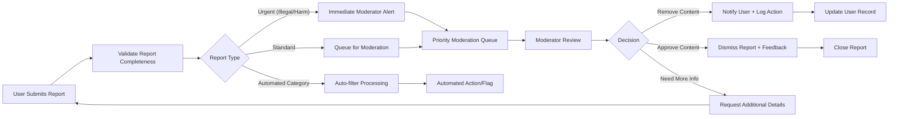
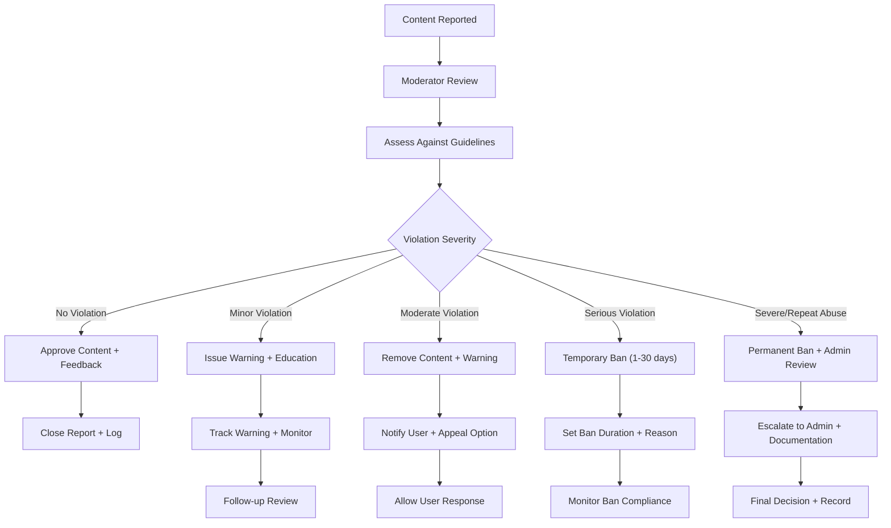
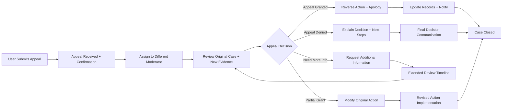

# Content Moderation and Reporting System Requirements

## Executive Summary

This document defines the comprehensive content moderation and reporting system for the community platform. The system ensures community safety, content quality, and user trust through a multi-layered approach combining user reporting, automated filtering, and human moderation. The moderation system must balance free expression with community standards while maintaining transparency and fairness.

## Content Reporting System

### User Reporting Interface
WHEN a user encounters inappropriate content, THE system SHALL provide a reporting interface accessible from all content types (posts, comments, images, links).

THE reporting interface SHALL include:
- Multiple reporting categories (spam, harassment, illegal content, misinformation, etc.)
- Option to provide additional context or explanation
- Anonymous reporting capability for sensitive situations
- Confirmation that the report has been received
- Clear instructions on what constitutes reportable content
- Estimated response time based on report severity

### Report Processing Workflow

### Report Categories and Priorities
| Report Category | Priority Level | Response Time Target | Automated Processing | Description |
|----------------|---------------|---------------------|---------------------|-------------|
| Illegal Content | Critical | < 1 hour | Manual review required | Content violating laws (copyright, threats, etc.) |
| Harm/Danger | High | < 4 hours | Manual review required | Content promoting self-harm, violence, or danger |
| Harassment | High | < 8 hours | Partial automation | Personal attacks, bullying, targeted harassment |
| Spam | Medium | < 24 hours | High automation | Unsolicited commercial content, repetitive posting |
| Misinformation | Medium | < 24 hours | Manual review | Deliberately false information with potential harm |
| Rule Violation | Low | < 48 hours | Manual review | Community-specific rule violations |
| Copyright | Medium | < 12 hours | Manual review | Intellectual property infringement |

### Report Validation Requirements
WHEN a report is submitted, THE system SHALL validate:
- Report category matches content type
- User has not exceeded daily report limit (max 20 reports per day)
- Content still exists and is accessible
- Report contains sufficient information for review

IF validation fails, THEN THE system SHALL provide specific error messages and guidance for correction.

## Moderation Workflows

### Community Moderator Responsibilities
WHILE acting as a community moderator, THE system SHALL provide tools to:
- Review reported content in moderation queue with priority sorting
- View user reporting history and context for informed decisions
- Take moderation actions (remove, warn, ban, approve) with documented reasoning
- Communicate moderation decisions to users with standardized templates
- Track moderation activity and decisions for performance monitoring
- Collaborate with other moderators on complex cases
- Access community-specific moderation guidelines and rules

### Moderation Actions Hierarchy

### Moderator Permission Levels
| Action | Community Moderator | Global Moderator | Administrator |
|--------|-------------------|-----------------|--------------|
| Remove content in assigned communities | ✅ | ✅ | ✅ |
| Issue warnings to users | ✅ | ✅ | ✅ |
| Temporary bans (1-30 days) | ✅ | ✅ | ✅ |
| Permanent bans | ❌ | ✅ | ✅ |
| View user moderation history | Limited | ✅ | ✅ |
| Override other moderators | ❌ | ✅ | ✅ |
| System-wide settings | ❌ | ❌ | ✅ |
| Access to all communities | ❌ | ✅ | ✅ |
| Modify community rules | ✅ (assigned) | ✅ | ✅ |
| Appoint new moderators | ✅ (with approval) | ✅ | ✅ |

### Moderation Decision Documentation
WHEN a moderator takes action, THE system SHALL record:
- Moderator identity and timestamp
- Specific rule violation identified
- Action taken and duration (if applicable)
- Reasoning and context for decision
- Any communication sent to user
- Follow-up requirements or monitoring needs

## Automated Content Filtering

### Spam Detection System
WHEN new content is submitted, THE system SHALL automatically analyze it for spam characteristics using machine learning algorithms trained on historical data.

THE automated spam detection SHALL consider:
- User reputation and karma score (low karma users get higher scrutiny)
- Content similarity to known spam patterns and blacklisted phrases
- Posting frequency and behavior patterns (burst posting triggers review)
- Link analysis and domain reputation (new domains require verification)
- Image analysis for inappropriate content using computer vision
- Text analysis for spam indicators (excessive capitalization, special characters)

### Automated Filter Thresholds
WHERE content scores above 90% spam confidence, THE system SHALL automatically remove and flag for moderator review with high priority.

WHERE content scores between 70-90% spam confidence, THE system SHALL hold for moderator review before publication and notify moderators.

WHERE content scores below 70% spam confidence, THE system SHALL publish normally with continued monitoring for pattern detection.

### Keyword and Pattern Filtering
THE system SHALL maintain configurable keyword filters organized by category:

**Hate Speech Filters:**
- Racial slurs and derogatory terms
- Religious intolerance phrases
- Gender-based discrimination terms
- Disability-related slurs

**Safety Filters:**
- Self-harm and suicide references
- Violent threat indicators
- Dangerous challenge or trend promotion
- Drug and substance abuse glorification

**Community-Specific Filters:**
- Each community can maintain custom prohibited terms
- Community moderators can update filters with admin approval
- Filter changes require audit logging and justification

### Machine Learning Model Requirements
THE automated filtering system SHALL utilize machine learning models with:
- Regular retraining using verified moderation decisions
- Human-in-the-loop validation for model improvements
- Bias detection and mitigation procedures
- Performance monitoring with precision/recall metrics
- Fallback to human moderation when model confidence is low

## Appeal and Review Process

### User Appeal Workflow
WHEN a user receives a moderation action, THE system SHALL provide a clear appeal process accessible through user notifications and profile settings.

THE appeal process SHALL include:
- Clear explanation of the specific violation with rule references
- Option to provide additional context, evidence, or explanation
- Timeline for appeal resolution (3-7 days depending on complexity)
- Communication of appeal decision with detailed reasoning
- Option for further escalation to higher-level moderators or administrators
- Temporary content restoration during appeal review for non-safety issues

### Appeal Review Process

### Transparency Requirements
THE system SHALL maintain moderation transparency through:
- Public moderation guidelines accessible to all users
- Clear communication of decisions with specific rule references
- Appeal success rate tracking and public reporting
- Moderator performance monitoring and quality assurance
- Regular moderation report publishing with statistics
- User education about community standards and expectations

### Moderator Training and Quality Assurance
WHILE moderators perform their duties, THE system SHALL provide:
- Comprehensive training materials and guidelines
- Regular quality reviews of moderation decisions
- Performance feedback and improvement recommendations
- Escalation paths for complex or uncertain cases
- Continuing education on new threats and best practices

## Moderation Tools and Interfaces

### Moderator Dashboard
THE system SHALL provide a comprehensive moderator dashboard with real-time analytics and management tools:

**Queue Management:**
- Real-time moderation queue with priority indicators
- Filtering by report type, community, and severity
- Bulk action capabilities for similar cases
- Collaboration tools for multi-moderator reviews

**User Management:**
- User behavior analytics and history
- Pattern detection for repeat offenders
- Communication history and note-taking
- Temporary restriction management

**Community Analytics:**
- Community health metrics and trends
- Moderation workload distribution
- Report resolution time tracking
- User satisfaction and feedback metrics

### Moderation Queue Management
WHILE moderators are reviewing content, THE system SHALL provide:
- Priority sorting based on report severity, user impact, and timeliness
- Content context including user history, similar cases, and community rules
- Quick action buttons for common decisions with customizable templates
- Collaboration tools for complex cases requiring multiple perspectives
- Performance metrics showing individual and team moderation statistics

### Communication Templates
THE system SHALL include standardized communication templates for consistent messaging:

**Content Removal Templates:**
- Standard removal with rule reference
- Educational removal with guidance for improvement
- Safety-related removal with resource recommendations
- Copyright removal with legal process explanation

**Warning Notifications:**
- First offense warning with education
- Repeated violation warning with consequences
- Community-specific warning for rule breaches
- Safety concern warning with support resources

**Ban Communications:**
- Temporary ban notification with duration and reason
- Permanent ban explanation with appeal process
- Ban modification notifications for changes
- Ban completion notifications with reinstatement conditions

## Escalation Procedures

### Complex Case Escalation
WHEN a moderation case involves complex legal, ethical, or community impact considerations, THE system SHALL provide structured escalation to higher-level moderators or administrators.

THE escalation process SHALL include:
- Case history and context transfer with all relevant details
- Priority flagging for urgent attention with clear justification
- Multi-moderator review capability with voting or consensus mechanisms
- Legal compliance review for sensitive cases requiring expert input
- Documentation of escalation rationale and decision-making process

### Emergency Response Protocol
IF content poses immediate harm or legal risk, THEN THE system SHALL provide emergency takedown procedures with:
- Immediate content removal capability with single-click emergency removal
- Administrator alert system with multiple notification channels
- Legal compliance verification with documented risk assessment
- Post-removal review process to ensure proper procedure followed
- Communication plan for affected users and potential public relations

### Cross-Community Coordination
WHEN issues span multiple communities, THE system SHALL facilitate:
- Cross-community moderator communication channels
- Shared threat intelligence and pattern sharing
- Coordinated action against multi-community abuse
- Consolidated reporting and tracking of inter-community issues

## Performance Requirements

### Moderation Response Times
THE system SHALL meet the following performance targets:
- Critical reports (illegal/harm): Initial review within 1 hour, resolution within 4 hours
- High priority reports (harassment/safety): Resolution within 8 hours
- Standard reports (spam/misinformation): Resolution within 24 hours
- Low priority reports (rule violations): Resolution within 48 hours
- Appeal processing: Initial response within 48 hours, resolution within 7 days

### System Scalability
THE moderation system SHALL scale to handle platform growth:
- Support 10,000+ daily content submissions with real-time analysis
- Process 1,000+ daily user reports with efficient queue management
- Support 100+ concurrent moderators with collaborative tools
- Maintain performance during traffic spikes (10x normal load)
- Handle multiple language content with translation capabilities

### Moderation Workload Distribution
THE system SHALL implement intelligent workload distribution:
- Automatic assignment based on moderator expertise and availability
- Load balancing to prevent moderator burnout
- Priority-based scheduling for time-sensitive cases
- Performance monitoring with alerting for backlog buildup

### Data Retention and Privacy
THE system SHALL maintain moderation records for compliance while respecting privacy:
- Moderation actions: 2-year retention for audit and legal purposes
- User reports: 1-year retention for pattern analysis and improvement
- Appeal records: 3-year retention for legal compliance and learning
- Automated filtering data: 6-month retention for model training
- User communication: 1-year retention for context and quality assurance

### Data Security and Access Control
THE moderation system SHALL implement robust security measures:
- Role-based access control for moderation tools and data
- Audit logging of all moderation actions and data access
- Encryption of sensitive moderation communications and decisions
- Regular security reviews and penetration testing
- Compliance with data protection regulations (GDPR, CCPA, etc.)

## Success Metrics

### Moderation Effectiveness
THE system SHALL track and report on key performance indicators:
- Report resolution time averages and distribution
- Appeal success rates and reasons for overturns
- User satisfaction with moderation through feedback surveys
- False positive/negative rates for automated and human moderation
- Moderator workload distribution and efficiency metrics
- Community health scores based on user retention and engagement

### Quality Assurance Metrics
THE system SHALL monitor moderation quality through:
- Decision consistency across moderators and time periods
- Adherence to moderation guidelines and standards
- User feedback and complaint resolution rates
- Moderator training effectiveness and knowledge retention
- Escalation rates and resolution effectiveness

### Community Health Indicators
THE moderation system SHALL contribute to measuring overall platform health:
- Content quality scores based on user engagement and feedback
- User retention rates correlated with moderation effectiveness
- Report frequency trends indicating community trust in the system
- Community growth metrics showing healthy expansion
- User trust and safety perceptions through regular surveys

### Continuous Improvement
THE system SHALL support ongoing enhancement through:
- Regular review of moderation policies and procedures
- User feedback incorporation into system improvements
- Technology updates for automated filtering capabilities
- Moderator training program enhancements based on performance data
- Benchmarking against industry standards and best practices

## Integration Requirements

### User Authentication Integration
THE moderation system SHALL integrate seamlessly with platform authentication:
- Verify moderator permissions for all moderation actions
- Track moderator activity through authenticated sessions
- Implement secure access controls for moderation tools
- Maintain audit trails linking actions to specific moderators

### Content System Integration
THE moderation system SHALL work with content management to:
- Access complete content context including edits and history
- Implement content removal and restoration efficiently
- Maintain content integrity during moderation actions
- Support content versioning for audit purposes

### Notification System Integration
THE moderation system SHALL coordinate with notifications to:
- Send timely alerts to moderators about new reports
- Notify users about moderation decisions and appeals
- Provide status updates during extended review processes
- Support multi-channel communication (in-app, email, mobile)

### Analytics and Reporting Integration
THE moderation system SHALL integrate with analytics to:
- Provide real-time moderation metrics for dashboards
- Support data-driven decisions about policy changes
- Enable trend analysis for proactive moderation planning
- Facilitate regulatory compliance reporting

> *Developer Note: This document defines **business requirements only**. All technical implementations (architecture, APIs, database design, etc.) are at the discretion of the development team.*