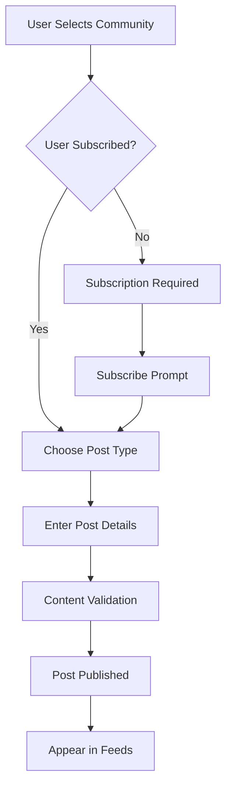
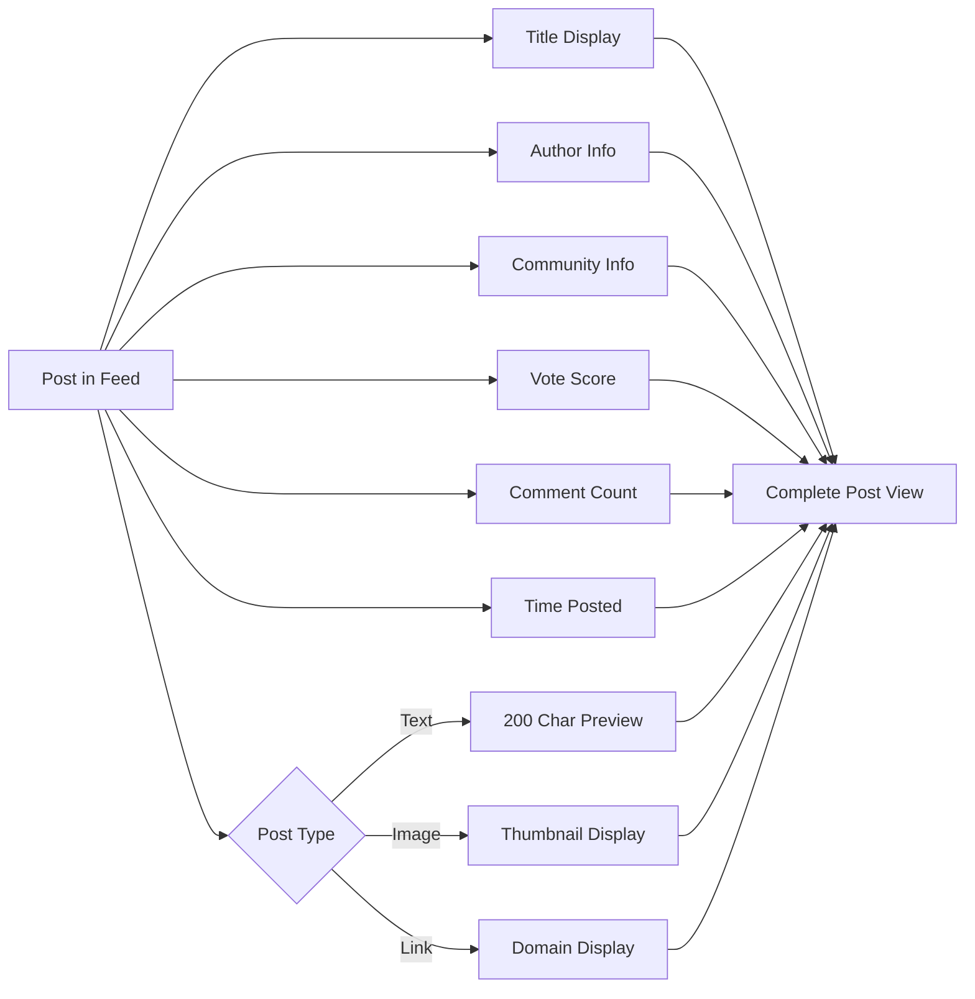
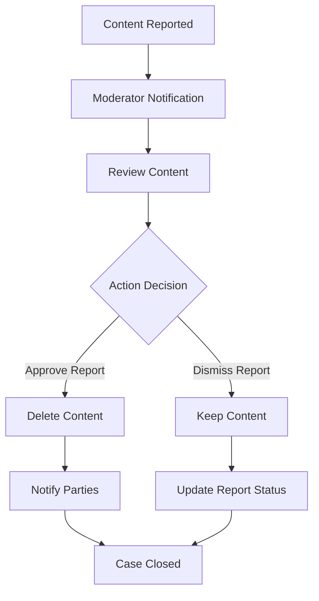

# Reddit-like Community Platform Requirements Specification

## Executive Summary

This document specifies the complete requirements for a Reddit-like community platform that enables users to create communities, share content, engage through voting and commenting, and participate in moderated discussions. The platform implements a karma-based reputation system, comprehensive content feeds, and robust moderation tools.

## User Account Management

### User Registration
- **WHEN** a user registers for an account, **THE** system **SHALL** require:
  - Valid email address format verification
  - Password meeting minimum security requirements (8+ characters, mixed case, numbers)
  - Unique username that hasn't been previously registered
- **THE** system **SHALL** send email verification to confirm account ownership
- **WHILE** email verification is pending, **THE** user **SHALL** have limited platform access

### User Authentication
- **WHEN** a user attempts to log in, **THE** system **SHALL**:
  - Verify email and password combination
  - Implement secure session management with JWT tokens
  - Support session persistence with configurable timeout periods
  - Provide logout functionality that invalidates session tokens

### Account Management
- **WHEN** a user changes their password, **THE** system **SHALL**:
  - Require current password verification
  - Enforce password complexity requirements
  - Invalidate all existing sessions for security
  - Send email notification of password change

### Account Deletion
- **WHEN** a user deletes their account, **THE** system **SHALL**:
  - Remove all user-generated content (posts, comments, votes)
  - Anonymize user data in accordance with privacy regulations
  - Maintain platform integrity by preserving content relationships
  - Send confirmation email with deletion details

## User Profile System

### Profile Creation and Management
- **WHEN** a user creates their profile, **THE** system **SHALL** provide:
  - Display name (editable, 2-50 characters)
  - Bio text field (optional, 0-500 characters)
  - Avatar image upload with size and format validation
  - Profile visibility settings (public/private)

### Profile Viewing
- **WHEN** viewing any user profile, **THE** system **SHALL** display:
  - User's display name, bio, and avatar
  - Total karma score with breakdown (post karma, comment karma)
  - Complete post history with pagination
  - Complete comment history with pagination
  - Account creation date and activity statistics

### Profile Editing Permissions
- **THE** system **SHALL** enforce that users can only edit their own profiles
- **WHILE** editing profiles, **THE** system **SHALL** provide real-time validation
- **WHERE** avatar changes are concerned, **THE** system **SHALL** support image cropping and optimization

## Karma Scoring System

### Karma Calculation Rules
- **WHEN** a user receives an upvote on their post, **THE** system **SHALL** increase their karma by 1
- **WHEN** a user receives a downvote on their post, **THE** system **SHALL** decrease their karma by 1
- **WHEN** vote changes occur, **THE** system **SHALL** recalculate karma accordingly
- **THE** karma system **SHALL** support negative values without lower bound

### Karma Impact Scenarios
- **IF** a post receives multiple votes, **THEN THE** karma impact **SHALL** be calculated as net votes
- **WHILE** content exists, **THE** karma **SHALL** update in real-time with vote changes
- **WHERE** deleted content is concerned, **THE** system **SHALL** maintain karma history integrity

## Community Management

### Community Creation
- **WHEN** a user creates a community, **THE** system **SHALL** require:
  - Unique community name (3-50 characters, alphanumeric)
  - Community description (10-500 characters)
  - Community icon image upload
  - Initial community rules and guidelines

### Community Discovery
- **THE** system **SHALL** provide comprehensive community browsing:
  - Alphabetical listing of all communities
  - Search functionality by community name
  - Category-based filtering
  - Popular communities highlighting

### Community Information Display
- **FOR EACH** community, **THE** system **SHALL** show:
  - Current subscriber count
  - Community creation date
  - Active moderator list
  - Recent activity statistics
  - Community rules and description

## Subscription System

### Subscription Management
- **WHEN** a user subscribes to a community, **THE** system **SHALL**:
  - Add the community to the user's subscription list
  - Enable post creation permissions in that community
  - Include community posts in the user's home feed
  - Update community subscriber count

### Subscription Requirements
- **THE** system **SHALL** require subscription for post creation
- **WHILE** unsubscribed, **THE** user **SHALL** retain content viewing permissions
- **WHERE** subscription changes occur, **THE** feed updates **SHALL** be immediate

### Subscription Interface
- **THE** system **SHALL** provide users with:
  - Complete list of their subscribed communities
  - Quick unsubscribe functionality
  - Subscription management dashboard
  - Recommended communities based on interests

## Post Creation and Management

### Post Types and Requirements
- **THE** system **SHALL** support three post types:
  - **Text Post**: Requires title (5-300 characters) and text content (10-40,000 characters)
  - **Link Post**: Requires title and valid URL with preview generation
  - **Image Post**: Requires title and image upload with format/size validation

### Post Creation Workflow

### Post Editing and Deletion
- **WHEN** users edit their posts, **THE** system **SHALL**:
  - Maintain post history for transparency
  - Show edit timestamps to other users
  - Preserve original content for moderation purposes
- **WHEN** posts are deleted, **THE** system **SHALL**:
  - Remove from all feeds and searches
  - Maintain data integrity for 30 days
  - Adjust karma scores accordingly

### Post Display Requirements
- **WHEN** viewing a single post, **THE** system **SHALL** show:
  - Complete post content with formatting
  - Author information and community
  - Vote score and comment count
  - Post creation timestamp
  - Edit history if applicable

## Voting System

### Voting Rules and Constraints
- **WHEN** a user votes on content, **THE** system **SHALL**:
  - Allow only one vote per user per content item
  - Support upvote (+1), downvote (-1), and vote removal
  - Update vote scores in real-time
  - Adjust author karma accordingly

### Vote Change Scenarios
- **IF** a user changes their vote, **THEN THE** system **SHALL**:
  - Calculate the net change in score
  - Update the content's vote total immediately
  - Adjust author karma by the difference
  - Maintain vote history for audit purposes

### Vote Integrity
- **THE** system **SHALL** prevent self-voting on user's own content
- **WHILE** content exists, **THE** voting **SHALL** remain available
- **WHERE** deleted accounts are concerned, **THE** votes **SHALL** be anonymized

## Content Feeds System

### Feed Types and Access

#### Home Feed
- **WHEN** a logged-in user views their home feed, **THE** system **SHALL**:
  - Show posts only from subscribed communities
  - Provide personalized content recommendations
  - Support all sorting options (Hot, New, Top, Controversial)
  - Implement efficient pagination for large datasets

#### Popular Feed
- **WHEN** any user views the popular feed, **THE** system **SHALL**:
  - Show posts from all communities across the platform
  - Highlight trending and high-engagement content
  - Support the same sorting options as home feed
  - Be accessible to both logged-in and logged-out users

#### Community Feed
- **WHEN** viewing a specific community's feed, **THE** system **SHALL**:
  - Show only posts from that community
  - Display community information and statistics
  - Support community-specific sorting preferences
  - Be accessible to all users regardless of subscription status

### Sorting Algorithms

#### Hot Sorting
- **THE** hot algorithm **SHALL** prioritize:
  - Recent posts with high engagement
  - Time-decay factor for older content
  - Vote velocity and comment activity
  - Community-specific trending patterns

#### Top Sorting
- **THE** top algorithm **SHALL** support time filters:
  - Today: Highest scoring posts from last 24 hours
  - This Week: Top posts from last 7 days
  - This Month: Best content from last 30 days
  - This Year: Annual highlights
  - All Time: Historically highest-scoring content

#### Controversial Sorting
- **THE** controversial algorithm **SHALL** highlight:
  - Posts with high vote counts but scores near zero
  - Content generating significant discussion
  - Balanced upvote/downvote ratios
  - Engagement-driven controversy metrics

### Feed Display Requirements

## Comment System

### Comment Creation and Threading
- **WHEN** users comment on posts, **THE** system **SHALL**:
  - Support unlimited comment nesting depth
  - Provide real-time comment preview
  - Enforce content length limits (1-10,000 characters)
  - Support rich text formatting options

### Comment Management
- **WHEN** users edit comments, **THE** system **SHALL**:
  - Show edit history with timestamps
  - Maintain comment thread integrity
  - Preserve original content for moderation
- **WHEN** comments are deleted, **THE** system **SHALL**:
  - Show "[deleted]" placeholder
  - Maintain thread structure
  - Adjust author karma accordingly

### Comment Voting
- **THE** comment voting system **SHALL** mirror post voting rules
- **WHEN** comment votes occur, **THE** system **SHALL**:
  - Update scores in real-time
  - Affect author karma scores
  - Support the same vote change scenarios

### Comment Sorting Options
- **THE** system **SHALL** provide multiple sorting methods:
  - **Best**: Highest vote score comments first
  - **New**: Most recent comments first
  - **Controversial**: High engagement, balanced votes
  - **Oldest**: Chronological order from creation

## Moderation System

### Moderator Role Hierarchy

#### Community Owner
- **WHEN** a user creates a community, **THE** system **SHALL** designate them as owner
- **THE** owner **SHALL** have ultimate authority over community management
- **WHERE** moderator management is concerned, **THE** owner **SHALL** be the only user who can remove moderators

#### Community Moderator
- **WHEN** moderators are appointed, **THE** system **SHALL** grant defined permissions
- **WHILE** acting as moderators, **THE** users **SHALL** perform content management actions
- **IF** moderators attempt unauthorized actions, **THEN THE** system **SHALL** enforce permission boundaries

### Moderation Actions

#### Content Management
- **WHEN** moderators delete content, **THE** system **SHALL**:
  - Remove from public visibility immediately
  - Notify content authors with reason
  - Maintain audit records for 30 days
  - Adjust karma scores accordingly

#### User Management
- **WHEN** moderators ban users, **THE** system **SHALL**:
  - Prevent banned users from creating content
  - Allow continued content viewing
  - Support temporary and permanent bans
  - Provide comprehensive ban management interface

### Moderation Workflow

## Reporting System

### Report Creation
- **WHEN** users report content, **THE** system **SHALL**:
  - Require specific reason selection
  - Support custom reason text (10-500 characters)
  - Record reporter identity for moderation
  - Immediately notify community moderators

### Report Categories
- **THE** reporting system **SHALL** support standardized categories:
  - Spam or commercial content
  - Harassment or bullying
  - Hate speech
  - Misinformation
  - Copyright violation
  - Other (with custom reason requirement)

### Report Resolution
- **WHEN** moderators resolve reports, **THE** system **SHALL**:
  - Provide clear approve/dismiss options
  - Record resolution details in moderation log
  - Notify reporting users of outcome
  - Prevent duplicate reporting for 24 hours

## Performance and Scalability Requirements

### Response Time Expectations
- **THE** platform **SHALL** load main feeds within 2 seconds
- **WHEN** performing actions, **THE** system **SHALL** respond within 1 second
- **THE** voting system **SHALL** update scores in real-time (<500ms)
- **WHILE** handling high traffic, **THE** system **SHALL** maintain performance

### Concurrent User Support
- **THE** system **SHALL** support 10,000+ concurrent users
- **WHILE** under load, **THE** platform **SHALL** maintain functionality
- **WHERE** content creation is concerned, **THE** system **SHALL** handle peak usage

## Security and Privacy Requirements

### Data Protection
- **THE** system **SHALL** encrypt sensitive user data
- **WHILE** storing passwords, **THE** system **SHALL** use industry-standard hashing
- **WHERE** personal information is concerned, **THE** system **SHALL** comply with privacy regulations

### Access Control
- **THE** system **SHALL** enforce role-based permissions
- **WHEN** unauthorized access is attempted, **THE** system **SHALL** deny and log
- **WHERE** moderation actions occur, **THE** system **SHALL** verify authority

## Error Handling and Recovery

### User-Facing Errors
- **WHEN** errors occur, **THE** system **SHALL** provide clear, actionable messages
- **WHILE** recovering from errors, **THE** system **SHALL** maintain data integrity
- **WHERE** content creation fails, **THE** system **SHALL** preserve draft data

### System Resilience
- **THE** platform **SHALL** handle network interruptions gracefully
- **WHILE** experiencing outages, **THE** system **SHALL** provide status updates
- **WHERE** data corruption occurs, **THE** system **SHALL** have recovery procedures

## Success Metrics

The platform will be considered successful when:
- User registration completion rate exceeds 95%
- Content creation success rate reaches 99%
- Average response time for all actions is under 1 second
- User satisfaction scores exceed 4.5/5.0
- Moderation response time is under 24 hours for 95% of reports
- Platform uptime exceeds 99.9% availability

> *This document provides comprehensive business requirements for the Reddit-like community platform. All technical implementation details are at the discretion of the development team.*