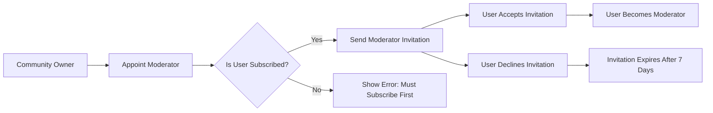
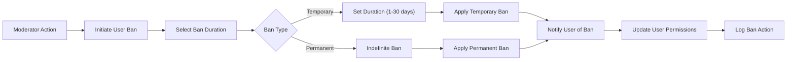

# Community Platform Moderation System Requirements

## Executive Summary

The moderation system provides community owners and moderators with the tools necessary to maintain content quality, enforce community guidelines, and manage user behavior within their communities. This system establishes a clear hierarchy of authority while ensuring accountability and transparency in all moderation actions.

## Moderator Hierarchy

### Role Definitions

#### Community Owner
- THE community creator SHALL automatically become the community owner
- THE owner SHALL have the highest level of authority within their community
- THE owner SHALL be able to appoint moderators from community subscribers
- THE owner SHALL be able to remove any moderator from their community
- THE owner SHALL be the only role capable of transferring ownership

#### Community Moderator
- WHEN appointed by the owner or existing moderators, THE user SHALL become a moderator
- THE moderator SHALL have elevated permissions for content management
- THE moderator SHALL be able to perform moderation actions within their assigned community
- THE moderator SHALL NOT be able to remove the community owner
- THE moderator SHALL NOT be able to remove other moderators (only owner can remove moderators)

### Moderator Appointment Process

**Moderator Appointment Rules:**
- WHEN appointing a moderator, THE system SHALL verify the user is subscribed to the community
- THE moderator invitation SHALL expire after 7 days if not accepted
- THE community owner SHALL receive notification when a user accepts moderator role
- THE system SHALL maintain audit log of all moderator appointments

## Moderator Permissions

### Content Management Permissions

| Action | Community Owner | Moderator | Regular User |
|--------|----------------|-----------|--------------|
| Delete any post in community | ✅ | ✅ | ❌ |
| Delete any comment in community | ✅ | ✅ | ❌ |
| Edit any post in community | ❌ | ❌ | ❌ |
| Edit any comment in community | ❌ | ❌ | ❌ |
| Pin posts to community top | ✅ | ✅ | ❌ |
| Lock posts (disable comments) | ✅ | ✅ | ❌ |
| Mark posts as NSFW | ✅ | ✅ | ❌ |
| Approve reported content | ✅ | ✅ | ❌ |
| Dismiss reported content | ✅ | ✅ | ❌ |

### User Management Permissions

| Action | Community Owner | Moderator | Regular User |
|--------|----------------|-----------|--------------|
| Ban users from community | ✅ | ✅ | ❌ |
| Unban users from community | ✅ | ✅ | ❌ |
| View banned users list | ✅ | ✅ | ❌ |
| View moderation logs | ✅ | ✅ | ❌ |
| Remove moderators | ✅ | ❌ | ❌ |
| Transfer ownership | ✅ | ❌ | ❌ |

### Content Moderation Actions

#### Post Deletion
- WHEN a moderator deletes a post, THE system SHALL remove the post from all feeds
- THE post author SHALL receive notification of post deletion
- THE notification SHALL include reason for deletion if provided
- THE deleted post SHALL be moved to moderation archive for 30 days
- AFTER 30 days, THE system SHALL permanently delete the post data

#### Comment Deletion
- WHEN a moderator deletes a comment, THE system SHALL remove the comment from the thread
- THE comment author SHALL receive notification of comment deletion
- THE notification SHALL include reason for deletion if provided
- THE system SHALL update comment counts on the parent post
- Nested comments under deleted comment SHALL also be removed

## User Banning System

### Banning Process

### Banning Rules
- WHEN banning a user, THE moderator SHALL select ban duration (temporary or permanent)
- THE banned user SHALL receive notification explaining the ban
- THE notification SHALL include ban duration and reason
- DURING ban period, THE user SHALL NOT be able to create posts or comments in the community
- THE banned user SHALL still be able to view community content
- THE banned user SHALL NOT be able to vote on content in the banned community

### Ban Duration Options
- Temporary bans: 1 day, 3 days, 7 days, 14 days, 30 days
- Permanent bans: indefinite duration
- WHEN temporary ban expires, THE system SHALL automatically restore user permissions
- THE user SHALL receive notification when ban is lifted

### Ban Appeals Process
- THE banned user SHALL be able to appeal the ban decision
- WHEN appealing, THE user SHALL provide explanation for reconsideration
- THE community moderators SHALL review appeal within 7 days
- IF appeal is approved, THE ban SHALL be lifted immediately
- IF appeal is denied, THE ban SHALL continue for original duration

## Reporting System Integration

### Report Review Process
- WHEN a report is submitted, THE system SHALL notify community moderators
- THE moderators SHALL see all reports in a dedicated moderation queue
- EACH report SHALL show: reported content, reporter username, report reason, and timestamp
- THE moderator SHALL be able to view the reported content in context

### Report Resolution Actions
- WHEN reviewing a report, THE moderator SHALL have two options:
  - Approve report: delete the reported content
  - Dismiss report: keep the content and remove from queue
- THE moderator SHALL provide reason for their decision
- THE reporter SHALL receive notification of report resolution
- IF content is deleted, THE content author SHALL receive deletion notification

### Report Statistics
- THE system SHALL track report resolution rates per moderator
- THE system SHALL identify frequently reported users
- THE system SHALL flag users who submit excessive false reports
- REPORT statistics SHALL be visible to community owner only

## Security and Logging Requirements

### Audit Logging
- THE system SHALL log all moderator actions with timestamp and user identification
- EACH log entry SHALL include: action type, target content/user, moderator username, and reason
- THE audit logs SHALL be retained for 2 years
- ONLY community owner SHALL have access to complete moderation logs

### Action Confirmation
- WHEN performing destructive actions (deletion, banning), THE system SHALL require confirmation
- THE confirmation dialog SHALL clearly state the action being taken
- THE moderator SHALL have option to provide reason for the action
- WITHOUT confirmation, THE action SHALL not proceed

### Rate Limiting
- TO prevent abuse, THE system SHALL limit moderation actions:
  - Maximum 50 post deletions per moderator per day
  - Maximum 20 user bans per moderator per day
  - Maximum 100 comment deletions per moderator per day
- WHEN limits are exceeded, THE system SHALL require owner approval

## Performance Requirements

### Response Time
- Moderation actions SHALL complete within 2 seconds
- Report queue loading SHALL complete within 1 second
- Ban list viewing SHALL complete within 1 second
- Moderator appointment process SHALL complete within 3 seconds

### Scalability
- THE moderation system SHALL support communities with up to 1 million subscribers
- THE system SHALL handle 100 concurrent moderators per large community
- Report processing SHALL scale linearly with community size
- Moderation logs SHALL be efficiently searchable and filterable

## Error Handling

### Permission Errors
- IF unauthorized user attempts moderation action, THE system SHALL return HTTP 403
- THE error message SHALL clearly indicate insufficient permissions
- THE system SHALL log unauthorized access attempts

### Content Not Found
- IF moderator attempts action on non-existent content, THE system SHALL return HTTP 404
- THE error message SHALL indicate the content could not be found
- THE system SHALL verify content existence before applying actions

### Concurrent Moderation
- WHEN multiple moderators act on same content simultaneously, THE system SHALL use optimistic locking
- THE last successful action SHALL prevail
- THE system SHALL notify moderators of concurrent modification conflicts

## Integration Points

### User Authentication Integration
- Moderator permissions SHALL be verified against JWT token claims
- THE system SHALL check moderator status on each moderation action
- Permission changes SHALL be reflected in user session within 5 minutes

### Content System Integration
- Post deletion SHALL trigger update of all relevant feeds
- Comment deletion SHALL update parent post comment counts
- User banning SHALL immediately restrict content creation permissions

### Notification System Integration
- ALL moderation actions SHALL generate appropriate user notifications
- Notification delivery SHALL be asynchronous and non-blocking
- Users SHALL be able to manage notification preferences for moderation actions

## Business Rules

### Moderator Accountability
- EACH moderation action SHALL be attributable to specific moderator
- Moderators SHALL not be able to perform anonymous actions
- THE community owner SHALL be able to review all moderator activity

### Content Preservation
- DELETED content SHALL be preserved in archive for 30 days for dispute resolution
- AFTER 30 days, THE content SHALL be permanently deleted
- DURING archive period, THE content SHALL not be publicly accessible

### User Privacy
- Moderator access to user information SHALL be limited to what is necessary for moderation
- Personal user data SHALL not be exposed to moderators unnecessarily
- Moderation actions SHALL respect user privacy rights

This document provides comprehensive requirements for the moderation system that backend developers can use to implement robust community management functionality while maintaining security, accountability, and user experience standards.