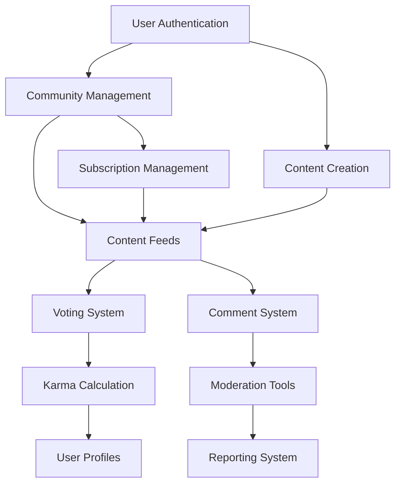

# Reddit-like Community Platform Requirements Specification

## 1. System Overview and Architecture

### 1.1 Platform Vision and Purpose

The Community Platform is a Reddit-like discussion platform designed to enable users to create, share, and discuss content within interest-based communities. The platform facilitates organic community growth through user-generated content, voting mechanisms, and threaded discussions.

### 1.2 Core System Architecture



### 1.3 User Actor Hierarchy

**THE** platform **SHALL** support four distinct user actor types with escalating permissions:

- **Guest User**: Unauthenticated users with read-only access to public content
- **Authenticated User**: Registered users with full content creation and engagement capabilities
- **Community Moderator**: Users granted moderation privileges for specific communities
- **Platform Administrator**: System-wide administrators with full platform control

## 2. User Management Requirements

### 2.1 User Registration and Authentication

**WHEN** a user attempts to register with email and password, **THE** system **SHALL**:
- Validate email format and uniqueness across the platform
- Validate password meets security requirements (minimum 8 characters)
- Validate username is unique and contains only alphanumeric characters and underscores
- Send email verification to confirm account ownership
- Create user account with pending verification status

**WHEN** a user logs in with email and password, **THE** system **SHALL**:
- Validate credentials against stored user data
- Generate JWT access token with 15-minute expiration
- Generate refresh token with 30-day expiration
- Set user session with appropriate permissions

### 2.2 Account Management

**WHEN** a user changes their password, **THE** system **SHALL**:
- Require current password verification for security
- Validate new password meets security standards
- Update password hash in database
- Invalidate all existing sessions requiring re-login

**WHEN** a user deletes their account, **THE** system **SHALL**:
- Require password confirmation for security
- Anonymize all user content (posts, comments) while preserving structure
- Remove personal information from database
- Send confirmation of account deletion

### 2.3 User Profile Management

**EACH** user profile **SHALL** contain:
- Display name (2-50 characters, unique)
- Bio text (maximum 500 characters, optional)
- Avatar image (supported formats: JPG, PNG, WebP, maximum 5MB)
- Username (unique identifier)
- Email address (primary contact)
- Registration date and time
- Karma score (numeric reputation)

**WHEN** viewing any user's profile page, **THE** system **SHALL** display:
- User's display name and avatar prominently
- Bio text if provided
- Current karma score
- Account creation date
- Total number of posts created
- Total number of comments written
- Organized content history (posts and comments sections)

## 3. Community Management Specifications

### 3.1 Community Creation Process

**WHEN** a user creates a new community, **THE** system **SHALL** require:
- Unique community name (3-21 characters, letters/numbers/underscores/hyphens)
- Community description (10-500 characters)
- Community icon image (optional, supported formats: JPG, PNG, WebP)

**THE** creating user **SHALL** automatically become the community owner with full administrative privileges including:
- Adding and removing moderators
- Editing community information and settings
- Performing all moderation actions
- Transferring ownership to another user

### 3.2 Community Discovery and Browsing

**WHEN** users browse communities, **THE** system **SHALL** provide:
- Comprehensive community list with sorting options (subscriber count, new, alphabetical, activity)
- Real-time search functionality with partial name matching
- Community profile pages showing detailed information and statistics
- Trending communities based on growth rates

### 3.3 Subscription Management

**WHEN** a user subscribes to a community, **THE** system **SHALL**:
- Track subscription status per user per community
- Update subscriber counts in real-time
- Require subscription for posting in that community
- Provide subscription management interface

**THE** subscription system **SHALL** enforce:
- Maximum 1,000 subscriptions per user
- Subscription rate limit of 50 per hour
- Inactive subscription cleanup after 1 year

## 4. Content Creation and Management

### 4.1 Post Types and Requirements

**THE** platform **SHALL** support three post types with specific content requirements:

#### Text Posts
- **MUST** have title (5-300 characters)
- **MUST** have text content (10-40,000 characters)
- **SHALL** support basic text formatting (line breaks, paragraphs)

#### Link Posts
- **MUST** have title (5-300 characters)
- **MUST** have valid URL
- **SHALL** extract and display domain name

#### Image Posts
- **MUST** have title (5-300 characters)
- **MUST** have uploaded image (JPEG, PNG, GIF, WebP, maximum 10MB)
- **SHALL** validate image dimensions (100x100 to 4000x4000 pixels)
- **SHALL** generate thumbnails for feed display

### 4.2 Post Creation Workflow

```mermaid
graph LR
    A["User Authentication"] --> B{"Community Subscription?"}
    B -->|Yes| C["Select Post Type"]
    B -->|No| D[\"Require Subscription\"]
    C --> E["Enter Content & Validate"]
    E --> F{"Validation Passed?"}
    F -->|Yes| G["Create Post Record"]
    F -->|No| H["Display Error Message"]
    G --> I["Update Community Feed"]
    I --> J["Notify Subscribers"]
```

### 4.3 Post Editing and Deletion

**WHEN** users edit their posts, **THE** system **SHALL**:
- Allow editing within 24 hours of creation
- Maintain edit history for transparency
- Preserve post type (cannot change after creation)
- Prevent moving posts between communities

**WHEN** users delete their posts, **THE** system **SHALL**:
- Require confirmation with cascade deletion warning
- Immediately remove from all feeds and listings
- Delete all associated comments
- Adjust karma score accordingly

## 5. Voting and Engagement Systems

### 5.1 Voting Mechanics

**WHEN** a user votes on content, **THE** system **SHALL** enforce:
- One vote per user per content item (post or comment)
- Users cannot vote on their own content
- Voting available to authenticated users only
- Votes reversible (can change or remove)

**THE** voting actions **SHALL** include:
- **Upvote**: Increases content score by +1
- **Downvote**: Decreases content score by -1
- **Vote Removal**: Returns to previous state

### 5.2 Score Calculation

**THE** content score **SHALL** be calculated as:
```
Content Score = Total Upvotes - Total Downvotes
```

**THE** system **SHALL** update scores in real-time and display them prominently.

### 5.3 Karma Impact System

**WHEN** a user receives votes on their content, **THE** system **SHALL** update their karma score:
- Upvote received: Karma increases by +1
- Downvote received: Karma decreases by -1
- Vote removed: Karma adjusts by inverse of original vote

**THE** karma score **SHALL**:
- Be a single numeric value per user
- Support negative values (can go below zero)
- Update in real-time
- Be visible on user profiles

## 6. Content Feeds and Discovery

### 6.1 Feed Types

**THE** platform **SHALL** provide three primary feed types:

#### Home Feed
- Available ONLY to authenticated users
- Shows posts from communities the user is subscribed to
- Requires user login for access

#### Popular Feed
- Available to ALL users (including logged-out)
- Shows posts from ALL communities across platform
- Prioritizes content based on engagement and recency

#### Community Feed
- Available to ALL users for specific communities
- Shows posts exclusively from selected community
- Displays community-specific information

### 6.2 Sorting Algorithms

**ALL** feeds **SHALL** support consistent sorting options:

#### Hot Algorithm
- Prioritizes recent posts with high engagement
- Uses time-decay formula: `log(max(abs(score), 1)) + (created_at_timestamp / 45000)`
- Updates dynamically as new votes are cast

#### New Algorithm
- Sorts by creation timestamp (newest first)
- Uses post ID as secondary sort for identical timestamps

#### Top Algorithm
- Supports time filters: today, week, month, year, all time
- Calculates highest vote scores within specified timeframe

#### Controversial Algorithm
- Prioritizes posts with high vote engagement but scores near zero
- Uses formula: `(upvotes + downvotes) / max(abs(score), 1)`

### 6.3 Pagination Requirements

**ALL** feeds **SHALL** implement pagination with:
- Default page size of 25 posts per page
- Configurable page sizes up to 100 posts
- Cursor-based pagination for performance
- Real-time updates for new content

## 7. Comment and Discussion Features

### 7.1 Comment Creation

**WHEN** users create comments, **THE** system **SHALL**:
- Validate comment content (1-10,000 characters after whitespace removal)
- Verify user permission to comment (not banned from community)
- Establish proper parent-child relationships for threading
- Support unlimited nesting depth for replies

### 7.2 Comment Voting

**THE** comment voting system **SHALL** mirror post voting mechanics:
- Same vote types and constraints
- Identical karma impact calculations
- Real-time score updates
- One vote per user per comment enforcement

### 7.3 Comment Sorting

**COMMENTS** on posts **SHALL** support three sorting options:

#### Best Sort (Default)
- Uses confidence algorithm prioritizing higher scores
- Balances score and voting activity
- Highlights quality contributions

#### New Sort
- Chronological order (newest comments first)
- Simple timestamp-based sorting

#### Controversial Sort
- Prioritizes comments with high engagement but neutral scores
- Highlights discussions with significant disagreement

### 7.4 Thread Display Logic

**WHEN** displaying comment threads, **THE** system **SHALL**:
- Render hierarchical structure with proper indentation
- Provide visual indicators for nesting depth
- Support collapsible thread sections
- Maintain pagination within large threads

## 8. Moderation and Administration

### 8.1 Moderator Role Hierarchy

**THE** moderation system **SHALL** implement hierarchical roles:

#### Community Owner
- Highest authority in their community
- Can add/remove moderators
- Can edit community information and settings
- Cannot be removed by other moderators

#### Community Moderator
- Appointed by community owner
- Can perform content management actions
- Cannot remove other moderators or owner
- Community-specific permissions

### 8.2 Moderation Actions

**WHEN** moderators perform actions, **THE** system **SHALL** support:

#### Content Management
- Delete any post or comment within moderated community
- Preserve content data for 30-day audit period
- Notify content authors of removal with reason

#### User Management
- Ban users from community with configurable durations
- Unban users and restore privileges
- Maintain banned users list with details

### 8.3 Reporting System

**WHEN** users report content, **THE** system **SHALL**:
- Require reporting reason (minimum 10 characters)
- Notify community moderators immediately
- Provide report categorization (spam, harassment, hate speech, etc.)
- Maintain report queue with prioritization

**WHEN** moderators handle reports, **THE** system **SHALL** provide:
- Approve action (delete content with notifications)
- Dismiss action (keep content, notify reporter)
- Comprehensive moderation logs
- Conflict prevention for multiple moderators

## 9. Error Handling and Recovery

### 9.1 Authentication Errors

**WHEN** authentication fails, **THE** system **SHALL**:
- Provide generic error messages without revealing specific field issues
- Offer password recovery and account support options
- Maintain security by not confirming email existence

### 9.2 Content Creation Errors

**WHEN** content creation fails, **THE** system **SHALL**:
- Preserve user input for recovery
- Provide specific validation error messages
- Highlight problematic fields with clear guidance
- Implement auto-save for drafts

### 9.3 Permission Errors

**WHEN** permission checks fail, **THE** system **SHALL**:
- Display appropriate permission denied messages
- Explain required permissions or subscriptions
- Provide context-specific recovery options
- Maintain security while being user-friendly

### 9.4 System Error Recovery

**WHILE** handling system errors, **THE** system **SHALL**:
- Implement graceful degradation
- Provide maintenance notifications with estimated recovery
- Preserve application state to prevent data loss
- Offer alternative workflows when possible

## 10. Performance and Scalability Requirements

### 10.1 Response Time Expectations

**THE** system **SHALL** meet the following performance standards:
- Authentication: Login response within 2 seconds
- Content feeds: Initial load within 2 seconds
- Voting actions: Response within 200 milliseconds
- Comment loading: Under 2 seconds for standard threads
- Search operations: Results within 1 second

### 10.2 Scalability Requirements

**THE** platform **SHALL** be designed to handle:
- 10,000+ concurrent authenticated users
- 100,000+ daily active users
- 1,000,000+ posts and comments
- Real-time voting and feed updates
- Efficient pagination for large datasets

### 10.3 Data Integrity and Consistency

**THE** system **SHALL** ensure data integrity through:
- Atomic operations for voting and karma updates
- Transactional consistency for content modifications
- Conflict resolution for concurrent edits
- Comprehensive audit trails for moderation actions

### 10.4 Caching and Optimization

**THE** system **SHALL** implement:
- Feed content caching with intelligent invalidation
- User session optimization for performance
- Database indexing for efficient querying
- Content delivery optimization for media

## 11. Success Metrics and Quality Assurance

### 11.1 Platform Performance Metrics

**THE** platform **SHALL** be measured against:
- User registration success rate: >95%
- Content creation success rate: >98%
- Voting system reliability: 99.9% uptime
- Moderation response time: <24 hours for 95% of reports

### 11.2 User Experience Standards

**THE** user interface **SHALL** provide:
- Consistent experience across all devices
- Accessible design meeting WCAG 2.1 AA standards
- Mobile-responsive layouts
- Intuitive navigation and interaction patterns

### 11.3 Security and Compliance

**THE** platform **SHALL** maintain:
- Secure authentication with industry-standard encryption
- Data protection compliance with relevant regulations
- Regular security audits and vulnerability assessments
- Privacy-by-design principles throughout

This comprehensive requirements specification provides the complete foundation for implementing a production-ready Reddit-like community platform with robust features, scalable architecture, and excellent user experience.