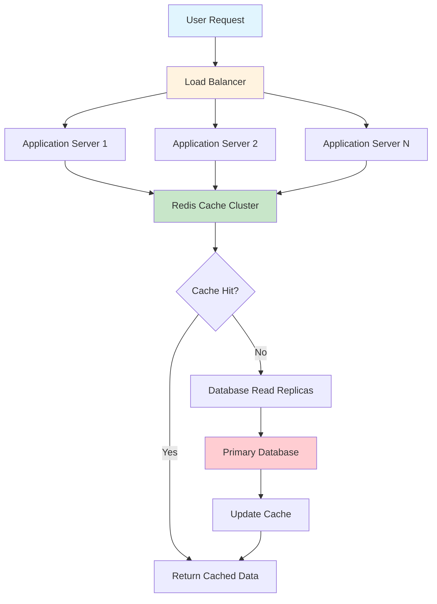

# Non-Functional Requirements Specification for Community Platform

## Executive Summary

This document defines the comprehensive non-functional requirements for the Reddit-like community platform, establishing the performance, security, scalability, and operational standards that ensure the platform delivers a high-quality user experience while maintaining robust security and reliability. These requirements provide the foundation for technical implementation decisions and system architecture design.

## 1. Performance Requirements

### 1.1 Response Time Requirements

**Page Load Performance:**
WHEN a user navigates to any page, THE system SHALL render the initial content within 2 seconds for 95% of requests under normal load conditions.

WHEN a returning user accesses the platform with cached assets, THE system SHALL display above-the-fold content within 1 second for 99% of requests.

WHERE users have internet connections with latency exceeding 100ms, THE system SHALL implement progressive loading techniques to display content incrementally as it becomes available.

**API Response Times:**
WHEN users perform search operations, THE system SHALL return results within 500 milliseconds for common queries covering 95% of search patterns.

WHEN users submit voting actions, THE system SHALL process and confirm the vote within 200 milliseconds for 99% of voting operations.

WHEN users create comments or posts, THE system SHALL confirm submission within 300 milliseconds while maintaining data consistency across all distributed components.

**Content Delivery Performance:**
THE system SHALL serve static assets including images, CSS, and JavaScript files with a Time to First Byte (TTFB) of less than 100 milliseconds for 99% of asset requests.

WHERE content includes multiple images, THE system SHALL implement lazy loading mechanisms to prioritize text content delivery while deferring non-critical image loading.

### 1.2 Throughput Requirements

**User Capacity:**
THE system SHALL support concurrent access for 10,000 simultaneous authenticated users during peak operating hours while maintaining response time targets.

WHILE processing new content submissions, THE system SHALL handle 100 new posts per minute during normal operation with capacity to scale to 500 posts per minute during viral events.

WHEN users engage in voting activities, THE system SHALL process 1,000 voting actions per minute across the entire platform with immediate score updates visible to all users.

**Data Processing Performance:**
THE system SHALL calculate and update karma scores in near real-time, with updates visible to users within 5 seconds of action completion for 99% of karma-affecting operations.

WHEN generating personalized feeds for subscribed users, THE system SHALL complete feed generation within 2 seconds of page load request for users with up to 500 community subscriptions.

### 1.3 Resource Utilization and Efficiency

**Memory Management:**
THE system SHALL maintain memory usage below 80% of available capacity during normal operation, implementing automatic scaling when utilization exceeds 70% threshold.

WHILE processing user requests, THE system SHALL implement efficient caching strategies including Redis-based session storage and content caching to reduce database load by 60%.

**Database Performance:**
THE system SHALL maintain database query response times below 100 milliseconds for 95% of queries, with complex analytical queries completing within 500 milliseconds.

WHEN handling concurrent database connections, THE system SHALL implement connection pooling to support up to 500 simultaneous database connections with automatic connection management.

## 2. Scalability Considerations

### 2.1 Growth Projections and Capacity Planning

**User Growth Scaling:**
THE system SHALL be designed to scale horizontally from an initial capacity of 1,000 users to support 1,000,000 users without requiring fundamental architectural changes.

WHEN user base grows beyond 100,000 active users, THE system SHALL implement microservices architecture to isolate functionality and enable independent scaling of components.

**Content Scaling Requirements:**
THE system SHALL handle storage and retrieval of 100 million posts and 1 billion comments while maintaining query performance through efficient indexing and partitioning strategies.

WHERE content volume exceeds storage capacity thresholds, THE system SHALL implement content archiving policies to move older content to cold storage while maintaining accessibility.

### 2.2 Scaling Strategies and Implementation

**Horizontal Scaling Architecture:**
THE system SHALL support adding additional application servers dynamically without service interruption, using container orchestration for automatic scaling based on load metrics.

WHEN implementing load balancing, THE system SHALL distribute traffic evenly across server instances using weighted round-robin algorithms with health checking and failover mechanisms.

**Database Scaling Implementation:**
THE system SHALL support database read replicas for query distribution, with automatic replication lag monitoring and read-write separation for improved read performance.

WHERE specific communities experience high activity levels, THE system SHALL implement database sharding strategies based on community ID to isolate performance impact.

**Advanced Caching Strategy:**
THE system SHALL implement multi-level caching including application-level caching, database query caching, and CDN distribution for static assets with appropriate cache expiration policies.

WHEN caching frequently accessed content, THE system SHALL use Redis clusters with replication for high availability and implement cache invalidation strategies for content updates.

## 3. Security Requirements

### 3.1 Authentication and Authorization Security

**Password Security Implementation:**
THE system SHALL enforce strong password policies requiring minimum 8 characters with at least one uppercase letter, one lowercase letter, one number, and one special character.

WHEN storing user passwords, THE system SHALL use bcrypt hashing algorithm with work factor of 12 rounds and unique salt per password to prevent rainbow table attacks.

WHERE users attempt repeated login failures, THE system SHALL implement account lockout after 5 failed attempts within 15 minutes, requiring email verification for unlock.

**Advanced Session Management:**
THE system SHALL issue JWT access tokens with 15-minute expiration and secure refresh tokens with 30-day expiration, implementing token rotation for enhanced security.

WHEN users change passwords, THE system SHALL immediately invalidate all active sessions and require re-authentication for all devices with notification of security event.

### 3.2 Comprehensive Data Protection

**Data Encryption Implementation:**
THE system SHALL encrypt all sensitive user data at rest using AES-256 encryption with proper key management through HashiCorp Vault or equivalent secure key storage.

WHILE transmitting data over networks, THE system SHALL enforce HTTPS/TLS 1.3 for all communications with proper certificate management and regular security audits.

**Granular Access Control:**
THE system SHALL implement role-based access control (RBAC) with fine-grained permissions for all user actions, validating permissions for every API request.

WHERE privilege escalation attempts are detected, THE system SHALL log security events and block suspicious activities while notifying security administrators.

### 3.3 Content and Application Security

**Input Validation and Sanitization:**
THE system SHALL sanitize all user-generated content using DOMPurify or equivalent libraries to prevent XSS attacks while preserving legitimate formatting.

WHEN processing file uploads, THE system SHALL validate file types, scan for malware, and restrict execution permissions to prevent malicious file exploitation.

**API Security Measures:**
THE system SHALL implement comprehensive rate limiting using token bucket algorithm with limits of 1000 requests per hour per user for standard endpoints.

WHERE SQL injection attempts are detected, THE system SHALL use parameterized queries exclusively and implement web application firewall rules for additional protection.

## 4. Data Privacy Compliance

### 4.1 GDPR Compliance Implementation

**User Rights Management:**
THE system SHALL provide users with self-service data export functionality generating machine-readable JSON files containing all personal data within 48 hours of request.

WHEN users request account deletion, THE system SHALL implement soft deletion with 30-day recovery window followed by permanent anonymization of all personal data.

WHERE data processing requires consent, THE system SHALL obtain explicit opt-in consent with clear explanation of data usage purposes and retention periods.

**Data Retention and Minimization:**
THE system SHALL retain user data only for necessary periods with automatic data purging after defined retention periods (posts: 7 years, messages: 2 years, analytics: 1 year).

WHILE collecting user information, THE system SHALL practice data minimization by collecting only essential data required for platform functionality and user experience.

### 4.2 International Privacy Standards

**Cross-Border Data Transfer:**
THE system SHALL implement data residency options for users in regions with strict data localization laws, providing EU-based data centers for European users.

WHERE data transfers occur across jurisdictions, THE system SHALL ensure compliance with Standard Contractual Clauses (SCCs) and adequacy decisions.

**Privacy by Design Implementation:**
THE system SHALL implement privacy-enhancing technologies including data anonymization, pseudonymization, and differential privacy for analytics and machine learning.

WHEN designing new features, THE system SHALL conduct Privacy Impact Assessments (PIAs) to identify and mitigate privacy risks before implementation.

## 5. Maintenance and Monitoring

### 5.1 Comprehensive System Health Monitoring

**Real-Time Performance Monitoring:**
THE system SHALL provide real-time monitoring of response times, error rates, and throughput with alerting when performance degrades beyond acceptable thresholds.

WHILE monitoring system health, THE system SHALL track key performance indicators including 95th percentile response times, error rates by endpoint, and resource utilization metrics.

**Advanced Error Tracking and Analysis:**
THE system SHALL implement structured logging with correlation IDs to track requests across service boundaries, enabling efficient debugging of distributed system issues.

WHERE errors occur, THE system SHALL provide detailed error context including user information, request parameters, and stack traces for rapid issue resolution.

### 5.2 Operational Logging Requirements

**Comprehensive Audit Logging:**
THE system SHALL log all moderation actions with complete context including moderator identification, action timestamp, content details, and decision rationale.

WHILE maintaining audit logs, THE system SHALL implement secure log storage with tamper-evident features and retention periods meeting legal compliance requirements.

**Application Performance Monitoring:**
THE system SHALL implement Application Performance Monitoring (APM) tools to track method-level performance, database query efficiency, and external service dependencies.

WHERE performance bottlenecks are identified, THE system SHALL provide detailed profiling information to guide optimization efforts.

### 5.3 Backup and Disaster Recovery

**Robust Data Backup Procedures:**
THE system SHALL perform automated daily backups of all critical data including user accounts, content, and configuration with verification of backup integrity.

WHILE storing backups, THE system SHALL maintain geographically distributed copies with encryption and access controls to prevent unauthorized access.

**Comprehensive Disaster Recovery Plan:**
THE system SHALL maintain a disaster recovery plan with Recovery Time Objective (RTO) of 4 hours and Recovery Point Objective (RPO) of 15 minutes for user data.

WHERE disaster recovery testing occurs, THE system SHALL conduct semi-annual drills simulating various failure scenarios to validate recovery procedures.

```mermaid
graph LR
    A["Production Environment"] --> B["Continuous Backup"]
    B --> C["Geographically Distributed Storage"]
    C --> D["Backup Verification"]
    D --> E["Disaster Detection"]
    E --> F["Failover to DR Site"]
    F --> G["Data Restoration"]
    G --> H["Service Recovery"]
    H --> I["User Notification"]
    
    style A fill:#e1f5fe
    style B fill:#fff3e0
    style F fill:#ffcdd2
    style H fill:#c8e6c9
```

## 6. Availability and Reliability

### 6.1 Service Availability Requirements

**Uptime and Service Level Agreements:**
THE system SHALL maintain 99.9% uptime for core platform functionality with comprehensive monitoring of all critical service components.

WHERE service disruptions occur, THE system SHALL provide real-time status updates through status page with detailed incident information and resolution timelines.

**Fault Tolerance and Resilience:**
THE system SHALL implement graceful degradation features allowing continued operation during partial failures of non-critical system components.

WHEN database outages occur, THE system SHALL continue serving cached content while displaying appropriate maintenance messages for affected functionality.

### 6.2 Reliability Engineering

**Error Rate Management:**
THE system SHALL maintain error rate below 0.1% for all user-facing operations with automated alerting when error rates exceed defined thresholds.

WHERE data consistency is critical, THE system SHALL implement distributed transaction management with rollback capabilities for failed operations.

**Data Integrity Assurance:**
THE system SHALL implement data validation checks at multiple layers including database constraints, application logic, and API validation to prevent data corruption.

WHILE processing user content, THE system SHALL maintain referential integrity through proper foreign key relationships and cascade deletion rules.

## 7. Usability and Accessibility

### 7.1 User Experience Standards

**Web Accessibility Compliance:**
THE system SHALL comply with WCAG 2.1 Level AA accessibility standards, ensuring compatibility with screen readers, keyboard navigation, and other assistive technologies.

WHERE interactive elements are implemented, THE system SHALL provide sufficient color contrast, focus indicators, and semantic HTML structure for accessibility.

**Responsive Design Implementation:**
THE system SHALL provide optimal viewing experience across desktop (1024px+), tablet (768px-1023px), and mobile devices (320px-767px) with adaptive layouts.

WHILE designing mobile interfaces, THE system SHALL maintain touch-friendly target sizes of minimum 44px for interactive elements with adequate spacing.

### 7.2 Internationalization Support

**Unicode and Character Support:**
THE system SHALL support full Unicode character set including emoji, special characters, and right-to-left text rendering for international user base.

WHERE language-specific features are required, THE system SHALL implement proper text direction handling and locale-aware formatting for dates, numbers, and currencies.

**Localization Infrastructure:**
THE system SHALL separate all user-facing text content from application code using internationalization frameworks supporting easy translation and locale management.

WHILE supporting multiple languages, THE system SHALL implement language detection based on user preferences, browser settings, and geographic location.

## 8. Compatibility Requirements

### 8.1 Browser and Device Support

**Modern Browser Compatibility:**
THE system SHALL support latest versions of Chrome, Firefox, Safari, and Edge with progressive enhancement for older browser versions (last 2 major versions).

WHERE browser-specific issues are identified, THE system SHALL implement feature detection and polyfills to maintain consistent functionality across platforms.

**Mobile Platform Optimization:**
THE system SHALL optimize performance for mobile networks implementing techniques like image compression, code splitting, and service workers for offline functionality.

WHILE supporting mobile devices, THE system SHALL account for touch interactions, gesture support, and mobile-specific user interface patterns.

### 8.2 API and Integration Compatibility

**API Versioning Strategy:**
THE system SHALL implement semantic versioning for APIs with clear deprecation policies and migration guides for breaking changes.

WHERE third-party integrations are supported, THE system SHALL provide comprehensive API documentation with authentication examples and rate limiting information.

**Backward Compatibility Assurance:**
THE system SHALL maintain backward compatibility for at least 12 months after introducing new API versions, providing migration tools and support during transition periods.

WHILE evolving API functionality, THE system SHALL implement feature flags to enable gradual rollout and A/B testing of new capabilities.

## 9. Operational Excellence

### 9.1 Deployment and Infrastructure

**Continuous Deployment Pipeline:**
THE system SHALL implement automated CI/CD pipelines with comprehensive testing including unit tests, integration tests, and performance regression tests.

WHERE deployment automation is implemented, THE system SHALL use blue-green deployment strategies with health checks and automatic rollback capabilities.

**Infrastructure as Code:**
THE system SHALL manage infrastructure using infrastructure as code principles with version-controlled configuration and automated provisioning.

WHILE managing cloud resources, THE system SHALL implement cost optimization measures including resource tagging, usage monitoring, and automatic scaling policies.

### 9.2 Maintenance and Operations

**Proactive Maintenance Scheduling:**
THE system SHALL schedule maintenance during low-traffic periods with advance user notification through multiple channels including in-app messages and email.

WHERE maintenance requires service disruption, THE system SHALL implement rolling updates to minimize impact and maintain service availability during updates.

**Security Patch Management:**
THE system SHALL maintain automated dependency vulnerability scanning with prompt application of security patches within 72 hours of critical vulnerability disclosure.

WHILE managing system updates, THE system SHALL maintain staging environments identical to production for thorough testing before deployment.

## 10. Compliance and Legal Requirements

### 10.1 Regulatory Compliance Framework

**Content Moderation Compliance:**
THE system SHALL implement content moderation systems compliant with local laws including DMCA takedown procedures, illegal content reporting, and age verification where required.

WHERE legal requests are received, THE system SHALL maintain proper documentation and cooperation procedures while protecting user privacy rights.

**Intellectual Property Protection:**
THE system SHALL implement digital rights management features for content creators including copyright protection, attribution requirements, and content licensing options.

WHILE handling user-generated content, THE system SHALL provide clear terms of service regarding content ownership, usage rights, and moderation policies.

### 10.2 Service Level Management

**Comprehensive SLA Definitions:**
THE system SHALL define clear service level agreements for availability, performance, and support response times with monitoring and reporting of compliance.

WHERE SLA breaches occur, THE system SHALL implement root cause analysis and preventive measures to avoid recurrence of service disruptions.

**Support and Incident Management:**
THE system SHALL provide 24/7 support coverage for critical incidents with defined escalation procedures and communication protocols for service disruptions.

WHILE managing user support, THE system SHALL maintain knowledge base articles, automated troubleshooting, and user self-service options to reduce support load.

---

> *Developer Note: This document defines **business requirements only**. All technical implementations (architecture, APIs, database design, etc.) are at the discretion of the development team.*