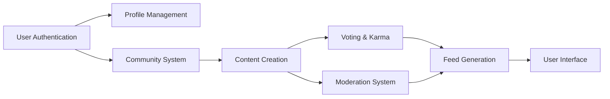
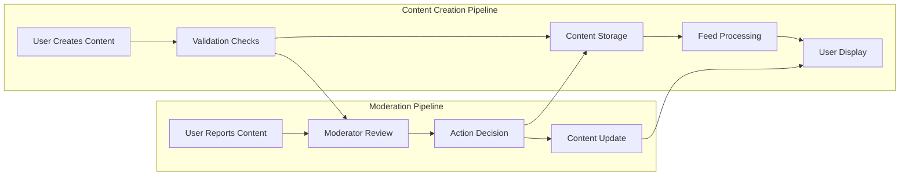

# Reddit-like Community Platform Requirements Specification

## Executive Summary

The Community Platform is a comprehensive Reddit-like discussion system designed to facilitate user-generated content, community building, and social interaction through sophisticated voting and moderation systems. The platform enables users to create communities, publish content, engage in discussions, and build reputation through a karma-based scoring system.

## System Architecture Overview

### Platform Components

The system consists of seven major functional modules that interact to deliver the complete user experience:

### Data Flow Architecture

Content flows through the system in a structured pipeline that ensures consistency and proper moderation:

## User Authentication Requirements

### Registration Process

**Account Creation:**
- WHEN a user attempts to register, THE system SHALL validate email format and uniqueness
- WHEN a user registers, THE system SHALL require a unique username that meets character restrictions (3-20 alphanumeric characters)
- WHEN registration completes, THE system SHALL send email verification before full account activation
- THE system SHALL require password strength of at least 8 characters with mixed case and numbers

**Login and Session Management:**
- WHEN a user logs in with valid credentials, THE system SHALL create a secure session token
- USER sessions SHALL expire after 24 hours of inactivity
- THE system SHALL allow users to log out from all devices simultaneously
- FAILED login attempts SHALL trigger account lockout after 5 consecutive failures

**Account Management:**
- WHEN a user changes their password, THE system SHALL require current password verification
- WHEN a user deletes their account, THE system SHALL remove all associated content and user data within 24 hours
- THE system SHALL provide account recovery options via email verification

## Profile Management System

### Profile Data Structure

**User Profile Components:**
- EACH user profile SHALL contain display name (1-50 characters), bio text (0-500 characters), and avatar image (max 2MB)
- THE system SHALL allow users to edit their own profile information in real-time
- ALL users SHALL be able to view any other user's public profile without authentication requirements

**Profile Page Display:**
- WHEN viewing a user profile, THE system SHALL display:
  - Display name, bio, and avatar prominently
  - Total karma score with visual indicator
  - Complete list of posts created by the user
  - Complete list of comments written by the user
  - Join date and last activity timestamp

### Karma Calculation System

**Karma Scoring Rules:**
- WHEN a user's post receives an upvote, THEIR karma SHALL increase by 1
- WHEN a user's comment receives an upvote, THEIR karma SHALL increase by 1
- WHEN a user's content receives a downvote, THEIR karma SHALL decrease by 1
- Karma scores SHALL be recalculated in real-time when votes change
- Karma SHALL be a single numerical value that can range from -∞ to +∞

**Karma Display Rules:**
- THE system SHALL display karma scores on user profiles and next to usernames
- Karma SHALL be formatted with comma separators for values over 1000
- NEGATIVE karma SHALL be displayed with a distinct visual style

## Community Management Requirements

### Community Creation and Structure

**Community Creation Rules:**
- WHEN an authenticated user creates a community, THE system SHALL require:
  - Unique community name (3-30 alphanumeric characters)
  - Description text (10-500 characters)
  - Community icon image (max 1MB)
- THE creator of a community SHALL become its owner with full administrative rights
- COMMUNITY names SHALL be case-insensitive for uniqueness validation

**Community Discovery:**
- USERS SHALL be able to browse all communities in paginated lists
- THE system SHALL provide search functionality by community name and description
- EACH community listing SHALL display subscriber count, creation date, and brief description

### Subscription System

**Subscription Rules:**
- WHEN a user subscribes to a community, THEY SHALL receive posts from that community in their home feed
- SUBSCRIPTION SHALL be required for creating posts in a community
- USERS SHALL be able to unsubscribe from communities at any time
- THE system SHALL maintain a list of user's subscribed communities for quick access

**Subscription Statistics:**
- COMMUNITY subscriber counts SHALL update in real-time
- THE system SHALL display trending communities based on recent subscription growth
- USERS SHALL see which of their friends are subscribed to each community

## Content Creation and Voting Requirements

### Post Creation and Management

**Post Creation Rules:**
- WHEN a user creates a post, THE system SHALL require:
  - Title (5-300 characters)
  - One of three content types:
    - Text posts: 1-10,000 characters of written content
    - Link posts: Valid URL with domain validation
    - Image posts: Uploaded image file (max 10MB)
- USERS SHALL only create posts in communities they are subscribed to
- POST creation SHALL include community selection from user's subscriptions

**Post Editing and Deletion:**
- USERS SHALL be able to edit their own posts within 24 hours of creation
- POST deletion SHALL remove the post and all associated comments permanently
- EDITED posts SHALL display edit history with timestamps

### Comment System Requirements

**Comment Creation Rules:**
- WHEN a user comments on a post, THE system SHALL require comment text (1-2000 characters)
- COMMENT nesting SHALL support unlimited depth with proper indentation
- USERS SHALL be able to reply to any comment, including their own
- COMMENT editing SHALL be available within 1 hour of creation

**Comment Display and Sorting:**
- COMMENTS SHALL be sortable by:
  - Best: Highest vote score first (default)
  - New: Most recent comments first
  - Controversial: Many votes but score close to zero
- NESTED comments SHALL display with visual hierarchy
- COMMENT collapse/expand functionality SHALL be available for long threads

### Voting System Specifications

**Vote Integrity Rules:**
- EACH user SHALL have exactly one vote per content item (post or comment)
- USERS SHALL be able to change their vote from upvote to downvote or remove it
- VOTE scores SHALL calculate as total upvotes minus total downvotes
- ALL vote changes SHALL immediately update content scores and user karma

**Vote Validation:**
- THE system SHALL prevent self-voting on user's own content
- VOTE operations SHALL be rate-limited to 10 votes per minute per user
- CONCURRENT vote updates SHALL use optimistic locking to prevent conflicts

## Feed Generation System

### Feed Types and Access Control

**Home Feed Rules:**
- WHEN a logged-in user views their home feed, THE system SHALL display posts only from communities they subscribe to
- HOME feed SHALL be unavailable to logged-out users
- THE feed SHALL support all sorting options with user preferences saved

**Popular Feed Rules:**
- THE popular feed SHALL display posts from all communities across the platform
- LOGGED-OUT users SHALL have full access to the popular feed
- POPULAR feed sorting SHALL prioritize engagement metrics over recency

**Community Feed Rules:**
- WHEN viewing a specific community feed, THE system SHALL display only posts from that community
- COMMUNITY feeds SHALL be accessible to all users regardless of subscription status
- COMMUNITY-specific moderation tools SHALL be available to authorized users

### Feed Sorting Algorithms

**Hot Sorting Algorithm:**
- HOT sorting SHALL prioritize recent posts with high engagement using the formula: score = (upvotes - downvotes) / (age_in_hours + 2)^1.8
- POSTS older than 48 hours SHALL receive significantly lower priority

**New Sorting Algorithm:**
- NEW sorting SHALL display posts strictly by creation timestamp (newest first)
- NO engagement metrics SHALL influence the sorting order

**Top Sorting Algorithm:**
- TOP sorting SHALL display highest-scoring posts first
- TIME filters SHALL be available: today, this week, this month, this year, all time
- SCORE calculation SHALL use net votes (upvotes - downvotes)

**Controversial Sorting Algorithm:**
- CONTROVERSIAL sorting SHALL prioritize posts with many votes but scores close to zero
- THE algorithm SHALL use: controversy_score = (upvotes + downvotes) / max(1, abs(upvotes - downvotes))

### Post List Display Specifications

**Post Preview Elements:**
- EACH post in feed lists SHALL display:
  - Title (truncated to 100 characters if necessary)
  - Author username with karma badge
  - Community name with link
  - Vote score with visual indicators
  - Comment count
  - Relative timestamp (e.g., "3 hours ago")
  - Content preview based on post type:
    - Text posts: First 200 characters of content
    - Image posts: Thumbnail (100x100px)
    - Link posts: Domain name extracted from URL

**Pagination Requirements:**
- ALL feeds SHALL support pagination with 25 items per page
- INFINITE scroll SHALL be available as an alternative to traditional pagination
- LOAD more functionality SHALL provide smooth user experience

## Moderation and Reporting System

### Moderator Hierarchy and Permissions

**Moderator Role Definitions:**
- COMMUNITY owners SHALL have ultimate authority over all community operations
- OWNERS SHALL be able to appoint moderators from community subscribers
- MODERATORS SHALL have permissions to manage content and users within their community
- MODERATOR appointments SHALL require owner approval for the first 30 days

**Moderation Action Rules:**
- WHEN a moderator deletes content, THE system SHALL:
  - Remove the content immediately
  - Notify the content author with reason
  - Log the action for audit purposes
- WHEN a moderator bans a user, THE banned user SHALL:
  - Lose posting and commenting privileges in that community
  - Retain ability to view community content
  - Receive notification of ban duration and reason

### Reporting Workflow

**Report Creation Process:**
- WHEN a user reports content, THE system SHALL require:
  - Selection from predefined report categories
  - Optional detailed reason text (0-500 characters)
  - Confirmation of report submission
- REPORTS SHALL be anonymous to other users but visible to moderators

**Report Review and Resolution:**
- MODERATORS SHALL see all pending reports for their communities
- EACH report SHALL display:
  - Reported content with context
  - Reporting user (anonymous to other users)
  - Report reason and timestamp
  - Previous report history for the same content
- MODERATORS SHALL be able to:
  - Approve report (delete content and notify reporter)
  - Dismiss report (keep content and notify reporter)
  - Escalate to platform administrators for severe violations

## Performance and Security Requirements

### Response Time Standards

**User Experience Thresholds:**
- PAGE loads SHALL complete within 2 seconds for 95% of requests
- VOTE actions SHALL register and display updated scores within 500 milliseconds
- COMMENT posting SHALL show the new comment within 1 second
- FEED generation SHALL complete within 3 seconds even with large datasets

**Scalability Benchmarks:**
- THE system SHALL support 10,000 concurrent users
- CONTENT storage SHALL scale to handle 1 million posts and 10 million comments
- VOTE processing SHALL handle 1,000 votes per second peak load

### Security Implementation Requirements

**Data Protection:**
- USER passwords SHALL be hashed using bcrypt with work factor 12
- SESSION tokens SHALL use JWT with 256-bit encryption
- API endpoints SHALL require authentication for sensitive operations
- CROSS-SITE request forgery protection SHALL be implemented

**Content Security:**
- USER-GENERATED content SHALL be sanitized to prevent XSS attacks
- IMAGE uploads SHALL be scanned for malicious content
- URL validation SHALL prevent phishing and malicious link posting
- FILE upload size limits SHALL be enforced server-side

## Error Handling and Edge Cases

### System Failure Scenarios

**Graceful Degradation:**
- IF the voting system becomes unavailable, THE interface SHALL disable voting but maintain content viewing
- IF image processing fails, THE system SHALL display placeholder content with error messaging
- IF database connections are exhausted, THE system SHALL queue requests with user notification

**Data Recovery Procedures:**
- THE system SHALL maintain transaction logs for vote and karma operations
- CONTENT deletion SHALL be reversible by moderators for a 24-hour window
- SYSTEM backups SHALL occur daily with point-in-time recovery capability

### Business Logic Edge Cases

**Content Ownership Transfers:**
- IF a community owner deletes their account, OWNERSHIP SHALL transfer to the most active moderator
- IF no moderators exist, THE community SHALL enter read-only mode until admin intervention
- OWNERSHIP transfer SHALL require email confirmation from the new owner

**Voting Anomalies:**
- IF a user votes on content that is subsequently deleted, THE vote SHALL be removed without karma impact
- IF concurrent votes occur, THE system SHALL use last-write-wins with conflict resolution
- VOTE fraud detection SHALL monitor for suspicious patterns and apply corrections

### User Experience Edge Cases

**Empty State Handling:**
- WHEN a user has no subscriptions, THE home feed SHALL display community recommendations
- WHEN a community has no posts, THE feed SHALL show encouragement to create content
- WHEN search returns no results, THE system SHALL suggest alternative search terms

**Content Moderation Edge Cases:**
- IF a moderator is reported, THE system SHALL escalate to platform administrators
- IF conflicting reports occur, THE system SHALL use majority consensus for resolution
- REPEAT offenders SHALL receive progressive restrictions on platform access

## Integration and Compliance Requirements

### Legal Compliance

**Content Moderation Compliance:**
- THE system SHALL maintain audit logs of all moderation actions for 90 days
- CONTENT removal SHALL preserve evidence for legal requirements
- USER data access requests SHALL be processed within 30 days as per GDPR

**Data Retention Policies:**
- DELETED user accounts SHALL have all personal data removed within 30 days
- CONTENT deletion SHALL be comprehensive across all system copies
- BACKUP retention SHALL comply with data protection regulations

### Third-Party Integrations

**Email Service Requirements:**
- THE system SHALL integrate with SMTP services for user notifications
- EMAIL delivery failures SHALL not block user registration or content posting
- TRANSACTIONAL email templates SHALL be customizable

**Media Processing Services:**
- IMAGE uploads SHALL use cloud storage with CDN distribution
- THUMBNAIL generation SHALL occur asynchronously to prevent upload delays
- VIDEO processing SHALL be supported for future feature expansion

## Success Metrics and Monitoring

### Key Performance Indicators

**User Engagement Metrics:**
- DAILY active users and average session duration
- CONTENT creation rate and voting participation percentage
- COMMUNITY growth rate and subscription trends
- USER retention rates by cohort analysis

**System Health Metrics:**
- RESPONSE time percentiles (p50, p95, p99)
- DATABASE performance and connection utilization
- CACHE hit ratios and storage efficiency
- ERROR rates and system availability

### Operational Monitoring

**Real-time Alerts:**
- SYSTEM SHALL monitor for unusual voting patterns indicating manipulation
- PERFORMANCE degradation SHALL trigger immediate investigation
- CONTENT reporting spikes SHALL alert moderators to potential issues
- SECURITY incidents SHALL generate immediate alerts to administrators

**Business Intelligence:**
- THE system SHALL track feature usage to guide development priorities
- USER feedback SHALL be systematically collected and analyzed
- A/B testing framework SHALL be implemented for feature validation
- COMPETITIVE analysis SHALL inform platform evolution strategies

---

*This requirements specification document provides comprehensive business requirements for the Reddit-like community platform. All technical implementations including database schemas, API specifications, and architectural decisions will be developed in subsequent phases based on these business requirements.*