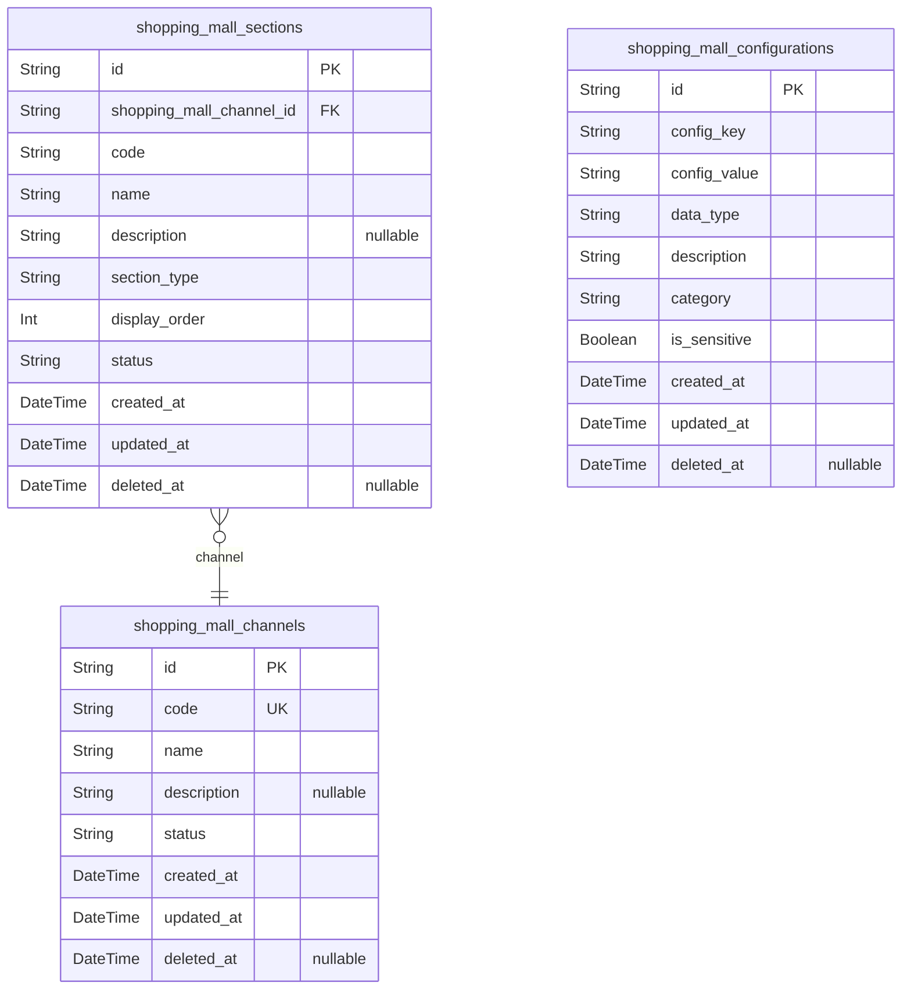
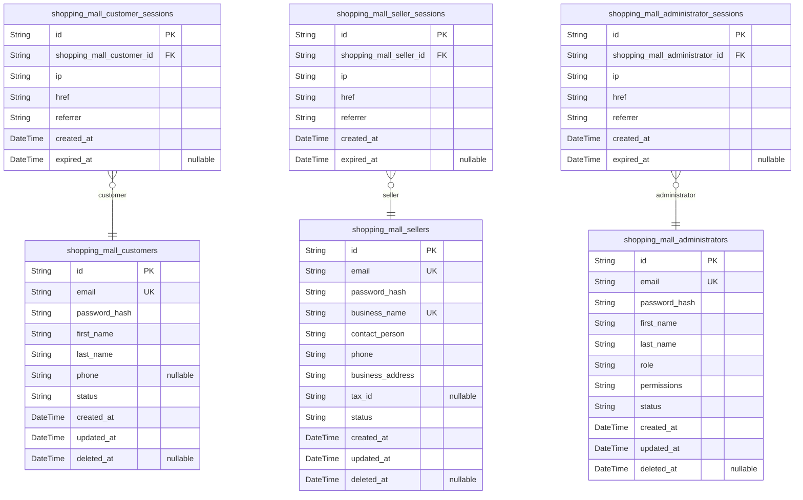
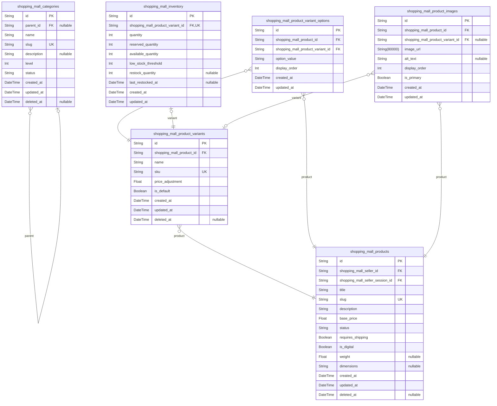
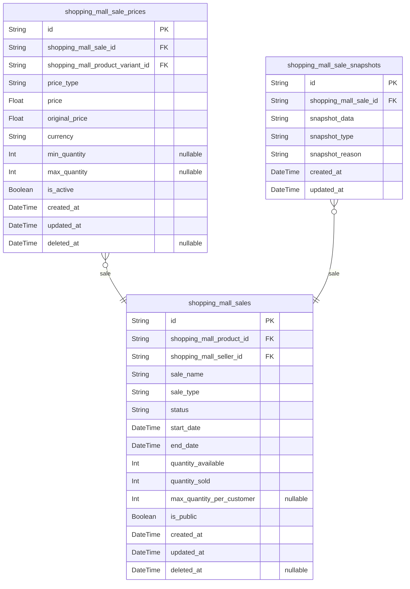
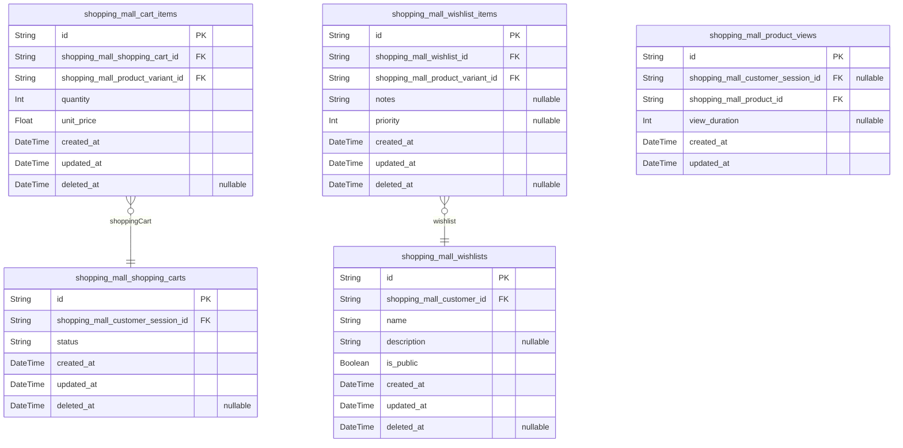
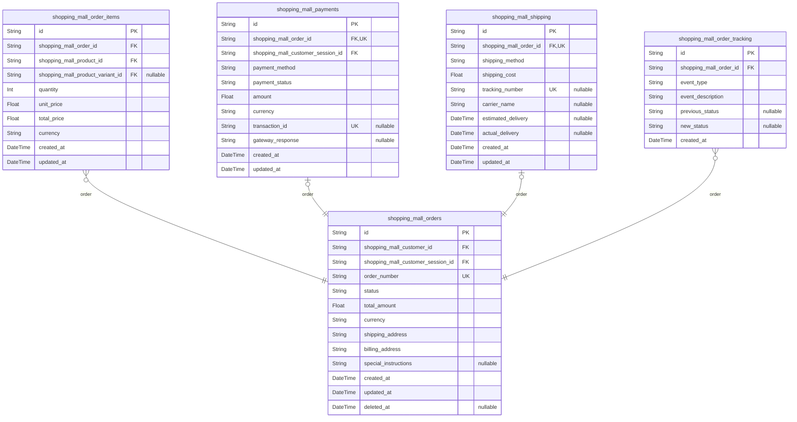
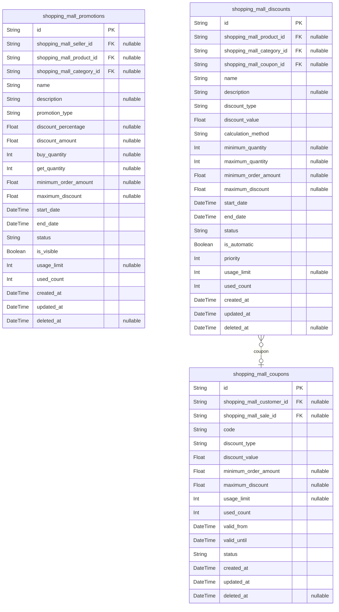
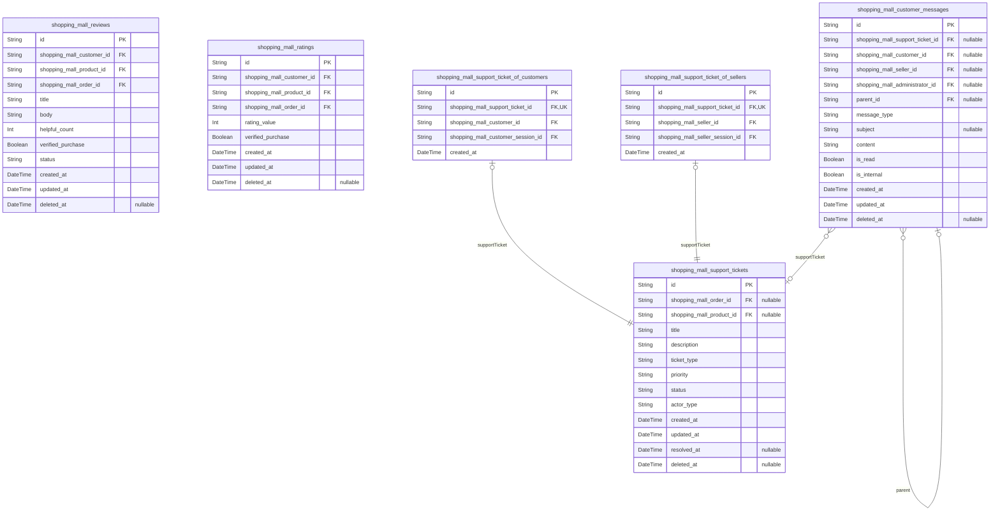
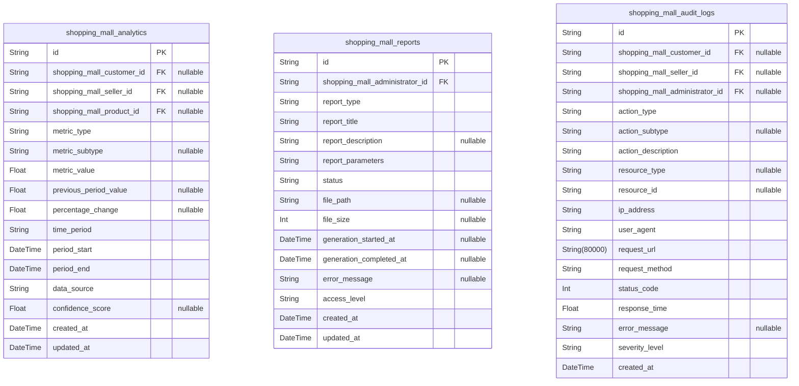

# Prisma Markdown

> Generated by [`prisma-markdown`](https://github.com/samchon/prisma-markdown)

- [Systematic](#systematic)
- [Actors](#actors)
- [Products](#products)
- [Sales](#sales)
- [Shopping](#shopping)
- [Orders](#orders)
- [Promotions](#promotions)
- [Communication](#communication)
- [Administrative](#administrative)

## Systematic

### `shopping_mall_channels`

Represents different shopping channels within the e-commerce platform.
Channels can be used to organize different shopping experiences such as
main store, outlet section, seasonal promotions, or specialized
marketplaces. Each channel has its own configuration and section
organization. Channels serve as the top-level organizational structure
for the shopping experience.

Properties as follows:

- `id`: Primary Key.
- `code`
  > Unique channel identifier code used for system references and URL
  > routing. Must be URL-safe and unique across the platform.
- `name`
  > Display name of the channel shown to users and administrators. Used for
  > navigation and display purposes.
- `description`
  > Detailed description explaining the channel's purpose, target audience,
  > and business context.
- `status`
  > Current operational status of the channel: active (available to users),
  > inactive (hidden but maintained), or maintenance (temporarily
  > unavailable).
- `created_at`: Timestamp when the channel was created.
- `updated_at`: Timestamp when the channel was last updated.
- `deleted_at`
  > Timestamp when the channel was soft deleted, if applicable. Allows for
  > recovery of accidentally deleted channels.

### `shopping_mall_sections`

Organizes content within shopping channels. Sections represent logical
groupings of products or content within a channel, such as featured
products, new arrivals, or category-based sections. Sections enable
hierarchical organization and targeted content presentation.

Properties as follows:

- `id`: Primary Key.
- `shopping_mall_channel_id`
  > Parent channel that contains this section. Each section belongs to
  > exactly one channel. [shopping_mall_channels.id](#shopping_mall_channels)
- `code`
  > Unique section identifier code within the parent channel. Used for system
  > references and URL routing. Must be unique within each channel.
- `name`
  > Display name of the section shown to users. Used for navigation and
  > display within the channel.
- `description`
  > Detailed description of the section's content, purpose, and target
  > audience.
- `section_type`
  > Type of section: featured (highlighted content), category (product
  > category based), promotional (sales and offers), or custom (user-defined
  > organization).
- `display_order`
  > Numerical order for section display sequence within the channel. Lower
  > numbers appear first. Used to control section presentation order.
- `status`
  > Current status of the section: active (visible to users), inactive
  > (hidden but maintained), or hidden (completely removed from display).
- `created_at`: Timestamp when the section was created.
- `updated_at`: Timestamp when the section was last updated.
- `deleted_at`: Timestamp when the section was soft deleted, if applicable.

### `shopping_mall_configurations`

Stores system-wide configuration settings and platform parameters. These
configurations control platform behavior, feature toggles, and
operational parameters. Configurations are managed by administrators and
affect global platform functionality.

Properties as follows:

- `id`: Primary Key.
- `config_key`
  > Unique configuration key used to reference the setting in code. Follows
  > dot notation for hierarchical organization (e.g.,
  > 'payment.stripe.api_key').
- `config_value`
  > Configuration value stored as string, to be parsed based on context.
  > Supports various data types through proper parsing logic.
- `data_type`
  > Data type of the configuration value: string, number, boolean, json,
  > array, or object. Guides proper value parsing and validation.
- `description`
  > Human-readable description of what this configuration controls, its
  > purpose, and any constraints or dependencies.
- `category`
  > Category grouping for related configurations: payment, shipping, ui,
  > security, notifications, analytics, etc.
- `is_sensitive`
  > Indicates whether this configuration contains sensitive data that
  > requires encryption and access control protection.
- `created_at`: Timestamp when the configuration was created.
- `updated_at`: Timestamp when the configuration was last updated.
- `deleted_at`: Timestamp when the configuration was soft deleted, if applicable.

## Actors

### `shopping_mall_customers`

Customer information for the shopping mall platform. Customers can browse
products, make purchases, and manage their shopping experience.

Properties as follows:

- `id`: Primary Key.
- `email`
  > Customer's email address for authentication and notifications. Must be
  > unique across the platform.
- `password_hash`: Hashed password for customer authentication. Never stored in plain text.
- `first_name`: Customer's first name for personalization and order processing.
- `last_name`: Customer's last name for personalization and order processing.
- `phone`: Customer's phone number for order notifications and support contact.
- `status`: Customer account status: active, suspended, or deleted.
- `created_at`: Timestamp when the customer account was created.
- `updated_at`: Timestamp when the customer account was last updated.
- `deleted_at`: Timestamp when the customer account was soft deleted.

### `shopping_mall_customer_sessions`

Customer authentication sessions for tracking login activity and
security. Each session represents a customer's authenticated connection
to the platform.

Properties as follows:

- `id`: Primary Key.
- `shopping_mall_customer_id`: Customer's session reference. [shopping_mall_customers.id](#shopping_mall_customers)
- `ip`: IP address from which the customer connected.
- `href`: Connection URL where the customer logged in.
- `referrer`: Referrer URL that directed the customer to the platform.
- `created_at`: Timestamp when the session was created.
- `expired_at`: Timestamp when the session expired or was manually terminated.

### `shopping_mall_sellers`

Seller accounts for merchants who sell products on the platform. Sellers
manage their product catalog, inventory, and order fulfillment.

Properties as follows:

- `id`: Primary Key.
- `email`: Seller's email address for authentication and business communications.
- `password_hash`: Hashed password for seller authentication. Never stored in plain text.
- `business_name`: Legal business name of the seller for verification and display.
- `contact_person`: Primary contact person for the seller business.
- `phone`: Business phone number for customer support and platform communications.
- `business_address`: Physical business address for verification and shipping purposes.
- `tax_id`: Tax identification number for business compliance.
- `status`: Seller account status: pending, approved, suspended, or rejected.
- `created_at`: Timestamp when the seller account was created.
- `updated_at`: Timestamp when the seller account was last updated.
- `deleted_at`: Timestamp when the seller account was soft deleted.

### `shopping_mall_seller_sessions`

Seller authentication sessions for tracking login activity and security.
Each session represents a seller's authenticated connection to the
platform.

Properties as follows:

- `id`: Primary Key.
- `shopping_mall_seller_id`: Seller's session reference. [shopping_mall_sellers.id](#shopping_mall_sellers)
- `ip`: IP address from which the seller connected.
- `href`: Connection URL where the seller logged in.
- `referrer`: Referrer URL that directed the seller to the platform.
- `created_at`: Timestamp when the session was created.
- `expired_at`: Timestamp when the session expired or was manually terminated.

### `shopping_mall_administrators`

Administrator accounts for platform management and oversight.
Administrators have full system access to manage users, products, orders,
and platform configuration.

Properties as follows:

- `id`: Primary Key.
- `email`: Administrator's email address for authentication and system notifications.
- `password_hash`
  > Hashed password for administrator authentication. Never stored in plain
  > text.
- `first_name`: Administrator's first name for identification and audit trails.
- `last_name`: Administrator's last name for identification and audit trails.
- `role`: Administrator role level: super_admin, admin, or support.
- `permissions`: JSON string containing specific permissions granted to the administrator.
- `status`: Administrator account status: active or suspended.
- `created_at`: Timestamp when the administrator account was created.
- `updated_at`: Timestamp when the administrator account was last updated.
- `deleted_at`: Timestamp when the administrator account was soft deleted.

### `shopping_mall_administrator_sessions`

Administrator authentication sessions for tracking login activity and
security. Each session represents an administrator's authenticated
connection to the platform.

Properties as follows:

- `id`: Primary Key.
- `shopping_mall_administrator_id`: Administrator's session reference. [shopping_mall_administrators.id](#shopping_mall_administrators)
- `ip`: IP address from which the administrator connected.
- `href`: Connection URL where the administrator logged in.
- `referrer`: Referrer URL that directed the administrator to the platform.
- `created_at`: Timestamp when the session was created.
- `expired_at`: Timestamp when the session expired or was manually terminated.

## Products

### `shopping_mall_categories`

Hierarchical product category structure for organizing products.
Categories support up to 3 levels of nesting for detailed product
classification. Each category can have multiple products assigned to it,
and products can belong to multiple categories.

Properties as follows:

- `id`: Primary Key.
- `parent_id`
  > Parent category reference for hierarchical structure. {@link
  > shopping_mall_categories.id}
- `name`: Category name for display and navigation.
- `slug`: URL-friendly category identifier for SEO optimization.
- `description`: Detailed category description for customer information.
- `level`: Hierarchy level (1 for root, 2 for subcategory, 3 for sub-subcategory).
- `status`: Category status: active, inactive, or archived.
- `created_at`: Timestamp when category was created.
- `updated_at`: Timestamp when category was last updated.
- `deleted_at`: Timestamp when category was soft deleted.

### `shopping_mall_products`

Core product information including titles, descriptions, and base
pricing. Products are created by sellers and organized into categories.
Each product can have multiple variants, images, and inventory records.

Properties as follows:

- `id`: Primary Key.
- `shopping_mall_seller_id`: Seller who owns and manages this product. [shopping_mall_sellers.id](#shopping_mall_sellers)
- `shopping_mall_seller_session_id`
  > Seller session when product was created or modified. {@link
  > shopping_mall_seller_sessions.id}
- `title`: Product title for display and search optimization.
- `slug`: URL-friendly product identifier for SEO.
- `description`: Detailed product description with features and specifications.
- `base_price`: Base product price before discounts and variant pricing.
- `status`: Product status: draft, published, unpublished, or discontinued.
- `requires_shipping`: Whether this product requires physical shipping.
- `is_digital`: Whether this is a digital product (downloadable).
- `weight`: Product weight in kilograms for shipping calculations.
- `dimensions`: Product dimensions (LxWxH) for shipping calculations.
- `created_at`: Timestamp when product was created.
- `updated_at`: Timestamp when product was last updated.
- `deleted_at`: Timestamp when product was soft deleted.

### `shopping_mall_product_variants`

Product variant definitions for different options like color, size,
material, etc. Each variant represents a distinct version of a product
with its own SKU and pricing.

Properties as follows:

- `id`: Primary Key.
- `shopping_mall_product_id`
  > Parent product that this variant belongs to. {@link
  > shopping_mall_products.id}
- `name`: Variant name for display (e.g., 'Red', 'Large', 'Premium').
- `sku`: Stock Keeping Unit identifier for inventory tracking.
- `price_adjustment`: Price difference from base product price.
- `is_default`: Whether this is the default variant for the product.
- `created_at`: Timestamp when variant was created.
- `updated_at`: Timestamp when variant was last updated.
- `deleted_at`: Timestamp when variant was soft deleted.

### `shopping_mall_product_variant_options`

Junction table for managing variant combinations and their relationships.
Links products to their available variant options and defines valid
combinations.

Properties as follows:

- `id`: Primary Key.
- `shopping_mall_product_id`
  > Product that this variant option belongs to. {@link
  > shopping_mall_products.id}
- `shopping_mall_product_variant_id`: Variant option definition. [shopping_mall_product_variants.id](#shopping_mall_product_variants)
- `option_value`: Specific value for this variant option (e.g., '#FF0000' for color).
- `display_order`: Order in which options should be displayed to customers.
- `created_at`: Timestamp when option was created.
- `updated_at`: Timestamp when option was last updated.

### `shopping_mall_inventory`

Real-time inventory tracking for product variants. Maintains stock
levels, tracks inventory movements, and provides low stock alerts for
sellers.

Properties as follows:

- `id`: Primary Key.
- `shopping_mall_product_variant_id`
  > Variant being tracked for inventory. {@link
  > shopping_mall_product_variants.id}
- `quantity`: Current available stock quantity.
- `reserved_quantity`: Quantity reserved for pending orders.
- `available_quantity`: Calculated available quantity (quantity - reserved).
- `low_stock_threshold`: Threshold for low stock alerts.
- `restock_quantity`: Target quantity for restocking operations.
- `last_restocked_at`: Timestamp when inventory was last restocked.
- `created_at`: Timestamp when inventory record was created.
- `updated_at`: Timestamp when inventory was last updated.

### `shopping_mall_product_images`

Product image management for visual product representation. Supports
multiple images per product with ordering and variant-specific image
associations.

Properties as follows:

- `id`: Primary Key.
- `shopping_mall_product_id`: Product that this image belongs to. [shopping_mall_products.id](#shopping_mall_products)
- `shopping_mall_product_variant_id`
  > Variant-specific image association. {@link
  > shopping_mall_product_variants.id}
- `image_url`: URL to the product image stored in cloud storage.
- `alt_text`: Alternative text for accessibility and SEO.
- `display_order`: Order in which images should be displayed.
- `is_primary`: Whether this is the primary image for the product.
- `created_at`: Timestamp when image was uploaded.
- `updated_at`: Timestamp when image was last updated.

## Sales

### `shopping_mall_sales`

Main sales entity representing product sales offerings between sellers
and products. Each sale record captures the commercial offering including
pricing, availability, and temporal constraints. Sales serve as the
bridge between product catalog and customer purchasing systems. {@link
shopping_mall_products.id}, [shopping_mall_sellers.id](#shopping_mall_sellers)

Properties as follows:

- `id`: Primary Key.
- `shopping_mall_product_id`
  > Reference to the product being offered in this sale. {@link
  > shopping_mall_products.id}
- `shopping_mall_seller_id`
  > Reference to the seller offering this sale. {@link
  > shopping_mall_sellers.id}
- `sale_name`: Descriptive name of the sale for display and identification.
- `sale_type`: Type of sale (flash_sale, seasonal, clearance, promotional).
- `status`: Current status of the sale (active, inactive, expired, cancelled).
- `start_date`: Date and time when the sale becomes active.
- `end_date`: Date and time when the sale expires.
- `quantity_available`: Maximum quantity available for this sale across all customers.
- `quantity_sold`: Current quantity sold during this sale across all customers.
- `max_quantity_per_customer`: Maximum quantity a single customer can purchase during this sale.
- `is_public`: Whether this sale is publicly visible to all customers.
- `created_at`: Timestamp when the sale was created.
- `updated_at`: Timestamp when the sale was last updated.
- `deleted_at`: Timestamp when the sale was soft deleted.

### `shopping_mall_sale_prices`

Price configurations for sales, supporting multiple pricing strategies
including tiered pricing, promotional pricing, and variant-specific
pricing. Each record represents a specific price point that can be
applied during a sale period. [shopping_mall_sales.id](#shopping_mall_sales), {@link
shopping_mall_product_variants.id}

Properties as follows:

- `id`: Primary Key.
- `shopping_mall_sale_id`: Reference to the parent sale. [shopping_mall_sales.id](#shopping_mall_sales)
- `shopping_mall_product_variant_id`
  > Reference to specific product variant for variant pricing. {@link
  > shopping_mall_product_variants.id}
- `price_type`: Type of pricing (base, tiered, promotional, variant).
- `price`: Sale price amount.
- `original_price`: Original price before sale discount.
- `currency`: Currency code for the price (USD, EUR, etc.).
- `min_quantity`: Minimum quantity for tiered pricing.
- `max_quantity`: Maximum quantity for tiered pricing.
- `is_active`: Whether this price configuration is currently active.
- `created_at`: Timestamp when the price was set.
- `updated_at`: Timestamp when the price was last updated.
- `deleted_at`: Timestamp when the price record was soft deleted.

### `shopping_mall_sale_snapshots`

Historical snapshots of sales data for audit trails and analytics. Each
snapshot captures the complete state of a sale at a specific point in
time, enabling historical analysis and change tracking. Includes both
sale configuration and pricing information. {@link
shopping_mall_sales.id}

Properties as follows:

- `id`: Primary Key.
- `shopping_mall_sale_id`: Reference to the parent sale. [shopping_mall_sales.id](#shopping_mall_sales)
- `snapshot_data`
  > JSON representation of the complete sale state including pricing
  > configurations.
- `snapshot_type`: Type of snapshot (price_change, status_change, inventory_update, audit).
- `snapshot_reason`: Reason for creating the snapshot.
- `created_at`: Timestamp when the snapshot was created.
- `updated_at`: Timestamp when the snapshot was last updated (for corrections).

## Shopping

### `shopping_mall_shopping_carts`

Shopping carts for customers to temporarily store products before
purchase. Each cart is associated with a customer session and can contain
multiple items. Carts persist for 30 days to support returning customers.

Properties as follows:

- `id`: Primary Key.
- `shopping_mall_customer_session_id`
  > Customer session that owns this shopping cart. {@link
  > shopping_mall_customer_sessions.id}
- `status`: Current status of the shopping cart (active, abandoned, converted).
- `created_at`: When the shopping cart was created.
- `updated_at`: When the shopping cart was last updated.
- `deleted_at`: When the shopping cart was soft deleted (abandoned or converted to order).

### `shopping_mall_cart_items`

Individual items within shopping carts. Each item represents a product
variant with specific quantity selected by the customer. Cart items are
managed through parent cart operations.

Properties as follows:

- `id`: Primary Key.
- `shopping_mall_shopping_cart_id`
  > Parent shopping cart containing this item. {@link
  > shopping_mall_shopping_carts.id}
- `shopping_mall_product_variant_id`
  > Product variant selected by the customer. {@link
  > shopping_mall_product_variants.id}
- `quantity`: Number of units of this product variant added to cart.
- `unit_price`: Price per unit at the time of adding to cart.
- `created_at`: When the item was added to the shopping cart.
- `updated_at`: When the cart item was last updated.
- `deleted_at`: When the cart item was removed from the shopping cart.

### `shopping_mall_wishlists`

Customer wishlists for saving products of interest for future purchase.
Wishlists can be shared or kept private, and support organizing products
into multiple lists.

Properties as follows:

- `id`: Primary Key.
- `shopping_mall_customer_id`: Customer who owns this wishlist. [shopping_mall_customers.id](#shopping_mall_customers)
- `name`: Name of the wishlist for customer organization.
- `description`: Optional description of the wishlist purpose.
- `is_public`: Whether the wishlist is publicly visible or private.
- `created_at`: When the wishlist was created.
- `updated_at`: When the wishlist was last updated.
- `deleted_at`: When the wishlist was deleted by the customer.

### `shopping_mall_wishlist_items`

Individual products saved within customer wishlists. Each item represents
a product variant that the customer wants to track for potential future
purchase.

Properties as follows:

- `id`: Primary Key.
- `shopping_mall_wishlist_id`: Parent wishlist containing this item. [shopping_mall_wishlists.id](#shopping_mall_wishlists)
- `shopping_mall_product_variant_id`
  > Product variant saved to the wishlist. {@link
  > shopping_mall_product_variants.id}
- `notes`: Optional customer notes about why this product was saved.
- `priority`: Customer-assigned priority level for wishlist items (1-10).
- `created_at`: When the item was added to the wishlist.
- `updated_at`: When the wishlist item was last updated.
- `deleted_at`: When the item was removed from the wishlist.

### `shopping_mall_product_views`

Tracking system for product view analytics. Records each time a customer
views a product detail page for analytics and recommendation purposes.

Properties as follows:

- `id`: Primary Key.
- `shopping_mall_customer_session_id`
  > Customer session that viewed the product. {@link
  > shopping_mall_customer_sessions.id}
- `shopping_mall_product_id`: Product that was viewed. [shopping_mall_products.id](#shopping_mall_products)
- `view_duration`: Duration of the product view in seconds for engagement analytics.
- `created_at`: When the product view occurred.
- `updated_at`: When the product view record was last updated.

## Orders

### `shopping_mall_orders`

Core order entity representing customer purchases. Contains order
metadata, customer information, and order status tracking. Each order
represents a complete transaction from placement to fulfillment.

Properties as follows:

- `id`: Primary Key.
- `shopping_mall_customer_id`: Customer who placed the order. [shopping_mall_customers.id](#shopping_mall_customers)
- `shopping_mall_customer_session_id`
  > Session context when order was placed. {@link
  > shopping_mall_customer_sessions.id}
- `order_number`: Unique order identifier for customer reference.
- `status`
  > Current order status (pending, confirmed, processing, shipped, delivered,
  > cancelled, refunded).
- `total_amount`: Total order amount including products, shipping, and taxes.
- `currency`: Currency code for the order transaction.
- `shipping_address`: Complete shipping address for order delivery.
- `billing_address`: Billing address for payment processing.
- `special_instructions`: Customer instructions for order handling.
- `created_at`: Order creation timestamp.
- `updated_at`: Last order update timestamp.
- `deleted_at`: Soft delete timestamp for order cancellation.

### `shopping_mall_order_items`

Individual items within an order. Links products and variants to orders
with specific quantities and pricing at time of purchase.

Properties as follows:

- `id`: Primary Key.
- `shopping_mall_order_id`: Parent order containing this item. [shopping_mall_orders.id](#shopping_mall_orders)
- `shopping_mall_product_id`: Product purchased in this order item. [shopping_mall_products.id](#shopping_mall_products)
- `shopping_mall_product_variant_id`
  > Specific product variant purchased. {@link
  > shopping_mall_product_variants.id}
- `quantity`: Quantity of the product variant ordered.
- `unit_price`: Price per unit at time of order placement.
- `total_price`: Total price for this line item (quantity × unit_price).
- `currency`: Currency code matching the parent order.
- `created_at`: Order item creation timestamp.
- `updated_at`: Last order item update timestamp.

### `shopping_mall_payments`

Payment transactions associated with orders. Tracks payment methods,
amounts, status, and processing details.

Properties as follows:

- `id`: Primary Key.
- `shopping_mall_order_id`: Order being paid. [shopping_mall_orders.id](#shopping_mall_orders)
- `shopping_mall_customer_session_id`
  > Session context during payment processing. {@link
  > shopping_mall_customer_sessions.id}
- `payment_method`
  > Payment method used (credit_card, paypal, bank_transfer,
  > cash_on_delivery).
- `payment_status`: Current payment status (pending, authorized, completed, failed, refunded).
- `amount`: Payment amount processed.
- `currency`: Currency code for the payment.
- `transaction_id`: External payment gateway transaction identifier.
- `gateway_response`: Raw response from payment gateway for debugging.
- `created_at`: Payment creation timestamp.
- `updated_at`: Last payment update timestamp.

### `shopping_mall_shipping`

Shipping information and carrier details for order fulfillment. Tracks
shipping methods, costs, and delivery estimates.

Properties as follows:

- `id`: Primary Key.
- `shopping_mall_order_id`: Order being shipped. [shopping_mall_orders.id](#shopping_mall_orders)
- `shipping_method`: Shipping carrier and service level (standard, express, overnight).
- `shipping_cost`: Cost of shipping for this order.
- `tracking_number`: Carrier tracking number for package tracking.
- `carrier_name`: Name of shipping carrier (FedEx, UPS, DHL, etc.).
- `estimated_delivery`: Estimated delivery date provided by carrier.
- `actual_delivery`: Actual delivery timestamp when package is delivered.
- `created_at`: Shipping record creation timestamp.
- `updated_at`: Last shipping update timestamp.

### `shopping_mall_order_tracking`

Historical tracking events for order lifecycle. Captures status changes,
payment events, and shipping updates for audit trail.

Properties as follows:

- `id`: Primary Key.
- `shopping_mall_order_id`: Order being tracked. [shopping_mall_orders.id](#shopping_mall_orders)
- `event_type`
  > Type of tracking event (status_change, payment_processed,
  > shipping_update, etc.).
- `event_description`: Detailed description of the tracking event.
- `previous_status`: Order status before this event occurred.
- `new_status`: Order status after this event occurred.
- `created_at`: Tracking event creation timestamp.

## Promotions

### `shopping_mall_coupons`

Coupon codes that customers can apply to their orders for discounts.
Coupons can be general or customer-specific with usage limits and
expiration dates.

Properties as follows:

- `id`: Primary Key.
- `shopping_mall_customer_id`: Optional customer who owns this coupon. [shopping_mall_customers.id](#shopping_mall_customers)
- `shopping_mall_sale_id`
  > Optional sale this coupon is associated with. {@link
  > shopping_mall_sales.id}
- `code`: Unique coupon code that customers enter during checkout.
- `discount_type`: Type of discount: percentage or fixed_amount.
- `discount_value`: Value of the discount based on discount_type.
- `minimum_order_amount`: Minimum order amount required to use this coupon.
- `maximum_discount`: Maximum discount amount for percentage-based coupons.
- `usage_limit`: Maximum number of times this coupon can be used.
- `used_count`: Number of times this coupon has been used.
- `valid_from`: Date and time when the coupon becomes valid.
- `valid_until`: Date and time when the coupon expires.
- `status`: Coupon status: active, expired, cancelled, or used_up.
- `created_at`: When this coupon was created.
- `updated_at`: When this coupon was last updated.
- `deleted_at`: When this coupon was soft deleted.

### `shopping_mall_promotions`

Marketing promotions and campaigns that can include discounts, special
offers, or bundled products. Promotions can be targeted to specific
customers, products, or categories.

Properties as follows:

- `id`: Primary Key.
- `shopping_mall_seller_id`
  > Optional seller who created this promotion. {@link
  > shopping_mall_sellers.id}
- `shopping_mall_product_id`
  > Optional product this promotion applies to. {@link
  > shopping_mall_products.id}
- `shopping_mall_category_id`
  > Optional category this promotion applies to. {@link
  > shopping_mall_categories.id}
- `name`: Name of the promotion for administrative purposes.
- `description`: Detailed description of the promotion for customers.
- `promotion_type`: Type of promotion: discount, bundle, buy_x_get_y, free_shipping, etc.
- `discount_percentage`: Percentage discount for discount-type promotions.
- `discount_amount`: Fixed amount discount for discount-type promotions.
- `buy_quantity`: Buy quantity for buy_x_get_y promotions.
- `get_quantity`: Get quantity for buy_x_get_y promotions.
- `minimum_order_amount`: Minimum order amount required for the promotion.
- `maximum_discount`: Maximum discount amount for percentage-based promotions.
- `start_date`: When the promotion becomes active.
- `end_date`: When the promotion expires.
- `status`: Promotion status: draft, active, paused, expired, or cancelled.
- `is_visible`: Whether the promotion is visible to customers.
- `usage_limit`: Maximum number of times this promotion can be used.
- `used_count`: Number of times this promotion has been used.
- `created_at`: When this promotion was created.
- `updated_at`: When this promotion was last updated.
- `deleted_at`: When this promotion was soft deleted.

### `shopping_mall_discounts`

Discount rules that can be applied to products, categories, or orders.
Discounts can be automatic or require coupon codes, with various
calculation methods.

Properties as follows:

- `id`: Primary Key.
- `shopping_mall_product_id`
  > Optional product this discount applies to. {@link
  > shopping_mall_products.id}
- `shopping_mall_category_id`
  > Optional category this discount applies to. {@link
  > shopping_mall_categories.id}
- `shopping_mall_coupon_id`
  > Optional coupon required to activate this discount. {@link
  > shopping_mall_coupons.id}
- `name`: Name of the discount rule for administrative purposes.
- `description`: Description of the discount rule.
- `discount_type`: Type of discount: percentage, fixed_amount, buy_x_get_y, etc.
- `discount_value`: Value of the discount based on discount_type.
- `calculation_method`: How the discount is calculated: pre_tax, post_tax, etc.
- `minimum_quantity`: Minimum quantity required for the discount to apply.
- `maximum_quantity`: Maximum quantity the discount applies to.
- `minimum_order_amount`: Minimum order amount required for the discount.
- `maximum_discount`: Maximum discount amount for percentage-based discounts.
- `start_date`: When the discount becomes active.
- `end_date`: When the discount expires.
- `status`: Discount status: active, inactive, expired, or cancelled.
- `is_automatic`: Whether the discount applies automatically or requires a coupon.
- `priority`: Priority level for discount application order.
- `usage_limit`: Maximum number of times this discount can be used.
- `used_count`: Number of times this discount has been used.
- `created_at`: When this discount was created.
- `updated_at`: When this discount was last updated.
- `deleted_at`: When this discount was soft deleted.

## Communication

### `shopping_mall_reviews`

Customer product reviews submitted after purchase. Each review represents
a customer's detailed feedback about a purchased product, including
written commentary and overall satisfaction assessment. Reviews require
purchase verification to ensure authenticity.

Properties as follows:

- `id`: Primary Key.
- `shopping_mall_customer_id`: Customer who submitted the review. [shopping_mall_customers.id](#shopping_mall_customers)
- `shopping_mall_product_id`: Product being reviewed. [shopping_mall_products.id](#shopping_mall_products)
- `shopping_mall_order_id`
  > Order that contained the reviewed product for purchase verification.
  > [shopping_mall_orders.id](#shopping_mall_orders)
- `title`: Review title summarizing the customer's experience.
- `body`: Detailed review content providing comprehensive feedback.
- `helpful_count`: Number of customers who found this review helpful.
- `verified_purchase`: Indicates whether the review comes from a verified purchase.
- `status`: Review status: pending, approved, rejected, or flagged.
- `created_at`: Timestamp when the review was created.
- `updated_at`: Timestamp when the review was last updated.
- `deleted_at`: Timestamp when the review was soft deleted.

### `shopping_mall_ratings`

Product ratings submitted by customers. Ratings provide quantitative
feedback (1-5 stars) about product satisfaction and are used for product
ranking and customer decision-making.

Properties as follows:

- `id`: Primary Key.
- `shopping_mall_customer_id`: Customer who submitted the rating. [shopping_mall_customers.id](#shopping_mall_customers)
- `shopping_mall_product_id`: Product being rated. [shopping_mall_products.id](#shopping_mall_products)
- `shopping_mall_order_id`
  > Order that contained the rated product for verification. {@link
  > shopping_mall_orders.id}
- `rating_value`: Numeric rating value from 1 to 5 stars.
- `verified_purchase`: Indicates whether the rating comes from a verified purchase.
- `created_at`: Timestamp when the rating was submitted.
- `updated_at`: Timestamp when the rating was last updated.
- `deleted_at`: Timestamp when the rating was soft deleted.

### `shopping_mall_support_tickets`

Main support ticket entity for customer service interactions. Tickets can
be created by customers or sellers and track support requests, inquiries,
and issue resolutions.

Properties as follows:

- `id`: Primary Key.
- `shopping_mall_order_id`
  > Related order for order-specific support tickets. {@link
  > shopping_mall_orders.id}
- `shopping_mall_product_id`
  > Related product for product-specific support tickets. {@link
  > shopping_mall_products.id}
- `title`: Support ticket title summarizing the issue.
- `description`: Detailed description of the support request.
- `ticket_type`
  > Type of support ticket: order_issue, product_question, shipping_problem,
  > payment_issue, general_inquiry.
- `priority`: Ticket priority: low, normal, high, critical.
- `status`
  > Ticket status: open, in_progress, awaiting_customer, awaiting_seller,
  > resolved, closed.
- `actor_type`: Type of actor who created the ticket: customer or seller.
- `created_at`: Timestamp when the ticket was created.
- `updated_at`: Timestamp when the ticket was last updated.
- `resolved_at`: Timestamp when the ticket was resolved.
- `deleted_at`: Timestamp when the ticket was soft deleted.

### `shopping_mall_support_ticket_of_customers`

Subtype entity for support tickets created by customers. Links
customer-specific information to the main support ticket entity.

Properties as follows:

- `id`: Primary Key.
- `shopping_mall_support_ticket_id`: Main support ticket entity. [shopping_mall_support_tickets.id](#shopping_mall_support_tickets)
- `shopping_mall_customer_id`
  > Customer who created the support ticket. {@link
  > shopping_mall_customers.id}
- `shopping_mall_customer_session_id`
  > Customer session when the ticket was created. {@link
  > shopping_mall_customer_sessions.id}
- `created_at`: Timestamp when the customer ticket association was created.

### `shopping_mall_support_ticket_of_sellers`

Subtype entity for support tickets created by sellers. Links
seller-specific information to the main support ticket entity.

Properties as follows:

- `id`: Primary Key.
- `shopping_mall_support_ticket_id`: Main support ticket entity. [shopping_mall_support_tickets.id](#shopping_mall_support_tickets)
- `shopping_mall_seller_id`: Seller who created the support ticket. [shopping_mall_sellers.id](#shopping_mall_sellers)
- `shopping_mall_seller_session_id`
  > Seller session when the ticket was created. {@link
  > shopping_mall_seller_sessions.id}
- `created_at`: Timestamp when the seller ticket association was created.

### `shopping_mall_customer_messages`

Message threads between customers and support agents/sellers. Supports
multi-message conversations for support ticket resolution and customer
communication.

Properties as follows:

- `id`: Primary Key.
- `shopping_mall_support_ticket_id`
  > Support ticket this message belongs to. {@link
  > shopping_mall_support_tickets.id}
- `shopping_mall_customer_id`: Customer who sent the message. [shopping_mall_customers.id](#shopping_mall_customers)
- `shopping_mall_seller_id`: Seller who sent the message. [shopping_mall_sellers.id](#shopping_mall_sellers)
- `shopping_mall_administrator_id`
  > Administrator who sent the message. {@link
  > shopping_mall_administrators.id}
- `parent_id`
  > Parent message for threaded conversations. {@link
  > shopping_mall_customer_messages.id}
- `message_type`
  > Type of message: customer_query, seller_response, admin_notification,
  > system_alert.
- `subject`: Message subject line for organization.
- `content`: Message content body.
- `is_read`: Indicates whether the message has been read by the recipient.
- `is_internal`: Indicates whether this is an internal note not visible to customers.
- `created_at`: Timestamp when the message was sent.
- `updated_at`: Timestamp when the message was last updated.
- `deleted_at`: Timestamp when the message was soft deleted.

## Administrative

### `shopping_mall_analytics`

Platform analytics data capturing key performance indicators and business
metrics for administrative oversight. Stores aggregated data for
reporting and decision support. Each analytics record represents a
specific metric measurement for a defined time period and optional entity
reference. [shopping_mall_customers.id](#shopping_mall_customers), {@link
shopping_mall_sellers.id}, [shopping_mall_products.id](#shopping_mall_products)

Properties as follows:

- `id`: Primary Key.
- `shopping_mall_customer_id`
  > Reference to customer for customer-specific analytics. {@link
  > shopping_mall_customers.id}
- `shopping_mall_seller_id`
  > Reference to seller for seller-specific analytics. {@link
  > shopping_mall_sellers.id}
- `shopping_mall_product_id`
  > Reference to product for product-specific analytics. {@link
  > shopping_mall_products.id}
- `metric_type`
  > Type of analytics metric being recorded (e.g., 'sales_volume',
  > 'customer_acquisition', 'conversion_rate').
- `metric_subtype`
  > Sub-category of the metric for detailed classification (e.g.,
  > 'daily_sales', 'monthly_sales').
- `metric_value`: Numerical value of the analytics metric.
- `previous_period_value`
  > Value of the same metric from the previous comparable period for trend
  > analysis.
- `percentage_change`: Percentage change from previous period for quick trend assessment.
- `time_period`
  > Time period for the analytics data (e.g., 'daily', 'weekly', 'monthly',
  > 'yearly').
- `period_start`: Start timestamp of the analytics period.
- `period_end`: End timestamp of the analytics period.
- `data_source`
  > Source of the analytics data (e.g., 'platform', 'external_api',
  > 'manual_entry').
- `confidence_score`: Statistical confidence score for the metric accuracy (0.0 to 1.0).
- `created_at`: Timestamp when the analytics record was created.
- `updated_at`: Timestamp when the analytics record was last updated.

### `shopping_mall_reports`

Administrative reports generated for platform oversight, business
intelligence, and compliance requirements. Stores report configurations,
generation status, and results. Each report represents a formal
documentation of platform performance or analysis. {@link
shopping_mall_administrators.id}

Properties as follows:

- `id`: Primary Key.
- `shopping_mall_administrator_id`
  > Administrator who requested or generated the report. {@link
  > shopping_mall_administrators.id}
- `report_type`
  > Type of report being generated (e.g., 'sales_summary',
  > 'customer_activity', 'inventory_analysis').
- `report_title`: Descriptive title of the report.
- `report_description`: Detailed description of the report purpose and scope.
- `report_parameters`: JSON string containing the parameters used to generate the report.
- `status`
  > Current status of the report (e.g., 'pending', 'generating', 'completed',
  > 'failed').
- `file_path`: Path to the generated report file, if applicable.
- `file_size`: Size of the report file in bytes, if applicable.
- `generation_started_at`: Timestamp when report generation started.
- `generation_completed_at`: Timestamp when report generation completed.
- `error_message`: Error message if report generation failed.
- `access_level`
  > Access level restriction for the report (e.g., 'public', 'confidential',
  > 'restricted').
- `created_at`: Timestamp when the report request was created.
- `updated_at`: Timestamp when the report record was last updated.

### `shopping_mall_audit_logs`

Comprehensive audit trail capturing platform activities for security,
compliance, and troubleshooting purposes. Records user actions, system
events, and administrative changes. Each audit log entry represents a
discrete action with complete context for forensic analysis. {@link
shopping_mall_customers.id}, [shopping_mall_sellers.id](#shopping_mall_sellers), {@link
shopping_mall_administrators.id}

Properties as follows:

- `id`: Primary Key.
- `shopping_mall_customer_id`
  > Customer who performed the action, if applicable. {@link
  > shopping_mall_customers.id}
- `shopping_mall_seller_id`
  > Seller who performed the action, if applicable. {@link
  > shopping_mall_sellers.id}
- `shopping_mall_administrator_id`
  > Administrator who performed the action, if applicable. {@link
  > shopping_mall_administrators.id}
- `action_type`
  > Type of action performed (e.g., 'login', 'order_placement',
  > 'product_update', 'admin_action').
- `action_subtype`: Sub-category of the action for detailed classification.
- `action_description`: Detailed description of the action performed.
- `resource_type`
  > Type of resource affected by the action (e.g., 'product', 'order',
  > 'customer', 'seller').
- `resource_id`: Identifier of the resource affected by the action.
- `ip_address`: IP address from which the action was performed.
- `user_agent`: User agent string of the client performing the action.
- `request_url`: URL of the request that triggered the action.
- `request_method`: HTTP method of the request (e.g., 'GET', 'POST', 'PUT', 'DELETE').
- `status_code`: HTTP status code returned for the action.
- `response_time`: Response time in milliseconds for the action with decimal precision.
- `error_message`: Error message if the action failed, if applicable.
- `severity_level`
  > Severity level of the action (e.g., 'info', 'warning', 'error',
  > 'critical').
- `created_at`: Timestamp when the audit log entry was created.
