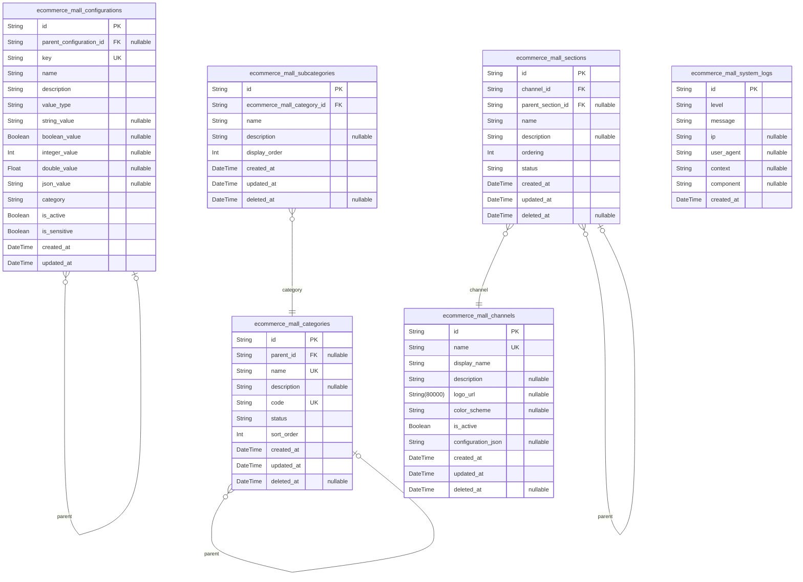
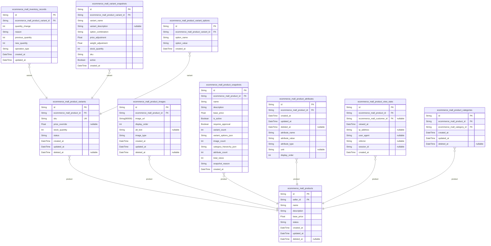
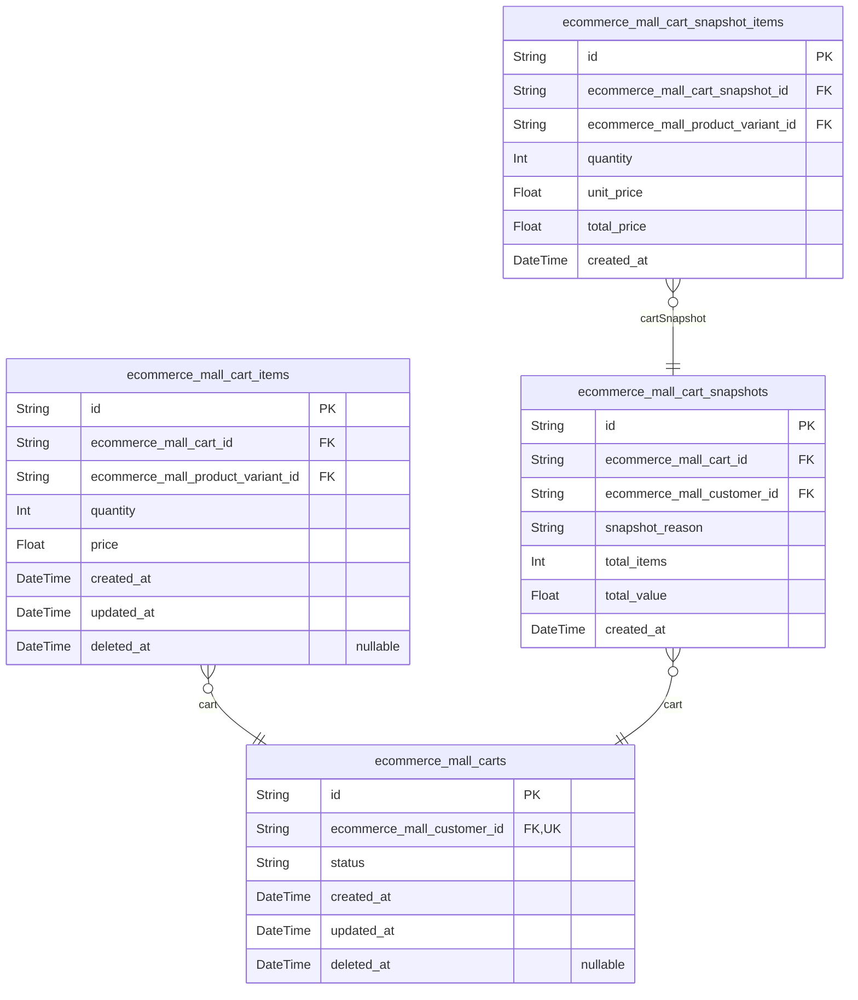
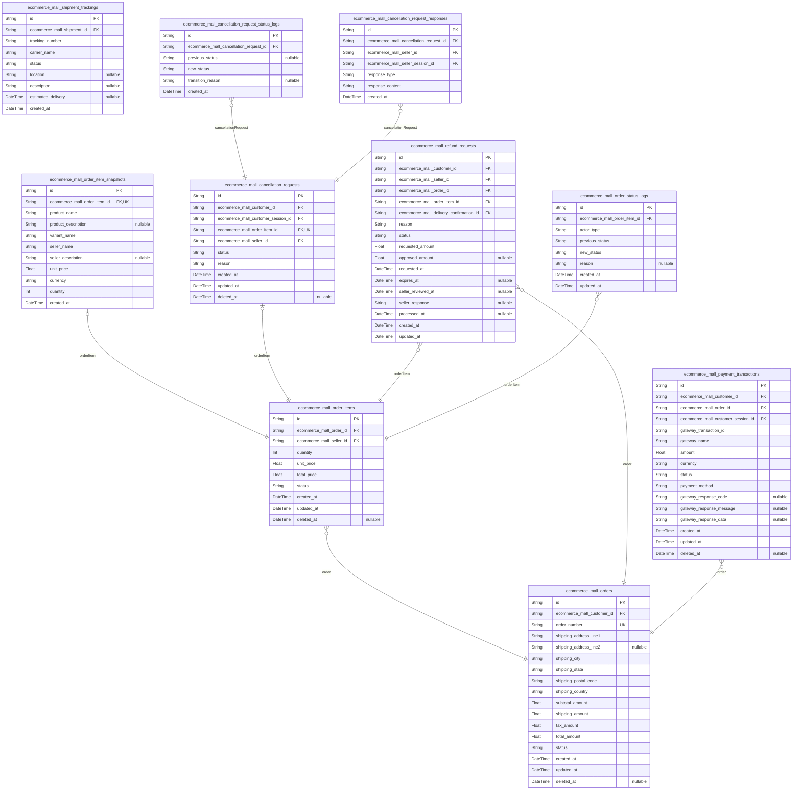
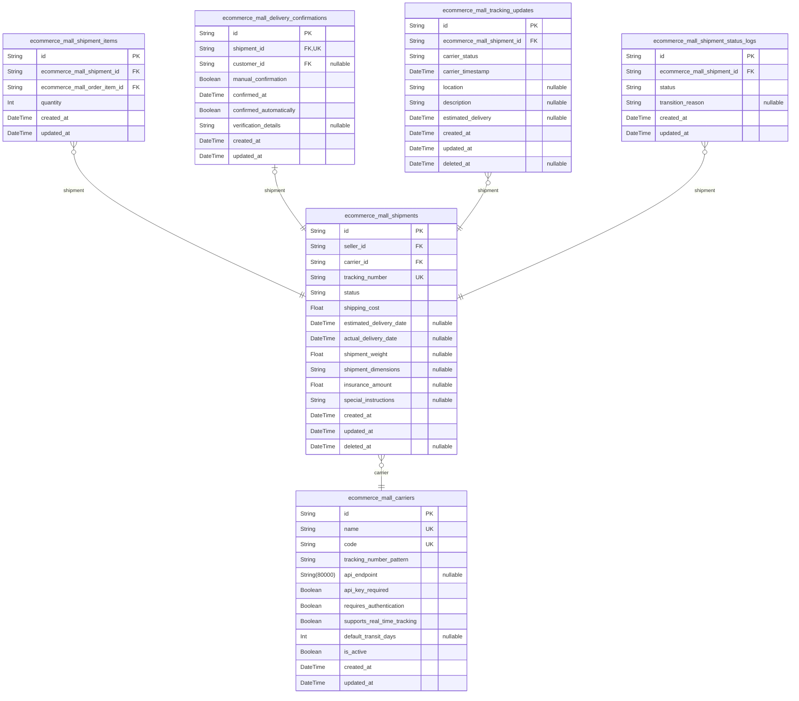
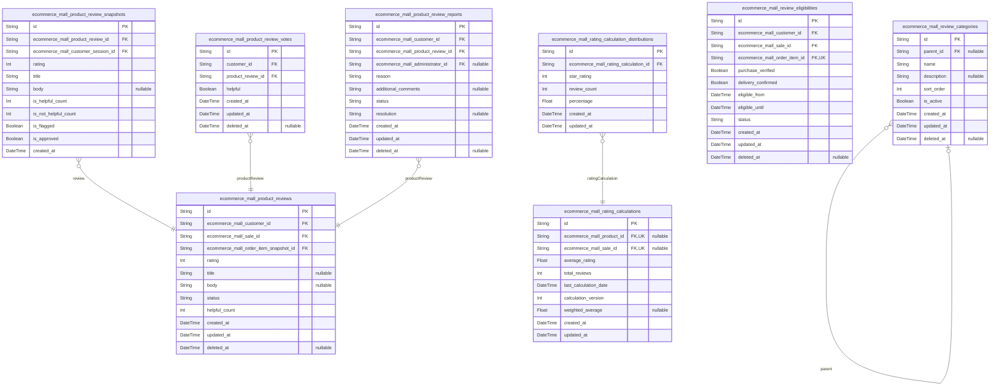
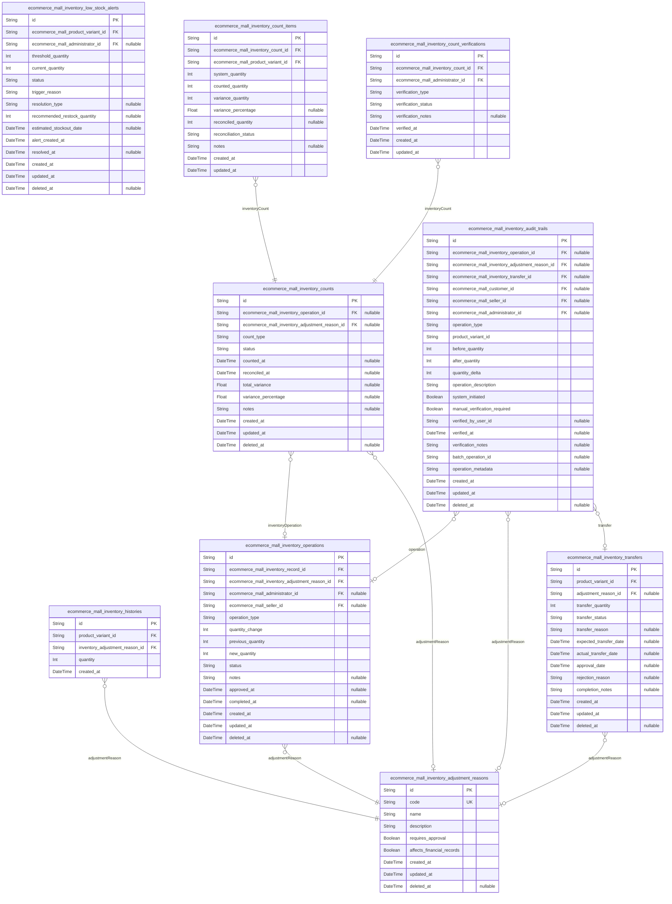

# Prisma Markdown

> Generated by [`prisma-markdown`](https://github.com/samchon/prisma-markdown)

- [Actors](#actors)
- [Systematic](#systematic)
- [Products](#products)
- [Sales](#sales)
- [Carts](#carts)
- [Orders](#orders)
- [Shipping](#shipping)
- [Reviews](#reviews)
- [Inventory](#inventory)
- [Notifications](#notifications)

## Actors

```mermaid
erDiagram
"ecommerce_mall_customers" {
  String id PK
  String email UK
  String password_hash
  String display_name "nullable"
  String phone_number "nullable"
  DateTime created_at
  DateTime updated_at
  DateTime deleted_at "nullable"
}
"ecommerce_mall_customer_sessions" {
  String id PK
  String customer_id FK
  String ip
  String href
  String referrer
  DateTime created_at
  DateTime expired_at
}
"ecommerce_mall_customer_password_resets" {
  String id PK
  String ecommerce_mall_customer_id FK
  String token_hash UK
  DateTime expires_at
  DateTime used_at "nullable"
  DateTime created_at
  DateTime updated_at
  DateTime deleted_at "nullable"
}
"ecommerce_mall_customer_email_verifications" {
  String id PK
  String ecommerce_mall_customer_id FK
  String token UK
  DateTime expires_at
  DateTime verified_at "nullable"
  Int verification_attempts
  DateTime created_at
  DateTime updated_at
}
"ecommerce_mall_sellers" {
  String id PK
  String email UK
  String password_hash
  String business_name
  String contact_phone
  String business_address "nullable"
  String tax_id "nullable"
  String description "nullable"
  String status
  String approved_by "nullable"
  DateTime approved_at "nullable"
  String rejection_reason "nullable"
  String suspension_reason "nullable"
  DateTime last_login_at "nullable"
  DateTime created_at
  DateTime updated_at
  DateTime deleted_at "nullable"
}
"ecommerce_mall_seller_sessions" {
  String id PK
  String seller_id FK
  String ip
  String href
  String referrer
  DateTime created_at
  DateTime expired_at
}
"ecommerce_mall_seller_password_resets" {
  String id PK
  String ecommerce_mall_seller_id FK
  String token_hash UK
  DateTime expires_at
  DateTime created_at
  DateTime updated_at
  DateTime deleted_at "nullable"
}
"ecommerce_mall_seller_email_verifications" {
  String id PK
  String seller_id FK
  String token UK
  DateTime expires_at
  DateTime verified_at "nullable"
  DateTime created_at
  DateTime updated_at
}
"ecommerce_mall_administrators" {
  String id PK
  String email
  String password_hash
  String password_salt
  String status
  String first_name
  String last_name
  DateTime created_at
  DateTime updated_at
  DateTime deleted_at "nullable"
}
"ecommerce_mall_administrator_sessions" {
  String id PK
  String administrator_id FK
  String ip
  String href
  String referrer
  DateTime created_at
  DateTime expired_at
}
"ecommerce_mall_administrator_password_resets" {
  String id PK
  String ecommerce_mall_administrator_id FK
  String token UK
  DateTime created_at
  DateTime expired_at
  DateTime used_at "nullable"
}
"ecommerce_mall_administrator_email_verifications" {
  String id PK
  String ecommerce_mall_administrator_id FK
  String token UK
  DateTime expires_at
  DateTime verified_at "nullable"
  DateTime created_at
}
"ecommerce_mall_super_administrators" {
  String id PK
  String email UK
  String password_hash
  DateTime created_at
  DateTime updated_at
  DateTime deleted_at "nullable"
}
"ecommerce_mall_super_administrator_sessions" {
  String id PK
  String ecommerce_mall_super_administrator_id FK
  String ip
  String href
  String referrer
  DateTime created_at
  DateTime expired_at
}
"ecommerce_mall_super_administrator_password_resets" {
  String id PK
  String ecommerce_mall_super_administrator_id FK
  String token UK
  DateTime expires_at
  DateTime used_at "nullable"
  DateTime created_at
  DateTime updated_at
  DateTime deleted_at "nullable"
}
"ecommerce_mall_super_administrator_email_verifications" {
  String id PK
  String ecommerce_mall_super_administrator_id FK
  String token UK
  DateTime expires_at
  DateTime verified_at "nullable"
  DateTime created_at
  DateTime updated_at
}
"ecommerce_mall_customer_sessions" }o--|| "ecommerce_mall_customers" : customer
"ecommerce_mall_customer_password_resets" }o--|| "ecommerce_mall_customers" : customer
"ecommerce_mall_customer_email_verifications" }o--|| "ecommerce_mall_customers" : customer
"ecommerce_mall_seller_sessions" }o--|| "ecommerce_mall_sellers" : seller
"ecommerce_mall_seller_password_resets" }o--|| "ecommerce_mall_sellers" : seller
"ecommerce_mall_seller_email_verifications" }o--|| "ecommerce_mall_sellers" : seller
"ecommerce_mall_administrator_sessions" }o--|| "ecommerce_mall_administrators" : administrator
"ecommerce_mall_administrator_password_resets" }o--|| "ecommerce_mall_administrators" : administrator
"ecommerce_mall_administrator_email_verifications" }o--|| "ecommerce_mall_administrators" : administrator
"ecommerce_mall_super_administrator_sessions" }o--|| "ecommerce_mall_super_administrators" : superAdministrator
"ecommerce_mall_super_administrator_password_resets" }o--|| "ecommerce_mall_super_administrators" : superAdministrator
"ecommerce_mall_super_administrator_email_verifications" }o--|| "ecommerce_mall_super_administrators" : superAdministrator
```

### `ecommerce_mall_customers`

Customer accounts with email/password authentication credentials and
profile information for registered buyers.

Stores authentication credentials for customer login including email
address and password hash. Contains profile information such as display
name and phone number for customer identification and communication.
Supports soft deletion where account deletion preserves historical order
and review data while preventing new authentication.

The table maintains temporal tracking with created_at, updated_at, and
deleted_at fields to support audit trails and account lifecycle
management. Foreign key relationships establish connections to customer
sessions, password reset workflows, and email verification processes.

Properties as follows:

- `id`: Primary Key.
- `email`
  > Customer's email address used for authentication, communication, and
  > account recovery. Must be unique across customer accounts.
- `password_hash`
  > Hashed password credential for customer authentication. Never stores
  > plain text passwords.
- `display_name`
  > Customer's public display name shown in reviews, order communications,
  > and social features.
- `phone_number`
  > Customer's phone number for delivery coordination and account
  > verification purposes.
- `created_at`: Timestamp when the customer account was first created during registration.
- `updated_at`: Timestamp when the customer account information was last modified.
- `deleted_at`
  > Timestamp when the customer account was soft deleted, preserving
  > historical data.

### `ecommerce_mall_customer_sessions`

JWT session tokens for customer authentication with access and refresh
token support and session management.

Tracks customer login sessions with connection context information
including IP address, connection URL, and referrer for security auditing.
Each session is associated with a specific customer account and includes
expiration timestamps for secure session management.

Sessions are managed through authentication workflows rather than direct
CRUD operations, providing an append-only audit trail of customer login
events. The session table supports JWT token management and secure
authentication mechanisms for the e-commerce platform.

Properties as follows:

- `id`: Primary Key.
- `customer_id`: Associated customer's [ecommerce_mall_customers.id](#ecommerce_mall_customers).
- `ip`
  > IP address of the customer's connection for security auditing and
  > geographic tracking.
- `href`: Connection URL where the session was established for context tracking.
- `referrer`: Referrer URL indicating where the customer came from before login.
- `created_at`: Timestamp when the session was created for login event tracking.
- `expired_at`
  > Timestamp when the session expires for secure session management.
  > Sessions must have expiration for security compliance.

### `ecommerce_mall_customer_password_resets`

Password reset tokens with expiration for secure customer password
recovery workflow.

Manages one-time use tokens for customer password reset requests with
built-in security constraints including expiration timestamps and usage
status tracking. Each token is cryptographically secure and expires
automatically to prevent unauthorized access.

Tokens are generated when customers initiate password reset requests and
must be used within the validity period. The system tracks token usage to
prevent replay attacks and ensure each token can only be used once for
security purposes.

This table implements core authentication security protocols as
referenced by the customer's [ecommerce_mall_customers.id](#ecommerce_mall_customers) identity
record. Soft deletion support maintains audit trails while allowing token
cleanup after usage or expiration.

Properties as follows:

- `id`: Primary Key.
- `ecommerce_mall_customer_id`
  > Customer requesting password reset. References the customer's {@link
  > ecommerce_mall_customers.id}.
- `token_hash`
  > Cryptographic hash of the password reset token for security. Stored as
  > hash to prevent token exposure even if database is compromised.
- `expires_at`
  > Token expiration timestamp after which the token becomes invalid for
  > security protection.
- `used_at`
  > Timestamp when the token was successfully used to reset the password.
  > Null indicates unused token.
- `created_at`: Timestamp when the password reset request was created and token generated.
- `updated_at`
  > Timestamp when the password reset record was last updated, typically when
  > token is used.
- `deleted_at`
  > Soft deletion timestamp for audit trail maintenance. Null indicates
  > active record.

### `ecommerce_mall_customer_email_verifications`

Email verification tokens for customer registration confirmation with
expiration timestamps.

This table manages the email verification workflow for customer accounts,
storing unique verification tokens that are sent to customers during
registration. Each token has a limited validity period and is
automatically invalidated once used or expired.

The verification process ensures customer email validity and prevents
fraudulent account creation. Tokens are generated during registration and
verified when customers click the confirmation link in their email.

The table maintains audit trails of verification attempts and supports
security best practices through expiration enforcement and one-time use
validation. Failed verification attempts are tracked for security
monitoring and spam prevention.

Properties as follows:

- `id`: Primary Key.
- `ecommerce_mall_customer_id`
  > Reference to the customer account needing email verification. {@link
  > ecommerce_mall_customers.id}
- `token`
  > Unique verification token sent to the customer's email address for
  > confirmation.
- `expires_at`
  > Expiration timestamp after which the verification token becomes invalid
  > for security.
- `verified_at`
  > Timestamp when the customer successfully verified their email address
  > using this token.
- `verification_attempts`
  > Count of verification attempts made with this token for security
  > monitoring.
- `created_at`
  > Timestamp when the verification token was generated and sent to the
  > customer.
- `updated_at`
  > Timestamp when the verification record was last updated, including
  > verification attempts.

### `ecommerce_mall_sellers`

Seller accounts with email/password authentication credentials and shop
profile information requiring admin approval. Sellers must undergo
approval process before they can list products and manage their shops on
the platform. Each seller has business profile details and administrative
status tracking for platform compliance.

Properties as follows:

- `id`: Primary Key.
- `email`
  > Seller's email address used for authentication and business
  > communication. Must be unique across all sellers on the platform.
- `password_hash`
  > Hashed password for secure authentication. Stores bcrypt hash with salt
  > for protection of seller account credentials.
- `business_name`
  > Legal business name of the seller used for official registration and
  > customer-facing display.
- `contact_phone`
  > Business phone number for official communication and customer support
  > contact.
- `business_address`
  > Physical business address for verification and official correspondence.
  > Supports international address formats.
- `tax_id`
  > Business tax identification number for regulatory compliance and
  > financial reporting.
- `description`
  > Seller profile description explaining business focus, specialties, and
  > customer value proposition.
- `status`
  > Seller account status: pending_approval, approved, suspended, rejected.
  > Controls platform access and business operations.
- `approved_by`
  > Administrator who approved the seller registration. References
  > administrator's [ecommerce_mall_administrators.id](#ecommerce_mall_administrators).
- `approved_at`
  > Timestamp when the seller was approved by an administrator for platform
  > access.
- `rejection_reason`
  > Reason provided by administrator when rejecting a seller application.
  > Guides seller on improvements for reapplication.
- `suspension_reason`
  > Reason for account suspension when seller violates platform policies or
  > fails compliance requirements.
- `last_login_at`
  > Timestamp of seller's last successful login for security monitoring and
  > account activity tracking.
- `created_at`
  > Timestamp when the seller account was initially created and registration
  > submitted.
- `updated_at`
  > Timestamp of last modification to seller account information. Updated on
  > profile changes and status updates.
- `deleted_at`
  > Soft deletion timestamp indicating when the seller account was marked for
  > deletion while preserving business records.

### `ecommerce_mall_seller_sessions`

Seller login session records for authentication and connection tracking.

Tracks seller login sessions with connection context including IP
address, URL, and referrer information for security auditing. Each
session has a creation timestamp and expiration time to manage session
lifecycle.

Sessions are managed through authentication workflows rather than direct
CRUD operations. The table maintains an audit trail of seller login
activity for security monitoring and compliance requirements.

Multiple concurrent sessions are supported per seller to accommodate
different devices and browser sessions.

Properties as follows:

- `id`: Primary Key.
- `seller_id`: Belonged seller's [ecommerce_mall_sellers.id](#ecommerce_mall_sellers).
- `ip`
  > IP address of the connection where the session was created for security
  > auditing.
- `href`: Connection URL where the session was initiated for context tracking.
- `referrer`
  > Referrer URL indicating the page that directed the seller to the login
  > page.
- `created_at`: Session creation timestamp recording when the seller authenticated.
- `expired_at`
  > Session expiration timestamp when the session becomes invalid for
  > security.

### `ecommerce_mall_seller_password_resets`

Stores temporary password reset tokens for seller accounts with secure
token hashing and expiration tracking.

Each record represents a password reset request initiated by a seller
that needs to be completed within the expiration period. The token is
securely hashed and uniquely generated for each reset attempt to prevent
unauthorized password changes.

The table maintains audit trail information including creation timestamps
and supports soft deletion to preserve security audit history while
allowing cleanup of expired tokens. All password reset operations are
tracked against the seller's active sessions to maintain security
compliance.

Properties as follows:

- `id`: Primary Key.
- `ecommerce_mall_seller_id`
  > Target seller account requiring password reset. {@link
  > ecommerce_mall_sellers.id}
- `token_hash`
  > Securely hashed password reset token used for authentication during
  > password recovery process. Should be generated uniquely for each reset
  > attempt.
- `expires_at`
  > Timestamp when this password reset token expires and becomes invalid.
  > Password recovery must be completed before this time.
- `created_at`
  > Timestamp when the password reset request was created and the token was
  > generated.
- `updated_at`
  > Timestamp when this password reset record was last updated, typically
  > when the reset is completed or expired.
- `deleted_at`
  > Timestamp when this password reset record was soft deleted, allowing
  > cleanup while maintaining audit trail integrity.

### `ecommerce_mall_seller_email_verifications`

Email verification tokens for seller registration confirmation with
expiration timestamps.

Stores verification tokens sent to seller email addresses during the
registration process. Each token is associated with a specific seller
account and must be verified within the expiration period to activate the
seller's account.

Tokens follow security best practices with limited validity periods and
one-time use constraints. Once verified, the token is marked as used and
cannot be reused. Supports the seller registration approval workflow by
ensuring email address authenticity.

Implements the snapshot architecture principle through immutable
verification records that maintain the verification history for audit
purposes even after account deletion considerations.

Properties as follows:

- `id`: Primary Key.
- `seller_id`
  > Seller account requiring email verification. {@link
  > ecommerce_mall_sellers.id}
- `token`
  > Unique verification token string sent to the seller's email address.
  > Generated as a cryptographically secure random string.
- `expires_at`
  > Timestamp when this verification token expires and becomes invalid.
  > Tokens typically have short validity periods for security.
- `verified_at`
  > Timestamp when the seller successfully verified their email address using
  > this token. Null until verification occurs.
- `created_at`: Timestamp when this verification token was created and sent to the seller.
- `updated_at`
  > Timestamp when this verification token record was last updated, typically
  > upon verification.

### `ecommerce_mall_administrators`

Administrator accounts with email/password authentication for platform
management and oversight.

Stores credential information for administrator users who manage platform
operations including seller approvals, category management, and user
oversight. Administrators have elevated permissions compared to regular
customers and sellers but fewer privileges than super administrators.

Required to have verified email addresses and secure password
authentication following platform security standards. Supports account
suspension/reactivation and maintains audit trails of administrative
actions through created timestamps and soft deletion tracking.

Properties as follows:

- `id`: Primary Key.
- `email`
  > Administrator's login email address used for authentication and platform
  > communications. Must be unique across all administrator accounts.
- `password_hash`
  > Securely hashed password for administrator authentication using
  > platform-approved cryptographic algorithms.
- `password_salt`
  > Cryptographic salt used in password hashing to ensure password secrecy
  > and security.
- `status`
  > Administrator account status controlling login capability and platform
  > access. Possible values: 'active', 'suspended', 'pending_verification'.
- `first_name`: Administrator's first name for identification and communication purposes.
- `last_name`: Administrator's last name for identification and communication purposes.
- `created_at`
  > Timestamp when the administrator account was created for audit trail
  > purposes.
- `updated_at`
  > Timestamp when the administrator account was last updated for change
  > tracking.
- `deleted_at`
  > Timestamp when the administrator account was soft deleted, allowing
  > recovery and preserving audit trails of terminated accounts.

### `ecommerce_mall_administrator_sessions`

Administrator login session records for authentication and connection
tracking.

Stores JWT session tokens and connection context for authenticated
administrator access.
Captures IP address, connection URLs, and session expiration for security
auditing.
Maintains one-to-many relationship with administrators for active session
management.

**Security Notes:** Sessions must expire for security compliance.
Expired_at is mandatory and server-side enforced.
Used for authentication workflows, not directly managed through
administrator CRUD operations.

Properties as follows:

- `id`: Primary Key.
- `administrator_id`
  > Reference to the authenticated administrator's {@link
  > ecommerce_mall_administrators.id}.
- `ip`
  > IP address of the connection that created this session for security
  > auditing.
- `href`
  > Full connection URL including path and query parameters for session
  > context.
- `referrer`: Referrer URL from HTTP headers indicating previous page navigation.
- `created_at`: Timestamp when this session was created during administrator login.
- `expired_at`
  > Timestamp when this session should expire for security compliance. Must
  > be non-null for security enforcement.

### `ecommerce_mall_administrator_password_resets`

Password reset tokens with expiration for secure administrator password
recovery workflow.

Stores unique tokens generated when administrators request password
resets. Each token is associated with a specific administrator account
and has a limited validity period for security. Tokens are single-use and
automatically expire after a set duration to prevent unauthorized access.

The table maintains an audit trail of password reset requests while
ensuring security through token expiration and administrator association.
Failed attempts or expired tokens are tracked through the expiration
mechanism rather than deletion to maintain security audit capabilities.

Password reset tokens are managed through the administrator
authentication system and are not directly accessible to users for
independent management.

Properties as follows:

- `id`: Primary Key.
- `ecommerce_mall_administrator_id`
  > Administrator account requesting password reset. {@link
  > ecommerce_mall_administrators.id}
- `token`
  > Unique password reset token generated for administrator authentication.
  > Used to verify password reset requests and ensure single-use security.
- `created_at`
  > Timestamp when the password reset token was created. Used for token
  > expiration calculation and audit trail.
- `expired_at`
  > Timestamp when the password reset token expires. Tokens become invalid
  > after this time for security purposes.
- `used_at`
  > Timestamp when the password reset token was successfully used. Null
  > indicates the token is still valid and unused.

### `ecommerce_mall_administrator_email_verifications`

Email verification tokens for administrator account verification process
with secure token generation and expiration management.

Stores verification tokens sent via email to administrators for account
activation and email confirmation. Each token is uniquely generated and
linked to a specific administrator account. Includes expiration
timestamps to enforce security by automatically invalidating tokens after
a defined period.

Tokens are managed through administrator authentication flows and are
automatically cleared after successful verification or expiration. This
table supports the security requirements for administrator account
verification and email confirmation workflows specified in the
authentication documentation.

Properties as follows:

- `id`: Primary Key.
- `ecommerce_mall_administrator_id`
  > Reference to the administrator account awaiting email verification via
  > this token. [ecommerce_mall_administrators.id](#ecommerce_mall_administrators)
- `token`
  > Unique verification token generated for email confirmation. Must be
  > securely random and sufficiently long to prevent guessing attacks.
- `expires_at`
  > Timestamp when this verification token expires for security purposes.
  > Tokens past this timestamp are automatically invalidated.
- `verified_at`
  > Timestamp when the email verification was successfully completed. Null
  > indicates pending verification.
- `created_at`
  > Timestamp when this verification token was created and sent to the
  > administrator's email.

### `ecommerce_mall_super_administrators`

Super administrator accounts with highest privileges for administrator
management and platform oversight.

Represents the highest level of administrative authority in the
e-commerce platform, capable of managing other administrators,
configuring system-wide settings, and overseeing all platform operations.
These accounts require email and password authentication and maintain
comprehensive audit trails for security and compliance.

Super administrators have elevated permissions beyond regular
administrators, including the ability to promote/demote other
administrators, access sensitive system logs, and override certain
business rules. Account deletion follows platform security protocols
while preserving necessary audit trails.

Properties as follows:

- `id`: Primary Key.
- `email`
  > Unique email address used for super administrator authentication and
  > communication. Must be validated and verified before account activation.
- `password_hash`
  > Securely hashed password for super administrator authentication. Never
  > stored in plain text and protected with industry-standard encryption.
- `created_at`
  > Timestamp when the super administrator account was created. Used for
  > audit trails and account lifecycle tracking.
- `updated_at`
  > Timestamp when the super administrator account was last updated. Tracks
  > profile changes and security modifications.
- `deleted_at`
  > Timestamp when the super administrator account was soft deleted. Allows
  > for account recovery and maintains audit trail integrity.

### `ecommerce_mall_super_administrator_sessions`

JWT session tokens for super administrator authentication with access and
refresh token support.

Stores login session data for super administrators, including connection
context for security auditing. Each session is associated with exactly
one super administrator and tracks authentication events with timestamps
and connection metadata for audit trails.

Sessions record IP addresses, connection URLs, and referrer information
for security monitoring. The expired_at field enforces session expiration
for security compliance, preventing indefinite session persistence unless
explicitly configured as nullable for special cases.

The composite index on super_administrator_id and created_at supports
efficient session lookup and cleanup operations. Sessions follow the
established authentication pattern used across all actor types in the
platform.

Properties as follows:

- `id`: Primary Key.
- `ecommerce_mall_super_administrator_id`
  > Belonged super administrator's {@link
  > ecommerce_mall_super_administrators.id}.
- `ip`: IP address of the connection that created this session.
- `href`: Connection URL where the session was created.
- `referrer`: Referrer URL that directed to the session creation page.
- `created_at`: Timestamp when the session was created.
- `expired_at`
  > Timestamp when the session expires for security compliance. Sessions must
  > have expiration to prevent indefinite persistence.

### `ecommerce_mall_super_administrator_password_resets`

Password reset tokens with expiration for secure super administrator
password recovery workflow.

Stores temporary reset tokens that allow super administrators to securely
reset their passwords when forgotten. Each token is associated with a
specific super administrator account and includes expiration timestamps
to ensure security. The tokens are generated upon password reset request
and invalidated after use or expiration.

Tokens are cryptographically secure and time-limited to prevent
unauthorized access. The system tracks token creation, usage, and
expiration to maintain audit trail and security compliance. Soft deletion
is supported to preserve audit trails while allowing token cleanup after
successful password resets.

Properties as follows:

- `id`: Primary Key.
- `ecommerce_mall_super_administrator_id`
  > Reference to the super administrator requesting password reset. {@link
  > ecommerce_mall_super_administrators.id}
- `token`
  > Cryptographically secure reset token used for password recovery
  > authentication.
- `expires_at`
  > Expiration timestamp after which the reset token becomes invalid for
  > security.
- `used_at`: Timestamp when the reset token was successfully used to change password.
- `created_at`: Timestamp when the reset token was created.
- `updated_at`: Timestamp when the reset token record was last updated.
- `deleted_at`
  > Timestamp when the reset token was soft deleted for audit trail
  > preservation.

### `ecommerce_mall_super_administrator_email_verifications`

Email verification tokens for super administrator account verification
with expiration tracking and verification status management.

Provides secure email verification workflow for super administrator
registration and email address changes. Each token has limited validity
period enforced by expiration timestamp. Verification creates audit trail
with timestamp upon successful confirmation.

Properties as follows:

- `id`: Primary Key.
- `ecommerce_mall_super_administrator_id`
  > Foreign key referencing the associated super administrator requiring
  > email verification. [ecommerce_mall_super_administrators.id](#ecommerce_mall_super_administrators)
- `token`
  > Unique verification token sent to the super administrator's email address
  > for account verification. Generated using secure cryptographic methods.
- `expires_at`
  > Timestamp when this verification token expires and can no longer be used.
  > Enforces security by limiting token validity period.
- `verified_at`
  > Timestamp when the verification was successfully completed using this
  > token. Null indicates pending verification.
- `created_at`
  > Timestamp when this verification request was created. Used for audit
  > trail and token age tracking.
- `updated_at`
  > Timestamp when this verification record was last updated, typically when
  > verification is completed.

## Systematic

### `ecommerce_mall_categories`

Parent categories for product organization with name, description, and
hierarchical structure management.

Manages the primary category hierarchy for organizing products within the
e-commerce platform. Each category represents a distinct grouping
capability with support for hierarchical nesting. Categories can be
organized in parent-child relationships to create multi-level category
trees.

Categories maintain their own lifecycle independent of contained
products, allowing administrators to reorganize the product catalog
without affecting existing product assignments. Supports flexible
category management operations including creation, renaming,
reorganization, and soft deletion while preserving category-product
relationships.

The hierarchical structure enables flexible product discovery paths while
maintaining category integrity through parent-child relationships.
Categories can be toggled between active and inactive states to control
product visibility while preserving historical category assignments.

Properties as follows:

- `id`: Primary Key.
- `parent_id`
  > Parent category's [ecommerce_mall_categories.id](#ecommerce_mall_categories) for hierarchical
  > organization. Null for top-level categories.
- `name`
  > Unique category name used for display and organization. Must be distinct
  > across all categories.
- `description`
  > Detailed category description explaining the product scope and
  > organizational purpose.
- `code`: Unique category code used for system reference and API identification.
- `status`
  > Category status controlling visibility and functionality. Valid values:
  > 'active', 'inactive', 'archived'.
- `sort_order`: Numerical order for category display sequence. Lower numbers appear first.
- `created_at`: Timestamp when the category was first created in the system.
- `updated_at`: Timestamp when the category was last modified.
- `deleted_at`
  > Timestamp when the category was soft deleted. Null indicates active
  > category.

### `ecommerce_mall_subcategories`

Child categories that belong to parent categories for hierarchical
product organization.

Subcategories provide a secondary level of classification within the
product catalog hierarchy, allowing for more granular organization of
products. Each subcategory must belong to exactly one parent category and
maintains its own organizational structure.

Subcategories support flexible product classification and enable advanced
filtering and browsing capabilities for customers. They can be
independently managed, searched, and organized regardless of their parent
category context.

The hierarchical relationship ensures proper product organization while
allowing subcategories to have their own identity and management
workflows.

Properties as follows:

- `id`: Primary Key.
- `ecommerce_mall_category_id`: Parent category reference. [ecommerce_mall_categories.id](#ecommerce_mall_categories)
- `name`
  > Display name of the subcategory used for customer-facing navigation and
  > product organization.
- `description`
  > Detailed description explaining the subcategory's purpose and product
  > scope.
- `display_order`
  > Numerical ordering value determining the display sequence of
  > subcategories within their parent category.
- `created_at`: Timestamp when the subcategory was initially created in the system.
- `updated_at`: Timestamp when the subcategory was last modified.
- `deleted_at`
  > Timestamp when the subcategory was soft-deleted, allowing for recovery
  > and audit trail preservation.

### `ecommerce_mall_configurations`

System-wide configuration settings and feature flags controlling platform
operation and behavior.

Stores key-value pairs for all platform configuration parameters
including feature toggles, operational settings, and system-wide
parameters that control how the e-commerce platform functions. Supports
hierarchical organization through parent-child relationships and allows
enabling/disabling features without code changes.

Each configuration setting includes type information for proper value
validation and supports different data types including boolean flags,
numeric values, string parameters, and JSON objects for complex
configurations. Administrators can manage these settings through
dedicated API endpoints to control platform behavior dynamically.

Configuration changes are tracked through standard audit timestamps, and
the hierarchical structure allows organizing related settings together
for easier management and navigation.

Properties as follows:

- `id`: Primary Key.
- `parent_configuration_id`
  > Parent configuration's [ecommerce_mall_configurations.id](#ecommerce_mall_configurations) for
  > hierarchical organization. Null for root-level configurations.
- `key`
  > Configuration key identifier used to reference this setting in
  > application code.
- `name`
  > Human-readable name for this configuration setting displayed in
  > administrative interfaces.
- `description`
  > Detailed description explaining the purpose and usage of this
  > configuration setting.
- `value_type`
  > Data type of the configuration value. Valid values: boolean, string,
  > integer, double, json.
- `string_value`
  > Configuration value when value_type is 'string'. Contains the string
  > parameter value.
- `boolean_value`
  > Configuration value when value_type is 'boolean'. Contains the true/false
  > flag value.
- `integer_value`
  > Configuration value when value_type is 'integer'. Contains the numeric
  > integer value.
- `double_value`
  > Configuration value when value_type is 'double'. Contains the numeric
  > decimal value.
- `json_value`
  > Configuration value when value_type is 'json'. Contains JSON-formatted
  > complex configuration data.
- `category`
  > Organizational category for grouping related configuration settings
  > together.
- `is_active`
  > Whether this configuration setting is currently active and being applied
  > by the system.
- `is_sensitive`
  > Whether this configuration contains sensitive data that requires special
  > security handling.
- `created_at`: Timestamp when this configuration setting was initially created.
- `updated_at`: Timestamp when this configuration setting was last modified.

### `ecommerce_mall_channels`

Sales channels configuration defining different sales environments with
branding, settings, and operational parameters.

Each channel represents a distinct sales environment with its own
branding identity, operational settings, and configuration parameters.
Channels can be configured independently to support different business
models, customer segments, or geographic regions.

Channels contain branding elements such as logos, color schemes, and
display settings that define the visual identity of the sales
environment. Operational parameters include business rules, pricing
strategies, and availability settings that govern how products are sold
within each channel.

System administrators can create, configure, and manage channels
independently to support multi-channel sales strategies. Each channel
maintains its own configuration state and can be activated or deactivated
based on business needs.

Soft deletion is supported to maintain configuration history while
allowing channel retirement when no longer needed.

Properties as follows:

- `id`: Primary Key.
- `name`
  > Unique channel name identifier used for system reference and display
  > purposes.
- `display_name`: Human-readable channel name displayed to users and administrators.
- `description`
  > Detailed description explaining the channel's purpose, target audience,
  > and business context.
- `logo_url`: URL to the channel's branding logo image for visual identity.
- `color_scheme`: Branding color scheme definition in CSS or design system format.
- `is_active`: Indicates whether the channel is currently active and available for use.
- `configuration_json`
  > JSON configuration object containing operational parameters and business
  > rules specific to this channel.
- `created_at`: Timestamp when the channel configuration was initially created.
- `updated_at`: Timestamp when the channel configuration was last modified.
- `deleted_at`
  > Timestamp when the channel was soft-deleted, allowing for configuration
  > history preservation.

### `ecommerce_mall_sections`

Sections within channels for organizing content and products hierarchically.

Represents organizational units within sales channels that provide
structured content arrangement and navigation. Sections can be nested
hierarchically through parent-child relationships, allowing for complex
organizational structures within individual channels.

Each section must belong to exactly one channel through the channel_id
foreign key relationship. The parent_section_id enables hierarchical
nesting within the same channel, with null values indicating top-level
sections. Status field controls section visibility and ordering
determines display sequence within the parent context.

Soft deletion is supported through deleted_at field to preserve
organizational relationships while allowing section removal from active
display. Sections serve as containers for organizing products,
promotions, and marketing content within channel contexts.

Properties as follows:

- `id`: Primary Key.
- `channel_id`: Belonged channel's [ecommerce_mall_channels.id](#ecommerce_mall_channels).
- `parent_section_id`
  > Parent section's [ecommerce_mall_sections.id](#ecommerce_mall_sections) for hierarchical
  > nesting.
- `name`: Display name of the section for user interface identification.
- `description`: Detailed description explaining the section's purpose and content.
- `ordering`: Display order position within the parent context or channel.
- `status`: Section status for visibility control (active, inactive, archived).
- `created_at`: Timestamp when the section was initially created.
- `updated_at`: Timestamp when the section was last modified.
- `deleted_at`: Timestamp when the section was soft deleted, if applicable.

### `ecommerce_mall_system_logs`

System operation logs for audit trails, performance monitoring, and error
tracking.

Captures detailed information about system events, errors, performance
metrics, and operational activities across the e-commerce platform. Each
log entry includes severity level, contextual data, and timestamps for
chronological analysis.

Used by administrators for system health monitoring, debugging, security
auditing, and performance optimization. Supports filtering by log level,
time ranges, and specific system components for targeted analysis.

The logs provide comprehensive visibility into platform operations and
serve as the foundation for alerting systems, performance dashboards, and
security incident response workflows.

Properties as follows:

- `id`: Primary Key.
- `level`
  > Log severity level indicating the importance and nature of the log entry.
  > Common values include 'error', 'warning', 'info', 'debug', 'trace' for
  > system monitoring and filtering.
- `message`
  > Detailed log message describing the event, error, or system activity.
  > Contains context-specific information for debugging and analysis
  > purposes.
- `ip`
  > Source IP address associated with the logged event, providing network
  > context for security monitoring and request tracing.
- `user_agent`
  > User agent string from the client connection, useful for identifying
  > client devices, browsers, and application versions involved in system
  > events.
- `context`
  > Additional contextual data in JSON format containing detailed information
  > specific to the logged event, such as request parameters, error details,
  > or performance metrics.
- `component`
  > System component or module where the log event originated, enabling
  > targeted monitoring and component-specific log analysis.
- `created_at`
  > Timestamp when the log entry was created, used for chronological ordering
  > and time-based log analysis. Supports time-series analysis and event
  > correlation.

## Products

### `ecommerce_mall_products`

Core product catalog entries containing essential product information and
seller relationships.

Stores the foundational product data including name, description, base
pricing details, and seller ownership. Each product represents a distinct
item in the catalog that can have multiple variants through the related
variants table.

Products maintain a status field to control listing visibility and
availability. The base price serves as the default pricing which can be
overridden at the variant level when specific options affect pricing.

Seller relationship ensures proper ownership tracking and access control
for product management. Products are designed to support the snapshot
architecture by capturing modifications through the separate product
snapshots table for historical data preservation.

Temporal fields track creation, modification, and soft deletion lifecycle
following platform audit requirements. The product status allows for
flexible listing management including draft preparation, active sales,
and archival for discontinued items.

Properties as follows:

- `id`: Primary Key.
- `seller_id`
  > Belonged seller's [ecommerce_mall_sellers.id](#ecommerce_mall_sellers) that owns and manages
  > this product. Established through the seller registration and approval
  > process.
- `name`
  > Product name for display and search purposes. Must be unique within the
  > seller's product catalog to avoid confusion. Supports international
  > characters for global market reach.
- `description`
  > Detailed product description containing features, specifications, usage
  > instructions, and marketing content. Supports HTML formatting for rich
  > content presentation.
- `base_price`
  > Default product price in base currency that serves as the pricing
  > foundation. Variant-specific prices can override this base price when
  > options affect pricing.
- `status`
  > Current product status controlling listing visibility and availability.
  > Valid values: 'draft', 'active', 'inactive', 'archived'. Controls when
  > products appear in search results and customer-facing catalogs.
- `created_at`
  > Timestamp when the product was initially created in the system. Captures
  > the initial listing date for historical tracking and seller analytics.
- `updated_at`
  > Timestamp when the product was last modified. Used to track recent
  > changes and support change detection for snapshot creation triggers.
- `deleted_at`
  > Timestamp when the product was soft deleted, enabling data preservation
  > while removing from active catalogs. Allows for product restoration and
  > maintains referential integrity with historical orders.

### `ecommerce_mall_product_variants`

Product variants represent specific configurations of products with
unique SKU codes, pricing overrides, and stock quantities.

Each variant belongs to a parent product and represents one specific
combination of product options. Variants have distinct SKU codes for
inventory management and can have different pricing from the base
product. Stock quantities are tracked per variant, allowing independent
inventory management.

The variant system supports complex product offerings while maintaining
proper normalization. Variants are managed through their parent products
and follow the snapshots system for historical data preservation when
modified.

Soft deletion is supported to maintain audit trails while allowing
product catalog reorganization.

Properties as follows:

- `id`: Primary Key.
- `ecommerce_mall_product_id`
  > Belonged product's [ecommerce_mall_products.id](#ecommerce_mall_products) that this variant
  > belongs to.
- `sku`
  > Stock Keeping Unit (SKU) code for inventory management and product
  > identification. Must be unique across all variants.
- `price_override`
  > Optional price override for this variant. If null, inherits base price
  > from parent product.
- `stock_quantity`: Current available stock quantity for this variant. Cannot be negative.
- `status`
  > Availability status of this variant. Values: active - available for sale,
  > inactive - not currently available, discontinued - permanently
  > unavailable.
- `created_at`: Timestamp when this variant was created.
- `updated_at`: Timestamp when this variant was last modified.
- `deleted_at`: Timestamp when this variant was soft deleted. Null if active.

### `ecommerce_mall_product_images`

Stores product images with ordering and metadata management for visual
product display.

Each product can have multiple images with specific display ordering.
Images include URL references, alt text for accessibility, and image type
classification. The ordering field determines the sequence in which
images are displayed for the product.

Images are managed through their parent product operations and cannot be
created independently. Soft deletion is supported to maintain audit
trails while allowing image replacement or removal.

Properties as follows:

- `id`: Primary Key.
- `ecommerce_mall_product_id`: Parent product reference. [ecommerce_mall_products.id](#ecommerce_mall_products)
- `image_url`
  > URL reference to the product image file stored in the media storage
  > system.
- `display_order`
  > Sequential order for image display. Lower numbers appear first in product
  > image galleries.
- `alt_text`: Alternative text description for accessibility and SEO purposes.
- `image_type`
  > Classification of image type such as 'primary', 'thumbnail', 'gallery',
  > or 'detail'.
- `created_at`: Timestamp when the image record was created.
- `updated_at`: Timestamp when the image record was last updated.
- `deleted_at`: Timestamp when the image was soft deleted, or null if active.

### `ecommerce_mall_inventory_records`

Inventory history tracking table recording all quantity changes for
product variants with timestamps and adjustment reasons for complete
audit trail.

Maintains a comprehensive history of inventory operations including
sales, restocks, adjustments, returns, and other modifications to variant
stock levels. Each record represents a single inventory transaction that
affects the available quantity of a product variant.

Essential for audit compliance, stock reconciliation, and providing
visibility into inventory movements over time. The audit trail supports
dispute resolution, performance analysis, and inventory optimization
decisions.

References the target product variant using {@link
ecommerce_mall_product_variants.id} to track inventory changes at the
variant level.

Properties as follows:

- `id`: Primary Key.
- `ecommerce_mall_product_variant_id`
  > Target product variant whose inventory is being modified. {@link
  > ecommerce_mall_product_variants.id}
- `quantity_change`
  > Amount of inventory added (positive) or deducted (negative) in this
  > operation.
- `reason`
  > Description of why this inventory change occurred, such as sale, restock,
  > adjustment, or return.
- `previous_quantity`: Stock level before this operation occurred, for audit verification.
- `new_quantity`: Stock level after this operation occurred, for audit verification.
- `operation_type`
  > Type of inventory operation: sale, restock, adjustment, return, damage,
  > etc.
- `created_at`: Timestamp when this inventory record was created.
- `updated_at`: Timestamp when this inventory record was last updated.

### `ecommerce_mall_product_snapshots`

Immutable snapshots preserving complete product state including variants
at modification time for audit trails and historic reference.

Captures the complete state of products whenever modifications occur,
including all fields, variant relationships, and image associations. This
ensures exact product information is preserved for order processing,
dispute resolution, and business auditing purposes.

Each snapshot establishes a reference to the parent product being
modified and includes creation timestamps for temporal tracking. The
snapshots are append-only and cannot be modified once created,
maintaining data integrity for historical reference.

Used by the system to resolve disputes, provide accurate historical
reporting, and ensure customer orders reference the exact product state
at purchase time even if the live product data changes later.

Properties as follows:

- `id`: Primary Key.
- `ecommerce_mall_product_id`
  > Reference to the parent product whose state is being preserved via
  > snapshot. [ecommerce_mall_products.id](#ecommerce_mall_products)
- `name`
  > Product name at the time of snapshot creation, capturing the exact naming
  > state for historical accuracy.
- `description`
  > Complete product description including all rich text formatting and
  > content details preserved exactly as captured.
- `base_price`
  > Product base price in the original currency at snapshot time, preserving
  > exact pricing for historical reference.
- `is_active`
  > Product activation status at snapshot time, indicating whether the
  > product was available for sale when captured.
- `requires_approval`
  > Approval requirement status at snapshot time, capturing any
  > administrative gatekeeping status.
- `variant_count`
  > Number of product variants available at snapshot time, capturing the
  > product complexity state.
- `variant_options_json`
  > JSON structure containing all variant option definitions and combinations
  > available at snapshot time for complete reconstruction.
- `image_count`
  > Number of product images associated with the product at snapshot time,
  > capturing visual asset completeness.
- `category_hierarchy_json`
  > JSON structure containing the complete category hierarchy including
  > parent and subcategory relationships at snapshot time.
- `attribute_count`
  > Number of product attributes and specifications defined at snapshot time,
  > capturing feature completeness.
- `total_views`
  > Cumulative product view count at snapshot time, capturing engagement
  > metrics for historical analytics.
- `snapshot_reason`
  > Reason for snapshot creation, documenting the modification event that
  > triggered this historical capture (e.g., price_change,
  > description_update, status_change).
- `created_at`
  > Timestamp when this immutable snapshot was created, establishing the
  > exact moment of product state preservation.

### `ecommerce_mall_variant_snapshots`

Immutable snapshots preserving complete variant state changes for audit
trail and dispute resolution.

Captures the entire state of a product variant at the moment of any
modification, creating permanent records that cannot be altered. Each
snapshot includes all variant fields as they existed when the snapshot
was triggered, ensuring historical accuracy for business analytics, data
disputes, and compliance requirements.

Used automatically by the system whenever a variant is created or
modified, providing a complete audit trail of all changes over the
variant's lifecycle. Snapshots are referenced when resolving customer
disputes about product specifications or pricing, allowing verification
of what was presented at any point in time.

The denormalized storage of all variant fields ensures that historical
data remains accurate even if later changes are made to the active
variant record. This supports the platform's commitment to data integrity
and transparency in all customer transactions.

Properties as follows:

- `id`: Primary Key.
- `ecommerce_mall_product_variant_id`
  > The variant being snapshotted's identifier. {@link
  > ecommerce_mall_product_variants.id}
- `variant_name`
  > Name of the variant at snapshot time, typically combining product name
  > with option selections.
- `variant_description`
  > Detailed description of the variant's specific features and
  > characteristics as recorded during snapshot.
- `option_combination`
  > Specific combination of product options that defines this variant,
  > formatted consistently for display and search.
- `price_adjustment`
  > Price adjustment amount relative to base product price, positive for
  > premiums or negative for discounts.
- `weight_adjustment`
  > Weight adjustment relative to base product weight, positive for heavier
  > or negative for lighter configurations.
- `stock_quantity`
  > Available stock quantity at snapshot time, reflecting current inventory
  > levels for order processing.
- `sku`
  > Stock Keeping Unit code identifying this specific variant for inventory
  > management and order fulfillment.
- `active`
  > Whether the variant was active and available for purchase at snapshot
  > creation time.
- `created_at`
  > Timestamp when this snapshot was created, representing the exact moment
  > of variant state capture.

### `ecommerce_mall_product_attributes`

Standardized product specifications and attributes enabling advanced
filtering and search functionality across the product catalog.

Stores structured specification data for products including features,
dimensions, materials, and technical attributes that support customer
filtering and search operations. Each attribute represents a specific
product characteristic that can be used for search filtering like color,
size, weight, material type, or feature availability.

Attributes are assigned to specific products and maintain consistent
naming conventions to ensure reliable filtering across the entire
catalog. The table supports flexible attribute types including textual
descriptions, numeric values with units, and boolean flags for feature
presence/absence.

Provides the foundation for advanced search capabilities where customers
can filter products by specific specifications, compare product features,
and find items matching precise technical requirements.

Properties as follows:

- `id`: Primary Key.
- `ecommerce_mall_product_id`
  > Reference to the product that owns this attribute. {@link
  > ecommerce_mall_products.id}
- `created_at`: Timestamp when this product attribute was created.
- `updated_at`: Timestamp when this product attribute was last updated.
- `deleted_at`
  > Timestamp when this product attribute was soft deleted, allowing
  > attribute recovery.
- `attribute_name`
  > Standardized name of the product attribute for consistent filtering and
  > search operations.
- `attribute_value`
  > Value of the product attribute, which may contain text descriptions,
  > codes, or formatted data.
- `attribute_type`
  > Type classification of the attribute indicating how the value should be
  > interpreted for filtering.
- `unit`: Measurement unit for numeric attributes, such as 'cm', 'kg', 'oz' etc.
- `display_order`
  > Order in which attributes should be displayed, controlling presentation
  > sequence.

### `ecommerce_mall_product_view_stats`

Tracks product view counts and customer behavior analytics for
performance monitoring and engagement analysis.

Records individual view events for products with timestamps and customer
associations when available. Supports analytics for product popularity,
customer engagement patterns, and performance monitoring across the
platform.

Each view event captures the specific product being viewed and optionally
links to the customer who viewed it, allowing for both anonymous and
authenticated view tracking. The data supports business intelligence for
product performance optimization and customer behavior analysis.

View statistics are used to calculate product popularity metrics,
identify trending products, and optimize product discovery algorithms
based on actual customer engagement patterns.

Properties as follows:

- `id`: Primary Key.
- `ecommerce_mall_product_id`: Viewed product's [ecommerce_mall_products.id](#ecommerce_mall_products).
- `ecommerce_mall_customer_id`: Viewing customer's [ecommerce_mall_customers.id](#ecommerce_mall_customers) when authenticated.
- `viewed_at`: Timestamp when the product view event occurred.
- `ip_address`: IP address of the viewer for geographic and behavioral analysis.
- `user_agent`: Browser or application user agent string for device and platform analysis.
- `referrer`: Referring URL or source that led to the product view.
- `session_id`: Anonymous session identifier for tracking unauthenticated user behavior.
- `created_at`: Record creation timestamp.

### `ecommerce_mall_product_categories`

Junction table linking products to categories for flexible product
organization and filtering.

Enables many-to-many relationships between products and categories,
allowing products to be assigned to multiple categories and categories to
contain multiple products. This provides flexible product organization
and supports advanced filtering capabilities across the product catalog.

The table maintains referential integrity between products and categories
while supporting the hierarchical category structure defined in the
Systematic component. Each relationship includes creation and
modification timestamps for audit trail purposes.

Products can be dynamically re-categorized without affecting their core
product information, and categories can be reorganized while maintaining
existing product assignments.

Properties as follows:

- `id`: Primary Key.
- `ecommerce_mall_product_id`: Belonged product's [ecommerce_mall_products.id](#ecommerce_mall_products).
- `ecommerce_mall_category_id`: Belonged category's [ecommerce_mall_categories.id](#ecommerce_mall_categories).
- `created_at`: Timestamp when the product-category relationship was created.
- `updated_at`: Timestamp when the product-category relationship was last modified.
- `deleted_at`: Timestamp when the product-category relationship was soft deleted.

### `ecommerce_mall_product_variant_options`

Individual option values assigned to product variants for proper
normalization and advanced filtering.

Each record represents a single option-value pair for a specific product
variant, decomposing the JSON structure into relational format. This
enables efficient querying by individual option values and supports
advanced product filtering capabilities.

The table maintains referential integrity with product variants and
supports the business requirement for sophisticated product discovery and
filtering based on specific attributes.

Option values are stored as discrete fields rather than JSON arrays,
ensuring proper database normalization and enabling efficient indexing
for search operations.

Properties as follows:

- `id`: Primary Key.
- `ecommerce_mall_product_variant_id`
  > Belonged product variant's [ecommerce_mall_product_variants.id](#ecommerce_mall_product_variants)
  > that this option value belongs to.
- `option_name`: Name of the product option (e.g., "size", "color", "material").
- `option_value`: Specific value for this option (e.g., "XL", "Red", "Cotton").
- `created_at`: Timestamp when this option value was assigned to the variant.

## Sales

```mermaid
erDiagram
"ecommerce_mall_sales" {
  String id PK
  String ecommerce_mall_seller_id FK
  String ecommerce_mall_product_id FK
  String ecommerce_mall_category_id FK
  String title
  String description
  Float base_price
  Float sale_price "nullable"
  String status
  Boolean is_available
  Boolean requires_approval
  DateTime created_at
  DateTime updated_at
  DateTime deleted_at "nullable"
}
"ecommerce_mall_sale_snapshots" {
  String id PK
  String ecommerce_mall_sale_id FK
  String name
  String description
  Float base_price
  String status
  String seller_id
  String category_id "nullable"
  String variants_data
  String images_data
  String promotions_data "nullable"
  String metadata "nullable"
  DateTime created_at
  DateTime updated_at
  DateTime deleted_at "nullable"
}
"ecommerce_mall_sale_variants" {
  String id PK
  String ecommerce_mall_sale_id FK
  String ecommerce_mall_product_variant_id FK "nullable"
  String sku UK
  String option_values
  Float sale_price
  Float original_price
  Int stock_quantity
  String status
  DateTime created_at
  DateTime updated_at
  DateTime deleted_at "nullable"
}
"ecommerce_mall_sale_prices" {
  String id PK
  String ecommerce_mall_sale_id FK
  String ecommerce_mall_sale_variant_id FK "nullable"
  Float base_price
  Float sale_price
  Float discount_percentage "nullable"
  String currency
  DateTime effective_from
  DateTime effective_to "nullable"
  String status
  String pricing_source
  DateTime created_at
  DateTime updated_at
}
"ecommerce_mall_sale_promotions" {
  String id PK
  String ecommerce_mall_seller_id FK "nullable"
  String ecommerce_mall_sale_id FK "nullable"
  String title
  String description "nullable"
  String discount_type
  Float discount_amount
  Float minimum_purchase_amount "nullable"
  Float maximum_discount_amount "nullable"
  DateTime start_date
  DateTime end_date
  Boolean is_active
  Int usage_limit "nullable"
  Int customer_usage_limit "nullable"
  String promo_code UK "nullable"
  DateTime created_at
  DateTime updated_at
  DateTime deleted_at "nullable"
}
"ecommerce_mall_sale_images" {
  String id PK
  String ecommerce_mall_sale_id FK
  String(80000) image_url
  Int ordering
  String description "nullable"
  Boolean is_primary
  DateTime created_at
  DateTime updated_at
  DateTime deleted_at "nullable"
}
"ecommerce_mall_sale_reviews" {
  String id PK
  String sale_id FK
  String customer_id FK
  String order_item_id FK,UK
  Int rating
  String title "nullable"
  String content "nullable"
  String status
  Boolean verified_purchase
  DateTime delivery_confirmed_at "nullable"
  Int helpful_count
  Int report_count
  DateTime created_at
  DateTime updated_at
  DateTime deleted_at "nullable"
}
"ecommerce_mall_sale_questions" {
  String id PK
  String ecommerce_mall_sale_id FK
  String ecommerce_mall_customer_id FK
  String ecommerce_mall_customer_session_id FK
  String title
  String body
  DateTime created_at
  DateTime updated_at
  DateTime deleted_at "nullable"
}
"ecommerce_mall_sale_question_answers" {
  String id PK
  String ecommerce_mall_sale_question_id FK,UK
  String ecommerce_mall_seller_id FK
  String ecommerce_mall_seller_session_id FK
  String title
  String body
  DateTime created_at
  DateTime updated_at
  DateTime deleted_at "nullable"
}
"ecommerce_mall_sale_categories" {
  String id PK
  String ecommerce_mall_sale_id FK
  String ecommerce_mall_category_id FK
  DateTime created_at
  DateTime updated_at
  DateTime deleted_at "nullable"
}
"ecommerce_mall_sale_favorites" {
  String id PK
  String customer_id FK
  String sale_id FK
  DateTime created_at
  DateTime updated_at
  DateTime deleted_at "nullable"
}
"ecommerce_mall_sale_view_stats" {
  String id PK
  String ecommerce_mall_sale_id FK
  String ecommerce_mall_customer_id FK "nullable"
  DateTime viewed_at
  String ip_address "nullable"
  String user_agent "nullable"
  String(80000) referrer_url "nullable"
  Int duration_seconds "nullable"
  String view_source "nullable"
  String device_type "nullable"
  String country_code "nullable"
  String session_id "nullable"
  DateTime created_at
  DateTime updated_at
}
"ecommerce_mall_sale_specifications" {
  String id PK
  String ecommerce_mall_sale_id FK,UK
  String title
  String description "nullable"
  String category "nullable"
  Int priority
  Boolean is_visible
  DateTime created_at
  DateTime updated_at
  DateTime deleted_at "nullable"
}
"ecommerce_mall_sale_specification_attributes" {
  String id PK
  String ecommerce_mall_sale_specification_id FK
  String attribute_name
  String attribute_value
  String value_type "nullable"
  String unit "nullable"
  Int display_order
  Boolean is_important
  DateTime created_at
  DateTime updated_at
  DateTime deleted_at "nullable"
}
"ecommerce_mall_sale_availabilities" {
  String id PK
  String ecommerce_mall_sale_id FK,UK
  String status
  String stock_status
  Boolean is_visible
  DateTime active_from "nullable"
  DateTime active_until "nullable"
  DateTime created_at
  DateTime updated_at
  DateTime deleted_at "nullable"
}
"ecommerce_mall_sale_metadata" {
  String id PK
  String ecommerce_mall_sale_id FK,UK
  String classification_type "nullable"
  String custom_field_schema "nullable"
  String priority_level "nullable"
  DateTime created_at
  DateTime updated_at
  DateTime deleted_at "nullable"
}
"ecommerce_mall_sale_metadatum_tags" {
  String id PK
  String ecommerce_mall_sale_metadata_id FK
  String tag_name
  String tag_category "nullable"
  DateTime created_at
}
"ecommerce_mall_sale_metadatum_fields" {
  String id PK
  String ecommerce_mall_sale_metadata_id FK
  String field_name
  String field_value
  String field_type
  DateTime created_at
  DateTime updated_at
}
"ecommerce_mall_sale_performance_metrics" {
  String id PK
  String ecommerce_mall_sale_id FK
  Int view_count
  Int purchase_count
  Float conversion_rate
  Float revenue_total
  Float engagement_score
  Float average_rating "nullable"
  Int review_count
  Int favorite_count
  Int question_count
  DateTime period_start
  DateTime period_end
  DateTime created_at
  DateTime updated_at
}
"ecommerce_mall_sale_snapshots" }o--|| "ecommerce_mall_sales" : sale
"ecommerce_mall_sale_variants" }o--|| "ecommerce_mall_sales" : sale
"ecommerce_mall_sale_prices" }o--|| "ecommerce_mall_sales" : sale
"ecommerce_mall_sale_prices" }o--o| "ecommerce_mall_sale_variants" : variant
"ecommerce_mall_sale_promotions" }o--o| "ecommerce_mall_sales" : sale
"ecommerce_mall_sale_images" }o--|| "ecommerce_mall_sales" : sale
"ecommerce_mall_sale_reviews" }o--|| "ecommerce_mall_sales" : sale
"ecommerce_mall_sale_questions" }o--|| "ecommerce_mall_sales" : sale
"ecommerce_mall_sale_question_answers" |o--|| "ecommerce_mall_sale_questions" : question
"ecommerce_mall_sale_categories" }o--|| "ecommerce_mall_sales" : sale
"ecommerce_mall_sale_favorites" }o--|| "ecommerce_mall_sales" : sale
"ecommerce_mall_sale_view_stats" }o--|| "ecommerce_mall_sales" : sale
"ecommerce_mall_sale_specifications" |o--|| "ecommerce_mall_sales" : sale
"ecommerce_mall_sale_specification_attributes" }o--|| "ecommerce_mall_sale_specifications" : specification
"ecommerce_mall_sale_availabilities" |o--|| "ecommerce_mall_sales" : sale
"ecommerce_mall_sale_metadata" |o--|| "ecommerce_mall_sales" : sale
"ecommerce_mall_sale_metadatum_tags" }o--|| "ecommerce_mall_sale_metadata" : metadata
"ecommerce_mall_sale_metadatum_fields" }o--|| "ecommerce_mall_sale_metadata" : metadata
"ecommerce_mall_sale_performance_metrics" }o--|| "ecommerce_mall_sales" : sale
```

### `ecommerce_mall_sales`

Main sales listings combining product information, seller details,
pricing, and availability status.

Represents individual sales offerings by sellers within the e-commerce
platform. Each sale listing contains product details copied from the
source product at listing time, seller information for ownership
tracking, pricing configuration, and status management for platform
visibility.

Sales maintain references to their source product, seller owner, and
category classification. The table supports rich product displays while
allowing seller-specific pricing and promotion overrides. Status fields
control visibility and manage platform approval workflows for new
listings.

Sales integrate with the snapshot system through the associated
ecommerce_mall_sale_snapshots table to preserve historical states when
sellers modify their listings. Soft deletion allows for listing removal
while maintaining data integrity for past orders and reviews.

The pricing structure includes both base selling price and optional
promotional pricing, enabling sellers to run targeted discounts and
campaigns without permanently altering their base pricing strategy.

Properties as follows:

- `id`: Primary Key.
- `ecommerce_mall_seller_id`
  > Seller who created and owns this sale listing. {@link
  > ecommerce_mall_sellers.id}
- `ecommerce_mall_product_id`
  > Source product providing base product information for this sale. {@link
  > ecommerce_mall_products.id}
- `ecommerce_mall_category_id`
  > Primary category classification for this sale listing. {@link
  > ecommerce_mall_categories.id}
- `title`
  > Display title for the sale listing. Should be descriptive and
  > search-friendly to help customers find the product.
- `description`
  > Detailed description of the sale listing including product features,
  > specifications, and seller-specific information.
- `base_price`
  > Base selling price for standard sales without promotions. Serves as
  > reference for calculating discounts and promotional pricing.
- `sale_price`
  > Current active sale price if promotional pricing is applied. If null,
  > base_price is used for transactions.
- `status`
  > Current status of the sale listing controlling platform visibility. Valid
  > values: active, inactive, pending_approval, rejected.
- `is_available`
  > Availability flag indicating whether the sale listing is currently
  > available for purchase. Allows temporary disabling without deleting.
- `requires_approval`
  > Flag indicating whether this sale requires administrator approval before
  > becoming active on the platform.
- `created_at`: Timestamp when the sale listing was originally created by the seller.
- `updated_at`: Timestamp when the sale listing was last modified by the seller or system.
- `deleted_at`
  > Timestamp when the sale listing was soft deleted. Null indicates active
  > listing.

### `ecommerce_mall_sale_snapshots`

Immutable snapshots preserving complete sale state including variants and
images for audit trail.

Captures the entire state of a sale listing at the moment of any
modification, ensuring data integrity for dispute resolution and
historical tracking. Each snapshot represents a point-in-time copy of the
sale's complete information including active prices, promotions, variant
configurations, and associated images.

The snapshot system enables accurate historical analysis and provides
precise documentation of what customers saw during their purchase
decision process. Snapshots are automatically created when sales are
modified and cannot be altered once created, serving as definitive
evidence in case of disputes about pricing, product descriptions, or
availability claims.

All snapshots reference their original sale entity via sale_id, allowing
comprehensive audit trails of how sales evolve over time while
maintaining referential integrity with other business entities in the
system.

Properties as follows:

- `id`: Primary Key.
- `ecommerce_mall_sale_id`
  > Reference to the original sale entity whose state is being snapshotted.
  > [ecommerce_mall_sales.id](#ecommerce_mall_sales)
- `name`: Sale name as it appeared at the time of snapshot creation.
- `description`
  > Complete sale description including all formatting and content at
  > snapshot time.
- `base_price`: Base price of the sale before any promotions or discounts were applied.
- `status`: Sale status (active, inactive, draft, archived) at the moment of snapshot.
- `seller_id`: Seller ID responsible for the sale, captured for historical reference.
- `category_id`: Category assignment of the sale at snapshot creation time.
- `variants_data`
  > JSON representation of all sale variants including SKUs, options, and
  > variant-specific pricing at snapshot time.
- `images_data`
  > JSON representation of sale images including URLs, ordering, and metadata
  > captured at snapshot creation.
- `promotions_data`
  > JSON snapshot of active promotions and discounts applied to the sale at
  > the time of snapshot capture.
- `metadata`
  > Complete sale metadata including tags, custom fields, and classification
  > data preserved for historical accuracy.
- `created_at`: Timestamp when this snapshot was automatically created.
- `updated_at`
  > Timestamp when this snapshot record was last updated (should match
  > created_at for immutable snapshots).
- `deleted_at`
  > Soft deletion timestamp for snapshot management while preserving audit
  > trail integrity.

### `ecommerce_mall_sale_variants`

Specific variants available within sales with SKU codes, option values,
and pricing details.

Each sale variant represents a unique combination of options and pricing
for products listed in sales. Variants include SKU codes for inventory
tracking, option values for customer selection, and pricing details
specific to the sale context.

Sale variants maintain their own stock levels independent of the main
product inventory, allowing sellers to offer limited quantities at sale
prices. Variants can be activated or deactivated based on availability
and sale duration.

The relationship with the parent sale ensures proper catalog
organization, while the optional reference to product variants allows for
consistency with the main product catalog when applicable.

Properties as follows:

- `id`: Primary Key.
- `ecommerce_mall_sale_id`: Belonged sale's [ecommerce_mall_sales.id](#ecommerce_mall_sales).
- `ecommerce_mall_product_variant_id`
  > Reference to product variant's [ecommerce_mall_product_variants.id](#ecommerce_mall_product_variants)
  > for consistency with product catalog.
- `sku`
  > Stock Keeping Unit code for inventory tracking and variant
  > identification. Must be unique within the sale context.
- `option_values`
  > JSON string containing variant option combinations and values for
  > customer selection.
- `sale_price`: Special sale price for this variant during the sale period.
- `original_price`: Original price before sale discount for comparison purposes.
- `stock_quantity`
  > Available quantity of this variant for sale. Separate from main product
  > inventory.
- `status`
  > Variant status: active, inactive, sold_out, or discontinued. Controls
  > visibility and availability.
- `created_at`: Timestamp when the sale variant was created.
- `updated_at`: Timestamp when the sale variant was last updated.
- `deleted_at`: Timestamp when the sale variant was soft deleted.

### `ecommerce_mall_sale_prices`

Pricing history and current pricing information for sales including
promotional discounts and validity periods.

Tracks both current and historical pricing for sales entities, supporting
base prices, sale prices, promotional discounts, and effective date
ranges. Maintains complete pricing audit trail for compliance and
historical analysis.

Each pricing entry can be tied to either a specific sale (for sale-wide
pricing) or a sale variant (for variant-specific pricing). The status
field distinguishes active pricing from historical records, while
effective date ranges ensure proper pricing application during validity
periods.

Pricing entries include base price (regular price), sale price (current
promotional price), discount percentage, and currency information. The
pricing source field tracks whether pricing is system-generated, manually
set, or promotional in origin.

Maintains relationships with [ecommerce_mall_sales.id](#ecommerce_mall_sales) for
sale-wide pricing and optionally with {@link
ecommerce_mall_sale_variants.id} for variant-specific pricing.

Properties as follows:

- `id`: Primary Key.
- `ecommerce_mall_sale_id`
  > Reference to the sale this pricing belongs to. {@link
  > ecommerce_mall_sales.id}
- `ecommerce_mall_sale_variant_id`
  > Optional reference to specific sale variant for variant-level pricing.
  > [ecommerce_mall_sale_variants.id](#ecommerce_mall_sale_variants)
- `base_price`
  > Base or regular price before any discounts or promotions. Represents the
  > standard selling price.
- `sale_price`
  > Current selling price including any active discounts or promotions. This
  > is the price customers pay.
- `discount_percentage`
  > Discount percentage applied to create the sale price from base price.
  > Null if no discount active.
- `currency`
  > Currency code for the pricing (e.g., USD, EUR, KRW). Ensures consistent
  > currency handling across the platform.
- `effective_from`
  > Start date and time when this pricing becomes active. Used for scheduled
  > pricing changes.
- `effective_to`
  > End date and time when this pricing expires. Null for ongoing/persistent
  > pricing.
- `status`
  > Pricing status indicating whether this pricing is active, expired, or
  > scheduled. Controls pricing activation.
- `pricing_source`
  > Source of this pricing entry: system-generated, manual-entry,
  > promotional, or automated.
- `created_at`
  > Timestamp when this pricing entry was created. Used for audit trail and
  > chronological ordering.
- `updated_at`
  > Timestamp when this pricing entry was last updated. Tracks modifications
  > to pricing data.

### `ecommerce_mall_sale_promotions`

Active promotions and discount campaigns applied to sales with validity
periods and conditions.

Stores promotional campaigns that offer discounts or special offers on
sales listings. Each promotion specifies discount amounts, validity
periods, and applicable conditions for targeted sales. Promotions can be
created by sellers or administrators and may target specific sales or
apply across multiple eligible sales based on conditions.

Includes comprehensive promotion details such as discount type
(percentage, fixed amount, buy-one-get-one), minimum purchase
requirements, customer eligibility rules, and promotional messaging.
Supports time-limited campaigns with precise start and end dates for
automated activation and expiration.

Maintains audit trail for promotion lifecycle management and supports
promotion performance tracking when combined with order data. Follows the
platform's snapshot architecture principle where modifications create
immutable snapshots for historical preservation.

Properties as follows:

- `id`: Primary Key.
- `ecommerce_mall_seller_id`
  > Seller who created and manages this promotion.{@link
  > ecommerce_mall_sellers.id}
- `ecommerce_mall_sale_id`
  > Specific sale targeted by this promotion, if promotion is
  > sale-specific.[ecommerce_mall_sales.id](#ecommerce_mall_sales)
- `title`
  > Promotion title displayed to customers for marketing and identification
  > purposes.
- `description`
  > Detailed promotion description explaining discount terms, conditions, and
  > promotional messaging.
- `discount_type`
  > Type of discount applied (percentage, fixed_amount, bogo_free,
  > bogo_discount). Percentage discounts apply as percentage of sale price,
  > fixed_amount reduces by specific amount.
- `discount_amount`
  > Amount of discount based on discount_type. For percentage discounts,
  > value should be between 0 and 100.
- `minimum_purchase_amount`
  > Minimum cart or purchase amount required to qualify for this promotion,
  > null means no minimum.
- `maximum_discount_amount`
  > Maximum discount amount that can be applied for percentage discounts,
  > prevents excessive discounts on high-value items.
- `start_date`
  > Date and time when promotion becomes active and applicable to eligible
  > sales.
- `end_date`: Date and time when promotion expires and becomes inactive.
- `is_active`
  > Whether this promotion is currently active and should be
  > displayed/applied to eligible sales.
- `usage_limit`
  > Maximum number of times this promotion can be used across all customers,
  > null means unlimited usage.
- `customer_usage_limit`
  > Maximum number of times a single customer can use this promotion, null
  > means unlimited per customer.
- `promo_code`
  > Optional promotional code that customers must enter to apply this
  > promotion, enables targeted marketing campaigns.
- `created_at`: Timestamp when this promotion was created in the system.
- `updated_at`: Timestamp when this promotion was last modified.
- `deleted_at`: Timestamp when this promotion was soft deleted, null if active.

### `ecommerce_mall_sale_images`

Multiple images associated with sales for product display and marketing
purposes.

Stores image metadata including URLs, descriptions, ordering sequence,
and display properties for sales listings. Each image is associated with
a specific sale and supports the visual presentation of products in the
sales catalog.

Images are managed through sale operations and follow the snapshot
architecture for audit trail purposes. The ordering field determines the
display sequence of images for each sale, allowing sellers to prioritize
product visuals effectively.

Soft deletion is supported to maintain audit trails while allowing
content moderation and image replacement workflows.

Properties as follows:

- `id`: Primary Key.
- `ecommerce_mall_sale_id`: Belonged sale's [ecommerce_mall_sales.id](#ecommerce_mall_sales).
- `image_url`: URL of the image file stored in the image service.
- `ordering`
  > Display sequence order for images within the sale. Lower numbers appear
  > first.
- `description`: Optional description or caption for the image.
- `is_primary`: Whether this image is the primary/default image for the sale.
- `created_at`: Timestamp when the image was added to the sale.
- `updated_at`: Timestamp when the image metadata was last updated.
- `deleted_at`: Timestamp when the image was soft-deleted, or null if active.

### `ecommerce_mall_sale_reviews`

Customer reviews and ratings for sales listings with purchase
verification and content management.

Stores feedback from customers who have purchased and received sales
items. Each review captures the customer's experience through a 5-star
rating system and optional text content. Reviews require purchase
verification to ensure only legitimate customers can provide feedback.

The system maintains comprehensive audit trails including delivery
confirmation tracking and review modification histories. Reviews support
moderation workflows with reporting capabilities and status management to
ensure content quality and platform integrity.

Reviews are linked to both the customer who created them and the sale
being reviewed, enabling comprehensive reputation tracking and customer
sentiment analysis across the marketplace. Soft deletion is supported for
content moderation while preserving audit trails.

Properties as follows:

- `id`: Primary Key.
- `sale_id`: The sale being reviewed. [ecommerce_mall_sales.id](#ecommerce_mall_sales)
- `customer_id`: The customer who created the review. [ecommerce_mall_customers.id](#ecommerce_mall_customers)
- `order_item_id`
  > The order item that establishes purchase eligibility. {@link
  > ecommerce_mall_order_items.id}
- `rating`
  > The 1-5 star rating assigned by the customer. Valid values: 1 (lowest) to
  > 5 (highest).
- `title`: Optional review title summarizing the customer experience.
- `content`
  > Optional detailed review content describing the customer's experience
  > with the sale.
- `status`
  > Review status for moderation workflows. Valid values: pending, approved,
  > rejected, flagged.
- `verified_purchase`
  > Flag indicating the review is from a verified purchase. Set to true after
  > delivery confirmation.
- `delivery_confirmed_at`
  > Timestamp when the item delivery was confirmed, establishing review
  > eligibility.
- `helpful_count`: Count of other customers who found this review helpful.
- `report_count`: Count of times this review has been reported for moderation.
- `created_at`: Timestamp when the review was initially created.
- `updated_at`: Timestamp when the review was last modified.
- `deleted_at`: Timestamp when the review was soft deleted for moderation.

### `ecommerce_mall_sale_questions`

Customer questions about products listed for sale in the sales catalog.

Stores inquiries from customers seeking additional information about sale
listings before making purchase decisions. Each question is associated
with a specific sale and created by an authenticated customer through
their active session.

Questions remain attached to the sale even if the product details change,
providing historical context for customer inquiries. Customers can ask
multiple questions per sale listing, and each question can receive one
answer from the seller.

The question content includes title and body fields for structured
inquiry formatting. Soft deletion is supported to maintain audit trails
while allowing content moderation for inappropriate questions.

This entity enables customer-seller communication and helps provide
transparency about sale listings through community Q&A functionality.

Properties as follows:

- `id`: Primary Key.
- `ecommerce_mall_sale_id`
  > Associated sale listing being questioned. References sale's {@link
  > ecommerce_mall_sales.id} that the customer is inquiring about.
- `ecommerce_mall_customer_id`
  > Question creator's identification. References customer {@link
  > ecommerce_mall_customers.id} who asked the question through their active
  > session.
- `ecommerce_mall_customer_session_id`
  > Active session during question creation. References session {@link
  > ecommerce_mall_customer_sessions.id} used for authentication when asking
  > the question.
- `title`
  > Brief summary title of the customer's question about the sale listing.
  > Provides a quick overview of the inquiry topic and helps sellers
  > understand the question scope at a glance.
- `body`
  > Detailed content of the customer's question explaining their specific
  > inquiry about the sale listing. Contains the full question text with any
  > clarifying details or specific points the customer seeks information
  > about.
- `created_at`
  > Timestamp when the customer submitted the question about the sale
  > listing. Records the exact time of question creation for audit trail and
  > customer service reference.
- `updated_at`
  > Timestamp of the last modification to the question. Updated when the
  > question content is edited by the customer providing a complete
  > modification history.
- `deleted_at`
  > Timestamp when the question was soft deleted for content moderation or
  > customer request. Allows question removal while preserving audit trail
  > and historical context.

### `ecommerce_mall_sale_question_answers`

Seller responses to customer questions about sales listings, maintaining
proper normalization with separate entity structure.

Each answer is created by an authenticated seller in response to a
specific customer question about a sales listing. The separate table
structure avoids the normalization violations of combining question and
answer data in a single table with nullable answer fields.

Answers maintain independent lifecycle management from questions,
supporting search across seller responses, moderation workflows, and
seller accountability tracking. The 1:1 relationship is enforced via
unique constraint to ensure each question receives at most one answer
from sellers.

This approach follows the snapshot-based architecture principle by
preserving seller session context and timestamps for audit trail
integrity. When a seller answers a question, their response is
permanently linked to their seller account and active session for
accountability.

Customers can view seller answers to make informed purchasing decisions,
while platform administrators can monitor answer quality and timeliness
as part of seller performance evaluation. Answers remain visible even if
the seller later terminates their account or modifies their profile
information.

Properties as follows:

- `id`: Primary Key.
- `ecommerce_mall_sale_question_id`
  > Reference to the customer question being answered by this response.
  > [ecommerce_mall_sale_questions.id](#ecommerce_mall_sale_questions)
- `ecommerce_mall_seller_id`
  > Seller providing this answer to the customer question. {@link
  > ecommerce_mall_sellers.id}
- `ecommerce_mall_seller_session_id`
  > Active seller session context when creating this answer. {@link
  > ecommerce_mall_seller_sessions.id}
- `title`
  > Answer title summarizing the seller's response to facilitate customer
  > browsing and quick reference.
- `body`
  > Detailed answer content providing seller expertise and information to
  > address the customer's question.
- `created_at`
  > Timestamp when the seller created this answer to track responsiveness
  > metrics.
- `updated_at`
  > Timestamp when the seller last modified this answer to track content
  > accuracy maintenance.
- `deleted_at`
  > Soft deletion timestamp for answer moderation and archival preservation
  > requirements.

### `ecommerce_mall_sale_categories`

Junction table establishing many-to-many relationships between sales and
categories for catalog organization.

Each record represents a category assignment for a specific sale,
allowing sales to appear in multiple categories while maintaining proper
catalog structure. This enables flexible product categorization where a
single sale can be listed in relevant categories to improve
discoverability.

The table supports the snapshot architecture by maintaining assignment
history and enabling audit trails for category modifications. Category
assignments can be independently tracked for each sale, allowing sellers
to optimize product visibility across different category sections.

Soft deletion is supported to preserve assignment history while allowing
category reorganization without losing audit trails.

Properties as follows:

- `id`: Primary Key.
- `ecommerce_mall_sale_id`: Associated sale listing being categorized. [ecommerce_mall_sales.id](#ecommerce_mall_sales)
- `ecommerce_mall_category_id`: Category that the sale belongs to. [ecommerce_mall_categories.id](#ecommerce_mall_categories)
- `created_at`: Timestamp when the category assignment was created.
- `updated_at`: Timestamp when the category assignment was last modified.
- `deleted_at`
  > Timestamp when the category assignment was soft deleted for audit
  > preservation.

### `ecommerce_mall_sale_favorites`

Customer favorites and wishlist entries for tracking customer interest in
specific sales.

This table manages the many-to-many relationship between customers and
sales items they have marked as favorites. Each record represents a
customer's interest in a particular sale, which can be used for
personalized recommendations, wishlist functionality, and customer
behavior analysis.

Customers can independently add and remove sales from their favorites
list. The system tracks when items were added and modified, supporting
features like 'recently favorited' and providing insights into customer
preferences over time.

Favorites are customer-specific and private by default, allowing personal
collection management without public visibility. This supports wishlist
functionality where customers can save sales for future purchase
consideration.

The implementation includes soft deletion support to maintain historical
tracking while allowing customers to clean up their favorites list as
needed.

Properties as follows:

- `id`: Primary Key.
- `customer_id`
  > Reference to the customer who added this sale to their favorites. {@link
  > ecommerce_mall_customers.id}
- `sale_id`
  > Reference to the sale that has been marked as favorite by the customer.
  > [ecommerce_mall_sales.id](#ecommerce_mall_sales)
- `created_at`: Timestamp when the customer added this sale to their favorites list.
- `updated_at`: Timestamp when this favorite entry was last modified.
- `deleted_at`
  > Timestamp when this favorite was removed from the customer's list,
  > supporting soft deletion.

### `ecommerce_mall_sale_view_stats`

Tracks individual viewing events and analytics data for sales performance
monitoring.

Captures granular view details including customer associations, device
information, viewing duration, and referral sources for comprehensive
sales analytics. Each record represents a distinct viewing session that
contributes to overall view counts and performance metrics.

When customers are authenticated, their viewing activity is linked to
their account for personalized analytics. Anonymous views are tracked
separately with session-based identification. View statistics support
business intelligence reporting and sales performance optimization
through detailed engagement metrics.

Viewing data is used to calculate conversion rates, identify popular
sales, and optimize marketing strategies based on customer engagement
patterns recorded through detailed analytics tracking.

Properties as follows:

- `id`: Primary Key.
- `ecommerce_mall_sale_id`: Reference to the viewed sale's [ecommerce_mall_sales.id](#ecommerce_mall_sales).
- `ecommerce_mall_customer_id`
  > Optional reference to the viewing customer's {@link
  > ecommerce_mall_customers.id} when authenticated.
- `viewed_at`
  > Timestamp when the viewing session began for chronological tracking and
  > reporting.
- `ip_address`: IP address of the viewer for geographic analysis and security monitoring.
- `user_agent`: Client browser or device user agent string for device type identification.
- `referrer_url`: URL of the referring page that directed the visitor to the sale page.
- `duration_seconds`: Length of time the sale was viewed in seconds for engagement analysis.
- `view_source`
  > Source identifier for the view event (search, direct, social, email,
  > etc.).
- `device_type`: Device category for analytics (mobile, tablet, desktop, etc.).
- `country_code`: Country code derived from IP address for geographic segmentation.
- `session_id`
  > Unique session identifier for tracking multiple views within same
  > browsing session.
- `created_at`: Record creation timestamp for audit trail and data processing.
- `updated_at`: Last modification timestamp for data maintenance tracking.

### `ecommerce_mall_sale_specifications`

Detailed technical specifications and attributes for sales listings.

Stores comprehensive product specifications including features,
dimensions, technical details, and attributes that customers need to make
informed purchase decisions. Each specification set belongs to exactly
one sale listing and provides detailed product information beyond basic
descriptions.

Specifications include measurements, materials, technical specifications,
features, and other attribute data that helps customers understand the
product's capabilities and limitations. The specifications are managed
independently from the main sale information to allow detailed technical
data organization.

Specification data supports advanced filtering, comparison features, and
detailed product information displays. Soft deletion is supported to
maintain audit trails while allowing content updates.

Properties as follows:

- `id`: Primary Key.
- `ecommerce_mall_sale_id`
  > Reference to the main sale listing that these specifications belong to.
  > [ecommerce_mall_sales.id](#ecommerce_mall_sales)
- `title`
  > Title or name of the specification set, providing a descriptive label for
  > the technical details.
- `description`
  > Overall description of the specifications, providing context for the
  > technical details contained within.
- `category`
  > Category or classification of the specifications (e.g., technical,
  > dimensions, features, materials).
- `priority`
  > Priority level for display ordering, with higher numbers indicating more
  > important specifications.
- `is_visible`
  > Whether these specifications should be displayed to customers or kept for
  > internal reference only.
- `created_at`: Timestamp when the specification set was initially created.
- `updated_at`: Timestamp when the specification set was last modified.
- `deleted_at`
  > Timestamp when the specification set was soft deleted, or null if
  > currently active.

### `ecommerce_mall_sale_specification_attributes`

Individual attribute entries within sale specifications.

Stores specific attribute-value pairs that make up the detailed
specifications for sales. Each attribute represents a single piece of
technical information such as a dimension measurement, feature
description, or technical specification.

This child table enforces First Normal Form by decomposing repeating
attribute groups that would otherwise violate normalization principles if
stored as arrays or JSON objects in the parent table. Each attribute is
stored as a separate record with its own name, value, and metadata.

Attributes support various data types through standardized value
representation and include ordering information for proper display
sequencing. The table maintains referential integrity with the parent
specifications table.

Properties as follows:

- `id`: Primary Key.
- `ecommerce_mall_sale_specification_id`
  > Reference to the parent specification set that this attribute belongs to.
  > [ecommerce_mall_sale_specifications.id](#ecommerce_mall_sale_specifications)
- `attribute_name`
  > Name or label of the attribute (e.g., 'Weight', 'Dimensions', 'Material',
  > 'Processor').
- `attribute_value`
  > Value of the attribute, which may represent measurements, descriptions,
  > or specifications.
- `value_type`
  > Type of the attribute value (e.g., 'number', 'text', 'boolean',
  > 'measurement').
- `unit`: Unit of measurement for numeric attributes (e.g., 'kg', 'cm', 'GHz').
- `display_order`
  > Order in which this attribute should be displayed within the
  > specification set.
- `is_important`
  > Whether this attribute is considered important and should be highlighted
  > in displays.
- `created_at`: Timestamp when the attribute was initially created.
- `updated_at`: Timestamp when the attribute was last modified.
- `deleted_at`
  > Timestamp when the attribute was soft deleted, or null if currently
  > active.

### `ecommerce_mall_sale_availabilities`

Tracks sale availability status including active/inactive periods, stock
status, and listing visibility.

This table manages the lifecycle and availability state of sales
listings, ensuring proper visibility and stock management. It records
active periods when the sale is available for purchase, tracks current
stock status, and controls listing visibility for customer-facing
display.

Each availability record is tied to a specific sale and maintains
temporal boundaries for when the sale is active. Stock status updates
trigger availability changes, and listing visibility controls allow
sellers to temporarily hide sales without removing them from the system.

The table supports business rules around sale activation, inventory
management, and customer-facing availability while maintaining audit
trails for availability changes.

Properties as follows:

- `id`: Primary Key.
- `ecommerce_mall_sale_id`: Reference to the parent sale entity. [ecommerce_mall_sales.id](#ecommerce_mall_sales)
- `status`
  > Current availability status of the sale. Values: active, inactive,
  > out_of_stock, hidden, suspended.
- `stock_status`
  > Current stock availability status. Values: in_stock, low_stock,
  > out_of_stock, pre_order, discontinued.
- `is_visible`
  > Whether the sale is currently visible to customers. Controls
  > customer-facing display independent of availability status.
- `active_from`
  > Start date and time when the sale becomes active and available for
  > purchase.
- `active_until`
  > End date and time when the sale becomes inactive and no longer available
  > for purchase.
- `created_at`: Timestamp when this availability record was created.
- `updated_at`: Timestamp when this availability record was last updated.
- `deleted_at`: Timestamp when this availability record was soft deleted.

### `ecommerce_mall_sale_metadata`

Extended metadata and attributes for sales listings including
classification data, custom field definitions, and organizational tags.

This table serves as the central repository for additional metadata
associated with sales listings beyond the core product information. It
supports flexible classification systems, custom field definitions for
seller-specific attributes, and organizational tagging for improved
search and filtering capabilities.

Each metadata record is directly associated with a specific sale listing
and provides extensible attribute storage that maintains data integrity
while allowing sellers to customize their listing information.

Properties as follows:

- `id`: Primary Key.
- `ecommerce_mall_sale_id`
  > Associated sale listing for this metadata. {@link
  > ecommerce_mall_sales.id}.
- `classification_type`
  > Primary classification category for the sale listing used for
  > organizational purposes.
- `custom_field_schema`: JSON schema definition for custom fields structure and validation rules.
- `priority_level`: Priority ranking for sale display and promotion purposes.
- `created_at`: Timestamp when the metadata record was initially created.
- `updated_at`: Timestamp when the metadata record was last updated.
- `deleted_at`: Timestamp when the metadata record was soft deleted, if applicable.

### `ecommerce_mall_sale_metadatum_tags`

Individual tags associated with sale metadata for improved categorization
and search functionality.

This child table decomposes the repeating group of tags that would
otherwise violate First Normal Form (1NF) if stored in the main metadata
table. Each tag represents a specific categorization label that can be
applied to sales listings for organizational purposes.

Tags support flexible categorization systems and enable advanced
filtering and search capabilities across the sales catalog.

Properties as follows:

- `id`: Primary Key.
- `ecommerce_mall_sale_metadata_id`
  > Parent metadata record for this tag. {@link
  > ecommerce_mall_sale_metadata.id}.
- `tag_name`: The actual tag text used for categorization and filtering.
- `tag_category`: Optional category grouping for tags to organize them hierarchically.
- `created_at`: Timestamp when the tag was added to the metadata.

### `ecommerce_mall_sale_metadatum_fields`

Custom field values associated with sale metadata for extended attribute
storage.

This child table decomposes the repeating group of custom fields that
would violate First Normal Form (1NF) if stored directly in the main
metadata table. It provides flexible storage for seller-defined
attributes and custom field values that extend beyond the standard sale
information.

Custom fields support seller-specific requirements and enable specialized
attribute tracking for different types of sales listings.

Properties as follows:

- `id`: Primary Key.
- `ecommerce_mall_sale_metadata_id`
  > Parent metadata record for this custom field. {@link
  > ecommerce_mall_sale_metadata.id}.
- `field_name`: Name of the custom field as defined in the metadata schema.
- `field_value`: The actual value stored for this custom field.
- `field_type`: Data type of the custom field for validation and display purposes.
- `created_at`: Timestamp when the custom field value was set.
- `updated_at`: Timestamp when the custom field value was last updated.

### `ecommerce_mall_sale_performance_metrics`

Performance tracking and analytics metrics for sales including conversion
rates, revenue calculations, and engagement analytics.

Tracks key performance indicators for sales listings to measure
effectiveness and customer engagement. Each record represents aggregated
performance data for a specific sale over a defined period, providing
insights into conversion rates, revenue generation, and customer
interaction patterns.

Performance metrics are calculated based on customer interactions,
purchases, and engagement activities associated with the sale. This data
supports seller analytics, platform optimization, and business
intelligence reporting.

The metrics include view counts, conversion rates, revenue totals, and
engagement scores that help sellers understand how their sales listings
perform in the marketplace.

Properties as follows:

- `id`: Primary Key.
- `ecommerce_mall_sale_id`: Reference to the sale being tracked. [ecommerce_mall_sales.id](#ecommerce_mall_sales)
- `view_count`
  > Total number of views the sale has received from customers browsing the
  > platform.
- `purchase_count`
  > Total number of purchases made for this sale, tracking conversion from
  > views to purchases.
- `conversion_rate`
  > Calculated conversion rate percentage (purchases divided by views) for
  > performance analysis.
- `revenue_total`
  > Total revenue generated from this sale, including all purchases and
  > variant sales.
- `engagement_score`
  > Composite engagement score based on customer interactions, reviews, and
  > activity levels.
- `average_rating`: Average customer rating for this sale based on reviews and feedback.
- `review_count`: Total number of reviews submitted by customers who purchased this sale.
- `favorite_count`
  > Number of times customers have added this sale to their favorites or
  > wishlist.
- `question_count`
  > Number of customer questions asked about this sale, indicating customer
  > interest.
- `period_start`: Start timestamp of the tracking period for these performance metrics.
- `period_end`: End timestamp of the tracking period for these performance metrics.
- `created_at`: Timestamp when this performance metrics record was created.
- `updated_at`: Timestamp when this performance metrics record was last updated.

## Carts

### `ecommerce_mall_carts`

Main shopping cart container managing customer-specific cart sessions and
metadata.

Each cart represents a unique shopping session for a customer, allowing
them to add products to their cart temporarily before committing to a
purchase. Carts can be active for in-progress shopping sessions or
abandoned if left inactive.

The cart maintains association with a specific customer through foreign
key reference to enable cart persistence across browser sessions and
devices. Customers can have multiple carts over time, with typically one
active cart per shopping session.

Cart status tracking supports business analytics for cart abandonment
rates and shopping behavior analysis. Soft deletion enables cart
preservation for analytical purposes while respecting customer data
privacy.

All cart modifications are tracked through the cart snapshots table to
maintain audit trail compliance with the platform's snapshot architecture
principle.

Properties as follows:

- `id`: Primary Key.
- `ecommerce_mall_customer_id`: Customer who owns this shopping cart. [ecommerce_mall_customers.id](#ecommerce_mall_customers)
- `status`
  > Current status of the shopping cart: 'active' for in-progress carts,
  > 'abandoned' for inactive carts.
- `created_at`: Timestamp when the cart was first created.
- `updated_at`: Timestamp when the cart was last modified.
- `deleted_at`: Timestamp when the cart was soft-deleted for analytics preservation.

### `ecommerce_mall_cart_items`

Individual line items within shopping carts representing specific product
variant selections with quantity tracking.

Each cart item captures a customer's selection of a particular product
variant within their shopping session. Items maintain the selected
variant, quantity, and pricing information as it existed when added to
the cart to prevent price changes during the shopping session.

The cart item structure separates individual product selections from the
overall cart container, allowing customers to manage multiple items
independently while preserving the cart's integrity through the shopping
process.

Properties as follows:

- `id`: Primary Key.
- `ecommerce_mall_cart_id`
  > References the parent shopping cart container that owns this line item.
  > [ecommerce_mall_carts.id](#ecommerce_mall_carts)
- `ecommerce_mall_product_variant_id`
  > References the selected product variant that this cart item represents.
  > [ecommerce_mall_product_variants.id](#ecommerce_mall_product_variants)
- `quantity`
  > Quantity of this specific product variant selected in the cart. Mutable
  > field that can be modified during the shopping session.
- `price`
  > Snapshot of the variant price at the time the item was added to the cart.
  > Preserves pricing integrity during the shopping session.
- `created_at`: Timestamp when this cart item was initially added to the shopping cart.
- `updated_at`: Timestamp when this cart item quantity or selection was last modified.
- `deleted_at`
  > Timestamp when this cart item was removed from the shopping cart.
  > Supports soft deletion for cart management.

### `ecommerce_mall_cart_snapshots`

Immutable snapshots of cart state preserving complete cart information at
specific points in time.

Captures the entire cart state including customer information, cart
metadata, and all items for audit trail purposes and abandoned cart
analysis. Each snapshot represents a frozen state of the cart that cannot
be modified, supporting the platform's snapshot principle where all data
modifications create immutable records.

Used for analyzing customer behavior, recovering abandoned carts, and
maintaining audit trails of cart modifications over time. Snapshots are
created automatically when significant cart changes occur or at regular
intervals for abandoned cart tracking.

Properties as follows:

- `id`: Primary Key.
- `ecommerce_mall_cart_id`
  > Reference to the original cart that this snapshot captures. {@link
  > ecommerce_mall_carts.id}.
- `ecommerce_mall_customer_id`
  > Customer who owned the cart at snapshot time. {@link
  > ecommerce_mall_customers.id}.
- `snapshot_reason`
  > Reason for creating this snapshot, such as 'cart_abandoned',
  > 'before_checkout', 'periodic_backup', or 'cart_modified'.
- `total_items`: Total number of items in the cart at snapshot time.
- `total_value`: Total monetary value of all items in the cart at snapshot time.
- `created_at`: Timestamp when this snapshot was created.

### `ecommerce_mall_cart_snapshot_items`

Individual items captured within cart snapshots, preserving the specific
product variant selections and quantities.

Each record represents a single item that was present in the cart at the
time the snapshot was created. This child table decomposes the repeating
group of cart items from the main snapshot table, enforcing First Normal
Form (1NF) by storing each item separately with its complete state
including variant information, quantity, and pricing.

Used for detailed analysis of cart contents, abandoned item tracking, and
understanding customer shopping patterns at the individual item level.

Properties as follows:

- `id`: Primary Key.
- `ecommerce_mall_cart_snapshot_id`
  > Reference to the parent cart snapshot containing this item. {@link
  > ecommerce_mall_cart_snapshots.id}.
- `ecommerce_mall_product_variant_id`
  > Product variant that was selected in the cart at snapshot time. {@link
  > ecommerce_mall_product_variants.id}.
- `quantity`
  > Quantity of this specific product variant selected in the cart at
  > snapshot time.
- `unit_price`
  > Price per unit of the product variant at the time the snapshot was
  > created.
- `total_price`: Total price for this item (quantity × unit_price) at snapshot time.
- `created_at`
  > Timestamp when this snapshot item was created (matches parent snapshot
  > timestamp).

## Orders

### `ecommerce_mall_orders`

Main order records containing customer information, shipping address,
payment details, and overall order status.

Represents completed purchases that require fulfillment and tracking.
Each order is associated with a specific customer and contains shipping
information for delivery. Orders aggregate multiple order items from
potentially different sellers into a single transaction.

The order status tracks the overall progression from creation through
payment processing, fulfillment, and delivery completion. Orders maintain
financial information including subtotal, shipping costs, tax
calculations, and final total amounts.

Soft deletion is supported to maintain order history while allowing for
customer service operations. All order modifications are tracked through
temporal fields for audit purposes.

Properties as follows:

- `id`: Primary Key.
- `ecommerce_mall_customer_id`: Customer who placed the order. [ecommerce_mall_customers.id](#ecommerce_mall_customers)
- `order_number`
  > Unique order identifier displayed to customers for reference and tracking
  > purposes.
- `shipping_address_line1`: Primary street address line for order delivery.
- `shipping_address_line2`: Secondary address line for apartment, suite, or unit number.
- `shipping_city`: City for order delivery address.
- `shipping_state`: State or province for order delivery address.
- `shipping_postal_code`: Postal code or ZIP code for order delivery address.
- `shipping_country`: Country for order delivery address.
- `subtotal_amount`: Total cost of all order items before taxes and shipping.
- `shipping_amount`: Total shipping cost for the entire order.
- `tax_amount`: Total tax amount calculated for the order.
- `total_amount`: Final order total including subtotal, shipping, and taxes.
- `status`
  > Current overall order status. Valid values: pending, processing, shipped,
  > delivered, cancelled, refunded.
- `created_at`: Timestamp when the order was initially created.
- `updated_at`: Timestamp when the order was last modified.
- `deleted_at`: Timestamp when the order was soft deleted, or null if active.

### `ecommerce_mall_order_items`

Individual items within orders with product/variant snapshots, seller
information, and independent status tracking.

Each order item represents a specific product variant purchased by a
customer, with its own quantity, pricing, and status independent of the
overall order. Items can have different fulfillment statuses even within
the same order, supporting multi-seller scenarios where different sellers
fulfill different items.

The table maintains references to immutable snapshots of product and
variant information at the time of purchase, ensuring data integrity for
historical accuracy. Each item tracks its seller relationship and
supports independent status progression through the fulfillment
lifecycle.

Order items are managed independently from the parent order, allowing for
individual cancellation, refund, and status updates while maintaining the
overall order context.

Properties as follows:

- `id`: Primary Key.
- `ecommerce_mall_order_id`: Parent order that contains this item. [ecommerce_mall_orders.id](#ecommerce_mall_orders)
- `ecommerce_mall_seller_id`
  > Seller responsible for fulfilling this order item. {@link
  > ecommerce_mall_sellers.id}
- `quantity`: Quantity of the product variant purchased in this order item.
- `unit_price`: Unit price of the product variant at the time of purchase.
- `total_price`: Calculated total price (quantity × unit_price) for this order item.
- `status`
  > Current status of this order item (pending, processing, shipped,
  > delivered, cancelled, refunded).
- `created_at`: Timestamp when this order item was created.
- `updated_at`: Timestamp when this order item was last modified.
- `deleted_at`: Timestamp when this order item was soft deleted, null if active.

### `ecommerce_mall_order_item_snapshots`

Immutable snapshots preserving the complete state of order items at the
time of purchase for audit trails and dispute resolution.

Captures all product, variant, and seller information exactly as it
existed when the customer completed their purchase, including product
details, pricing, variant options, and seller information. This ensures
that any subsequent changes to products, variants, or seller profiles do
not affect the historical record of what was actually purchased.

Each snapshot is linked to a specific order item and contains the
complete purchase context needed for accurate order history, customer
service inquiries, and potential disputes. The snapshot system guarantees
data integrity by preventing retroactive modifications to purchase
records.

Snapshots are created automatically during order creation and are never
modified, serving as an append-only historical record that maintains the
integrity of the transactional data.

Properties as follows:

- `id`: Primary Key.
- `ecommerce_mall_order_item_id`: Order item being snapshotted. [ecommerce_mall_order_items.id](#ecommerce_mall_order_items)
- `product_name`
  > Product name at the time of purchase, captured exactly as displayed to
  > the customer.
- `product_description`
  > Product description at the time of purchase, providing context for what
  > was ordered.
- `variant_name`: Variant name or option combination description at purchase time.
- `seller_name`: Seller's shop name or business name at the time of purchase.
- `seller_description`: Seller's shop description or profile information at purchase time.
- `unit_price`: Unit price charged for this item at the time of purchase.
- `currency`: Currency code for the unit price (e.g., USD, EUR, JPY).
- `quantity`: Quantity of this specific variant ordered by the customer.
- `created_at`: Timestamp when this snapshot was created during order processing.

### `ecommerce_mall_shipment_trackings`

Shipment tracking information updates from carriers including status
changes, location updates, and delivery estimates.

Each tracking update represents a status change or location update
provided by the shipping carrier's tracking system. Tracking updates are
crucial for both sellers monitoring shipment progress and customers
awaiting delivery.

The table preserves the complete history of tracking events for each
shipment, enabling detailed shipment lifecycle analysis and providing
transparency throughout the delivery process. Tracking updates
automatically sync with carrier APIs or are manually entered by sellers.

Tracking information supports the automatic delivery confirmation system
that marks shipments as delivered either through customer confirmation or
automatically after 14 days from the last tracking update.

Properties as follows:

- `id`: Primary Key.
- `ecommerce_mall_shipment_id`: Shipment being tracked. [ecommerce_mall_shipments.id](#ecommerce_mall_shipments)
- `tracking_number`
  > Shipment tracking number provided by the carrier for package
  > identification and tracking.
- `carrier_name`
  > Shipping carrier responsible for the shipment (e.g., UPS, FedEx, DHL,
  > etc.).
- `status`
  > Current tracking status provided by the carrier (e.g., 'in_transit',
  > 'out_for_delivery', 'delivered', etc.).
- `location`
  > Current location or last scan location of the shipment as reported by the
  > carrier.
- `description`
  > Detailed description of the tracking event or status update provided by
  > the carrier.
- `estimated_delivery`
  > Estimated delivery date and time provided by the carrier based on current
  > tracking information.
- `created_at`
  > Timestamp when this tracking update was created and recorded in the
  > system.

### `ecommerce_mall_cancellation_requests`

Customer-initiated cancellation requests for order items with status
tracking and seller response handling.

Stores cancellation requests submitted by customers for specific order
items that have not yet been shipped. Each request includes the
cancellation reason, current status, and workflow tracking information.
The system supports cancellation requests for individual order items
within multi-item orders.

Requests follow a workflow from pending to approved/rejected, with
sellers responsible for reviewing and responding to cancellation
requests. The request maintains references to the customer, order item,
seller, and session for audit trail purposes.

Soft deletion is supported to maintain audit trails while allowing
request management. Status tracking ensures proper workflow progression
and customer communication throughout the cancellation process.

Properties as follows:

- `id`: Primary Key.
- `ecommerce_mall_customer_id`
  > Customer who initiated the cancellation request. {@link
  > ecommerce_mall_customers.id}
- `ecommerce_mall_customer_session_id`
  > Session used by customer when creating the cancellation request. {@link
  > ecommerce_mall_customer_sessions.id}
- `ecommerce_mall_order_item_id`
  > Order item being requested for cancellation. {@link
  > ecommerce_mall_order_items.id}
- `ecommerce_mall_seller_id`
  > Seller responsible for reviewing the cancellation request. {@link
  > ecommerce_mall_sellers.id}
- `status`
  > Current status of the cancellation request. Valid values: pending,
  > approved, rejected, cancelled. Status transitions follow business
  > workflow rules.
- `reason`
  > Customer-provided reason for requesting cancellation. Required field
  > explaining why the customer wants to cancel the order item.
- `created_at`
  > Timestamp when the cancellation request was initially created by the
  > customer.
- `updated_at`
  > Timestamp when the cancellation request was last updated, including
  > status changes and seller responses.
- `deleted_at`
  > Timestamp when the cancellation request was soft deleted, maintaining
  > audit trail while removing from active workflows.

### `ecommerce_mall_cancellation_request_status_logs`

Complete audit trail of cancellation request status changes with
timestamps and reason documentation.

Tracks every status transition for cancellation requests, providing a
complete history of workflow progression. Each log entry records the
status change timestamp, the new status, and any associated reason or
notes for the transition.

Used for audit purposes, customer service inquiries, and dispute
resolution. The status log ensures transparency in the cancellation
workflow and provides historical context for any status changes
throughout the request lifecycle.

This subsidiary table is managed through the parent cancellation request
entity and does not require independent API operations.

Properties as follows:

- `id`: Primary Key.
- `ecommerce_mall_cancellation_request_id`
  > Cancellation request associated with this status log entry. {@link
  > ecommerce_mall_cancellation_requests.id}
- `previous_status`
  > Previous status of the cancellation request before this transition
  > occurred.
- `new_status`: New status assigned to the cancellation request during this transition.
- `transition_reason`
  > Reason or explanation for the status transition, providing context for
  > the change.
- `created_at`: Timestamp when this status transition was recorded in the system.

### `ecommerce_mall_cancellation_request_responses`

Seller responses to customer cancellation requests with response content
and timestamps.

Stores seller responses to cancellation requests, including
approval/rejection decisions and any additional comments or instructions
for the customer. Each response is associated with the seller's session
for audit trail purposes.

Responses can include additional information such as restocking fees,
return instructions, or alternative solutions. The response system
supports multiple interactions between seller and customer throughout the
cancellation workflow.

This subsidiary table is managed through the parent cancellation request
entity and provides a complete record of seller-customer communication
regarding cancellation decisions.

Properties as follows:

- `id`: Primary Key.
- `ecommerce_mall_cancellation_request_id`
  > Cancellation request associated with this seller response. {@link
  > ecommerce_mall_cancellation_requests.id}
- `ecommerce_mall_seller_id`
  > Seller who provided this response to the cancellation request. {@link
  > ecommerce_mall_sellers.id}
- `ecommerce_mall_seller_session_id`
  > Session used by seller when providing the response. {@link
  > ecommerce_mall_seller_sessions.id}
- `response_type`
  > Type of response provided by the seller. Valid values: approval,
  > rejection, request_more_info, alternative_offer.
- `response_content`
  > Content of the seller's response including comments, instructions, or
  > additional information for the customer.
- `created_at`: Timestamp when the seller response was submitted.

### `ecommerce_mall_refund_requests`

Customer-initiated refund requests for delivered items requiring seller
approval and eligibility validation.

Tracks refund requests submitted by customers for products they have
successfully received. Each request must validate eligibility based on
delivery confirmation timestamps and platform refund policies. Supports
workflow management with seller response tracking, status progression,
and audit trail maintenance.

Refund requests are linked to specific order items and require seller
review before processing. The system validates eligibility criteria such
as delivery confirmation and refund window compliance. Status transitions
track the request lifecycle from submission to completion or rejection.

Maintains complete audit trail including submission details, seller
responses, and processing decisions. References delivery confirmations to
validate receipt of purchased items before refund consideration.

Properties as follows:

- `id`: Primary Key.
- `ecommerce_mall_customer_id`
  > Customer who submitted this refund request. {@link
  > ecommerce_mall_customers.id}
- `ecommerce_mall_seller_id`
  > Seller responsible for processing this refund request. {@link
  > ecommerce_mall_sellers.id}
- `ecommerce_mall_order_id`
  > Order containing the item requested for refund. {@link
  > ecommerce_mall_orders.id}
- `ecommerce_mall_order_item_id`
  > Specific order item requested for refund. {@link
  > ecommerce_mall_order_items.id}
- `ecommerce_mall_delivery_confirmation_id`
  > Delivery confirmation validating item receipt. {@link
  > ecommerce_mall_delivery_confirmations.id}
- `reason`
  > Customer-provided reason for requesting refund, explaining
  > dissatisfaction or issue with purchased product.
- `status`
  > Current status of refund request workflow. Valid values: pending,
  > under_review, approved, rejected, processed, cancelled.
- `requested_amount`
  > Amount requested for refund by customer, which may be full or partial
  > item price depending on refund policy.
- `approved_amount`
  > Final approved refund amount determined by seller review process. Can be
  > different from requested amount.
- `requested_at`
  > Timestamp when customer submitted the refund request. Used for
  > eligibility validation and timing constraints.
- `expires_at`
  > Deadline for seller response before automatic approval or escalation
  > according to platform policies.
- `seller_reviewed_at`: Timestamp when seller reviewed and responded to the refund request.
- `seller_response`
  > Seller's explanation or justification for their decision on the refund
  > request.
- `processed_at`: Timestamp when refund was successfully processed through payment system.
- `created_at`: Timestamp when this refund request record was created in the system.
- `updated_at`: Timestamp when this refund request record was last updated.

### `ecommerce_mall_order_status_logs`

Complete audit trail of all order item status changes with timestamps and
reason documentation.

Tracks every status transition for order items throughout their
lifecycle, from initial creation through processing, shipping, delivery,
and any cancellations or refunds. Each record captures the specific
status change event, including the previous status, new status,
timestamp, and the actor responsible for the change.

Maintains a comprehensive audit trail for compliance, dispute resolution,
and operational analysis. Status changes can be initiated by customers
(cancellation requests), sellers (shipment updates), administrators
(manual interventions), or system processes (automatic status
progression).

The log entries are immutable and provide complete visibility into the
order fulfillment workflow, enabling detailed reporting on processing
times, bottlenecks, and operational efficiency.

Properties as follows:

- `id`: Primary Key.
- `ecommerce_mall_order_item_id`: Target order item's [ecommerce_mall_order_items.id](#ecommerce_mall_order_items).
- `actor_type`
  > Type of actor who initiated the status change. Valid values: 'customer',
  > 'seller', 'administrator', 'super_administrator', 'system'.
- `previous_status`
  > The status value before the change occurred. Captures the state at the
  > moment before transition.
- `new_status`
  > The status value after the change occurred. Represents the new state
  > resulting from this transition.
- `reason`
  > Explanation or documentation for why the status change occurred. May
  > include system messages, user input, or automated reasoning.
- `created_at`: Timestamp when the status change was recorded.
- `updated_at`: Timestamp when the status log entry was last updated.

### `ecommerce_mall_payment_transactions`

Payment processing records for financial transactions processed through
external payment gateways.

Stores comprehensive transaction details including amounts, payment
gateway responses, status tracking, and reconciliation data. Each
transaction is linked to a specific order and customer session for
authentication and audit purposes.

Payment lifecycle includes multiple status transitions from payment
initiation through gateway processing to final completion or failure.
Transaction IDs from external payment providers are stored for
reconciliation and dispute resolution.

Soft deletion is supported to maintain audit trails while allowing for
administrative management of payment records.

Properties as follows:

- `id`: Primary Key.
- `ecommerce_mall_customer_id`
  > Customer who initiated this payment. References the customer's {@link
  > ecommerce_mall_customers.id}
- `ecommerce_mall_order_id`
  > Order associated with this payment transaction. References the order's
  > [ecommerce_mall_orders.id](#ecommerce_mall_orders)
- `ecommerce_mall_customer_session_id`
  > Customer session active during payment initiation. References the
  > session's [ecommerce_mall_customer_sessions.id](#ecommerce_mall_customer_sessions)
- `gateway_transaction_id`
  > Unique transaction identifier provided by the external payment gateway
  > for reconciliation purposes.
- `gateway_name`
  > Name of the payment gateway used for this transaction (e.g., Stripe,
  > PayPal, etc.).
- `amount`: Transaction amount in the specified currency.
- `currency`: Currency code for the transaction amount (e.g., USD, EUR, etc.).
- `status`
  > Current payment status with values: pending, processing, completed,
  > failed, refunded.
- `payment_method`
  > Payment method used for this transaction (e.g., credit_card,
  > bank_transfer, digital_wallet).
- `gateway_response_code`
  > Response code received from the payment gateway indicating transaction
  > outcome.
- `gateway_response_message`: Human-readable response message from the payment gateway.
- `gateway_response_data`
  > Raw response data from the payment gateway in JSON or other format for
  > debugging.
- `created_at`: Timestamp when this payment transaction was initially created.
- `updated_at`: Timestamp when this payment transaction was last updated.
- `deleted_at`: Timestamp when this payment transaction was soft deleted, if applicable.

## Shipping

### `ecommerce_mall_shipments`

Main shipment records containing carrier information, tracking numbers,
and shipping status for packages sent by sellers.

Represents individual shipments created by sellers for order fulfillment.
Each shipment contains carrier details, tracking information, and status
progression through the shipping workflow. Shipments are linked to
specific sellers and carriers, and serve as the central entity for
tracking package delivery from seller to customer.

The shipment status progresses through stages including created, shipped,
in transit, out for delivery, and delivered. Each shipment maintains
carrier information, tracking numbers, and shipping costs for complete
logistics tracking. Delivery confirmations and tracking updates are
managed through related entities for comprehensive shipment monitoring.

Shipments support multi-item packaging where sellers can group multiple
order items from the same customer into a single shipment for efficient
fulfillment. The system maintains audit trails of status changes and
provides real-time tracking integration with carrier APIs.

Properties as follows:

- `id`: Primary Key.
- `seller_id`
  > Seller who created and manages this shipment. {@link
  > ecommerce_mall_sellers.id}
- `carrier_id`
  > Shipping carrier responsible for this shipment. {@link
  > ecommerce_mall_carriers.id}
- `tracking_number`: Unique tracking number provided by the carrier for shipment monitoring.
- `status`
  > Current shipment status indicating progress through shipping workflow.
  > Valid values: created, shipped, in_transit, out_for_delivery, delivered,
  > exception.
- `shipping_cost`: Shipping cost charged for this shipment in the platform's base currency.
- `estimated_delivery_date`
  > Estimated delivery date provided by the carrier for customer expectation
  > management.
- `actual_delivery_date`: Actual delivery date recorded when shipment is confirmed delivered.
- `shipment_weight`
  > Total weight of the shipment in kilograms for carrier requirements and
  > cost calculation.
- `shipment_dimensions`
  > Package dimensions in format 'length x width x height' for carrier
  > requirements and cost calculation.
- `insurance_amount`: Insurance value declared for the shipment for loss or damage protection.
- `special_instructions`: Special handling instructions provided by seller for carrier reference.
- `created_at`: Timestamp when the shipment was created by the seller.
- `updated_at`: Timestamp when the shipment was last updated.
- `deleted_at`
  > Timestamp when the shipment was soft deleted, allowing for recovery and
  > audit trail maintenance.

### `ecommerce_mall_shipment_items`

Links shipments to specific order items, allowing multiple items to be
bundled in single shipments.

This junction table represents the physical grouping of order items into
shipping packages for fulfillment logistics. Each record connects a
specific order item to a shipment package, enabling tracking of which
items are included in each shipment.

The table supports shipment organization where multiple order items from
the same seller can be bundled together for efficient shipping. It
maintains the relationship between the logistics context (shipments) and
the transaction context (order items) while preserving referential
integrity.

Temporal fields track when items are added to shipments and provide audit
capabilities for shipment item lifecycle management.

Properties as follows:

- `id`: Primary Key.
- `ecommerce_mall_shipment_id`
  > Reference to the shipment package this item belongs to. {@link
  > ecommerce_mall_shipments.id}
- `ecommerce_mall_order_item_id`
  > Reference to the order item being shipped. {@link
  > ecommerce_mall_order_items.id}
- `quantity`
  > Quantity of this order item included in the shipment package. Typically
  > matches order item quantity but can differ for split shipments.
- `created_at`: Timestamp when this order item was added to the shipment package.
- `updated_at`: Timestamp when this shipment item record was last modified.

### `ecommerce_mall_delivery_confirmations`

Records customer confirmation of delivery for each shipment with manual
and automatic confirmation mechanisms.

Tracks delivery confirmation status for shipments sent by sellers to
customers across the platform. Supports both manual confirmation by
customers through the UI and automatic confirmation after 14 days if no
manual confirmation occurs. Each confirmation is tied to a specific
shipment and can be manually asserted by the customer who placed the
order.

The system validates that confirmations are only possible for shipments
that have completed their delivery journey. Delivery confirmations are
critical for completing the order fulfillment cycle and enabling
post-delivery actions such as review submission and refund processing
eligibility windows.

References the parent shipment's [ecommerce_mall_shipments.id](#ecommerce_mall_shipments) and
optionally references the confirming customer's {@link
ecommerce_mall_customers.id} for manual confirmations.

Properties as follows:

- `id`: Primary Key.
- `shipment_id`
  > Belonged shipment's [ecommerce_mall_shipments.id](#ecommerce_mall_shipments) that this
  > delivery confirmation applies to.
- `customer_id`
  > Optional confirming customer's [ecommerce_mall_customers.id](#ecommerce_mall_customers) for
  > manual delivery confirmations.
- `manual_confirmation`
  > Whether the delivery was manually confirmed by customer (true) or
  > automatically confirmed (false).
- `confirmed_at`
  > Timestamp when the delivery was confirmed, either manually by customer or
  > automatically by system.
- `confirmed_automatically`
  > Whether confirmation was triggered automatically after 14 days (true) or
  > manually by customer (false).
- `verification_details`
  > Optional details provided by customer during manual confirmation, such as
  > signature verification or delivery notes.
- `created_at`
  > Timestamp when the delivery confirmation record was created, typically
  > when shipment is marked as delivered.
- `updated_at`
  > Timestamp when the delivery confirmation record was last updated,
  > tracking confirmation status changes.

### `ecommerce_mall_tracking_updates`

Maintains comprehensive history of tracking status updates received from
carriers for shipment monitoring and auditing purposes.

Each record represents a discrete status update event captured from
carrier tracking systems, including status changes, location updates,
delivery estimates, and exception notifications. The table serves as an
audit trail for shipment progress and provides real-time visibility into
package movement.

Tracking updates are automatically ingested from carrier APIs and manual
entry systems, preserving the exact status information and timestamps
provided by shipping carriers. This historical record supports dispute
resolution, customer service inquiries, and delivery performance
analytics.

The table maintains relationships with shipments through foreign key
references, ensuring each tracking update is properly associated with its
corresponding shipment. Status progression follows carrier-defined
workflows from initial pickup through final delivery or exception
handling.

Properties as follows:

- `id`: Primary Key.
- `ecommerce_mall_shipment_id`
  > Associated shipment for this tracking update. {@link
  > ecommerce_mall_shipments.id}
- `carrier_status`
  > Current status code provided by the carrier (e.g., 'in_transit',
  > 'out_for_delivery', 'delivered', 'exception').
- `carrier_timestamp`
  > Exact timestamp when the status update occurred according to the
  > carrier's system.
- `location`: Geographic location or facility where the status update was recorded.
- `description`: Detailed description of the status update provided by the carrier.
- `estimated_delivery`
  > Estimated delivery date/time provided by the carrier for this status
  > update.
- `created_at`: Timestamp when this tracking update record was created in the system.
- `updated_at`: Timestamp when this tracking update record was last modified.
- `deleted_at`
  > Timestamp when this tracking update record was soft deleted, or null if
  > active.

### `ecommerce_mall_shipment_status_logs`

Tracks complete history of shipment status transitions with timestamps
and transition reasons for workflow audit trail.

Each record represents a single status change event for a shipment,
capturing the exact moment when the status was updated along with the
reason for the change. This provides a comprehensive audit trail for
shipment lifecycle management and dispute resolution.

The status logs maintain chronological order of all status transitions,
allowing reconstruction of the complete shipment journey from creation
through delivery confirmation. This supports business intelligence,
performance monitoring, and customer service inquiries.

Properties as follows:

- `id`: Primary Key.
- `ecommerce_mall_shipment_id`: Associated shipment record. [ecommerce_mall_shipments.id](#ecommerce_mall_shipments)
- `status`
  > Shipment status at the time of this log entry. Valid values include:
  > created, processing, shipped, in_transit, out_for_delivery, delivered,
  > exception, returned.
- `transition_reason`
  > Reason for the status transition, such as 'carrier_pickup',
  > 'customer_confirmation', 'delivery_exception', or 'system_auto_update'.
- `created_at`: Timestamp when this status log entry was created.
- `updated_at`: Timestamp when this status log entry was last updated.

### `ecommerce_mall_carriers`

Reference table for supported shipping carriers with format validation
rules and API integration settings.

Stores carrier information including name, tracking number format
validation patterns, API endpoints, authentication requirements, and
operational settings. This table serves as a centralized reference for
all shipping carrier configurations used throughout the platform.

Each carrier entry defines the specific validation rules for tracking
numbers, API integration parameters for real-time tracking updates, and
carrier-specific operational settings. Shipments reference this table to
ensure proper carrier-specific handling and tracking integration.

The carrier configurations support multiple shipping providers with
different integration requirements, validation patterns, and service
capabilities.

Properties as follows:

- `id`: Primary Key.
- `name`
  > Official name of the shipping carrier as recognized in the shipping
  > industry.
- `code`: Unique carrier code used for internal reference and API integration.
- `tracking_number_pattern`
  > Regular expression pattern for validating tracking number formats
  > specific to this carrier.
- `api_endpoint`
  > Base API endpoint URL for carrier tracking and shipping services
  > integration.
- `api_key_required`
  > Indicates whether API key authentication is required for this carrier's
  > services.
- `requires_authentication`
  > Specifies if carrier integration requires authentication credentials
  > beyond API keys.
- `supports_real_time_tracking`
  > Indicates if the carrier provides real-time tracking updates through
  > their API.
- `default_transit_days`
  > Default estimated transit time in days for standard shipping with this
  > carrier.
- `is_active`
  > Indicates whether this carrier is currently active and available for use
  > in the system.
- `created_at`: Timestamp when the carrier record was created in the system.
- `updated_at`: Timestamp when the carrier record was last updated.

## Reviews

### `ecommerce_mall_product_reviews`

Main product reviews submitted by customers who have purchased and
received the product.

Stores customer feedback, ratings, and review content for products
purchased through the platform. Each review is linked to a verified
purchase through order item snapshots to ensure authenticity. Reviews can
be edited by customers with proper historical tracking through the linked
snapshots table.

Includes moderation capabilities with status tracking and active/inactive
states for content management. Reviews support helpful voting and
reporting mechanisms through separate child tables for community feedback
and moderation workflows.

Properties as follows:

- `id`: Primary Key.
- `ecommerce_mall_customer_id`
  > Customer who created this review. References the authenticated customer's
  > [ecommerce_mall_customers.id](#ecommerce_mall_customers)
- `ecommerce_mall_sale_id`
  > Sale associated with this review. References the specific sale listing's
  > [ecommerce_mall_sales.id](#ecommerce_mall_sales)
- `ecommerce_mall_order_item_snapshot_id`
  > Order item snapshot verifying this purchase. References the immutable
  > purchase record's [ecommerce_mall_order_item_snapshots.id](#ecommerce_mall_order_item_snapshots)
- `rating`
  > Rating value from 1 to 5 stars. Values outside this range are rejected
  > during validation.
- `title`
  > Optional review title summarizing the customer's feedback. Null indicates
  > no title provided.
- `body`
  > Detailed review content provided by the customer. Null indicates review
  > contains only rating without text content.
- `status`
  > Review status for moderation workflow. Valid values: active, pending,
  > flagged, removed. Controls review visibility.
- `helpful_count`
  > Count of helpful votes received from other customers. Automatically
  > maintained through the voting system.
- `created_at`: Timestamp when the review was originally created by the customer.
- `updated_at`
  > Timestamp when the review was last modified by the customer or through
  > moderation.
- `deleted_at`: Timestamp when the review was soft deleted. Null indicates active review.

### `ecommerce_mall_product_review_snapshots`

Immutable snapshots preserving complete product review state at
modification time for audit trails and version control.

Captures the entire review content including rating, title, body text,
and metadata whenever a customer edits their product review. Each
snapshot links to the original review through foreign key reference and
contains the exact state of the review at the time of modification.

Used for tracking review history, resolving disputes about review content
changes, and maintaining a complete audit trail of customer feedback
evolution. The snapshot principle ensures that review modifications
cannot alter historical records, providing accountability and
transparency in the review system.

Contains denormalized data from the main review table to preserve
historical accuracy, making it possible to reconstruct the precise review
state at any point in time. This supports business requirements for data
preservation and modification tracking across the platform.

Properties as follows:

- `id`: Primary Key.
- `ecommerce_mall_product_review_id`
  > Reference to the original product review that this snapshot captures.
  > [ecommerce_mall_product_reviews.id](#ecommerce_mall_product_reviews)
- `ecommerce_mall_customer_session_id`
  > Authenticated session when this snapshot was created, providing
  > accountability. [ecommerce_mall_customer_sessions.id](#ecommerce_mall_customer_sessions)
- `rating`
  > Snapshot of the 1-5 star rating assigned to the product at the time of
  > review modification.
- `title`
  > Snapshot of the review title as it appeared when the customer modified
  > their review.
- `body`
  > Snapshot of the full review text content as it appeared when modified by
  > the customer.
- `is_helpful_count`
  > Snapshot of the helpful vote count at the time of modification for
  > historical accuracy.
- `is_not_helpful_count`
  > Snapshot of the not helpful vote count at the time of modification for
  > completeness.
- `is_flagged`
  > Snapshot of the review flag status indicating if it was marked for
  > moderation at modification time.
- `is_approved`
  > Snapshot of the approval status indicating if the review was approved by
  > moderation at modification time.
- `created_at`
  > Timestamp when this specific snapshot was created during review
  > modification.

### `ecommerce_mall_product_review_votes`

Tracks helpful votes and feedback provided by customers on product reviews.

Each vote represents a customer's assessment of whether a product review
was helpful or not. Votes are used to surface high-quality reviews and
provide social validation for review content.

The system prevents duplicate voting by enforcing unique constraints on
customer-review combinations. This ensures each customer can only vote
once per review, maintaining vote integrity.

Votes contribute to review quality scoring and help customers identify
reviews that others have found valuable. The voting system supports
community-driven content curation and review quality assessment.

Properties as follows:

- `id`: Primary Key.
- `customer_id`
  > Customer who provided the helpful vote. {@link
  > ecommerce_mall_customers.id}
- `product_review_id`
  > Product review that received the helpful vote. {@link
  > ecommerce_mall_product_reviews.id}
- `helpful`
  > Indicates whether the customer found the review helpful (true) or not
  > helpful (false).
- `created_at`: Timestamp when the vote was cast.
- `updated_at`: Timestamp when the vote was last updated.
- `deleted_at`: Timestamp when the vote was soft deleted, if applicable.

### `ecommerce_mall_product_review_reports`

Customer reports submitted for inappropriate or problematic product
reviews requiring moderator attention.

Tracks customer-generated reports about reviews that violate platform
policies, contain inappropriate content, or require administrative
intervention. Each report initiates a moderation workflow with status
tracking from submission through resolution.

Reports are created by authenticated customers targeting specific product
reviews. Administrators can view, process, and resolve reports while
maintaining a complete audit trail. The reporting system supports
transparent moderation and helps maintain review quality standards.

Report status progression typically flows from 'pending' submission to
'under_review' processing, then to resolution states ('resolved',
'rejected', 'dismissed'). Each status change is tracked with timestamps
and administrator references for accountability.

The system maintains separation between the reported review content
(preserved in snapshots) and the reporting metadata, ensuring clear
distinction between original content and moderation actions.

Properties as follows:

- `id`: Primary Key.
- `ecommerce_mall_customer_id`
  > Reporting customer who submitted this report. Links to customer's {@link
  > ecommerce_mall_customers.id}.
- `ecommerce_mall_product_review_id`
  > Target review being reported for inappropriate content or policy
  > violation. Links to review's [ecommerce_mall_product_reviews.id](#ecommerce_mall_product_reviews).
- `ecommerce_mall_administrator_id`
  > Administrator assigned to process this report when under review. Links to
  > administrator's [ecommerce_mall_administrators.id](#ecommerce_mall_administrators).
- `reason`
  > Customer's reason for reporting the review, describing the specific issue
  > or policy violation requiring attention.
- `additional_comments`
  > Optional additional details or context provided by the customer to
  > support their report.
- `status`
  > Current status of the report in the moderation workflow. Valid values:
  > pending, under_review, resolved, rejected, dismissed.
- `resolution`
  > Administrator's resolution decision and explanation when closing the
  > report.
- `created_at`: Timestamp when the customer initially submitted the report.
- `updated_at`
  > Timestamp when the report was last modified, including status changes and
  > administrative updates.
- `deleted_at`
  > Timestamp when the report was soft deleted, maintaining record for audit
  > purposes while removing from active workflows.

### `ecommerce_mall_rating_calculations`

Statistical rating calculations and analytics for products and sales.

Tracks comprehensive rating statistics including average ratings, review
counts, and calculation metadata. This table provides the foundation for
rating analytics across the platform, supporting product performance
evaluation and customer feedback analysis.

Each record represents a calculated rating snapshot for a specific
product or sale, with automatic updates triggered by new review
submissions. The calculations include weighted averages, distribution
analysis, and performance metrics used for product ranking and seller
performance evaluation.

The table maintains historical calculation data to support trend analysis
and performance tracking over time.

Properties as follows:

- `id`: Primary Key.
- `ecommerce_mall_product_id`
  > Reference to the product for which ratings are calculated. {@link
  > ecommerce_mall_products.id}.
- `ecommerce_mall_sale_id`
  > Reference to the sale for which ratings are calculated. {@link
  > ecommerce_mall_sales.id}.
- `average_rating`
  > Calculated average rating value from all eligible reviews, weighted by
  > review recency and helpful votes.
- `total_reviews`: Total number of eligible reviews included in the calculation.
- `last_calculation_date`: Timestamp when the rating calculation was last performed.
- `calculation_version`
  > Version number of the calculation algorithm used, allowing for algorithm
  > updates and historical comparison.
- `weighted_average`
  > Weighted average rating considering review recency, helpful votes, and
  > reviewer credibility factors.
- `created_at`: Timestamp when the rating calculation record was first created.
- `updated_at`: Timestamp when the rating calculation record was last updated.

### `ecommerce_mall_rating_calculation_distributions`

Rating distribution breakdown for statistical calculations.

Decomposes the rating distribution into individual star rating counts to
enforce First Normal Form and support detailed rating analysis. Each
record represents the count of reviews for a specific star rating within
a parent rating calculation.

This table enables advanced rating analytics including distribution
patterns, rating trends by star level, and detailed performance metrics
for products and sales. The distribution data supports rating histogram
generation and statistical analysis of customer feedback patterns.

Properties as follows:

- `id`: Primary Key.
- `ecommerce_mall_rating_calculation_id`
  > Reference to the parent rating calculation. {@link
  > ecommerce_mall_rating_calculations.id}.
- `star_rating`: Specific star rating value (1-5) for which the count is recorded.
- `review_count`: Number of reviews that received this specific star rating.
- `percentage`: Percentage of total reviews that received this star rating.
- `created_at`: Timestamp when the distribution record was created.
- `updated_at`: Timestamp when the distribution record was last updated.

### `ecommerce_mall_review_eligibilities`

Tracks eligibility requirements for product reviews including purchase
verification, delivery confirmation, and timing constraints validation.

Validates that customers have purchased and received products before
allowing them to submit reviews. Each eligibility record represents the
validation of a specific customer's right to review a particular sale
based on completed purchase and delivery confirmation.

The system checks purchase history, delivery status, and timing
constraints to ensure reviews are submitted only by verified customers
who have actually received the products. Eligibility records are created
automatically when delivery is confirmed and remain active during the
valid review window.

Properties as follows:

- `id`: Primary Key.
- `ecommerce_mall_customer_id`
  > Customer who is eligible to review the sale. {@link
  > ecommerce_mall_customers.id}
- `ecommerce_mall_sale_id`
  > Sale that the customer is eligible to review. {@link
  > ecommerce_mall_sales.id}
- `ecommerce_mall_order_item_id`
  > Specific order item that qualifies the customer for review eligibility.
  > [ecommerce_mall_order_items.id](#ecommerce_mall_order_items)
- `purchase_verified`
  > Indicates whether the purchase has been verified through order completion
  > and payment confirmation.
- `delivery_confirmed`
  > Indicates whether delivery has been confirmed either manually by customer
  > or automatically after timeout period.
- `eligible_from`
  > Date and time when the customer becomes eligible to submit a review
  > (typically after delivery confirmation).
- `eligible_until`
  > Date and time when the eligibility window expires (typically 30-90 days
  > after delivery).
- `status`
  > Current eligibility status. Valid values: pending, active, expired, used,
  > revoked.
- `created_at`: Timestamp when the eligibility record was created.
- `updated_at`: Timestamp when the eligibility record was last updated.
- `deleted_at`: Timestamp when the eligibility record was soft deleted.

### `ecommerce_mall_review_categories`

Categories and organizational structure for product reviews supporting
filtering, sorting, and display preference management.

Provides hierarchical categorization system for organizing product
reviews by various criteria such as review type, helpfulness rating, or
thematic grouping. Supports multi-level category trees for flexible
review organization and customer navigation.

Categories enable advanced filtering capabilities allowing customers to
find reviews matching specific criteria. Each category maintains display
preferences including sort order, visibility settings, and organizational
metadata.

The hierarchical structure allows for parent-child relationships between
categories, supporting nested categorization schemes. Categories can be
independently managed by administrators for platform-wide review
organization.

Properties as follows:

- `id`: Primary Key.
- `parent_id`
  > Parent category reference for hierarchical organization. {@link
  > ecommerce_mall_review_categories.id}
- `name`: Category name displayed to customers for review filtering and navigation.
- `description`
  > Detailed description explaining the purpose and scope of this review
  > category.
- `sort_order`
  > Display ordering position within parent category for consistent
  > presentation.
- `is_active`: Controls category visibility and availability for review filtering.
- `created_at`: Timestamp when the review category was created.
- `updated_at`: Timestamp when the review category was last updated.
- `deleted_at`
  > Timestamp when the review category was soft deleted, allowing for
  > recovery.

## Inventory

### `ecommerce_mall_inventory_histories`

Tracks all inventory changes for product variants with quantity
adjustments, reasons, and timestamps for complete audit trail.

This table maintains a comprehensive history of all inventory operations
including stock adjustments, restocking, transfers, and reconciliation
activities. Each record captures a single inventory change event with the
exact quantity adjustment, standardized reason code, and precise
timestamp for audit and reporting purposes.

The history records reference product variants from the Products
component and standardized adjustment reasons from the inventory
adjustment reasons table, ensuring data integrity and consistent
categorization across all inventory operations.

Records are immutable once created, serving as a reliable audit trail for
inventory management, financial reporting, and operational analysis. The
history supports inventory reconciliation, trend analysis, and compliance
requirements.

Properties as follows:

- `id`: Primary Key.
- `product_variant_id`
  > Reference to the product variant being adjusted. {@link
  > ecommerce_mall_product_variants.id}
- `inventory_adjustment_reason_id`
  > Reference to the standardized reason for this inventory adjustment.
  > [ecommerce_mall_inventory_adjustment_reasons.id](#ecommerce_mall_inventory_adjustment_reasons)
- `quantity`
  > Quantity adjustment amount - positive for additions, negative for
  > deductions, zero for status-only changes
- `created_at`: Timestamp when this inventory change was recorded

### `ecommerce_mall_inventory_operations`

Manages manual inventory adjustments and restocking operations with
approval workflows.

Tracks all manual inventory operations including adjustments, restocking,
and corrections with detailed approval workflows and audit trail. Each
operation records the quantity change, reason, and responsible user with
status tracking for pending, approved, rejected, and completed states.

Operations are linked to specific inventory records and adjustment
reasons, providing comprehensive tracking of all manual inventory
changes. The approval workflow ensures proper authorization for inventory
modifications while maintaining complete auditability.

Soft deletion is supported to preserve audit trails while allowing
operational cleanup.

Properties as follows:

- `id`: Primary Key.
- `ecommerce_mall_inventory_record_id`: Target inventory record's [ecommerce_mall_inventory_records.id](#ecommerce_mall_inventory_records).
- `ecommerce_mall_inventory_adjustment_reason_id`
  > Target adjustment reason's {@link
  > ecommerce_mall_inventory_adjustment_reasons.id}.
- `ecommerce_mall_administrator_id`: Target administrator's [ecommerce_mall_administrators.id](#ecommerce_mall_administrators).
- `ecommerce_mall_seller_id`: Target seller's [ecommerce_mall_sellers.id](#ecommerce_mall_sellers).
- `operation_type`
  > Type of inventory operation such as adjustment, restock, correction, or
  > transfer.
- `quantity_change`
  > Amount of quantity change (positive for additions, negative for
  > deductions).
- `previous_quantity`: Quantity before the operation for audit trail purposes.
- `new_quantity`: Quantity after the operation for verification and audit.
- `status`: Current status of the operation: pending, approved, rejected, completed.
- `notes`: Additional notes or comments about the operation for context.
- `approved_at`: Timestamp when the operation was approved by an administrator.
- `completed_at`: Timestamp when the operation was completed and applied to inventory.
- `created_at`: Timestamp when the operation was created.
- `updated_at`: Timestamp when the operation was last updated.
- `deleted_at`: Timestamp when the operation was soft deleted.

### `ecommerce_mall_inventory_low_stock_alerts`

Tracks low stock threshold alerts and restocking recommendations for
proactive inventory management.

Monitors inventory levels against configured thresholds to provide early
warning of potential stockouts. Each alert represents a specific product
variant that has fallen below its minimum stock level threshold,
triggering notification workflows for administrators and sellers.

The system supports customizable thresholds per variant, allowing
different alert levels for different products based on sales velocity,
lead times, and business importance. Alert status management includes
active alerts requiring attention, resolved alerts after restocking, and
dismissed alerts for identified false positives.

Restocking recommendations are generated based on historical consumption
patterns, current stock levels, and variant-specific reorder parameters.
The system maintains audit trails of alert creation, status changes, and
resolution actions for compliance and performance analysis.

Alerts can be automatically resolved when inventory levels are restored
above threshold limits, or manually resolved by administrators who
determine alternative actions are more appropriate than immediate
restocking.

Properties as follows:

- `id`: Primary Key.
- `ecommerce_mall_product_variant_id`
  > The product variant that triggered this low stock alert. {@link
  > ecommerce_mall_product_variants.id}
- `ecommerce_mall_administrator_id`
  > Administrator who resolved or dismissed this alert, if manually handled.
  > [ecommerce_mall_administrators.id](#ecommerce_mall_administrators)
- `threshold_quantity`
  > The minimum stock quantity threshold that triggered this alert when
  > breached.
- `current_quantity`
  > Actual stock quantity at the time the alert was triggered, captured for
  > historical reference.
- `status`: Current status of the alert. Valid values: active, resolved, dismissed.
- `trigger_reason`
  > Reason why this alert was triggered, such as stock consumption,
  > adjustment, or initial setup below threshold.
- `resolution_type`
  > How the alert was resolved. Valid values: automatic, manual, restocked,
  > ignored.
- `recommended_restock_quantity`
  > Recommended restocking quantity based on historical consumption patterns
  > and lead time analysis.
- `estimated_stockout_date`
  > Estimated date when current inventory is projected to be depleted based
  > on consumption rates.
- `alert_created_at`: Timestamp when the alert was initially triggered due to threshold breach.
- `resolved_at`: Timestamp when the alert was resolved, either automatically or manually.
- `created_at`: Record creation timestamp for audit trail purposes.
- `updated_at`: Last modification timestamp for tracking updates.
- `deleted_at`: Soft deletion timestamp for record preservation with cleanup capability.

### `ecommerce_mall_inventory_adjustment_reasons`

Standardized reason codes for inventory adjustments providing consistent
categorization across all inventory operations.

Each reason code represents a specific type of inventory adjustment that
can occur during stock management workflows. The standardization ensures
consistent reporting, audit trail clarity, and proper categorization for
financial and operational analysis.

Used by inventory operations, transfers, counts, and audit trails to
classify the purpose of inventory quantity changes. Follows business
rules for inventory management consistency across all adjustment types
including restock, damage, loss, transfer, and reconciliation operations.

Maintains standardization while preserving contextual information
necessary for understanding the business meaning behind each inventory
adjustment occurrence.

Properties as follows:

- `id`: Primary Key.
- `code`
  > Unique identifier code for the adjustment reason following standardized
  > naming convention (e.g., 'restock', 'damage', 'loss',
  > 'transfer_send_for_n (approved)', 'transfer_receive_from_n (received)',
  > 'transfer_receive_from_n (trading)', 'count_reconciliation').
- `name`
  > Display name of the adjustment reason for user interfaces and reporting
  > purposes (e.g., 'Restock', 'Damaged Goods', 'Inventory Loss', 'Transfer
  > Out', 'Transfer In', 'Cycle Count Reconciliation').
- `description`
  > Detailed explanation of when and how this adjustment reason should be
  > used, including business context and operational guidelines for proper
  > categorization.
- `requires_approval`
  > Whether adjustments using this reason require explicit approval workflow
  > before processing to enforce operational controls and prevent
  > unauthorized changes.
- `affects_financial_records`
  > Whether adjustments using this reason impact financial accounting records
  > and require integration with financial systems for proper bookkeeping.
- `created_at`
  > Timestamp when this adjustment reason was created in the system for
  > standardization tracking.
- `updated_at`
  > Timestamp when this adjustment reason was last modified for change
  > tracking purposes.
- `deleted_at`
  > Timestamp when this adjustment reason was soft-deleted, allowing for
  > gradual deprecation while maintaining historical reference integrity.

### `ecommerce_mall_inventory_transfers`

Tracks stock transfers between warehouses, locations, or internal
movements with approval workflows and audit trails.

Manages the complete lifecycle of inventory transfers including
initiation, approval, execution, and completion. Each transfer records
the source and destination locations, specific product variants being
moved, quantities transferred, and workflow status progression.

Supports both internal movements within the same warehouse and
inter-warehouse transfers. Maintains comprehensive audit trails including
who initiated the transfer, who approved it, and any modifications made
during the transfer process. The approval workflow ensures proper
authorization for stock movements and helps maintain inventory accuracy
across locations.

Transfer status follows a defined workflow: pending approval →
approved/rejected → in progress → completed. Failed or cancelled
transfers are tracked with appropriate status and reason documentation
for audit purposes.

Properties as follows:

- `id`: Primary Key.
- `product_variant_id`
  > Product variant being transferred. {@link
  > ecommerce_mall_product_variants.id}.
- `adjustment_reason_id`
  > Reason code for the inventory adjustment. {@link
  > ecommerce_mall_inventory_adjustment_reasons.id}.
- `transfer_quantity`
  > Quantity of product variant being transferred. Must be positive integer
  > representing the number of units moved.
- `transfer_status`
  > Current status of the transfer. Valid values: pending, approved,
  > rejected, in_progress, completed, cancelled, failed.
- `transfer_reason`
  > Detailed reason or description for the transfer request. Provides context
  > for why the transfer is needed.
- `expected_transfer_date`
  > Scheduled date when the transfer should occur. Used for planning and
  > resource allocation.
- `actual_transfer_date`
  > Actual date when the transfer was completed. Empty until transfer is
  > successfully executed.
- `approval_date`: Date and time when the transfer was approved or rejected by the approver.
- `rejection_reason`
  > Explanation provided when a transfer request is rejected. Required when
  > status is rejected.
- `completion_notes`
  > Optional notes about the transfer completion, including any issues
  > encountered during execution.
- `created_at`: Timestamp when the transfer request was initially created.
- `updated_at`: Timestamp when the transfer record was last modified.
- `deleted_at`: Soft delete timestamp for archiving cancelled or obsolete transfers.

### `ecommerce_mall_inventory_counts`

Main physical inventory count records tracking cycle counts, full
inventory audits, and reconciliation processes.

Stores comprehensive information about inventory counting operations
including count type, status, quantities, and variance calculations. Each
count record represents a complete counting session that may involve
multiple product variants and requires verification signatures.

Inventory counts serve as the foundation for reconciliation workflows
where physical quantities are compared against system records to identify
discrepancies. The system tracks the complete lifecycle from count
initiation through verification and final reconciliation.

Counts can be scheduled cycle counts for regular monitoring or full
inventory audits for comprehensive verification. Each count maintains
audit trails for compliance and supports variance analysis for inventory
accuracy improvement.

Properties as follows:

- `id`: Primary Key.
- `ecommerce_mall_inventory_operation_id`
  > Associated inventory operation that triggered this count. {@link
  > ecommerce_mall_inventory_operations.id}
- `ecommerce_mall_inventory_adjustment_reason_id`
  > Adjustment reason applied during reconciliation. {@link
  > ecommerce_mall_inventory_adjustment_reasons.id}
- `count_type`
  > Type of inventory count: cycle_count, full_inventory, spot_check, or
  > reconciliation_count.
- `status`
  > Current count status: pending, in_progress, completed, reconciled, or
  > cancelled.
- `counted_at`: Timestamp when the physical count was completed.
- `reconciled_at`: Timestamp when count was reconciled with system records.
- `total_variance`: Total quantity variance between counted and system quantities.
- `variance_percentage`: Percentage variance between counted and system quantities.
- `notes`: Additional notes or observations about the count process.
- `created_at`: Timestamp when the count record was created.
- `updated_at`: Timestamp when the count record was last updated.
- `deleted_at`: Timestamp when the count record was soft deleted.

### `ecommerce_mall_inventory_count_items`

Individual product variant entries within inventory counts with specific
quantity comparisons.

Tracks the detailed comparison between physical counted quantities and
system-recorded quantities for each product variant. Each item represents
a single line item in an inventory count, capturing the variance
calculation and reconciliation status at the variant level.

Items maintain the complete audit trail for each counted variant,
including the original system quantity, manually counted quantity,
calculated variance, and any reconciliation adjustments made. This
supports detailed variance analysis and helps identify specific products
with inventory accuracy issues.

The item-level tracking enables targeted reconciliation and provides
granular data for inventory accuracy improvement initiatives across the
product catalog.

Properties as follows:

- `id`: Primary Key.
- `ecommerce_mall_inventory_count_id`: Parent inventory count record. [ecommerce_mall_inventory_counts.id](#ecommerce_mall_inventory_counts)
- `ecommerce_mall_product_variant_id`: Product variant being counted. [ecommerce_mall_product_variants.id](#ecommerce_mall_product_variants)
- `system_quantity`: System-recorded quantity at the time of counting.
- `counted_quantity`: Physically counted quantity during inventory count.
- `variance_quantity`: Calculated variance between counted and system quantities.
- `variance_percentage`: Percentage variance for this specific variant.
- `reconciled_quantity`: Final reconciled quantity after adjustments.
- `reconciliation_status`: Item reconciliation status: pending, adjusted, or verified.
- `notes`: Specific notes about this count item or variance.
- `created_at`: Timestamp when the count item was created.
- `updated_at`: Timestamp when the count item was last updated.

### `ecommerce_mall_inventory_count_verifications`

Verification signatures and approvals for inventory count accuracy and
compliance.

Tracks the verification process for inventory counts, capturing
signatures from authorized personnel who validate the count accuracy.
Each verification record represents an approval step in the count
workflow, ensuring proper oversight and compliance with inventory control
procedures.

Verifications include details about the verifying personnel, their role
in the process, and the specific aspects of the count they are
validating. This creates a complete audit trail for count authorization
and supports compliance requirements for inventory management.

The verification system ensures that inventory counts undergo proper
review before reconciliation adjustments are applied, maintaining data
integrity and supporting internal control requirements.

Properties as follows:

- `id`: Primary Key.
- `ecommerce_mall_inventory_count_id`
  > Parent inventory count record being verified. {@link
  > ecommerce_mall_inventory_counts.id}
- `ecommerce_mall_administrator_id`
  > Administrator performing the verification. {@link
  > ecommerce_mall_administrators.id}
- `verification_type`
  > Type of verification: initial_count, reconciliation, final_approval, or
  > audit_review.
- `verification_status`: Verification outcome: approved, rejected, or requires_correction.
- `verification_notes`: Notes or comments from the verifying administrator.
- `verified_at`: Timestamp when verification was completed.
- `created_at`: Timestamp when the verification record was created.
- `updated_at`: Timestamp when the verification record was last updated.

### `ecommerce_mall_inventory_audit_trails`

Comprehensive audit trails for all inventory operations including bulk
adjustments, system-initiated changes, manual adjustments, and transfer
operations.

Captures complete before-and-after state for inventory quantity changes
with detailed context including user information, operation type, reason
codes, and system-level metadata. Each audit trail entry provides
immutable record of inventory modifications for compliance, dispute
resolution, and operational analysis.

Links to inventory operations and adjustment reasons tables while
maintaining audit independence. Includes manual operation verification to
distinguish between user-initiated actions and automated system
processes. The audit trails support financial auditing, inventory
accuracy validation, and operational performance monitoring across all
inventory management activities.

Properties as follows:

- `id`: Primary Key.
- `ecommerce_mall_inventory_operation_id`
  > Associated manual inventory adjustment operation's {@link
  > ecommerce_mall_inventory_operations.id}.
- `ecommerce_mall_inventory_adjustment_reason_id`
  > Standardized reason code for this audit trail entry's {@link
  > ecommerce_mall_inventory_adjustment_reasons.id}.
- `ecommerce_mall_inventory_transfer_id`
  > Inventory transfer operation's {@link
  > ecommerce_mall_inventory_transfers.id}.
- `ecommerce_mall_customer_id`
  > Customer user who initiated the operation's {@link
  > ecommerce_mall_customers.id}.
- `ecommerce_mall_seller_id`
  > Seller user who initiated the operation's {@link
  > ecommerce_mall_sellers.id}.
- `ecommerce_mall_administrator_id`
  > Administrator user who performed the operation's {@link
  > ecommerce_mall_administrators.id}.
- `operation_type`
  > Type of inventory operation being audited. Valid values: 'adjustment',
  > 'transfer', 'reconciliation', 'count', 'system_adjustment',
  > 'bulk_operation'.
- `product_variant_id`
  > Reference to the specific product variant that was modified, directly
  > linking to variant snapshot.
- `before_quantity`
  > Quantity value before the inventory operation was performed. Negative
  > values indicate out-of-stock before adjustment.
- `after_quantity`
  > Quantity value after the inventory operation was completed. Must be zero
  > or positive for normal operations.
- `quantity_delta`
  > Net change in quantity (after_quantity minus before_quantity). Positive
  > values indicate stock increase, negative values indicate decrease.
- `operation_description`
  > Detailed description of the specific operation performed, including
  > context and business justification.
- `system_initiated`
  > Whether this operation was initiated automatically by the system versus
  > manual user action.
- `manual_verification_required`
  > Flag indicating if manual verification of this operation is required for
  > audit compliance.
- `verified_by_user_id`
  > User ID of the person who manually verified this audit trail entry if
  > verification was required.
- `verified_at`
  > Timestamp when manual verification of this audit trail entry was
  > completed.
- `verification_notes`
  > Notes or comments provided during the manual verification process for
  > audit documentation.
- `batch_operation_id`
  > Identifier for batch operations that group multiple audit trail entries
  > together for bulk processing.
- `operation_metadata`
  > Additional metadata about the operation in JSON format for
  > system-specific context and debugging information.
- `created_at`
  > Timestamp when this audit trail entry was created, capturing when the
  > inventory operation occurred.
- `updated_at`
  > Timestamp when this audit trail entry was last updated, typically during
  > verification or metadata updates.
- `deleted_at`
  > Timestamp when this audit trail entry was soft deleted for compliance
  > with data retention policies.

## Notifications

```mermaid
erDiagram
"ecommerce_mall_notifications" {
  String id PK
  String notification_category_id FK "nullable"
  String actor_type
  String actor_id
  String title
  String body
  String(80000) url "nullable"
  String priority
  String channel
  String status
  DateTime scheduled_at "nullable"
  DateTime expired_at "nullable"
  DateTime created_at
  DateTime updated_at
}
"ecommerce_mall_notification_templates" {
  String id PK
  String ecommerce_mall_notification_category_id FK "nullable"
  String name UK
  String description "nullable"
  String type
  String subject "nullable"
  String content
  String format
  String variables "nullable"
  Boolean is_active
  String version
  DateTime created_at
  DateTime updated_at
  DateTime deleted_at "nullable"
}
"ecommerce_mall_notification_preferences" {
  String id PK
  String ecommerce_mall_notification_category_id FK
  String actor_type
  Boolean email_enabled
  Boolean in_app_enabled
  Boolean sms_enabled
  Boolean push_enabled
  DateTime created_at
  DateTime updated_at
}
"ecommerce_mall_notification_deliveries" {
  String id PK
  String ecommerce_mall_notification_id FK
  String ecommerce_mall_notification_channel_id FK
  String status
  Int delivery_attempt_count
  DateTime last_attempt_at "nullable"
  DateTime delivered_at "nullable"
  String failure_reason "nullable"
  String delivery_metadata "nullable"
  DateTime created_at
  DateTime updated_at
}
"ecommerce_mall_notification_snapshots" {
  String id PK
  String ecommerce_mall_notification_id FK
  String title
  String content
  String notification_type
  String recipient_type
  String recipient_id
  String sender_type "nullable"
  String sender_id "nullable"
  String priority
  String status
  String channel
  String template_id "nullable"
  String category_id "nullable"
  DateTime scheduled_at "nullable"
  DateTime sent_at "nullable"
  DateTime delivered_at "nullable"
  DateTime read_at "nullable"
  DateTime expires_at "nullable"
  String metadata "nullable"
  DateTime created_at
}
"ecommerce_mall_notification_events" {
  String id PK
  String notification_template_id FK "nullable"
  String generated_notification_id FK "nullable"
  String actor_id FK "nullable"
  String event_type
  String event_source
  String event_status
  String priority
  DateTime created_at
  DateTime processed_at "nullable"
  Int retry_count
  String error_message "nullable"
}
"ecommerce_mall_notification_event_data" {
  String id PK
  String notification_event_id FK
  String data_key
  String data_value
  String data_type
  DateTime created_at
}
"ecommerce_mall_notification_channels" {
  String id PK
  String name
  String code UK
  String description
  String channel_type
  Boolean is_active
  Int priority
  Int maximum_retry_attempts
  Int retry_delay_minutes
  DateTime created_at
  DateTime updated_at
  DateTime deleted_at "nullable"
}
"ecommerce_mall_notification_channel_configurations" {
  String id PK
  String ecommerce_mall_notification_channel_id FK,UK
  String configuration_json
  Int configuration_version
  String encryption_key_id "nullable"
  DateTime created_at
  DateTime updated_at
}
"ecommerce_mall_notification_read_statuses" {
  String id PK
  String ecommerce_mall_notification_id FK
  String actor_type
  DateTime read_at
  DateTime created_at
  DateTime updated_at
  DateTime deleted_at "nullable"
}
"ecommerce_mall_notification_attachments" {
  String id PK
  String ecommerce_mall_notification_id FK
  String file_name
  String file_type
  Int file_size
  String(80000) file_url
  String attachment_type
  DateTime created_at
  DateTime updated_at
  DateTime deleted_at "nullable"
}
"ecommerce_mall_notification_categories" {
  String id PK
  String parent_id FK "nullable"
  String name UK
  String description "nullable"
  String code UK
  Int sort_order
  Boolean is_active
  DateTime created_at
  DateTime updated_at
  DateTime deleted_at "nullable"
}
"ecommerce_mall_notification_preference_of_customers" {
  String id PK
  String ecommerce_mall_notification_preference_id FK,UK
  String ecommerce_mall_customer_id FK
  DateTime created_at
}
"ecommerce_mall_notification_preference_of_sellers" {
  String id PK
  String ecommerce_mall_notification_preference_id FK,UK
  String ecommerce_mall_seller_id FK
  DateTime created_at
}
"ecommerce_mall_notification_preference_of_administrators" {
  String id PK
  String ecommerce_mall_notification_preference_id FK,UK
  String ecommerce_mall_administrator_id FK
  DateTime created_at
}
"ecommerce_mall_notification_preference_of_super_administrators" {
  String id PK
  String ecommerce_mall_notification_preference_id FK,UK
  String ecommerce_mall_super_administrator_id FK
  DateTime created_at
}
"ecommerce_mall_notifications" }o--o| "ecommerce_mall_notification_categories" : category
"ecommerce_mall_notification_templates" }o--o| "ecommerce_mall_notification_categories" : category
"ecommerce_mall_notification_preferences" }o--|| "ecommerce_mall_notification_categories" : category
"ecommerce_mall_notification_deliveries" }o--|| "ecommerce_mall_notifications" : notification
"ecommerce_mall_notification_deliveries" }o--|| "ecommerce_mall_notification_channels" : channel
"ecommerce_mall_notification_snapshots" }o--|| "ecommerce_mall_notifications" : notification
"ecommerce_mall_notification_events" }o--o| "ecommerce_mall_notification_templates" : template
"ecommerce_mall_notification_events" }o--o| "ecommerce_mall_notifications" : generatedNotification
"ecommerce_mall_notification_event_data" }o--|| "ecommerce_mall_notification_events" : notificationEvent
"ecommerce_mall_notification_channel_configurations" |o--|| "ecommerce_mall_notification_channels" : channel
"ecommerce_mall_notification_read_statuses" }o--|| "ecommerce_mall_notifications" : notification
"ecommerce_mall_notification_attachments" }o--|| "ecommerce_mall_notifications" : notification
"ecommerce_mall_notification_categories" }o--o| "ecommerce_mall_notification_categories" : parent
"ecommerce_mall_notification_preference_of_customers" |o--|| "ecommerce_mall_notification_preferences" : preference
"ecommerce_mall_notification_preference_of_sellers" |o--|| "ecommerce_mall_notification_preferences" : preference
"ecommerce_mall_notification_preference_of_administrators" |o--|| "ecommerce_mall_notification_preferences" : preference
"ecommerce_mall_notification_preference_of_super_administrators" |o--|| "ecommerce_mall_notification_preferences" : preference
```

### `ecommerce_mall_notifications`

Main notification records tracking all platform notifications sent to
users across different channels.

Central notification entity capturing notification content, delivery
information, and recipient metadata. Supports multiple actor types
(customers, sellers, administrators) through polymorphic actor_type field
for flexible recipient targeting.

Notifications can be scheduled for future delivery and track delivery
status through related ecommerce_mall_notification_deliveries table.
Categories organize notifications by type (order confirmations, shipping
updates, system alerts, etc.) for user preference management.

Always referenced through immutable ecommerce_mall_notification_snapshots
for audit trail and dispute resolution supporting the platform's snapshot
principle.

Properties as follows:

- `id`: Primary Key.
- `notification_category_id`
  > Notification categorization for organization and preference management.
  > [ecommerce_mall_notification_categories.id](#ecommerce_mall_notification_categories)
- `actor_type`
  > Actor type identifier for polymorphic recipient association (customer,
  > seller, administrator, super_administrator). Used for routing
  > notifications to appropriate recipient tables.
- `actor_id`
  > UUID of the actor receiving this notification. References the appropriate
  > actor table based on actor_type field for flexible recipient targeting.
- `title`
  > Notification title or subject line for display and email headers.
  > Provides brief summary of notification purpose.
- `body`
  > Notification body content containing detailed message, instructions, or
  > information for the recipient.
- `url`
  > Optional URL linking to related page within the application for
  > additional context or action completion.
- `priority`
  > Notification priority level (low, normal, high, urgent) for delivery
  > ordering and user interface emphasis.
- `channel`
  > Primary delivery channel for this notification (email, in_app, sms)
  > determining how the notification should be delivered.
- `status`
  > Current notification status indicating lifecycle stage (draft, scheduled,
  > pending, delivered, read, archived).
- `scheduled_at`
  > Timestamp when notification should be delivered for scheduled
  > notifications. Null for immediate delivery notifications.
- `expired_at`
  > Timestamp when notification expires and should no longer be displayed or
  > processed. Provides cleanup automation.
- `created_at`: Timestamp when notification record was created in the system.
- `updated_at`: Timestamp when notification record was last modified.

### `ecommerce_mall_notification_templates`

Reusable notification templates for different notification types with
customizable content and formatting.

Stores template definitions that can be used across multiple
notifications, supporting email, in-app messages, and SMS formats. Each
template includes subject lines, content bodies, and formatting
specifications that can be parameterized with dynamic data.

Templates are organized by category and can be versioned for audit
purposes. They serve as the foundation for notification generation,
allowing consistent messaging while supporting customization for
different notification scenarios.

Templates maintain creation and modification timestamps for lifecycle
tracking and can be soft-deleted while preserving historical usage
references.

Properties as follows:

- `id`: Primary Key.
- `ecommerce_mall_notification_category_id`
  > Category classification for template organization. {@link
  > ecommerce_mall_notification_categories.id}
- `name`: Template name for identification and reference purposes.
- `description`: Template description explaining its purpose and usage context.
- `type`
  > Notification type (email, in_app, sms) determining template format and
  > delivery method.
- `subject`: Subject line for email notifications or title for in-app messages.
- `content`
  > Template content body with support for parameter substitution and
  > formatting.
- `format`
  > Content format specification (html, plain_text, markdown) for proper
  > rendering.
- `variables`
  > JSON structure defining available template variables and their
  > descriptions.
- `is_active`
  > Indicates whether the template is currently available for use in
  > notifications.
- `version`
  > Template version identifier for tracking changes and maintaining audit
  > trail.
- `created_at`: Timestamp when the template was initially created.
- `updated_at`: Timestamp when the template was last modified.
- `deleted_at`: Timestamp when the template was soft-deleted, allowing for recovery.

### `ecommerce_mall_notification_preferences`

Main notification preference entity storing shared preference settings
across all actor types.

Serves as the central entity for notification preference management,
containing the preference settings that are common to all actor types.
Each preference record represents a specific notification category
configuration with channel-specific enablement flags.

The main entity uses an actor_type field to identify which actor type
owns the preference, enabling efficient filtering and ensuring
referential integrity through separate subtype entities. This design
eliminates the normalization violations of multiple nullable foreign keys
while maintaining the flexibility to support multiple actor types.

Preferences are managed independently by users through dedicated API
endpoints, allowing granular control over notification channels per
category.

Properties as follows:

- `id`: Primary Key.
- `ecommerce_mall_notification_category_id`
  > Notification category these preferences apply to. {@link
  > ecommerce_mall_notification_categories.id}.
- `actor_type`
  > Type of actor that owns these notification preferences. Valid values:
  > customer, seller, administrator, super_administrator.
- `email_enabled`: Whether email notifications are enabled for this category.
- `in_app_enabled`: Whether in-app notifications are enabled for this category.
- `sms_enabled`: Whether SMS notifications are enabled for this category.
- `push_enabled`: Whether push notifications are enabled for this category.
- `created_at`: Timestamp when these notification preferences were created.
- `updated_at`: Timestamp when these notification preferences were last updated.

### `ecommerce_mall_notification_deliveries`

Tracks delivery attempts for notifications across different channels
including email, in-app messages, and SMS.

Records successful and failed delivery attempts with detailed status
information, timestamps, and delivery confirmation. Each delivery attempt
is linked to a specific notification and channel, allowing comprehensive
tracking of notification delivery performance.

Delivery attempts include retry logic for failed deliveries and maintain
audit trails for compliance and troubleshooting purposes. The system
supports multiple delivery channels with channel-specific delivery
metadata and status tracking.

Delivery status transitions are tracked with timestamps and failure
reasons when applicable, providing complete visibility into notification
delivery lifecycle.

Properties as follows:

- `id`: Primary Key.
- `ecommerce_mall_notification_id`
  > Reference to the notification being delivered. {@link
  > ecommerce_mall_notifications.id}
- `ecommerce_mall_notification_channel_id`
  > Reference to the delivery channel used. {@link
  > ecommerce_mall_notification_channels.id}
- `status`
  > Current delivery status. Valid values: pending, processing, delivered,
  > failed, retrying. Tracks the lifecycle of delivery attempts.
- `delivery_attempt_count`
  > Number of delivery attempts made for this notification. Increments with
  > each retry attempt for failed deliveries.
- `last_attempt_at`
  > Timestamp of the most recent delivery attempt. Used for retry logic and
  > delivery performance tracking.
- `delivered_at`
  > Timestamp when the notification was successfully delivered. Null until
  > delivery is confirmed.
- `failure_reason`
  > Reason for delivery failure when status is 'failed'. Includes error
  > messages, bounce reasons, or delivery issues.
- `delivery_metadata`
  > Channel-specific delivery metadata such as email headers, SMS gateway
  > responses, or in-app delivery confirmation details.
- `created_at`: Timestamp when the delivery record was first created.
- `updated_at`: Timestamp when the delivery record was last updated.

### `ecommerce_mall_notification_snapshots`

Immutable snapshots preserving notification content and state at
modification time for audit trail and dispute resolution.

Captures complete notification state whenever notifications are created,
modified, or deleted. Each snapshot preserves the notification content,
recipient information, delivery status, and all associated metadata at
the exact moment of modification.

Used for compliance auditing, customer service inquiries, and legal
dispute resolution where historical notification states must be verified.
Snapshots provide an append-only audit trail that cannot be altered once
created.

References the main notification record through
ecommerce_mall_notification_id to maintain the relationship between
notifications and their historical states.

Properties as follows:

- `id`: Primary Key.
- `ecommerce_mall_notification_id`
  > Reference to the main notification record. {@link
  > ecommerce_mall_notifications.id}
- `title`: Snapshot of the notification title at the time of modification.
- `content`: Snapshot of the notification content body at the time of modification.
- `notification_type`: Snapshot of the notification type classification at modification time.
- `recipient_type`
  > Snapshot of the recipient type (customer, seller, administrator) at
  > modification time.
- `recipient_id`: Snapshot of the recipient identifier at modification time.
- `sender_type`
  > Snapshot of the sender type (system, seller, administrator) at
  > modification time.
- `sender_id`: Snapshot of the sender identifier at modification time.
- `priority`: Snapshot of the notification priority level at modification time.
- `status`
  > Snapshot of the notification status (draft, sent, delivered, read) at
  > modification time.
- `channel`
  > Snapshot of the delivery channel (email, in-app, sms) at modification
  > time.
- `template_id`
  > Snapshot of the notification template reference at modification time.
  > [ecommerce_mall_notification_templates.id](#ecommerce_mall_notification_templates)
- `category_id`
  > Snapshot of the notification category reference at modification time.
  > [ecommerce_mall_notification_categories.id](#ecommerce_mall_notification_categories)
- `scheduled_at`: Snapshot of the scheduled delivery time at modification time.
- `sent_at`: Snapshot of the actual sent timestamp at modification time.
- `delivered_at`: Snapshot of the delivery confirmation timestamp at modification time.
- `read_at`: Snapshot of the read confirmation timestamp at modification time.
- `expires_at`: Snapshot of the notification expiration time at modification time.
- `metadata`
  > Snapshot of additional notification metadata in JSON format at
  > modification time.
- `created_at`: Timestamp when this snapshot was created.

### `ecommerce_mall_notification_events`

System events that trigger notifications throughout the e-commerce platform.

Captures business actions such as order placements, payment completions,
shipment updates, review submissions, and administrative actions that
require notification generation. Each event links to specific
notification templates and generates corresponding notifications for
relevant users.

Events are categorized by type and contain metadata about the triggering
action, including actor information, timestamps, and contextual data. The
event system supports the platform's notification workflow by providing a
standardized mechanism for converting business actions into user
communications.

Events maintain relationships to both the source business entities and
the generated notifications, enabling comprehensive audit trails and
notification lifecycle tracking.

Properties as follows:

- `id`: Primary Key.
- `notification_template_id`
  > Notification template used for this event's {@link
  > ecommerce_mall_notification_templates.id}.
- `generated_notification_id`
  > Generated notification resulting from this event {@link
  > ecommerce_mall_notifications.id}.
- `actor_id`
  > Actor who triggered this event [ecommerce_mall_customers.id](#ecommerce_mall_customers) or
  > [ecommerce_mall_sellers.id](#ecommerce_mall_sellers) or {@link
  > ecommerce_mall_administrators.id}.
- `event_type`
  > Type of event that occurred, categorizing the business action that
  > triggered notification.
- `event_source`
  > Source system or module that generated the event, identifying the
  > business context.
- `event_status`
  > Current processing status of the event: pending, processing, completed,
  > failed.
- `priority`
  > Event priority level: low, normal, high, critical for notification
  > delivery scheduling.
- `created_at`: Timestamp when the event was created and queued for processing.
- `processed_at`
  > Timestamp when the event was processed and notification generation
  > completed.
- `retry_count`: Number of processing attempts for events that failed initial processing.
- `error_message`
  > Error details for events that failed processing, used for debugging and
  > retry logic.

### `ecommerce_mall_notification_event_data`

Event payload data containing detailed information about the triggering
business action.

Stores structured data payloads associated with notification events,
including order details, payment information, shipment updates, review
content, and other contextual data required for notification template
processing. The data is stored in a normalized format to support flexible
event processing and notification generation.

Each data record is linked to a specific notification event and contains
the complete context needed to generate personalized notifications. The
separation of event metadata from payload data ensures efficient querying
while maintaining comprehensive event context for notification
processing.

Properties as follows:

- `id`: Primary Key.
- `notification_event_id`
  > Parent notification event that this data belongs to {@link
  > ecommerce_mall_notification_events.id}.
- `data_key`
  > Key identifying the type of data stored in this record for structured
  > access.
- `data_value`
  > Value of the data payload, containing structured information for
  > notification processing.
- `data_type`
  > Data type classification: string, number, boolean, json, timestamp for
  > proper processing.
- `created_at`: Timestamp when this data record was created and associated with the event.

### `ecommerce_mall_notification_channels`

Available notification channels configuration for the platform supporting
email, in-app messaging, SMS, and other delivery methods.

Each channel represents a distinct delivery mechanism with unique
configuration requirements and operational capabilities. Channels can be
enabled or disabled independently to support platform notification
strategies.

Essential for multi-channel notification delivery where different events
may require different delivery methods based on urgency, user
preferences, and message content. Integration with {@link
ecommerce_mall_notification_deliveries} records actual delivery attempts
using configured channels.

Includes configuration parameters and operational status to manage
channel availability, performance monitoring, and channel-specific
feature support.

Properties as follows:

- `id`: Primary Key.
- `name`
  > Display name of the notification channel shown to administrators.
  >
  > Examples: "Email", "In-App Message", "SMS Text Message", "Push
  > Notification"
  > Short, human-readable identifiers for channel configuration and
  > management.
- `code`
  > Machine-readable channel identifier used in system configuration and API
  > references.
  >
  > Unique codes like "email", "in_app", "sms", "push" for programmatic
  > channel selection.
  > Used in delivery routing logic and user preference mapping.
- `description`
  > Detailed description of the channel's purpose, capabilities, and usage
  > guidelines.
  >
  > Explains the channel's technical capabilities, delivery characteristics,
  > and appropriate use cases for administrators configuring notification
  > strategies.
- `channel_type`
  > Classification of the channel's delivery mechanism and capabilities.
  >
  > Values: "email" for email delivery, "message" for in-app messaging, "sms"
  > for text messaging, "push" for push notifications.
  > Used for grouping and configuring similar channel types with shared
  > operational patterns.
- `is_active`
  > Whether this channel is currently available for notification delivery.
  >
  > True: Channel is operational and can be used for notifications
  > False: Channel is temporarily disabled for maintenance or configuration
  > issues
  > Does not delete channel but allows temporary suspension of operations.
- `priority`
  > Delivery priority ordering for channels with similar characteristics.
  >
  > Lower numbers indicate higher priority. Used when multiple channels are
  > available for the same notification type to determine delivery attempt
  > ordering.
  > Example: Email (priority: 1) attempted before SMS (priority: 2) for
  > urgent notifications.
- `maximum_retry_attempts`
  > Maximum number of delivery retry attempts before marking as failed.
  >
  > Controls resilience strategy for channel failures. Different channels may
  > have different retry policies based on reliability characteristics and
  > delivery urgency requirements.
- `retry_delay_minutes`
  > Time delay in minutes between consecutive delivery retry attempts.
  >
  > Configures backoff strategy for failed deliveries. Longer delays for less
  > urgent notifications, shorter delays for critical alerts.
  > Used in conjunction with maximum_retry_attempts for delivery optimization.
- `created_at`
  > Timestamp when the notification channel configuration was initially
  > created.
  >
  > Records when the channel was first configured in the notification system.
  > Essential for audit trail and tracking channel lifecycle management.
- `updated_at`
  > Timestamp of the last modification to the channel configuration.
  >
  > Tracks when channel settings, capabilities, or operational status were
  > last updated.
  > Used for version tracking and configuration change monitoring.
- `deleted_at`
  > Soft deletion timestamp for channel configuration removal.
  >
  > When not null, indicates the channel has been removed from active service
  > but retains historical reference for delivery records.
  > Preserves audit trail while removing channels from active configuration.

### `ecommerce_mall_notification_channel_configurations`

Channel-specific configuration parameters and settings for notification
delivery.

Contains channel-specific operational parameters that vary by channel
type and implementation requirements. Separates variable configuration
data from the fixed channel metadata in the parent table.

Each channel requires different configuration parameters - email channels
need SMTP settings, SMS channels require API credentials, push
notifications need service configuration. This child table supports
polymorphic configuration while maintaining proper relational structure.

Supports extensible configuration system that can accommodate new channel
types and configuration parameters without schema modifications to the
main channel table.

Properties as follows:

- `id`: Primary Key.
- `ecommerce_mall_notification_channel_id`
  > Reference to the notification channel these configuration settings belong
  > to. [ecommerce_mall_notification_channels.id](#ecommerce_mall_notification_channels)
- `configuration_json`
  > JSON-encoded channel-specific configuration parameters and settings.
  >
  > Contains channel-specific operational settings such as SMTP server
  > details for email, API keys for SMS services, push notification service
  > configuration. Structured data format allows flexible configuration
  > without schema modifications.
  >
  > Example for email: {"smtp_host": "smtp.example.com", "smtp_port": 587,
  > "username": "noreply@example.com"}
  > Example for SMS: {"api_key": "abc123", "api_secret": "secret456",
  > "from_number": "+1234567890"}
- `configuration_version`
  > Version number for the configuration schema to support migration and
  > backward compatibility.
  >
  > Incremented when configuration structure changes to enable proper
  > migration handling and validate compatibility between configuration
  > versions and channel implementations.
- `encryption_key_id`
  > Identifier for the encryption key used to encrypt sensitive configuration
  > data.
  >
  > References the key management system identifier for decrypting sensitive
  > configuration parameters stored in configuration_json.
  > Essential for security compliance and protecting credentials in
  > configuration storage.
- `created_at`
  > Timestamp when this channel configuration version was created.
  >
  > Records when the configuration parameters were initially set for the
  > channel.
  > Used for configuration change tracking and version history.
- `updated_at`
  > Timestamp when this channel configuration was last modified.
  >
  > Tracks modifications to configuration parameters for audit trail and
  > change monitoring.
  > Essential for configuration management and troubleshooting.

### `ecommerce_mall_notification_read_statuses`

Tracks user read/unread status for in-app notifications and messages
across all user types.

Provides essential functionality for notification management by recording
when users mark notifications as read and which notifications remain
unread. Each record links a specific notification to a user and tracks
the read status with timestamps for audit purposes.

The table employs a polymorphic design to support multiple actor types
(customers, sellers, administrators) through the actor_type field and
separate entity references. This maintains referential integrity while
supporting diverse user roles within the platform.

Read status tracking is crucial for user experience optimization,
allowing the system to remove read notifications from 'unread' counts and
providing users with clear visibility of their notification status across
all notification channels.

Immutable timestamp records ensure proper audit trail maintenance and
support notification analytics for platform performance monitoring and
user engagement optimization.

Properties as follows:

- `id`: Primary Key.
- `ecommerce_mall_notification_id`: Notification being tracked. [ecommerce_mall_notifications.id](#ecommerce_mall_notifications)
- `actor_type`
  > Type of actor who read the notification (customer, seller, administrator,
  > super_administrator). Used for polymorphic relationship resolution.
- `read_at`
  > Timestamp when the notification was marked as read. Records the exact
  > moment the user acknowledged the notification.
- `created_at`
  > Timestamp when the read status record was created, typically matching
  > read_at but preserved for audit purposes.
- `updated_at`
  > Timestamp when the read status record was last updated, maintained for
  > audit trail purposes.
- `deleted_at`
  > Timestamp when the read status record was soft deleted, supporting data
  > cleanup while preserving audit trails.

### `ecommerce_mall_notification_attachments`

File attachments associated with notifications, such as order
confirmations, promotional materials, or supporting documents.

Attachments enhance notification content by providing additional
resources like PDF receipts, images, or documents that complement the
notification message. Each attachment is permanently tied to its parent
notification and cannot exist independently.

Attachments support various file types including documents, images, and
other media formats commonly used in business communications. The system
tracks file metadata including size, type, and upload timestamps for
proper content management and delivery optimization.

Soft deletion is supported to maintain integrity of historical
notifications while allowing content cleanup when appropriate. All
attachments inherit the lifecycle and access controls of their parent
notifications.

Properties as follows:

- `id`: Primary Key.
- `ecommerce_mall_notification_id`
  > Parent notification that this attachment belongs to. {@link
  > ecommerce_mall_notifications.id}
- `file_name`
  > Original file name as uploaded by the user or system. Preserves original
  > naming for user recognition.
- `file_type`
  > MIME type of the attachment file (e.g., application/pdf, image/jpeg,
  > application/vnd.ms-excel).
- `file_size`: File size in bytes for storage management and delivery optimization.
- `file_url`: URL path to the stored attachment file in the file storage system.
- `attachment_type`
  > Human-readable classification of attachment purpose (e.g., receipt,
  > promotional_image, document).
- `created_at`
  > Timestamp when the attachment was originally uploaded and linked to the
  > notification.
- `updated_at`: Timestamp when the attachment metadata was last modified.
- `deleted_at`
  > Timestamp when the attachment was soft deleted, preserving notification
  > integrity while allowing cleanup.

### `ecommerce_mall_notification_categories`

Categorization system for organizing notifications into logical groups
for better organization and preference management.

Provides hierarchical structure for notification classification, allowing
parent-child relationships between categories. Each category can have a
parent category, enabling nested categorization for complex notification
organization.

Categories are used throughout the notification system for filtering,
preference management, and organizational purposes. System administrators
can create, modify, and manage categories independently to reflect
business needs and notification types.

The hierarchical structure supports flexible organization while
maintaining referential integrity through proper foreign key constraints.

Properties as follows:

- `id`: Primary Key.
- `parent_id`
  > Parent category reference for hierarchical organization. {@link
  > ecommerce_mall_notification_categories.id}.
- `name`
  > Category name used for display and identification purposes. Must be
  > unique within the notification system.
- `description`
  > Detailed description explaining the purpose and usage of this
  > notification category.
- `code`: Unique code identifier for programmatic reference and system integration.
- `sort_order`
  > Numerical order for category display sequencing and organizational
  > hierarchy.
- `is_active`: Indicates whether the category is currently active and available for use.
- `created_at`: Timestamp when the category was initially created in the system.
- `updated_at`: Timestamp when the category was last modified.
- `deleted_at`
  > Timestamp when the category was soft deleted, allowing for recovery if
  > needed.

### `ecommerce_mall_notification_preference_of_customers`

Customer-specific notification preference subtype entity.

Stores the specific customer relationship for notification preferences,
ensuring referential integrity and proper actor type association. Each
record links a notification preference to a specific customer account.

This subtype entity eliminates the normalization violations of the
previous polymorphic foreign key approach by providing a clean 1:1
relationship between preferences and customers. The actor type is
enforced at the database level through the relationship structure.

Customer preferences are managed through customer-specific API endpoints
and provide the foundation for role-based notification customization.

Properties as follows:

- `id`: Primary Key.
- `ecommerce_mall_notification_preference_id`
  > Main notification preference entity. {@link
  > ecommerce_mall_notification_preferences.id}.
- `ecommerce_mall_customer_id`
  > Customer who owns these notification preferences. {@link
  > ecommerce_mall_customers.id}.
- `created_at`: Timestamp when this customer preference association was created.

### `ecommerce_mall_notification_preference_of_sellers`

Seller-specific notification preference subtype entity.

Stores the specific seller relationship for notification preferences,
ensuring referential integrity and proper actor type association. Each
record links a notification preference to a specific seller account.

This subtype entity provides a clean 1:1 relationship between preferences
and sellers, eliminating the normalization issues of the previous
polymorphic foreign key approach. The design ensures that seller
preferences are properly isolated and managed.

Seller preferences support the unique notification requirements of
sellers, such as order fulfillment alerts, inventory notifications, and
customer service communications.

Properties as follows:

- `id`: Primary Key.
- `ecommerce_mall_notification_preference_id`
  > Main notification preference entity. {@link
  > ecommerce_mall_notification_preferences.id}.
- `ecommerce_mall_seller_id`
  > Seller who owns these notification preferences. {@link
  > ecommerce_mall_sellers.id}.
- `created_at`: Timestamp when this seller preference association was created.

### `ecommerce_mall_notification_preference_of_administrators`

Administrator-specific notification preference subtype entity.

Stores the specific administrator relationship for notification
preferences, ensuring referential integrity and proper actor type
association. Each record links a notification preference to a specific
administrator account.

This subtype entity provides a clean 1:1 relationship between preferences
and administrators, resolving the normalization issues of the previous
polymorphic foreign key approach. The design supports the unique
notification requirements of platform administrators.

Administrator preferences enable granular control over system alerts,
user management notifications, platform oversight communications, and
other administrative notification categories.

Properties as follows:

- `id`: Primary Key.
- `ecommerce_mall_notification_preference_id`
  > Main notification preference entity. {@link
  > ecommerce_mall_notification_preferences.id}.
- `ecommerce_mall_administrator_id`
  > Administrator who owns these notification preferences. {@link
  > ecommerce_mall_administrators.id}.
- `created_at`: Timestamp when this administrator preference association was created.

### `ecommerce_mall_notification_preference_of_super_administrators`

Super administrator-specific notification preference subtype entity.

Stores the specific super administrator relationship for notification
preferences, ensuring referential integrity and proper actor type
association. Each record links a notification preference to a specific
super administrator account.

This subtype entity provides a clean 1:1 relationship between preferences
and super administrators, eliminating the normalization violations of the
previous polymorphic foreign key approach. The design supports the
highest-level notification requirements for platform oversight.

Super administrator preferences enable control over critical system
alerts, security notifications, administrator management communications,
and other super-administrative notification categories.

Properties as follows:

- `id`: Primary Key.
- `ecommerce_mall_notification_preference_id`
  > Main notification preference entity. {@link
  > ecommerce_mall_notification_preferences.id}.
- `ecommerce_mall_super_administrator_id`
  > Super administrator who owns these notification preferences. {@link
  > ecommerce_mall_super_administrators.id}.
- `created_at`
  > Timestamp when this super administrator preference association was
  > created.
