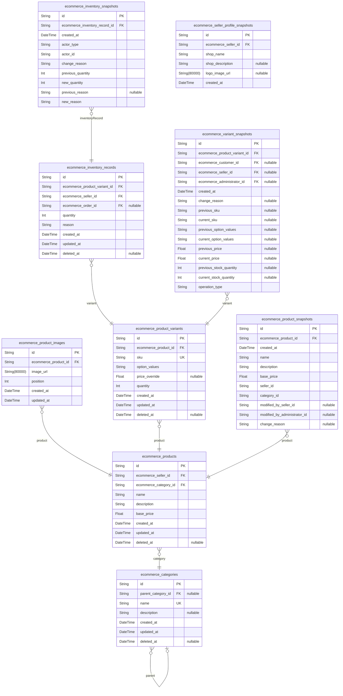
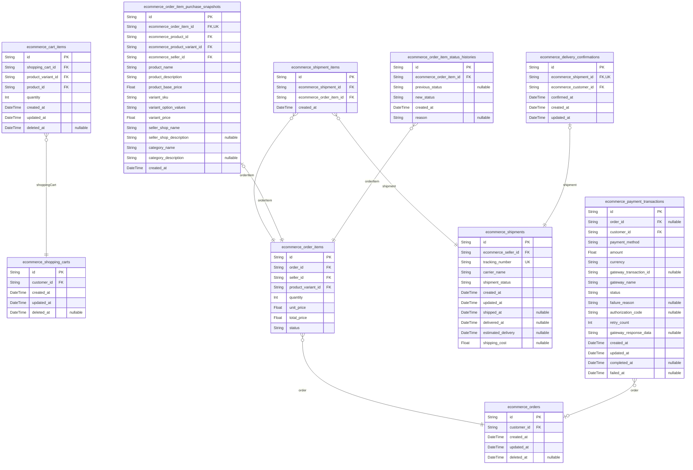
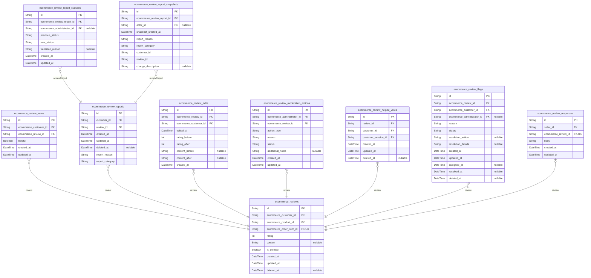

# Prisma Markdown

> Generated by [`prisma-markdown`](https://github.com/samchon/prisma-markdown)

- [Actors](#actors)
- [Systematic](#systematic)
- [Products](#products)
- [Orders](#orders)
- [Modifications](#modifications)
- [Reviews](#reviews)
- [Administration](#administration)

## Actors

```mermaid
erDiagram
"ecommerce_customers" {
  String id PK
  String email UK
  String password_hash
  String display_name
  String phone_number
  DateTime created_at
  DateTime updated_at
  DateTime deleted_at "nullable"
}
"ecommerce_customer_sessions" {
  String id PK
  String ecommerce_customer_id FK
  String ip
  String href
  String referrer
  DateTime created_at
  DateTime expired_at
}
"ecommerce_customer_password_resets" {
  String id PK
  String ecommerce_customer_id FK
  String token UK
  DateTime expires_at
  DateTime used_at "nullable"
  DateTime created_at
  DateTime updated_at
}
"ecommerce_sellers" {
  String id PK
  String email UK
  String password_hash
  String shop_name
  String shop_description "nullable"
  String(80000) logo_image_url "nullable"
  String account_status
  String approval_reason "nullable"
  DateTime created_at
  DateTime updated_at
  DateTime deleted_at "nullable"
}
"ecommerce_seller_sessions" {
  String id PK
  String ecommerce_seller_id FK
  String access_token UK
  String refresh_token UK
  String ip_address
  String user_agent
  String referrer "nullable"
  DateTime created_at
  DateTime expires_at
  DateTime last_accessed_at
}
"ecommerce_seller_password_resets" {
  String id PK
  String ecommerce_seller_id FK
  String token UK
  DateTime expires_at
  DateTime used_at "nullable"
  DateTime created_at
  DateTime updated_at
}
"ecommerce_administrators" {
  String id PK
  String email UK
  String password_hash
  DateTime created_at
  DateTime updated_at
  DateTime deleted_at "nullable"
}
"ecommerce_administrator_sessions" {
  String id PK
  String ecommerce_administrator_id FK
  String access_token UK
  String refresh_token UK
  String ip_address
  String user_agent
  DateTime created_at
  DateTime expires_at
  DateTime last_used_at
}
"ecommerce_super_administrators" {
  String id PK
  String email UK
  String password_hash
  DateTime created_at
  DateTime updated_at
  DateTime deleted_at "nullable"
}
"ecommerce_super_administrator_sessions" {
  String id PK
  String ecommerce_super_administrator_id FK
  String ip
  String href
  String referrer
  DateTime created_at
  DateTime expired_at
}
"ecommerce_administrator_password_resets" {
  String id PK
  String ecommerce_administrator_id FK
  String token UK
  DateTime expired_at
  DateTime used_at "nullable"
  DateTime created_at
  DateTime updated_at
}
"ecommerce_super_administrator_password_resets" {
  String id PK
  String ecommerce_super_administrator_id FK
  String token UK
  DateTime expires_at
  DateTime used_at "nullable"
  DateTime created_at
  DateTime updated_at
}
"ecommerce_customer_email_verifications" {
  String id PK
  String ecommerce_customer_id FK
  String token UK
  DateTime expires_at
  DateTime verified_at "nullable"
  DateTime created_at
  DateTime updated_at
}
"ecommerce_seller_email_verifications" {
  String id PK
  String ecommerce_seller_id FK,UK
  String token UK
  DateTime expires_at
  DateTime consumed_at "nullable"
  DateTime created_at
}
"ecommerce_customer_sessions" }o--|| "ecommerce_customers" : customer
"ecommerce_customer_password_resets" }o--|| "ecommerce_customers" : customer
"ecommerce_seller_sessions" }o--|| "ecommerce_sellers" : seller
"ecommerce_seller_password_resets" }o--|| "ecommerce_sellers" : seller
"ecommerce_administrator_sessions" }o--|| "ecommerce_administrators" : administrator
"ecommerce_super_administrator_sessions" }o--|| "ecommerce_super_administrators" : superAdministrator
"ecommerce_administrator_password_resets" }o--|| "ecommerce_administrators" : administrator
"ecommerce_super_administrator_password_resets" }o--|| "ecommerce_super_administrators" : superAdministrator
"ecommerce_customer_email_verifications" }o--|| "ecommerce_customers" : customer
"ecommerce_seller_email_verifications" |o--|| "ecommerce_sellers" : seller
```

### `ecommerce_customers`

Registered customer accounts with email/password authentication
credentials for product browsing, ordering, and reviews. Customers are
the primary consumer actors in the platform who can browse products,
create wishlists, add items to cart, place orders, write reviews, and
manage their profiles and addresses.

Each customer account requires email verification during registration and
maintains authentication credentials for secure platform access. Customer
profiles include display name and phone number for personalization and
communication purposes. When customers delete their accounts, their
profile information is removed but order history and reviews are
preserved for seller records and legal compliance.

This table serves as the canonical identity record for customers across
the platform and is referenced by orders, reviews, wishlists, and address
management systems. [ecommerce_customer_sessions](#ecommerce_customer_sessions) tracks login
sessions, [ecommerce_customer_password_resets](#ecommerce_customer_password_resets) handles credential
recovery, and [ecommerce_customer_email_verifications](#ecommerce_customer_email_verifications) manages
registration confirmation.

Properties as follows:

- `id`: Primary Key.
- `email`
  > Customer's email address used for authentication and communication. Must
  > be unique across all customer accounts.
- `password_hash`
  > Securely hashed password for customer authentication. Stored using
  > industry-standard hashing algorithms.
- `display_name`
  > Customer's display name shown throughout the platform for personalization
  > and identification.
- `phone_number`
  > Customer's phone number for order notifications and account verification
  > purposes.
- `created_at`: Timestamp when the customer account was created during registration.
- `updated_at`
  > Timestamp when the customer account was last updated, including profile
  > changes.
- `deleted_at`
  > Timestamp when the customer account was deleted, enabling soft deletion
  > while preserving order history.

### `ecommerce_customer_sessions`

JWT session tokens for customer authentication with access and refresh
token management.

This table stores customer login sessions for authentication purposes.
Each session record contains connection metadata including IP address,
referrer information, and timestamps for session lifecycle management.
Sessions are managed through authentication flows and provide secure
access tokens for customer interactions with the platform.

The session records serve as an append-only audit trail of customer login
events, supporting security monitoring and authentication state
management. Sessions automatically expire based on configured timeouts
and are used to validate customer access to platform features.

Properties as follows:

- `id`: Primary Key.
- `ecommerce_customer_id`: Belonged customer's [ecommerce_customers.id](#ecommerce_customers).
- `ip`: IP address of the customer connection for security tracking.
- `href`: Current page URL where the session was created.
- `referrer`: Referring URL that directed the customer to the session creation page.
- `created_at`: Timestamp when the session was created.
- `expired_at`: Timestamp when the session expires and becomes invalid.

### `ecommerce_customer_password_resets`

Password reset tokens with expiration for customer account password
recovery.

This table stores temporary password reset tokens that allow customers to
securely reset their passwords. Each token is uniquely generated and has
a limited validity period to ensure security. The system tracks token
usage to prevent reuse and maintains audit trails for security
monitoring.

Tokens are linked to specific customer accounts and include expiration
timestamps to enforce time-limited access. Once a token is used or
expires, it becomes invalid for future password reset attempts. This
approach ensures secure password recovery while preventing unauthorized
access attempts.

[ecommerce_customers.id](#ecommerce_customers)

Properties as follows:

- `id`: Primary Key.
- `ecommerce_customer_id`: Customer account requesting password reset. [ecommerce_customers.id](#ecommerce_customers)
- `token`: Unique password reset token generated for secure authentication.
- `expires_at`: Timestamp when the password reset token expires and becomes invalid.
- `used_at`
  > Timestamp when the password reset token was successfully used. Null if
  > unused.
- `created_at`: Timestamp when the password reset token was created.
- `updated_at`: Timestamp when the password reset token record was last updated.

### `ecommerce_sellers`

Seller accounts with email/password authentication credentials for
product management and order processing.

This table stores the core identity information for sellers on the
platform, including authentication credentials, shop profile details, and
account status tracking. Sellers must register with email and password,
and their accounts require administrator approval before they can sell
products. The table supports the complete seller lifecycle from
registration through active selling to account deletion with proper
constraints.

Sellers are managed through [ecommerce_seller_sessions](#ecommerce_seller_sessions) for
authentication sessions, [ecommerce_seller_password_resets](#ecommerce_seller_password_resets) for
credential recovery, and [ecommerce_seller_email_verifications](#ecommerce_seller_email_verifications) for
registration confirmation. Seller profile changes are tracked through
[ecommerce_seller_profile_snapshots](#ecommerce_seller_profile_snapshots) for data integrity.

Properties as follows:

- `id`: Primary Key.
- `email`
  > Seller's email address used for authentication and communication. Must be
  > unique across all seller accounts.
- `password_hash`: Hashed password for seller authentication using secure hashing algorithm.
- `shop_name`: Official name of the seller's shop as displayed to customers.
- `shop_description`: Optional description of the seller's shop for customer information.
- `logo_image_url`: URL to the seller's shop logo image for branding purposes.
- `account_status`
  > Current status of the seller account: 'pending_approval', 'approved',
  > 'rejected', 'suspended', or 'active'.
- `approval_reason`: Reason provided by administrator for approval or rejection decision.
- `created_at`: Timestamp when the seller account was created.
- `updated_at`: Timestamp when the seller account was last updated.
- `deleted_at`
  > Timestamp when the seller account was soft-deleted, preserving order
  > history.

### `ecommerce_seller_sessions`

Stores JWT session tokens for seller authentication with access and
refresh token management. Each session tracks seller login events with
connection metadata including IP address, user agent, and referrer
information for security auditing. Sessions automatically expire based on
configured timeout periods to maintain platform security.

This table implements the mandatory registration requirement by ensuring
all seller interactions are authenticated through valid sessions. The
session management supports the multi-actor ecosystem by providing secure
authentication for sellers to access their product management and order
processing capabilities.

The table maintains security through token expiration, connection
tracking, and audit trails. Each session is linked to a specific seller
account and provides the authentication context needed for sellers to
manage their shops, products, and customer orders.

Properties as follows:

- `id`: Primary Key.
- `ecommerce_seller_id`: Associated seller account for this session. [ecommerce_sellers.id](#ecommerce_sellers)
- `access_token`: JWT access token used for API authentication and authorization.
- `refresh_token`: JWT refresh token used to obtain new access tokens when expired.
- `ip_address`: IP address of the client connection for security tracking.
- `user_agent`: Client user agent string for browser/device identification.
- `referrer`: HTTP referrer URL indicating the source of the session initiation.
- `created_at`: Timestamp when the session was created.
- `expires_at`: Timestamp when the session expires and becomes invalid.
- `last_accessed_at`: Timestamp of the last API call using this session for activity tracking.

### `ecommerce_seller_password_resets`

Stores password reset tokens for seller account password recovery. Each
record contains a unique token, expiration timestamp, and references the
seller who requested the password reset. Tokens are used for secure
password recovery workflows and expire after a configurable period to
maintain security.

This table supports the mandatory password reset functionality required
for seller accounts. When a seller requests a password reset, a unique
token is generated and stored here with an expiration timestamp. The
seller receives the token via email and can use it to securely reset
their password within the validity period. Expired tokens are
automatically invalidated and cannot be reused.

Properties as follows:

- `id`: Primary Key.
- `ecommerce_seller_id`: Seller who requested the password reset. [ecommerce_sellers.id](#ecommerce_sellers)
- `token`
  > Unique password reset token used for verification. This token is sent to
  > the seller's email and must match exactly for password reset
  > authorization.
- `expires_at`
  > Timestamp when the password reset token expires. After this time, the
  > token becomes invalid and cannot be used for password recovery.
- `used_at`
  > Timestamp when the password reset token was successfully used. Null
  > indicates the token has not been used yet.
- `created_at`: Timestamp when the password reset request was created.
- `updated_at`: Timestamp when the password reset record was last updated.

### `ecommerce_administrators`

Administrator accounts with elevated privileges for platform management
and oversight. Administrators have access to system-wide management
capabilities including seller approvals, category administration, user
account oversight, and platform monitoring. This table stores the core
identity and authentication credentials for administrative users.

Administrators are distinct from customers and sellers in the multi-actor
ecosystem, requiring separate authentication flows and session
management. Each administrator account enables access to administrative
dashboard features and system configuration tools.

Administrator accounts are managed through a hierarchical system where
super administrators can promote regular administrators and manage
platform-wide settings. This table serves as the canonical identity
record for all administrative users across the platform.

Properties as follows:

- `id`: Primary Key.
- `email`
  > Administrator's email address used for authentication and communication.
  > Must be unique across all administrator accounts.
- `password_hash`
  > Securely hashed password for administrator authentication. Stored using
  > industry-standard hashing algorithms.
- `created_at`: Timestamp when the administrator account was created.
- `updated_at`: Timestamp when the administrator account was last updated.
- `deleted_at`
  > Timestamp when the administrator account was soft-deleted, allowing for
  > account restoration if needed.

### `ecommerce_administrator_sessions`

JWT session tokens for administrator authentication with access and
refresh token management. Stores active administrator sessions with
security context including IP address, user agent, and token expiration
timestamps. Each session belongs to exactly one administrator account and
supports secure authentication flows with refresh token rotation.

Sessions are managed through authentication workflows rather than direct
CRUD operations. They provide the security context for administrator
actions and are automatically expired based on configured timeouts.
Session records are append-only for audit trail purposes and support
secure logout mechanisms.

This table implements the standard session pattern for actor
authentication systems, providing the foundation for secure administrator
access to platform management features.

Properties as follows:

- `id`: Primary Key.
- `ecommerce_administrator_id`: Belonged administrator's [ecommerce_administrators.id](#ecommerce_administrators).
- `access_token`
  > JWT access token used for API authentication. Contains administrator
  > identity and permissions encoded as a secure token.
- `refresh_token`
  > JWT refresh token used to obtain new access tokens without
  > re-authentication. Supports secure token rotation.
- `ip_address`
  > IP address of the client device that initiated the session. Used for
  > security monitoring and access pattern analysis.
- `user_agent`
  > HTTP User-Agent header from the client device. Identifies browser/device
  > type for session context.
- `created_at`: Timestamp when the session was created during administrator login.
- `expires_at`
  > Timestamp when the session will automatically expire and require
  > re-authentication.
- `last_used_at`
  > Timestamp when the session was last used for API authentication. Used for
  > session activity tracking.

### `ecommerce_super_administrators`

Highest-level administrator accounts with system-wide configuration
privileges and authentication credentials.

Super administrators have the highest level of access in the platform,
including the ability to manage other administrators, perform system-wide
configurations, and oversee all platform operations. This table stores
the core authentication information and profile data for super
administrator accounts.

Each super administrator account requires email verification during
registration and maintains secure password authentication. Super
administrators can manage their own credentials and sessions through
dedicated support tables.

Properties as follows:

- `id`: Primary Key.
- `email`
  > Super administrator's email address used for authentication and
  > communication.
- `password_hash`: Hashed password for secure authentication.
- `created_at`: Timestamp when the super administrator account was created.
- `updated_at`: Timestamp when the super administrator account was last updated.
- `deleted_at`: Timestamp when the super administrator account was soft-deleted.

### `ecommerce_super_administrator_sessions`

JWT session tokens for super administrator authentication with connection
context and session lifecycle management.

This table stores active login sessions for super administrators,
tracking connection context, session lifecycle, and security metadata for
audit purposes. Each session is associated with a specific super
administrator account and follows the standard session table pattern.

Sessions are created during login and managed through authentication
flows, not direct user CRUD operations. The table maintains an
append-only audit trail of super administrator login events for security
monitoring.

[ecommerce_super_administrators.id](#ecommerce_super_administrators)

Properties as follows:

- `id`: Primary Key.
- `ecommerce_super_administrator_id`
  > Associated super administrator account. {@link
  > ecommerce_super_administrators.id}
- `ip`: IP address of the connection that created this session.
- `href`: Full URL of the page where the session was created.
- `referrer`: HTTP referrer header value from the session creation request.
- `created_at`: Timestamp when the session was created.
- `expired_at`: Timestamp when the session expires and requires renewal.

### `ecommerce_administrator_password_resets`

Password reset tokens with expiration for administrator account password
recovery.

This table stores secure tokens generated when administrators request
password reset functionality. Each token has a limited validity period
and can only be used once for security purposes. The tokens are linked to
specific administrator accounts and include temporal tracking for audit
purposes.

When an administrator requests password reset, a new token is generated
and stored here with an expiration timestamp. The token is sent to the
administrator's email for verification. Once used successfully, the token
is invalidated to prevent reuse.

Properties as follows:

- `id`: Primary Key.
- `ecommerce_administrator_id`
  > Reference to the administrator account requesting password reset. {@link
  > ecommerce_administrators.id}
- `token`: Secure token generated for password reset verification.
- `expired_at`: Timestamp when the password reset token expires and becomes invalid.
- `used_at`: Timestamp when the password reset token was successfully used.
- `created_at`: Timestamp when the password reset request was created.
- `updated_at`: Timestamp when the password reset record was last updated.

### `ecommerce_super_administrator_password_resets`

Password reset tokens with expiration for super administrator account
password recovery. This table stores temporary tokens that allow super
administrators to reset their passwords securely. Each token is
single-use and expires after a set period for security purposes.

Super administrators can request password reset tokens when they forget
their credentials. The system generates a unique token linked to their
account with an expiration timestamp. When the super administrator uses
the token to reset their password, the token is marked as used to prevent
reuse.

This table maintains an audit trail of password reset attempts and
ensures that only valid, unexpired tokens can be used for password
recovery operations. [ecommerce_super_administrators.id](#ecommerce_super_administrators)

Properties as follows:

- `id`: Primary Key.
- `ecommerce_super_administrator_id`
  > Target super administrator account for password reset. {@link
  > ecommerce_super_administrators.id}
- `token`
  > Unique password reset token used for secure password recovery link
  > generation.
- `expires_at`: Timestamp when the password reset token expires and becomes invalid.
- `used_at`
  > Timestamp when the password reset token was successfully used to reset
  > the password. Null if unused.
- `created_at`: Timestamp when the password reset token was created.
- `updated_at`: Timestamp when the password reset token record was last updated.

### `ecommerce_customer_email_verifications`

Email verification tokens for customer registration confirmation.

This table stores temporary verification tokens sent to customers during
the registration process to confirm their email address ownership. Each
token has a limited validity period and is automatically invalidated
after use or expiration.

The verification process ensures that customers provide valid email
addresses they can access, which is critical for order notifications,
password resets, and account security. Tokens are single-use and expire
after a configurable timeframe to prevent unauthorized account creation.

This table supports the mandatory registration requirement where all
users must authenticate through verified accounts before accessing
platform features. Verification tokens are generated during registration
and consumed when customers confirm their email addresses.

Related entities: [ecommerce_customers](#ecommerce_customers) for customer account
linkage, [ecommerce_customer_sessions](#ecommerce_customer_sessions) for post-verification
authentication.

Properties as follows:

- `id`: Primary Key.
- `ecommerce_customer_id`
  > Customer account requiring email verification. {@link
  > ecommerce_customers.id}.
- `token`
  > Unique verification token sent to customer's email address for
  > confirmation.
- `expires_at`: Timestamp when this verification token expires and becomes invalid.
- `verified_at`
  > Timestamp when the customer successfully verified their email using this
  > token. Null until verification is completed.
- `created_at`: Timestamp when this verification token was created.
- `updated_at`: Timestamp when this verification token was last updated.

### `ecommerce_seller_email_verifications`

Stores email verification tokens for seller registration confirmation
with expiration tracking to ensure timely validation.

This table supports the mandatory email verification requirement for
seller registration by generating unique tokens that sellers must
validate to activate their accounts. Each token has a limited validity
period to maintain security and prevent account creation abuse.

The verification process is initiated when a seller registers and
requires successful token validation before the account can be approved
for selling activities. Tokens are single-use and become invalid after
verification or expiration.

Properties as follows:

- `id`: Primary Key.
- `ecommerce_seller_id`
  > The seller account requiring email verification. {@link
  > ecommerce_sellers.id}
- `token`
  > Unique verification token generated for email validation. Used in
  > verification links sent to seller's email address.
- `expires_at`
  > Timestamp when this verification token expires. Tokens beyond this
  > timestamp cannot be used for verification.
- `consumed_at`
  > Timestamp when this token was successfully used for verification. Null
  > indicates the token is still valid and awaiting use.
- `created_at`
  > Timestamp when this verification token was generated and sent to the
  > seller.

## Systematic

```mermaid
erDiagram
"ecommerce_system_settings" {
  String id PK
  String setting_key UK
  String value_type
  String setting_value
  String description
  Boolean is_active
  DateTime created_at
  DateTime updated_at
  DateTime deleted_at "nullable"
}
"ecommerce_email_templates" {
  String id PK
  DateTime created_at
  DateTime updated_at
  DateTime deleted_at "nullable"
  String code UK
  String name
  String category
  String subject
  String html_content
  String text_content
  String description "nullable"
  Boolean is_active
  Int version
}
"ecommerce_audit_logs" {
  String id PK
  String customer_id FK "nullable"
  String seller_id FK "nullable"
  String administrator_id FK "nullable"
  String super_administrator_id FK "nullable"
  String event_type
  String event_subtype
  String severity
  String ip_address "nullable"
  String user_agent "nullable"
  String resource_type "nullable"
  String resource_id "nullable"
  String action_description
  String context_data "nullable"
  Boolean success
  String error_message "nullable"
  DateTime created_at
}
"ecommerce_system_metrics" {
  String id PK
  String metric_name
  String metric_category
  Float metric_value
  String metric_unit
  DateTime measurement_timestamp
  Int collection_interval
  String source_component
  String environment
  Boolean threshold_exceeded
  DateTime created_at
  DateTime updated_at
}
"ecommerce_metadata_registries" {
  String id PK
  String system_setting_id FK "nullable"
  String audit_log_id FK "nullable"
  String db_migration_id FK "nullable"
  String schema_name
  String schema_version
  String description "nullable"
  Boolean is_active
  DateTime created_at
  DateTime updated_at
}
"ecommerce_data_snapshots" {
  String id PK
  String created_by_customer_id FK "nullable"
  String created_by_seller_id FK "nullable"
  String created_by_administrator_id FK "nullable"
  String created_by_super_administrator_id FK "nullable"
  String entity_type
  String entity_id
  String change_description
  String data_before
  String data_after
  DateTime created_at
  DateTime updated_at
}
"ecommerce_business_rules" {
  String id PK
  String rule_code UK
  String rule_name
  String rule_description
  String rule_type
  String configuration_json
  Boolean is_active
  Int execution_order
  String version
  DateTime created_at
  DateTime updated_at
  DateTime deleted_at "nullable"
}
"ecommerce_platform_events" {
  String id PK
  String event_type
  String event_severity
  String event_source
  String event_payload "nullable"
  String correlation_id UK "nullable"
  DateTime processed_at "nullable"
  DateTime created_at
  DateTime updated_at
}
"ecommerce_db_migrations" {
  String id PK
  String migration_name UK
  String version UK
  String description
  DateTime executed_at
  String execution_status
  Boolean rollback_capable
  DateTime rollback_executed_at "nullable"
  Int execution_duration_ms "nullable"
  String error_message "nullable"
  String dependencies "nullable"
  String checksum
  DateTime created_at
  DateTime updated_at
  DateTime deleted_at "nullable"
}
"ecommerce_cache_configurations" {
  String id PK
  String cache_key UK
  String cache_type
  String configuration_value
  String description "nullable"
  Boolean is_active
  Int priority
  DateTime created_at
  DateTime updated_at
  DateTime deleted_at "nullable"
}
"ecommerce_metadata_registry_field_definitions" {
  String id PK
  String ecommerce_metadata_registry_id FK
  String field_name
  String field_type
  String description "nullable"
  Boolean is_required
  String default_value "nullable"
  String validation_rules "nullable"
  DateTime created_at
  DateTime updated_at
}
"ecommerce_metadata_registry_relationships" {
  String id PK
  String metadata_registry_id FK
  String relationship_type
  String relationship_direction
  String relationship_description
  DateTime created_at
  DateTime updated_at
  DateTime deleted_at "nullable"
}
"ecommerce_platform_event_of_customers" {
  String id PK
  String ecommerce_platform_event_id FK
  String ecommerce_customer_id FK
  DateTime created_at
}
"ecommerce_platform_event_of_sellers" {
  String id PK
  String ecommerce_platform_event_id FK
  String ecommerce_seller_id FK
  String ecommerce_seller_session_id FK "nullable"
  String initiator_ip "nullable"
  String initiator_href "nullable"
  String initiator_referrer "nullable"
  DateTime created_at
}
"ecommerce_platform_event_of_administrators" {
  String id PK
  String platform_event_id FK,UK
  String administrator_id FK
  String administrator_session_id FK "nullable"
  DateTime created_at
  DateTime updated_at
}
"ecommerce_platform_event_of_super_administrators" {
  String id PK
  String ecommerce_platform_event_id FK
  String ecommerce_super_administrator_id FK
  DateTime created_at
}
"ecommerce_cache_configuration_snapshots" {
  String id PK
  String ecommerce_cache_configuration_id FK
  String configuration_state_before
  String configuration_state_after
  String change_reason "nullable"
  String changed_by_actor_type
  String changed_by_actor_id
  DateTime created_at
}
"ecommerce_cache_configuration_parameters" {
  String id PK
  String ecommerce_cache_configuration_id FK
  String ecommerce_cache_configuration_parameter_definition_id FK
  String parameter_value
  DateTime created_at
  DateTime updated_at
  DateTime deleted_at "nullable"
}
"ecommerce_metadata_registry_relationship_of_products" {
  String id PK
  String ecommerce_metadata_registry_relationship_id FK
  String ecommerce_product_id FK
}
"ecommerce_metadata_registry_relationship_of_variants" {
  String id PK
  String ecommerce_metadata_registry_relationship_id FK
  String ecommerce_product_variant_id FK
  Boolean is_active
  Int priority
}
"ecommerce_metadata_registry_relationship_of_orders" {
  String id PK
  String ecommerce_metadata_registry_relationship_id FK,UK
  String ecommerce_order_id FK
}
"ecommerce_metadata_registry_relationship_of_customers" {
  String id PK
  String ecommerce_metadata_registry_relationship_id FK
  String ecommerce_customer_id FK
}
"ecommerce_metadata_registry_relationship_of_sellers" {
  String id PK
  String ecommerce_metadata_registry_relationship_id FK
  String ecommerce_seller_id FK
}
"ecommerce_metadata_registry_relationship_of_administrators" {
  String id PK
  String metadata_registry_relationship_id FK,UK
  String administrator_id FK
  DateTime created_at
  DateTime updated_at
}
"ecommerce_metadata_registry_relationship_of_super_administrators" {
  String id PK
  String ecommerce_metadata_registry_relationship_id FK
  String ecommerce_super_administrator_id FK
}
"ecommerce_metadata_registry_relationship_of_categories" {
  String id PK
  String ecommerce_metadata_registry_id FK
  String ecommerce_category_id FK
  String relationship_type
  DateTime created_at
  DateTime updated_at
}
"ecommerce_metadata_registry_relationship_of_shipping_carts" {
  String id PK
  String ecommerce_metadata_registry_relationship_id FK
  String ecommerce_shopping_cart_id FK
}
"ecommerce_metadata_registry_relationship_of_shipments" {
  String id PK
  String ecommerce_metadata_registry_relationship_id FK
  String ecommerce_shipment_id FK
}
"ecommerce_cache_configuration_parameter_definitions" {
  String id PK
  String parameter_name UK
  String data_type
  String description
  String default_value "nullable"
  String validation_rules "nullable"
  Boolean is_required
  String min_value "nullable"
  String max_value "nullable"
  String allowed_values "nullable"
  String pattern "nullable"
  DateTime created_at
  DateTime updated_at
  DateTime deleted_at "nullable"
}
"ecommerce_metadata_registry_relationship_of_variant_configs" {
  String id PK
  String ecommerce_metadata_registry_relationship_id FK
  String parameter_name
  String parameter_value
  String data_type
  String validation_rules "nullable"
  String default_value "nullable"
  String description "nullable"
  Boolean is_required
  DateTime created_at
  DateTime updated_at
  DateTime deleted_at "nullable"
}
"ecommerce_metadata_registries" }o--o| "ecommerce_system_settings" : systemSetting
"ecommerce_metadata_registries" }o--o| "ecommerce_audit_logs" : auditLog
"ecommerce_metadata_registries" }o--o| "ecommerce_db_migrations" : dbMigration
"ecommerce_metadata_registry_field_definitions" }o--|| "ecommerce_metadata_registries" : metadataRegistry
"ecommerce_metadata_registry_relationships" }o--|| "ecommerce_metadata_registries" : metadataRegistry
"ecommerce_platform_event_of_customers" }o--|| "ecommerce_platform_events" : platformEvent
"ecommerce_platform_event_of_sellers" }o--|| "ecommerce_platform_events" : platformEvent
"ecommerce_platform_event_of_administrators" |o--|| "ecommerce_platform_events" : platformEvent
"ecommerce_platform_event_of_super_administrators" }o--|| "ecommerce_platform_events" : platformEvent
"ecommerce_cache_configuration_snapshots" }o--|| "ecommerce_cache_configurations" : cacheConfiguration
"ecommerce_cache_configuration_parameters" }o--|| "ecommerce_cache_configurations" : cacheConfiguration
"ecommerce_cache_configuration_parameters" }o--|| "ecommerce_cache_configuration_parameter_definitions" : parameterDefinition
"ecommerce_metadata_registry_relationship_of_products" }o--|| "ecommerce_metadata_registry_relationships" : parentRelationship
"ecommerce_metadata_registry_relationship_of_variants" }o--|| "ecommerce_metadata_registry_relationships" : metadataRegistryRelationship
"ecommerce_metadata_registry_relationship_of_orders" |o--|| "ecommerce_metadata_registry_relationships" : metadataRegistryRelationship
"ecommerce_metadata_registry_relationship_of_customers" }o--|| "ecommerce_metadata_registry_relationships" : metadataRegistryRelationship
"ecommerce_metadata_registry_relationship_of_sellers" }o--|| "ecommerce_metadata_registry_relationships" : metadataRegistryRelationship
"ecommerce_metadata_registry_relationship_of_administrators" |o--|| "ecommerce_metadata_registry_relationships" : metadataRegistryRelationship
"ecommerce_metadata_registry_relationship_of_super_administrators" }o--|| "ecommerce_metadata_registry_relationships" : relationship
"ecommerce_metadata_registry_relationship_of_categories" }o--|| "ecommerce_metadata_registries" : metadataRegistry
"ecommerce_metadata_registry_relationship_of_shipping_carts" }o--|| "ecommerce_metadata_registry_relationships" : metadataRegistryRelationship
"ecommerce_metadata_registry_relationship_of_shipments" }o--|| "ecommerce_metadata_registry_relationships" : metadataRegistryRelationship
"ecommerce_metadata_registry_relationship_of_variant_configs" }o--|| "ecommerce_metadata_registry_relationships" : metadataRegistryRelationship
```

### `ecommerce_system_settings`

System-wide configuration settings that control platform behavior and
features. This table stores key-value pairs for various system
configurations including feature flags, business rules, platform
parameters, and operational settings. Each setting has a unique key and
supports multiple value types with validation constraints.

Settings are managed by administrators and control critical platform
functionality such as registration requirements, payment processing
parameters, inventory management rules, and customer experience features.
Changes to settings are logged through the audit system for compliance
and troubleshooting purposes.

The table supports hierarchical configuration keys using dot notation
(e.g., 'payment.gateway.timeout', 'inventory.restock.threshold') to
organize related settings logically. Settings can be scoped globally or
targeted to specific platform components as needed.

[ecommerce_system_settings.id](#ecommerce_system_settings)

Properties as follows:

- `id`: Primary Key.
- `setting_key`
  > Unique identifier for the configuration setting using dot notation for
  > hierarchical organization (e.g., 'payment.gateway.timeout',
  > 'inventory.restock.threshold').
- `value_type`
  > Data type of the setting value. Supported types: 'string', 'boolean',
  > 'int', 'double', 'uri'. Determines how the value is validated and
  > processed.
- `setting_value`
  > The actual configuration value stored as a string. The value is parsed
  > according to the value_type field for proper type handling.
- `description`
  > Human-readable description explaining the purpose and usage of this
  > configuration setting.
- `is_active`
  > Whether this setting is currently active and being used by the system.
  > Inactive settings are ignored during configuration loading.
- `created_at`: Timestamp when this configuration setting was first created.
- `updated_at`: Timestamp when this configuration setting was last modified.
- `deleted_at`
  > Timestamp when this configuration setting was soft-deleted. Allows for
  > configuration history preservation.

### `ecommerce_email_templates`

Stores email template definitions for various platform notifications and
communications.

This table contains customizable email templates used for automated
notifications sent by the platform. Each template includes subject line,
HTML content, plain text fallback, and metadata for proper email
delivery. Templates support variable substitution for personalized
content and can be activated/deactivated as needed.

Templates cover various platform scenarios including registration
confirmations, order status updates, password resets, seller approval
notifications, and administrative alerts. The system maintains version
control through template updates while preserving historical template
content for audit purposes.

Templates are referenced by the email sending system to generate
consistent, branded communications across all customer, seller, and
administrative interactions.

Properties as follows:

- `id`: Primary Key.
- `created_at`: Timestamp when this email template was initially created.
- `updated_at`: Timestamp when this email template was last modified.
- `deleted_at`: Timestamp when this email template was soft-deleted.
- `code`
  > Unique identifier code for this email template used for system
  > referencing.
- `name`: Human-readable descriptive name for this email template.
- `category`: Category classification for organizing templates by notification type.
- `subject`: Email subject line template with optional variable placeholders.
- `html_content`: HTML formatted email body content with variable substitution support.
- `text_content`: Plain text fallback content for email clients that don't support HTML.
- `description`
  > Optional detailed description explaining this template's purpose and
  > usage.
- `is_active`: Indicates whether this template is currently active and available for use.
- `version`: Template version number for tracking modifications and updates.

### `ecommerce_audit_logs`

Immutable audit trail records for all significant system-level events and
administrative actions across the e-commerce platform.

This table serves as the central repository for security monitoring,
compliance tracking, and operational oversight. It captures events such
as user authentication attempts, administrative interventions, system
configuration changes, and security-related incidents. Each record is
immutable once created and provides a complete audit trail for forensic
analysis and regulatory compliance.

The audit logs support filtering by event type, actor, timestamp ranges,
and severity levels. Administrators can use this data to monitor platform
health, detect suspicious activities, and investigate security incidents.
The logs preserve detailed context information specific to each event
type, enabling comprehensive reconstruction of system activities.

All records reference the appropriate actor table ({@link
ecommerce_customers}, [ecommerce_sellers](#ecommerce_sellers), {@link
ecommerce_administrators}, or [ecommerce_super_administrators](#ecommerce_super_administrators)) to
identify the user responsible for each action. Events without a specific
actor (system-generated events) may have null actor references.

Properties as follows:

- `id`: Primary Key.
- `customer_id`
  > Reference to the customer who performed the action, if applicable. {@link
  > ecommerce_customers.id}
- `seller_id`
  > Reference to the seller who performed the action, if applicable. {@link
  > ecommerce_sellers.id}
- `administrator_id`
  > Reference to the administrator who performed the action, if applicable.
  > [ecommerce_administrators.id](#ecommerce_administrators)
- `super_administrator_id`
  > Reference to the super administrator who performed the action, if
  > applicable. [ecommerce_super_administrators.id](#ecommerce_super_administrators)
- `event_type`
  > Category of the audit event, such as authentication,
  > administrative_action, system_event, or security_incident.
- `event_subtype`: Specific subtype of the event for detailed categorization and filtering.
- `severity`
  > Severity level of the event (info, warning, error, critical) for
  > prioritization and alerting.
- `ip_address`: IP address from which the action was performed for security tracking.
- `user_agent`: User agent string of the client that performed the action.
- `resource_type`
  > Type of resource affected by the action (user, product, order, category,
  > etc.).
- `resource_id`: Identifier of the specific resource affected by the action.
- `action_description`: Human-readable description of the action performed.
- `context_data`
  > JSON-formatted context data providing detailed information about the
  > event.
- `success`: Whether the action was successful or resulted in an error.
- `error_message`: Error message if the action failed, providing details about the failure.
- `created_at`: Timestamp when the audit event occurred.

### `ecommerce_system_metrics`

Platform performance metrics and operational statistics for monitoring
system health and operational efficiency. This table stores various
performance indicators including response times, throughput metrics,
error rates, and resource utilization statistics that help administrators
monitor platform performance and identify potential issues.

The metrics collected here support proactive system monitoring and
provide historical data for performance trend analysis. Each metric
record captures a specific measurement at a point in time, allowing for
tracking performance changes and identifying optimization opportunities.

This table integrates with the broader systematic infrastructure to
provide comprehensive platform oversight capabilities. {@link
ecommerce_system_settings} provides configuration context for metric
collection thresholds, while [ecommerce_audit_logs](#ecommerce_audit_logs) captures
detailed event information that complements these aggregated metrics.

Properties as follows:

- `id`: Primary Key.
- `metric_name`
  > Name of the performance metric being recorded (e.g., 'api_response_time',
  > 'database_connections', 'memory_usage').
- `metric_category`
  > Category grouping for the metric (e.g., 'performance', 'availability',
  > 'throughput', 'errors').
- `metric_value`: Numerical value of the metric measurement.
- `metric_unit`
  > Unit of measurement for the metric value (e.g., 'milliseconds',
  > 'percentage', 'count', 'megabytes').
- `measurement_timestamp`: Exact timestamp when the metric measurement was taken.
- `collection_interval`
  > Time interval in seconds over which the metric was collected (e.g., 60
  > for per-minute metrics).
- `source_component`
  > Component or service that generated the metric (e.g., 'api_gateway',
  > 'product_service', 'order_service').
- `environment`
  > Deployment environment where the metric was collected (e.g.,
  > 'production', 'staging', 'development').
- `threshold_exceeded`
  > Indicates whether the metric value exceeded configured performance
  > thresholds.
- `created_at`: Timestamp when this metric record was created in the database.
- `updated_at`: Timestamp when this metric record was last updated.

### `ecommerce_metadata_registries`

Central registry for tracking data schemas, versions, and structural
relationships between entities across the e-commerce platform.

This table serves as the foundation for schema evolution tracking,
providing a systematic approach to managing data structure changes and
entity relationships. It enables platform administrators to monitor
schema versions, track structural dependencies, and maintain data
integrity across system components.

Each registry entry represents a specific schema definition or
relationship mapping, with version control ensuring backward
compatibility and audit trail preservation. The registry supports complex
entity relationships through structured relationship definitions and
dependency tracking.

[ecommerce_system_settings](#ecommerce_system_settings) for platform-wide configuration
management.
[ecommerce_audit_logs](#ecommerce_audit_logs) for comprehensive audit trail integration.
[ecommerce_db_migrations](#ecommerce_db_migrations) for schema change coordination.

Properties as follows:

- `id`: Primary Key.
- `system_setting_id`
  > Reference to system-wide configuration settings. {@link
  > ecommerce_system_settings.id}
- `audit_log_id`: Reference to related audit log entries. [ecommerce_audit_logs.id](#ecommerce_audit_logs)
- `db_migration_id`
  > Reference to database migration records. {@link
  > ecommerce_db_migrations.id}
- `schema_name`: Unique identifier for the schema or entity being tracked.
- `schema_version`: Version identifier following semantic versioning format (e.g., 1.0.0).
- `description`: Human-readable description of the schema's purpose and usage.
- `is_active`: Indicates whether this schema version is currently active and in use.
- `created_at`: Timestamp when the schema registry entry was created.
- `updated_at`: Timestamp when the schema registry entry was last updated.

### `ecommerce_data_snapshots`

Generic snapshot storage for tracking data changes across all editable
entities in the system. This table implements the platform's snapshot
principle by creating immutable records whenever any editable data is
modified, preserving the complete state before and after changes for
audit trails and dispute resolution.

Each snapshot captures the modification context including timestamp, user
who made the change, entity type and identifier being modified, and the
complete data state transition. Snapshots are linked to specific entities
through polymorphic foreign key relationships and support various entity
types including products, variants, seller profiles, order items,
reviews, cancellation requests, and refund requests.

The snapshot system ensures financial integrity by providing immutable
audit trails for all data modifications, enabling dispute resolution and
historical tracking while maintaining data consistency across the
platform.

Properties as follows:

- `id`: Primary Key.
- `created_by_customer_id`
  > Customer who created the snapshot if applicable. {@link
  > ecommerce_customers.id}
- `created_by_seller_id`
  > Seller who created the snapshot if applicable. {@link
  > ecommerce_sellers.id}
- `created_by_administrator_id`
  > Administrator who created the snapshot if applicable. {@link
  > ecommerce_administrators.id}
- `created_by_super_administrator_id`
  > Super administrator who created the snapshot if applicable. {@link
  > ecommerce_super_administrators.id}
- `entity_type`
  > Type of entity being snapshotted (e.g., 'product', 'variant',
  > 'seller_profile', 'order_item', 'review', 'cancellation_request',
  > 'refund_request').
- `entity_id`
  > Unique identifier of the entity being snapshotted. References the primary
  > key of the corresponding entity table.
- `change_description`: Description of what was changed in this modification event.
- `data_before`: Complete JSON representation of the entity state before the modification.
- `data_after`: Complete JSON representation of the entity state after the modification.
- `created_at`: Timestamp when the snapshot was created.
- `updated_at`: Timestamp when the snapshot was last updated.

### `ecommerce_business_rules`

Configurable business rules and validation logic that can be modified
without code changes.

This table serves as a central repository for platform business rules
that administrators can configure and modify through the administrative
interface. Each rule represents a specific piece of business logic or
validation that controls platform behavior. Rules can be enabled or
disabled independently, and their configuration parameters can be
adjusted without requiring code deployments.

The system uses these rules to enforce various platform policies,
validation requirements, and business logic flows. When a rule is
modified, the system creates snapshots to preserve the previous state for
audit purposes. [ecommerce_data_snapshots](#ecommerce_data_snapshots) captures the historical
changes to business rule configurations.

Properties as follows:

- `id`: Primary Key.
- `rule_code`
  > Unique identifier code for the business rule used for programmatic
  > reference.
- `rule_name`: Human-readable name of the business rule for administrative display.
- `rule_description`
  > Detailed description explaining the purpose and usage of the business
  > rule.
- `rule_type`
  > Category of the business rule (validation, workflow, calculation,
  > restriction, etc.).
- `configuration_json`: JSON configuration data containing the rule parameters and logic settings.
- `is_active`
  > Whether the business rule is currently active and being enforced by the
  > system.
- `execution_order`
  > Order in which this rule should be executed relative to other rules of
  > the same type.
- `version`
  > Version identifier for the rule configuration to track changes and
  > compatibility.
- `created_at`: Timestamp when the business rule was first created.
- `updated_at`: Timestamp when the business rule was last modified.
- `deleted_at`: Timestamp when the business rule was soft-deleted, null if active.

### `ecommerce_platform_events`

Event tracking system for major platform lifecycle events and integrations.

This table captures significant platform events including system
operations, integration activities, and major business process
milestones. Each event record provides an immutable audit trail for
platform monitoring, debugging, and compliance purposes.

Events are categorized by type and severity, with detailed payload data
stored for analysis. The system supports filtering by event source, type,
and timestamp ranges for efficient monitoring and reporting.

Platform events can be initiated by various actors in the system,
including customers, sellers, administrators, and system processes.
Events are immutable once recorded for audit integrity.

Properties as follows:

- `id`: Primary Key.
- `event_type`
  > Category of the platform event (e.g., 'system_startup',
  > 'integration_webhook', 'user_registration', 'order_processing',
  > 'payment_gateway'). Must be one of: 'system_startup',
  > 'integration_webhook', 'user_registration', 'user_login', 'user_logout',
  > 'order_creation', 'order_payment', 'order_shipment', 'order_delivery',
  > 'order_cancellation', 'order_refund', 'product_creation',
  > 'product_update', 'product_deletion', 'review_creation', 'review_update',
  > 'review_deletion', 'payment_gateway', 'email_service',
  > 'inventory_system', 'authentication_service', 'system_maintenance',
  > 'system_error', 'security_alert', 'compliance_check'.
- `event_severity`
  > Severity level of the event (e.g., 'info', 'warning', 'error',
  > 'critical'). Must be one of: 'info', 'warning', 'error', 'critical'.
- `event_source`
  > Source system or component that generated the event (e.g.,
  > 'payment_gateway', 'email_service', 'inventory_system',
  > 'authentication_service').
- `event_payload`: JSON payload containing detailed event data and context information.
- `correlation_id`
  > Unique identifier for correlating related events across different systems
  > and processes.
- `processed_at`: Timestamp when the event was processed by the event handling system.
- `created_at`: Timestamp when the event was initially recorded in the system.
- `updated_at`: Timestamp when the event record was last updated.

### `ecommerce_db_migrations`

Tracks database migrations and schema changes for rollback capabilities
and audit purposes. Each record represents a single migration file that
has been executed against the database, including version information,
execution status, rollback capability, and dependency tracking.

This table serves as the authoritative record of all schema changes
applied to the database, enabling safe rollback operations and providing
a complete audit trail for database evolution. Migrations are executed in
dependency order, with each migration potentially depending on previous
migrations to ensure proper schema evolution.

The table supports both forward (migrate) and backward (rollback)
operations, tracking the execution state and any errors encountered
during migration execution. This ensures database schema integrity and
provides recovery mechanisms for failed migrations.

Properties as follows:

- `id`: Primary Key.
- `migration_name`
  > Name of the migration file, typically following naming conventions like
  > timestamp_description format.
- `version`
  > Migration version identifier, often using semantic versioning or
  > timestamp-based versioning.
- `description`
  > Human-readable description of what the migration accomplishes and what
  > schema changes it implements.
- `executed_at`
  > Timestamp when the migration was successfully executed against the
  > database.
- `execution_status`
  > Current execution status of the migration (pending, executing, completed,
  > failed, rolled_back).
- `rollback_capable`
  > Indicates whether this migration has a corresponding rollback script that
  > can reverse the changes.
- `rollback_executed_at`: Timestamp when the migration was rolled back, if applicable.
- `execution_duration_ms`
  > Duration of migration execution in milliseconds for performance
  > monitoring.
- `error_message`: Error message captured if the migration execution failed.
- `dependencies`
  > Comma-separated list of migration names or versions that this migration
  > depends on.
- `checksum`
  > Hash or checksum of the migration file content to detect modifications or
  > corruption.
- `created_at`: Timestamp when the migration record was created in the tracking system.
- `updated_at`: Timestamp when the migration record was last updated.
- `deleted_at`
  > Timestamp when the migration record was soft-deleted, preserving audit
  > history.

### `ecommerce_cache_configurations`

Configuration settings for various caching mechanisms and performance
optimizations across the platform.

Stores cache configuration parameters as key-value pairs with support for
different cache types including Redis, in-memory caching, file-based
caching, and other optimization mechanisms. Each configuration entry
includes cache type specification, time-to-live (TTL) settings, memory
limits, and performance tuning parameters.

Used by the platform infrastructure to optimize performance through
intelligent caching strategies while maintaining data consistency and
cache invalidation protocols. All configuration changes are tracked
through the snapshot system for audit purposes.

This table represents the core cache configuration management system that
supports Redis, memory, file, database, and distributed caching
strategies across the e-commerce platform.

Properties as follows:

- `id`: Primary Key.
- `cache_key`
  > Unique identifier for the cache configuration entry, following a
  > hierarchical naming convention (e.g., 'redis.session',
  > 'memory.product_catalog').
- `cache_type`
  > Type of caching mechanism (e.g., 'redis', 'memory', 'file', 'database',
  > 'distributed').
- `configuration_value`
  > JSON-formatted configuration parameters specific to the cache type,
  > including TTL, memory limits, and optimization settings.
- `description`
  > Human-readable description explaining the purpose and usage of this cache
  > configuration.
- `is_active`
  > Whether this cache configuration is currently active and being used by
  > the platform.
- `priority`
  > Configuration priority level (1-10) for determining precedence when
  > multiple configurations apply to the same cache scope.
- `created_at`: Timestamp when this cache configuration was created.
- `updated_at`: Timestamp when this cache configuration was last updated.
- `deleted_at`
  > Timestamp when this cache configuration was soft-deleted (for
  > configuration history preservation).

### `ecommerce_metadata_registry_field_definitions`

Atomic field definitions extracted from metadata registry schema
definitions to maintain 3NF compliance.

This table stores individual field-level metadata definitions that have
been decomposed from the parent metadata registry schemas. Each record
represents a single field definition with its properties, constraints,
and metadata. This decomposition ensures proper normalization by
separating the complex JSON schema structures into atomic field
definitions.

The field definitions include comprehensive metadata such as data types,
validation rules, default values, and business descriptions. This enables
systematic tracking of field-level changes and provides a foundation for
schema validation and code generation workflows.

Relationships: Each field definition belongs to exactly one metadata
registry schema definition. [ecommerce_metadata_registries.id](#ecommerce_metadata_registries)

Properties as follows:

- `id`: Primary Key.
- `ecommerce_metadata_registry_id`
  > Parent metadata registry schema definition. {@link
  > ecommerce_metadata_registries.id}
- `field_name`: Name of the field as defined in the metadata registry schema.
- `field_type`: Data type of the field (string, number, boolean, object, array, etc.).
- `description`: Business description explaining the field's purpose and usage.
- `is_required`: Indicates whether this field is mandatory in the schema.
- `default_value`: Default value for the field when not explicitly provided.
- `validation_rules`: JSON string containing field validation constraints and rules.
- `created_at`: Timestamp when this field definition was created.
- `updated_at`: Timestamp when this field definition was last updated.

### `ecommerce_metadata_registry_relationships`

Core relationship mappings that define associations between metadata
registry entries and various system entities.

This table serves as the base for a normalized relationship system that
supports comprehensive data governance across the e-commerce platform.
Relationships are managed as independent business entities, allowing
administrators to define, modify, and track connections between metadata
registry entries and specific entity types in the system.

The relationship system supports directional relationships (forward,
reverse, bidirectional) and various relationship types (dependency,
reference, constraint, mapping) to capture the full semantic context of
entity connections. Each relationship maintains its own lifecycle and can
be independently managed through dedicated API operations.

Relationships benefit from the platform's snapshot system, ensuring
complete audit trails for compliance and debugging purposes. The
normalized design eliminates polymorphic anti-patterns while maintaining
the flexibility needed for comprehensive data governance.

This table forms the foundation for relationship-specific child tables
that handle connections to individual entity types (products, orders,
users, etc.), ensuring proper referential integrity and 3NF compliance
throughout the system.

Properties as follows:

- `id`: Primary Key.
- `metadata_registry_id`
  > Reference to the metadata registry entry that this relationship belongs
  > to. [ecommerce_metadata_registries.id](#ecommerce_metadata_registries)
- `relationship_type`
  > Classification of the relationship nature (e.g., 'parent_child',
  > 'dependency', 'reference', 'constraint', 'mapping'). Determines
  > relationship semantics and behavior.
- `relationship_direction`
  > Directionality of the relationship ('undirected', 'forward', 'reverse',
  > 'bidirectional'). Controls relationship traversal and semantic
  > interpretation.
- `relationship_description`
  > Human-readable description explaining the purpose and context of this
  > relationship mapping. Provides business context for administrator
  > understanding.
- `created_at`
  > Timestamp when this relationship mapping was created. Auto-populated on
  > record creation.
- `updated_at`
  > Timestamp when this relationship mapping was last modified. Auto-updated
  > on record changes.
- `deleted_at`
  > Timestamp when this relationship mapping was soft-deleted. Null indicates
  > active relationship.

### `ecommerce_platform_event_of_customers`

Associates platform events with customer initiators when events are
triggered by customer actions. This table establishes the relationship
between platform events and the customers who initiated them, supporting
audit trails and event attribution.

Each record links a specific platform event to the customer who triggered
it, providing complete traceability for customer-initiated platform
activities. This association is essential for understanding user
behavior, tracking customer interactions with the platform, and
maintaining comprehensive audit logs for security and analytical
purposes.

The table serves as a bridge between the generic platform event tracking
system and the customer actor system, ensuring that all
customer-triggered events can be properly attributed to specific customer
accounts for reporting, analytics, and compliance requirements.

Properties as follows:

- `id`: Primary Key.
- `ecommerce_platform_event_id`
  > Reference to the platform event that was triggered by the customer.
  > [ecommerce_platform_events.id](#ecommerce_platform_events)
- `ecommerce_customer_id`
  > Reference to the customer who initiated the platform event. {@link
  > ecommerce_customers.id}
- `created_at`: Timestamp when the customer-event association was created.

### `ecommerce_platform_event_of_sellers`

Associates platform events with seller initiators when events are
triggered by seller actions. This table establishes the relationship
between sellers and the platform events they generate, allowing for
tracking of seller-initiated system activities and audit trails.

Each record links a specific platform event to the seller who initiated
it, providing context for event analysis and administrative oversight.
This relationship is essential for understanding seller behavior patterns
and maintaining comprehensive audit trails for seller-triggered platform
events.

The table captures the specific seller session that triggered the event,
ensuring complete audit trail integrity and connection context
preservation.

Properties as follows:

- `id`: Primary Key.
- `ecommerce_platform_event_id`: Associated platform event's [ecommerce_platform_events.id](#ecommerce_platform_events).
- `ecommerce_seller_id`: Seller initiator's [ecommerce_sellers.id](#ecommerce_sellers).
- `ecommerce_seller_session_id`
  > Seller session that initiated the event's {@link
  > ecommerce_seller_sessions.id}.
- `initiator_ip`: IP address of the seller who initiated the event for security tracking.
- `initiator_href`: URL path where the event was triggered for context analysis.
- `initiator_referrer`: Referrer URL that led to the event trigger for user journey tracking.
- `created_at`: Timestamp when this seller-event association was created.

### `ecommerce_platform_event_of_administrators`

Associates platform events with administrator initiators when events are
triggered by administrative actions.

This table implements the polymorphic ownership pattern for platform
events, allowing the system to track which administrator initiated
specific platform-level events. It maintains the relationship between
platform events ([ecommerce_platform_events.id](#ecommerce_platform_events)) and administrator
actors ([ecommerce_administrators.id](#ecommerce_administrators)), preserving the audit trail
and event context for administrative actions.

Administrator-initiated events include system configuration changes,
platform oversight actions, and other administrative operations that
require event tracking and audit capability. The session reference
([ecommerce_administrator_sessions.id](#ecommerce_administrator_sessions)) provides additional context
about the specific administrator session that triggered the event.

Properties as follows:

- `id`: Primary Key.
- `platform_event_id`
  > The platform event that was initiated by an administrator. {@link
  > ecommerce_platform_events.id}
- `administrator_id`
  > The administrator who initiated the platform event. {@link
  > ecommerce_administrators.id}
- `administrator_session_id`
  > The administrator session context that initiated the platform event.
  > [ecommerce_administrator_sessions.id](#ecommerce_administrator_sessions)
- `created_at`
  > Timestamp when the administrator association was created for the platform
  > event.
- `updated_at`: Timestamp when the administrator association was last updated.

### `ecommerce_platform_event_of_super_administrators`

Associates platform events with super administrator initiators when
events are triggered by system-level administrative actions. This table
establishes the relationship between platform events recorded in {@link
ecommerce_platform_events} and the super administrators who initiated
them, providing audit trail capabilities for system-level administrative
actions.

Each record in this table represents a specific platform event that was
triggered by a super administrator, allowing for comprehensive tracking
of administrative actions across the platform. This relationship enables
querying all events initiated by a particular super administrator or
identifying the initiator of any given platform event.

Properties as follows:

- `id`: Primary Key.
- `ecommerce_platform_event_id`
  > Reference to the platform event initiated by the super administrator.
  > [ecommerce_platform_events.id](#ecommerce_platform_events)
- `ecommerce_super_administrator_id`
  > Reference to the super administrator who initiated the platform event.
  > [ecommerce_super_administrators.id](#ecommerce_super_administrators)
- `created_at`
  > Timestamp when the association between the platform event and super
  > administrator was created.

### `ecommerce_cache_configuration_snapshots`

Immutable snapshots of cache configuration changes for audit trails and
data integrity preservation.

This table captures the complete state of cache configurations before and
after modifications, ensuring that all changes to cache settings are
permanently recorded for compliance and debugging purposes. Each snapshot
preserves the configuration values, relationships, and operational
parameters at a specific point in time.

Snapshots are created whenever [ecommerce_cache_configurations](#ecommerce_cache_configurations)
records are modified, providing a complete audit trail of configuration
evolution. These records are immutable and cannot be modified or deleted,
supporting the platform's financial integrity requirements.

Properties as follows:

- `id`: Primary Key.
- `ecommerce_cache_configuration_id`
  > Reference to the cache configuration being snapshotted. {@link
  > ecommerce_cache_configurations.id}
- `configuration_state_before`
  > Complete JSON representation of the cache configuration state before
  > modification.
- `configuration_state_after`
  > Complete JSON representation of the cache configuration state after
  > modification.
- `change_reason`: Description of why the configuration change was made.
- `changed_by_actor_type`
  > Type of actor who made the configuration change (customer, seller,
  > administrator, super_administrator).
- `changed_by_actor_id`: Identifier of the actor who made the configuration change.
- `created_at`: Timestamp when the snapshot was created.

### `ecommerce_cache_configuration_parameters`

Stores cache configuration parameter values as atomic values for 1NF
compliance. Each record represents a single parameter-value pair
belonging to a specific cache configuration. This table enables efficient
parameter-level querying and indexing without JSON parsing.

The table maintains the actual parameter values while referencing
parameter definitions from the separate parameter definition table for
metadata. This separation ensures proper normalization and supports
parameter versioning and validation.

Parameter values are stored as strings with type conversion handled by
the application layer based on the parameter definition's data type. This
design supports the platform's snapshot system by allowing
parameter-level auditing and change tracking.

**Relationships:**
- Belongs to a cache configuration [ecommerce_cache_configurations](#ecommerce_cache_configurations)
- References parameter definitions {@link
ecommerce_cache_configuration_parameter_definitions}
- Supports parameter-level snapshots for audit trails

Properties as follows:

- `id`: Primary Key.
- `ecommerce_cache_configuration_id`
  > Parent cache configuration that owns this parameter value. {@link
  > ecommerce_cache_configurations.id}
- `ecommerce_cache_configuration_parameter_definition_id`
  > Parameter definition that specifies metadata and validation rules for
  > this value. {@link
  > ecommerce_cache_configuration_parameter_definitions.id}
- `parameter_value`
  > String representation of the parameter value. The application converts
  > this to the appropriate data type based on the parameter definition.
- `created_at`: Timestamp when this parameter value was created.
- `updated_at`: Timestamp when this parameter value was last modified.
- `deleted_at`: Timestamp when this parameter value was soft-deleted, or null if active.

### `ecommerce_metadata_registry_relationship_of_products`

Specific relationship mappings connecting metadata registry entries to
product entities.

This table establishes the many-to-many relationship between metadata
registry entries and product entities, allowing metadata to be associated
with products for tracking schema versions, structural relationships, and
data integrity purposes. Each relationship represents a specific metadata
association that applies to a product, supporting the platform's
comprehensive metadata tracking system.

The relationships stored here enable the systematic component to track
which metadata registry entries apply to which products, facilitating
proper data validation, schema versioning, and structural relationship
management across the product catalog.

Properties as follows:

- `id`: Primary Key.
- `ecommerce_metadata_registry_relationship_id`
  > Parent relationship entry. {@link
  > ecommerce_metadata_registry_relationships.id}
- `ecommerce_product_id`: Associated product entity. [ecommerce_products.id](#ecommerce_products)

### `ecommerce_metadata_registry_relationship_of_variants`

Specific relationship mappings connecting metadata registry relationship
entries to product variant entities. This table establishes formal
relationships between systematic metadata registry definitions and
individual product variants in the catalog, enabling metadata-driven
behavior and validation for variant entities.

Each record represents a specific association between a metadata registry
relationship entry and a product variant, allowing systematic metadata to
be applied to product catalog entities. This supports features like
dynamic validation rules, metadata-driven UI behaviors, and systematic
constraints on product variant properties.

The relationships are managed through the systematic component but
reference entities from the products domain, creating cross-component
integration points while maintaining proper domain boundaries.

Properties as follows:

- `id`: Primary Key.
- `ecommerce_metadata_registry_relationship_id`
  > Reference to the parent metadata registry relationship entry. {@link
  > ecommerce_metadata_registry_relationships.id}
- `ecommerce_product_variant_id`
  > Reference to the product variant entity being associated. {@link
  > ecommerce_product_variants.id}
- `is_active`
  > Indicates whether this relationship mapping is currently active and
  > should be applied.
- `priority`
  > Priority level for relationship application when multiple relationships
  > exist for the same variant.

### `ecommerce_metadata_registry_relationship_of_orders`

Specific relationship subtype connecting metadata registry relationships
to order entities. This table specializes the general metadata registry
relationships specifically for orders, providing order-specific
relationship attributes while inheriting common relationship properties
from the parent table.

As a subtype of [ecommerce_metadata_registry_relationships](#ecommerce_metadata_registry_relationships), this
table contains only order-specific relationship attributes that are not
present in the general relationship structure. The parent relationship
table handles common relationship properties like relationship type,
direction, description, and temporal fields.

This design enables systematic tracking of metadata-driven order
associations while maintaining proper normalization through subtype
specialization. Order-specific relationship details are stored here,
while common relationship metadata is inherited from the parent
relationship record.

[ecommerce_metadata_registry_relationships](#ecommerce_metadata_registry_relationships) provides the base
relationship structure, while [ecommerce_orders](#ecommerce_orders) represents the
target order entities being associated through metadata-driven
relationships.

Properties as follows:

- `id`: Primary Key.
- `ecommerce_metadata_registry_relationship_id`
  > Reference to the parent metadata registry relationship record. {@link
  > ecommerce_metadata_registry_relationships.id}
- `ecommerce_order_id`
  > Reference to the order entity being associated with metadata. {@link
  > ecommerce_orders.id}

### `ecommerce_metadata_registry_relationship_of_customers`

Specific relationship mappings connecting metadata registry entries to
customer entities. This table maintains the structural relationships
between metadata definitions and customer data models, enabling
comprehensive metadata tracking and schema versioning for
customer-related entities.

Each relationship record captures the association between a metadata
registry entry and a customer entity, supporting the platform's ability
to track schema changes, data relationships, and structural dependencies
across the customer domain. These relationships are essential for
maintaining data integrity, supporting audit trails, and enabling
advanced metadata-driven features throughout the platform.

Properties as follows:

- `id`: Primary Key.
- `ecommerce_metadata_registry_relationship_id`
  > Reference to the parent metadata registry relationship entry. {@link
  > ecommerce_metadata_registry_relationships.id}
- `ecommerce_customer_id`
  > Reference to the customer entity being mapped. {@link
  > ecommerce_customers.id}

### `ecommerce_metadata_registry_relationship_of_sellers`

Specific relationship mappings connecting metadata registry entries to
seller entities. This table establishes the connection between systematic
metadata registry entries and seller entities from the authorization
component, allowing metadata to be associated with seller accounts for
tracking schema relationships and structural mappings. As a subsidiary
table, it extends the base metadata registry relationships with
seller-specific context.

Properties as follows:

- `id`: Primary Key.
- `ecommerce_metadata_registry_relationship_id`
  > Reference to the parent metadata registry relationship. {@link
  > ecommerce_metadata_registry_relationships.id}
- `ecommerce_seller_id`: Reference to the seller entity being mapped. [ecommerce_sellers.id](#ecommerce_sellers)

### `ecommerce_metadata_registry_relationship_of_administrators`

Specific relationship mappings connecting metadata registry entries to
administrator entities.

This table establishes structural relationships between metadata registry
definitions and administrator accounts, enabling tracking of schema
associations, data relationships, and structural dependencies specific to
administrator entities within the platform's metadata registry system.
These relationships support system documentation, data governance, and
structural integrity monitoring for administrator-related data schemas.

Each record represents a specific connection between a metadata registry
entry and an administrator entity, allowing the platform to track how
administrator data structures relate to the overall metadata framework.
This supports comprehensive data modeling, schema evolution tracking, and
relationship management for administrator-specific data structures.

Properties as follows:

- `id`: Primary Key.
- `metadata_registry_relationship_id`
  > Parent relationship record from the generic metadata registry
  > relationships table. [ecommerce_metadata_registry_relationships.id](#ecommerce_metadata_registry_relationships)
- `administrator_id`
  > Specific administrator entity being related to the metadata registry
  > entry. [ecommerce_administrators.id](#ecommerce_administrators)
- `created_at`
  > Timestamp when this specific administrator relationship mapping was
  > created.
- `updated_at`: Timestamp when this relationship mapping was last updated.

### `ecommerce_metadata_registry_relationship_of_super_administrators`

Specific relationship mappings connecting metadata registry entries to
super administrator entities through the parent relationship table. This
table extends the base relationship structure with super
administrator-specific attributes.

Each relationship record links a metadata registry entry with a super
administrator entity via the parent relationship table, enabling
systematic tracking of metadata associations at the highest
administrative level. These relationships support platform infrastructure
management, audit capabilities, and system configuration tracking that
require super administrator-level oversight.

The relationships established here provide the foundation for
metadata-driven system behavior and configuration management that
operates at the super administrator privilege level, ensuring proper
separation of concerns between regular administrative functions and
system-level configurations.

Properties as follows:

- `id`: Primary Key.
- `ecommerce_metadata_registry_relationship_id`
  > Reference to the parent relationship record containing common metadata.
  > [ecommerce_metadata_registry_relationships.id](#ecommerce_metadata_registry_relationships)
- `ecommerce_super_administrator_id`
  > Reference to the super administrator entity being mapped. {@link
  > ecommerce_super_administrators.id}

### `ecommerce_metadata_registry_relationship_of_categories`

Specific relationship mappings connecting metadata registry entries to
category entities. This table establishes structural relationships
between metadata definitions and category entities, enabling advanced
data governance and schema management capabilities.

Each record represents a specific relationship between a metadata
registry entry and a category entity, allowing the platform to track how
metadata definitions apply to category structures. This supports schema
validation, data integrity checks, and automated categorization
workflows.

Relationships are established with [ecommerce_metadata_registries](#ecommerce_metadata_registries)
for the metadata definition and [ecommerce_categories](#ecommerce_categories) for the
target category entity. The relationship_type field categorizes the
nature of the connection (e.g., 'schema_definition', 'validation_rule',
'categorization_policy').

Properties as follows:

- `id`: Primary Key.
- `ecommerce_metadata_registry_id`
  > Reference to the metadata registry entry that defines this relationship.
  > [ecommerce_metadata_registries.id](#ecommerce_metadata_registries)
- `ecommerce_category_id`
  > Reference to the category entity that this relationship targets. {@link
  > ecommerce_categories.id}
- `relationship_type`
  > Categorizes the nature of the relationship between the metadata registry
  > entry and category entity (e.g., 'schema_definition', 'validation_rule',
  > 'categorization_policy').
- `created_at`: Timestamp when this relationship mapping was created.
- `updated_at`: Timestamp when this relationship mapping was last updated.

### `ecommerce_metadata_registry_relationship_of_shipping_carts`

Specific relationship mappings connecting metadata registry entries to
shopping cart entities. This table establishes structural relationships
between metadata registry definitions and shopping cart entities,
enabling metadata-driven cart management and tracking.

Each relationship record links a metadata registry entry to a specific
shopping cart, allowing for metadata-driven cart behavior, validation
rules, and structural constraints. This supports advanced cart management
features that can be configured through the metadata registry system.

The relationships defined here enable dynamic cart behavior based on
metadata configurations, such as cart validation rules, pricing
structures, and inventory constraints that are managed through the
systematic metadata registry.

Properties as follows:

- `id`: Primary Key.
- `ecommerce_metadata_registry_relationship_id`
  > Reference to the parent metadata registry relationship entry. {@link
  > ecommerce_metadata_registry_relationships.id}
- `ecommerce_shopping_cart_id`
  > Reference to the shopping cart entity involved in this relationship.
  > [ecommerce_shopping_carts.id](#ecommerce_shopping_carts)

### `ecommerce_metadata_registry_relationship_of_shipments`

Specific relationship mappings connecting metadata registry relationships
to shipment entities.

This table establishes explicit relationships between metadata registry
relationship definitions and shipment records, allowing for schema
validation, data integrity checks, and structural relationships between
metadata definitions and actual shipment data. These relationships
support the platform's metadata-driven architecture by linking
relationship definitions to concrete shipment entities.

The relationships enable features such as schema validation for shipment
data, structural relationship tracking between metadata definitions and
shipment records, and metadata-driven query capabilities across the
shipment domain. This table works in conjunction with the main metadata
registry relationships table to provide a comprehensive metadata
management system for the e-commerce platform.

[ecommerce_metadata_registry_relationships](#ecommerce_metadata_registry_relationships) contains the core
relationship definitions that these specialized mappings reference, while
[ecommerce_shipments](#ecommerce_shipments) represents the actual shipment entities being
mapped.

Properties as follows:

- `id`: Primary Key.
- `ecommerce_metadata_registry_relationship_id`
  > Reference to the parent metadata registry relationship entry. {@link
  > ecommerce_metadata_registry_relationships.id}
- `ecommerce_shipment_id`
  > Reference to the shipment entity being mapped by this relationship.
  > [ecommerce_shipments.id](#ecommerce_shipments)

### `ecommerce_cache_configuration_parameter_definitions`

Stores parameter definitions including metadata, validation rules, and
default values for cache configuration parameters.

This table decomposes cache configuration parameters into atomic values
to maintain First Normal Form (1NF) compliance. Each parameter definition
includes comprehensive metadata such as parameter name, data type,
validation constraints, default values, and descriptive information that
guides how cache configuration parameters should be used and validated.

Parameter definitions are linked to specific cache configuration
parameters through the ecommerce_cache_configuration_parameters table,
ensuring proper relationship management and data integrity.

Properties as follows:

- `id`: Primary Key.
- `parameter_name`: Unique identifier name for the parameter definition.
- `data_type`
  > Data type of the parameter (e.g., string, integer, boolean, array,
  > object).
- `description`: Human-readable description explaining the parameter's purpose and usage.
- `default_value`: Default value for the parameter when not explicitly set.
- `validation_rules`: JSON string containing validation rules and constraints for the parameter.
- `is_required`: Indicates whether this parameter must be provided in cache configurations.
- `min_value`: Minimum allowed value for numeric parameters.
- `max_value`: Maximum allowed value for numeric parameters.
- `allowed_values`: JSON array of allowed values for enumeration parameters.
- `pattern`: Regular expression pattern for string validation.
- `created_at`: Timestamp when this parameter definition was created.
- `updated_at`: Timestamp when this parameter definition was last updated.
- `deleted_at`: Timestamp when this parameter definition was soft deleted.

### `ecommerce_metadata_registry_relationship_of_variant_configs`

Atomic configuration parameters for metadata registry relationship
variant mappings.

This table maintains First Normal Form (1NF) compliance by decomposing
JSON relationship_config data from the {@link
ecommerce_metadata_registry_relationships} table into individual atomic
parameter values. Each record represents a single configuration parameter
that defines how metadata registry relationships handle variant-specific
mappings.

The table supports flexible configuration management by storing parameter
names, values, data types, and validation metadata separately. This
enables dynamic configuration updates without requiring schema changes
and provides auditability for parameter modifications over time.

Properties as follows:

- `id`: Primary Key.
- `ecommerce_metadata_registry_relationship_id`
  > Parent metadata registry relationship that owns this configuration
  > parameter. [ecommerce_metadata_registry_relationships.id](#ecommerce_metadata_registry_relationships)
- `parameter_name`
  > Name of the configuration parameter extracted from the JSON
  > relationship_config.
- `parameter_value`: String representation of the parameter value.
- `data_type`: Data type of the parameter value (string, number, boolean, array, object).
- `validation_rules`
  > JSON string containing validation rules and constraints for this
  > parameter.
- `default_value`: Default value for this parameter when not explicitly set.
- `description`
  > Human-readable description explaining the purpose and usage of this
  > parameter.
- `is_required`
  > Whether this parameter is mandatory for the relationship configuration to
  > function properly.
- `created_at`: Timestamp when this configuration parameter was created.
- `updated_at`: Timestamp when this configuration parameter was last updated.
- `deleted_at`: Timestamp when this configuration parameter was soft-deleted.

## Products

### `ecommerce_categories`

Hierarchical category organization system supporting one level of
nesting. Categories are created and managed by administrators only, while
customers can browse products within categories. Each category has a name
and description, and can have subcategories (one level deep). Categories
can be organized in a tree structure with parent-child relationships.

Categories serve as the primary organizational structure for products in
the e-commerce platform. Products are assigned to specific categories or
subcategories, allowing customers to browse related products efficiently.
The hierarchical structure supports intuitive navigation while
maintaining the constraint of only one level of nesting.

When administrators edit category information, snapshots are created to
preserve the previous state for audit purposes. Category deletions
require reassignment of products to uncategorized status to maintain data
integrity.

Properties as follows:

- `id`: Primary Key.
- `parent_category_id`
  > Parent category reference for hierarchical organization. Null for
  > top-level categories. [ecommerce_categories.id](#ecommerce_categories)
- `name`
  > Category name used for display and organization. Must be unique across
  > all categories.
- `description`: Detailed description explaining the category's purpose and scope.
- `created_at`: Timestamp when the category was created by an administrator.
- `updated_at`: Timestamp when the category was last modified.
- `deleted_at`: Timestamp when the category was soft-deleted. Null for active categories.

### `ecommerce_products`

Main product catalog containing essential product information that
represents the core selling inventory of the platform.

Products serve as the foundation of the e-commerce marketplace, allowing
sellers to list their offerings and customers to discover available
items. Each product belongs to exactly one seller and is organized within
a category hierarchy. Products support multiple images and variants
through related child tables, but maintain base information like name,
description, and base price at the product level.

Products implement the platform's financial integrity requirements
through automatic [ecommerce_product_snapshots](#ecommerce_product_snapshots) creation for all
modifications. This ensures that order item prices remain consistent with
purchase-time values even if products are later edited.

**Business Constraints:**
- Products require at least one variant to be purchasable
- Base price serves as default for variants but can be overridden
- Product ownership cannot be transferred between sellers
- Category assignments ensure proper product discovery and organization

Properties as follows:

- `id`: Primary Key.
- `ecommerce_seller_id`
  > Owner seller's [ecommerce_sellers.id](#ecommerce_sellers) that created and manages this
  > product.
- `ecommerce_category_id`
  > Assigned category's [ecommerce_categories.id](#ecommerce_categories) used for product
  > organization and discovery.
- `name`
  > Product name displayed to customers for identification and search
  > indexing. Must be unique within each seller's product catalog to avoid
  > confusion.
- `description`
  > Detailed product description providing specifications, features, usage
  > instructions, and other relevant information for customer
  > decision-making.
- `base_price`
  > Base selling price in the platform's default currency that serves as the
  > default for product variants unless overridden directly at the variant
  > level.
- `created_at`
  > Timestamp when this product was initially created and listed in the
  > seller's catalog.
- `updated_at`
  > Timestamp when this product's information was last modified, triggering
  > creation of a new product snapshot for audit trail purposes.
- `deleted_at`
  > Soft deletion timestamp indicating when this product was removed from
  > active listings while preserving order history and review integrity.

### `ecommerce_product_images`

Stores product images with ordering support for product galleries. Each
product can have multiple images with the first image serving as the main
thumbnail. Image changes are tracked through product snapshots for data
integrity.

This table supports the product image gallery functionality where sellers
can upload multiple images per product and reorder them as needed. The
ordering sequence determines the display order in product galleries, with
position 1 being the primary thumbnail image.

Properties as follows:

- `id`: Primary Key.
- `ecommerce_product_id`
  > Reference to the parent product that owns this image. {@link
  > ecommerce_products.id}
- `image_url`: URL pointing to the stored product image file.
- `position`
  > Ordering sequence for image display in product galleries. Lower numbers
  > appear first.
- `created_at`: Timestamp when this image was added to the product.
- `updated_at`: Timestamp when this image record was last modified.

### `ecommerce_product_variants`

Product variant records representing specific SKU-level options and
pricing for products.

Each product can have multiple variants that represent different
combinations of options (e.g., color, size, material). Variants contain
specific SKU codes that serve as unique inventory identifiers and can
override the product's base price for variant-specific pricing.

The variant system supports inventory management through quantity
tracking and integrates with the snapshot system to preserve pricing and
option combination integrity over time. Variants are essential for
enabling detailed product configurations while maintaining proper
stock-level tracking.

Variants belong to their parent [ecommerce_products.id](#ecommerce_products) and inherit
the seller relationship through the parent product. Each variant
maintains its own inventory status and can be independently managed while
remaining organizationally tied to its parent product.

Properties as follows:

- `id`: Primary Key.
- `ecommerce_product_id`
  > Parent product that this variant belongs to. References {@link
  > ecommerce_products.id}
- `sku`
  > Stock Keeping Unit code for unique variant identification across the
  > entire platform.
- `option_values`
  > JSON representation of specific option combinations for this variant
  > (e.g., color, size, material).
- `price_override`
  > Override price for this specific variant, falls back to product base
  > price if null.
- `quantity`
  > Current stock quantity for this variant, though actual tracking is
  > through inventory history records.
- `created_at`: Timestamp when this variant was originally created.
- `updated_at`: Timestamp of the last update to this variant record.
- `deleted_at`: Timestamp when this variant was soft-deleted, null if active.

### `ecommerce_inventory_records`

Tracks inventory transactions through history records rather than simple
quantity fields. Each record represents a single inventory change event,
with positive quantities indicating restocking operations and negative
quantities indicating orders, adjustments, or losses. The current stock
for any variant is calculated as the sum of all inventory records for
that variant.

This approach provides a complete audit trail of all inventory movements,
supporting business intelligence, dispute resolution, and stock
reconciliation. Records are created automatically for order placements,
cancellations, refunds, and manually by sellers for restocking and
adjustments.

Inventory records reference [ecommerce_product_variants.id](#ecommerce_product_variants) for the
specific variant being tracked, [ecommerce_sellers.id](#ecommerce_sellers) for the
seller who owns the inventory, and optionally [ecommerce_orders.id](#ecommerce_orders)
for order-related inventory changes.

Properties as follows:

- `id`: Primary Key.
- `ecommerce_product_variant_id`
  > The specific product variant being tracked. {@link
  > ecommerce_product_variants.id}.
- `ecommerce_seller_id`
  > The seller who owns the inventory being tracked. {@link
  > ecommerce_sellers.id}.
- `ecommerce_order_id`
  > The order associated with this inventory change, if applicable. {@link
  > ecommerce_orders.id}.
- `quantity`
  > The quantity change amount. Positive values indicate restocking
  > operations, negative values indicate orders, adjustments, or losses.
- `reason`
  > The reason for this inventory change. Examples: 'restock',
  > 'order_placement', 'cancellation_refund', 'adjustment_loss',
  > 'damaged_goods'.
- `created_at`: Timestamp when this inventory record was created.
- `updated_at`: Timestamp when this inventory record was last updated.
- `deleted_at`: Timestamp when this inventory record was soft deleted, if applicable.

### `ecommerce_product_snapshots`

Immutable snapshots capturing complete product state at specific points
in time for data integrity and audit trail compliance.

This table implements the required snapshot system by storing the full
state of products whenever modifications occur. Each snapshot represents
the exact state of a product including name, description, base price, and
seller/category references at the time of capture. This enables accurate
reconstruction of historical product information for order verification,
dispute resolution, and compliance auditing.

Snapshots are created automatically before any product modification,
preserving the state that was visible to customers at the time of
purchase. The system ensures financial integrity by maintaining immutable
records that cannot be altered, providing a reliable audit trail for all
product changes throughout the platform lifecycle.

The snapshot system is essential for supporting the e-commerce platform's
mandatory financial tracking requirements and maintaining trust between
customers and sellers by preserving transaction context accurately.

Properties as follows:

- `id`: Primary Key.
- `ecommerce_product_id`: Reference to the product being snapshotted. [ecommerce_products.id](#ecommerce_products)
- `created_at`
  > Timestamp when this snapshot was captured. This represents the exact
  > moment when the product state was frozen for this snapshot.
- `name`
  > Product name at the time of snapshot capture. This is the exact name that
  > was visible to customers.
- `description`
  > Product description at the time of snapshot capture. This is the complete
  > description that was available to customers.
- `base_price`
  > Product base price at the time of snapshot capture. This is the pricing
  > information used for order calculations.
- `seller_id`
  > Reference to the seller who owned the product at snapshot time. {@link
  > ecommerce_sellers.id}
- `category_id`
  > Reference to the category assigned to the product at snapshot time.
  > [ecommerce_categories.id](#ecommerce_categories)
- `modified_by_seller_id`
  > Reference to the seller who performed the modification that triggered
  > this snapshot. [ecommerce_sellers.id](#ecommerce_sellers)
- `modified_by_administrator_id`
  > Reference to the administrator who performed the modification that
  > triggered this snapshot. [ecommerce_administrators.id](#ecommerce_administrators)
- `change_reason`
  > Optional reason provided for the product modification that triggered this
  > snapshot.

### `ecommerce_variant_snapshots`

Immutable snapshots of product variant changes for data integrity and
audit trails.

This table preserves the complete state of product variants before and
after modifications, ensuring financial integrity and providing
historical context for dispute resolution. Each snapshot captures all
variant fields including SKU code, option values, pricing, and inventory
status at the moment of change.

Snapshots are created whenever a product variant is edited, deleted, or
undergoes significant state changes. They serve as an audit trail that
cannot be modified or deleted, preserving the platform's financial
integrity by maintaining accurate historical records of all variant
modifications.

[ecommerce_product_variants.id](#ecommerce_product_variants) represents the target variant being
snapshotted. The actor who made the change is tracked through appropriate
user references to maintain accountability.

Properties as follows:

- `id`: Primary Key.
- `ecommerce_product_variant_id`: Target variant being snapshotted. [ecommerce_product_variants.id](#ecommerce_product_variants).
- `ecommerce_customer_id`
  > Customer who made the change, if applicable. {@link
  > ecommerce_customers.id}.
- `ecommerce_seller_id`: Seller who made the change, if applicable. [ecommerce_sellers.id](#ecommerce_sellers).
- `ecommerce_administrator_id`
  > Administrator who made the change, if applicable. {@link
  > ecommerce_administrators.id}.
- `created_at`: Timestamp when the snapshot was created.
- `change_reason`: Reason or context for the variant change.
- `previous_sku`: SKU code before the change.
- `current_sku`: SKU code after the change.
- `previous_option_values`: Option values combination before the change.
- `current_option_values`: Option values combination after the change.
- `previous_price`: Variant price before the change.
- `current_price`: Variant price after the change.
- `previous_stock_quantity`: Stock quantity before the change.
- `current_stock_quantity`: Stock quantity after the change.
- `operation_type`: Type of operation that triggered the snapshot (create, update, delete).

### `ecommerce_inventory_snapshots`

Immutable snapshots of inventory transaction changes for data integrity.

This table captures the complete state of inventory records before and
after modifications, preserving the audit trail for financial integrity.
Each snapshot records the timestamp of change, the user who made the
modification, and the complete inventory record state at that moment.

Inventory snapshots are essential for maintaining data integrity in
financial transactions, ensuring that all inventory changes can be
audited and verified. They provide a complete historical record of
inventory adjustments, restocking operations, and order-related inventory
changes.

[ecommerce_inventory_records.id](#ecommerce_inventory_records)

Properties as follows:

- `id`: Primary Key.
- `ecommerce_inventory_record_id`
  > The inventory record being snapshotted. {@link
  > ecommerce_inventory_records.id}
- `created_at`: Timestamp when this snapshot was created.
- `actor_type`
  > Type of actor who made the inventory change (customer, seller,
  > administrator, system).
- `actor_id`: Identifier of the actor who made the inventory change.
- `change_reason`
  > Reason for the inventory change (restock, order, adjustment,
  > cancellation, refund).
- `previous_quantity`: Inventory quantity before the change.
- `new_quantity`: Inventory quantity after the change.
- `previous_reason`: Reason for the inventory record before the change.
- `new_reason`: Reason for the inventory record after the change.

### `ecommerce_seller_profile_snapshots`

Immutable snapshots of seller profile changes for audit trails and data
integrity.

This table captures the complete state of seller profiles whenever they
are modified, preserving shop name, description, and logo information at
the time of the snapshot. Each snapshot records the seller profile state
before changes are applied, ensuring that historical data remains
available for dispute resolution and audit purposes.

Snapshots are created automatically when sellers edit their shop profiles
and are preserved indefinitely. They provide a complete audit trail of
all profile modifications, including the specific fields changed and
their values before and after modification.

This table works in conjunction with [ecommerce_sellers](#ecommerce_sellers) to
maintain data integrity for the e-commerce platform's seller management
system.

Properties as follows:

- `id`: Primary Key.
- `ecommerce_seller_id`
  > Reference to the seller whose profile was snapshotted. {@link
  > ecommerce_sellers.id}
- `shop_name`
  > Shop name at the time of snapshot creation. Preserves the seller's shop
  > name as it appeared when the snapshot was taken.
- `shop_description`
  > Shop description at the time of snapshot creation. Captures the complete
  > seller description text.
- `logo_image_url`
  > Logo image URL at the time of snapshot creation. Preserves the seller's
  > logo image reference.
- `created_at`
  > Timestamp when this snapshot was created. Records the exact moment when
  > the seller profile state was captured.

## Orders

### `ecommerce_shopping_carts`

Shopping carts containing customer-selected items before checkout. Each
cart represents a customer's shopping session containing multiple line
items for specific product variants. Shopping carts function as the
parent container for cart items that will convert to order items upon
successful payment processing.

This table establishes the connection between customers and their
shopping selections [ecommerce_customers.id](#ecommerce_customers), while cart items
[ecommerce_cart_items.id](#ecommerce_cart_items) provide detailed product and variant
information with quantities. The cart lifecycle supports session
management with soft deletion tracking for abandoned cart analysis and
order conversion patterns.

Key business workflows include:
- Active cart retrieval for session continuation
- Cart item management with quantity optimization
- Order conversion with timestamp preservation
- Cart abandonment tracking and analysis

Properties as follows:

- `id`: Primary Key.
- `customer_id`
  > Reference to the customer who owns this shopping cart. {@link
  > ecommerce_customers.id}
- `created_at`
  > Timestamp when the shopping cart was first created. Allows tracking of
  > cart lifecycle and conversion patterns.
- `updated_at`
  > Timestamp when shopping cart was last modified. Tracks customer activity
  > and cart interaction frequency.
- `deleted_at`
  > Soft deletion timestamp for when cart is no longer active. Differentiates
  > between active carts and historical data for session management.

### `ecommerce_cart_items`

Individual items added to shopping carts representing specific product
variant selections with quantities.

Each cart item represents a customer's selection of a specific product
variant with a desired quantity. This table serves as the intermediary
between shopping carts and product variants, enabling customers to build
their shopping list before proceeding to checkout. Cart items are
automatically validated against current stock availability and removed if
variants become unavailable.

**Relationships**:
- Belongs to a specific shopping cart via {@link
ecommerce_shopping_carts.id}
- References the specific product variant being selected via {@link
ecommerce_product_variants.id}
- Indirectly references the parent product via {@link
ecommerce_products.id} for catalog integrity

**Business Rules**:
- Quantity must be greater than 0
- Each cart item represents a unique variant selection within a given cart
- Cart items are automatically removed when their associated variants
become out of stock
- Cart items are temporary and cleared upon order creation or cart
abandonment

Properties as follows:

- `id`: Primary Key.
- `shopping_cart_id`
  > References the shopping cart this item belongs to. {@link
  > ecommerce_shopping_carts.id}
- `product_variant_id`
  > References the specific product variant selected by the customer. {@link
  > ecommerce_product_variants.id}
- `product_id`
  > References the parent product for catalog integrity and search
  > optimization. [ecommerce_products.id](#ecommerce_products)
- `quantity`
  > Quantity of the selected product variant that the customer wants to
  > purchase. Must be greater than 0 and must not exceed available stock when
  > validated.
- `created_at`
  > Timestamp when this cart item was first created. Used for audit trails
  > and cart item lifecycle tracking.
- `updated_at`
  > Timestamp when this cart item was last modified (quantity change or other
  > updates).
- `deleted_at`
  > Timestamp when this cart item was soft-deleted. Used for cart cleanup and
  > audit purposes.

### `ecommerce_orders`

Central order management table storing customer order information and
derived status.

Represents complete orders containing items from potentially multiple
sellers with customer identification and order lifecycle tracking. Orders
preserve purchase context even when customer accounts are deleted for
legal and business records. The overall order status is derived from the
status of its constituent order items according to the platform's defined
status hierarchy.

Each order may contain items from different sellers but maintains a
single billing relationship with the customer. Order records are
permanently preserved for audit trails and legal compliance requirements,
tracking the complete purchase lifecycle from creation through final
resolution (delivery, cancellation, or refund).

Properties as follows:

- `id`: Primary Key.
- `customer_id`
  > Customer who placed this order, referenced from customer's {@link
  > ecommerce_customers.id}. Required even if customer account is later
  > deleted to maintain order audit trail.
- `created_at`
  > Timestamp when the order was first created and payment was successfully
  > processed.
- `updated_at`
  > Timestamp when order information was last modified, including status
  > changes from item lifecycle transitions.
- `deleted_at`
  > Timestamp when order was soft-deleted. Orders are typically preserved
  > indefinitely but may be hidden under certain conditions.

### `ecommerce_order_items`

Individual purchased items representing specific product variants within
orders, with seller attribution for fulfillment management. Each order
item captures the purchase transaction details including quantity, unit
price, seller reference, and maintains individual status tracking
independent of other items in the same order.

Order items support the platform's multi-seller model where a single
order can contain items from different sellers. Each item tracks its
specific lifecycle status (paid, shipped, delivered, cancelled, refunded)
and enables granular cancellation and refund processing. The
purchase-time information ensures financial integrity by fixing product
variant details at the moment of transaction.

Order items are subsidiary entities that exist solely within the context
of their parent order [ecommerce_orders.id](#ecommerce_orders). They facilitate
partial order modifications where customers can cancel or request refunds
for individual items without affecting other items in the same order.
Each item maintains references to its originating seller {@link
ecommerce_sellers.id} for fulfillment and to the product variant {@link
ecommerce_product_variants.id} for inventory restoration purposes during
cancellations and refunds.

Properties as follows:

- `id`: Primary Key.
- `order_id`
  > Parent order that this item belongs to. References the parent order's
  > [ecommerce_orders.id](#ecommerce_orders).
- `seller_id`
  > Seller responsible for fulfilling this order item. References the
  > seller's [ecommerce_sellers.id](#ecommerce_sellers) for order management and
  > communication.
- `product_variant_id`
  > Product variant that was purchased. References the specific variant's
  > [ecommerce_product_variants.id](#ecommerce_product_variants).
- `quantity`
  > Number of units purchased for this specific product variant. Quantity is
  > immutable after order creation to preserve purchase integrity.
- `unit_price`
  > Individual price per unit at time of purchase. This price is fixed and
  > preserved for financial audit purposes regardless of subsequent product
  > price changes.
- `total_price`
  > Calculated total price for this line item (quantity × unit_price).
  > Pre-calculated field for efficient querying and reporting.
- `status`
  > Current lifecycle status of this order item. Valid values: 'paid'
  > (awaiting shipment), 'shipped' (in transit), 'delivered' (received),
  > 'cancelled' (cancelled before shipment), 'refunded' (refunded after
  > delivery).

### `ecommerce_shipments`

Represents physical shipments sent by sellers to fulfill customer orders.
Each shipment contains order items from the same seller and includes
tracking information for delivery confirmation.

Shipments are created by sellers when they prepare order fulfillment
packages. A single shipment can contain multiple order items but must
originate from the same seller to maintain shipping efficiency and
accountability. Tracking information includes carrier details and
tracking numbers that customers can use to monitor delivery progress.

Shipments progress through statuses: created → shipped → delivered.
Delivery confirmation can be provided by customers manually or
automatically after 14 days to ensure proper order status updates. {@link
ecommerce_shipment_items.id} connect each shipment to specific order
items being fulfilled.

Properties as follows:

- `id`: Primary Key.
- `ecommerce_seller_id`
  > Seller who created and manages this shipment package. Links to the seller
  > responsible for fulfillment and tracking updates. {@link
  > ecommerce_sellers.id}
- `tracking_number`
  > Unique tracking identifier provided by the carrier for shipment
  > monitoring and delivery confirmation.
- `carrier_name`
  > Name of the shipping carrier handling this shipment (e.g., UPS, FedEx,
  > USPS). Limited to known carrier options for data integrity.
- `shipment_status`
  > Current status of the shipment progression: 'created', 'shipped',
  > 'delivered'. Controls order item status updates and delivery confirmation
  > workflows.
- `created_at`: Timestamp when the shipment record was initially created by the seller.
- `updated_at`
  > Timestamp when the shipment record was last modified, including status
  > changes and tracking updates.
- `shipped_at`
  > Timestamp when the seller confirmed the shipment was handed over to the
  > carrier for delivery.
- `delivered_at`
  > Timestamp when delivery was confirmed either by customer or automatically
  > after 14 days.
- `estimated_delivery`
  > Carrier-provided estimated delivery date for customer expectation
  > management.
- `shipping_cost`
  > Cost of shipping this particular shipment package for seller expense
  > tracking.

### `ecommerce_shipment_items`

Association table linking shipments to the specific order items they
contain. This enables sellers to bundle multiple order items into single
shipments or ship items individually. Each record represents an order
item included in a specific shipment package.

When a seller creates a shipment, they select one or more order items
from their products to include. This association allows for proper
tracking of which items are shipped together, enabling customers to track
delivery per shipment rather than per individual item. The relationship
supports the business requirement that different sellers always ship
separately, while allowing sellers flexibility in how they bundle items
from their own inventory.

This table is essential for the shipping and delivery confirmation
workflow, as delivery confirmation applies to all items within a shipment
simultaneously.

Properties as follows:

- `id`: Primary Key.
- `ecommerce_shipment_id`: The shipment that contains this order item. [ecommerce_shipments.id](#ecommerce_shipments)
- `ecommerce_order_item_id`: The order item included in this shipment. [ecommerce_order_items.id](#ecommerce_order_items)
- `created_at`: Timestamp when this shipment-item association was created.

### `ecommerce_delivery_confirmations`

Tracks customer delivery confirmations for shipments. When a customer
confirms delivery of a shipment, all items within that shipment are
marked as delivered. Confirmation records are immutable once created and
serve as audit trail for delivery verification.

Each confirmation is tied to a specific shipment and the customer who
confirmed delivery. The system uses these records to automatically update
order item statuses and provides proof of delivery for dispute
resolution. If customers do not manually confirm delivery within 14 days,
the system automatically creates a confirmation record to mark items as
delivered.

Delivery confirmations are critical for order completion workflows and
provide legal verification that customers received their purchased items.
[ecommerce_shipments.id](#ecommerce_shipments) represents the shipment being confirmed,
while [ecommerce_customers.id](#ecommerce_customers) identifies the confirming customer.

Properties as follows:

- `id`: Primary Key.
- `ecommerce_shipment_id`: The shipment being confirmed for delivery. [ecommerce_shipments.id](#ecommerce_shipments).
- `ecommerce_customer_id`: The customer who confirmed the delivery. [ecommerce_customers.id](#ecommerce_customers).
- `confirmed_at`
  > Timestamp when the customer confirmed delivery. Used for tracking
  > confirmation timing and automatic delivery logic.
- `created_at`: Record creation timestamp.
- `updated_at`: Record last update timestamp.

### `ecommerce_payment_transactions`

Payment processing records and transaction status tracking for order
payments.

This table stores all payment transaction attempts for orders, including
both successful and failed payments. It integrates with external payment
gateways to handle authorization, processing, and reconciliation. Each
transaction record tracks the payment lifecycle from initial
authorization attempt through completion or failure.

Payment transactions are created when customers proceed to checkout and
are essential for the order creation workflow. Only successful payment
transactions result in order creation and stock deduction. Failed
payments can be retried, with each attempt creating a new transaction
record for audit purposes.

The table supports multiple payment methods, gateway-specific transaction
IDs, and detailed status tracking for reconciliation with external
payment providers. All payment attempts are preserved for audit trails
and dispute resolution.

Properties as follows:

- `id`: Primary Key.
- `order_id`: Associated order for this payment transaction. [ecommerce_orders.id](#ecommerce_orders)
- `customer_id`: Customer who initiated the payment. [ecommerce_customers.id](#ecommerce_customers)
- `payment_method`
  > Payment method used for this transaction (e.g., credit_card, paypal,
  > bank_transfer).
- `amount`: Total payment amount in the platform's base currency.
- `currency`: Currency code for the payment transaction (e.g., USD, EUR, KRW).
- `gateway_transaction_id`: External payment gateway's transaction identifier for reconciliation.
- `gateway_name`: Name of the external payment gateway used for this transaction.
- `status`
  > Current status of the payment transaction (pending, authorized,
  > completed, failed, refunded).
- `failure_reason`: Reason for payment failure if the transaction was unsuccessful.
- `authorization_code`: Payment gateway authorization code for approved transactions.
- `retry_count`: Number of payment retry attempts for this transaction sequence.
- `gateway_response_data`
  > Raw response data from the payment gateway for debugging and
  > reconciliation.
- `created_at`: Timestamp when the payment transaction was initially created.
- `updated_at`: Timestamp when the payment transaction was last updated.
- `completed_at`: Timestamp when the payment transaction was successfully completed.
- `failed_at`: Timestamp when the payment transaction failed.

### `ecommerce_order_item_purchase_snapshots`

Immutable snapshots of product and variant information specifically
captured at the time of purchase. This table preserves the complete state
of products, variants, and seller information as they existed when an
order was placed, ensuring financial integrity and preventing disputes by
maintaining purchase-time data even if products are later modified or
deleted.

Each snapshot contains denormalized copies of all relevant product fields
including name, description, base price, category information, variant
details such as SKU code and option values, variant-specific pricing, and
seller profile information. These snapshots are created automatically
when orders are placed and serve as the authoritative record for what
customers actually purchased.

The snapshot system is critical for the platform's financial integrity,
as it prevents sellers from changing product details after purchase and
ensures that customers receive exactly what they ordered. Snapshots are
immutable and cannot be modified or deleted, providing a permanent audit
trail for dispute resolution and legal compliance.

This table is referenced by [ecommerce_order_items](#ecommerce_order_items) to establish
the purchase-time context for each ordered item, and it maintains
relationships to the original [ecommerce_products](#ecommerce_products), {@link
ecommerce_product_variants}, and [ecommerce_sellers](#ecommerce_sellers) entities that
existed at the time of purchase.

Properties as follows:

- `id`: Primary Key.
- `ecommerce_order_item_id`
  > Reference to the order item that this snapshot preserves. {@link
  > ecommerce_order_items.id}.
- `ecommerce_product_id`
  > Reference to the product as it existed at purchase time. {@link
  > ecommerce_products.id}.
- `ecommerce_product_variant_id`
  > Reference to the product variant as it existed at purchase time. {@link
  > ecommerce_product_variants.id}.
- `ecommerce_seller_id`
  > Reference to the seller as they existed at purchase time. {@link
  > ecommerce_sellers.id}.
- `product_name`
  > The product name as it existed at the time of purchase. This is preserved
  > even if the product name is later changed by the seller.
- `product_description`
  > The product description as it existed at the time of purchase. This
  > preserves the exact description customers saw when making their purchase
  > decision.
- `product_base_price`
  > The product's base price as it existed at the time of purchase. This
  > serves as the reference price before any variant-specific pricing is
  > applied.
- `variant_sku`
  > The SKU code of the purchased variant as it existed at purchase time.
  > This ensures the exact variant identification is preserved.
- `variant_option_values`
  > The combination of option values for the purchased variant (e.g.,
  > 'Red/Large'). This preserves the specific variant configuration chosen by
  > the customer.
- `variant_price`
  > The actual price paid for this specific variant at purchase time. This
  > may differ from the product base price if variant-specific pricing was
  > applied.
- `seller_shop_name`
  > The seller's shop name as it existed at the time of purchase. This
  > preserves the shop identity that customers trusted when making their
  > purchase.
- `seller_shop_description`
  > The seller's shop description as it existed at the time of purchase. This
  > maintains the seller's reputation context at the moment of transaction.
- `category_name`
  > The category name that the product belonged to at purchase time. This
  > preserves the product categorization context for historical reference.
- `category_description`
  > The category description as it existed at purchase time. This maintains
  > the categorization context that influenced the customer's purchase
  > decision.
- `created_at`
  > Timestamp when this purchase snapshot was created, which corresponds to
  > the moment the order was successfully placed and payment was processed.

### `ecommerce_order_item_status_histories`

Comprehensive audit trail of order item status changes throughout the
order lifecycle.

This table captures every status transition for individual order items,
providing a complete audit trail for order processing workflows. Each
record documents when an order item moved between core lifecycle states:
'paid' (payment completed), 'shipped' (seller dispatched), 'delivered'
(customer received), 'cancelled' (pre-shipment cancellation), or
'refunded' (post-delivery refund). This audit trail is essential for
dispute resolution, performance analysis, and understanding the complete
order processing timeline.

The status history maintains referential integrity with {@link
ecommerce_order_items.id} and supports status change analysis across the
platform. It enables tracking of processing times, identifying
bottlenecks, and providing customers with detailed order progress
information.

Properties as follows:

- `id`: Primary Key.
- `ecommerce_order_item_id`
  > References the specific order item whose status change is being tracked.
  > [ecommerce_order_items.id](#ecommerce_order_items)
- `previous_status`
  > The status of the order item before this transition. Null for the initial
  > 'paid' status when order is first created.
- `new_status`
  > The status the order item transitioned to during this change event. Must
  > be one of: 'paid', 'shipped', 'delivered', 'cancelled', 'refunded'.
- `created_at`
  > Timestamp when this status transition occurred, recorded with timezone
  > information for accurate chronological ordering.
- `reason`
  > Optional description explaining why the status change occurred,
  > particularly useful for cancellations and refunds requiring reason
  > specification.

## Modifications

```mermaid
erDiagram
"ecommerce_cancellation_requests" {
  String id PK
  String ecommerce_customer_id FK
  String ecommerce_order_item_id FK,UK
  String ecommerce_seller_id FK
  String reason
  DateTime created_at
  DateTime updated_at
  DateTime deleted_at "nullable"
}
"ecommerce_refund_requests" {
  String id PK
  String ecommerce_order_item_id FK,UK
  String ecommerce_customer_id FK
  String ecommerce_seller_id FK
  String reason
  DateTime requested_at
  DateTime refund_window_expires_at
  DateTime created_at
  DateTime updated_at
  DateTime deleted_at "nullable"
}
"ecommerce_cancellation_request_snapshots" {
  String id PK
  String ecommerce_cancellation_request_id FK
  String reason
  String status
  DateTime created_at
  DateTime updated_at
}
"ecommerce_refund_request_snapshots" {
  String id PK
  String ecommerce_refund_request_id FK
  String modifying_customer_id FK "nullable"
  String modifying_seller_id FK "nullable"
  String modifying_administrator_id FK "nullable"
  DateTime created_at
  String before_state
  String after_state
  String change_description
}
"ecommerce_cancellation_request_statuses" {
  String id PK
  String ecommerce_cancellation_request_id FK
  String status
  String transition_notes "nullable"
  DateTime created_at
  DateTime updated_at
}
"ecommerce_refund_request_statuses" {
  String id PK
  String ecommerce_refund_request_id FK
  String status
  DateTime created_at
  String reason "nullable"
}
"ecommerce_cancellation_response_records" {
  String id PK
  String ecommerce_cancellation_request_id FK,UK
  String ecommerce_seller_id FK
  String decision
  String response_reason
  DateTime responded_at
  DateTime created_at
}
"ecommerce_refund_response_records" {
  String id PK
  String ecommerce_refund_request_id FK,UK
  String ecommerce_seller_id FK
  String decision
  String response_reason
  DateTime responded_at
  DateTime created_at
  DateTime updated_at
}
"ecommerce_modification_inventory_restorations" {
  String id PK
  String ecommerce_cancellation_request_id FK "nullable"
  String ecommerce_refund_request_id FK "nullable"
  String ecommerce_inventory_record_id FK
  Int quantity_restored
  String restoration_reason
  DateTime created_at
  DateTime updated_at
  DateTime deleted_at "nullable"
}
"ecommerce_cancellation_request_snapshots" }o--|| "ecommerce_cancellation_requests" : cancellationRequest
"ecommerce_refund_request_snapshots" }o--|| "ecommerce_refund_requests" : refundRequest
"ecommerce_cancellation_request_statuses" }o--|| "ecommerce_cancellation_requests" : cancellationRequest
"ecommerce_refund_request_statuses" }o--|| "ecommerce_refund_requests" : refundRequest
"ecommerce_cancellation_response_records" |o--|| "ecommerce_cancellation_requests" : cancellationRequest
"ecommerce_refund_response_records" |o--|| "ecommerce_refund_requests" : refundRequest
"ecommerce_modification_inventory_restorations" }o--o| "ecommerce_cancellation_requests" : cancellationRequest
"ecommerce_modification_inventory_restorations" }o--o| "ecommerce_refund_requests" : refundRequest
```

### `ecommerce_cancellation_requests`

Customer-initiated cancellation requests for order items with 'paid'
status. Each request tracks the cancellation reason and links to the
specific order item, requesting customer, and handling seller. Requests
progress through a lifecycle tracked separately in
cancellation_request_statuses, with immutable audit trails preserved
through snapshots for financial integrity.

Cancellation requests can only be initiated for order items in 'paid'
status before shipment. Each request contains the customer's reason for
cancellation and references the specific order item being cancelled. The
request lifecycle includes initial creation, seller response with
approval/rejection decision, and final resolution processing.

This table serves as the central registry for all cancellation workflows,
ensuring proper stock restoration and financial reconciliation when
requests are approved. The request data is preserved through snapshots
when modified, maintaining audit trail integrity for dispute resolution
and compliance purposes.

Properties as follows:

- `id`: Primary Key.
- `ecommerce_customer_id`
  > Customer who initiated this cancellation request. {@link
  > ecommerce_customers.id}
- `ecommerce_order_item_id`
  > Specific order item being cancelled. Must be in 'paid' status. {@link
  > ecommerce_order_items.id}
- `ecommerce_seller_id`
  > Seller who must respond to this cancellation request. {@link
  > ecommerce_sellers.id}
- `reason`: Customer's stated reason for requesting cancellation of this order item.
- `created_at`
  > Timestamp when this cancellation request was initially submitted by the
  > customer.
- `updated_at`: Timestamp when this cancellation request was last modified.
- `deleted_at`: Timestamp when this cancellation request was soft deleted.

### `ecommerce_refund_requests`

Customer-initiated refund requests for delivered order items within 7-day
window with comprehensive workflow tracking.

This table stores refund requests submitted by customers for order items
that have been delivered. Each request must be submitted within 7 days of
delivery and includes a reason for the refund request. The requests are
routed to the appropriate sellers for response and processing.

Refund requests follow a specific workflow: they can only be created for
order items with 'delivered' status, and the request must be submitted
within the 7-day refund window. The table maintains references to both
the order item and the seller for proper routing and processing.

Related entities include: [ecommerce_order_items.id](#ecommerce_order_items) for the
specific item being refunded, [ecommerce_customers.id](#ecommerce_customers) for the
requesting customer, [ecommerce_sellers.id](#ecommerce_sellers) for the seller
responsible, and status tracking through {@link
ecommerce_refund_request_statuses.id}.

Properties as follows:

- `id`: Primary Key.
- `ecommerce_order_item_id`
  > Reference to the specific order item being refunded. {@link
  > ecommerce_order_items.id}.
- `ecommerce_customer_id`
  > Reference to the customer who submitted the refund request. {@link
  > ecommerce_customers.id}.
- `ecommerce_seller_id`
  > Reference to the seller who owns the product being refunded. {@link
  > ecommerce_sellers.id}.
- `reason`
  > Customer-provided reason for the refund request explaining why the refund
  > is being requested.
- `requested_at`: Timestamp when the refund request was initially submitted by the customer.
- `refund_window_expires_at`
  > Timestamp when the 7-day refund window expires, calculated from the
  > delivery date.
- `created_at`: Timestamp when this refund request record was created.
- `updated_at`: Timestamp when this refund request record was last updated.
- `deleted_at`
  > Timestamp when this refund request record was soft-deleted for audit
  > purposes.

### `ecommerce_cancellation_request_snapshots`

Immutable snapshots of cancellation request state changes for audit and
dispute resolution.

This table captures the complete state of a cancellation request at the
moment of modification, preserving all relevant information including
request details, status information, and modification context. Each
snapshot represents a point-in-time record that cannot be altered or
deleted, ensuring financial integrity and providing a reliable audit
trail for dispute resolution.

The snapshot includes the cancellation request's core information such as
the reason for cancellation, the order item being cancelled, and the
current status at the time of snapshot creation. This allows
administrators and relevant parties to reconstruct the complete history
of any cancellation request for compliance and dispute resolution
purposes.

Snapshots are created whenever a cancellation request is modified,
including status changes, seller responses, or any other updates to the
request. The immutable nature of these records ensures that the platform
maintains a trustworthy record of all cancellation-related activities.

Properties as follows:

- `id`: Primary Key.
- `ecommerce_cancellation_request_id`
  > Reference to the original cancellation request that this snapshot
  > captures. [ecommerce_cancellation_requests.id](#ecommerce_cancellation_requests).
- `reason`
  > The customer's reason for requesting cancellation as recorded at the time
  > of snapshot creation.
- `status`
  > The status of the cancellation request at the time the snapshot was
  > created (pending, approved, rejected, auto-approved).
- `created_at`
  > Timestamp when the snapshot was created, capturing the exact moment of
  > the state change.
- `updated_at`
  > Timestamp when the snapshot record was last updated (typically matches
  > created_at for immutable snapshots).

### `ecommerce_refund_request_snapshots`

Immutable snapshots of refund request state changes for audit and dispute
resolution.

This table preserves the complete state of refund requests whenever they
are modified, including status changes, response additions, and
administrative interventions. Each snapshot captures the timestamp,
modifying actor, refund request ID, and complete before/after state data
to maintain financial accountability and support dispute resolution.

Snapshots are automatically created whenever a refund request is updated
and cannot be modified or deleted. Administrators and relevant parties
can access these snapshots to view the complete modification history of
any refund request.

References: Base refund request [ecommerce_refund_requests.id](#ecommerce_refund_requests),
modifying customer [ecommerce_customers.id](#ecommerce_customers), modifying seller
[ecommerce_sellers.id](#ecommerce_sellers), or modifying administrator {@link
ecommerce_administrators.id}

Properties as follows:

- `id`: Primary Key.
- `ecommerce_refund_request_id`: The refund request being modified. [ecommerce_refund_requests.id](#ecommerce_refund_requests)
- `modifying_customer_id`
  > Customer who made the modification, if applicable. {@link
  > ecommerce_customers.id}
- `modifying_seller_id`
  > Seller who made the modification, if applicable. {@link
  > ecommerce_sellers.id}
- `modifying_administrator_id`
  > Administrator who made the modification, if applicable. {@link
  > ecommerce_administrators.id}
- `created_at`
  > Timestamp when this snapshot was created. Cannot be modified after
  > creation.
- `before_state`
  > JSON representation of the refund request state before modification,
  > including all fields and relationships.
- `after_state`
  > JSON representation of the refund request state after modification,
  > including all fields and relationships.
- `change_description`: Human-readable description of what was changed in this modification.

### `ecommerce_cancellation_request_statuses`

Tracks status transitions for cancellation requests with timestamps and
audit trail.

Each record represents a status change in the cancellation request
lifecycle, providing a complete audit trail of all state transitions.
This enables tracking when requests move from pending to approved,
rejected, or auto-approved states, with precise timestamps and optional
transition notes.

Status transitions follow the cancellation workflow: pending (initial
state) → approved/rejected/auto-approved (final states). Each transition
is immutable and provides audit capability for dispute resolution and
process monitoring.

This table works in conjunction with {@link
ecommerce_cancellation_requests} to provide comprehensive status history
for each cancellation request.

Properties as follows:

- `id`: Primary Key.
- `ecommerce_cancellation_request_id`
  > Reference to the cancellation request being tracked. {@link
  > ecommerce_cancellation_requests.id}.
- `status`
  > The status value at this transition point. Valid values: pending,
  > approved, rejected, auto-approved.
- `transition_notes`
  > Optional notes or context about this status transition, such as reason
  > for approval/rejection.
- `created_at`: Timestamp when this status transition occurred.
- `updated_at`: Timestamp when this record was last updated.

### `ecommerce_refund_request_statuses`

Tracks status transitions for refund requests with timestamps and audit
trail. Each row represents a specific status change event, preserving the
complete lifecycle of refund request processing for dispute resolution
and compliance.

Refund requests can transition through various statuses including
pending, approved, rejected, and auto-approved. This table maintains an
immutable record of each status change, including the timestamp and any
associated metadata. The status history enables tracking of request
processing timelines and provides evidence for dispute resolution when
needed.

This table works in conjunction with [ecommerce_refund_requests](#ecommerce_refund_requests) as
the parent entity and [ecommerce_refund_request_snapshots](#ecommerce_refund_request_snapshots) for
comprehensive audit trail preservation.

Properties as follows:

- `id`: Primary Key.
- `ecommerce_refund_request_id`
  > Reference to the parent refund request. {@link
  > ecommerce_refund_requests.id}
- `status`
  > Current status of the refund request at this transition point. Valid
  > values: pending, approved, rejected, auto-approved.
- `created_at`: Timestamp when this status transition occurred.
- `reason`
  > Optional reason or notes associated with this status transition,
  > particularly for rejections or approvals with specific conditions.

### `ecommerce_cancellation_response_records`

Records seller responses to cancellation requests including
approval/rejection decisions, response reasons, and timestamps for audit
trail and dispute resolution. This table preserves seller responses as
part of the cancellation workflow, ensuring transparency and
accountability in the modification process.

Each response is linked to a specific cancellation request and captures
the seller's decision along with their reasoning. The response records
are immutable once created and serve as part of the comprehensive audit
trail required for financial integrity in the e-commerce platform.
Responses are permanently tied to the specific seller who made the
decision, maintaining full accountability throughout the process.

Properties as follows:

- `id`: Primary Key.
- `ecommerce_cancellation_request_id`
  > The cancellation request being responded to. {@link
  > ecommerce_cancellation_requests.id}
- `ecommerce_seller_id`
  > The seller who made the cancellation response decision. {@link
  > ecommerce_sellers.id}
- `decision`
  > Seller's decision on the cancellation request - must be either 'approved'
  > or 'rejected' for workflow validation.
- `response_reason`
  > Seller's explanation for their decision, providing context for approval
  > or rejection.
- `responded_at`
  > Timestamp when the seller submitted their response. This timestamp is
  > immutable and serves as the official response time.
- `created_at`
  > Record creation timestamp. This field remains constant as cancellation
  > response records are immutable once created.

### `ecommerce_refund_response_records`

Stores seller responses to refund requests including approval/rejection
decisions, response reasons, and timestamps.

Each record represents a seller's formal response to a customer's refund
request. The response includes the decision (approved or rejected), the
seller's reasoning for the decision, and when the response was provided.
This table enables proper workflow tracking for refund requests and
maintains an audit trail of seller responses for dispute resolution.

Refund responses are linked to specific refund requests through the
ecommerce_refund_requests table and are associated with the responding
seller through the ecommerce_sellers table.

Properties as follows:

- `id`: Primary Key.
- `ecommerce_refund_request_id`
  > Reference to the refund request being responded to. {@link
  > ecommerce_refund_requests.id}
- `ecommerce_seller_id`
  > Reference to the seller providing the response. {@link
  > ecommerce_sellers.id}
- `decision`: Seller's decision on the refund request - either 'approved' or 'rejected'.
- `response_reason`: Seller's explanation for their decision on the refund request.
- `responded_at`: Timestamp when the seller provided their response.
- `created_at`: Timestamp when this response record was created.
- `updated_at`: Timestamp when this response record was last updated.

### `ecommerce_modification_inventory_restorations`

Inventory restoration records created when cancellations or refunds are
approved to maintain stock integrity.

This table tracks the restoration of stock quantities when order
modifications are processed. When a cancellation or refund request is
approved, the system creates restoration records to return the inventory
to available stock. Each record captures the quantity restored, the
reason for restoration, and links to the specific modification request
that triggered it.

These records work in conjunction with the inventory tracking system to
ensure accurate stock levels are maintained throughout the order
lifecycle. The restoration process is essential for maintaining inventory
integrity when orders are modified after payment or delivery.

Properties as follows:

- `id`: Primary Key.
- `ecommerce_cancellation_request_id`
  > Reference to the cancellation request that triggered this inventory
  > restoration. [ecommerce_cancellation_requests.id](#ecommerce_cancellation_requests).
- `ecommerce_refund_request_id`
  > Reference to the refund request that triggered this inventory
  > restoration. [ecommerce_refund_requests.id](#ecommerce_refund_requests).
- `ecommerce_inventory_record_id`
  > Reference to the inventory record that was restored. {@link
  > ecommerce_inventory_records.id}.
- `quantity_restored`: The quantity of inventory that was restored to stock.
- `restoration_reason`: Business reason for the inventory restoration operation.
- `created_at`: Timestamp when the inventory restoration record was created.
- `updated_at`: Timestamp when the inventory restoration record was last updated.
- `deleted_at`: Timestamp when the inventory restoration record was soft deleted.

## Reviews

### `ecommerce_reviews`

Stores customer product reviews submitted after successful product
delivery. Each review represents customer feedback for a specific product
purchased through a particular order item. Reviews include star ratings
(1-5) and optional text content, and are subject to editing with snapshot
preservation.

Reviews can only be created for products that the customer has purchased
and received (delivered status). Each customer can write one review per
product per order. The system calculates product average ratings from all
non-deleted reviews. Reviews are displayed on product detail pages sorted
by newest first.

When customers edit their reviews, immutable snapshots are created
through the ecommerce_review_edits table to preserve the audit trail.
Review deletion removes the review from public display but preserves all
snapshots for historical reference.

This table serves as the foundation for the platform's customer feedback
system, enabling sellers to receive product feedback and customers to
share their purchasing experiences.

Properties as follows:

- `id`: Primary Key.
- `ecommerce_customer_id`: Customer who wrote the review. [ecommerce_customers.id](#ecommerce_customers)
- `ecommerce_product_id`: Product being reviewed. [ecommerce_products.id](#ecommerce_products)
- `ecommerce_order_item_id`
  > Specific order item that enabled this review (must be delivered). {@link
  > ecommerce_order_items.id}
- `rating`
  > Star rating from 1 to 5 stars representing customer satisfaction level.
  > Required field for all reviews.
- `content`
  > Optional text content providing detailed customer feedback about the
  > product experience. Maximum 5000 characters.
- `is_deleted`
  > Indicates whether the review has been deleted by the customer. Deleted
  > reviews are not displayed publicly but snapshots are preserved.
- `created_at`: Timestamp when the review was initially submitted by the customer.
- `updated_at`
  > Timestamp when the review was last modified. Updated on every edit
  > operation.
- `deleted_at`
  > Timestamp when the review was deleted, if applicable. Null for active
  > reviews.

### `ecommerce_review_votes`

Tracks helpful votes from customers on product reviews to surface the
most useful feedback. Each vote records whether a customer found a review
helpful or not, with constraints preventing duplicate voting on the same
review.

This table supports the review quality system by allowing customers to
vote on review helpfulness, which helps surface high-quality content and
provides feedback to reviewers. Votes are managed through review
operations and do not require independent API endpoints.

Votes reference [ecommerce_customers.id](#ecommerce_customers) for the voting customer
and [ecommerce_reviews.id](#ecommerce_reviews) for the target review being voted on.

Properties as follows:

- `id`: Primary Key.
- `ecommerce_customer_id`: Customer who cast the vote. [ecommerce_customers.id](#ecommerce_customers).
- `ecommerce_review_id`: Review that received the vote. [ecommerce_reviews.id](#ecommerce_reviews).
- `helpful`
  > Whether the customer found the review helpful (true) or not helpful
  > (false).
- `created_at`: Timestamp when the vote was cast.
- `updated_at`: Timestamp when the vote was last updated.

### `ecommerce_review_reports`

Stores customer-reported review issues for inappropriate content
detection and quality maintenance. This table supports the platform's
content moderation workflow by allowing customers to flag reviews that
violate platform guidelines or contain inappropriate content.

Reports are linked to both the reporting customer and the target review,
enabling comprehensive moderation tracking. The core report information
is separated from workflow state to ensure proper normalization and audit
trail management. Status changes and workflow transitions are tracked in
a separate subsidiary table following established platform patterns.

This table plays a critical role in maintaining review quality and
platform integrity by providing a structured mechanism for
community-driven content moderation while preserving data integrity
through proper relationship design.

Properties as follows:

- `id`: Primary Key.
- `customer_id`: Customer who submitted the report. [ecommerce_customers.id](#ecommerce_customers)
- `review_id`
  > Review being reported for inappropriate content. {@link
  > ecommerce_reviews.id}
- `created_at`: Timestamp when the report was submitted by the customer.
- `updated_at`: Timestamp when the report was last updated.
- `deleted_at`: Timestamp when the report was soft-deleted.
- `report_reason`
  > Detailed description of why the review was reported, including specific
  > concerns or guideline violations.
- `report_category`
  > Categorization of the report type for moderation prioritization (e.g.,
  > 'spam', 'inappropriate', 'misinformation').

### `ecommerce_review_edits`

Immutable snapshots of review modifications capturing rating changes and
content edits for audit trails.

Maintains complete audit trail of all review edits made by customers,
preserving both numeric rating changes (1-5 stars) and text content
modifications. Each record captures the exact state before and after
modification, ensuring data integrity for dispute resolution and
compliance. This snapshot system aligns with the platform's financial
integrity requirements where all customer-facing content modifications
must be tracked.

Edits are linked back to the original [ecommerce_reviews.id](#ecommerce_reviews) and
the [ecommerce_customers.id](#ecommerce_customers) who performed the modification.
Snapshots cannot be modified or deleted after creation, preserving the
complete history of review evolution over time.

Properties as follows:

- `id`: Primary Key.
- `ecommerce_review_id`: Reference to the review being modified. [ecommerce_reviews.id](#ecommerce_reviews)
- `ecommerce_customer_id`
  > Reference to the customer who made the edit. {@link
  > ecommerce_customers.id}
- `edited_at`
  > Timestamp when the review edit was made. This represents the exact moment
  > the modification occurred.
- `rating_before`
  > Rating value (1-5 stars) before the edit occurred. Captures the previous
  > state for accurate change tracking.
- `rating_after`
  > Rating value (1-5 stars) after the edit was applied. Captures the new
  > state for accurate change tracking.
- `content_before`
  > Text content of the review before the edit occurred. May be empty string
  > if review had no text content previously.
- `content_after`
  > Text content of the review after the edit was applied. May be empty
  > string if review has no text content after edit.
- `created_at`
  > Timestamp when this edit snapshot record was created. Matches edited_at
  > but maintained for audit consistency.

### `ecommerce_review_moderation_actions`

Tracks administrative moderation actions performed on customer reviews.
Each action records the administrator who performed it, the specific type
of action taken, reason for moderation, and current status. This table
supports platform content quality enforcement and policy compliance.

Moderation actions include content removal, rating adjustments, review
suspensions, and warnings. Actions are logged for audit purposes and
follow a workflow with status tracking. This table integrates with the
parent review's snapshot system for data integrity preservation.

Child table of [ecommerce_reviews](#ecommerce_reviews) - accesses review data through
foreign key relationship.

Properties as follows:

- `id`: Primary Key.
- `ecommerce_administrator_id`
  > Administrator who performed the moderation action. {@link
  > ecommerce_administrators.id}
- `ecommerce_review_id`: Target review being moderated. [ecommerce_reviews.id](#ecommerce_reviews)
- `action_type`
  > Type of moderation action performed (e.g., 'remove_content',
  > 'adjust_rating', 'suspend_review', 'restore_review', 'warning').
- `reason`
  > Detailed reason for the moderation action, explaining the policy
  > violation or quality concern.
- `status`
  > Current status of the moderation action (e.g., 'pending', 'completed',
  > 'requires_followup', 'cancelled').
- `additional_notes`: Optional additional notes or context about the moderation decision.
- `created_at`: Timestamp when the moderation action was created.
- `updated_at`: Timestamp when the moderation action was last updated.

### `ecommerce_review_helpful_votes`

Tracks customer votes on review helpfulness to surface quality content.

Each record represents a single helpful vote cast by a customer on a
product review. The system uses these votes to identify and prioritize
the most useful reviews for other customers' shopping decisions. Votes
are unique per customer per review to prevent ballot stuffing and ensure
fair helpfulness metrics.

**Voting Integrity**: Customers can only submit one helpful vote per
review, enforced by a unique constraint on (review_id, customer_id). This
prevents gaming the system and ensures each vote represents genuine
customer feedback.

**Helpfulness Metrics**: The system calculates review helpfulness scores
by counting the number of votes each review receives. Reviews with higher
helpful votes receive priority placement in product listing pages to help
customers make informed purchasing decisions.

[ecommerce_reviews.id](#ecommerce_reviews) contains the target review being voted on,
while [ecommerce_customers.id](#ecommerce_customers) identifies the customer casting the
vote. The [ecommerce_customer_sessions.id](#ecommerce_customer_sessions) provides audit trail
context for when and how the vote was submitted.

**Audit Trail**: Each vote includes comprehensive timestamp tracking to
provide temporal context for voting patterns and enable analytics on vote
recency and engagement trends. The session relationship ensures proper
attribution of voting activity.

Properties as follows:

- `id`: Primary Key.
- `review_id`: Target review receiving the helpful vote. [ecommerce_reviews.id](#ecommerce_reviews)
- `customer_id`: Customer who cast the helpful vote. [ecommerce_customers.id](#ecommerce_customers)
- `customer_session_id`
  > Customer session when the helpful vote was cast. {@link
  > ecommerce_customer_sessions.id}
- `created_at`: Timestamp when the customer cast their helpful vote.
- `updated_at`: Timestamp when the helpful vote record was last updated.
- `deleted_at`: Timestamp when the helpful vote was soft-deleted, or null if active.

### `ecommerce_review_flags`

Tracks customer-reported issues with reviews for inappropriate content
detection and moderation workflow.

This table records when customers flag reviews as problematic,
inappropriate, or violating platform guidelines. Each flag includes the
reporting customer, the targeted review, a reason for the flag, and
comprehensive status tracking for the moderation process. Flags support
the platform's content quality maintenance by allowing customers to
report issues and administrators to review and take appropriate action.

The moderation workflow progresses through status changes: pending (new
report), under_review (assigned to administrator), resolved (action taken
with details). Administrators can assign flags to themselves for review,
track resolution actions, and maintain a complete audit trail for
platform integrity and compliance.

This system ensures that reported content receives proper attention while
maintaining accountability and transparency throughout the moderation
process.

Properties as follows:

- `id`: Primary Key.
- `ecommerce_review_id`
  > The review being reported for inappropriate content. {@link
  > ecommerce_reviews.id}
- `ecommerce_customer_id`: The customer who reported the review issue. [ecommerce_customers.id](#ecommerce_customers)
- `ecommerce_administrator_id`
  > The administrator assigned to review and resolve this flag. {@link
  > ecommerce_administrators.id}
- `reason`
  > Detailed explanation from the customer about why the review was flagged
  > as problematic.
- `status`
  > Current status of the flag in the moderation workflow: pending,
  > under_review, or resolved.
- `resolution_action`
  > Action taken by administrator when resolving the flag: no_action,
  > review_removed, warning_issued, etc.
- `resolution_details`: Additional details about the resolution action and reasoning.
- `created_at`: Timestamp when the review flag was initially submitted by the customer.
- `updated_at`
  > Timestamp when the review flag was last modified, typically when status
  > changes.
- `assigned_at`: Timestamp when the flag was assigned to an administrator for review.
- `resolved_at`: Timestamp when the flag was resolved by an administrator.
- `deleted_at`: Timestamp when the flag was soft-deleted for GDPR compliance.

### `ecommerce_review_responses`

Seller responses to customer reviews, allowing sellers to address
feedback, thank customers, or provide additional information about their
products.

This table establishes a communication channel between sellers and
customers regarding product reviews. Sellers can respond to reviews to
thank customers, address concerns, or clarify product information. Each
response maintains a direct relationship to the original review and the
responding seller, creating a transparent feedback loop that enhances
customer trust and seller accountability.

Responses can be edited by sellers to correct information or improve
clarity, with timestamps tracking when responses were created and last
updated. The system supports comprehensive review management by linking
responses to the review ecosystem through [ecommerce_reviews.id](#ecommerce_reviews).

Properties as follows:

- `id`: Primary Key.
- `seller_id`
  > The seller who created this response. References the seller's {@link
  > ecommerce_sellers.id}.
- `ecommerce_review_id`
  > The customer review being responded to. References the original review's
  > [ecommerce_reviews.id](#ecommerce_reviews).
- `body`
  > The content of the seller's response to the customer review. Should
  > address the review feedback professionally and constructively.
- `created_at`: Timestamp when the seller created this response.
- `updated_at`
  > Timestamp when the seller last edited this response. Updated whenever
  > modifications are made.

### `ecommerce_review_report_statuses`

Tracks status transitions and workflow management for review reports,
providing a complete audit trail of moderation actions and decisions.

Each record represents a specific status change in the lifecycle of a
review report, capturing when the change occurred, who initiated it, and
any relevant notes about the transition. This enables comprehensive
workflow tracking and dispute resolution capabilities for review
moderation processes.

The table maintains referential integrity with {@link
ecommerce_review_reports.id} and supports administrative oversight
through actor tracking.

Properties as follows:

- `id`: Primary Key.
- `ecommerce_review_report_id`: Associated review report's [ecommerce_review_reports.id](#ecommerce_review_reports).
- `ecommerce_administrator_id`
  > Administrator who performed the status change, if applicable. {@link
  > ecommerce_administrators.id}.
- `previous_status`: Status value before the transition occurred.
- `new_status`: Status value after the transition occurred.
- `transition_reason`: Optional explanation or notes about why the status change occurred.
- `created_at`: Timestamp when the status transition was recorded.
- `updated_at`: Timestamp when the status transition record was last updated.

### `ecommerce_review_report_snapshots`

Immutable snapshots capturing the complete state of review reports at
specific points in time for audit trail and financial integrity.

This table implements the snapshot pattern required by the platform's
financial integrity system. Each snapshot denormalizes the complete state
of a review report at the moment of modification, including all fields
from the parent report. This ensures that even if the original report is
modified or deleted, the snapshot preserves the exact state for dispute
resolution and audit purposes.

The snapshots capture the review report's status, reason, category, and
relationships at the time of creation. They are essential for maintaining
data integrity in financial contexts and provide a complete audit trail
for dispute resolution.

Properties as follows:

- `id`: Primary Key.
- `ecommerce_review_report_id`: The review report being snapshotted. [ecommerce_review_reports.id](#ecommerce_review_reports)
- `actor_id`
  > Administrator who created this snapshot. {@link
  > ecommerce_administrators.id}
- `snapshot_created_at`: Timestamp when this snapshot was created.
- `report_reason`: The reason for the report at the time of snapshot creation.
- `report_category`: The category of the report at the time of snapshot creation.
- `customer_id`
  > Customer who submitted the report at snapshot time. {@link
  > ecommerce_customers.id}
- `review_id`: Review being reported at snapshot time. [ecommerce_reviews.id](#ecommerce_reviews)
- `change_description`: Description of what changed in this snapshot.

## Administration

```mermaid
erDiagram
"ecommerce_administrative_actions" {
  String id PK
  String administrator_id FK "nullable"
  String super_administrator_id FK "nullable"
  String action_type
  String general_description
  DateTime created_at
  DateTime updated_at
}
"ecommerce_platform_oversights" {
  String id PK
  String administrator_id FK
  String oversight_type
  String metrics_json
  String findings "nullable"
  String severity_level
  Boolean resolved
  DateTime created_at
  DateTime updated_at
}
"ecommerce_administrator_promotions" {
  String id PK
  String requesting_user_id FK
  String approving_super_administrator_id FK "nullable"
  String request_reason
  String status
  String approval_reason "nullable"
  DateTime created_at
  DateTime updated_at
  DateTime deleted_at "nullable"
  DateTime approved_at "nullable"
  DateTime rejected_at "nullable"
}
"ecommerce_seller_approval_queues" {
  String id PK
  String ecommerce_seller_id FK,UK
  String ecommerce_administrator_id FK "nullable"
  String status
  DateTime submission_date
  DateTime review_start_date "nullable"
  DateTime approval_date "nullable"
  DateTime rejection_date "nullable"
  String rejection_reason "nullable"
  DateTime created_at
  DateTime updated_at
}
"ecommerce_seller_approval_responses" {
  String id PK
  String seller_approval_queue_id FK,UK
  String administrator_id FK
  String decision
  String reason "nullable"
  DateTime responded_at
  DateTime created_at
  DateTime updated_at
}
"ecommerce_admin_category_operations" {
  String id PK
  String administrator_id FK
  String category_id FK
  String operation_type
  String category_name_before "nullable"
  String category_description_before "nullable"
  String parent_category_id_before "nullable"
  String category_name_after "nullable"
  String category_description_after "nullable"
  String parent_category_id_after "nullable"
  String operation_details "nullable"
  DateTime created_at
}
"ecommerce_administrator_promotion_requests" {
  String id PK
  String ecommerce_administrator_promotion_id FK,UK
  String additional_context "nullable"
  DateTime created_at
}
"ecommerce_admin_user_bans" {
  String id PK
  String administrator_id FK
  String appeal_reviewer_id FK "nullable"
  String user_type
  String ban_reason
  Int ban_duration_days "nullable"
  DateTime banned_at
  DateTime lifted_at "nullable"
  String appeal_status
  String appeal_reason "nullable"
  DateTime appeal_reviewed_at "nullable"
  DateTime created_at
  DateTime updated_at
  DateTime deleted_at "nullable"
}
"ecommerce_admin_seller_suspensions" {
  String id PK
  String seller_id FK
  String administrator_id FK
  String suspension_reason
  DateTime suspension_start_date
  DateTime suspension_end_date "nullable"
  String status
  DateTime reinstatement_date "nullable"
  String reinstatement_reason "nullable"
  DateTime created_at
  DateTime updated_at
  DateTime deleted_at "nullable"
}
"ecommerce_platform_monitoring_metrics" {
  String id PK
  String metric_name
  Float metric_value
  String metric_unit "nullable"
  DateTime collection_timestamp
  String collection_interval "nullable"
  String metric_category
  Boolean is_aggregated
  String aggregation_period "nullable"
  Float threshold_warning "nullable"
  Float threshold_critical "nullable"
  DateTime created_at
  DateTime updated_at
}
"ecommerce_administrative_action_of_orders" {
  String id PK
  String ecommerce_administrative_action_id FK,UK
  String ecommerce_order_id FK
  String scope_details
  String order_specific_reason "nullable"
}
"ecommerce_administrative_action_of_products" {
  String id PK
  String administrative_action_id FK
  String product_id FK
  String action_details "nullable"
  String previous_state "nullable"
  String new_state "nullable"
}
"ecommerce_administrative_action_of_customers" {
  String id PK
  String ecommerce_administrative_action_id FK
  String ecommerce_customer_id FK
  DateTime created_at
  DateTime updated_at
  DateTime deleted_at "nullable"
}
"ecommerce_administrative_action_of_sellers" {
  String id PK
  String ecommerce_administrative_action_id FK
  String ecommerce_seller_id FK
  String intervention_type
  Int suspension_duration_days "nullable"
  String restriction_scope "nullable"
  DateTime effective_from
  DateTime effective_until "nullable"
}
"ecommerce_admin_user_ban_of_customers" {
  String id PK
  String ecommerce_admin_user_ban_id FK
  String ecommerce_customer_id FK
  DateTime created_at
  DateTime updated_at
  DateTime deleted_at "nullable"
}
"ecommerce_admin_user_ban_of_sellers" {
  String id PK
  String ecommerce_admin_user_ban_id FK
  String ecommerce_seller_id FK
  DateTime created_at
  DateTime updated_at
  DateTime deleted_at "nullable"
}
"ecommerce_admin_user_ban_of_administrators" {
  String id PK
  String admin_user_ban_id FK
  String administrator_id FK
  DateTime created_at
  DateTime updated_at
}
"ecommerce_seller_approval_responses" |o--|| "ecommerce_seller_approval_queues" : sellerApprovalQueue
"ecommerce_administrator_promotion_requests" |o--|| "ecommerce_administrator_promotions" : administratorPromotion
"ecommerce_administrative_action_of_orders" |o--|| "ecommerce_administrative_actions" : administrativeAction
"ecommerce_administrative_action_of_products" }o--|| "ecommerce_administrative_actions" : administrativeAction
"ecommerce_administrative_action_of_customers" }o--|| "ecommerce_administrative_actions" : administrativeAction
"ecommerce_administrative_action_of_sellers" }o--|| "ecommerce_administrative_actions" : administrativeAction
"ecommerce_admin_user_ban_of_customers" }o--|| "ecommerce_admin_user_bans" : userBan
"ecommerce_admin_user_ban_of_sellers" }o--|| "ecommerce_admin_user_bans" : userBan
"ecommerce_admin_user_ban_of_administrators" }o--|| "ecommerce_admin_user_bans" : adminUserBan
```

### `ecommerce_administrative_actions`

Core table for administrative action metadata and actor information.
Contains the essential information about who performed the action and
when, while delegating target-specific details to subtype tables.

This table serves as the parent entity for all administrative
interventions, maintaining the actor relationships and basic action
categorization while avoiding polymorphic foreign key violations.
Target-specific details are stored in dedicated subtype tables for each
entity type (orders, products, customers, sellers).

Key relationships include: the administrator who performed the action
[ecommerce_administrators.id](#ecommerce_administrators) and the super administrator who
performed the action [ecommerce_super_administrators.id](#ecommerce_super_administrators) for proper
actor attribution.

Properties as follows:

- `id`: Primary Key.
- `administrator_id`
  > Administrator who performed the administrative action. {@link
  > ecommerce_administrators.id}
- `super_administrator_id`
  > Super administrator who performed the administrative action. {@link
  > ecommerce_super_administrators.id}
- `action_type`
  > Category of administrative action performed. Common types:
  > ORDER_CANCELLATION, ORDER_REFUND, PRODUCT_DELETION, CUSTOMER_BAN,
  > SELLER_BAN, PRODUCT_VISIBILITY, CATEGORY_MANAGEMENT.
- `general_description`
  > Brief description of the administrative action performed for quick
  > reference and audit trail purposes.
- `created_at`: Timestamp when the administrative action was performed.
- `updated_at`: Timestamp when the administrative action record was last updated.

### `ecommerce_platform_oversights`

Central platform monitoring and oversight records for tracking system
health, compliance status, and administrative monitoring activities.

This table serves as the comprehensive oversight log for platform
administrators to monitor system health, track compliance metrics, and
maintain operational oversight. Records oversight checks performed by
administrators including health monitoring, compliance verification,
system performance tracking, and platform-wide operational assessments.

The table captures oversight activities such as: system health checks,
compliance status monitoring, operational metrics review, incident
tracking, and administrative oversight actions performed by authorized
administrators. Each oversight record includes the checking
administrator, oversight type, metrics captured during monitoring, and
any findings or recommendations.

Related to: [ecommerce_administrators.id](#ecommerce_administrators) for administrators
performing oversight activities, and {@link
ecommerce_administrative_actions.id} for related administrative
interventions.

Properties as follows:

- `id`: Primary Key.
- `administrator_id`
  > Administrator who performed this platform oversight activity. {@link
  > ecommerce_administrators.id}
- `oversight_type`
  > Type of oversight activity performed such as 'health_check',
  > 'compliance_audit', 'performance_review', 'security_scan', or
  > 'operational_assessment'.
- `metrics_json`
  > JSON payload containing platform metrics, system health indicators,
  > compliance status, and operational statistics captured during the
  > oversight check.
- `findings`
  > Administrator findings, observations, or recommendations resulting from
  > the oversight activity summary and conclusion.
- `severity_level`
  > Severity classification of oversight findings such as 'info', 'warning',
  > 'critical', or 'emergency'.
- `resolved`
  > Whether the findings from this oversight activity have been addressed and
  > resolved.
- `created_at`: Timestamp when this oversight activity was performed and recorded.
- `updated_at`: Timestamp when this oversight record was last updated.

### `ecommerce_administrator_promotions`

Tracks administrator promotion requests and approval workflow.

This table manages the complete lifecycle of requests from users
(customers or sellers) seeking to become administrators. Each request
includes the user's justification, current status, and tracks the
approval process by super administrators. The workflow supports pending,
approved, and rejected states with comprehensive audit trails.

Requests are created by users and reviewed by super administrators who
can approve or reject based on platform needs. Approved requests result
in the user being promoted to regular administrator status.

Properties as follows:

- `id`: Primary Key.
- `requesting_user_id`
  > User who submitted the promotion request. [ecommerce_customers.id](#ecommerce_customers)
  > or [ecommerce_sellers.id](#ecommerce_sellers).
- `approving_super_administrator_id`
  > Super administrator who approved or rejected the request. {@link
  > ecommerce_super_administrators.id}.
- `request_reason`
  > Justification provided by the user for why they should become an
  > administrator.
- `status`: Current status of the promotion request: pending, approved, rejected.
- `approval_reason`: Reason provided by super administrator for approval or rejection decision.
- `created_at`: Timestamp when the promotion request was submitted.
- `updated_at`: Timestamp when the promotion request was last updated.
- `deleted_at`
  > Timestamp when the promotion request was soft deleted for audit
  > preservation.
- `approved_at`: Timestamp when the promotion request was approved by super administrator.
- `rejected_at`: Timestamp when the promotion request was rejected by super administrator.

### `ecommerce_seller_approval_queues`

Stores seller registration requests with approval status tracking,
administrator assignments, and review timelines. This table manages the
seller approval workflow where sellers register and await administrator
approval before gaining selling capabilities.

The approval queue tracks the complete lifecycle of seller registration
requests from submission through approval or rejection. Each request
includes the seller's registration information, assigned administrator
for review, status progression, and timeline tracking for service level
monitoring.

When a seller registration is approved, the seller gains full selling
capabilities. Rejected registrations preserve the rejection reason and
allow sellers to submit new registration requests. {@link
ecommerce_sellers.id} represents the seller awaiting approval, while
[ecommerce_administrators.id](#ecommerce_administrators) represents the administrator handling
the review.

This table supports the platform's seller onboarding process with proper
audit trails and workflow management.

Properties as follows:

- `id`: Primary Key.
- `ecommerce_seller_id`: Seller registration request reference. [ecommerce_sellers.id](#ecommerce_sellers)
- `ecommerce_administrator_id`: Assigned administrator for review. [ecommerce_administrators.id](#ecommerce_administrators)
- `status`
  > Current approval status of the seller registration request. Values:
  > 'pending', 'under_review', 'approved', 'rejected'.
- `submission_date`: Date and time when the seller registration request was submitted.
- `review_start_date`: Date and time when an administrator began reviewing the request.
- `approval_date`: Date and time when the request was approved.
- `rejection_date`: Date and time when the request was rejected.
- `rejection_reason`: Reason provided by administrator for rejecting the registration request.
- `created_at`: Record creation timestamp.
- `updated_at`: Record last update timestamp.

### `ecommerce_seller_approval_responses`

Records administrator responses to seller approval requests with
approval/rejection decisions and reasons.

This table stores the official responses from administrators when
reviewing seller registration requests. Each response includes the
decision (approved or rejected), the reason for the decision, and which
administrator provided the response. This creates an audit trail for
seller approval workflows and ensures transparency in the approval
process.

Responses are linked to specific seller approval requests via {@link
ecommerce_seller_approval_queues.id} and reference the administrator who
made the decision via [ecommerce_administrators.id](#ecommerce_administrators). This maintains
a complete record of the approval process for compliance and dispute
resolution purposes.

Properties as follows:

- `id`: Primary Key.
- `seller_approval_queue_id`
  > Reference to the seller approval request being responded to. {@link
  > ecommerce_seller_approval_queues.id}.
- `administrator_id`
  > Reference to the administrator who provided the response. {@link
  > ecommerce_administrators.id}.
- `decision`: The decision made by the administrator (approved or rejected).
- `reason`: Detailed reason provided by the administrator for their decision.
- `responded_at`: Timestamp when the administrator provided the response.
- `created_at`: Timestamp when the response record was created.
- `updated_at`: Timestamp when the response record was last updated.

### `ecommerce_admin_category_operations`

Logs category creation, editing, and deletion actions performed by
administrators with operation details.

This table serves as an audit trail for all administrative category
operations, preserving the state of categories at the time of each
operation. Each record captures a single administrative action on a
category, including the operation type, category details at the time of
operation, and the administrator who performed the action.

Category operations include creation of new categories, editing of
existing category names and descriptions, and deletion of categories. For
edit operations, the table stores the category state before and after the
modification to provide complete audit capability.

This audit trail is essential for platform integrity, dispute resolution,
and compliance with data modification tracking requirements.

Properties as follows:

- `id`: Primary Key.
- `administrator_id`
  > Administrator who performed the category operation. {@link
  > ecommerce_administrators.id}
- `category_id`: Category that was operated on. [ecommerce_categories.id](#ecommerce_categories)
- `operation_type`: Type of category operation performed: create, edit, or delete.
- `category_name_before`: Category name before the operation, if applicable for edit operations.
- `category_description_before`
  > Category description before the operation, if applicable for edit
  > operations.
- `parent_category_id_before`
  > Parent category ID before the operation, if applicable for edit
  > operations.
- `category_name_after`
  > Category name after the operation, if applicable for create and edit
  > operations.
- `category_description_after`
  > Category description after the operation, if applicable for create and
  > edit operations.
- `parent_category_id_after`
  > Parent category ID after the operation, if applicable for create and edit
  > operations.
- `operation_details`
  > Additional details about the operation, such as reason for deletion or
  > specific changes made.
- `created_at`: Timestamp when the category operation was performed.

### `ecommerce_administrator_promotion_requests`

Child table storing additional context and history for administrator
promotion requests that supplements the main promotion table.

This table complements the main ecommerce_administrator_promotions table
by storing request-specific audit information, communication history, or
supporting documentation that doesn't belong in the core promotion
record. It maintains a 1:1 relationship with parent promotions, ensuring
data is properly normalized without duplicating core promotion
attributes.

The table follows proper child table design principles where parent
fields (request_reason, status, approval_reason, timestamps) are accessed
via FK relationship rather than duplication. This maintains data
integrity and supports the administrator promotion workflow defined in
the platform requirements.

Properties as follows:

- `id`: Primary Key.
- `ecommerce_administrator_promotion_id`
  > Reference to the parent administrator promotion record. {@link
  > ecommerce_administrator_promotions.id}
- `additional_context`
  > Optional supporting information or context for the promotion request that
  > supplements the main request reason.
- `created_at`: Timestamp when this request record was created.

### `ecommerce_admin_user_bans`

Records user banning actions performed by administrators with ban
duration, reasons, and appeal handling. This table supports the
platform's user management capabilities where administrators can ban
customers, sellers, and administrators from accessing the platform.

Each ban record captures the banning administrator, user type, ban
details, and appeal handling. The actual user references are maintained
through subtype tables that ensure type-safe foreign key relationships to
specific user tables (customers, sellers, or administrators).

The system tracks when bans are created, modified, and lifted to maintain
comprehensive audit trails for administrative oversight. This design
supports the platform's multi-actor requirement while maintaining proper
normalization and referential integrity.

Properties as follows:

- `id`: Primary Key.
- `administrator_id`
  > Administrator who performed the banning action. {@link
  > ecommerce_administrators.id}
- `appeal_reviewer_id`
  > Administrator who reviewed the appeal, if applicable. {@link
  > ecommerce_administrators.id}
- `user_type`
  > Type of user being banned (customer, seller, administrator) to determine
  > which user table to reference.
- `ban_reason`: Detailed reason for the banning action as specified by the administrator.
- `ban_duration_days`: Duration of the ban in days. Null indicates permanent ban.
- `banned_at`: Timestamp when the ban was initially imposed.
- `lifted_at`: Timestamp when the ban was lifted, if applicable.
- `appeal_status`: Current status of any appeal (pending, approved, rejected, none).
- `appeal_reason`: Reason provided by the user for appealing the ban.
- `appeal_reviewed_at`: Timestamp when the appeal was reviewed by an administrator.
- `created_at`: Timestamp when the ban record was created.
- `updated_at`: Timestamp when the ban record was last updated.
- `deleted_at`: Timestamp when the ban record was soft deleted.

### `ecommerce_admin_seller_suspensions`

Records seller account suspension actions performed by administrators
with suspension periods, reasons, and reinstatement tracking.

When an administrator suspends a seller account, this table captures the
suspension details including the duration, reason for suspension, and
tracks when the suspension is lifted. Suspended sellers cannot create new
products or edit existing products, but can still process existing orders
and respond to cancellation/refund requests. The suspension record
preserves the administrative action for audit purposes and supports
reinstatement workflows.

Each suspension follows a clear lifecycle: created as active, then
transitions to lifted when manually ended by an administrator, or expired
when the scheduled end date is reached. Status changes are tracked for
audit purposes and administrative oversight.

This table supports the platform's seller management system by providing
temporary or permanent account restrictions while maintaining order
processing continuity for existing customer transactions.

Properties as follows:

- `id`: Primary Key.
- `seller_id`: Suspended seller's identity reference. [ecommerce_sellers.id](#ecommerce_sellers)
- `administrator_id`
  > Administrator who performed the suspension action. {@link
  > ecommerce_administrators.id}
- `suspension_reason`: Reason provided by the administrator for suspending the seller account.
- `suspension_start_date`: Date and time when the suspension becomes effective.
- `suspension_end_date`
  > Date and time when the suspension is scheduled to end. Null indicates
  > indefinite suspension.
- `status`
  > Current status of the suspension (active, lifted, expired). This field
  > tracks the suspension lifecycle.
- `reinstatement_date`
  > Date and time when the suspension was lifted or expired. Populated when
  > status changes from active to lifted or expired.
- `reinstatement_reason`
  > Reason for lifting the suspension, if applicable. Required when status is
  > 'lifted'.
- `created_at`: Timestamp when the suspension record was created.
- `updated_at`: Timestamp when the suspension record was last updated.
- `deleted_at`
  > Timestamp when the suspension record was soft deleted. Null indicates
  > active record.

### `ecommerce_platform_monitoring_metrics`

Stores platform-wide performance metrics, system health indicators, and
operational statistics for administrative oversight.

This table captures comprehensive monitoring data including system
performance metrics, user activity statistics, transaction volumes, and
platform health indicators. Administrators use this data to monitor
platform performance, identify trends, and make informed decisions about
system scaling and optimization.

The metrics are collected at regular intervals and provide historical
tracking of platform performance over time. This enables administrators
to detect performance degradation, monitor growth patterns, and ensure
platform stability.

Properties as follows:

- `id`: Primary Key.
- `metric_name`
  > Name of the metric being tracked (e.g., 'active_users',
  > 'orders_per_hour', 'response_time').
- `metric_value`: Numerical value of the metric measurement.
- `metric_unit`
  > Unit of measurement for the metric value (e.g., 'users', 'orders',
  > 'milliseconds').
- `collection_timestamp`: Timestamp when this metric was collected.
- `collection_interval`
  > Time interval over which the metric was collected (e.g., 'hourly',
  > 'daily', 'real-time').
- `metric_category`
  > Category of the metric for grouping purposes (e.g., 'performance',
  > 'usage', 'business', 'system_health').
- `is_aggregated`: Indicates whether this is an aggregated metric or a raw measurement.
- `aggregation_period`
  > Time period over which aggregation was performed (e.g., 'last_hour',
  > 'last_day', 'last_week').
- `threshold_warning`: Warning threshold value for this metric.
- `threshold_critical`: Critical threshold value for this metric.
- `created_at`: Timestamp when this metric record was created.
- `updated_at`: Timestamp when this metric record was last updated.

### `ecommerce_administrative_action_of_orders`

Records administrative actions specifically targeting orders, such as
forced cancellations or refunds.

This subsidiary table extends the base administrative actions with
order-specific intervention details. It tracks platform administrator
interventions on orders when standard customer-seller workflows are
insufficient or require platform oversight. Actions include forced
cancellation of order items or entire orders, and forced refund
processing for delivered items.

Each record links to a parent administrative action that contains common
metadata like action type, administrator, timestamps, and general
reasoning. This table adds order-specific scope details to maintain
proper normalization while providing comprehensive audit trails for
compliance and dispute resolution.

Administrative order actions are managed through their parent
administrative actions, upholding the platform's financial integrity
standards through proper hierarchical data modeling.

Properties as follows:

- `id`: Primary Key.
- `ecommerce_administrative_action_id`
  > Parent administrative action that this order-specific action extends.
  > [ecommerce_administrative_actions.id](#ecommerce_administrative_actions)
- `ecommerce_order_id`: Order targeted by the administrative action. [ecommerce_orders.id](#ecommerce_orders)
- `scope_details`
  > Specific scope of the action - which order items were affected or if
  > entire order was targeted, with detailed item-level information when
  > applicable.
- `order_specific_reason`
  > Order-specific reasoning that supplements the general reason in the
  > parent administrative action, providing context specific to this order
  > intervention.

### `ecommerce_administrative_action_of_products`

Records administrative actions specifically targeting products, such as
deletions, visibility changes, or other product-specific interventions
performed by administrators. This table provides detailed tracking of
product-focused administrative actions for audit and oversight purposes.

Administrators can perform various actions on products including deletion
for policy violations, visibility changes, or other product-specific
interventions. Each action is recorded here with the specific product
targeted, while inheriting common administrative action metadata from the
parent administrative action record.

This table works in conjunction with {@link
ecommerce_administrative_actions} to provide comprehensive administrative
oversight while maintaining the specific product-focused context required
for proper audit trails and accountability.

Properties as follows:

- `id`: Primary Key.
- `administrative_action_id`
  > Reference to the main administrative action record. {@link
  > ecommerce_administrative_actions.id}
- `product_id`
  > Product targeted by the administrative action. {@link
  > ecommerce_products.id}
- `action_details`
  > Detailed description of the administrative action, including the reason
  > for the action and any specific instructions or context.
- `previous_state`
  > State of the product before the administrative action was performed,
  > preserving the product's previous status or configuration.
- `new_state`
  > State of the product after the administrative action was performed,
  > recording the new status or configuration.

### `ecommerce_administrative_action_of_customers`

Records administrative actions specifically targeting customers, such as
account bans or restrictions. This table links administrative actions
from [ecommerce_administrative_actions](#ecommerce_administrative_actions) to specific customer
accounts from [ecommerce_customers](#ecommerce_customers) when administrators take
actions against customers.

Each record represents a single customer targeted by an administrative
action, allowing for tracking of which customers were affected by
specific administrative interventions. This enables comprehensive audit
trails and reporting on customer-specific administrative oversight.

Properties as follows:

- `id`: Primary Key.
- `ecommerce_administrative_action_id`
  > Reference to the administrative action that targeted this customer.
  > [ecommerce_administrative_actions.id](#ecommerce_administrative_actions)
- `ecommerce_customer_id`
  > Reference to the customer account that was targeted by this
  > administrative action. [ecommerce_customers.id](#ecommerce_customers)
- `created_at`: Timestamp when this customer targeting record was created.
- `updated_at`: Timestamp when this customer targeting record was last updated.
- `deleted_at`
  > Timestamp when this customer targeting record was soft deleted, if
  > applicable.

### `ecommerce_administrative_action_of_sellers`

Links administrative actions to specific seller targets with
seller-specific intervention details for tracking account suspensions,
selling restrictions, and other seller-specific administrative measures.

This table serves as a junction between administrative actions and the
sellers they target, capturing specific seller-focused intervention
details that differentiate these actions from generic administrative
measures. Each record represents a specific administrative action applied
to a particular seller, with seller-specific context such as suspension
duration, restriction types, and intervention scope.

Administrative actions targeting sellers include account suspensions with
specific durations, restrictions on selling privileges, forced product
removals, and other interventions necessary for platform integrity and
policy enforcement. This table ensures that all such actions are properly
recorded with seller-specific context and linked to both the action
details and the affected seller.

Properties as follows:

- `id`: Primary Key.
- `ecommerce_administrative_action_id`
  > Reference to the administrative action being applied. {@link
  > ecommerce_administrative_actions.id}
- `ecommerce_seller_id`
  > Reference to the seller account being targeted by the administrative
  > action. [ecommerce_sellers.id](#ecommerce_sellers)
- `intervention_type`
  > Specific type of seller intervention, such as 'account_suspension',
  > 'selling_restriction', 'product_removal', or 'warning_issued'.
- `suspension_duration_days`
  > Duration of account suspension in days, if applicable. Null for
  > non-suspension interventions.
- `restriction_scope`
  > Scope of selling restrictions applied, such as 'all_products',
  > 'specific_categories', or 'new_listings_only'.
- `effective_from`: Date and time when the administrative intervention becomes effective.
- `effective_until`: Date and time when the administrative intervention expires, if applicable.

### `ecommerce_admin_user_ban_of_customers`

Links administrative user bans to specific customer accounts when
customers are banned from the platform. This table establishes the
relationship between user ban records and the customer accounts they
affect, ensuring proper tracking of customer-specific ban actions.

Each record represents a specific customer account that has been banned
through an administrative action. This table supports the platform's user
management capabilities by providing a clear audit trail of which
customers have been banned and which administrative ban record was used
to enforce the restriction.

The relationship maintains referential integrity between the
administration and authorization domains, allowing administrators to
track ban enforcement while preserving customer account information for
historical and audit purposes.

Properties as follows:

- `id`: Primary Key.
- `ecommerce_admin_user_ban_id`
  > Reference to the administrative user ban record that imposed this
  > customer ban. [ecommerce_admin_user_bans.id](#ecommerce_admin_user_bans)
- `ecommerce_customer_id`
  > Reference to the customer account that has been banned. {@link
  > ecommerce_customers.id}
- `created_at`: Timestamp when this customer ban relationship was established.
- `updated_at`: Timestamp when this customer ban relationship was last modified.
- `deleted_at`
  > Timestamp when this customer ban relationship was soft-deleted, if
  > applicable.

### `ecommerce_admin_user_ban_of_sellers`

Links administrative user banning actions to specific seller accounts,
establishing which sellers are affected by each banning action.

This table creates a many-to-many relationship between user banning
records and seller accounts, allowing tracking of which sellers have been
banned through administrative actions. Each record represents a specific
seller being affected by a particular banning action, supporting the
platform's user management capabilities.

When an administrator bans a seller account, a record is created here
linking the banning action to the seller. This enables comprehensive
tracking of seller banning history and supports appeal processes and
reinstatement workflows.

Properties as follows:

- `id`: Primary Key.
- `ecommerce_admin_user_ban_id`
  > Reference to the administrative banning action. {@link
  > ecommerce_admin_user_bans.id}
- `ecommerce_seller_id`: Reference to the seller account being banned. [ecommerce_sellers.id](#ecommerce_sellers)
- `created_at`: Timestamp when this ban relationship was created.
- `updated_at`: Timestamp when this ban relationship was last updated.
- `deleted_at`: Timestamp when this ban relationship was soft deleted, if applicable.

### `ecommerce_admin_user_ban_of_administrators`

Links user bans to specific administrator accounts when administrators
are banned from the platform.

This table establishes the relationship between ban records created by
administrators and the targeted administrator accounts. It ensures that
each ban action is properly associated with the specific administrator
account being restricted, providing a clear audit trail for
administrative actions against other administrators.

Properties as follows:

- `id`: Primary Key.
- `admin_user_ban_id`
  > Reference to the ban record that applies to this administrator. {@link
  > ecommerce_admin_user_bans.id}
- `administrator_id`
  > Reference to the administrator account being banned. {@link
  > ecommerce_administrators.id}
- `created_at`: Timestamp when this ban relationship was created.
- `updated_at`: Timestamp when this ban relationship was last updated.
