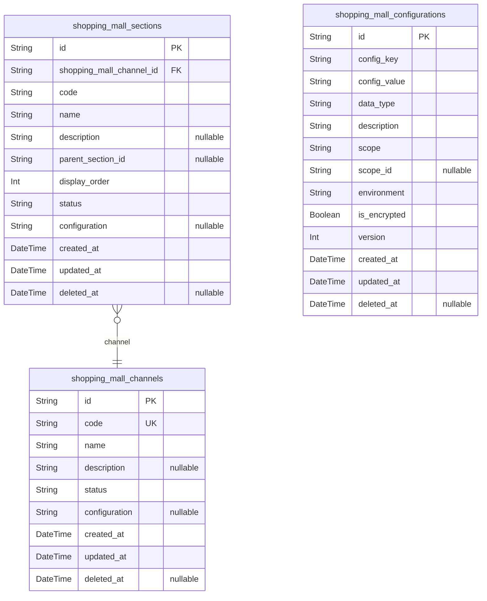
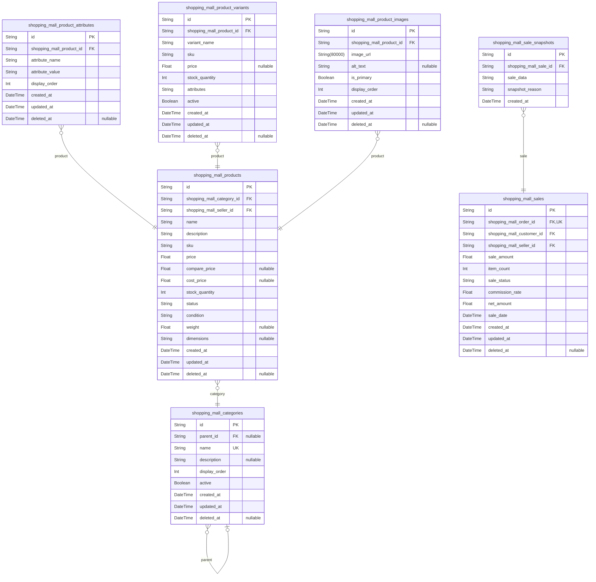
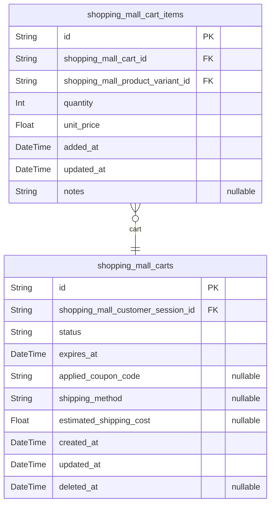
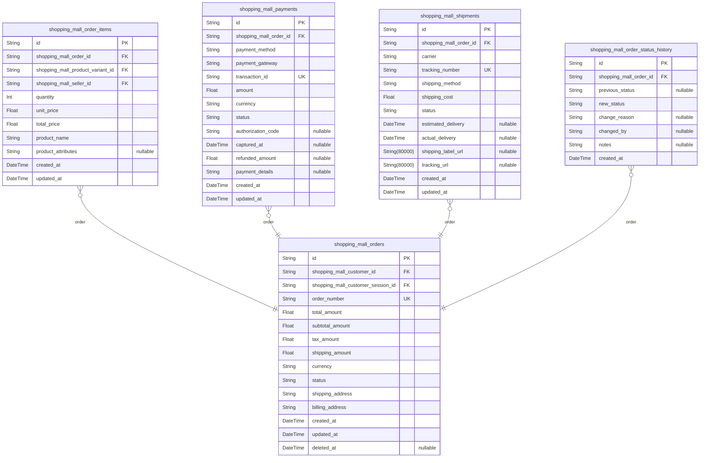
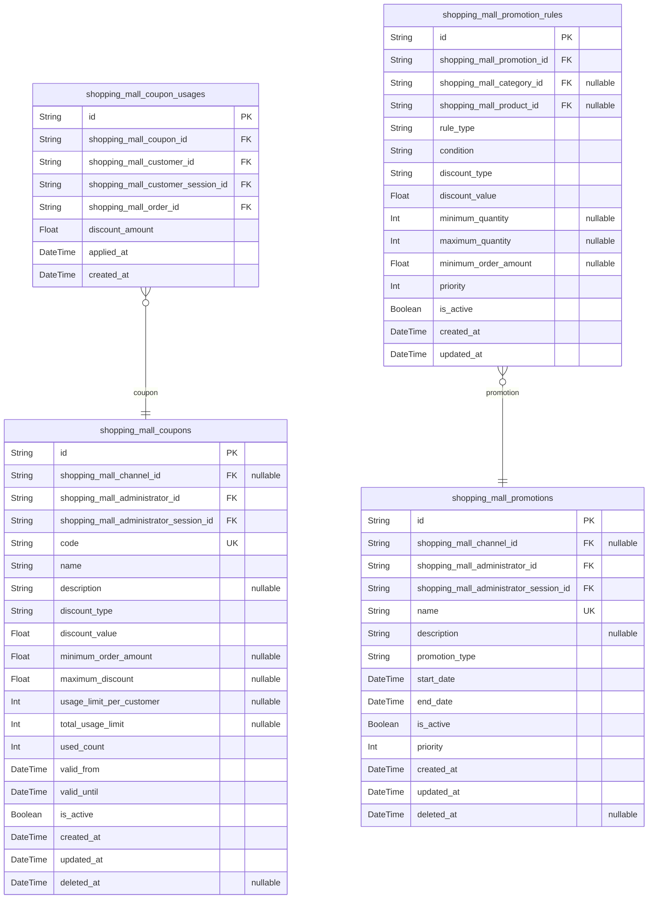
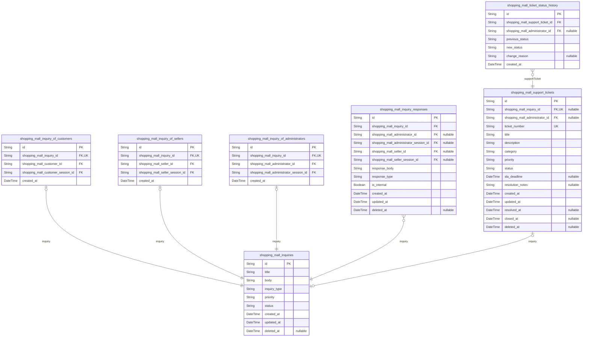
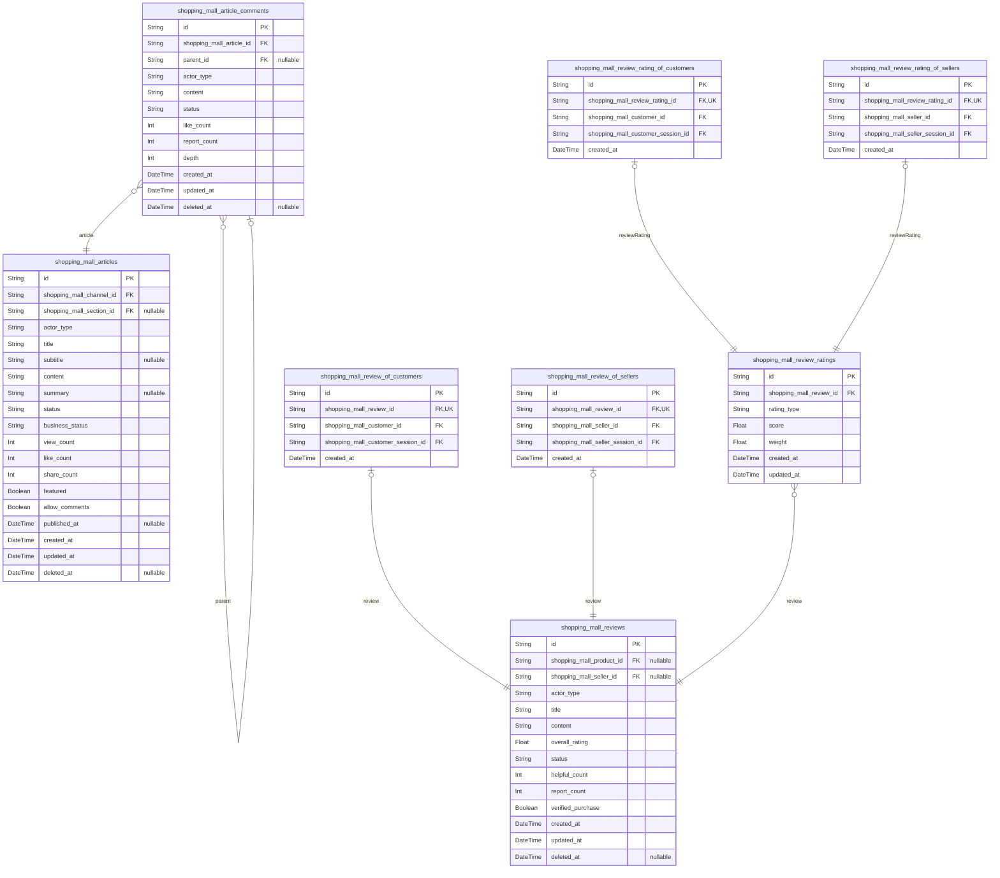
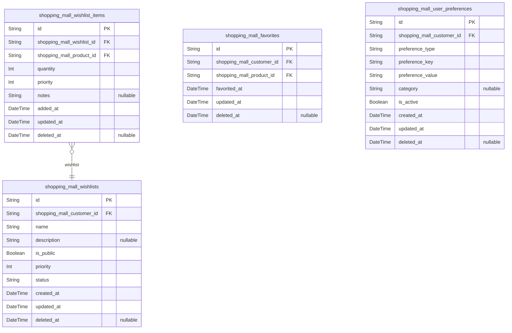

# Prisma Markdown

> Generated by [`prisma-markdown`](https://github.com/samchon/prisma-markdown)

- [Systematic](#systematic)
- [Actors](#actors)
- [Sales](#sales)
- [Carts](#carts)
- [Orders](#orders)
- [Coupons](#coupons)
- [Coins](#coins)
- [Inquiries](#inquiries)
- [Articles](#articles)
- [Favorites](#favorites)

## Systematic

### `shopping_mall_channels`

Shopping mall sales channels that categorize different shopping
experiences or market segments.

Each channel represents a distinct shopping environment or marketplace
within the platform, such as general retail, outlet stores, specialty
markets, or regional marketplaces. Channels enable platform operators to
organize sellers and products into logical groupings that serve different
customer segments or business models.

Channels maintain their own configuration settings, pricing strategies,
and seller eligibility requirements. This allows the platform to support
diverse business models while maintaining a unified customer experience.
Channel status controls visibility and availability to both sellers and
customers.

All channels reference the platform's systematic configurations for
consistent behavior across the marketplace ecosystem.

Properties as follows:

- `id`: Primary Key.
- `code`
  > Unique channel code identifier used for system references and API calls.
  > Must be unique across all channels and follow consistent naming
  > conventions.
- `name`
  > Display name of the shopping channel shown to users and administrators.
  > Should be descriptive of the channel's purpose and target audience.
- `description`
  > Detailed description explaining the channel's business purpose, target
  > market, and operational characteristics.
- `status`
  > Current operational status of the channel. Valid values: active,
  > inactive, maintenance, planned. Controls channel visibility and
  > functionality.
- `configuration`
  > JSON configuration object storing channel-specific settings, policies,
  > and operational parameters. Allows flexible customization per channel.
- `created_at`
  > Timestamp when the channel was first created in the system. Used for
  > audit trails and reporting.
- `updated_at`
  > Timestamp when the channel configuration was last modified. Tracks
  > changes for version control.
- `deleted_at`
  > Timestamp when the channel was soft-deleted. Allows for archival and
  > potential restoration while maintaining data integrity.

### `shopping_mall_sections`

Organizational sections within shopping channels that group related
products or categories.

Sections provide hierarchical organization within channels, allowing
platform operators to create logical groupings such as departments,
product categories, or thematic collections. Each section belongs to a
specific channel and can contain products, sub-sections, or promotional
content.

Sections enable targeted merchandising, personalized shopping
experiences, and efficient product discovery. They support both manual
curation by administrators and automated grouping based on product
attributes or customer behavior.

Section hierarchy and organization directly impact customer navigation
and search effectiveness. Proper section management is crucial for
maintaining an intuitive shopping experience across diverse product
catalogs.

Properties as follows:

- `id`: Primary Key.
- `shopping_mall_channel_id`
  > Parent channel that contains this section. {@link
  > shopping_mall_channels.id}
- `code`
  > Unique section code within the parent channel. Used for system
  > references, URLs, and organizational purposes.
- `name`
  > Display name of the section shown to customers and administrators. Should
  > clearly indicate the section's content and purpose.
- `description`
  > Detailed description of the section's purpose, content guidelines, and
  > target audience. Helps administrators manage section content effectively.
- `parent_section_id`
  > Optional parent section for creating hierarchical section structures.
  > Enables multi-level categorization and navigation.
- `display_order`
  > Numeric order for section display within parent channel or section. Lower
  > numbers appear first in navigation and listings.
- `status`
  > Current status of the section. Valid values: active, inactive, hidden,
  > archived. Controls section visibility and functionality.
- `configuration`
  > JSON configuration storing section-specific settings, display options,
  > and content rules. Allows customization of section behavior.
- `created_at`
  > Timestamp when the section was created. Used for auditing and tracking
  > section lifecycle.
- `updated_at`
  > Timestamp when the section configuration was last modified. Tracks
  > changes for version control.
- `deleted_at`
  > Timestamp when the section was soft-deleted. Allows archival while
  > maintaining referential integrity.

### `shopping_mall_configurations`

Global platform configuration settings that control system-wide behavior
and policies.

This table stores centralized configuration parameters that affect the
entire shopping mall platform. Configurations include system settings,
feature flags, business rules, default values, and operational parameters
that govern platform behavior across all channels and sections.

Configuration settings support different environments (development,
staging, production) and can be scoped to specific contexts or user
groups. The system uses a hierarchical configuration model where more
specific settings override general defaults.

Proper configuration management is essential for platform stability,
feature rollout control, and operational flexibility. All configuration
changes are audited to maintain system integrity and compliance.

Properties as follows:

- `id`: Primary Key.
- `config_key`
  > Unique configuration key that identifies the setting. Follows dot
  > notation for hierarchical organization (e.g., 'payment.gateway.timeout').
- `config_value`
  > Configuration value stored as string. Complex values are stored as JSON
  > strings. Values are type-cast based on configuration context.
- `data_type`
  > Data type of the configuration value. Valid values: string, number,
  > boolean, json, array, object. Guides value parsing and validation.
- `description`
  > Detailed description of the configuration setting's purpose, usage, and
  > acceptable values. Essential for administrative management.
- `scope`
  > Configuration scope defining where the setting applies. Values: global,
  > channel, section, environment. Enables targeted configuration.
- `scope_id`
  > Optional ID reference when scope is channel or section. Links
  > configuration to specific channel or section entities.
- `environment`
  > Target environment for this configuration. Values: development, staging,
  > production, all. Supports environment-specific settings.
- `is_encrypted`
  > Indicates whether the configuration value should be encrypted at rest.
  > Used for sensitive data like API keys and credentials.
- `version`
  > Configuration version number for tracking changes and supporting rollback
  > capabilities. Auto-incremented on updates.
- `created_at`
  > Timestamp when the configuration was initially created. Used for audit
  > trails and change tracking.
- `updated_at`
  > Timestamp when the configuration was last modified. Tracks configuration
  > changes for version control.
- `deleted_at`
  > Timestamp when the configuration was soft-deleted. Allows safe removal
  > while maintaining historical references.

## Actors

### `shopping_mall_customers`

Registered customers who can browse products, create orders, and manage
their shopping experience.

Stores customer authentication credentials, personal information, and
account preferences. Customers are authenticated users who interact with
the shopping platform for purchasing products and services. Each customer
maintains their own shopping cart, order history, and personal settings.

The customer account supports authentication through email and password,
with session management for secure access. Customer data includes contact
information, shipping addresses, and communication preferences for order
notifications and marketing communications.

Properties as follows:

- `id`: Primary Key.
- `email`
  > Customer email address used for authentication and communication. Must be
  > unique across all customers.
- `password_hash`
  > Securely hashed password for customer authentication. Stored using bcrypt
  > algorithm for security.
- `first_name`: Customer's first name for personalization and order processing.
- `last_name`: Customer's last name for identification and order verification.
- `phone_number`: Customer contact phone number for order updates and support.
- `status`
  > Customer account status. Valid values: active, suspended,
  > pending_verification.
- `created_at`: Timestamp when customer account was created.
- `updated_at`: Timestamp when customer account was last updated.
- `deleted_at`: Timestamp when customer account was soft deleted for data retention.

### `shopping_mall_customer_sessions`

Authentication sessions for customer accounts, tracking login activity
and connection context.

Stores session information for authenticated customer access, including
connection details and temporal data. Each session represents a distinct
login instance with its own security context and expiration timeline.

Sessions are used for audit tracing of customer actions and are managed
through authentication flows. The session data helps maintain secure
access patterns and provides accountability for customer activities on
the platform.

Properties as follows:

- `id`: Primary Key.
- `shopping_mall_customer_id`: Belonged customer's [shopping_mall_customers.id](#shopping_mall_customers).
- `ip`: IP address of the customer's connection for security monitoring.
- `href`: Connection URL where the customer session was established.
- `referrer`: Referrer URL that directed the customer to the platform.
- `created_at`: Timestamp when the customer session was created.
- `expired_at`: Timestamp when the customer session expires or was terminated.

### `shopping_mall_sellers`

Registered sellers who list products, manage inventory, and fulfill
customer orders.

Stores seller business information, authentication credentials, and store
configuration. Sellers are business entities that offer products through
the shopping platform and manage their product catalog, pricing, and
order fulfillment.

Each seller maintains their own product listings, inventory levels, and
customer order processing. Seller accounts require business verification
and support authentication for secure access to seller dashboard and
management tools.

Properties as follows:

- `id`: Primary Key.
- `email`: Seller email address used for authentication and business communication.
- `password_hash`
  > Securely hashed password for seller authentication. Stored using bcrypt
  > algorithm.
- `business_name`: Legal business name of the seller for identification and verification.
- `contact_person`: Primary contact person responsible for seller account management.
- `phone_number`: Business contact phone number for order processing and support.
- `business_address`: Registered business address for verification and correspondence.
- `tax_id`: Business tax identification number for financial reporting.
- `status`
  > Seller account status. Valid values: active, suspended, pending_approval,
  > verified.
- `created_at`: Timestamp when seller account was created.
- `updated_at`: Timestamp when seller account was last updated.
- `deleted_at`: Timestamp when seller account was soft deleted.

### `shopping_mall_seller_sessions`

Authentication sessions for seller accounts, tracking business access and
security context.

Stores session information for authenticated seller access to the seller
dashboard and management tools. Each session represents a distinct login
instance with connection details and temporal data.

Sessions are used for audit tracing of seller actions and are managed
through authentication flows. The session data helps maintain secure
business access patterns and provides accountability for seller
activities on the platform.

Properties as follows:

- `id`: Primary Key.
- `shopping_mall_seller_id`: Belonged seller's [shopping_mall_sellers.id](#shopping_mall_sellers).
- `ip`: IP address of the seller's connection for security monitoring.
- `href`: Connection URL where the seller session was established.
- `referrer`: Referrer URL that directed the seller to the platform.
- `created_at`: Timestamp when the seller session was created.
- `expired_at`: Timestamp when the seller session expires or was terminated.

### `shopping_mall_administrators`

Platform administrators with system-wide management capabilities and
oversight responsibilities.

Stores administrator authentication credentials, role information, and
access permissions. Administrators manage platform configuration, user
accounts, content moderation, and system operations.

Each administrator has specific role-based permissions for platform
management tasks. Administrator accounts require elevated security
measures and support authentication for secure access to administrative
tools.

Properties as follows:

- `id`: Primary Key.
- `email`
  > Administrator email address used for authentication and system
  > notifications.
- `password_hash`
  > Securely hashed password for administrator authentication. Stored using
  > bcrypt algorithm with enhanced security.
- `first_name`: Administrator's first name for identification and accountability.
- `last_name`: Administrator's last name for professional identification.
- `role`
  > Administrator role defining access permissions. Valid values:
  > super_admin, support_admin, security_admin.
- `permissions`
  > JSON string containing specific permission sets for the administrator
  > role.
- `status`
  > Administrator account status. Valid values: active, suspended,
  > pending_activation.
- `created_at`: Timestamp when administrator account was created.
- `updated_at`: Timestamp when administrator account was last updated.
- `deleted_at`: Timestamp when administrator account was soft deleted.

### `shopping_mall_administrator_sessions`

Authentication sessions for administrator accounts, tracking system
access and security context.

Stores session information for authenticated administrator access to
administrative tools and system management. Each session represents a
distinct login instance with elevated security requirements.

Sessions are used for audit tracing of administrative actions and are
managed through secure authentication flows. The session data helps
maintain system security and provides accountability for administrative
activities.

Properties as follows:

- `id`: Primary Key.
- `shopping_mall_administrator_id`: Belonged administrator's [shopping_mall_administrators.id](#shopping_mall_administrators).
- `ip`: IP address of the administrator's connection for security monitoring.
- `href`: Connection URL where the administrator session was established.
- `referrer`: Referrer URL that directed the administrator to the platform.
- `created_at`: Timestamp when the administrator session was created.
- `expired_at`: Timestamp when the administrator session expires or was terminated.

## Sales

### `shopping_mall_categories`

Hierarchical product category system for organizing products in the
shopping mall.

Provides a structured categorization system with parent-child
relationships for flexible product organization. Categories can be nested
to create multi-level hierarchies for better product discovery and
navigation.

Each category includes metadata for display purposes and can be managed
independently by administrators. Categories support soft deletion to
maintain referential integrity while allowing content moderation.

Properties as follows:

- `id`: Primary Key.
- `parent_id`
  > Parent category reference for hierarchical structure. {@link
  > shopping_mall_categories.id}.
- `name`: Category name displayed to users.
- `description`: Detailed description explaining the category purpose and contents.
- `display_order`: Sorting order for category display in listings.
- `active`: Whether the category is visible and available for product assignment.
- `created_at`: Timestamp when the category was created.
- `updated_at`: Timestamp when the category was last modified.
- `deleted_at`: Timestamp when the category was soft deleted.

### `shopping_mall_products`

Core product catalog containing all items available for sale in the
shopping mall.

Stores comprehensive product information including pricing, inventory,
and categorization details. Products are created by sellers and managed
through the seller dashboard with administrative oversight.

Products support multiple variants, attributes, and images to provide
rich product experiences. Inventory tracking ensures accurate stock
management and prevents overselling.

Properties as follows:

- `id`: Primary Key.
- `shopping_mall_category_id`
  > Primary category assignment for product organization. {@link
  > shopping_mall_categories.id}.
- `shopping_mall_seller_id`
  > Seller who owns and manages this product. {@link
  > shopping_mall_sellers.id}.
- `name`: Product name displayed to customers.
- `description`: Detailed product description with features and specifications.
- `sku`: Stock Keeping Unit identifier unique per seller.
- `price`: Current selling price of the product.
- `compare_price`: Original price for comparison (strikethrough pricing).
- `cost_price`: Cost price for margin calculation.
- `stock_quantity`: Current available inventory quantity.
- `status`: Product status: draft, active, inactive, archived.
- `condition`: Product condition: new, used, refurbished.
- `weight`: Product weight for shipping calculations.
- `dimensions`: Product dimensions (LxWxH) for shipping.
- `created_at`: Timestamp when the product was created.
- `updated_at`: Timestamp when the product was last modified.
- `deleted_at`: Timestamp when the product was soft deleted.

### `shopping_mall_product_attributes`

Product-specific attributes and specifications for detailed product
information.

Stores attribute values that define product characteristics like size,
color, material, and technical specifications. Attributes are associated
with products to provide comprehensive product details.

Supports flexible attribute management with key-value pairs that can be
customized per product category. Used for filtering, search optimization,
and product comparison features.

Properties as follows:

- `id`: Primary Key.
- `shopping_mall_product_id`: Product that owns these attributes. [shopping_mall_products.id](#shopping_mall_products).
- `attribute_name`: Name of the attribute (e.g., Color, Size, Material).
- `attribute_value`: Value of the attribute (e.g., Red, Large, Cotton).
- `display_order`: Sorting order for attribute display on product pages.
- `created_at`: Timestamp when the attribute was created.
- `updated_at`: Timestamp when the attribute was last modified.
- `deleted_at`: Timestamp when the attribute was soft deleted.

### `shopping_mall_product_variants`

Product variations with different attributes like size, color, or style
options.

Manages product variants that share the same base product but have
different attribute combinations. Each variant can have unique pricing,
inventory, and SKU information.

Supports complex product configurations where customers can select from
multiple options. Variants are essential for products with multiple
options like clothing sizes or electronics models.

Properties as follows:

- `id`: Primary Key.
- `shopping_mall_product_id`
  > Parent product that this variant belongs to. {@link
  > shopping_mall_products.id}.
- `variant_name`: Descriptive name for the variant (e.g., Large Blue Shirt).
- `sku`: Unique SKU for this specific variant.
- `price`: Variant-specific price (overrides product price if different).
- `stock_quantity`: Inventory quantity specific to this variant.
- `attributes`: JSON string containing variant attribute combinations.
- `active`: Whether this variant is available for purchase.
- `created_at`: Timestamp when the variant was created.
- `updated_at`: Timestamp when the variant was last modified.
- `deleted_at`: Timestamp when the variant was soft deleted.

### `shopping_mall_product_images`

Product image gallery storing multiple images for each product.

Manages product visuals including main images, thumbnails, and additional
gallery images. Supports multiple image formats and sizes for optimal
display across different devices.

Images are organized with display order for proper gallery sequencing.
Main images are prioritized for product listings while additional images
provide comprehensive product views.

Properties as follows:

- `id`: Primary Key.
- `shopping_mall_product_id`: Product that owns these images. [shopping_mall_products.id](#shopping_mall_products).
- `image_url`: URL pointing to the stored product image.
- `alt_text`: Alternative text for accessibility and SEO purposes.
- `is_primary`: Whether this is the main product image for listings.
- `display_order`: Sorting order for image display in product galleries.
- `created_at`: Timestamp when the image was uploaded.
- `updated_at`: Timestamp when the image was last modified.
- `deleted_at`: Timestamp when the image was soft deleted.

### `shopping_mall_sales`

Sales transactions representing completed purchases in the shopping mall.

Records finalized sales with complete transaction details including
pricing, quantities, and customer information. Sales are created when
orders are successfully paid and processed.

Each sale links to the original order for tracking purposes and includes
financial details for accounting and reporting. Sales data is used for
analytics, seller payouts, and business intelligence.

Properties as follows:

- `id`: Primary Key.
- `shopping_mall_order_id`: Original order that generated this sale. [shopping_mall_orders.id](#shopping_mall_orders).
- `shopping_mall_customer_id`: Customer who made the purchase. [shopping_mall_customers.id](#shopping_mall_customers).
- `shopping_mall_seller_id`: Seller who received the sale. [shopping_mall_sellers.id](#shopping_mall_sellers).
- `sale_amount`: Total sale amount including taxes and shipping.
- `item_count`: Total number of items sold in this transaction.
- `sale_status`: Current status of the sale: completed, refunded, disputed.
- `commission_rate`: Platform commission percentage applied to this sale.
- `net_amount`: Final amount after commission and fees for seller payout.
- `sale_date`: Timestamp when the sale was finalized.
- `created_at`: Timestamp when the sale record was created.
- `updated_at`: Timestamp when the sale was last modified.
- `deleted_at`: Timestamp when the sale was soft deleted.

### `shopping_mall_sale_snapshots`

Historical snapshots of sales data for audit trails and reporting.

Captures point-in-time state of sales transactions for historical
accuracy and compliance. Snapshots preserve sales data as it existed at
the time of transaction, protecting against later modifications.

Used for financial reporting, audit trails, and historical analysis. Each
snapshot represents the complete state of a sale at a specific moment,
including all financial details and status information.

Properties as follows:

- `id`: Primary Key.
- `shopping_mall_sale_id`: Original sale that this snapshot captures. [shopping_mall_sales.id](#shopping_mall_sales).
- `sale_data`: JSON representation of complete sale state at snapshot time.
- `snapshot_reason`: Reason for creating this snapshot: audit, refund, status_change.
- `created_at`: Timestamp when the snapshot was created.

## Carts

### `shopping_mall_carts`

Shopping cart sessions that temporarily hold customer product selections
before order conversion.

Each cart represents a unique shopping session associated with a
customer's active session. Carts maintain temporary product selections
that customers may later convert to actual orders or abandon. The system
tracks cart creation, modification, and expiration to manage abandoned
carts and optimize shopping experiences.

Carts are automatically created when customers add their first product
and persist for configurable periods to support guest shopping and
session recovery. Each cart is linked to a specific customer session and
contains metadata about the shopping context including applied coupons,
shipping preferences.

The cart lifecycle includes active, abandoned, and converted states, with
automatic cleanup of expired carts to maintain system performance.
Calculated fields like total_amount and item_count are removed to
maintain 3NF compliance and computed dynamically during queries.

Properties as follows:

- `id`: Primary Key.
- `shopping_mall_customer_session_id`
  > Customer session that owns this cart. {@link
  > shopping_mall_customer_sessions.id}
- `status`
  > Current cart status. Valid values: active, abandoned, converted, expired.
  > Active carts are currently being used, abandoned carts were not converted
  > to orders, converted carts successfully became orders.
- `expires_at`
  > Timestamp when this cart will automatically expire if not converted to an
  > order. Used for cleaning up abandoned carts.
- `applied_coupon_code`
  > Coupon code currently applied to this cart, if any. References active
  > promotions for discount calculations.
- `shipping_method`
  > Selected shipping method for this cart. Used to pre-calculate shipping
  > costs during shopping.
- `estimated_shipping_cost`
  > Pre-calculated shipping cost based on selected method and cart contents.
  > Helps customers understand total costs.
- `created_at`
  > Timestamp when the cart was initially created. Used for cart lifecycle
  > tracking and analytics.
- `updated_at`
  > Timestamp when the cart was last modified. Helps identify active shopping
  > sessions.
- `deleted_at`
  > Timestamp when the cart was soft-deleted. Preserves cart data for
  > analytics while removing from active use.

### `shopping_mall_cart_items`

Individual product selections within shopping carts, representing
customer's temporary product choices.

Each cart item links a specific product variant to a shopping cart with
selected quantity. Items capture the product selection at the time of
addition, including current price, to maintain shopping context even if
product details change later.

Cart items support product variants for size, color, or other attribute
selections, and maintain real-time inventory validation to prevent
overselling. The system tracks item additions, modifications, and
removals to provide accurate cart context.

Items are automatically removed when their parent cart expires or is
converted to an order, with historical preservation for analytics and
customer behavior analysis. Calculated total_price field removed to
maintain 3NF compliance.

Properties as follows:

- `id`: Primary Key.
- `shopping_mall_cart_id`
  > Parent shopping cart that contains this item. {@link
  > shopping_mall_carts.id}
- `shopping_mall_product_variant_id`
  > Specific product variant selected by the customer. {@link
  > shopping_mall_product_variants.id}
- `quantity`
  > Number of units of this product variant selected by the customer.
  > Validated against available inventory with maximum limit of 999 per item.
- `unit_price`
  > Price per unit at the time the item was added to the cart. Preserves
  > pricing for abandoned cart recovery.
- `added_at`
  > Timestamp when this item was originally added to the cart. Helps track
  > shopping behavior patterns.
- `updated_at`
  > Timestamp when this item was last modified (quantity change, etc.).
  > Tracks cart activity.
- `notes`
  > Optional customer notes or special instructions for this specific cart
  > item. Useful for personalized orders.

## Orders

### `shopping_mall_orders`

Core order entity representing customer purchases with financial
commitments.

Stores complete order information including customer details, order
totals, and fulfillment status. Each order represents a committed
transaction with financial implications, unlike temporary shopping carts.
Orders can contain items from multiple sellers and support complex
scenarios like split payments and multi-shipment fulfillment.

The order lifecycle includes status tracking from creation through
delivery, with comprehensive audit trails maintained through the order
status history table. Orders reference customer authentication sessions
and maintain financial integrity through payment processing integration.

Properties as follows:

- `id`: Primary Key.
- `shopping_mall_customer_id`: Customer who placed the order. [shopping_mall_customers.id](#shopping_mall_customers)
- `shopping_mall_customer_session_id`
  > Customer session when order was placed. {@link
  > shopping_mall_customer_sessions.id}
- `order_number`: Unique order identifier for customer reference and tracking.
- `total_amount`: Total order amount including taxes and shipping.
- `subtotal_amount`: Order subtotal before taxes and shipping.
- `tax_amount`: Total tax amount calculated for the order.
- `shipping_amount`: Shipping cost for the order.
- `currency`: Currency code for the order (e.g., USD, EUR, KRW).
- `status`
  > Current order status (pending, confirmed, processing, shipped, delivered,
  > completed, cancelled, refunded).
- `shipping_address`: Complete shipping address for order delivery.
- `billing_address`: Billing address for payment processing.
- `created_at`: Order creation timestamp.
- `updated_at`: Last order update timestamp.
- `deleted_at`: Soft delete timestamp for order archival.

### `shopping_mall_order_items`

Individual items within an order with product details and pricing.

Represents each product line item in an order, including specific product
variants, quantities, and pricing at the time of purchase. Order items
maintain the exact product state as it existed when the order was placed,
ensuring price consistency and product information accuracy for
historical records.

Each item links to the specific product variant ordered and maintains its
own pricing and quantity information separate from current product
catalog data.

Properties as follows:

- `id`: Primary Key.
- `shopping_mall_order_id`: Parent order containing this item. [shopping_mall_orders.id](#shopping_mall_orders)
- `shopping_mall_product_variant_id`
  > Specific product variant ordered. {@link
  > shopping_mall_product_variants.id}
- `shopping_mall_seller_id`: Seller who provided the product. [shopping_mall_sellers.id](#shopping_mall_sellers)
- `quantity`: Quantity of the product variant ordered.
- `unit_price`: Price per unit at the time of order.
- `total_price`: Total price for this line item (quantity * unit_price).
- `product_name`: Product name as it appeared when ordered.
- `product_attributes`: JSON string containing product attributes at order time.
- `created_at`: Item creation timestamp.
- `updated_at`: Last item update timestamp.

### `shopping_mall_payments`

Payment transactions associated with orders.

Manages all payment processing for orders including authorization,
capture, refunds, and chargebacks. Each payment record tracks the
complete financial transaction lifecycle with secure payment gateway
integration. Payments support multiple methods (credit cards, PayPal,
bank transfers) and handle complex scenarios like split payments and
partial refunds.

Payment records maintain PCI DSS compliance by storing only tokenized
payment information and maintaining complete audit trails for financial
reconciliation.

Properties as follows:

- `id`: Primary Key.
- `shopping_mall_order_id`: Order associated with this payment. [shopping_mall_orders.id](#shopping_mall_orders)
- `payment_method`: Payment method used (credit_card, paypal, bank_transfer, digital_wallet).
- `payment_gateway`: Payment gateway used for processing.
- `transaction_id`: Unique transaction identifier from payment gateway.
- `amount`: Payment amount processed.
- `currency`: Currency code for the payment.
- `status`
  > Payment status (pending, authorized, captured, declined, refunded,
  > disputed, chargeback).
- `authorization_code`: Payment authorization code from gateway.
- `captured_at`: Timestamp when payment was captured.
- `refunded_amount`: Total amount refunded for this payment.
- `payment_details`: JSON string containing encrypted payment details.
- `created_at`: Payment creation timestamp.
- `updated_at`: Last payment update timestamp.

### `shopping_mall_shipments`

Shipping and delivery information for order fulfillment.

Tracks the complete shipping lifecycle for orders including carrier
selection, label generation, tracking, and delivery confirmation. Each
shipment represents a physical delivery package associated with an order,
supporting scenarios like split shipments and multiple package
deliveries.

Shipments integrate with carrier APIs for real-time tracking updates and
provide customers with delivery progress visibility. Each shipment
maintains carrier-specific information and delivery timelines.

Properties as follows:

- `id`: Primary Key.
- `shopping_mall_order_id`: Order being shipped. [shopping_mall_orders.id](#shopping_mall_orders)
- `carrier`: Shipping carrier (USPS, FedEx, UPS, DHL, etc.).
- `tracking_number`: Carrier tracking number for shipment tracking.
- `shipping_method`: Shipping method selected (standard, expedited, overnight).
- `shipping_cost`: Cost of this specific shipment.
- `status`
  > Shipment status (label_created, picked_up, in_transit, out_for_delivery,
  > delivered).
- `estimated_delivery`: Estimated delivery date from carrier.
- `actual_delivery`: Actual delivery timestamp when package is delivered.
- `shipping_label_url`: URL to download shipping label.
- `tracking_url`: URL for carrier tracking page.
- `created_at`: Shipment creation timestamp.
- `updated_at`: Last shipment update timestamp.

### `shopping_mall_order_status_history`

Complete audit trail of order status changes for historical tracking.

Maintains a chronological record of all status transitions for orders,
providing comprehensive audit capabilities and order lifecycle
visibility. Each entry captures the exact state change with timestamps
and optional notes, enabling complete order history reconstruction.

This snapshot table supports customer service inquiries, dispute
resolution, and business analytics by preserving the complete order
progression from creation through final disposition.

Properties as follows:

- `id`: Primary Key.
- `shopping_mall_order_id`: Order whose status is being tracked. [shopping_mall_orders.id](#shopping_mall_orders)
- `previous_status`: Order status before this change.
- `new_status`: New order status after this change.
- `change_reason`: Reason for the status change (system, customer, seller, admin).
- `changed_by`: Entity that initiated the status change.
- `notes`: Additional notes or context for the status change.
- `created_at`: Timestamp when status change occurred.

## Coupons

### `shopping_mall_coupons`

Platform-managed discount coupons for customer purchases.

Stores coupon definitions including discount types, values, eligibility
criteria, and validity periods. Each coupon can be applied to eligible
orders to provide discounts based on configured rules. Coupons support
various discount types including percentage-based, fixed amount, and free
shipping.

Coupons have configurable usage limits per customer and overall usage
caps. They can be targeted to specific customer segments, product
categories, or order minimums. The system tracks coupon usage statistics
and enforces expiration dates.

Coupons are managed by platform administrators and can be distributed
through various channels including email campaigns, promotional events,
and customer loyalty programs. Requires creator tracking for audit
purposes and proper indexing for performance.

Properties as follows:

- `id`: Primary Key.
- `shopping_mall_channel_id`: Channel where this coupon is valid. [shopping_mall_channels.id](#shopping_mall_channels)
- `shopping_mall_administrator_id`
  > Administrator who created this coupon. {@link
  > shopping_mall_administrators.id}
- `shopping_mall_administrator_session_id`
  > Administrator session when coupon was created. {@link
  > shopping_mall_administrator_sessions.id}
- `code`
  > Unique coupon code that customers enter during checkout. Must be
  > uppercase and alphanumeric.
- `name`: Descriptive name for the coupon for administrative purposes.
- `description`: Detailed description explaining coupon terms and conditions.
- `discount_type`: Type of discount: percentage, fixed_amount, free_shipping.
- `discount_value`: Discount amount or percentage value. Must be positive.
- `minimum_order_amount`: Minimum order amount required to use this coupon.
- `maximum_discount`: Maximum discount amount for percentage-based coupons.
- `usage_limit_per_customer`: Maximum times a single customer can use this coupon.
- `total_usage_limit`: Overall maximum usage limit for this coupon.
- `used_count`: Current usage count for tracking purposes.
- `valid_from`: Date and time when coupon becomes active.
- `valid_until`: Date and time when coupon expires.
- `is_active`: Whether the coupon is currently active for use.
- `created_at`: Timestamp when coupon was created.
- `updated_at`: Timestamp when coupon was last updated.
- `deleted_at`: Timestamp when coupon was soft deleted.

### `shopping_mall_coupon_usages`

Tracks individual coupon applications to customer orders.

Records each instance of a coupon being used in an order, including the
customer who used it, the order it was applied to, and the discount
amount applied. This table provides audit trails for coupon usage and
prevents duplicate applications.

Usage records are created when a coupon is successfully applied during
checkout. The system validates coupon eligibility before creating usage
records and enforces usage limits based on the coupon configuration.

This tracking enables reporting on coupon effectiveness, customer
redemption patterns, and promotional campaign performance analysis.

Properties as follows:

- `id`: Primary Key.
- `shopping_mall_coupon_id`: Coupon that was used. [shopping_mall_coupons.id](#shopping_mall_coupons)
- `shopping_mall_customer_id`: Customer who used the coupon. [shopping_mall_customers.id](#shopping_mall_customers)
- `shopping_mall_customer_session_id`
  > Customer session when coupon was used. {@link
  > shopping_mall_customer_sessions.id}
- `shopping_mall_order_id`: Order where coupon was applied. [shopping_mall_orders.id](#shopping_mall_orders)
- `discount_amount`: Actual discount amount applied to the order.
- `applied_at`: Timestamp when coupon was applied to the order.
- `created_at`: Timestamp when usage record was created.

### `shopping_mall_promotions`

Marketing promotions and campaign definitions.

Defines promotional campaigns that can include multiple coupons, special
pricing, or other marketing incentives. Promotions have specific start
and end dates, target audiences, and can be associated with specific
products or categories.

Promotions support various types including seasonal sales, clearance
events, loyalty rewards, and new customer incentives. Each promotion can
have multiple rules defining eligibility criteria and discount
structures.

Platform administrators manage promotions through dedicated tools that
allow for campaign scheduling, performance tracking, and audience
targeting configuration. Requires creator tracking and proper indexing
for campaign management.

Properties as follows:

- `id`: Primary Key.
- `shopping_mall_channel_id`: Channel where promotion is active. [shopping_mall_channels.id](#shopping_mall_channels)
- `shopping_mall_administrator_id`
  > Administrator who created this promotion. {@link
  > shopping_mall_administrators.id}
- `shopping_mall_administrator_session_id`
  > Administrator session when promotion was created. {@link
  > shopping_mall_administrator_sessions.id}
- `name`: Promotion name for identification and display.
- `description`: Detailed description of promotion terms and benefits.
- `promotion_type`: Type of promotion: sale, clearance, loyalty, seasonal, etc.
- `start_date`: Date and time when promotion becomes active.
- `end_date`: Date and time when promotion expires.
- `is_active`: Whether the promotion is currently active.
- `priority`
  > Priority level for promotion ordering and conflict resolution. Higher
  > numbers indicate higher priority.
- `created_at`: Timestamp when promotion was created.
- `updated_at`: Timestamp when promotion was last updated.
- `deleted_at`: Timestamp when promotion was soft deleted.

### `shopping_mall_promotion_rules`

Rules and conditions defining promotion eligibility and discounts.

Specifies the conditions under which a promotion applies and the discount
calculations. Rules can target specific products, categories, customer
segments, or order characteristics.

Each rule belongs to a promotion and defines the criteria for promotion
application. Rules support complex conditions including minimum order
amounts, product quantity thresholds, customer loyalty tiers, and
time-based restrictions.

The system evaluates promotion rules during checkout to determine
applicable discounts and ensures that only eligible promotions are
applied to customer orders.

Properties as follows:

- `id`: Primary Key.
- `shopping_mall_promotion_id`
  > Parent promotion that this rule belongs to. {@link
  > shopping_mall_promotions.id}
- `shopping_mall_category_id`
  > Target category for category-specific promotions. {@link
  > shopping_mall_categories.id}
- `shopping_mall_product_id`
  > Target product for product-specific promotions. {@link
  > shopping_mall_products.id}
- `rule_type`: Type of rule: product_based, category_based, order_based, customer_based.
- `condition`: JSON condition definition for rule evaluation.
- `discount_type`: Discount calculation method: percentage, fixed_amount, etc.
- `discount_value`: Discount amount or percentage value.
- `minimum_quantity`: Minimum product quantity required for rule application.
- `maximum_quantity`: Maximum product quantity for rule application.
- `minimum_order_amount`: Minimum order amount required for rule application.
- `priority`: Rule priority for ordering and conflict resolution.
- `is_active`: Whether the rule is currently active.
- `created_at`: Timestamp when rule was created.
- `updated_at`: Timestamp when rule was last updated.

## Coins

```mermaid
erDiagram
"shopping_mall_coins" {
  String id PK
  String actor_type
  Int balance
  Int total_earned
  Int total_spent
  String coin_type
  DateTime created_at
  DateTime updated_at
  DateTime deleted_at "nullable"
}
"shopping_mall_coin_transactions" {
  String id PK
  String shopping_mall_coins_id FK
  String actor_type
  String transaction_type
  Int amount
  Int previous_balance
  Int new_balance
  String reference_id UK "nullable"
  String description
  String status
  DateTime created_at
  DateTime updated_at
  DateTime deleted_at "nullable"
}
"shopping_mall_coin_transaction_of_customers" {
  String id PK
  String shopping_mall_coin_transactions_id FK,UK
  String shopping_mall_customer_id FK
  String shopping_mall_customer_session_id FK
  DateTime created_at
}
"shopping_mall_coin_transaction_of_sellers" {
  String id PK
  String shopping_mall_coin_transactions_id FK,UK
  String shopping_mall_seller_id FK
  String shopping_mall_seller_session_id FK
  DateTime created_at
}
"shopping_mall_coin_transaction_of_administrators" {
  String id PK
  String shopping_mall_coin_transactions_id FK,UK
  String shopping_mall_administrator_id FK
  String shopping_mall_administrator_session_id FK
  DateTime created_at
}
"shopping_mall_rewards" {
  String id PK
  String name UK
  String description
  String reward_type
  String earning_rules
  String redemption_rules
  Int coin_value
  Int minimum_purchase "nullable"
  Int maximum_coins "nullable"
  DateTime valid_from
  DateTime valid_until "nullable"
  Boolean is_active
  DateTime created_at
  DateTime updated_at
  DateTime deleted_at "nullable"
}
"shopping_mall_reward_redemptions" {
  String id PK
  String shopping_mall_coins_id FK
  String shopping_mall_rewards_id FK
  String actor_type
  String redemption_type
  Int coins_used
  Int redemption_value
  String redemption_details
  String status
  DateTime processed_at "nullable"
  DateTime completed_at "nullable"
  DateTime created_at
  DateTime updated_at
  DateTime deleted_at "nullable"
}
"shopping_mall_coin_of_customers" {
  String id PK
  String shopping_mall_coins_id FK,UK
  String shopping_mall_customer_id FK
  String shopping_mall_customer_session_id FK
  DateTime created_at
}
"shopping_mall_coin_of_sellers" {
  String id PK
  String shopping_mall_coins_id FK,UK
  String shopping_mall_seller_id FK
  String shopping_mall_seller_session_id FK
  DateTime created_at
}
"shopping_mall_coin_of_administrators" {
  String id PK
  String shopping_mall_coins_id FK,UK
  String shopping_mall_administrator_id FK
  String shopping_mall_administrator_session_id FK
  DateTime created_at
}
"shopping_mall_reward_redemption_of_customers" {
  String id PK
  String shopping_mall_reward_redemptions_id FK,UK
  String shopping_mall_customer_id FK
  String shopping_mall_customer_session_id FK
  DateTime created_at
}
"shopping_mall_reward_redemption_of_sellers" {
  String id PK
  String shopping_mall_reward_redemptions_id FK,UK
  String shopping_mall_seller_id FK
  String shopping_mall_seller_session_id FK
  DateTime created_at
}
"shopping_mall_reward_redemption_of_administrators" {
  String id PK
  String shopping_mall_reward_redemptions_id FK,UK
  String shopping_mall_administrator_id FK
  String shopping_mall_administrator_session_id FK
  DateTime created_at
}
"shopping_mall_coin_transactions" }o--|| "shopping_mall_coins" : coins
"shopping_mall_coin_transaction_of_customers" |o--|| "shopping_mall_coin_transactions" : transaction
"shopping_mall_coin_transaction_of_sellers" |o--|| "shopping_mall_coin_transactions" : transaction
"shopping_mall_coin_transaction_of_administrators" |o--|| "shopping_mall_coin_transactions" : transaction
"shopping_mall_reward_redemptions" }o--|| "shopping_mall_coins" : coins
"shopping_mall_reward_redemptions" }o--|| "shopping_mall_rewards" : reward
"shopping_mall_coin_of_customers" |o--|| "shopping_mall_coins" : coins
"shopping_mall_coin_of_sellers" |o--|| "shopping_mall_coins" : coins
"shopping_mall_coin_of_administrators" |o--|| "shopping_mall_coins" : coins
"shopping_mall_reward_redemption_of_customers" |o--|| "shopping_mall_reward_redemptions" : redemption
"shopping_mall_reward_redemption_of_sellers" |o--|| "shopping_mall_reward_redemptions" : redemption
"shopping_mall_reward_redemption_of_administrators" |o--|| "shopping_mall_reward_redemptions" : redemption
```

### `shopping_mall_coins`

Main entity for digital currency balances with polymorphic ownership
support.

Tracks coin balances for platform users across multiple actor types
(customers, sellers, administrators). Each record represents a specific
actor's coin account with current balance, total earned, and total spent
metrics.

Uses actor_type field for efficient filtering and supports multiple coin
types with separate balances per actor. Balances are updated through
transaction records to ensure audit trail integrity. Soft deletion allows
for account closure while preserving transaction history.

The main entity contains shared business attributes while subtype
entities handle actor-specific relationships and metadata.

Properties as follows:

- `id`: Primary Key.
- `actor_type`
  > Type of actor owning the coin account. Valid values: customer, seller,
  > administrator.
- `balance`: Current available coin balance. Must be non-negative.
- `total_earned`: Total coins earned through all transactions.
- `total_spent`: Total coins spent through all transactions.
- `coin_type`
  > Type of digital currency. Examples: loyalty_points, reward_coins,
  > bonus_coins.
- `created_at`: Account creation timestamp.
- `updated_at`: Last balance update timestamp.
- `deleted_at`: Account closure timestamp for soft deletion.

### `shopping_mall_coin_transactions`

Audit trail for all coin transactions.

Records every coin movement including earning, spending, transfers, and
adjustments. Each transaction represents a complete accounting entry with
debit/credit amounts and business context.

Transactions maintain referential integrity with the coin balance table
and support various transaction types like purchases, rewards, refunds,
and administrative adjustments. The actor_type field enables polymorphic
ownership across different user types.

This main entity contains shared transaction attributes while subtype
entities handle actor-specific context and relationships.

Properties as follows:

- `id`: Primary Key.
- `shopping_mall_coins_id`: Coin account reference. [shopping_mall_coins.id](#shopping_mall_coins)
- `actor_type`
  > Type of actor initiating the transaction. Valid values: customer, seller,
  > administrator.
- `transaction_type`
  > Type of transaction. Examples: purchase, reward, refund, transfer,
  > adjustment.
- `amount`: Transaction amount. Positive for earnings, negative for spending.
- `previous_balance`: Coin balance before this transaction.
- `new_balance`: Coin balance after this transaction.
- `reference_id`: External reference ID for business context.
- `description`: Human-readable transaction description.
- `status`: Transaction status. Valid values: pending, completed, cancelled, failed.
- `created_at`: Transaction creation timestamp.
- `updated_at`: Last status update timestamp.
- `deleted_at`: Transaction deletion timestamp for soft deletion.

### `shopping_mall_coin_transaction_of_customers`

Customer-specific context for coin transactions.

Provides customer-specific metadata and relationships for transactions
initiated by customers. Each record establishes the connection between a
transaction and the specific customer who initiated it.

Maintains referential integrity with customer tables and supports session
tracking for audit purposes. The unique constraint ensures each
transaction has exactly one customer context.

Properties as follows:

- `id`: Primary Key.
- `shopping_mall_coin_transactions_id`: Transaction reference. [shopping_mall_coin_transactions.id](#shopping_mall_coin_transactions)
- `shopping_mall_customer_id`: Customer account reference. [shopping_mall_customers.id](#shopping_mall_customers)
- `shopping_mall_customer_session_id`: Customer session reference. [shopping_mall_customer_sessions.id](#shopping_mall_customer_sessions)
- `created_at`: Relationship creation timestamp.

### `shopping_mall_coin_transaction_of_sellers`

Seller-specific context for coin transactions.

Provides seller-specific metadata and relationships for transactions
initiated by sellers. Each record establishes the connection between a
transaction and the specific seller who initiated it.

Maintains referential integrity with seller tables and supports session
tracking for audit purposes. The unique constraint ensures each
transaction has exactly one seller context.

Properties as follows:

- `id`: Primary Key.
- `shopping_mall_coin_transactions_id`: Transaction reference. [shopping_mall_coin_transactions.id](#shopping_mall_coin_transactions)
- `shopping_mall_seller_id`: Seller account reference. [shopping_mall_sellers.id](#shopping_mall_sellers)
- `shopping_mall_seller_session_id`: Seller session reference. [shopping_mall_seller_sessions.id](#shopping_mall_seller_sessions)
- `created_at`: Relationship creation timestamp.

### `shopping_mall_coin_transaction_of_administrators`

Administrator-specific context for coin transactions.

Provides administrator-specific metadata and relationships for
transactions initiated by administrators. Each record establishes the
connection between a transaction and the specific administrator who
initiated it.

Maintains referential integrity with administrator tables and supports
session tracking for audit purposes. The unique constraint ensures each
transaction has exactly one administrator context.

Properties as follows:

- `id`: Primary Key.
- `shopping_mall_coin_transactions_id`: Transaction reference. [shopping_mall_coin_transactions.id](#shopping_mall_coin_transactions)
- `shopping_mall_administrator_id`: Administrator account reference. [shopping_mall_administrators.id](#shopping_mall_administrators)
- `shopping_mall_administrator_session_id`
  > Administrator session reference. {@link
  > shopping_mall_administrator_sessions.id}
- `created_at`: Relationship creation timestamp.

### `shopping_mall_rewards`

Reward program definitions and earning rules.

Defines the reward programs available in the platform, including earning
rules, redemption rules, and program validity periods. Each reward
program has specific conditions for earning coins and rules for
redemption.

Supports multiple reward types like purchase-based rewards, referral
bonuses, and promotional rewards. Programs can be targeted to specific
customer segments or available platform-wide.

Properties as follows:

- `id`: Primary Key.
- `name`: Reward program name for display purposes.
- `description`: Detailed description of the reward program.
- `reward_type`
  > Type of reward program. Examples: purchase_based, referral, promotional,
  > seasonal.
- `earning_rules`: JSON configuration defining how coins are earned.
- `redemption_rules`: JSON configuration defining how coins can be redeemed.
- `coin_value`: Base coin value for this reward program.
- `minimum_purchase`: Minimum purchase amount required to earn rewards.
- `maximum_coins`: Maximum coins that can be earned per transaction.
- `valid_from`: Program start date and time.
- `valid_until`: Program end date and time.
- `is_active`: Whether the reward program is currently active.
- `created_at`: Program creation timestamp.
- `updated_at`: Last program update timestamp.
- `deleted_at`: Program deletion timestamp for soft deletion.

### `shopping_mall_reward_redemptions`

Tracking of reward redemption transactions.

Records every instance where platform users redeem their earned coins for
rewards. Each redemption represents a completed transaction where coins
are exchanged for products, discounts, or other benefits.

Maintains complete audit trail including redemption value, status, and
user information. Supports various redemption types like product
discounts, free shipping, or gift cards.

This main entity contains shared redemption attributes while subtype
entities handle actor-specific context and relationships.

Properties as follows:

- `id`: Primary Key.
- `shopping_mall_coins_id`: Coin account reference. [shopping_mall_coins.id](#shopping_mall_coins)
- `shopping_mall_rewards_id`: Reward program reference. [shopping_mall_rewards.id](#shopping_mall_rewards)
- `actor_type`
  > Type of actor performing the redemption. Valid values: customer, seller,
  > administrator.
- `redemption_type`: Type of redemption. Examples: product_discount, free_shipping, gift_card.
- `coins_used`: Number of coins redeemed in this transaction.
- `redemption_value`: Monetary value of the redemption in base currency.
- `redemption_details`: JSON containing specific redemption details.
- `status`: Redemption status. Valid values: pending, processed, completed, cancelled.
- `processed_at`: Timestamp when redemption was processed.
- `completed_at`: Timestamp when redemption was completed.
- `created_at`: Redemption creation timestamp.
- `updated_at`: Last status update timestamp.
- `deleted_at`: Redemption deletion timestamp for soft deletion.

### `shopping_mall_coin_of_customers`

Customer-specific context for coin accounts.

Provides customer-specific metadata and relationships for coin accounts
owned by customers. Each record establishes the connection between a coin
account and the specific customer who owns it.

Maintains referential integrity with customer tables and supports session
tracking for audit purposes. The unique constraint ensures each coin
account has exactly one customer owner.

Properties as follows:

- `id`: Primary Key.
- `shopping_mall_coins_id`: Coin account reference. [shopping_mall_coins.id](#shopping_mall_coins)
- `shopping_mall_customer_id`: Customer account reference. [shopping_mall_customers.id](#shopping_mall_customers)
- `shopping_mall_customer_session_id`: Customer session reference. [shopping_mall_customer_sessions.id](#shopping_mall_customer_sessions)
- `created_at`: Relationship creation timestamp.

### `shopping_mall_coin_of_sellers`

Seller-specific context for coin accounts.

Provides seller-specific metadata and relationships for coin accounts
owned by sellers. Each record establishes the connection between a coin
account and the specific seller who owns it.

Maintains referential integrity with seller tables and supports session
tracking for audit purposes. The unique constraint ensures each coin
account has exactly one seller owner.

Properties as follows:

- `id`: Primary Key.
- `shopping_mall_coins_id`: Coin account reference. [shopping_mall_coins.id](#shopping_mall_coins)
- `shopping_mall_seller_id`: Seller account reference. [shopping_mall_sellers.id](#shopping_mall_sellers)
- `shopping_mall_seller_session_id`: Seller session reference. [shopping_mall_seller_sessions.id](#shopping_mall_seller_sessions)
- `created_at`: Relationship creation timestamp.

### `shopping_mall_coin_of_administrators`

Administrator-specific context for coin accounts.

Provides administrator-specific metadata and relationships for coin
accounts owned by administrators. Each record establishes the connection
between a coin account and the specific administrator who owns it.

Maintains referential integrity with administrator tables and supports
session tracking for audit purposes. The unique constraint ensures each
coin account has exactly one administrator owner.

Properties as follows:

- `id`: Primary Key.
- `shopping_mall_coins_id`: Coin account reference. [shopping_mall_coins.id](#shopping_mall_coins)
- `shopping_mall_administrator_id`: Administrator account reference. [shopping_mall_administrators.id](#shopping_mall_administrators)
- `shopping_mall_administrator_session_id`
  > Administrator session reference. {@link
  > shopping_mall_administrator_sessions.id}
- `created_at`: Relationship creation timestamp.

### `shopping_mall_reward_redemption_of_customers`

Customer-specific context for reward redemptions.

Provides customer-specific metadata and relationships for redemptions
performed by customers. Each record establishes the connection between a
redemption and the specific customer who performed it.

Maintains referential integrity with customer tables and supports session
tracking for audit purposes. The unique constraint ensures each
redemption has exactly one customer context.

Properties as follows:

- `id`: Primary Key.
- `shopping_mall_reward_redemptions_id`: Redemption reference. [shopping_mall_reward_redemptions.id](#shopping_mall_reward_redemptions)
- `shopping_mall_customer_id`: Customer account reference. [shopping_mall_customers.id](#shopping_mall_customers)
- `shopping_mall_customer_session_id`: Customer session reference. [shopping_mall_customer_sessions.id](#shopping_mall_customer_sessions)
- `created_at`: Relationship creation timestamp.

### `shopping_mall_reward_redemption_of_sellers`

Seller-specific context for reward redemptions.

Provides seller-specific metadata and relationships for redemptions
performed by sellers. Each record establishes the connection between a
redemption and the specific seller who performed it.

Maintains referential integrity with seller tables and supports session
tracking for audit purposes. The unique constraint ensures each
redemption has exactly one seller context.

Properties as follows:

- `id`: Primary Key.
- `shopping_mall_reward_redemptions_id`: Redemption reference. [shopping_mall_reward_redemptions.id](#shopping_mall_reward_redemptions)
- `shopping_mall_seller_id`: Seller account reference. [shopping_mall_sellers.id](#shopping_mall_sellers)
- `shopping_mall_seller_session_id`: Seller session reference. [shopping_mall_seller_sessions.id](#shopping_mall_seller_sessions)
- `created_at`: Relationship creation timestamp.

### `shopping_mall_reward_redemption_of_administrators`

Administrator-specific context for reward redemptions.

Provides administrator-specific metadata and relationships for
redemptions performed by administrators. Each record establishes the
connection between a redemption and the specific administrator who
performed it.

Maintains referential integrity with administrator tables and supports
session tracking for audit purposes. The unique constraint ensures each
redemption has exactly one administrator context.

Properties as follows:

- `id`: Primary Key.
- `shopping_mall_reward_redemptions_id`: Redemption reference. [shopping_mall_reward_redemptions.id](#shopping_mall_reward_redemptions)
- `shopping_mall_administrator_id`: Administrator account reference. [shopping_mall_administrators.id](#shopping_mall_administrators)
- `shopping_mall_administrator_session_id`
  > Administrator session reference. {@link
  > shopping_mall_administrator_sessions.id}
- `created_at`: Relationship creation timestamp.

## Inquiries

### `shopping_mall_inquiries`

Main entity for customer support inquiries submitted to the shopping mall
platform.

Represents the core inquiry record that contains the customer's question
or issue. Each inquiry can receive multiple responses from support staff
and follows a specific workflow from submission to resolution. The
inquiry maintains general information about the issue while specific
actor details are handled through subtype tables.

Inquiries support various types including product questions, order
issues, account problems, and general platform feedback. The system
tracks inquiry status, priority, and resolution progress through the
lifecycle.

**CRITICAL CHANGE**: Removed actor_type field as polymorphic ownership is
now properly handled through subtype tables.

Properties as follows:

- `id`: Primary Key.
- `title`
  > Brief summary of the inquiry issue or question. Provides quick context
  > for support staff when reviewing the inquiry list.
- `body`
  > Detailed description of the inquiry including specific questions, issues,
  > or requests for assistance.
- `inquiry_type`
  > Category of inquiry such as product_question, order_issue,
  > account_problem, technical_support, or general_feedback.
- `priority`
  > Urgency level of the inquiry (low, medium, high, critical). Determines
  > response time expectations and routing.
- `status`
  > Current workflow state of the inquiry (open, in_progress,
  > awaiting_response, resolved, closed).
- `created_at`: Timestamp when the inquiry was initially submitted to the support system.
- `updated_at`: Timestamp of the last modification to the inquiry record.
- `deleted_at`: Timestamp when the inquiry was soft deleted for audit trail purposes.

### `shopping_mall_inquiry_of_customers`

Customer-specific context for shopping mall inquiries.

Tracks which specific customer created each inquiry along with their
session context. This subtype table enables proper polymorphic ownership
where inquiries can be created by different actor types while maintaining
referential integrity.

Each record links an inquiry to a specific customer and their active
session, providing complete audit trail of inquiry creation. The system
can efficiently filter inquiries by customer or track customer support
history.

Properties as follows:

- `id`: Primary Key.
- `shopping_mall_inquiry_id`: Main inquiry entity. [shopping_mall_inquiries.id](#shopping_mall_inquiries)
- `shopping_mall_customer_id`: Customer who created the inquiry. [shopping_mall_customers.id](#shopping_mall_customers)
- `shopping_mall_customer_session_id`
  > Customer session when inquiry was created. {@link
  > shopping_mall_customer_sessions.id}
- `created_at`: Timestamp when the customer-specific inquiry context was recorded.

### `shopping_mall_inquiry_of_sellers`

Seller-specific context for shopping mall inquiries.

Tracks which specific seller created each inquiry along with their
session context. This subtype table enables proper polymorphic ownership
where inquiries can be created by different actor types while maintaining
referential integrity.

Each record links an inquiry to a specific seller and their active
session, providing complete audit trail of inquiry creation. The system
can efficiently filter inquiries by seller or track seller support
interactions.

Properties as follows:

- `id`: Primary Key.
- `shopping_mall_inquiry_id`: Main inquiry entity. [shopping_mall_inquiries.id](#shopping_mall_inquiries)
- `shopping_mall_seller_id`: Seller who created the inquiry. [shopping_mall_sellers.id](#shopping_mall_sellers)
- `shopping_mall_seller_session_id`
  > Seller session when inquiry was created. {@link
  > shopping_mall_seller_sessions.id}
- `created_at`: Timestamp when the seller-specific inquiry context was recorded.

### `shopping_mall_inquiry_of_administrators`

Administrator-specific context for shopping mall inquiries.

Tracks which specific administrator created each inquiry along with their
session context. This subtype table enables proper polymorphic ownership
where inquiries can be created by different actor types while maintaining
referential integrity.

Each record links an inquiry to a specific administrator and their active
session, providing complete audit trail of inquiry creation. The system
can efficiently filter inquiries by administrator or track administrative
support actions.

Properties as follows:

- `id`: Primary Key.
- `shopping_mall_inquiry_id`: Main inquiry entity. [shopping_mall_inquiries.id](#shopping_mall_inquiries)
- `shopping_mall_administrator_id`
  > Administrator who created the inquiry. {@link
  > shopping_mall_administrators.id}
- `shopping_mall_administrator_session_id`
  > Administrator session when inquiry was created. {@link
  > shopping_mall_administrator_sessions.id}
- `created_at`: Timestamp when the administrator-specific inquiry context was recorded.

### `shopping_mall_inquiry_responses`

Support responses to customer inquiries.

Contains the detailed responses provided by support staff to address
customer inquiries. Each response is linked to a specific inquiry and
includes the response content, responder information, and response
metadata.

**ENHANCEMENT**: Extended to support responses from both administrators
and sellers, providing greater platform flexibility for multi-actor
support systems.

Properties as follows:

- `id`: Primary Key.
- `shopping_mall_inquiry_id`: Inquiry being responded to. [shopping_mall_inquiries.id](#shopping_mall_inquiries)
- `shopping_mall_administrator_id`
  > Administrator providing the response. {@link
  > shopping_mall_administrators.id}
- `shopping_mall_administrator_session_id`
  > Administrator session when the response was created. {@link
  > shopping_mall_administrator_sessions.id}
- `shopping_mall_seller_id`: Seller providing the response. [shopping_mall_sellers.id](#shopping_mall_sellers)
- `shopping_mall_seller_session_id`
  > Seller session when the response was created. {@link
  > shopping_mall_seller_sessions.id}
- `response_body`
  > Detailed content of the support response including answers, solutions, or
  > follow-up questions.
- `response_type`: Type of response such as answer, solution, question, or escalation.
- `is_internal`: Whether the response is internal notes or visible to the inquiry creator.
- `created_at`: Timestamp when the response was submitted by support staff.
- `updated_at`: Timestamp of the last modification to the response content.
- `deleted_at`: Timestamp when the response was soft deleted for audit trail purposes.

### `shopping_mall_support_tickets`

Formal support tickets for tracking complex customer issues.

Represents structured support cases that require extended tracking,
multiple interactions, and formal resolution processes. Tickets are
typically created for complex issues that cannot be resolved through
simple inquiry responses.

Support tickets include comprehensive tracking of issue details, assigned
support agents, SLA compliance, and resolution documentation. The system
manages ticket priority, categorization, and workflow states throughout
the support lifecycle.

Properties as follows:

- `id`: Primary Key.
- `shopping_mall_inquiry_id`
  > Original inquiry that escalated to a support ticket. {@link
  > shopping_mall_inquiries.id}
- `shopping_mall_administrator_id`
  > Support agent assigned to the ticket. {@link
  > shopping_mall_administrators.id}
- `ticket_number`: Unique ticket identifier for customer reference and support tracking.
- `title`: Brief summary of the ticket issue or problem description.
- `description`
  > Detailed description of the issue including symptoms, steps to reproduce,
  > and impact assessment.
- `category`
  > Ticket categorization such as technical_issue, billing_problem, or
  > account_security.
- `priority`
  > Urgency level (low, medium, high, critical) determining response and
  > resolution timelines.
- `status`: Current workflow state (new, open, in_progress, resolved, closed).
- `sla_deadline`: Target resolution deadline based on service level agreements.
- `resolution_notes`: Documentation of the solution applied to resolve the ticket.
- `created_at`: Timestamp when the support ticket was created.
- `updated_at`: Timestamp of the last modification to the ticket record.
- `resolved_at`: Timestamp when the ticket was marked as resolved.
- `closed_at`
  > Timestamp when the ticket was formally closed after resolution
  > verification.
- `deleted_at`: Timestamp when the ticket was soft deleted for audit trail purposes.

### `shopping_mall_ticket_status_history`

Historical tracking of support ticket status changes.

Maintains a complete audit trail of all status transitions for support
tickets. Each record captures the previous status, new status, change
reason, and the administrator who made the change.

This historical data enables tracking of ticket lifecycle, response time
analysis, and compliance reporting. The system preserves the complete
history of ticket state changes for transparency and audit purposes.

Properties as follows:

- `id`: Primary Key.
- `shopping_mall_support_ticket_id`
  > Support ticket whose status is being tracked. {@link
  > shopping_mall_support_tickets.id}
- `shopping_mall_administrator_id`
  > Administrator who changed the ticket status. {@link
  > shopping_mall_administrators.id}
- `previous_status`: Status value before the change occurred.
- `new_status`: Status value after the change was applied.
- `change_reason`: Explanation or justification for the status change.
- `created_at`: Timestamp when the status change was recorded.

## Articles

### `shopping_mall_articles`

Core articles and blog posts for the shopping mall content management
system with proper polymorphic ownership.

Stores comprehensive articles including blog posts, announcements, and
informational content that supports the platform's community features.
Each article maintains version history through snapshots and supports
rich content formatting.

Articles can be created by different actor types (customers, sellers,
administrators) using the actor_type field for quick filtering and
subtype tables for detailed actor relationships. The system tracks
publication status, view counts, and engagement metrics for content
optimization.

Articles undergo moderation workflows before publication and support
featured positioning and comment controls.

Properties as follows:

- `id`: Primary Key.
- `shopping_mall_channel_id`
  > Content channel where this article is published. {@link
  > shopping_mall_channels.id}
- `shopping_mall_section_id`
  > Section within the channel for content organization. {@link
  > shopping_mall_sections.id}
- `actor_type`
  > Type of actor who created the article: customer, seller, administrator.
  > Used for quick filtering and polymorphic ownership pattern.
- `title`: Article title that appears in listings and search results.
- `subtitle`: Optional subtitle providing additional context for the article.
- `content`: Full article content with rich text formatting support.
- `summary`: Brief summary or excerpt for article previews.
- `status`: Publication status: draft, pending_review, published, archived.
- `business_status`: Business workflow status for moderation and approval processes.
- `view_count`: Total number of views for tracking article popularity.
- `like_count`: Number of likes received for engagement tracking.
- `share_count`: Number of times the article has been shared.
- `featured`: Indicates if the article is featured in prominent positions.
- `allow_comments`: Controls whether comments are allowed on this article.
- `published_at`: Timestamp when the article was published to the public.
- `created_at`: Timestamp when the article was initially created.
- `updated_at`: Timestamp when the article was last modified.
- `deleted_at`: Timestamp when the article was soft deleted for moderation.

### `shopping_mall_article_comments`

User comments on shopping mall articles for community engagement with
proper actor attribution.

Stores comments made by users on articles, supporting threaded
discussions and moderation workflows. Comments require independent
management for cross-article search, user activity tracking, and content
moderation.

Each comment is associated with an article and maintains its own
lifecycle independent of the parent article. The system supports comment
threading, moderation, and engagement metrics with proper actor tracking
through the actor_type field.

Properties as follows:

- `id`: Primary Key.
- `shopping_mall_article_id`: Article that this comment belongs to. [shopping_mall_articles.id](#shopping_mall_articles)
- `parent_id`
  > Parent comment for threaded discussions. {@link
  > shopping_mall_article_comments.id}
- `actor_type`
  > Type of actor who created the comment: customer, seller, administrator.
  > Used for quick filtering and polymorphic ownership pattern.
- `content`: Comment text content with support for basic formatting.
- `status`: Comment status: pending, approved, rejected, flagged.
- `like_count`: Number of likes received for comment engagement.
- `report_count`: Number of times this comment has been reported.
- `depth`: Nesting depth for threaded comment organization.
- `created_at`: Timestamp when the comment was created.
- `updated_at`: Timestamp when the comment was last modified.
- `deleted_at`: Timestamp when the comment was soft deleted.

### `shopping_mall_reviews`

Main review entities for product and service evaluations.

Stores the core review content that can be created by different actor
types (customers, sellers). Uses polymorphic ownership pattern with
actor_type field for quick filtering and subtype tables for
actor-specific relationships.

Reviews support rating systems, moderation workflows, and engagement
features. Each review maintains its lifecycle independent of the reviewed
entity.

Properties as follows:

- `id`: Primary Key.
- `shopping_mall_product_id`: Product being reviewed. [shopping_mall_products.id](#shopping_mall_products)
- `shopping_mall_seller_id`: Seller being reviewed. [shopping_mall_sellers.id](#shopping_mall_sellers)
- `actor_type`: Type of actor who created the review: customer, seller.
- `title`: Review title summarizing the evaluation.
- `content`: Detailed review content with experience description.
- `overall_rating`: Overall rating score from 1.0 to 5.0.
- `status`: Review status: pending, approved, rejected, flagged.
- `helpful_count`: Number of users who found this review helpful.
- `report_count`: Number of times this review has been reported.
- `verified_purchase`: Indicates if the reviewer made a verified purchase.
- `created_at`: Timestamp when the review was created.
- `updated_at`: Timestamp when the review was last modified.
- `deleted_at`: Timestamp when the review was soft deleted.

### `shopping_mall_review_of_customers`

Customer-specific review relationships and metadata.

Stores the customer-specific context for reviews created by customers.
Each record establishes a 1:1 relationship with the main review entity
and contains customer-specific session information.

This subtype pattern ensures proper referential integrity and allows for
customer-specific review features and analytics.

Properties as follows:

- `id`: Primary Key.
- `shopping_mall_review_id`: Main review entity. [shopping_mall_reviews.id](#shopping_mall_reviews)
- `shopping_mall_customer_id`: Customer who created the review. [shopping_mall_customers.id](#shopping_mall_customers)
- `shopping_mall_customer_session_id`
  > Customer session when the review was created. {@link
  > shopping_mall_customer_sessions.id}
- `created_at`: Timestamp when the customer review relationship was created.

### `shopping_mall_review_of_sellers`

Seller-specific review relationships and metadata.

Stores the seller-specific context for reviews created by sellers. Each
record establishes a 1:1 relationship with the main review entity and
contains seller-specific session information.

This subtype pattern ensures proper referential integrity and allows for
seller-specific review features and analytics.

Properties as follows:

- `id`: Primary Key.
- `shopping_mall_review_id`: Main review entity. [shopping_mall_reviews.id](#shopping_mall_reviews)
- `shopping_mall_seller_id`: Seller who created the review. [shopping_mall_sellers.id](#shopping_mall_sellers)
- `shopping_mall_seller_session_id`
  > Seller session when the review was created. {@link
  > shopping_mall_seller_sessions.id}
- `created_at`: Timestamp when the seller review relationship was created.

### `shopping_mall_review_ratings`

Detailed rating breakdowns for comprehensive review evaluations.

Stores individual rating components that make up the overall review
score. Each rating record belongs to a specific review and provides
detailed evaluation across multiple dimensions.

Ratings support detailed product or service evaluation with specific
criteria scoring, enabling comprehensive analysis of review quality and
specific area performance. As subsidiary entities, ratings are managed
through parent review operations.

Properties as follows:

- `id`: Primary Key.
- `shopping_mall_review_id`
  > Parent review that this rating belongs to. {@link
  > shopping_mall_reviews.id}
- `rating_type`: Type of rating: quality, value, service, delivery, etc.
- `score`: Rating score from 1.0 to 5.0 for this specific dimension.
- `weight`: Weight factor for calculating overall rating importance.
- `created_at`: Timestamp when the rating was created.
- `updated_at`: Timestamp when the rating was last modified.

### `shopping_mall_review_rating_of_customers`

Customer-specific rating relationships and context.

Stores the customer-specific context for ratings created by customers.
Each record establishes the relationship between a customer and a
specific rating dimension within a review.

This subtype pattern ensures proper tracking of which customer provided
which specific ratings within a review.

Properties as follows:

- `id`: Primary Key.
- `shopping_mall_review_rating_id`: Rating entity being assigned. [shopping_mall_review_ratings.id](#shopping_mall_review_ratings)
- `shopping_mall_customer_id`
  > Customer who provided this specific rating. {@link
  > shopping_mall_customers.id}
- `shopping_mall_customer_session_id`
  > Customer session when the rating was provided. {@link
  > shopping_mall_customer_sessions.id}
- `created_at`: Timestamp when the customer rating relationship was created.

### `shopping_mall_review_rating_of_sellers`

Seller-specific rating relationships and context.

Stores the seller-specific context for ratings created by sellers. Each
record establishes the relationship between a seller and a specific
rating dimension within a review.

This subtype pattern ensures proper tracking of which seller provided
which specific ratings within a review.

Properties as follows:

- `id`: Primary Key.
- `shopping_mall_review_rating_id`: Rating entity being assigned. [shopping_mall_review_ratings.id](#shopping_mall_review_ratings)
- `shopping_mall_seller_id`: Seller who provided this specific rating. [shopping_mall_sellers.id](#shopping_mall_sellers)
- `shopping_mall_seller_session_id`
  > Seller session when the rating was provided. {@link
  > shopping_mall_seller_sessions.id}
- `created_at`: Timestamp when the seller rating relationship was created.

## Favorites

### `shopping_mall_wishlists`

User-created wishlists for organizing desired products.

Stores collections of products that customers want to save for future
purchase consideration. Each wishlist represents a curated selection that
supports personal shopping experiences and gift planning.

Wishlists can be shared with others for collaborative shopping or kept
private for personal use. They support features like priority ranking,
notes, and organization across multiple categories.

Properties as follows:

- `id`: Primary Key.
- `shopping_mall_customer_id`: Customer who owns this wishlist. [shopping_mall_customers.id](#shopping_mall_customers)
- `name`: Wishlist name for identification and organization.
- `description`: Optional description explaining the wishlist's purpose or theme.
- `is_public`: Whether the wishlist is publicly visible or private.
- `priority`
  > Priority level for sorting and organization (higher numbers indicate
  > higher priority).
- `status`: Current status of the wishlist (active, archived, shared).
- `created_at`: Timestamp when the wishlist was created.
- `updated_at`: Timestamp when the wishlist was last modified.
- `deleted_at`: Timestamp when the wishlist was soft deleted.

### `shopping_mall_wishlist_items`

Individual products added to customer wishlists.

Represents the many-to-many relationship between wishlists and products.
Each item tracks when a product was added to a wishlist and any
customer-specific notes or preferences.

Supports features like quantity tracking, priority setting, and
organization within wishlists. Items can be moved between wishlists or
removed when purchased.

Properties as follows:

- `id`: Primary Key.
- `shopping_mall_wishlist_id`: Wishlist containing this item. [shopping_mall_wishlists.id](#shopping_mall_wishlists)
- `shopping_mall_product_id`: Product added to the wishlist. [shopping_mall_products.id](#shopping_mall_products)
- `quantity`: Desired quantity of the product.
- `priority`: Priority level within the wishlist for sorting.
- `notes`: Customer notes or reminders about this product.
- `added_at`: Timestamp when the product was added to the wishlist.
- `updated_at`: Timestamp when the wishlist item was last modified.
- `deleted_at`: Timestamp when the wishlist item was soft deleted.

### `shopping_mall_favorites`

Individual products marked as favorites by customers.

Tracks products that customers have marked as favorites for quick access
and personalized recommendations. Unlike wishlists, favorites represent a
simple bookmarking system without organizational structure.

Supports features like favorite counts, quick access to favorite
products, and integration with recommendation algorithms.

Properties as follows:

- `id`: Primary Key.
- `shopping_mall_customer_id`: Customer who favorited the product. [shopping_mall_customers.id](#shopping_mall_customers)
- `shopping_mall_product_id`: Product that was favorited. [shopping_mall_products.id](#shopping_mall_products)
- `favorited_at`: Timestamp when the product was marked as favorite.
- `updated_at`: Timestamp when the favorite entry was last modified.
- `deleted_at`: Timestamp when the favorite was soft deleted.

### `shopping_mall_user_preferences`

Customer preferences for personalization and user experience customization.

Stores various user settings and preferences that affect how the platform
behaves for individual customers. This includes notification preferences,
display settings, and personalization options.

Supports GDPR compliance by allowing customers to control their data and
experience preferences.

Properties as follows:

- `id`: Primary Key.
- `shopping_mall_customer_id`: Customer whose preferences are stored. [shopping_mall_customers.id](#shopping_mall_customers)
- `preference_type`: Type of preference being stored (notification, display, privacy, etc.).
- `preference_key`: Specific preference identifier.
- `preference_value`: Value of the preference setting.
- `category`: Category for organizing related preferences.
- `is_active`: Whether this preference setting is currently active.
- `created_at`: Timestamp when the preference was created.
- `updated_at`: Timestamp when the preference was last modified.
- `deleted_at`: Timestamp when the preference was soft deleted.
