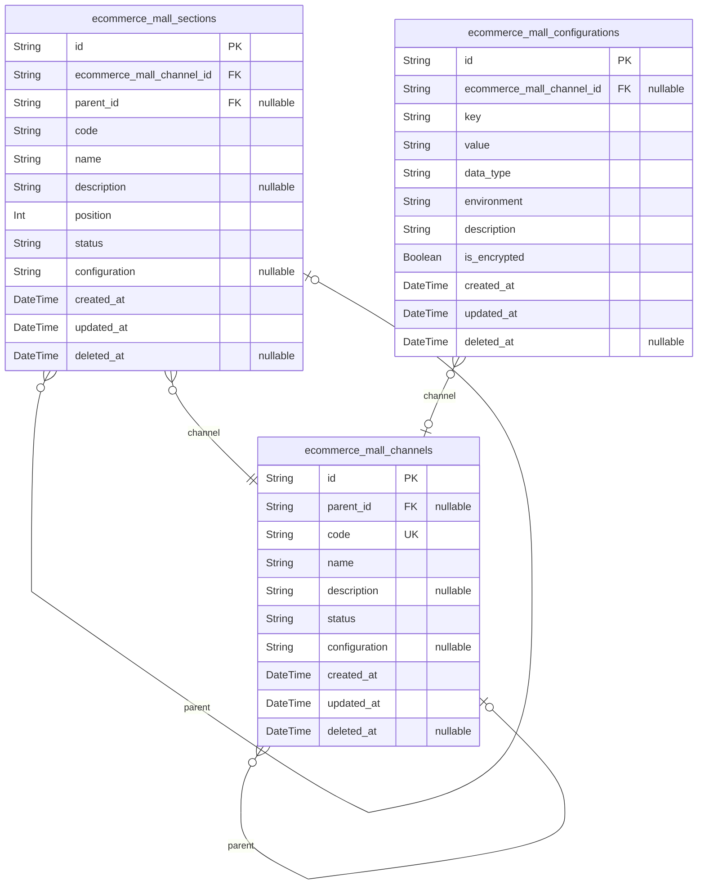
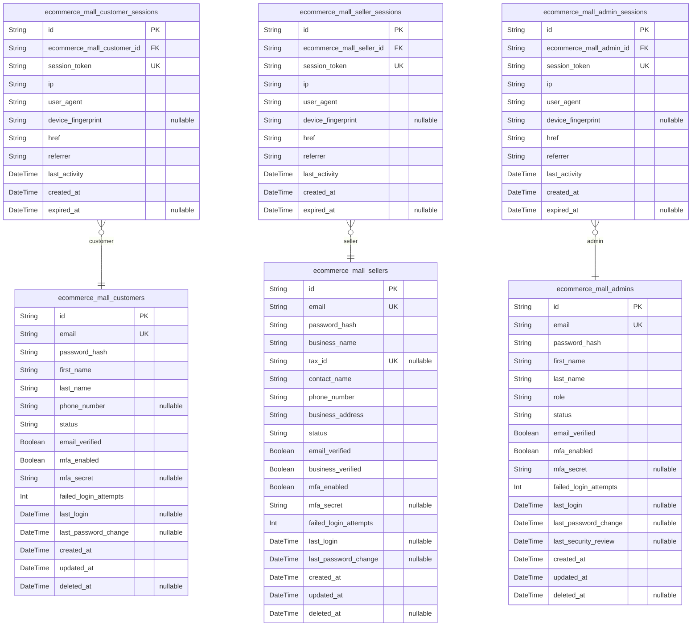
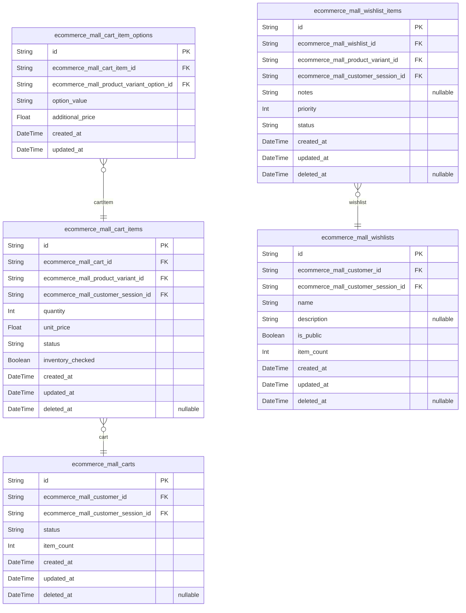
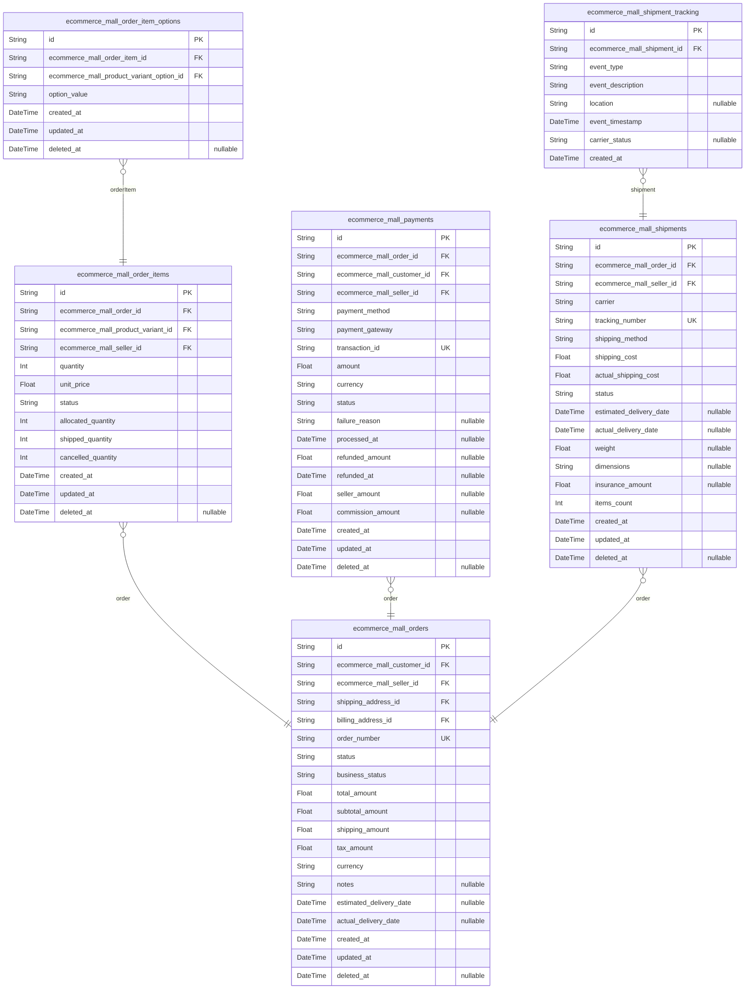
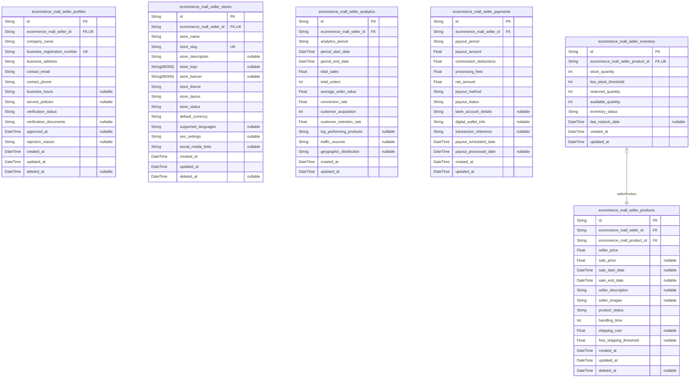
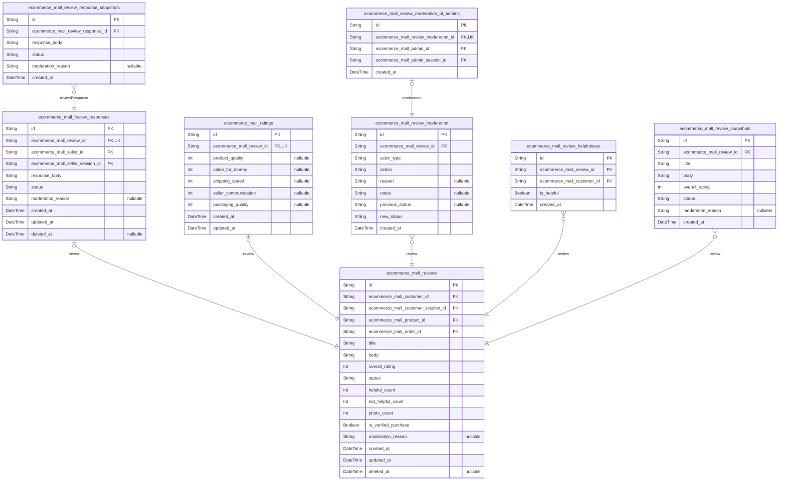
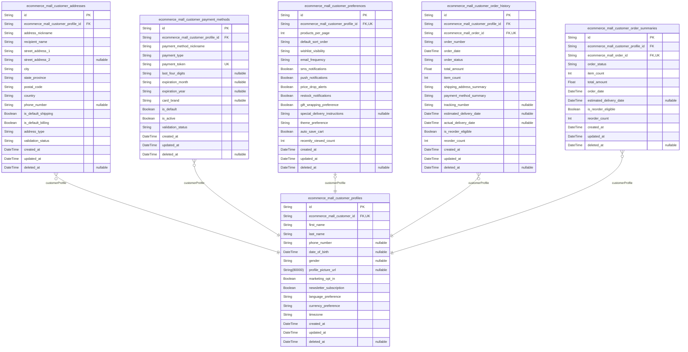
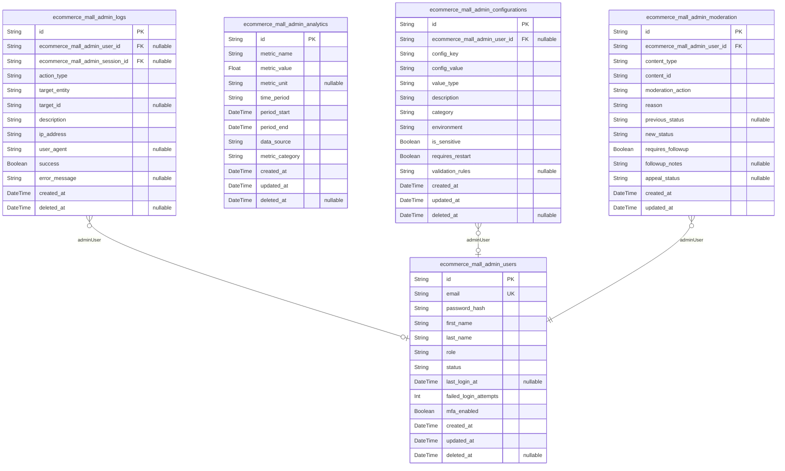
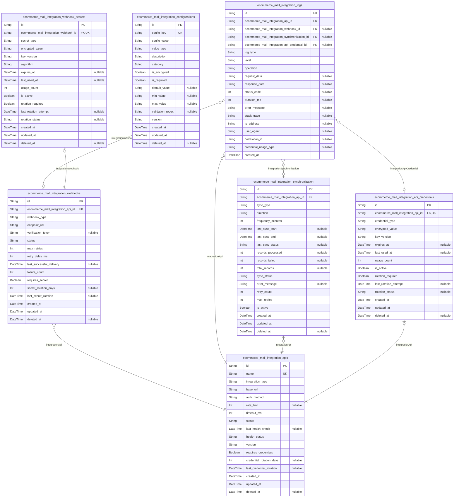

# Prisma Markdown

> Generated by [`prisma-markdown`](https://github.com/samchon/prisma-markdown)

- [Systematic](#systematic)
- [Actors](#actors)
- [Products](#products)
- [Carts](#carts)
- [Orders](#orders)
- [Sellers](#sellers)
- [Reviews](#reviews)
- [Customers](#customers)
- [Admin](#admin)
- [Integrations](#integrations)

## Systematic

### `ecommerce_mall_channels`

Platform channels representing distinct shopping environments or
storefronts.

Channels serve as organizational containers for products, sellers, and
customers within the e-commerce platform. Each channel can have unique
branding, product categories, and business rules while sharing the
underlying platform infrastructure.

Channels support hierarchical organization through parent-child
relationships, enabling multi-level channel structures for complex
marketplace configurations. Channel status management allows
administrators to activate, deactivate, or archive channels based on
business needs.

Key channel attributes include name, description, status, and
configuration settings that define the channel's behavior and appearance.
Channels reference sections for content organization and serve as the
primary navigation structure for customers browsing the platform.

Properties as follows:

- `id`: Primary Key.
- `parent_id`
  > Parent channel reference for hierarchical organization. {@link
  > ecommerce_mall_channels.id}.
- `code`: Unique channel identifier code for system reference and API access.
- `name`: Display name of the channel shown to customers and administrators.
- `description`: Detailed description explaining the channel's purpose and content focus.
- `status`: Current channel status: active, inactive, archived, or maintenance.
- `configuration`: JSON configuration data storing channel-specific settings and preferences.
- `created_at`: Timestamp when the channel was created in the system.
- `updated_at`: Timestamp when the channel was last modified.
- `deleted_at`: Timestamp when the channel was soft deleted, allowing for recovery.

### `ecommerce_mall_sections`

Content sections within channels for organizing products and navigation.

Sections provide hierarchical content organization within channels,
allowing administrators to structure product catalogs and create logical
navigation paths for customers. Each section belongs to a specific
channel and can contain multiple levels of subsections.

Sections support various content types including product categories,
promotional areas, and informational content. Section ordering and
visibility settings enable flexible content management and customer
experience customization.

Key section attributes include display name, description, ordering
position, and parent section relationships for building complex
navigation hierarchies. Sections serve as the primary content
organization mechanism within each channel.

Properties as follows:

- `id`: Primary Key.
- `ecommerce_mall_channel_id`: Channel that contains this section. [ecommerce_mall_channels.id](#ecommerce_mall_channels).
- `parent_id`
  > Parent section reference for hierarchical organization. {@link
  > ecommerce_mall_sections.id}.
- `code`: Unique section identifier code for system reference and API access.
- `name`: Display name of the section shown in navigation and content organization.
- `description`: Detailed description explaining the section's content and purpose.
- `position`: Numerical ordering position within the section hierarchy.
- `status`: Current section status: active, inactive, or hidden.
- `configuration`
  > JSON configuration data storing section-specific settings and display
  > options.
- `created_at`: Timestamp when the section was created in the system.
- `updated_at`: Timestamp when the section was last modified.
- `deleted_at`: Timestamp when the section was soft deleted, allowing for recovery.

### `ecommerce_mall_configurations`

System-wide configuration settings and platform parameters.

Configurations store platform-level settings that control global
behavior, feature toggles, and system parameters. These settings affect
all channels, sections, and users across the entire e-commerce platform.

Configuration values support various data types including strings,
numbers, booleans, and JSON objects for complex settings. The system
maintains configuration history and supports environment-specific values
for development, staging, and production environments.

Key configuration attributes include setting name, value, data type, and
environment scope. Configurations support hierarchical inheritance where
channel-specific settings can override platform defaults, enabling
flexible multi-tenant platform management.

Properties as follows:

- `id`: Primary Key.
- `ecommerce_mall_channel_id`
  > Channel-specific configuration override. {@link
  > ecommerce_mall_channels.id}.
- `key`: Unique configuration key identifier for system reference.
- `value`: Configuration value stored as string with type interpretation.
- `data_type`: Data type of the configuration value: string, number, boolean, json.
- `environment`: Environment scope: global, development, staging, production.
- `description`: Human-readable description of the configuration setting's purpose.
- `is_encrypted`: Whether the configuration value should be encrypted for security.
- `created_at`: Timestamp when the configuration was created.
- `updated_at`: Timestamp when the configuration was last modified.
- `deleted_at`: Timestamp when the configuration was soft deleted.

## Actors

### `ecommerce_mall_customers`

Registered customers who browse products, make purchases, and manage
their shopping experience.

Stores customer identity information including authentication
credentials, personal details, and account status. Customers can create
accounts, manage profiles, place orders, and interact with sellers
through the platform.

Each customer account requires email verification before activation and
supports password-based authentication with security features. The system
tracks account status with proper enum constraints and maintains
comprehensive audit trails for security and compliance.

Customers can have multiple sessions active concurrently for shopping
across different devices. Enhanced security includes MFA support and
detailed activity tracking.

Properties as follows:

- `id`: Primary Key.
- `email`
  > Customer email address used for authentication and communication. Must be
  > unique across all customers and validated for format compliance.
- `password_hash`
  > Securely hashed password for customer authentication using bcrypt with
  > work factor 12 for maximum security.
- `first_name`
  > Customer's first name for personalization, order processing, and customer
  > service interactions.
- `last_name`
  > Customer's last name for order processing, customer service, and legal
  > compliance requirements.
- `phone_number`
  > Customer phone number for order notifications, two-factor authentication,
  > and customer service contact.
- `status`
  > Account status indicating current state. Valid enum values:
  > pending_verification, active, suspended, terminated, locked.
- `email_verified`
  > Indicates whether the customer's email address has been verified through
  > the registration process with confirmation code validation.
- `mfa_enabled`
  > Indicates whether multi-factor authentication is enabled for enhanced
  > account security.
- `mfa_secret`
  > Encrypted multi-factor authentication secret for TOTP-based verification
  > when MFA is enabled.
- `failed_login_attempts`
  > Counter for consecutive failed login attempts used for account lockout
  > security policy enforcement.
- `last_login`
  > Timestamp of the customer's most recent successful login for security
  > monitoring and activity tracking.
- `last_password_change`
  > Timestamp when the customer last changed their password for security
  > policy compliance.
- `created_at`
  > Timestamp when the customer account was created during registration
  > process.
- `updated_at`: Timestamp when the customer account was last updated for any modification.
- `deleted_at`
  > Timestamp when the customer account was soft deleted for audit purposes
  > and data retention compliance.

### `ecommerce_mall_customer_sessions`

Authentication sessions for customer accounts with comprehensive security
tracking and activity monitoring.

Stores session information for authenticated customer interactions
including IP address, device context, security tokens, and connection
details. Each session represents a single authenticated connection from a
customer device with enhanced security features.

Sessions are used for detailed audit tracing of customer actions,
security event monitoring, and activity pattern analysis. The system
maintains session security with automatic expiration, device
fingerprinting, and suspicious activity detection.

Enhanced session management includes security token rotation, device
context tracking, and comprehensive logging for customer protection and
platform security.

Properties as follows:

- `id`: Primary Key.
- `ecommerce_mall_customer_id`: Belonged customer's [ecommerce_mall_customers.id](#ecommerce_mall_customers).
- `session_token`
  > Unique session token for authentication and authorization with automatic
  > rotation for security.
- `ip`
  > IP address of the customer's connection for security tracking, geographic
  > analysis, and threat detection.
- `user_agent`
  > User agent string identifying the customer's device and browser for
  > session context and security profiling.
- `device_fingerprint`
  > Device fingerprint hash for identifying unique devices and detecting
  > suspicious session activity.
- `href`
  > Connection URL where the customer authenticated for session context
  > tracking and referral analysis.
- `referrer`
  > Referrer URL indicating where the customer came from before
  > authentication for marketing and security analysis.
- `last_activity`
  > Timestamp of the last customer activity within this session for
  > inactivity timeout enforcement.
- `created_at`
  > Timestamp when the customer session was created with proper security
  > initialization.
- `expired_at`
  > Timestamp when the customer session expired or was manually terminated
  > for security cleanup.

### `ecommerce_mall_sellers`

Business sellers who manage product catalogs, inventory, and order
fulfillment operations.

Stores seller business information including company details,
authentication credentials, and account status. Sellers can register
businesses, manage product listings, process orders, and analyze sales
performance.

Each seller account requires business verification and administrative
approval before activation. The system supports multi-user access with
role-based permissions for seller staff management and enhanced security
including MFA capabilities.

Seller accounts have comprehensive business verification workflows and
maintain detailed audit trails for compliance and business intelligence.

Properties as follows:

- `id`: Primary Key.
- `email`
  > Seller email address used for business communications, account
  > authentication, and platform notifications.
- `password_hash`
  > Securely hashed password for seller authentication with enhanced security
  > requirements and regular rotation policies.
- `business_name`
  > Legal business name for seller identification, customer trust building,
  > and compliance verification.
- `tax_id`
  > Business tax identification number for compliance, financial reporting,
  > and government verification requirements.
- `contact_name`
  > Primary contact person for the seller business responsible for customer
  > service and platform communications.
- `phone_number`
  > Business phone number for customer service, order verification, and
  > emergency communications.
- `business_address`
  > Physical business address for verification, shipping purposes, and legal
  > compliance requirements.
- `status`
  > Seller account status indicating business verification state. Valid enum
  > values: pending_approval, active, suspended, terminated, under_review.
- `email_verified`
  > Indicates whether the seller's email address has been verified through
  > confirmation process.
- `business_verified`
  > Indicates whether the seller's business information has been verified by
  > administrators through documentation review.
- `mfa_enabled`
  > Indicates whether multi-factor authentication is enabled for enhanced
  > business account security.
- `mfa_secret`
  > Encrypted multi-factor authentication secret for TOTP-based verification
  > when MFA is enabled on business account.
- `failed_login_attempts`
  > Counter for consecutive failed login attempts used for business account
  > lockout security policy.
- `last_login`
  > Timestamp of the seller's most recent successful login for security
  > monitoring and business activity tracking.
- `last_password_change`
  > Timestamp when the seller last changed their password for security policy
  > compliance.
- `created_at`
  > Timestamp when the seller account was created during business
  > registration process.
- `updated_at`
  > Timestamp when the seller account was last updated for any business
  > information modification.
- `deleted_at`
  > Timestamp when the seller account was soft deleted for audit purposes and
  > business data retention.

### `ecommerce_mall_seller_sessions`

Authentication sessions for seller business accounts with enhanced
security monitoring and business activity tracking.

Stores session information for authenticated seller interactions
including IP address, business context, security tokens, and operational
details. Each session represents a single authenticated connection from a
seller device with business-grade security.

Sessions are used for comprehensive audit tracing of seller business
operations, security event monitoring, and operational pattern analysis.
The system maintains enhanced session security with business context
tracking and suspicious activity detection.

Business session management includes security token rotation, operational
context tracking, and detailed logging for business account protection
and platform integrity.

Properties as follows:

- `id`: Primary Key.
- `ecommerce_mall_seller_id`: Belonged seller's [ecommerce_mall_sellers.id](#ecommerce_mall_sellers).
- `session_token`
  > Unique session token for business authentication and authorization with
  > enhanced security rotation.
- `ip`
  > IP address of the seller's connection for security tracking, business
  > activity monitoring, and threat detection.
- `user_agent`
  > User agent string identifying the seller's device and browser for
  > business session context and security profiling.
- `device_fingerprint`
  > Device fingerprint hash for identifying unique business devices and
  > detecting suspicious session activity.
- `href`
  > Connection URL where the seller authenticated for business session
  > context tracking and operational analysis.
- `referrer`
  > Referrer URL indicating where the seller came from before authentication
  > for business intelligence and security analysis.
- `last_activity`
  > Timestamp of the last seller activity within this session for business
  > inactivity timeout enforcement.
- `created_at`
  > Timestamp when the seller session was created with business security
  > initialization.
- `expired_at`
  > Timestamp when the seller session expired or was manually terminated for
  > business security cleanup.

### `ecommerce_mall_admins`

System administrators with full platform management and oversight
capabilities.

Stores administrator account information including authentication
credentials, security settings, and access permissions. Administrators
manage platform operations, user accounts, content moderation, and system
configuration.

Admin accounts require the highest level of security including
multi-factor authentication, strict access controls, and comprehensive
audit trails. The system maintains detailed security event logging for
all administrative actions.

Administrator accounts are typically created by platform owners and have
role-based access control for platform management, customer support, and
security oversight.

Properties as follows:

- `id`: Primary Key.
- `email`
  > Administrator email address used for platform communications, secure
  > authentication, and security notifications.
- `password_hash`
  > Securely hashed password for administrator authentication with maximum
  > security requirements and mandatory regular rotation.
- `first_name`
  > Administrator's first name for identification, accountability, and audit
  > trail purposes.
- `last_name`
  > Administrator's last name for identification, accountability, and
  > comprehensive audit logging.
- `role`
  > Administrator role defining access permissions and responsibilities.
  > Valid enum values: super_admin, content_admin, support_admin,
  > analytics_admin, security_admin.
- `status`
  > Admin account status indicating access level and activation state. Valid
  > enum values: active, suspended, terminated, on_leave.
- `email_verified`
  > Indicates whether the administrator's email address has been verified
  > through secure verification process.
- `mfa_enabled`
  > Indicates whether multi-factor authentication is enabled for maximum
  > security compliance.
- `mfa_secret`
  > Encrypted multi-factor authentication secret for TOTP-based verification
  > with enhanced security protocols.
- `failed_login_attempts`
  > Counter for consecutive failed login attempts with immediate security
  > alerting and account lockout.
- `last_login`
  > Timestamp of the administrator's most recent successful login for
  > security auditing and access monitoring.
- `last_password_change`
  > Timestamp when the administrator last changed their password for strict
  > security policy compliance.
- `last_security_review`
  > Timestamp of the last security review for the administrator account for
  > compliance and risk assessment.
- `created_at`
  > Timestamp when the administrator account was created with proper
  > authorization and verification.
- `updated_at`
  > Timestamp when the administrator account was last updated for security or
  > permission changes.
- `deleted_at`
  > Timestamp when the administrator account was soft deleted for
  > comprehensive audit trail preservation.

### `ecommerce_mall_admin_sessions`

Authentication sessions for administrator accounts with maximum security
monitoring and comprehensive audit trails.

Stores session information for authenticated administrator interactions
including IP address, security context, administrative tokens, and system
access details. Each session represents a single authenticated connection
from an administrator device with maximum security requirements.

Sessions are used for comprehensive audit tracing of administrative
actions, security event monitoring, and system access pattern analysis.
The system maintains maximum session security with short timeouts,
detailed logging, and immediate threat detection.

Administrative session management includes secure token rotation, access
context tracking, and comprehensive security logging for platform
protection and compliance requirements.

Properties as follows:

- `id`: Primary Key.
- `ecommerce_mall_admin_id`: Belonged administrator's [ecommerce_mall_admins.id](#ecommerce_mall_admins).
- `session_token`
  > Unique session token for administrative authentication and authorization
  > with maximum security rotation protocols.
- `ip`
  > IP address of the administrator's connection for security tracking,
  > access monitoring, and immediate threat detection.
- `user_agent`
  > User agent string identifying the administrator's device and browser for
  > security context and access profiling.
- `device_fingerprint`
  > Device fingerprint hash for identifying unique administrative devices and
  > detecting unauthorized access attempts.
- `href`
  > Connection URL where the administrator authenticated for security context
  > tracking and access analysis.
- `referrer`
  > Referrer URL indicating where the administrator came from before
  > authentication for security intelligence and compliance tracking.
- `last_activity`
  > Timestamp of the last administrative activity within this session for
  > strict inactivity timeout enforcement.
- `created_at`
  > Timestamp when the administrator session was created with maximum
  > security initialization.
- `expired_at`
  > Timestamp when the administrator session expired or was manually
  > terminated for immediate security cleanup.

## Products

```mermaid
erDiagram
"ecommerce_mall_categories" {
  String id PK
  String parent_id FK "nullable"
  String name
  String description "nullable"
  String slug UK
  String(80000) image_url "nullable"
  Int display_order
  String status
  DateTime created_at
  DateTime updated_at
  DateTime deleted_at "nullable"
}
"ecommerce_mall_products" {
  String id PK
  String ecommerce_mall_category_id FK
  String ecommerce_mall_seller_id FK
  String name
  String description
  String sku UK
  String brand "nullable"
  Float base_price
  Float sale_price "nullable"
  Float cost_price "nullable"
  String status
  Boolean is_featured
  Boolean is_virtual
  Float weight "nullable"
  String dimensions "nullable"
  DateTime created_at
  DateTime updated_at
  DateTime deleted_at "nullable"
}
"ecommerce_mall_product_variants" {
  String id PK
  String ecommerce_mall_product_id FK
  String variant_sku UK
  String variant_name "nullable"
  Float price_adjustment
  String status
  String(80000) image_url "nullable"
  DateTime created_at
  DateTime updated_at
  DateTime deleted_at "nullable"
}
"ecommerce_mall_product_variant_options" {
  String id PK
  String ecommerce_mall_product_variant_id FK
  String attribute_type
  String attribute_value
  Int display_order
  DateTime created_at
  DateTime updated_at
  DateTime deleted_at "nullable"
}
"ecommerce_mall_inventory" {
  String id PK
  String ecommerce_mall_product_variant_id FK,UK
  Int current_stock
  Int reserved_stock
  Int low_stock_threshold
  Int reorder_point
  String status
  DateTime last_restock_date "nullable"
  DateTime created_at
  DateTime updated_at
  DateTime deleted_at "nullable"
}
"ecommerce_mall_inventory_snapshots" {
  String id PK
  String ecommerce_mall_product_variant_id FK
  Int previous_stock
  Int new_stock
  Int change_amount
  String change_type
  String change_reason "nullable"
  DateTime snapshot_date
}
"ecommerce_mall_categories" }o--o| "ecommerce_mall_categories" : parent
"ecommerce_mall_products" }o--|| "ecommerce_mall_categories" : category
"ecommerce_mall_product_variants" }o--|| "ecommerce_mall_products" : product
"ecommerce_mall_product_variant_options" }o--|| "ecommerce_mall_product_variants" : variant
"ecommerce_mall_inventory" |o--|| "ecommerce_mall_product_variants" : variant
"ecommerce_mall_inventory_snapshots" }o--|| "ecommerce_mall_product_variants" : variant
```

### `ecommerce_mall_categories`

Hierarchical product category structure for organizing the e-commerce
catalog.

Supports unlimited nesting levels with parent-child relationships to
create a comprehensive category tree. Each category can contain multiple
products and subcategories, enabling flexible product organization.

Categories maintain their own metadata including descriptions, images,
and display preferences. The hierarchy supports breadcrumb navigation and
efficient product filtering by category paths.

Soft deletion is supported to maintain historical relationships while
allowing category restructuring.

Properties as follows:

- `id`: Primary Key.
- `parent_id`
  > Parent category reference for hierarchical structure. {@link
  > ecommerce_mall_categories.id}.
- `name`: Category name used for display and navigation.
- `description`: Detailed category description for administrative and customer reference.
- `slug`: URL-friendly category identifier for SEO optimization.
- `image_url`: Category image URL for visual representation in the catalog.
- `display_order`: Sort order for category display in navigation menus.
- `status`: Category status: active, inactive, or archived.
- `created_at`: Category creation timestamp.
- `updated_at`: Last category update timestamp.
- `deleted_at`: Soft deletion timestamp for category archiving.

### `ecommerce_mall_products`

Core product catalog containing all sellable items in the e-commerce
platform.

Stores comprehensive product information including titles, descriptions,
pricing, and metadata. Products belong to categories and are associated
with sellers who manage their inventory and sales.

Each product can have multiple variants with specific attributes like
color, size, or material. Products support rich media with multiple
images and detailed specifications.

The product lifecycle includes creation, approval, activation, and
eventual retirement with full audit trail support.

Properties as follows:

- `id`: Primary Key.
- `ecommerce_mall_category_id`: Product category assignment. [ecommerce_mall_categories.id](#ecommerce_mall_categories).
- `ecommerce_mall_seller_id`
  > Seller who owns and manages this product. {@link
  > ecommerce_mall_sellers.id}.
- `name`: Product name for display and search.
- `description`: Detailed product description with features and specifications.
- `sku`: Stock Keeping Unit - unique product identifier.
- `brand`: Product brand or manufacturer name.
- `base_price`: Standard product price before discounts.
- `sale_price`: Current sale price if applicable.
- `cost_price`: Product cost for margin calculation.
- `status`: Product status: draft, pending, active, inactive, discontinued.
- `is_featured`: Flag indicating featured product status for promotions.
- `is_virtual`: Flag indicating digital/virtual product (no shipping required).
- `weight`: Product weight for shipping calculations.
- `dimensions`: Product dimensions (LxWxH) for packaging.
- `created_at`: Product creation timestamp.
- `updated_at`: Last product update timestamp.
- `deleted_at`: Soft deletion timestamp for product retirement.

### `ecommerce_mall_product_variants`

Product variants representing different versions of a base product with
specific attributes.

Each variant corresponds to a unique SKU with distinct pricing,
inventory, and attribute combinations. Variants enable customers to
choose specific product options like size, color, or material.

Variants inherit core product information while maintaining their own
pricing adjustments and variant-specific images. This allows for
efficient management of product variations without duplicating common
attributes.

The variant system supports complex product configurations with multiple
attribute dimensions. Current price is calculated dynamically from base
product price plus variant adjustment to maintain normalization.

Soft deletion is supported to maintain historical relationships while
allowing variant retirement.

Properties as follows:

- `id`: Primary Key.
- `ecommerce_mall_product_id`
  > Parent product that this variant belongs to. {@link
  > ecommerce_mall_products.id}.
- `variant_sku`: Unique SKU for this specific product variant.
- `variant_name`: Variant-specific name or description.
- `price_adjustment`: Price difference from base product price (can be positive or negative).
- `status`: Variant status: active, inactive, out_of_stock.
- `image_url`: Variant-specific image URL.
- `created_at`: Variant creation timestamp.
- `updated_at`: Last variant update timestamp.
- `deleted_at`: Soft deletion timestamp for variant removal.

### `ecommerce_mall_product_variant_options`

Individual attribute options that define specific product variants.

Stores the actual attribute values that differentiate variants, such as
"Red" for color or "Large" for size. Each option belongs to a variant and
represents one dimension of the product configuration.

Options enable flexible product attribute management and support complex
variant combinations. The system can handle multiple attribute types
including colors, sizes, materials, and custom options.

This table supports the variant selection process by providing the
specific attribute values for each available variant. Soft deletion is
added for consistency with other entities.

Properties as follows:

- `id`: Primary Key.
- `ecommerce_mall_product_variant_id`
  > Product variant that this option belongs to. {@link
  > ecommerce_mall_product_variants.id}.
- `attribute_type`: Type of attribute: color, size, material, etc.
- `attribute_value`: Specific value for this attribute option.
- `display_order`: Sort order for attribute display in selection interfaces.
- `created_at`: Option creation timestamp.
- `updated_at`: Last option update timestamp.
- `deleted_at`: Soft deletion timestamp for option removal.

### `ecommerce_mall_inventory`

Real-time inventory tracking for product variants with stock level
management.

Maintains current stock quantities, reserved quantities for pending
orders, and supports inventory thresholds for low stock alerts. The
available stock is calculated dynamically from current stock minus
reserved stock to maintain normalization.

The inventory system prevents overselling by reserving stock during
checkout and provides real-time availability information to customers.
Supports multiple inventory management strategies including just-in-time
and safety stock levels.

Inventory updates are transactional to ensure data consistency during
high-volume order processing. Soft deletion is supported for inventory
record archiving.

Properties as follows:

- `id`: Primary Key.
- `ecommerce_mall_product_variant_id`: Product variant being tracked. [ecommerce_mall_product_variants.id](#ecommerce_mall_product_variants).
- `current_stock`: Current physical inventory quantity available.
- `reserved_stock`: Quantity reserved for pending orders.
- `low_stock_threshold`: Stock level that triggers low inventory alerts.
- `reorder_point`: Stock level that triggers reorder recommendations.
- `status`: Inventory status: in_stock, low_stock, out_of_stock.
- `last_restock_date`: Date when inventory was last replenished.
- `created_at`: Inventory record creation timestamp.
- `updated_at`: Last inventory update timestamp.
- `deleted_at`: Soft deletion timestamp for inventory record archiving.

### `ecommerce_mall_inventory_snapshots`

Historical inventory records capturing point-in-time stock levels for
audit and analytics.

Provides complete inventory history for tracking stock movements, sales
patterns, and inventory accuracy. Each snapshot captures the inventory
state before and after significant events like sales, returns, or stock
adjustments.

The snapshot system supports inventory reconciliation, trend analysis,
and compliance reporting. Helps identify inventory discrepancies and
provides data for demand forecasting and purchasing decisions.

Snapshots are append-only and preserve the complete inventory history for
each product variant.

Properties as follows:

- `id`: Primary Key.
- `ecommerce_mall_product_variant_id`
  > Product variant being snapshotted. {@link
  > ecommerce_mall_product_variants.id}.
- `previous_stock`: Stock quantity before the inventory change.
- `new_stock`: Stock quantity after the inventory change.
- `change_amount`
  > Net change in stock quantity (positive for additions, negative for
  > deductions).
- `change_type`: Type of inventory change: sale, return, adjustment, restock.
- `change_reason`: Description or reference for the inventory change.
- `snapshot_date`: Timestamp when the snapshot was taken.

## Carts

### `ecommerce_mall_carts`

Customer shopping carts for temporary product selection before purchase.

Stores active shopping sessions where customers add products they intend
to purchase. Each cart belongs to a specific customer and maintains the
current selection of products with quantities and pricing. Carts support
temporary storage of shopping intent and can be abandoned or converted to
orders.

Carts include pricing calculations, tax estimates, and shipping cost
previews to help customers make informed purchasing decisions. Soft
deletion allows customers to clear carts while maintaining audit trails
for abandoned cart analysis.

Customer session tracking ensures proper audit trail for all cart
operations and modifications.

Properties as follows:

- `id`: Primary Key.
- `ecommerce_mall_customer_id`: Customer who owns this shopping cart. [ecommerce_mall_customers.id](#ecommerce_mall_customers)
- `ecommerce_mall_customer_session_id`
  > Customer session when cart was created or modified. {@link
  > ecommerce_mall_customer_sessions.id}
- `status`
  > Current cart status: active, abandoned, converted_to_order,
  > saved_for_later.
- `item_count`: Total number of items in the shopping cart.
- `created_at`: Timestamp when the cart was created.
- `updated_at`: Timestamp when the cart was last updated.
- `deleted_at`: Timestamp when the cart was soft deleted.

### `ecommerce_mall_cart_items`

Individual products added to customer shopping carts.

Represents specific product variants selected by customers for potential
purchase. Each cart item links to a product variant and includes
quantity, unit price, and any selected options. Cart items maintain
pricing consistency during the shopping session.

Items can be added, removed, or have quantities adjusted by customers.
The system tracks inventory availability and prevents overselling by
validating stock levels during cart operations.

Customer session tracking ensures audit trail for all item modifications
and selections.

Properties as follows:

- `id`: Primary Key.
- `ecommerce_mall_cart_id`: Shopping cart that contains this item. [ecommerce_mall_carts.id](#ecommerce_mall_carts)
- `ecommerce_mall_product_variant_id`
  > Specific product variant selected by customer. {@link
  > ecommerce_mall_product_variants.id}
- `ecommerce_mall_customer_session_id`
  > Customer session when item was added or modified. {@link
  > ecommerce_mall_customer_sessions.id}
- `quantity`: Number of units of this product variant in cart.
- `unit_price`: Price per unit at time of adding to cart.
- `status`: Item status: active, saved_for_later, out_of_stock, removed.
- `inventory_checked`: Whether inventory availability was verified for this item.
- `created_at`: Timestamp when item was added to cart.
- `updated_at`: Timestamp when item was last modified.
- `deleted_at`: Timestamp when item was removed from cart.

### `ecommerce_mall_cart_item_options`

Specific option selections for cart items with customizable products.

Stores customer-selected options for product variants that support
customization. Each option represents a specific choice made by the
customer, such as color selection, size choice, or additional features.
Options link back to the available product variant options.

This table ensures that customized product selections are preserved
throughout the shopping session and carried forward to the order if
purchased.

Customers directly manage these options during the shopping process,
requiring independent stance classification.

Properties as follows:

- `id`: Primary Key.
- `ecommerce_mall_cart_item_id`
  > Cart item that this option applies to. {@link
  > ecommerce_mall_cart_items.id}
- `ecommerce_mall_product_variant_option_id`
  > Product variant option that was selected. {@link
  > ecommerce_mall_product_variant_options.id}
- `option_value`: Customer-selected value for this option.
- `additional_price`: Extra cost added by this option selection.
- `created_at`: Timestamp when option was selected.
- `updated_at`: Timestamp when option was last modified.

### `ecommerce_mall_wishlists`

Customer wishlists for saving products for future consideration.

Allows customers to create personalized collections of products they are
interested in purchasing later. Each wishlist can have a custom name and
description, supporting multiple wishlists per customer for different
purposes (e.g., birthday list, home improvement projects).

Wishlists help customers track products they like and receive
notifications when items go on sale or become available. They serve as
personalized product discovery tools separate from active shopping carts.

Customer session tracking ensures audit trail for wishlist creation and
modifications.

Properties as follows:

- `id`: Primary Key.
- `ecommerce_mall_customer_id`: Customer who owns this wishlist. [ecommerce_mall_customers.id](#ecommerce_mall_customers)
- `ecommerce_mall_customer_session_id`
  > Customer session when wishlist was created or modified. {@link
  > ecommerce_mall_customer_sessions.id}
- `name`: Custom name for the wishlist given by customer.
- `description`: Optional description of the wishlist purpose.
- `is_public`: Whether the wishlist is visible to other users.
- `item_count`: Total number of items in the wishlist.
- `created_at`: Timestamp when wishlist was created.
- `updated_at`: Timestamp when wishlist was last modified.
- `deleted_at`: Timestamp when wishlist was deleted.

### `ecommerce_mall_wishlist_items`

Products saved in customer wishlists for future reference.

Represents individual product variants that customers have added to their
wishlists for potential future purchase. Each wishlist item maintains a
reference to the specific product variant and includes metadata about
when it was added.

Customers can move items from wishlists to shopping carts when ready to
purchase. The system tracks which products are most frequently wishlisted
for popularity analysis.

Customer session tracking ensures audit trail for wishlist item
operations and modifications.

Properties as follows:

- `id`: Primary Key.
- `ecommerce_mall_wishlist_id`: Wishlist that contains this item. [ecommerce_mall_wishlists.id](#ecommerce_mall_wishlists)
- `ecommerce_mall_product_variant_id`
  > Product variant saved in wishlist. {@link
  > ecommerce_mall_product_variants.id}
- `ecommerce_mall_customer_session_id`
  > Customer session when item was added or modified. {@link
  > ecommerce_mall_customer_sessions.id}
- `notes`: Optional customer notes about why this item was saved.
- `priority`: Customer-assigned priority level for purchase consideration.
- `status`: Item status: active, purchased, unavailable, removed.
- `created_at`: Timestamp when item was added to wishlist.
- `updated_at`: Timestamp when item was last modified.
- `deleted_at`: Timestamp when item was removed from wishlist.

## Orders

### `ecommerce_mall_orders`

Core order entity representing completed transactions in the e-commerce
platform.

Stores comprehensive order information including customer details, order
totals, shipping information, and fulfillment status. Each order
represents a completed purchase transaction with associated payment and
shipping records.

Orders follow a defined lifecycle from placement through delivery, with
status tracking at each stage. The system maintains audit trails for
order modifications, cancellations, and fulfillment updates to ensure
transaction integrity and customer satisfaction.

Properties as follows:

- `id`: Primary Key.
- `ecommerce_mall_customer_id`: Customer who placed the order. [ecommerce_mall_customers.id](#ecommerce_mall_customers)
- `ecommerce_mall_seller_id`
  > Seller responsible for order fulfillment. {@link
  > ecommerce_mall_sellers.id}
- `shipping_address_id`
  > Shipping address for order delivery. {@link
  > ecommerce_mall_customer_addresses.id}
- `billing_address_id`
  > Billing address for payment processing. {@link
  > ecommerce_mall_customer_addresses.id}
- `order_number`: Unique order identifier for customer reference and tracking.
- `status`
  > Current order status (pending, processing, shipped, delivered, cancelled,
  > completed).
- `business_status`: Internal business status for workflow management and reporting.
- `total_amount`: Total order amount including products, shipping, and taxes.
- `subtotal_amount`: Order subtotal before shipping and taxes.
- `shipping_amount`: Shipping cost for the order.
- `tax_amount`: Tax amount calculated for the order.
- `currency`: Currency code for order amounts (e.g., USD, EUR, GBP).
- `notes`: Customer notes or special instructions for the order.
- `estimated_delivery_date`: Estimated delivery date provided to customer.
- `actual_delivery_date`: Actual delivery date when order is completed.
- `created_at`: Order creation timestamp.
- `updated_at`: Last order update timestamp.
- `deleted_at`: Soft delete timestamp for order cancellation or archival.

### `ecommerce_mall_order_items`

Individual items within an order, representing specific products purchased.

Each order item corresponds to a product variant selected by the
customer, with quantity and pricing details. Items maintain references to
both the parent order and the original product for inventory tracking and
customer reference.

Order items support complex product configurations through associated
option records, enabling detailed order tracking and accurate fulfillment
processing. The total_price field has been removed to maintain 3NF
compliance - this should be calculated at application level.

Items now include enhanced status tracking and seller references for
improved fulfillment management.

Properties as follows:

- `id`: Primary Key.
- `ecommerce_mall_order_id`: Parent order containing this item. [ecommerce_mall_orders.id](#ecommerce_mall_orders)
- `ecommerce_mall_product_variant_id`
  > Product variant purchased by customer. {@link
  > ecommerce_mall_product_variants.id}
- `ecommerce_mall_seller_id`
  > Seller responsible for this item's fulfillment. {@link
  > ecommerce_mall_sellers.id}
- `quantity`: Quantity of the product variant ordered.
- `unit_price`: Price per unit at time of purchase.
- `status`
  > Item fulfillment status (pending, allocated, shipped, delivered,
  > cancelled, returned).
- `allocated_quantity`: Quantity allocated from inventory for this order item.
- `shipped_quantity`: Quantity shipped to customer for this order item.
- `cancelled_quantity`: Quantity cancelled from this order item.
- `created_at`: Item creation timestamp.
- `updated_at`: Last item update timestamp.
- `deleted_at`: Soft delete timestamp for item cancellation.

### `ecommerce_mall_order_item_options`

Configuration options selected for order items, capturing product
customizations.

Stores specific variant options chosen by customers during purchase, such
as size, color, material, or other product attributes. Each option record
links an order item to its corresponding product variant option for
accurate fulfillment and customer reference.

This table ensures that complex product configurations are preserved
throughout the order lifecycle, supporting accurate inventory management
and customer satisfaction.

Properties as follows:

- `id`: Primary Key.
- `ecommerce_mall_order_item_id`: Order item being configured. [ecommerce_mall_order_items.id](#ecommerce_mall_order_items)
- `ecommerce_mall_product_variant_option_id`
  > Product variant option selected. {@link
  > ecommerce_mall_product_variant_options.id}
- `option_value`: Specific value chosen for this option (e.g., "Red", "Large", "Cotton").
- `created_at`: Option creation timestamp.
- `updated_at`: Last option update timestamp.
- `deleted_at`: Soft delete timestamp for option removal.

### `ecommerce_mall_payments`

Payment records associated with customer orders.

Stores comprehensive payment information including transaction details,
payment method, status, and processing history. Each payment record links
to a specific order and maintains audit trails for financial compliance
and customer service.

Supports multiple payment methods including credit cards, digital
wallets, and bank transfers, with secure handling of payment data through
tokenization and compliance with financial regulations. Enhanced with
seller references for payment distribution tracking.

Properties as follows:

- `id`: Primary Key.
- `ecommerce_mall_order_id`: Order being paid. [ecommerce_mall_orders.id](#ecommerce_mall_orders)
- `ecommerce_mall_customer_id`: Customer making the payment. [ecommerce_mall_customers.id](#ecommerce_mall_customers)
- `ecommerce_mall_seller_id`: Seller receiving payment distribution. [ecommerce_mall_sellers.id](#ecommerce_mall_sellers)
- `payment_method`: Payment method used (credit_card, paypal, bank_transfer, etc.).
- `payment_gateway`: Payment gateway processor used for transaction.
- `transaction_id`: Unique transaction identifier from payment gateway.
- `amount`: Payment amount processed.
- `currency`: Currency code for payment amount.
- `status`
  > Payment status (pending, processing, completed, failed, refunded,
  > partially_refunded).
- `failure_reason`: Reason for payment failure if applicable.
- `processed_at`: Timestamp when payment was processed by gateway.
- `refunded_amount`: Amount refunded to customer if applicable.
- `refunded_at`: Timestamp when refund was processed.
- `seller_amount`: Amount distributed to seller after fees and commissions.
- `commission_amount`: Platform commission deducted from payment.
- `created_at`: Payment record creation timestamp.
- `updated_at`: Last payment update timestamp.
- `deleted_at`: Soft delete timestamp for payment record archival.

### `ecommerce_mall_shipments`

Shipping records for order fulfillment and delivery tracking.

Manages the complete shipping lifecycle from order preparation through
final delivery. Each shipment record contains carrier information,
tracking details, shipping costs, and delivery status updates.

Supports multiple shipping methods and carriers, with integration to
external shipping APIs for real-time tracking and label generation.
Enhanced with item-level tracking capabilities for partial shipments and
improved seller management.

Properties as follows:

- `id`: Primary Key.
- `ecommerce_mall_order_id`: Order being shipped. [ecommerce_mall_orders.id](#ecommerce_mall_orders)
- `ecommerce_mall_seller_id`: Seller responsible for shipment. [ecommerce_mall_sellers.id](#ecommerce_mall_sellers)
- `carrier`: Shipping carrier used (UPS, FedEx, DHL, USPS, etc.).
- `tracking_number`: Carrier-provided tracking number for shipment.
- `shipping_method`: Shipping service level (standard, expedited, overnight, etc.).
- `shipping_cost`: Cost of shipping charged to customer.
- `actual_shipping_cost`: Actual cost paid to carrier for shipping.
- `status`
  > Shipment status (created, picked_up, in_transit, out_for_delivery,
  > delivered, exception, cancelled).
- `estimated_delivery_date`: Estimated delivery date provided by carrier.
- `actual_delivery_date`: Actual delivery date when shipment completed.
- `weight`: Total weight of shipment in kilograms.
- `dimensions`: Package dimensions (length×width×height) for shipping calculations.
- `insurance_amount`: Insurance value for shipment if applicable.
- `items_count`: Number of order items included in this shipment.
- `created_at`: Shipment creation timestamp.
- `updated_at`: Last shipment update timestamp.
- `deleted_at`: Soft delete timestamp for shipment record archival.

### `ecommerce_mall_shipment_tracking`

Detailed tracking events for shipment progress and delivery status.

Captures individual tracking events received from shipping carriers,
providing real-time visibility into shipment movement. Each tracking
record includes event type, location, timestamp, and status description
for comprehensive delivery monitoring.

Supports integration with multiple carrier APIs for automated tracking
updates and provides the foundation for customer notifications and
delivery exception handling.

Properties as follows:

- `id`: Primary Key.
- `ecommerce_mall_shipment_id`: Shipment being tracked. [ecommerce_mall_shipments.id](#ecommerce_mall_shipments)
- `event_type`: Tracking event type (pickup, transit, delivery, exception, etc.).
- `event_description`: Detailed description of tracking event.
- `location`: Location where event occurred (city, state, facility).
- `event_timestamp`: Timestamp when tracking event occurred according to carrier.
- `carrier_status`: Raw status code provided by carrier API.
- `created_at`: Tracking record creation timestamp.

## Sellers

### `ecommerce_mall_seller_profiles`

Seller business profiles containing company information, verification
status, and contact details.

Stores comprehensive business information for sellers including company
registration details, tax identification, and verification status. Each
profile is associated with a seller account and undergoes approval
workflow before activation.

Profiles maintain business contact information, operational hours, and
service policies. The verification process includes document submission
and administrative review to ensure platform compliance and customer
trust.

Soft deletion is supported to maintain audit trails while allowing
account management. Status tracking enables proper workflow management
from pending approval to active operation.

Properties as follows:

- `id`: Primary Key.
- `ecommerce_mall_seller_id`: Associated seller account. [ecommerce_mall_sellers.id](#ecommerce_mall_sellers)
- `company_name`: Legal company name for business verification and customer display.
- `business_registration_number`: Official business registration or tax identification number.
- `business_address`: Registered business address for legal and correspondence purposes.
- `contact_email`: Business contact email for official communications.
- `contact_phone`: Business contact phone number for customer support.
- `business_hours`: Standard business operating hours for customer service.
- `service_policies`
  > Seller's service policies including shipping, returns, and customer
  > service.
- `verification_status`: Current verification status: pending, approved, rejected, suspended.
- `verification_documents`: JSON array of uploaded verification document references.
- `approved_at`: Timestamp when seller profile was approved by administrators.
- `rejection_reason`: Reason provided if seller profile was rejected during verification.
- `created_at`: Timestamp when seller profile was created.
- `updated_at`: Timestamp when seller profile was last updated.
- `deleted_at`: Timestamp when seller profile was soft deleted.

### `ecommerce_mall_seller_stores`

Seller storefront configurations including branding, layout, and display
settings.

Manages individual seller storefront presentations with customizable
branding elements, store descriptions, and visual configurations. Each
store is associated with a seller profile and can be configured
independently.

Stores support multiple themes, banner images, and layout options to
create unique shopping experiences. Store status controls visibility to
customers while maintenance mode allows for updates without public
access.

Performance metrics track store engagement and customer interactions.
Store configurations support internationalization with multi-language and
multi-currency capabilities.

Properties as follows:

- `id`: Primary Key.
- `ecommerce_mall_seller_id`: Owner seller account. [ecommerce_mall_sellers.id](#ecommerce_mall_sellers)
- `store_name`: Display name of the seller's storefront.
- `store_slug`: URL-friendly identifier for store access.
- `store_description`: Detailed description of the store for customer information.
- `store_logo`: URL to store logo image for branding.
- `store_banner`: URL to store banner image for header display.
- `store_theme`: Selected theme configuration for store appearance.
- `store_layout`: Layout configuration for product display and navigation.
- `store_status`: Current store status: active, inactive, maintenance.
- `default_currency`: Primary currency for product pricing in this store.
- `supported_languages`: JSON array of supported languages for store content.
- `seo_settings`: JSON configuration for search engine optimization.
- `social_media_links`: JSON array of social media profile links.
- `created_at`: Timestamp when store configuration was created.
- `updated_at`: Timestamp when store configuration was last updated.
- `deleted_at`: Timestamp when store configuration was soft deleted.

### `ecommerce_mall_seller_products`

Seller-specific product pricing and presentation configurations.

Manages seller-specific pricing strategies, promotional campaigns, and
product presentation settings for products offered in their store. Each
record represents a seller's customized offering of a platform product
with individual pricing and marketing configurations.

Supports flexible pricing models including regular pricing, sale pricing
with date ranges, and promotional strategies. Product status controls
visibility in the seller's store while presentation settings allow for
customized product descriptions and images.

Integration with inventory management ensures pricing reflects current
availability. Performance tracking monitors sales effectiveness of
pricing strategies for business optimization.

Properties as follows:

- `id`: Primary Key.
- `ecommerce_mall_seller_id`: Seller offering this product. [ecommerce_mall_sellers.id](#ecommerce_mall_sellers)
- `ecommerce_mall_product_id`: Base product from catalog. [ecommerce_mall_products.id](#ecommerce_mall_products)
- `seller_price`: Seller-specific regular price for this product offering.
- `sale_price`: Temporary sale price for promotional campaigns.
- `sale_start_date`: Start date and time for sale pricing period.
- `sale_end_date`: End date and time for sale pricing period.
- `seller_description`: Seller-specific product description and marketing content.
- `seller_images`: JSON array of seller-specific product images and media.
- `product_status`: Status: active, inactive, discontinued for store visibility.
- `handling_time`: Days required for order processing before shipping.
- `shipping_cost`: Seller-specific shipping cost for this product.
- `free_shipping_threshold`: Order value that qualifies for free shipping promotion.
- `created_at`: Timestamp when seller product configuration was created.
- `updated_at`: Timestamp when seller product configuration was last updated.
- `deleted_at`: Timestamp when seller product was soft deleted.

### `ecommerce_mall_seller_analytics`

Seller performance analytics and business intelligence data.

Collects and aggregates seller performance metrics including sales data,
customer engagement, and operational efficiency. Provides insights for
business optimization and strategic decision-making.

Tracks key performance indicators such as conversion rates, average order
value, and customer retention. Data is aggregated at daily, weekly, and
monthly intervals for trend analysis.

Integration with order and customer systems ensures comprehensive data
collection. Analytics support seller growth through performance
benchmarking and opportunity identification.

Properties as follows:

- `id`: Primary Key.
- `ecommerce_mall_seller_id`: Seller account for analytics. [ecommerce_mall_sellers.id](#ecommerce_mall_sellers)
- `analytics_period`: Time period for analytics: daily, weekly, monthly.
- `period_start_date`: Start date of analytics reporting period.
- `period_end_date`: End date of analytics reporting period.
- `total_sales`: Total sales revenue for the period.
- `total_orders`: Total number of orders processed.
- `average_order_value`: Average value of orders during period.
- `conversion_rate`: Percentage of visitors who made purchases.
- `customer_acquisition`: Number of new customers acquired.
- `customer_retention_rate`: Percentage of returning customers.
- `top_performing_products`: JSON array of best-selling product IDs and metrics.
- `traffic_sources`: JSON breakdown of customer traffic sources.
- `geographic_distribution`: JSON data of customer locations.
- `created_at`: Timestamp when analytics record was created.
- `updated_at`: Timestamp when analytics record was last updated.

### `ecommerce_mall_seller_payments`

Seller payment records and payout management.

Manages financial transactions related to seller earnings, payouts, and
commission calculations. Tracks payment processing, fee deductions, and
settlement status.

Supports multiple payout methods including bank transfers, digital
wallets, and platform credits. Payment scheduling follows business rules
with minimum payout thresholds and processing cycles.

Integration with order and commission systems ensures accurate financial
reporting. Security measures protect sensitive payment information and
prevent fraudulent activities.

Properties as follows:

- `id`: Primary Key.
- `ecommerce_mall_seller_id`: Seller receiving payment. [ecommerce_mall_sellers.id](#ecommerce_mall_sellers)
- `payout_period`: Time period covered by this payout.
- `payout_amount`: Total amount to be paid to seller.
- `commission_deductions`: Platform commission deducted from earnings.
- `processing_fees`: Payment processing fees applied.
- `net_amount`: Final amount transferred to seller after deductions.
- `payout_method`: Payment method: bank_transfer, digital_wallet, platform_credit.
- `payout_status`: Current status: pending, processing, completed, failed.
- `bank_account_details`: Encrypted bank account information for transfers.
- `digital_wallet_info`: Encrypted digital wallet payment details.
- `transaction_reference`: External payment gateway transaction reference.
- `payout_scheduled_date`: Date when payout is scheduled for processing.
- `payout_processed_date`: Date when payout was successfully processed.
- `created_at`: Timestamp when payment record was created.
- `updated_at`: Timestamp when payment record was last updated.

### `ecommerce_mall_seller_inventory`

Seller-specific inventory management for product stock levels and
availability.

Tracks real-time inventory quantities, stock thresholds, and availability
status for products offered by sellers. Separates inventory management
from pricing configurations to maintain proper normalization and
independent lifecycle management.

Supports stock level tracking with low stock alerts and out-of-stock
management. Inventory snapshots enable historical tracking of stock
movements and sales patterns for business intelligence.

Integration with order processing ensures accurate stock level updates
and prevents overselling. Separate inventory management allows for
independent stock operations without affecting pricing configurations.

Properties as follows:

- `id`: Primary Key.
- `ecommerce_mall_seller_product_id`: Seller product configuration. [ecommerce_mall_seller_products.id](#ecommerce_mall_seller_products)
- `stock_quantity`: Current available stock quantity for this seller's product.
- `low_stock_threshold`: Stock level that triggers low stock alerts to seller.
- `reserved_quantity`: Quantity reserved for pending orders or carts.
- `available_quantity`: Calculated available quantity (stock - reserved).
- `inventory_status`: Status: in_stock, low_stock, out_of_stock, discontinued.
- `last_restock_date`: Timestamp when inventory was last replenished.
- `created_at`: Timestamp when inventory record was created.
- `updated_at`: Timestamp when inventory record was last updated.

## Reviews

### `ecommerce_mall_reviews`

Customer reviews for purchased products.

Stores detailed feedback from customers who have purchased products,
including overall ratings and written comments. Each review is tied to a
specific product purchase and requires verification that the customer
actually bought the product.

Reviews go through a moderation workflow before publication and support
features like photo uploads, helpfulness voting, and seller responses.
The system maintains review history through snapshots for audit purposes
and content moderation tracking.

Individual rating breakdowns are stored in the separate
ecommerce_mall_ratings table to maintain proper normalization and avoid
data redundancy.

Properties as follows:

- `id`: Primary Key.
- `ecommerce_mall_customer_id`: Customer who submitted the review. [ecommerce_mall_customers.id](#ecommerce_mall_customers)
- `ecommerce_mall_customer_session_id`
  > Customer session when review was submitted. {@link
  > ecommerce_mall_customer_sessions.id}
- `ecommerce_mall_product_id`: Product being reviewed. [ecommerce_mall_products.id](#ecommerce_mall_products)
- `ecommerce_mall_order_id`
  > Order that contained the reviewed product. {@link
  > ecommerce_mall_orders.id}
- `title`: Review title summarizing the customer feedback.
- `body`: Detailed review content with customer comments.
- `overall_rating`: Overall product rating from 1 to 5 stars.
- `status`: Review status: pending, approved, rejected, flagged.
- `helpful_count`: Number of users who found this review helpful.
- `not_helpful_count`: Number of users who did not find this review helpful.
- `photo_count`: Number of photos attached to this review.
- `is_verified_purchase`: Indicates if review is from a verified purchase.
- `moderation_reason`: Reason provided for moderation actions.
- `created_at`: Timestamp when the review was submitted.
- `updated_at`: Timestamp when the review was last updated.
- `deleted_at`: Timestamp when the review was soft deleted.

### `ecommerce_mall_review_responses`

Seller responses to customer reviews.

Stores responses from sellers addressing customer feedback and concerns.
Each response is tied to a specific review and allows sellers to provide
additional information, address issues, or thank customers for their
feedback.

Responses support moderation workflows and maintain relationship to the
original review for context. Sellers can respond to reviews to improve
customer satisfaction and demonstrate commitment to service quality.

Properties as follows:

- `id`: Primary Key.
- `ecommerce_mall_review_id`: Review being responded to. [ecommerce_mall_reviews.id](#ecommerce_mall_reviews)
- `ecommerce_mall_seller_id`: Seller who submitted the response. [ecommerce_mall_sellers.id](#ecommerce_mall_sellers)
- `ecommerce_mall_seller_session_id`
  > Seller session when response was submitted. {@link
  > ecommerce_mall_seller_sessions.id}
- `response_body`: Seller's response content addressing the review.
- `status`: Response status: pending, approved, rejected.
- `moderation_reason`: Reason provided for moderation actions.
- `created_at`: Timestamp when the response was submitted.
- `updated_at`: Timestamp when the response was last updated.
- `deleted_at`: Timestamp when the response was soft deleted.

### `ecommerce_mall_ratings`

Detailed rating breakdowns for reviews.

Provides structured rating data for different aspects of the customer
experience. This table supports the detailed rating categories mentioned
in requirements while maintaining normalization by separating ratings
from the main review content.

Ratings are subsidiary to reviews and provide the quantitative data that
complements the qualitative feedback in reviews. This separation allows
for more flexible rating analysis and reporting.

Properties as follows:

- `id`: Primary Key.
- `ecommerce_mall_review_id`: Review that these ratings belong to. [ecommerce_mall_reviews.id](#ecommerce_mall_reviews)
- `product_quality`: Rating for product quality on 1-5 scale.
- `value_for_money`: Rating for value for money on 1-5 scale.
- `shipping_speed`: Rating for shipping speed on 1-5 scale.
- `seller_communication`: Rating for seller communication on 1-5 scale.
- `packaging_quality`: Rating for packaging quality on 1-5 scale.
- `created_at`: Timestamp when the ratings were recorded.
- `updated_at`: Timestamp when the ratings were last updated.

### `ecommerce_mall_review_moderation`

Main moderation entity tracking moderation actions on reviews.

Serves as the central entity for moderation workflow tracking, supporting
polymorphic ownership where different actor types (admins, automated
systems) can perform moderation actions. This table contains shared
moderation data while actor-specific details are stored in subtype
tables.

The actor_type field identifies which type of actor performed the
moderation, enabling proper filtering and relationship management through
the corresponding subtype tables.

Properties as follows:

- `id`: Primary Key.
- `ecommerce_mall_review_id`: Review being moderated. [ecommerce_mall_reviews.id](#ecommerce_mall_reviews)
- `actor_type`: Type of actor performing moderation: admin, system.
- `action`: Moderation action: approve, reject, flag, edit.
- `reason`: Reason for the moderation action.
- `notes`: Additional notes from the moderator.
- `previous_status`: Review status before moderation.
- `new_status`: Review status after moderation.
- `created_at`: Timestamp when moderation occurred.

### `ecommerce_mall_review_helpfulness`

User votes on review helpfulness.

Tracks which users have voted on review helpfulness and maintains the
helpful/not helpful counts. This table supports the helpfulness voting
feature mentioned in requirements while preventing duplicate votes from
the same user.

Helpfulness votes are subsidiary to reviews and provide the social proof
mechanism that helps surface the most useful content to other customers.
Each vote is recorded with timestamp for audit purposes.

Properties as follows:

- `id`: Primary Key.
- `ecommerce_mall_review_id`: Review being voted on. [ecommerce_mall_reviews.id](#ecommerce_mall_reviews)
- `ecommerce_mall_customer_id`: Customer who voted. [ecommerce_mall_customers.id](#ecommerce_mall_customers)
- `is_helpful`: Whether the customer found the review helpful.
- `created_at`: Timestamp when the vote was cast.

### `ecommerce_mall_review_moderation_of_admins`

Admin-specific moderation actions on reviews.

Stores the administrative context for moderation actions performed by
human administrators. This subtype table follows the polymorphic
ownership pattern, ensuring referential integrity for admin-specific
moderation activities.

Each record is linked to the main moderation entity and contains the
specific admin and session information for audit trail purposes. This
separation allows for clean role-based access to moderation history while
maintaining data integrity.

Properties as follows:

- `id`: Primary Key.
- `ecommerce_mall_review_moderation_id`: Main moderation entity. [ecommerce_mall_review_moderation.id](#ecommerce_mall_review_moderation)
- `ecommerce_mall_admin_id`: Admin who performed the moderation. [ecommerce_mall_admins.id](#ecommerce_mall_admins)
- `ecommerce_mall_admin_session_id`
  > Admin session when moderation occurred. {@link
  > ecommerce_mall_admin_sessions.id}
- `created_at`: Timestamp when the admin moderation was recorded.

### `ecommerce_mall_review_snapshots`

Historical snapshots of review content for audit trails.

Captures point-in-time states of reviews whenever content is modified,
supporting the audit trail requirements for content moderation and
version tracking. Each snapshot contains the complete review content as
it existed at a specific moment.

This table enables tracking of review edits, moderation changes, and
content evolution over time while maintaining the integrity of the
current review state in the main reviews table.

Properties as follows:

- `id`: Primary Key.
- `ecommerce_mall_review_id`: Review being snapshotted. [ecommerce_mall_reviews.id](#ecommerce_mall_reviews)
- `title`: Review title at the time of snapshot.
- `body`: Review content at the time of snapshot.
- `overall_rating`: Overall rating at the time of snapshot.
- `status`: Review status at the time of snapshot.
- `moderation_reason`: Moderation reason at the time of snapshot.
- `created_at`: Timestamp when the snapshot was created.

### `ecommerce_mall_review_response_snapshots`

Historical snapshots of review response content for audit trails.

Captures point-in-time states of seller responses whenever content is
modified, supporting the audit trail requirements for response moderation
and version tracking. Each snapshot contains the complete response
content as it existed at a specific moment.

This table enables tracking of response edits, moderation changes, and
content evolution over time while maintaining the integrity of the
current response state in the main responses table.

Properties as follows:

- `id`: Primary Key.
- `ecommerce_mall_review_response_id`
  > Review response being snapshotted. {@link
  > ecommerce_mall_review_responses.id}
- `response_body`: Response content at the time of snapshot.
- `status`: Response status at the time of snapshot.
- `moderation_reason`: Moderation reason at the time of snapshot.
- `created_at`: Timestamp when the snapshot was created.

## Customers

### `ecommerce_mall_customer_profiles`

Comprehensive customer profile information including personal details,
contact information, and account settings.

Stores the main profile data for registered customers, serving as the
central entity for customer account management. Each profile is linked to
a customer authentication record and contains personal information,
communication preferences, and account status.

Profiles support personalized shopping experiences by maintaining
customer preferences, language settings, and marketing communication
opt-ins. The profile serves as the parent entity for addresses, payment
methods, and order history.

Soft deletion is supported to maintain audit trails while allowing
account deactivation for privacy compliance.

Properties as follows:

- `id`: Primary Key.
- `ecommerce_mall_customer_id`
  > Reference to the customer authentication record. {@link
  > ecommerce_mall_customers.id}
- `first_name`: Customer's first name for personalization and order processing.
- `last_name`: Customer's last name for order processing and account identification.
- `phone_number`: Customer's primary contact phone number for order updates and support.
- `date_of_birth`: Customer's date of birth for age verification and personalized marketing.
- `gender`: Customer's gender for personalized product recommendations.
- `profile_picture_url`: URL to customer's profile picture for account personalization.
- `marketing_opt_in`: Customer's preference for receiving marketing communications.
- `newsletter_subscription`: Indicates if the customer is subscribed to the newsletter.
- `language_preference`: Customer's preferred language for the shopping interface.
- `currency_preference`: Customer's preferred currency for pricing display.
- `timezone`: Customer's timezone for order tracking and notification timing.
- `created_at`: Timestamp when the customer profile was created.
- `updated_at`: Timestamp when the customer profile was last updated.
- `deleted_at`: Timestamp when the customer profile was soft deleted.

### `ecommerce_mall_customer_addresses`

Customer address book entries for shipping and billing purposes.

Stores multiple addresses associated with a customer profile, enabling
flexible shipping options and order management. Each address includes
complete location details with validation for accuracy.

Addresses support both shipping and billing functions, with flags to
indicate default preferences. Customers can maintain multiple addresses
for different purposes (home, work, gift recipients).

Address validation ensures delivery accuracy and supports international
shipping requirements. Soft deletion preserves address history for
completed orders while allowing address management.

Properties as follows:

- `id`: Primary Key.
- `ecommerce_mall_customer_profile_id`
  > Reference to the customer profile that owns this address. {@link
  > ecommerce_mall_customer_profiles.id}
- `address_nickname`: User-defined nickname for the address (e.g., Home, Work, Summer House).
- `recipient_name`: Full name of the person receiving shipments at this address.
- `street_address_1`: Primary street address line for delivery location.
- `street_address_2`: Secondary address line (apartment, suite, building).
- `city`: City or locality for the delivery address.
- `state_province`: State or province for the delivery address.
- `postal_code`: Postal or ZIP code for address validation and shipping calculations.
- `country`: Country for international shipping and address validation.
- `phone_number`: Contact phone number for delivery coordination.
- `is_default_shipping`: Indicates if this is the default shipping address for the customer.
- `is_default_billing`: Indicates if this is the default billing address for the customer.
- `address_type`: Type of address (residential, commercial, PO Box).
- `validation_status`: Status of address validation (pending, valid, invalid).
- `created_at`: Timestamp when the address was added to the customer's address book.
- `updated_at`: Timestamp when the address information was last updated.
- `deleted_at`: Timestamp when the address was soft deleted from the address book.

### `ecommerce_mall_customer_payment_methods`

Stored payment methods for customer convenience and faster checkout.

Securely stores tokenized payment information for customer accounts,
enabling quick and secure payment processing. Each payment method is
linked to a customer profile and includes necessary payment details.

Supports multiple payment types including credit cards, debit cards,
digital wallets, and bank accounts. Payment information is stored using
tokenization to ensure security and PCI compliance.

Customers can set default payment methods and manage their payment
preferences. Soft deletion allows removal while maintaining audit trails
for financial compliance.

Properties as follows:

- `id`: Primary Key.
- `ecommerce_mall_customer_profile_id`
  > Reference to the customer profile that owns this payment method. {@link
  > ecommerce_mall_customer_profiles.id}
- `payment_method_nickname`: User-defined nickname for the payment method (e.g., Primary Credit Card).
- `payment_type`: Type of payment method (credit_card, debit_card, paypal, bank_account).
- `payment_token`: Secure token representing the payment method for gateway processing.
- `last_four_digits`: Last four digits of the payment card for customer reference.
- `expiration_month`: Expiration month of the payment card for validation.
- `expiration_year`: Expiration year of the payment card for validation.
- `card_brand`: Brand of the payment card (Visa, MasterCard, American Express).
- `is_default`: Indicates if this is the default payment method for the customer.
- `is_active`: Indicates if the payment method is currently active and usable.
- `validation_status`: Status of payment method validation (pending, valid, expired).
- `created_at`: Timestamp when the payment method was added to the customer's account.
- `updated_at`: Timestamp when the payment method information was last updated.
- `deleted_at`: Timestamp when the payment method was soft deleted.

### `ecommerce_mall_customer_preferences`

Customer-specific preferences and settings for personalized shopping
experience.

Stores various customer preferences including communication settings,
display preferences, shopping behaviors, and notification choices. These
preferences enable personalized user experiences across the platform.

Preferences cover areas such as email frequency, product recommendation
settings, wishlist visibility, and shopping cart behavior. The system
uses these preferences to tailor the shopping experience to individual
customer needs.

Soft deletion supports preference management while maintaining historical
data for analytics and customer service purposes.

Properties as follows:

- `id`: Primary Key.
- `ecommerce_mall_customer_profile_id`
  > Reference to the customer profile that owns these preferences. {@link
  > ecommerce_mall_customer_profiles.id}
- `products_per_page`: Number of products to display per page in product listings.
- `default_sort_order`: Default sorting method for product listings (price, popularity, newest).
- `wishlist_visibility`: Privacy setting for wishlists (private, friends_only, public).
- `email_frequency`: Preferred frequency for marketing emails (daily, weekly, monthly).
- `sms_notifications`: Opt-in for SMS order updates and promotions.
- `push_notifications`: Opt-in for mobile push notifications.
- `price_drop_alerts`: Receive notifications when watched products drop in price.
- `restock_notifications`: Receive notifications when out-of-stock items are restocked.
- `gift_wrapping_preference`: Default gift wrapping preference for orders.
- `special_delivery_instructions`: Custom delivery instructions for all orders.
- `theme_preference`: Visual theme preference for the shopping interface.
- `auto_save_cart`: Automatically save shopping cart contents between sessions.
- `recently_viewed_count`: Number of recently viewed products to maintain in history.
- `created_at`: Timestamp when the preferences were initially set.
- `updated_at`: Timestamp when the preferences were last modified.
- `deleted_at`: Timestamp when the preferences were soft deleted.

### `ecommerce_mall_customer_order_history`

Comprehensive order history tracking for customer accounts.

Maintains a complete record of all customer orders with detailed
information for tracking, reordering, and customer service. Each entry
represents a historical order with its complete details.

The order history supports customer self-service by providing order
status, tracking information, and purchase details. It enables features
like reordering, order tracking, and purchase pattern analysis.

Soft deletion preserves order history for compliance while allowing
customers to manage their purchase visibility. The history serves as a
reference for returns, refunds, and customer support inquiries.

Properties as follows:

- `id`: Primary Key.
- `ecommerce_mall_customer_profile_id`
  > Reference to the customer profile that owns this order history entry.
  > [ecommerce_mall_customer_profiles.id](#ecommerce_mall_customer_profiles)
- `ecommerce_mall_order_id`: Reference to the original order record. [ecommerce_mall_orders.id](#ecommerce_mall_orders)
- `order_number`: Unique order number for customer reference and tracking.
- `order_date`: Date and time when the order was originally placed.
- `order_status`
  > Current status of the order (pending, processing, shipped, delivered,
  > cancelled).
- `total_amount`: Total amount of the order including taxes and shipping.
- `item_count`: Number of items in the order for quick reference.
- `shipping_address_summary`: Summary of the shipping address used for the order.
- `payment_method_summary`: Summary of the payment method used for the order.
- `tracking_number`: Shipping tracking number for order delivery monitoring.
- `estimated_delivery_date`: Estimated delivery date provided at the time of order.
- `actual_delivery_date`: Actual delivery date when the order was received.
- `is_reorder_eligible`: Indicates if the order can be reordered with current product availability.
- `reorder_count`: Number of times this order has been reordered by the customer.
- `created_at`: Timestamp when the order history entry was created.
- `updated_at`: Timestamp when the order history was last updated.
- `deleted_at`: Timestamp when the order history entry was soft deleted.

### `ecommerce_mall_customer_order_summaries`

Customer-specific order summaries for quick reference and reordering
capabilities.

Provides a denormalized view of customer orders optimized for fast
retrieval and reordering functionality. Each summary contains essential
order information without storing redundant data from the main orders
table.

Supports customer self-service features like order tracking, reordering,
and purchase history browsing. The summaries are updated automatically
when orders change status or are completed.

This entity enables efficient customer order management without violating
normalization principles, as it references the main orders table rather
than duplicating its data.

Soft deletion preserves order history for customer reference while
allowing cleanup of outdated summaries.

Properties as follows:

- `id`: Primary Key.
- `ecommerce_mall_customer_profile_id`
  > Reference to the customer profile that owns this order summary. {@link
  > ecommerce_mall_customer_profiles.id}
- `ecommerce_mall_order_id`: Reference to the original order record. [ecommerce_mall_orders.id](#ecommerce_mall_orders)
- `order_status`: Current status of the order for customer tracking purposes.
- `item_count`: Number of items in the order for quick reference.
- `total_amount`: Total amount of the order for customer reference.
- `order_date`: Date when the order was placed for chronological sorting.
- `estimated_delivery_date`: Estimated delivery date for customer expectation management.
- `is_reorder_eligible`: Indicates if the order can be reordered with current product availability.
- `reorder_count`: Number of times this order has been reordered by the customer.
- `created_at`: Timestamp when the order summary was created.
- `updated_at`: Timestamp when the order summary was last updated.
- `deleted_at`: Timestamp when the order summary was soft deleted.

## Admin

### `ecommerce_mall_admin_users`

Administrator user accounts for platform management.

Stores authentication credentials and profile information for users with
administrative privileges. Each admin user has role-based permissions for
accessing different platform management functions.

Admin users require secure authentication with password hashing and
multi-factor authentication support. The system maintains audit trails
for all admin activities and tracks login sessions for security
monitoring.

Admin accounts can be temporarily suspended or permanently deactivated
while preserving historical data for audit purposes.

Properties as follows:

- `id`: Primary Key.
- `email`: Unique email address used for admin authentication and communication.
- `password_hash`
  > Securely hashed password for admin authentication. Never stored in plain
  > text.
- `first_name`: Administrator's first name for identification and communication.
- `last_name`: Administrator's last name for complete identification.
- `role`: Administrative role defining permission levels and access scope.
- `status`: Current account status: active, suspended, or inactive.
- `last_login_at`: Timestamp of the most recent successful login.
- `failed_login_attempts`: Count of consecutive failed login attempts for security monitoring.
- `mfa_enabled`: Indicates whether multi-factor authentication is enabled for this account.
- `created_at`: Timestamp when the admin account was created.
- `updated_at`: Timestamp of the most recent account update.
- `deleted_at`: Timestamp when the account was soft-deleted for audit purposes.

### `ecommerce_mall_admin_logs`

Audit trail of administrative actions and system events.

Records all significant actions performed by administrators for security
auditing and compliance. Each log entry captures the action type, target
entity, and contextual information.

Logs are used for troubleshooting, security incident investigation, and
compliance reporting. The system maintains immutable records of
administrative activities to ensure accountability and traceability.

Log entries are automatically generated by the system and cannot be
modified or deleted by administrators to preserve audit integrity.

Properties as follows:

- `id`: Primary Key.
- `ecommerce_mall_admin_user_id`
  > Administrator who performed the logged action. {@link
  > ecommerce_mall_admin_users.id}
- `ecommerce_mall_admin_session_id`
  > Admin session during which the action was performed. {@link
  > ecommerce_mall_admin_sessions.id}
- `action_type`
  > Type of administrative action performed (create, update, delete, view,
  > etc.).
- `target_entity`: Type of entity that was acted upon (user, product, order, etc.).
- `target_id`
  > UUID identifier of the specific entity that was acted upon for
  > referential integrity.
- `description`: Detailed description of the action performed and its context.
- `ip_address`: IP address from which the action was performed for security tracking.
- `user_agent`: Browser or client user agent string for client identification.
- `success`: Indicates whether the action was completed successfully.
- `error_message`: Error message if the action failed, for troubleshooting purposes.
- `created_at`: Timestamp when the log entry was created.
- `deleted_at`: Timestamp when the log entry was soft-deleted for audit trail management.

### `ecommerce_mall_admin_analytics`

Platform performance metrics and business intelligence data.

Aggregates key performance indicators and operational metrics for
platform monitoring and decision support. Analytics data is collected
from various system components and processed for reporting.

Used by administrators to monitor platform health, identify trends, and
make data-driven decisions. Supports both real-time monitoring and
historical trend analysis.

Analytics data is automatically generated and updated periodically to
ensure timely and accurate reporting.

Properties as follows:

- `id`: Primary Key.
- `metric_name`: Name of the performance metric or KPI being tracked.
- `metric_value`: Numerical value of the metric for the specified period.
- `metric_unit`
  > Unit of measurement for the metric value (e.g., count, percentage,
  > currency).
- `time_period`: Time period covered by the metric (hourly, daily, weekly, monthly).
- `period_start`: Start timestamp of the reporting period.
- `period_end`: End timestamp of the reporting period.
- `data_source`: Source system or component that generated the metric data.
- `metric_category`: Functional category grouping related metrics for organized reporting.
- `created_at`: Timestamp when the analytics record was created.
- `updated_at`: Timestamp of the most recent metric update.
- `deleted_at`: Timestamp when the analytics record was soft-deleted for data management.

### `ecommerce_mall_admin_configurations`

Platform configuration settings and system parameters.

Stores customizable platform settings that control system behavior,
feature toggles, and operational parameters. Configurations can be
modified by authorized administrators to adapt platform functionality.

Supports different configuration scopes (global, environment-specific,
feature-specific) and value types (boolean, string, numeric, JSON).
Configuration changes are logged for audit purposes.

Critical configurations may require additional approval or have change
restrictions to ensure platform stability.

Properties as follows:

- `id`: Primary Key.
- `ecommerce_mall_admin_user_id`
  > Administrator who last modified the configuration. {@link
  > ecommerce_mall_admin_users.id}
- `config_key`: Unique identifier for the configuration setting.
- `config_value`: Current value of the configuration setting.
- `value_type`: Data type of the configuration value (string, boolean, number, json).
- `description`: Human-readable description of the configuration setting's purpose.
- `category`: Functional category grouping related configurations.
- `environment`
  > Deployment environment where the configuration applies (production,
  > staging, development).
- `is_sensitive`
  > Indicates whether the configuration contains sensitive information
  > requiring encryption.
- `requires_restart`
  > Indicates whether system restart is required for the change to take
  > effect.
- `validation_rules`: JSON string containing validation rules for the configuration value.
- `created_at`: Timestamp when the configuration was initially created.
- `updated_at`: Timestamp of the most recent configuration update.
- `deleted_at`: Timestamp when the configuration was soft-deleted for settings management.

### `ecommerce_mall_admin_moderation`

Content moderation decisions and review management.

Tracks moderation actions performed by administrators on user-generated
content such as product reviews, seller listings, and customer
communications. Each moderation record represents a decision made by an
admin.

Supports different moderation types (approval, rejection, editing,
suspension) and provides audit trails for compliance and dispute
resolution. Moderators can add notes explaining their decisions.

Moderation decisions are final but can be appealed through proper
channels, with all appeals tracked for transparency.

Properties as follows:

- `id`: Primary Key.
- `ecommerce_mall_admin_user_id`
  > Administrator who performed the moderation action. {@link
  > ecommerce_mall_admin_users.id}
- `content_type`: Type of content being moderated (review, product, seller, message).
- `content_id`: Identifier of the specific content item being moderated.
- `moderation_action`: Action taken by the moderator (approve, reject, edit, suspend).
- `reason`: Explanation or justification for the moderation decision.
- `previous_status`: Status of the content before moderation action.
- `new_status`: Status of the content after moderation action.
- `requires_followup`: Indicates whether additional action or follow-up is required.
- `followup_notes`: Notes for required follow-up actions or additional context.
- `appeal_status`: Current status of any appeal against the moderation decision.
- `created_at`: Timestamp when the moderation decision was recorded.
- `updated_at`: Timestamp of the most recent update to the moderation record.

## Integrations

### `ecommerce_mall_integration_apis`

Configuration and management of external API integrations.

Stores connection details, authentication settings, and operational
configurations for third-party API services including payment gateways,
shipping carriers, and analytics platforms. Each API integration includes
endpoint configuration, rate limiting settings, and health monitoring
capabilities.

Supports multiple integration types with flexible authentication methods
and comprehensive error handling. API configurations are
version-controlled to maintain service continuity during updates.

Sensitive credentials are stored separately in {@link
ecommerce_mall_integration_api_credentials} for enhanced security.

Properties as follows:

- `id`: Primary Key.
- `name`: Unique identifier name for the API integration.
- `integration_type`: Type of integration (payment, shipping, analytics, email, etc.).
- `base_url`: Base URL endpoint for the API service.
- `auth_method`: Authentication method (api_key, oauth, basic_auth, etc.).
- `rate_limit`: Maximum requests per minute allowed.
- `timeout_ms`: Request timeout in milliseconds.
- `status`: Current status (active, inactive, testing, maintenance).
- `last_health_check`: Timestamp of last successful health check.
- `health_status`: Current health status (healthy, degraded, offline).
- `version`: API version being used.
- `requires_credentials`: Indicates if this API requires separate credential storage.
- `credential_rotation_days`: Number of days between required credential rotations.
- `last_credential_rotation`: Timestamp of last credential rotation.
- `created_at`: Timestamp when API configuration was created.
- `updated_at`: Timestamp when API configuration was last updated.
- `deleted_at`: Timestamp when API configuration was soft deleted.

### `ecommerce_mall_integration_webhooks`

Management of incoming webhook endpoints from external services.

Handles webhook registration, verification, and processing for real-time
notifications from payment gateways, shipping carriers, and other
integrated services. Each webhook configuration includes endpoint
security, payload validation, and retry mechanisms.

Supports multiple webhook types with custom headers, signature
verification, and failure handling. Webhook events are logged for audit
and troubleshooting purposes.

Sensitive webhook secrets are stored separately in {@link
ecommerce_mall_integration_webhook_secrets} for enhanced security.

Properties as follows:

- `id`: Primary Key.
- `ecommerce_mall_integration_api_id`
  > Reference to the associated API integration. {@link
  > ecommerce_mall_integration_apis.id}
- `webhook_type`: Type of webhook (payment_notification, shipping_update, etc.).
- `endpoint_url`: External service's webhook endpoint URL.
- `verification_token`: Token for webhook endpoint verification.
- `status`: Webhook status (active, inactive, verified, pending).
- `max_retries`: Maximum retry attempts for failed deliveries.
- `retry_delay_ms`: Delay between retry attempts in milliseconds.
- `last_successful_delivery`: Timestamp of last successful webhook delivery.
- `failure_count`: Number of consecutive delivery failures.
- `requires_secret`: Indicates if this webhook requires secret verification.
- `secret_rotation_days`: Number of days between required secret rotations.
- `last_secret_rotation`: Timestamp of last secret rotation.
- `created_at`: Timestamp when webhook configuration was created.
- `updated_at`: Timestamp when webhook configuration was last updated.
- `deleted_at`: Timestamp when webhook configuration was soft deleted.

### `ecommerce_mall_integration_logs`

Comprehensive logging of integration operations and API interactions.

Captures detailed information about external service calls, webhook
processing, synchronization jobs, and error events. Each log entry
includes request/response data, timing information, and error details for
troubleshooting and audit purposes.

Supports log aggregation, filtering, and analysis for performance
monitoring and issue resolution.

All foreign key relationships are required to ensure complete audit trail
context.

Properties as follows:

- `id`: Primary Key.
- `ecommerce_mall_integration_api_id`
  > Reference to the API integration that generated the log. {@link
  > ecommerce_mall_integration_apis.id}
- `ecommerce_mall_integration_webhook_id`
  > Reference to the webhook that generated the log. {@link
  > ecommerce_mall_integration_webhooks.id}
- `ecommerce_mall_integration_synchronization_id`
  > Reference to the synchronization job that generated the log. {@link
  > ecommerce_mall_integration_synchronization.id}
- `ecommerce_mall_integration_api_credential_id`
  > Reference to the credential used for API authentication. {@link
  > ecommerce_mall_integration_api_credentials.id}
- `log_type`
  > Type of log entry (api_call, webhook, sync, error, audit,
  > credential_usage).
- `level`: Log level (info, warning, error, debug).
- `operation`: Specific operation being logged.
- `request_data`: JSON string of request data sent to external service.
- `response_data`: JSON string of response data received from external service.
- `status_code`: HTTP status code from API response.
- `duration_ms`: Request duration in milliseconds.
- `error_message`: Error message if operation failed.
- `stack_trace`: Stack trace for error debugging.
- `ip_address`: IP address where request originated.
- `user_agent`: User agent string from the request.
- `correlation_id`: Correlation ID for tracing requests across systems.
- `credential_usage_type`: Type of credential usage (authentication, signature, validation).
- `created_at`: Timestamp when log entry was created.

### `ecommerce_mall_integration_configurations`

Global configuration settings for integration services and features.

Stores platform-wide integration settings, feature flags, and service
parameters that control integration behavior across the entire e-commerce
platform. Each configuration supports different value types and
validation rules.

Provides centralized management of integration capabilities with version
control and audit trail for configuration changes.

Properties as follows:

- `id`: Primary Key.
- `config_key`: Unique configuration key identifier.
- `config_value`: Configuration value as string.
- `value_type`: Data type of configuration value (string, integer, boolean, json).
- `description`: Description of configuration purpose and usage.
- `category`: Configuration category (payment, shipping, analytics, etc.).
- `is_encrypted`: Whether the configuration value should be encrypted.
- `is_required`: Whether this configuration is required for platform operation.
- `default_value`: Default value if no configuration is set.
- `min_value`: Minimum allowed value for validation.
- `max_value`: Maximum allowed value for validation.
- `validation_regex`: Regular expression for value validation.
- `version`: Configuration schema version.
- `created_at`: Timestamp when configuration was created.
- `updated_at`: Timestamp when configuration was last updated.
- `deleted_at`: Timestamp when configuration was soft deleted.

### `ecommerce_mall_integration_synchronization`

Management of data synchronization jobs between platform and external
services.

Coordinates bidirectional data synchronization for inventory updates,
order status, customer information, and product catalog. Each
synchronization job includes scheduling, conflict resolution, and
progress tracking capabilities.

Supports both real-time and batch synchronization with configurable
frequency and error handling. Synchronization jobs maintain data
consistency across integrated systems.

Properties as follows:

- `id`: Primary Key.
- `ecommerce_mall_integration_api_id`
  > Reference to the API integration used for synchronization. {@link
  > ecommerce_mall_integration_apis.id}
- `sync_type`: Type of synchronization (inventory, orders, products, customers).
- `direction`: Sync direction (inbound, outbound, bidirectional).
- `frequency_minutes`: Synchronization frequency in minutes.
- `last_sync_start`: Timestamp when last synchronization started.
- `last_sync_end`: Timestamp when last synchronization completed.
- `last_sync_status`: Status of last synchronization (success, failed, partial).
- `records_processed`: Number of records processed in last sync.
- `records_failed`: Number of records that failed in last sync.
- `total_records`: Total records available for synchronization.
- `sync_status`: Current sync status (idle, running, paused, error).
- `error_message`: Error message if last sync failed.
- `retry_count`: Number of retry attempts for current sync.
- `max_retries`: Maximum retry attempts before giving up.
- `is_active`: Whether synchronization job is currently active.
- `created_at`: Timestamp when synchronization job was created.
- `updated_at`: Timestamp when synchronization job was last updated.
- `deleted_at`: Timestamp when synchronization job was soft deleted.

### `ecommerce_mall_integration_api_credentials`

Secure storage for API integration credentials and authentication tokens.

Separates sensitive authentication data from operational API
configurations to enhance security and compliance. Stores encrypted API
keys, secret keys, OAuth tokens, and other authentication materials with
proper access controls.

Each credential record is linked to a specific API integration and
includes metadata for credential lifecycle management, rotation
scheduling, and audit trail compliance.

Credentials are encrypted at rest and access is logged for security
monitoring.

Properties as follows:

- `id`: Primary Key.
- `ecommerce_mall_integration_api_id`
  > Reference to the API integration that owns these credentials. {@link
  > ecommerce_mall_integration_apis.id}
- `credential_type`: Type of credential (api_key, secret_key, oauth_token, certificate).
- `encrypted_value`: Encrypted credential value stored securely.
- `key_version`: Encryption key version used for this credential.
- `expires_at`: Timestamp when credential expires and requires rotation.
- `last_used_at`: Timestamp when credential was last used successfully.
- `usage_count`: Number of times credential has been used.
- `is_active`: Whether credential is currently active for API calls.
- `rotation_required`: Indicates if credential rotation is required.
- `last_rotation_attempt`: Timestamp of last rotation attempt.
- `rotation_status`: Status of last rotation attempt (success, failed, pending).
- `created_at`: Timestamp when credential was created.
- `updated_at`: Timestamp when credential was last updated.
- `deleted_at`: Timestamp when credential was soft deleted.

### `ecommerce_mall_integration_webhook_secrets`

Secure storage for webhook verification secrets and signatures.

Separates sensitive webhook security materials from operational webhook
configurations to enhance security and compliance. Stores encrypted
secrets, signature keys, and verification tokens with proper access
controls.

Each secret record is linked to a specific webhook configuration and
includes metadata for secret lifecycle management, rotation scheduling,
and audit trail compliance.

Secrets are encrypted at rest and usage is logged for security monitoring.

Properties as follows:

- `id`: Primary Key.
- `ecommerce_mall_integration_webhook_id`
  > Reference to the webhook configuration that owns this secret. {@link
  > ecommerce_mall_integration_webhooks.id}
- `secret_type`: Type of secret (signature_key, verification_token, hmac_secret).
- `encrypted_value`: Encrypted secret value stored securely.
- `key_version`: Encryption key version used for this secret.
- `algorithm`: Cryptographic algorithm used with this secret.
- `expires_at`: Timestamp when secret expires and requires rotation.
- `last_used_at`: Timestamp when secret was last used successfully.
- `usage_count`: Number of times secret has been used.
- `is_active`: Whether secret is currently active for webhook verification.
- `rotation_required`: Indicates if secret rotation is required.
- `last_rotation_attempt`: Timestamp of last rotation attempt.
- `rotation_status`: Status of last rotation attempt (success, failed, pending).
- `created_at`: Timestamp when secret was created.
- `updated_at`: Timestamp when secret was last updated.
- `deleted_at`: Timestamp when secret was soft deleted.
