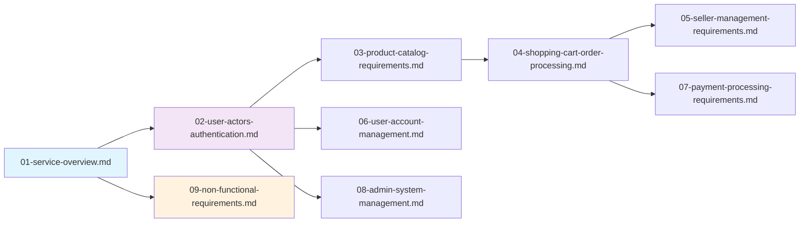

# Shopping Mall E-commerce Platform Documentation

## Documentation Overview

This documentation set provides comprehensive specifications for building a complete e-commerce shopping mall platform. The documentation follows a structured waterfall approach, starting with business requirements and progressing through detailed technical specifications.

### Documentation Philosophy
- **Business-First Approach**: All documentation begins with business requirements before technical implementation
- **Complete Coverage**: Each document addresses a specific domain with comprehensive detail
- **Implementation-Ready**: Backend developers can start coding immediately after reading
- **Single Source of Truth**: All requirements are documented once, completely

## Document List with Descriptions

### [Service Overview Document](./01-service-overview.md)
Defines the business vision, market positioning, and strategic goals for the e-commerce platform. This document establishes the "why" behind the platform and provides the business context for all technical decisions.

### [User Actors and Authentication Requirements](./02-user-actors-authentication.md)
Specifies all user types (customer, seller, admin) with detailed authentication flows, permission matrices, and security requirements. This document defines the foundation of user access control.

### [Product Catalog Requirements](./03-product-catalog-requirements.md)
Details the product management system including categorization, attributes, search functionality, and inventory tracking. This is the core of the e-commerce product experience.

### [Shopping Cart and Order Processing](./04-shopping-cart-order-processing.md)
Defines the complete shopping experience from cart management through checkout, payment processing, and order fulfillment workflows.

### [Seller Management Requirements](./05-seller-management-requirements.md)
Specifies seller-specific functionality including product listing management, inventory control, order fulfillment, and sales analytics.

### [User Account Management](./06-user-account-management.md)
Details user registration, profile management, order history, wishlist functionality, and personal data management features.

### [Payment Processing Requirements](./07-payment-processing-requirements.md)
Defines payment gateway integration, transaction security, refund processing, and financial reporting requirements.

### [Admin System Management](./08-admin-system-management.md)
Specifies administrative functions for user management, product catalog administration, order oversight, and system configuration.

### [Non-Functional Requirements](./09-non-functional-requirements.md)
Details performance standards, scalability requirements, security measures, availability guarantees, and data management policies.

## Navigation Guide

### Recommended Reading Order

For **Business Stakeholders**:
1. Start with [Service Overview Document](./01-service-overview.md) for business context
2. Review [User Actors and Authentication Requirements](./02-user-actors-authentication.md) for user model understanding
3. Reference specific functional documents as needed

For **Development Teams**:
1. Begin with [Service Overview Document](./01-service-overview.md) for project context
2. Study [User Actors and Authentication Requirements](./02-user-actors-authentication.md) for security foundation
3. Proceed through functional documents in logical order:
   - [Product Catalog Requirements](./03-product-catalog-requirements.md)
   - [Shopping Cart and Order Processing](./04-shopping-cart-order-processing.md)
   - [Seller Management Requirements](./05-seller-management-requirements.md)
   - [User Account Management](./06-user-account-management.md)
   - [Payment Processing Requirements](./07-payment-processing-requirements.md)
   - [Admin System Management](./08-admin-system-management.md)
4. Conclude with [Non-Functional Requirements](./09-non-functional-requirements.md) for quality standards

### Document Relationships

### Cross-Referencing Guidelines

When working with specific functional areas:
- **Product Management**: Always reference [Product Catalog Requirements](./03-product-catalog-requirements.md) for product-related specifications
- **User Authentication**: Consult [User Actors and Authentication Requirements](./02-user-actors-authentication.md) for all security and permission questions
- **Order Processing**: Use [Shopping Cart and Order Processing](./04-shopping-cart-order-processing.md) for checkout and fulfillment workflows
- **Payment Integration**: Refer to [Payment Processing Requirements](./07-payment-processing-requirements.md) for financial transaction specifications

## Document Maintenance

### Version Control
- All documents are maintained in a single repository
- Document updates follow a change management process
- Version history is tracked for audit purposes

### Contribution Guidelines
- New requirements are documented in the appropriate existing document
- Major feature additions may require new document creation
- All documentation follows the established structure and formatting standards

### Quality Assurance
- Each document undergoes peer review before finalization
- Technical accuracy is validated by subject matter experts
- Business requirements are confirmed by product stakeholders

## Getting Started

For new team members or stakeholders:
1. Read this table of contents to understand the documentation structure
2. Follow the recommended reading order based on your role
3. Use the cross-referencing guidelines to navigate between related documents
4. Contact the documentation maintainer for clarification or updates

## Support and Feedback

For questions about documentation structure or content:
- Review the specific document first for detailed explanations
- Check document relationships for related information
- Contact the project documentation lead for clarification
- Submit documentation improvement requests through the established process

> *Developer Note: This document defines **business requirements only**. All technical implementations (architecture, APIs, database design, etc.) are at the discretion of the development team.*