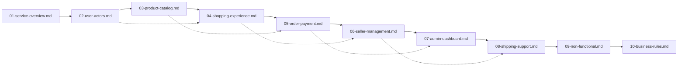
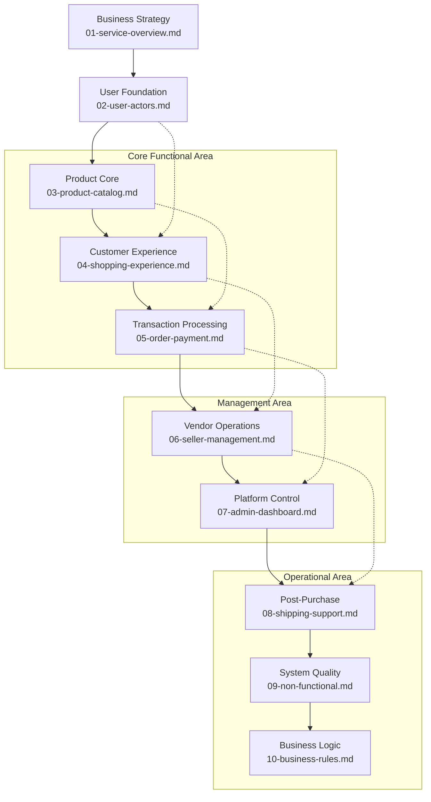

# E-commerce Shopping Mall Platform - Complete Requirements Specification

## Documentation Overview

This documentation provides a comprehensive requirements specification for building a complete e-commerce shopping mall platform. The specification is organized into 10 distinct documents that collectively define all business requirements, user workflows, and system functionality needed to develop a production-ready shopping platform.

### Target Audience
- **Business Stakeholders**: Understand platform capabilities and business value
- **Development Team**: Detailed implementation requirements and specifications
- **Project Managers**: Comprehensive project scope and feature definitions
- **Quality Assurance**: Requirements for testing and validation

### Document Organization Principles
The documentation follows a logical waterfall development approach, starting with high-level business strategy and progressing through detailed functional specifications. Each document builds upon the previous ones, ensuring complete coverage of all platform requirements.

## Project Introduction

### Shopping Mall Platform Vision
The shopping-mall platform aims to create a comprehensive e-commerce solution that enables seamless online shopping experiences for customers while providing robust management tools for sellers and administrators. The platform will support multi-vendor marketplace operations with sophisticated product management, order processing, and customer engagement features.

### Key Business Objectives
- Establish a scalable e-commerce marketplace supporting multiple sellers
- Provide exceptional customer shopping experiences with advanced product discovery
- Enable sellers to efficiently manage their product catalogs and fulfill orders
- Ensure secure payment processing and reliable order fulfillment
- Deliver comprehensive administrative oversight and platform analytics

### Platform Architecture Overview
The platform follows a three-tier architecture with clear separation between customer-facing shopping interfaces, seller management tools, and administrative controls. The system supports multiple user roles with distinct permission levels and functional capabilities.

## Document Structure

### Complete Document Listing

**Core Business Documentation**
1. **[Service Overview Document](./01-service-overview.md)** - Business model, market strategy, and revenue planning
2. **[User Actors and Authentication](./02-user-actors.md)** - Complete user role definitions and security requirements

**Functional Specification Documents**
3. **[Product Catalog Management](./03-product-catalog.md)** - Product organization, variants, and inventory systems
4. **[Shopping Experience Design](./04-shopping-experience.md)** - Customer browsing, cart management, and reviews
5. **[Order and Payment Processing](./05-order-payment.md)** - Complete order lifecycle and payment integration
6. **[Seller Management System](./06-seller-management.md)** - Seller account administration and product management
7. **[Admin Dashboard Functions](./07-admin-dashboard.md)** - Platform-wide administration and analytics
8. **[Shipping and Customer Support](./08-shipping-support.md)** - Order fulfillment and post-purchase support

**Technical and Operational Documents**
9. **[Non-Functional Requirements](./09-non-functional.md)** - Performance, security, and scalability specifications
10. **[Business Rules and Validation](./10-business-rules.md)** - System logic, validation rules, and error handling

### Document Relationships and Dependencies

### Development Sequence
The documents are organized in the recommended development sequence, starting with business foundations and progressing through user authentication, core functionality, and operational requirements. Teams should follow this sequence when planning implementation phases.

## How to Use This Documentation

### Recommended Reading Order by Role

**For Business Stakeholders:**
1. Start with [Service Overview](./01-service-overview.md)
2. Review [Shopping Experience Design](./04-shopping-experience.md)
3. Understand [Seller Management System](./06-seller-management.md)

**For Development Team Leads:**
1. Begin with [User Actors and Authentication](./02-user-actors.md)
2. Study [Product Catalog Management](./03-product-catalog.md)
3. Review [Order and Payment Processing](./05-order-payment.md)
4. Understand [Non-Functional Requirements](./09-non-functional.md)

**For Frontend Developers:**
1. Focus on [Shopping Experience Design](./04-shopping-experience.md)
2. Reference [Product Catalog Management](./03-product-catalog.md)
3. Understand [User Actors and Authentication](./02-user-actors.md)

**For Backend Developers:**
1. Start with [User Actors and Authentication](./02-user-actors.md)
2. Study [Order and Payment Processing](./05-order-payment.md)
3. Review [Business Rules and Validation](./10-business-rules.md)
4. Understand [Non-Functional Requirements](./09-non-functional.md)

**For QA/Testing Team:**
1. Begin with [Business Rules and Validation](./10-business-rules.md)
2. Study all functional specifications (Documents 03-08)
3. Reference [Non-Functional Requirements](./09-non-functional.md)

### Document Navigation Guidelines
- Use the table of contents in each document for quick topic access
- Follow cross-references between documents for related information
- Pay attention to EARS-formatted requirements for clear implementation guidance
- Review Mermaid diagrams for visual understanding of complex workflows

### Cross-Referencing Best Practices
When implementing features that span multiple documents, ensure you:
- Check related document sections for comprehensive requirements
- Follow the dependency chain to understand prerequisite functionality
- Use the document relationship diagram to identify interconnected features

## Document Relationships

### Visual Document Map
The following diagram illustrates how documents relate to each other and the recommended reading sequence:

### Development Sequence Guidance
For optimal development planning, follow this sequence:

**Phase 1: Foundation (Documents 01-02)**
- Establish business context and user authentication systems

**Phase 2: Core Commerce (Documents 03-05)**
- Implement product catalog, shopping experience, and payment processing

**Phase 3: Management Systems (Documents 06-07)**
- Build seller and administrative management interfaces

**Phase 4: Operational Excellence (Documents 08-10)**
- Implement shipping, support, and system quality features

### Reference Lookup Workflow
When needing specific information:
1. **For business context**: Start with Document 01
2. **For user functionality**: Reference Documents 02, 04, 05
3. **For product management**: Use Documents 03, 06
4. **For administrative functions**: Consult Documents 06, 07
5. **For technical specifications**: Review Documents 09, 10
6. **For complete workflow**: Follow the document sequence

## Comprehensive Document Specifications

### Document 01: Service Overview
**Purpose**: Define business foundation and strategic vision
**Key Content**: Business model, market opportunity, competitive landscape, revenue strategy
**Critical Requirements**: Business justification, revenue model definition, competitive differentiation

### Document 02: User Actors and Authentication
**Purpose**: Define user roles and security framework
**Key Content**: Customer, seller, admin actor definitions, authentication flows, permission matrices
**Critical Requirements**: Complete authentication specifications, JWT token structure, session management

### Document 03: Product Catalog Management
**Purpose**: Define product organization and variant management
**Key Content**: Category hierarchy, SKU management, inventory tracking, search functionality
**Critical Requirements**: Product variant specifications, inventory accuracy, search performance

### Document 04: Shopping Experience Design
**Purpose**: Define customer shopping journey
**Key Content**: Product browsing, cart management, wishlists, reviews and ratings
**Critical Requirements**: Seamless shopping flow, cart persistence, review system integrity

### Document 05: Order and Payment Processing
**Purpose**: Define transaction processing lifecycle
**Key Content**: Order placement, payment methods, address management, order tracking
**Critical Requirements**: Payment security, order status tracking, financial transaction integrity

### Document 06: Seller Management System
**Purpose**: Define seller account administration
**Key Content**: Seller registration, product management, order fulfillment, sales analytics
**Critical Requirements**: Seller verification process, inventory management, performance monitoring

### Document 07: Admin Dashboard Functions
**Purpose**: Define platform administration capabilities
**Key Content**: User management, order administration, platform analytics, system configuration
**Critical Requirements**: Administrative oversight, platform monitoring, configuration management

### Document 08: Shipping and Customer Support
**Purpose**: Define post-purchase customer experience
**Key Content**: Shipping management, order tracking, cancellation processes, support workflows
**Critical Requirements**: Real-time tracking, support response times, return management

### Document 09: Non-Functional Requirements
**Purpose**: Define system quality attributes
**Key Content**: Performance specifications, security requirements, scalability considerations
**Critical Requirements**: System performance targets, security compliance, scalability architecture

### Document 10: Business Rules and Validation
**Purpose**: Define operational logic and validation rules
**Key Content**: Business rule definitions, validation requirements, error handling scenarios
**Critical Requirements**: Data integrity rules, error handling procedures, notification systems

## Implementation Guidelines

### Development Priority Framework
When implementing the platform, prioritize features based on:
1. **Core Commerce Foundation**: User authentication, product catalog, shopping cart
2. **Transaction Processing**: Order management, payment integration, shipping calculation
3. **Seller Management**: Seller onboarding, product management, order fulfillment
4. **Administrative Controls**: Platform monitoring, user management, analytics
5. **Enhanced Features**: Advanced search, recommendations, mobile optimization

### Quality Assurance Framework
Ensure all implementations meet the following quality standards:
- **Functional Completeness**: All specified features implemented according to requirements
- **Performance Standards**: Meet or exceed performance targets defined in non-functional requirements
- **Security Compliance**: Adhere to security specifications and data protection requirements
- **User Experience**: Provide intuitive interfaces and seamless user journeys
- **Scalability**: Design for future growth and increased transaction volumes

### Testing Strategy
Implement comprehensive testing covering:
- **Unit Testing**: Individual component functionality
- **Integration Testing**: Cross-component interactions and data flow
- **System Testing**: End-to-end business processes
- **Performance Testing**: Load handling and response time validation
- **Security Testing**: Vulnerability assessment and penetration testing
- **User Acceptance Testing**: Business stakeholder validation of functionality

## Maintenance and Evolution

### Documentation Updates
WHEN platform features are added or modified, THE documentation SHALL be updated to reflect changes.
WHERE requirements change, THE affected documents SHALL be revised and version-controlled.

### Version Control Strategy
THE documentation SHALL maintain version history with:
- Clear version numbering (e.g., v1.0, v1.1, v2.0)
- Change logs documenting modifications
- Backward compatibility considerations
- Deprecation notices for removed features

### Continuous Improvement
THE requirements specification SHALL evolve based on:
- User feedback and feature requests
- Market changes and competitive analysis
- Technology advancements and platform capabilities
- Regulatory requirements and compliance updates

This table of contents serves as your comprehensive roadmap through the complete requirements specification. Each document contains detailed, implementation-ready requirements that collectively define the complete shopping mall platform.

> *Developer Note: This document defines **business requirements only**. All technical implementations (architecture, APIs, database design, etc.) are at the discretion of the development team.*