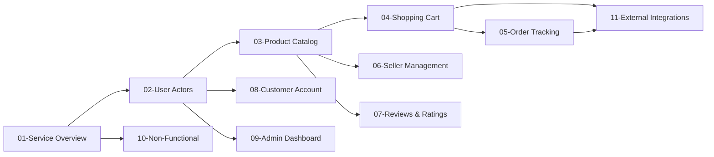

# E-commerce Shopping Mall Platform - Documentation Table of Contents

## Project Overview

This documentation suite provides comprehensive requirements and specifications for building a complete e-commerce shopping mall platform. The platform enables businesses to sell products online while providing customers with a seamless shopping experience including product discovery, purchasing, and order tracking.

## Document Structure

The project documentation is organized into 12 comprehensive documents that cover all aspects of the e-commerce platform:

### Core Documentation

1. **[Service Overview](./01-service-overview.md)** - Business vision, market positioning, and strategic goals
2. **[User Actors & Authentication](./02-user-actors-authentication.md)** - User roles, authentication flows, and permission hierarchies
3. **[Product Catalog Requirements](./03-product-catalog-requirements.md)** - Product organization, variants, inventory management
4. **[Shopping Cart & Order Flow](./04-shopping-cart-order-flow.md)** - Cart management, order placement, payment processing
5. **[Order Tracking & Shipping](./05-order-tracking-shipping.md)** - Order status, shipping integration, customer notifications

### Specialized Documentation

6. **[Seller Management](./06-seller-management.md)** - Seller account setup, product management, order fulfillment
7. **[Reviews & Ratings](./07-reviews-ratings.md)** - Customer feedback system, content moderation, review analytics
8. **[Customer Account Management](./08-customer-account-management.md)** - Profile management, address book, order history
9. **[Admin Dashboard](./09-admin-dashboard.md)** - Platform administration, user management, analytics

### Technical & Integration Documentation

10. **[Non-Functional Requirements](./10-non-functional-requirements.md)** - Performance, scalability, security, compliance
11. **[External Integrations](./11-external-integrations.md)** - Payment gateways, shipping carriers, third-party APIs

## Navigation Guide

### For Business Stakeholders
Start with these documents to understand the business context:
- **[Service Overview](./01-service-overview.md)** - Business model and revenue strategy
- **[Non-Functional Requirements](./10-non-functional-requirements.md)** - Performance and scalability targets

### For Development Teams
Follow this recommended reading order for implementation:
1. **[User Actors & Authentication](./02-user-actors-authentication.md)** - Foundation for user management
2. **[Product Catalog Requirements](./03-product-catalog-requirements.md)** - Core data structures
3. **[Shopping Cart & Order Flow](./04-shopping-cart-order-flow.md)** - Main business workflows
4. **[External Integrations](./11-external-integrations.md)** - Third-party service connections

### For Technical Architects
Focus on these key documents:
- **[Non-Functional Requirements](./10-non-functional-requirements.md)** - System architecture constraints
- **[External Integrations](./11-external-integrations.md)** - API design and integration patterns
- **[Admin Dashboard](./09-admin-dashboard.md)** - Platform management capabilities

## Document Relationships

### Core Dependencies

### Functional Groupings

**Customer-Facing Features:**
- Product discovery and purchasing (Documents 03, 04, 05)
- Account management and reviews (Documents 08, 07)

**Seller Management Features:**
- Product catalog and inventory (Document 06)
- Order fulfillment and analytics (Documents 06, 05)

**Platform Administration:**
- System management and monitoring (Document 09)
- User and content administration (Document 09)

**Technical Infrastructure:**
- Performance and security (Document 10)
- External service integration (Document 11)

## How to Use This Documentation

### Reading Strategies

**Sequential Approach:** Read documents in numerical order (01-11) for comprehensive understanding

**Role-Based Approach:** Focus on documents relevant to your specific responsibilities

**Problem-Solving Approach:** Use the table of contents to locate specific functionality

### Document Characteristics

Each document includes:
- Clear business requirements in natural language
- Specific functional specifications
- User scenarios and workflows
- Technical constraints and considerations
- Relationship references to other documents

### Update and Maintenance

This table of contents will be updated as new documents are added or existing documents are modified. Always refer to this document for the most current documentation structure.

## Document Quick Reference

| Document | Primary Focus | Key Audience | Related Documents |
|----------|---------------|--------------|-------------------|
| [01-Service Overview](./01-service-overview.md) | Business strategy | Stakeholders | [10-Non-Functional](./10-non-functional-requirements.md) |
| [02-User Actors](./02-user-actors-authentication.md) | Authentication | Developers | [08-Customer Account](./08-customer-account-management.md), [09-Admin Dashboard](./09-admin-dashboard.md) |
| [03-Product Catalog](./03-product-catalog-requirements.md) | Product management | Product Team | [04-Shopping Cart](./04-shopping-cart-order-flow.md), [06-Seller Management](./06-seller-management.md) |
| [04-Shopping Cart](./04-shopping-cart-order-flow.md) | Order processing | Developers | [05-Order Tracking](./05-order-tracking-shipping.md), [11-External Integrations](./11-external-integrations.md) |
| [05-Order Tracking](./05-order-tracking-shipping.md) | Shipping & delivery | Operations | [04-Shopping Cart](./04-shopping-cart-order-flow.md), [11-External Integrations](./11-external-integrations.md) |
| [06-Seller Management](./06-seller-management.md) | Seller operations | Sellers | [03-Product Catalog](./03-product-catalog-requirements.md), [05-Order Tracking](./05-order-tracking-shipping.md) |
| [07-Reviews & Ratings](./07-reviews-ratings.md) | Customer feedback | Marketing | [03-Product Catalog](./03-product-catalog-requirements.md) |
| [08-Customer Account](./08-customer-account-management.md) | User profiles | Customers | [02-User Actors](./02-user-actors-authentication.md) |
| [09-Admin Dashboard](./09-admin-dashboard.md) | Platform admin | Administrators | [02-User Actors](./02-user-actors-authentication.md), [06-Seller Management](./06-seller-management.md) |
| [10-Non-Functional](./10-non-functional-requirements.md) | System quality | Architects | [01-Service Overview](./01-service-overview.md) |
| [11-External Integrations](./11-external-integrations.md) | Third-party APIs | Developers | [04-Shopping Cart](./04-shopping-cart-order-flow.md), [05-Order Tracking](./05-order-tracking-shipping.md) |

> *Developer Note: This document defines **business requirements only**. All technical implementations (architecture, APIs, database design, etc.) are at the discretion of the development team.*