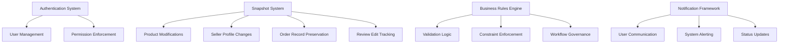

# E-Commerce Shopping Mall Platform - Complete Documentation Suite

## Table of Contents

### [Service Overview](./01-service-overview.md)
- **Executive Summary**: Business model, vision, and platform positioning
- **Business Model**: Revenue strategy, growth plan, and monetization timeline
- **Target Market**: Customer segments, seller profiles, administrator roles
- **Competitive Advantage**: Unique selling propositions and differentiation factors
- **Success Metrics**: KPIs, performance indicators, and business objectives
- **Implementation Strategy**: Phased development approach and risk mitigation

### [User Actors and Authentication](./02-user-actors-authentication.md)
- **Authentication System**: Registration, login, and session management
- **Customer Accounts**: Profile management, account deletion policies, permission matrix
- **Seller Accounts**: Registration approval workflow, shop profile management, constraints
- **Administrator System**: Hierarchy structure, promotion process, oversight capabilities
- **Security Requirements**: Data protection, access control, and audit trails
- **Token Management**: JWT implementation, session handling, and security protocols

### [Customer Journey Documentation](./03-customer-journey.md)
- **Registration and Auth**: Mandatory registration flow, password management, account deletion
- **Profile Management**: Display name, phone number, and shipping address management
- **Product Discovery**: Category browsing, search functionality, product detail views
- **Shopping Experience**: Cart management, wishlist system, variant selection
- **Checkout Process**: Address selection, payment processing, order creation
- **Order Management**: Status tracking, delivery confirmation, cancellation workflows
- **Post-Purchase**: Review system, refund requests, customer support integration

### [Seller Management System](./04-seller-management.md)
- **Registration Process**: Account creation, approval workflow, status management
- **Shop Profile**: Profile setup, editing capabilities, snapshot preservation
- **Product Management**: Creation constraints, editing workflows, deletion policies
- **Variant System**: SKU management, option combinations, pricing overrides
- **Inventory Control**: Stock tracking, adjustment history, availability management
- **Order Fulfillment**: Shipment creation, tracking integration, multi-item handling
- **Customer Service**: Cancellation requests, refund processing, dispute resolution
- **Analytics Dashboard**: Performance metrics, sales trends, business intelligence

### [Product Catalog System](./05-product-catalog.md)
- **Category Hierarchy**: Parent-subcategory structure, administration controls
- **Product Creation**: Required fields, ownership rules, status management
- **Variant System**: SKU requirements, option combinations, pricing flexibility
- **Image Management**: Upload capabilities, display optimization, snapshot inclusion
- **Inventory System**: Stock tracking, history records, availability status
- **Search Functionality**: Name matching, filtering options, sorting preferences
- **Display Requirements**: Listing pages, detail views, responsive design
- **Wishlist Integration**: Personal collections, automatic cleanup, cart conversion

### [Snapshot System Documentation](./06-snapshot-system.md)
- **Snapshot Principle**: Data integrity philosophy and modification tracking
- **Trigger Mechanism**: Modification events that create snapshots automatically
- **Snapshot Structure**: Complete data preservation format and content specification
- **Product Snapshots**: Complete product state including variants and images
- **Seller Profile Snapshots**: Shop information preservation across edits
- **Order Item Snapshots**: Purchase-time product and seller information freezing
- **Dispute Resolution**: Historical data access for conflict resolution
- **Immutable Records**: Data preservation policies and modification prevention

### [Order Management System](./07-order-management.md)
- **Order Creation Process**: Payment validation, inventory deduction, snapshot creation
- **Order Structure**: Multi-seller order handling, individual item status tracking
- **Payment Integration**: External gateway coordination, success/failure handling
- **Status Lifecycle**: Item-level status progression, overall order status derivation
- **Order History**: Customer view access, detailed order information display
- **Partial Order Management**: Mixed status handling, individual item processing
- **Order Preservation**: Data retention policies, account deletion impact mitigation

### [Shipping and Tracking System](./08-shipping-tracking.md)
- **Shipment Concept**: Package grouping logic, seller-based separation requirements
- **Shipping Process**: Seller interface, tracking information entry, status updates
- **Tracking Integration**: Carrier API connections, real-time status synchronization
- **Delivery Confirmation**: Customer confirmation mechanisms, automatic completion rules
- **Multi-Seller Coordination**: Independent fulfillment, unified customer tracking view
- **Automatic Delivery**: Time-based status progression, customer notification system

### [Cancellation and Refund System](./09-cancellation-refund.md)
- **Cancellation Requests**: Eligibility criteria, reason requirements, seller response workflow
- **Refund Processing**: Delivery confirmation requirements, time constraints, approval process
- **Approval Workflow**: Seller review interface, snapshot creation, decision tracking
- **Stock Restoration**: Automatic inventory adjustment, cancellation-triggered restocking
- **Partial Order Management**: Individual item processing, remaining order continuation
- **Time Constraints**: Eligibility windows, expiration rules, extension considerations

### [Review and Rating System](./10-review-rating.md)
- **Review Eligibility**: Purchase verification, delivery confirmation, timing constraints
- **Rating System**: 1-5 star scale, calculation methodology, average computation
- **Review Content**: Optional text content, formatting guidelines, moderation requirements
- **Edit and Delete**: Customer modification rights, snapshot preservation, content updates
- **Average Calculations**: Weighted scoring, recency considerations, statistical accuracy
- **Review Display**: Sorting preferences, pagination implementation, visibility controls

### [Seller Dashboard Documentation](./11-seller-dashboard.md)
- **Dashboard Overview**: Key metrics display, business intelligence summary
- **Order Management**: Status filtering, bulk operations, customer communication integration
- **Inventory Analytics**: Stock level monitoring, sales velocity, restock recommendations
- **Cancellation Queue**: Pending requests, response time tracking, resolution metrics
- **Refund Request Management**: Approval workflow, financial impact analysis, customer satisfaction tracking
- **Performance Metrics**: Sales performance, customer feedback, platform compliance scoring

### [Administrator System](./12-administrator-system.md)
- **Administrator Hierarchy**: Regular vs super administrator distinctions, privilege escalation
- **User Management**: Customer oversight, seller monitoring, ban/unban capabilities
- **Seller Management**: Approval process, suspension authority, performance monitoring
- **Category Management**: Hierarchy maintenance, description updates, deletion constraints
- **Product Oversight**: Policy enforcement, violation handling, snapshot access
- **Order Intervention**: Force cancellation authority, refund processing, dispute resolution

### [Security and Compliance](./13-security-compliance.md)
- **Data Security**: Encryption standards, access controls, vulnerability management
- **Payment Security**: PCI compliance, tokenization implementation, fraud detection
- **Privacy Protection**: GDPR compliance, data minimization, user consent management
- **Legal Compliance**: Regulatory requirements, retention policies, audit trail management
- **Security Best Practices**: Industry standards, continuous monitoring, incident response

### [Integration Requirements](./14-integration-requirements.md)
- **Payment Gateway**: Multiple provider support, failover mechanisms, reconciliation processes
- **Email Service**: Transaction notifications, marketing communications, system alerts
- **Analytics Integration**: Performance tracking, user behavior analysis, business intelligence
- **Shipping Carrier APIs**: Real-time rate calculation, tracking synchronization, label generation
- **Future Integration**: API extensibility, third-party service compatibility, scalability planning

### [Performance and Scalability](./15-performance-scalability.md)
- **Performance Targets**: Response time benchmarks, throughput requirements, availability goals
- **Scalability Architecture**: Horizontal scaling design, database partitioning, cache strategies
- **Load Handling**: Peak traffic management, resource allocation, performance optimization
- **Database Performance**: Query optimization, indexing strategy, connection pooling
- **Caching Implementation**: Multi-layer caching, invalidation policies, performance monitoring

### [Error Handling System](./16-error-handling.md)
- **Payment Errors**: Gateway failures, transaction declines, retry mechanisms
- **Authentication Failures**: Invalid credentials, session expiration, security lockouts
- **Inventory Issues**: Stock discrepancies, overselling prevention, reconciliation processes
- **Order Processing Errors**: Data validation failures, system outages, recovery procedures
- **System Maintenance**: Planned downtime communication, upgrade procedures, backup strategies
- **User-Friendly Messaging**: Clear error descriptions, resolution guidance, support contact information

### [Business Rules Documentation](./17-business-rules.md)
- **Registration Rules**: Email validation, password requirements, account verification
- **Product Validation**: Name uniqueness, description standards, category assignment
- **Order Constraints**: Inventory availability, payment verification, shipping feasibility
- **Inventory Rules**: Stock tracking, adjustment authorization, availability calculations
- **Seller Restrictions**: Product limits, performance requirements, compliance obligations
- **Administrative Policies**: Enforcement procedures, escalation paths, appeal processes

### [Data Preservation Policies](./18-data-preservation.md)
- **Account Deletion**: Information retention requirements, legal compliance timelines
- **Order Preservation**: Transaction record keeping, tax compliance, customer service needs
- **Review Retention**: Content persistence, anonymization standards, statistical integrity
- **Snapshot Archiving**: Storage requirements, access controls, retrieval performance
- **Legal Requirements**: Regulatory mandates, discovery obligations, compliance auditing
- **Storage Management**: Cost optimization, performance balancing, disaster recovery

### [Notification System](./19-notification-system.md)
- **Email Notifications**: Order confirmations, shipping updates, account activities
- **In-App Messages**: Real-time alerts, system notifications, promotional content
- **Order Updates**: Status changes, delivery estimates, completion confirmations
- **Approval Notifications**: Seller approvals, administrator requests, status changes
- **System Alerts**: Performance issues, security events, maintenance schedules
- **User Preferences**: Customization options, frequency controls, channel selection

### [Implementation Roadmap](./20-implementation-roadmap.md)
- **Phase 1: Core Platform**: Authentication, basic catalog, simple ordering
- **Phase 2: Seller Features**: Advanced management, analytics, fulfillment tools
- **Phase 3: Advanced Capabilities**: Snapshot system, integration ecosystem, optimization
- **Phase 4: Scaling and Enhancement**: Performance tuning, feature expansion, market adaptation
- **Timeline Overview**: Milestone planning, dependency mapping, release scheduling
- **Success Criteria**: Feature completion metrics, performance benchmarks, user adoption goals

## Document Relationships and Dependencies

### Core Foundation Documents
- **Service Overview** → Establishes business context and strategic direction
- **User Actors and Authentication** → Defines all participant roles and access controls
- **Business Rules** → Contains fundamental operational constraints and validation logic

### Customer Experience Workflow
- **Customer Journey** → Builds upon authentication to define purchasing lifecycle
- **Product Catalog** → Provides product discovery and selection mechanisms
- **Order Management** → Completes transaction processing and post-purchase activities

### Seller Operational Chain
- **Seller Management** → Foundation for seller onboarding and shop operations
- **Product Catalog** → Seller-facing product management and inventory control
- **Shipping and Tracking** → Extends seller capabilities to order fulfillment
- **Seller Dashboard** → Provides business intelligence and performance monitoring

### Administrative Control Framework
- **Administrator System** → Centralized platform management and oversight
- **Security and Compliance** → Cross-cutting security and regulatory requirements
- **Data Preservation** → Governs all data management and retention policies

### Technical Implementation Stack
- **Integration Requirements** → External service connections and API specifications
- **Performance and Scalability** → System architecture and optimization guidelines
- **Error Handling** → Resilience and fault tolerance implementation strategies

## Platform Architecture Integration

### Cross-Cutting Concerns

### Data Flow Relationships
- Customer registrations flow through authentication to profile management
- Product creations traverse category assignment to variant management
- Order processing connects payment integration with inventory updates
- Review submissions link purchase verification with rating calculations
- Cancellation requests bridge customer service with inventory restoration

## Usage Guidelines for Development Team

### Recommended Reading Sequence
1. **Start with Business Context**: Service Overview → Understand platform vision and objectives
2. **Study User Framework**: User Actors → Comprehend role-based permissions and interactions
3. **Master Core Rules**: Business Rules → Internalize validation constraints and operational logic
4. **Follow Customer Journey**: Product Discovery → Checkout → Order Management → Complete purchasing flow
5. **Implement Seller Operations**: Registration → Product Management → Order Fulfillment → Analytics
6. **Integrate Administrative Controls**: Oversight → Security → Compliance → Complete platform management

### Cross-Reference Implementation Strategy
- Reference dependency chains for logical implementation ordering
- Use table of contents navigation for feature-specific requirements
- Follow data flow relationships for integration point identification
- Maintain consistency with snapshot system requirements across all modules

### Technical Implementation Priorities
1. **Authentication Foundation**: User management system with role-based permissions
2. **Product Catalog Core**: Category structure, product creation, variant management
3. **Order Processing Engine**: Cart management, payment integration, order creation
4. **Seller Management System**: Approval workflow, shop profiles, inventory controls
5. **Snapshot Implementation**: Data preservation across all modification events
6. **Administrative Interface**: Platform oversight, user management, content moderation

### Quality Assurance Checklist
- [ ] All EARS format requirements converted to specific, measurable statements
- [ ] Mermaid diagram syntax validated with proper quoting and formatting
- [ ] Minimum length requirements met for comprehensive documentation
- [ ] All internal cross-references verified and functional
- [ ] Business context clearly established for each functional area
- [ ] Implementation-ready specificity achieved throughout documentation

## Documentation Maintenance and Evolution

### Version Control Strategy
- Document versioning aligned with platform release cycles
- Change tracking for requirements modifications and additions
- Backward compatibility considerations for existing implementations

### Update Procedures
- Regular review cycles for accuracy and completeness
- Integration of user feedback and developer experience
- Alignment with platform feature enhancements and expansions

### Contribution Guidelines
- Standardized documentation format and structure
- Clear review and approval processes for changes
- Consistent terminology and definition usage across all documents

> *Developer Note: This documentation suite defines **business requirements only**. All technical architecture decisions, API designs, database implementations, and deployment strategies are at the discretion of the engineering team based on these business specifications.*