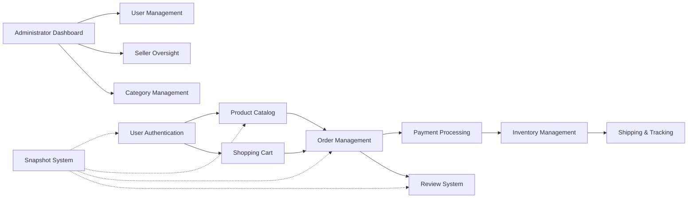
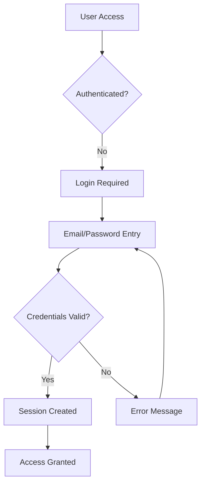
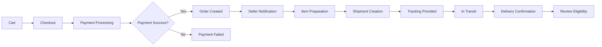

# E-Commerce Shopping Mall Platform - Service Overview

## Executive Summary

The E-Commerce Shopping Mall Platform is a comprehensive online marketplace designed to facilitate secure transactions between sellers and customers while maintaining complete data integrity through a robust snapshot system. This platform addresses the growing need for trustworthy e-commerce solutions that preserve transaction history while protecting user privacy.

### Core Value Proposition
The platform provides a secure, transparent marketplace where:
- **Customers** can shop with confidence knowing their purchase history is preserved
- **Sellers** can manage their business with comprehensive inventory and order tracking
- **Administrators** can maintain platform integrity through detailed oversight capabilities
- **All parties** benefit from immutable transaction records for dispute resolution

### Platform Vision
To create the most reliable e-commerce platform where every transaction is permanently documented, providing unprecedented transparency and trust for all participants.

## Business Model

### Revenue Strategy
The platform will generate revenue through:
- **Transaction Fees**: Percentage-based commission on completed sales
- **Seller Subscription Tiers**: Premium features for advanced sellers
- **Featured Listings**: Promoted product placement for sellers
- **Future Expansion**: Payment processing fees, premium analytics

### Monetization Timeline
- **Phase 1 (Launch)**: Focus on transaction volume with minimal fees to attract sellers
- **Phase 2 (Growth)**: Introduce subscription tiers as seller base expands
- **Phase 3 (Maturity)**: Implement advanced monetization features

### Growth Plan
- **User Acquisition**: Targeted marketing to both sellers and customers
- **Seller Onboarding**: Streamlined approval process with seller support
- **Customer Acquisition**: SEO optimization and referral programs
- **Retention Strategy**: Loyalty programs and seller performance incentives

### Success Metrics
- **Monthly Active Users (MAU)**: Target 10,000+ within first year
- **Gross Merchandise Volume (GMV)**: Target $1M+ in first year
- **Seller Retention Rate**: Maintain 80%+ seller retention
- **Customer Satisfaction**: Achieve 4.5+ average rating
- **Transaction Completion Rate**: Maintain 95%+ successful transactions

## Target Market

### Primary User Segments

#### Customers
- **Demographics**: Age 18-65, tech-savvy online shoppers
- **Needs**: Secure shopping, reliable sellers, purchase history preservation
- **Pain Points**: Lack of transaction transparency, lost purchase records

#### Sellers
- **Profile**: Small to medium businesses, individual entrepreneurs
- **Needs**: Easy product management, reliable payment processing, customer reach
- **Pain Points**: Complex platforms, high fees, limited oversight capabilities

#### Administrators
- **Role**: Platform governance, dispute resolution, user management
- **Needs**: Comprehensive oversight tools, data integrity assurance

### Market Opportunity
- **E-commerce Growth**: Global e-commerce market projected to reach $6.3 trillion by 2024
- **Trust Gap**: Increasing demand for transparent transaction platforms
- **SME Opportunity**: Small businesses seeking accessible online marketplaces

## Competitive Advantage

### Unique Selling Propositions

#### 1. Comprehensive Snapshot System
- **Data Integrity**: Every modification creates immutable records
- **Dispute Resolution**: Complete transaction history for all parties
- **Legal Compliance**: Meets regulatory requirements for transaction records

#### 2. Multi-Seller Order Management
- **Seamless Experience**: Customers can purchase from multiple sellers in one transaction
- **Independent Fulfillment**: Sellers manage their own shipments independently
- **Unified Tracking**: Customers track all shipments in one interface

#### 3. Advanced Seller Tools
- **Inventory Management**: Real-time stock tracking with historical records
- **Order Analytics**: Comprehensive sales and performance metrics
- **Flexible Product Variants**: Sophisticated SKU management system

#### 4. Customer-Centric Features
- **Wishlist Integration**: Save products for future purchase
- **Review System**: Authentic customer feedback with purchase verification
- **Order History**: Complete purchase records even after account deletion

### Differentiation Factors

| Feature | Traditional Platforms | Our Platform |
|---------|---------------------|--------------|
| Data Preservation | Limited retention | Complete snapshot system |
| Multi-Seller Orders | Separate transactions | Unified checkout |
| Seller Approval | Manual process | Streamlined with oversight |
| Dispute Resolution | Limited evidence | Full transaction snapshots |

## Platform Architecture Overview

### Core Components

### Key Relationships
- **User Management**: Foundation for all platform interactions
- **Product Catalog**: Central repository for seller offerings
- **Order Processing**: Core transaction engine connecting customers and sellers
- **Snapshot System**: Cross-cutting concern ensuring data integrity

## Business Justification

### Market Need
Current e-commerce platforms lack comprehensive transaction history preservation, creating challenges for:
- **Customers**: Lost purchase records after account deletion
- **Sellers**: Inability to prove product state at time of sale
- **Legal Requirements**: Inadequate records for dispute resolution

### Problem Statement
The e-commerce industry faces a trust deficit due to:
- Incomplete transaction records
- Limited seller accountability
- Poor dispute resolution mechanisms
- Data loss during account management

### Solution Benefits
- **Enhanced Trust**: Transparent transaction records build confidence
- **Legal Compliance**: Meets data preservation requirements
- **Seller Protection**: Protects against fraudulent claims
- **Customer Satisfaction**: Preserves purchase history

## Success Criteria

### Key Performance Indicators

#### User Growth Metrics
- Monthly Active Users (MAU) growth rate
- Seller registration and approval rates
- Customer acquisition and retention rates

#### Transaction Metrics
- Gross Merchandise Volume (GMV)
- Average Order Value (AOV)
- Transaction completion rate
- Refund and cancellation rates

#### Platform Health Metrics
- System uptime and performance
- Customer satisfaction scores
- Seller satisfaction scores
- Dispute resolution efficiency

### Business Objectives
- **Year 1**: Establish platform credibility and user base
- **Year 2**: Achieve profitability through transaction volume
- **Year 3**: Expand feature set and market penetration
- **Year 4**: Become industry leader in transaction transparency

## Implementation Strategy

### Phased Approach

#### Phase 1: Core Platform (Months 1-6)
- User authentication and registration
- Basic product catalog and shopping cart
- Simple order processing and payment
- Essential seller dashboard

#### Phase 2: Advanced Features (Months 7-12)
- Complete snapshot system implementation
- Multi-seller order management
- Advanced inventory and variant system
- Comprehensive review system

#### Phase 3: Optimization (Months 13-18)
- Performance optimization
- Advanced analytics and reporting
- Mobile app development
- Integration ecosystem expansion

### Risk Mitigation
- **Technical Risks**: Comprehensive testing of snapshot system
- **Market Risks**: Gradual fee introduction to avoid seller resistance
- **Operational Risks**: Scalable infrastructure planning
- **Compliance Risks**: Legal review of data preservation policies

## Future Vision

### Platform Evolution
- **AI Integration**: Smart product recommendations and seller insights
- **International Expansion**: Multi-currency and multi-language support
- **Mobile-First Experience**: Progressive web app and native mobile applications
- **API Ecosystem**: Third-party integration opportunities

### Long-term Goals
- Become the most trusted e-commerce platform globally
- Set industry standards for transaction transparency
- Enable small businesses to compete effectively online
- Create sustainable economic opportunities for sellers

## Comprehensive Requirements Specification

### User Authentication System

#### Customer Registration
WHEN a user attempts to register as a customer, THE system SHALL require email and password verification.
WHEN registration is successful, THE system SHALL create a customer profile with default display name.
WHEN email verification is required, THE system SHALL send a verification link to the provided email address.

#### Seller Registration
WHEN a user attempts to register as a seller, THE system SHALL require additional business information.
WHEN seller registration is submitted, THE system SHALL place the account in pending approval status.
WHEN administrator approves a seller, THE system SHALL activate selling capabilities.
WHEN administrator rejects a seller, THE system SHALL provide a rejection reason.

#### Authentication Workflow

### Product Management System

#### Product Creation
WHEN a seller creates a product, THE system SHALL require name, description, category, and base price.
WHEN product creation is successful, THE system SHALL generate a unique product identifier.
WHEN a product has no variants, THE system SHALL mark it as unavailable for purchase.

#### Product Variants
WHEN a seller adds variants to a product, THE system SHALL require SKU code and stock quantity.
WHEN variant prices differ from base price, THE system SHALL use variant-specific pricing.
WHEN stock reaches zero, THE system SHALL automatically mark variant as out of stock.

#### Inventory Management
WHEN inventory changes occur, THE system SHALL create historical records with reason codes.
WHEN orders are placed, THE system SHALL automatically deduct stock quantities.
WHEN orders are cancelled, THE system SHALL automatically restore stock quantities.

### Order Processing System

#### Order Creation
WHEN a customer completes checkout, THE system SHALL create an order with selected items.
WHEN payment succeeds, THE system SHALL change order status to paid.
WHEN payment fails, THE system SHALL allow retry with same cart contents.

#### Multi-Seller Order Management
WHEN an order contains items from multiple sellers, THE system SHALL create separate order items.
WHEN sellers ship items, THE system SHALL allow bundling of items from the same seller.
WHEN tracking information is provided, THE system SHALL update all items in the shipment.

#### Order Status Flow

### Snapshot System Requirements

#### Data Modification Tracking
WHEN any editable data is modified, THE system SHALL create an immutable snapshot.
WHEN snapshots are created, THE system SHALL record timestamp, user, and change details.
WHEN disputes occur, THE system SHALL provide relevant snapshots for resolution.

#### Snapshot Preservation
WHEN accounts are deleted, THE system SHALL preserve order and review snapshots.
WHEN products are deleted, THE system SHALL preserve product snapshots.
WHEN reviews are modified, THE system SHALL preserve previous versions.

### Customer Experience Requirements

#### Shopping Experience
WHEN customers browse products, THE system SHALL provide filtering by category and price.
WHEN customers search products, THE system SHALL return relevant results with pagination.
WHEN customers view product details, THE system SHALL show all available variants.

#### Cart Management
WHEN customers add items to cart, THE system SHALL validate stock availability.
WHEN cart quantities exceed stock, THE system SHALL display warning messages.
WHEN items become unavailable, THE system SHALL remove them from cart.

#### Order History
WHEN customers view order history, THE system SHALL show complete purchase records.
WHEN account deletion occurs, THE system SHALL preserve order history with anonymized user data.
WHEN delivery confirmation is required, THE system SHALL provide tracking information.

### Seller Management Requirements

#### Seller Dashboard
WHEN sellers access their dashboard, THE system SHALL show business performance metrics.
WHEN orders require action, THE system SHALL highlight pending tasks.
WHEN inventory needs attention, THE system SHALL provide restocking recommendations.

#### Product Management
WHEN sellers edit products, THE system SHALL create product snapshots.
WHEN products have pending orders, THE system SHALL prevent deletion.
WHEN variants are modified, THE system SHALL update all related order items.

#### Order Fulfillment
WHEN sellers receive orders, THE system SHALL provide shipping preparation tools.
WHEN shipments are created, THE system SHALL require tracking information.
WHEN delivery issues occur, THE system SHALL facilitate customer communication.

### Administrator System Requirements

#### User Management
WHEN administrators view user accounts, THE system SHALL provide comprehensive oversight.
WHEN user violations occur, THE system SHALL allow account suspension.
WHEN dispute resolution is needed, THE system SHALL provide transaction snapshots.

#### Seller Oversight
WHEN seller applications are submitted, THE system SHALL route them for approval.
WHEN seller performance issues arise, THE system SHALL provide intervention tools.
WHEN policy violations occur, THE system SHALL allow product removal.

#### Category Management
WHEN administrators create categories, THE system SHALL enforce hierarchical structure.
WHEN category changes occur, THE system SHALL update all associated products.
WHEN categories are deleted, THE system SHALL handle product recategorization.

### Security and Compliance Requirements

#### Data Protection
WHEN user data is stored, THE system SHALL implement encryption at rest and in transit.
WHEN authentication occurs, THE system SHALL use secure session management.
WHEN payment processing occurs, THE system SHALL comply with PCI DSS standards.

#### Legal Compliance
WHEN transaction records are created, THE system SHALL meet data retention requirements.
WHEN user accounts are deleted, THE system SHALL preserve required business records.
WHEN disputes arise, THE system SHALL provide legally admissible evidence.

### Performance and Scalability Requirements

#### System Performance
WHEN user load increases, THE system SHALL maintain response times under 2 seconds.
WHEN search queries are executed, THE system SHALL return results within 1 second.
WHEN order processing occurs, THE system SHALL handle concurrent transactions.

#### Scalability Architecture
WHEN platform growth occurs, THE system SHALL scale horizontally without downtime.
WHEN data volume increases, THE system SHALL maintain query performance.
WHEN peak traffic occurs, THE system SHALL implement load balancing.

## Conclusion

The E-Commerce Shopping Mall Platform addresses critical gaps in the current e-commerce landscape by providing unprecedented transaction transparency and data integrity. Through our innovative snapshot system and comprehensive feature set, we will establish a new standard for trust and reliability in online marketplaces.

This requirements specification provides the foundation for development teams to build a robust, scalable platform that meets the needs of customers, sellers, and administrators while ensuring legal compliance and data protection.