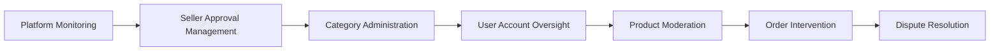

# E-Commerce Shopping Mall Platform - Service Overview

## Platform Introduction

The E-Commerce Shopping Mall Platform is a comprehensive online marketplace designed to facilitate secure transactions between sellers and customers while maintaining complete data integrity through a robust snapshot system. This platform serves as a trusted intermediary where monetary exchanges occur, requiring meticulous record-keeping and audit trails for all data modifications.

### Business Context

This platform addresses the growing demand for secure, transparent online shopping experiences where both buyers and sellers can engage with confidence. The snapshot principle ensures that all transactional data remains immutable and verifiable, providing protection against disputes and maintaining legal compliance for financial transactions.

## Core Platform Features

### User Account Management
- **Customer Registration**: All platform features require registration, eliminating guest browsing to ensure accountability
- **Seller Approval Process**: Seller accounts require administrative approval before listing products
- **Multi-tier Authentication**: Customers, sellers, administrators, and super administrators with distinct permission levels

### Product Catalog System
- **Hierarchical Categories**: Products organized into categories with one level of subcategory nesting
- **Variant-Based Products**: Products can have multiple SKU variants with individual pricing and inventory
- **Rich Media Support**: Multiple product images with reordering capabilities
- **Advanced Search**: Comprehensive search with filtering by category, price range, and stock availability

### Transaction Management
- **Shopping Cart**: Persistent cart system with quantity management and stock validation
- **Secure Checkout**: Address selection, order review, and external payment gateway integration
- **Order Processing**: Automated stock deduction and comprehensive order tracking

### Seller Management
- **Shop Profiles**: Customizable seller profiles with branding elements
- **Inventory Control**: Real-time stock management with historical tracking
- **Order Fulfillment**: Shipment creation with tracking integration
- **Request Management**: Handling cancellation and refund requests

### Administrative Oversight
- **Platform Governance**: Multi-level administrator hierarchy with escalation capabilities
- **Content Moderation**: Product oversight and seller account management
- **Dispute Resolution**: Order intervention and forced cancellation/refund capabilities

## User Experience Flow

### Customer Journey

### Seller Journey

### Administrator Journey

## Snapshot System Overview

The snapshot principle is the cornerstone of this platform's data integrity strategy, ensuring that all transactional data modifications are permanently recorded for audit and dispute resolution purposes.

### Snapshot Application Areas

**Product Lifecycle Snapshots**
- WHEN a seller edits product information, THE system SHALL create a product snapshot preserving all fields including images
- WHEN a product variant is modified, THE system SHALL create a variant snapshot with complete SKU and pricing information
- WHERE products have variants, THE product snapshot SHALL include snapshots of all variants at that moment

**Transactional Snapshots**
- WHEN an order is placed, THE system SHALL create snapshots of:
  - Product information (name, description, images)
  - Variant details (SKU, options, price)
  - Seller profile (shop name, logo)
- WHEN reviews are written or modified, THE system SHALL preserve review snapshots
- WHEN cancellation/refund requests are processed, THE system SHALL maintain request state snapshots

**Seller Profile Snapshots**
- WHEN a seller updates their shop profile, THE system SHALL create a profile snapshot
- THE seller profile snapshots SHALL be visible to customers viewing historical orders

### Snapshot Integrity Principles

- **Immutable Records**: Snapshots cannot be modified or deleted once created
- **Complete State Capture**: Each snapshot preserves the complete data state at that moment
- **Audit Trail**: All modifications are traceable through the snapshot history
- **Legal Compliance**: Snapshots serve as evidence for financial dispute resolution

## Platform Security Model

### Authentication Requirements
- THE platform SHALL require registration for all user interactions
- WHEN users register, THE system SHALL validate email addresses
- WHERE sellers register, THE system SHALL require administrative approval before selling capabilities are enabled

### Authorization Framework
- **Customer Permissions**: Browse products, create orders, write reviews, manage personal data
- **Seller Permissions**: Manage products, process orders, respond to requests, view analytics
- **Administrator Permissions**: Platform oversight, user management, content moderation
- **Super Administrator Permissions**: Administrator management, system-wide configurations

### Data Protection Requirements
- WHEN customers delete accounts, THE system SHALL preserve order history while removing personal information
- WHEN sellers delete accounts, THE system SHALL preserve order snapshots while removing active listings
- THE platform SHALL maintain financial records for legal compliance periods

## Integration Points

### Payment Gateway Integration
- THE platform SHALL integrate with external payment processors
- WHEN payment succeeds, THE system SHALL create orders and deduct inventory
- IF payment fails, THE system SHALL allow retry without order creation

### Shipping Carrier Integration
- Sellers SHALL be able to enter tracking information from various carriers
- Customers SHALL be able to track shipments through integrated carrier APIs

### Email Notification System
- THE platform SHALL send notifications for:
  - Order confirmations and status updates
  - Shipment tracking information
  - Account-related activities
  - Administrative communications

## Performance and Scalability Requirements

### User Experience Expectations
- Product search results SHALL appear instantly for common queries
- Page loads SHALL feel immediate with loading indicators for complex operations
- Cart operations SHALL respond within 2 seconds
- Order processing SHALL complete within 5 seconds of payment confirmation

### System Capacity
- THE platform SHALL support concurrent user sessions during peak shopping periods
- Product catalog browsing SHALL remain responsive with thousands of active listings
- Order processing SHALL handle high-volume transaction periods without degradation

## Error Handling and Recovery

### User-Facing Error Scenarios
- IF product search returns no results, THE system SHALL display helpful suggestions
- WHEN cart items become unavailable, THE system SHALL clearly indicate the issue
- IF payment processing fails, THE system SHALL provide clear retry instructions
- WHERE orders encounter processing errors, THE system SHALL maintain transaction integrity

### System Recovery Processes
- THE platform SHALL maintain data consistency during partial failures
- Inventory updates SHALL be atomic to prevent overselling
- Order creation SHALL be transactional to ensure complete success or complete rollback

## Business Workflow Integration

### Customer Service Scenarios
- Customers CAN request order cancellations for unshipped items
- Customers CAN request refunds for delivered items within 7 days
- Sellers CAN respond to cancellation/refund requests with approval or rejection
- Administrators CAN intervene in disputes with forced actions

### Financial Accountability
- ALL monetary transactions SHALL be traceable through the snapshot system
- Order histories SHALL be preserved for legal and accounting requirements
- Refund processes SHALL maintain audit trails for financial compliance

## Platform Evolution Considerations

### Future Feature Extensibility
- THE architecture SHALL support additional payment methods
- THE category system SHALL allow for future hierarchical expansions
- THE review system SHALL accommodate additional moderation features
- THE administrative tools SHALL support new oversight requirements

### Internationalization Readiness
- THE platform SHALL be structured to support multiple currencies
- Address management SHALL accommodate international formatting
- THE user interface SHALL be prepared for localization

This service overview provides the comprehensive business context and feature specifications that backend developers need to understand the complete scope and requirements of the e-commerce platform. The document focuses on user workflows, business rules, and system behaviors without prescribing technical implementation details.

> *Developer Note: This document defines **business requirements only**. All technical implementations (architecture, APIs, database design, etc.) are at the discretion of the development team.*