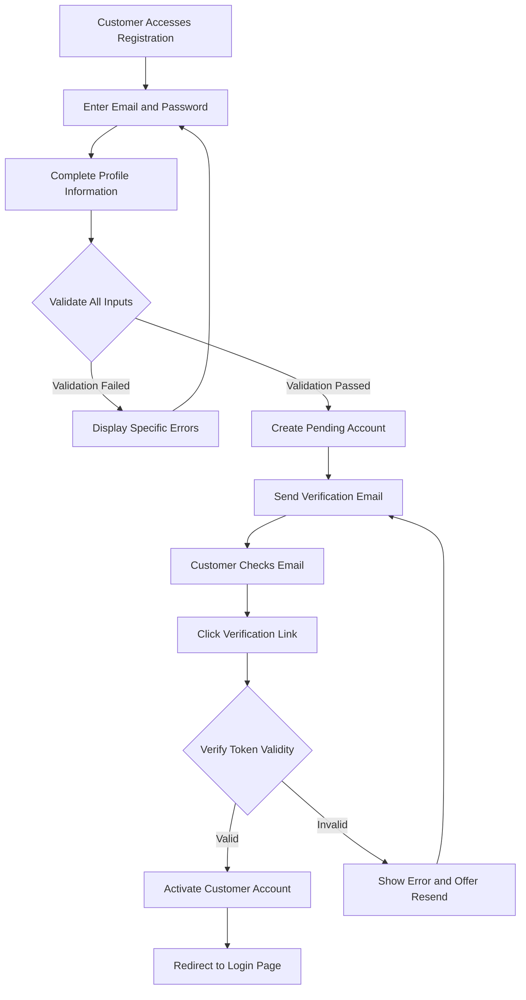
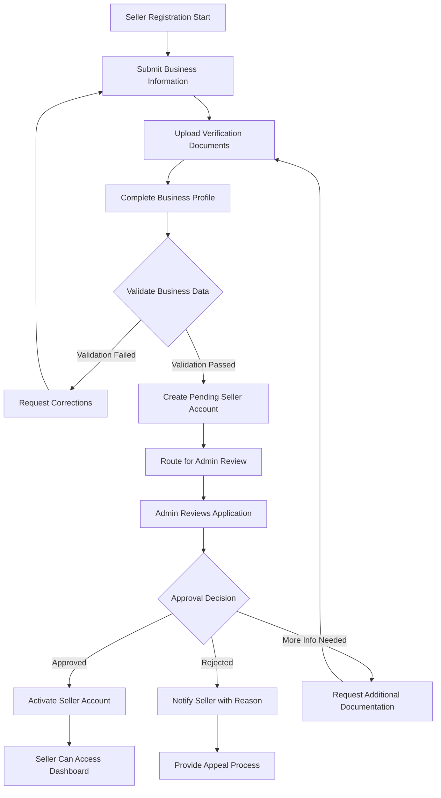
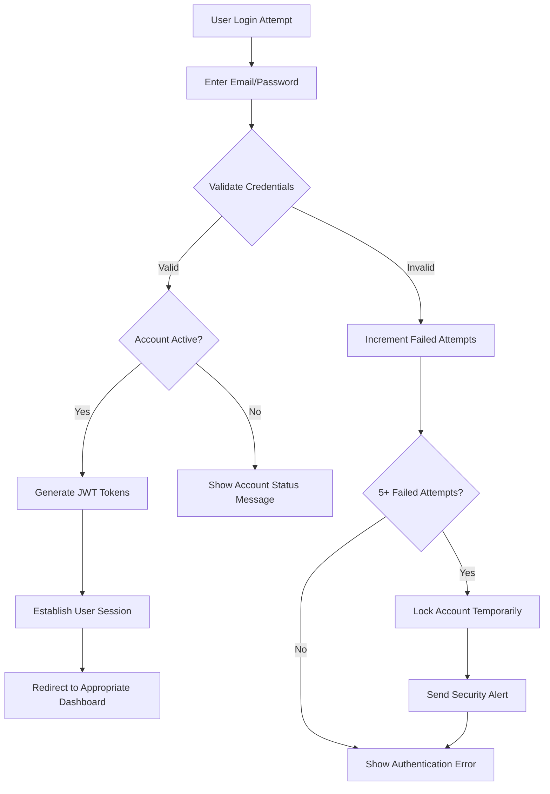
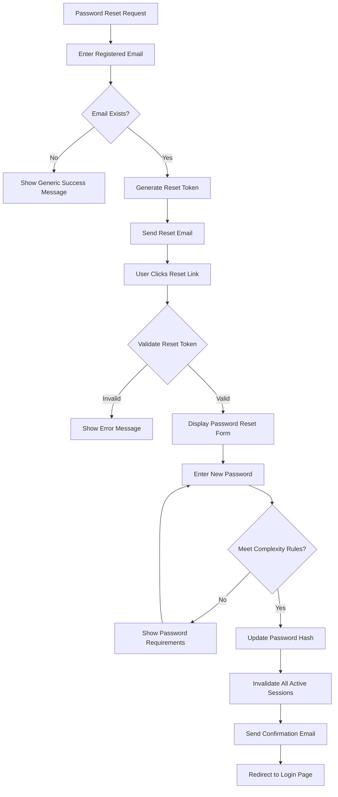
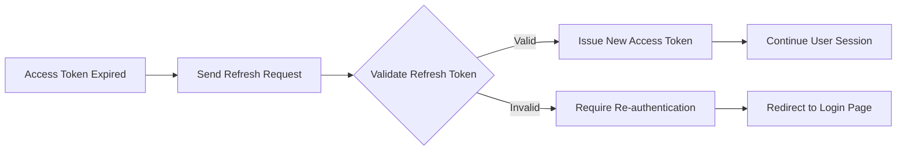
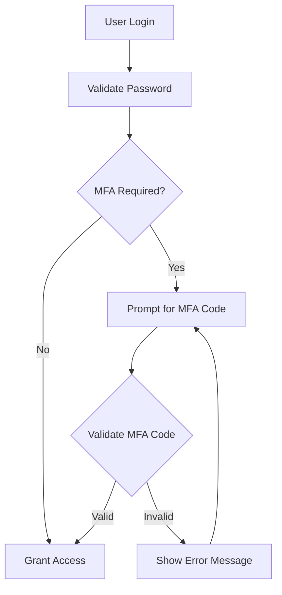

# User Actors and Authentication Requirements

## 1. Introduction and Business Context

This document defines the complete authentication system and user actor structure for the e-commerce shopping mall platform. The authentication system provides secure access control for customers, sellers, and administrators, enabling appropriate permissions and capabilities based on user roles. This system serves as the foundation for all platform interactions and ensures secure, role-based access to platform features.

## 2. Comprehensive User Actor Definitions

### 2.1 Customer Actor

**Role Definition**: Registered customers who browse products, make purchases, and manage their shopping experience.

**Business Capabilities**:
- Browse product catalog and search for items with advanced filtering
- Add products to shopping cart and manage quantities
- Create and manage multiple wishlists with sharing capabilities
- Place orders and process payments through secure gateways
- Track order status and shipping information in real-time
- Manage personal profile information and contact details
- Maintain address book with multiple shipping and billing addresses
- Write product reviews and ratings for purchased items
- View comprehensive order history with filtering options
- Request order cancellations and refunds within policy guidelines
- Manage payment methods with secure tokenization
- Configure communication preferences and notification settings

**Authentication Requirements**:
- WHEN a customer registers, THE system SHALL require email verification before account activation
- WHERE customers provide passwords, THE system SHALL enforce minimum 8-character complexity
- WHEN customers forget passwords, THE system SHALL provide secure reset functionality
- THE system SHALL maintain session security with automatic logout after 30 minutes inactivity

### 2.2 Seller Actor

**Role Definition**: Business sellers who manage product catalogs, inventory, and order fulfillment operations.

**Business Capabilities**:
- Create and manage comprehensive product listings with variants
- Set product pricing, inventory levels, and availability status
- Process customer orders and manage fulfillment workflows
- Generate shipping labels and track order deliveries
- Monitor sales analytics and performance metrics
- Manage business profile and storefront configuration
- Handle customer inquiries and provide seller support
- Configure shipping options and delivery timeframes
- Manage product categories and catalog organization
- Process returns and refund requests according to policy
- Access sales reports and business intelligence dashboards
- Manage multiple staff accounts with role-based permissions

**Authentication Requirements**:
- WHEN sellers register, THE system SHALL require business verification and documentation
- WHERE sellers access sensitive business data, THE system SHALL enforce enhanced security
- THE system SHALL support multi-user access with permission hierarchies
- WHEN suspicious activity is detected, THE system SHALL trigger security reviews

### 2.3 Admin Actor

**Role Definition**: System administrators with full platform management and oversight capabilities.

**Business Capabilities**:
- Manage all user accounts including customers, sellers, and administrative staff
- Oversee product catalog content moderation and quality control
- Monitor platform performance metrics and system health indicators
- Configure system settings and integration parameters
- Generate comprehensive analytics reports and business insights
- Handle escalated customer service issues and dispute resolution
- Manage platform security policies and compliance requirements
- Oversee payment processing and financial reconciliation
- Monitor seller performance and platform policy enforcement
- Manage platform promotions and marketing campaigns
- Access system logs and audit trails for security monitoring
- Configure tax settings and regional compliance requirements

**Authentication Requirements**:
- WHEN admin accounts are created, THE system SHALL require multi-factor authentication
- WHERE administrative functions are accessed, THE system SHALL log all activities
- THE system SHALL enforce strict session timeout policies for admin accounts
- WHEN security breaches occur, THE system SHALL implement immediate access revocation

## 3. Complete Authentication System Requirements

### 3.1 User Registration Process

**WHEN** a new user attempts to register, **THE** system **SHALL**:
- Validate email format and check for existing accounts
- Enforce password complexity requirements (minimum 8 characters with uppercase, lowercase, numbers)
- Send verification email with secure token expiration
- Create account in pending verification status
- Log registration attempt for security monitoring

**WHERE** business sellers register, **THE** system **SHALL**:
- Collect comprehensive business information including tax identification
- Require business verification documents upload
- Route registration for administrative approval
- Provide status tracking during verification process
- Notify sellers of approval/rejection with detailed reasons

### 3.2 User Login Authentication

**WHEN** valid credentials are provided, **THE** system **SHALL**:
- Authenticate user against stored credentials using secure hashing
- Generate JWT access token with appropriate role permissions
- Establish secure session with httpOnly cookies
- Log successful login with timestamp and IP address
- Update user's last login timestamp

**WHEN** invalid credentials are provided, **THE** system **SHALL**:
- Return authentication error without revealing specific failure reason
- Increment failed login attempt counter
- Implement account lockout after 5 consecutive failed attempts
- Send security notification if suspicious pattern detected

### 3.3 Password Management System

**THE** system **SHALL** enforce the following password policies:
- Minimum 8 character length with complexity requirements
- Password history prevention (cannot reuse last 5 passwords)
- Regular password expiration (90-day rotation recommended)
- Secure password reset functionality with time-limited tokens
- Password strength indicator during creation/update

### 3.4 Session Management Requirements

**THE** system **SHALL** implement comprehensive session management:
- JWT access tokens with 30-minute expiration
- Refresh tokens with 7-day expiration for persistent sessions
- Secure token storage using httpOnly cookies
- Session termination capability from all devices
- Concurrent session support with device tracking
- Automatic logout after 30 minutes of inactivity

## 4. Detailed Permission Matrices

### 4.1 Customer Permission Matrix

| Operation | Permission Level | Constraints |
|-----------|------------------|-------------|
| Browse Products | Full Access | Public content only |
| Search Products | Full Access | Apply seller filters |
| Add to Cart | Authenticated Only | Inventory validation |
| Place Orders | Authenticated Only | Payment verification |
| View Order History | Owner Only | Personal orders only |
| Write Reviews | Purchase Verified | After delivery completion |
| Manage Addresses | Owner Only | Maximum 10 addresses |
| Update Profile | Owner Only | Email verification required |

### 4.2 Seller Permission Matrix

| Operation | Permission Level | Constraints |
|-----------|------------------|-------------|
| Manage Products | Seller Owned | Approval required for new listings |
| View Sales Analytics | Seller Specific | Own products only |
| Process Orders | Seller Specific | Own product orders only |
| Update Inventory | Seller Specific | Real-time validation |
| Manage Store Settings | Seller Admin | Business verification required |
| Access Payment Reports | Seller Specific | Payout cycle constraints |
| Manage Staff Accounts | Seller Admin | Role-based permissions |

### 4.3 Admin Permission Matrix

| Operation | Permission Level | Constraints |
|-----------|------------------|-------------|
| User Management | Full Access | Audit logging required |
| System Configuration | Full Access | Change approval process |
| Content Moderation | Full Access | Policy compliance checking |
| Financial Oversight | Full Access | Dual authorization for payments |
| Security Monitoring | Full Access | Real-time alerting |
| Platform Analytics | Full Access | Data privacy compliance |
| API Management | Full Access | Rate limiting enforcement |

## 5. Step-by-Step Authentication Flows

### 5.1 Customer Registration Flow



### 5.2 Seller Registration and Approval Flow



### 5.3 User Login Authentication Flow



### 5.4 Password Reset Flow



## 6. Comprehensive Session Management

### 6.1 JWT Token Strategy

**Access Token Specifications**:
- Algorithm: HS256 with secure secret key
- Expiration: 30 minutes from issuance
- Payload: User ID, role, permissions, issue timestamp
- Storage: httpOnly cookie with secure flags

**Refresh Token Specifications**:
- Expiration: 7 days from issuance
- Storage: Secure server-side with user association
- Usage: Single-use for access token refresh
- Rotation: New refresh token issued on each use

### 6.2 Token Refresh Flow



### 6.3 Concurrent Session Management

**THE** system **SHALL** support multiple concurrent sessions per user with:
- Device tracking and session management
- Ability to view active sessions from security settings
- Remote session termination capability
- Session activity logging for security monitoring

## 7. Detailed Security Protocols

### 7.1 Password Security Requirements

**Password Storage**:
- THE system SHALL use bcrypt with work factor 12 for password hashing
- WHEN passwords are stored, THE system SHALL use salt per user
- THE system SHALL never log or display passwords in clear text

**Password Policy Enforcement**:
- Minimum length: 8 characters
- Complexity: At least one uppercase, one lowercase, one number
- History: Prevent reuse of last 5 passwords
- Expiration: Recommend change every 90 days
- Strength: Implement real-time strength indicator

### 7.2 Account Security Features

**Security Monitoring**:
- THE system SHALL log all authentication attempts with IP and timestamp
- WHEN new device logs in, THE system SHALL send notification email
- WHERE suspicious patterns detected, THE system SHALL require additional verification

**Account Protection**:
- THE system SHALL implement account lockout after 5 failed attempts
- WHEN account locked, THE system SHALL require admin unlock or time delay
- THE system SHALL support voluntary account freezing for security concerns

### 7.3 Data Protection Compliance

**GDPR Compliance**:
- THE system SHALL provide data export functionality
- WHEN accounts deleted, THE system SHALL anonymize personal data
- THE system SHALL obtain explicit consent for data processing

**PCI DSS Compliance**:
- THE system SHALL never store sensitive payment information
- WHEN handling payment data, THE system SHALL use tokenization
- THE system SHALL maintain secure audit trails for financial transactions

## 8. Complete JWT Token Specifications

### 8.1 Customer JWT Payload Structure

```json
{
  "userId": "c7d8e9f0-a1b2-c3d4-e5f6-a7b8c9d0e1f2",
  "email": "customer@example.com",
  "role": "customer",
  "permissions": [
    "browse:products",
    "purchase:orders", 
    "manage:profile",
    "write:reviews",
    "view:order_history"
  ],
  "accountStatus": "active",
  "emailVerified": true,
  "lastLogin": "2024-01-15T10:30:00Z",
  "iat": 1705300200,
  "exp": 1705302000
}
```

### 8.2 Seller JWT Payload Structure

```json
{
  "userId": "d8e9f0a1-b2c3-d4e5-f6a7-b8c9d0e1f2a3",
  "email": "seller@business.com",
  "role": "seller",
  "businessId": "b9c8d7e6-f5a4-b3c2-d1e0-f9e8d7c6b5a4",
  "permissions": [
    "browse:products",
    "purchase:orders",
    "manage:profile", 
    "write:reviews",
    "view:order_history",
    "manage:products",
    "process:orders",
    "view:analytics",
    "manage:inventory"
  ],
  "storeStatus": "verified",
  "subscriptionTier": "professional",
  "iat": 1705300200,
  "exp": 1705302000
}
```

### 8.3 Admin JWT Payload Structure

```json
{
  "userId": "e9f0a1b2-c3d4-e5f6-a7b8-c9d0e1f2a3b4",
  "email": "admin@platform.com",
  "role": "admin",
  "permissions": [
    "browse:products",
    "purchase:orders",
    "manage:profile",
    "write:reviews",
    "view:order_history",
    "manage:products",
    "process:orders",
    "view:analytics",
    "manage:inventory",
    "manage:users",
    "system:config",
    "content:moderate",
    "financial:oversight"
  ],
  "adminLevel": "super",
  "mfaEnabled": true,
  "lastSecurityReview": "2024-01-01T00:00:00Z",
  "iat": 1705300200,
  "exp": 1705302000
}
```

## 9. Comprehensive Error Handling

### 9.1 Authentication Error Scenarios

**Invalid Credentials**:
- WHEN invalid credentials provided, THE system SHALL return HTTP 401 Unauthorized
- THE error response SHALL include generic message: "Invalid email or password"
- THE system SHALL increment failed attempt counter for security monitoring

**Account Locked**:
- WHEN account is temporarily locked, THE system SHALL return HTTP 423 Locked
- THE error response SHALL indicate lock duration and unlock procedure
- THE system SHALL log lock event for security analysis

**Email Not Verified**:
- WHEN unverified account attempts login, THE system SHALL return HTTP 403 Forbidden
- THE error response SHALL provide option to resend verification email
- THE system SHALL track verification request frequency

### 9.2 Token Management Errors

**Token Expired**:
- WHEN expired token used, THE system SHALL return HTTP 401 with "token_expired"
- THE client SHALL automatically attempt token refresh
- IF refresh fails, THE system SHALL require re-authentication

**Invalid Token**:
- WHEN malformed token provided, THE system SHALL return HTTP 401 with "invalid_token"
- THE system SHALL log token validation failures for security monitoring
- THE client SHALL clear stored tokens and redirect to login

### 9.3 Permission Denied Errors

**Insufficient Permissions**:
- WHEN user lacks required permissions, THE system SHALL return HTTP 403 Forbidden
- THE error response SHALL indicate required permission level
- THE system SHALL log permission denial for audit purposes

## 10. Integration Requirements

### 10.1 External Authentication Providers

**Social Login Integration**:
- THE system SHALL support OAuth2 integration with Google, Facebook, Apple
- WHEN social login used, THE system SHALL create local account mapping
- THE system SHALL handle account linking and unlinking procedures

**Enterprise SSO Integration**:
- WHERE enterprise customers require, THE system SHALL support SAML 2.0
- THE system SHALL maintain proper certificate management
- THE system SHALL handle SSO session synchronization

### 10.2 Multi-Factor Authentication

**MFA Implementation**:
- FOR admin accounts, THE system SHALL require multi-factor authentication
- THE system SHALL support TOTP (Time-based One-Time Password)
- THE system SHALL provide backup codes for recovery scenarios
- THE system SHALL allow MFA device management

**MFA Flow**:


## 11. Performance and Scalability Requirements

### 11.1 Authentication Performance

**Response Time Targets**:
- User authentication: < 500ms response time
- Token validation: < 100ms processing time
- Session creation: < 200ms complete workflow
- Password verification: < 50ms using optimized bcrypt

**Concurrency Support**:
- THE system SHALL support 10,000 concurrent authentication requests
- THE system SHALL handle 100 new registrations per minute
- THE system SHALL process 1,000 password reset requests hourly

### 11.2 Scalability Architecture

**Horizontal Scaling**:
- THE authentication service SHALL support stateless horizontal scaling
- THE system SHALL use distributed session storage
- THE system SHALL implement connection pooling for database access

**Caching Strategy**:
- THE system SHALL cache frequently accessed user data
- THE system SHALL implement token blacklisting for security
- THE system SHALL use Redis for session storage and caching

## 12. Compliance and Regulatory Requirements

### 12.1 Data Privacy Compliance

**GDPR Requirements**:
- THE system SHALL provide right to erasure functionality
- WHEN accounts deleted, THE system SHALL anonymize personal data
- THE system SHALL maintain data processing records
- THE system SHALL obtain explicit consent for data collection

**Regional Compliance**:
- THE system SHALL adapt to regional data protection laws
- THE system SHALL support data localization requirements
- THE system SHALL provide compliance reporting capabilities

### 12.2 Security Standards Compliance

**Industry Standards**:
- THE system SHALL comply with OWASP authentication guidelines
- THE system SHALL implement secure password storage practices
- THE system SHALL follow principle of least privilege for permissions

**Audit Requirements**:
- THE system SHALL maintain comprehensive audit trails
- THE system SHALL support security incident investigation
- THE system SHALL provide compliance reporting tools

> *Developer Note: This document defines **business requirements only**. All technical implementations (architecture, APIs, database design, etc.) are at the discretion of the development team.*