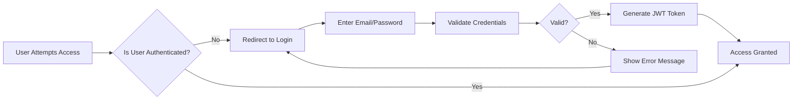
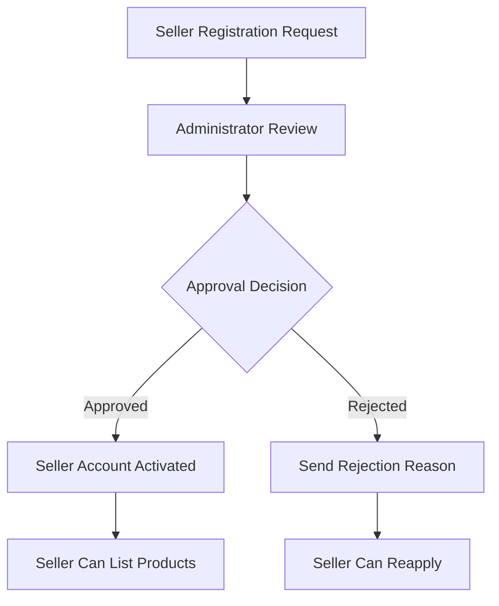

# E-Commerce Shopping Mall Platform Requirements Specification

## Executive Summary

This document provides comprehensive business requirements for a secure e-commerce shopping mall platform that facilitates transactions between customers and sellers. The platform implements a robust snapshot system to preserve all data modifications for financial accountability and dispute resolution. All users must register before accessing platform features, ensuring full traceability of all actions.

## Business Model

The platform operates as a marketplace connecting customers with sellers. Key business principles include:

- **Mandatory Registration**: No guest browsing allowed - all users must authenticate
- **Seller Approval Process**: All sellers require administrator approval before listing products
- **Snapshot Preservation**: All data modifications create immutable snapshots for audit trails
- **Multi-Seller Orders**: Single orders can contain items from multiple sellers
- **Independent Shipping**: Each seller ships their items separately
- **Financial Accountability**: Complete transaction history preserved for legal compliance

## Target Market

- **Primary Customers**: Individual consumers seeking diverse product selection
- **Sellers**: Small to medium businesses requiring online sales platform
- **Administrators**: Platform operators managing marketplace operations

## Competitive Advantage

- **Data Integrity**: Comprehensive snapshot system ensures transaction transparency
- **Seller Accountability**: Approval process maintains marketplace quality
- **Customer Protection**: Robust cancellation and refund processes
- **Legal Compliance**: Order preservation meets regulatory requirements

## User Actor Definitions

### Customer
Individual consumers who browse, purchase products, and interact with sellers.

**Registration Requirements:**
- WHEN a user attempts to register, THE system SHALL require email and password
- THE system SHALL validate email format and password strength upon registration
- THE customer SHALL be able to access platform features only after successful registration

**Profile Management:**
- EACH customer SHALL have a profile containing display name and phone number
- THE customer SHALL be able to edit their display name and phone number
- PROFILE modifications SHALL be recorded in the account activity log

**Account Deletion Rules:**
- IF a customer requests account deletion, THEN THE system SHALL preserve order history and reviews
- WHEN account is deleted, THEN THE customer profile information SHALL be removed
- ORDER records SHALL be preserved with customer identifier marked as "deleted user"

### Seller
Business entities authorized to list and sell products on the platform.

**Registration Approval Workflow:**
- WHEN a seller registers, THEN THE system SHALL require administrator approval
- THE seller SHALL be able to view approval status (pending, approved, rejected)
- IF approval is rejected, THEN THE seller SHALL receive rejection reason
- REJECTED sellers SHALL be able to submit new registration requests

**Seller Profile Management:**
- EACH seller SHALL have a profile containing shop name, description, and logo
- THE seller SHALL be able to edit shop profile information
- EVERY profile edit SHALL create a snapshot preserving previous state
- CUSTOMER views of seller profiles SHALL show current profile information

**Account Deletion Constraints:**
- WHERE seller has pending orders, THEN THE seller SHALL not be able to delete account
- WHERE seller has pending cancellation/refund requests, THEN account deletion SHALL be blocked
- WHEN seller account is deleted, THEN THE seller's products SHALL be removed from listings
- ORDER history SHALL be preserved with shop name at time of purchase

### Administrator
Platform operators managing user approvals, content moderation, and system oversight.

**Administrator Promotion Process:**
- ANY user SHALL be able to request administrator privileges
- THE request SHALL require submission of reason for becoming administrator
- SUPER administrators SHALL review and approve/reject administrator requests
- WHEN approved, THE user SHALL become regular administrator

**Administrator Hierarchy:**
- THERE SHALL be two grades: regular administrator and super administrator
- SUPER administrators SHALL be able to promote/demote other administrators
- SUPER administrators SHALL not be able to demote themselves
- REGULAR administrators SHALL have limited administrative privileges

### Super Administrator
Highest-level administrators with complete platform control.

**Privilege Management:**
- SUPER administrators SHALL manage administrator promotions and demotions
- THE system SHALL prevent complete removal of all super administrator accounts
- CRITICAL platform operations SHALL require super administrator approval

## Authentication System

### Core Authentication Functions

**User Registration:**
- "WHEN a user registers with email and password, THE system SHALL validate credentials and create account"
- "THE system SHALL require email verification before account activation"
- "NEW accounts SHALL start with appropriate default permissions based on account type"

**Login Process:**
- "WHEN a user enters email and password, THE system SHALL authenticate and create session"
- "THE authentication SHALL validate against hashed password storage"
- "SUCCESSFUL login SHALL generate JWT token with user claims"

**Session Management:**
- "THE system SHALL maintain user sessions for authenticated access"
- "SESSION timeout SHALL occur after 30 minutes of inactivity"
- "USERS SHALL be able to log out to terminate session"

**Password Security:**
- "THE system SHALL require passwords with minimum 8 characters including uppercase, lowercase, numbers"
- "PASSWORD changes SHALL require current password verification"
- "FORGOTTEN passwords SHALL be reset through email verification"

### Authentication Flow

## Customer Profile Management

### Profile Information
- EACH customer SHALL have a profile containing display name and phone number
- THE customer SHALL be able to edit their display name and phone number
- PROFILE modifications SHALL be recorded in the account activity log

### Address Management
- CUSTOMERS SHALL be able to add multiple shipping addresses
- EACH address SHALL contain: recipient name, phone number, street address, city, state/province, postal code, country
- CUSTOMERS SHALL be able to edit and delete their addresses
- CUSTOMERS SHALL be able to set one address as default shipping address

## Seller Management System

### Seller Registration Process

### Seller Profile Requirements
- EACH seller SHALL maintain shop name, description, and logo
- EVERY profile modification SHALL create a snapshot preserving previous state
- CUSTOMERS SHALL be able to view seller profiles when browsing products

### Product Management Permissions
- APPROVED sellers SHALL be able to create and edit products
- PRODUCT modifications SHALL create snapshots preserving previous states
- SELLERS SHALL only be able to delete products with no pending orders or requests

## Category Management

### Category Structure
- PRODUCTS SHALL be organized into categories and subcategories
- CATEGORIES SHALL have one level of nesting only (categories → subcategories)
- EACH category SHALL have name and description
- CATEGORIES SHALL be created and managed by administrators only

### Category Browsing
- CUSTOMERS SHALL be able to browse the list of all categories
- CUSTOMERS SHALL be able to view products within specific categories
- DELETED categories SHALL cause products to become uncategorized

## Snapshot System Principles

### Core Snapshot Requirements
- WHENEVER editable data is modified, THE system SHALL create a snapshot preserving previous state
- SNAPSHOTS SHALL record: timestamp, user who made change, values before and after modification
- SNAPSHOTS SHALL be immutable and cannot be deleted
- RELEVANT parties SHALL be able to view snapshots for dispute resolution

### Data Types Requiring Snapshots
- PRODUCTS: All fields including images
- PRODUCT VARIANTS: SKU code, option values, price
- SELLER PROFILES: Shop name, description, logo
- ORDER ITEMS: Product, variant, and seller profile at time of purchase
- REVIEWS: Rating, text content
- CANCELLATION REQUESTS: Reason, status changes
- REFUND REQUESTS: Reason, status changes

### Product Snapshot Structure
- WHEN a product is edited, THE system SHALL create a product snapshot
- THE product snapshot SHALL include all product fields (name, description, category, base price, images)
- THE product snapshot SHALL include snapshots of all variants at that moment
- THIS SHALL preserve the complete state of a product and its variants at any point in time

## Product Catalog System

### Product Creation Requirements
- SELLERS SHALL be able to create products
- EVERY product SHALL have: name (required), description (required), category (required), base price (required)
- PRODUCTS SHALL belong to the seller who created them

### Product Modification Rules
- SELLERS SHALL be able to edit their own products
- EVERY product edit SHALL create a snapshot
- PRODUCT deletion SHALL only be allowed when no pending orders or requests exist

### Product Images
- SELLERS SHALL be able to upload multiple images for each product
- IMAGES SHALL be reorderable with first image as main/thumbnail
- IMAGE changes SHALL be included in product snapshots

## Product Variants System

### Variant Requirements
- A product SHALL be able to have multiple variants
- EACH variant SHALL represent specific combination of options (e.g., "Red / Large", "Blue / Small")
- EACH variant SHALL have: SKU code (unique identifier, required), option values, price (optional override), stock quantity (required, starts at 0)

### Variant Management
- SELLERS SHALL be able to add variants to their products
- SELLERS SHALL be able to edit variants (SKU code, option values, price)
- EVERY variant edit SHALL create a snapshot
- VARIANT deletion SHALL only be allowed when no pending orders or requests exist

### Product Availability
- A product MUST have at least one variant to be purchasable
- PRODUCTS with no variants SHALL be visible in search but shown as "unavailable"

## Inventory Management

### Stock Tracking
- EACH variant SHALL have its own stock quantity
- STOCK quantity SHALL be managed through inventory history records
- EACH inventory record SHALL contain: quantity change, reason, timestamp
- CURRENT stock SHALL be calculated by summing all inventory records

### Inventory Operations
- SELLERS SHALL be able to add inventory (restock) with quantity and reason
- SELLERS SHALL be able to subtract inventory (adjustment/loss) with quantity and reason
- ORDER placement SHALL automatically create negative inventory record
- ORDER cancellation/refund SHALL automatically create positive inventory record

### Stock Status
- WHEN stock reaches 0, THE variant SHALL be shown as "out of stock"
- OUT of stock variants SHALL not be added to cart
- SELLERS SHALL be able to view full inventory history of each variant

## Product Discovery

### Search Functionality
- CUSTOMERS SHALL be able to search products by name
- SEARCH results SHALL show products from all sellers
- SEARCH results SHALL be paginated

### Search Filters
- CUSTOMERS SHALL be able to filter search results by:
  - Category
  - Price range (minimum and maximum)
  - In-stock only

### Search Sorting
- CUSTOMERS SHALL be able to sort search results by:
  - Newest first
  - Price (low to high)
  - Price (high to low)

## Product Display

### Product Listing
- WHEN viewing product lists, EACH product SHALL show:
  - Main image (thumbnail)
  - Name
  - Base price (or price range if variants have different prices)
  - Seller shop name
  - Average rating (if reviews exist)

### Product Detail Page
- CUSTOMERS SHALL be able to view single product's full details
- THE page SHALL show:
  - All images
  - Name and description
  - Category
  - Seller shop name (links to seller profile)
  - All available variants with prices and stock status
  - Average rating and total review count
  - All reviews

## Wishlist Management

### Wishlist Operations
- CUSTOMERS SHALL be able to add products to their wishlist
- CUSTOMERS SHALL be able to view their wishlist
- THE wishlist SHALL be paginated
- WISHLIST SHALL show products (not specific variants)

### Wishlist Maintenance
- CUSTOMERS SHALL be able to remove products from their wishlist
- IF a product is deleted by seller, IT SHALL be automatically removed from all wishlists

## Shopping Cart System

### Cart Operations
- CUSTOMERS SHALL be able to add variants to their cart (specific variant selection required)
- WHEN adding to cart, CUSTOMERS SHALL specify quantity
- IF same variant already in cart, QUANTITIES SHALL be combined

### Cart Management
- CUSTOMERS SHALL be able to view their cart
- CART SHALL show each item with: product name, variant options, price, quantity, subtotal
- CUSTOMERS SHALL be able to change item quantities
- CUSTOMERS SHALL be able to remove items from cart
- CART SHALL show total price of all items

### Cart Validation
- IF variant's stock is less than cart quantity, A warning SHALL be shown
- IF variant is deleted or out of stock, IT SHALL be marked as unavailable in cart

## Checkout Process

### Checkout Requirements
- CUSTOMERS SHALL be able to proceed to checkout from their cart
- UNAVAILABLE items SHALL not be checked out
- CUSTOMERS SHALL select shipping address (or use default)

### Order Review
- BEFORE placing order, CUSTOMERS SHALL review:
  - List of items with prices
  - Shipping address
  - Total price
- ONCE order placed, SHIPPING address SHALL not be changed

## Payment Processing

### Payment Flow
- AFTER review, CUSTOMERS SHALL confirm and place order
- PAYMENT SHALL be processed through external payment gateway
- PAYMENT SHALL succeed or fail

### Payment Outcomes
- IF payment fails, ORDER SHALL not be created and customers SHALL retry
- IF payment succeeds, ORDER SHALL be created

## Order Creation

### Order Creation Process
- WHEN order placed successfully:
  - STOCK quantities SHALL be decreased for each purchased variant
  - ITEMS SHALL be removed from customer's cart
  - ORDER record SHALL be created
  - EACH purchased variant SHALL become order item with status "paid"
  - SNAPSHOT of each purchased product/variant SHALL be saved with order item
  - SNAPSHOT of each seller's profile SHALL be saved with order item

### Order Structure
- AN order SHALL contain one or more order items
- EACH order item SHALL represent purchased product variant with quantity
- IF customer buys multiple same variant, IT SHALL become one order item with combined quantity
- ORDER items SHALL be from different sellers
- EACH order item SHALL have its own status

## Order Management

### Order History
- CUSTOMERS SHALL be able to view list of all their orders
- THE list SHALL be paginated and sorted by newest first
- EACH order in list SHALL show: order number, date, total price, overall status

### Order Details
- CUSTOMERS SHALL be able to view full order details:
  - List of items with: product name, variant, quantity, price, item status
  - Shipping address
  - List of shipments with tracking information

### Order Status Hierarchy

**Order Item Status:**
- PAID: payment completed, waiting for seller to ship
- SHIPPED: seller has shipped the item
- DELIVERED: item has been delivered
- CANCELLED: item was cancelled
- REFUNDED: item was refunded

**Overall Order Status:**
- IF all items paid → order is "paid"
- IF any item shipped (none delivered) → order is "shipped"
- IF all items delivered → order is "delivered"
- IF all items cancelled → order is "cancelled"
- IF all items refunded → order is "refunded"
- IF mixed states → order is "partially completed"

## Shipping and Tracking

### Shipment Concept
- A shipment SHALL be a package sent by a seller
- A shipment SHALL contain one or more order items from same seller
- DIFFERENT sellers SHALL always ship separately
- SELLERS SHALL choose to ship items individually or bundled

### Shipping Process
- SELLERS SHALL view order items needing shipping
- WHEN shipping, SELLERS SHALL select items to include in shipment
- SELLERS SHALL enter tracking information (carrier name, tracking number)
- ALL items in same shipment SHALL share tracking information
- WHEN shipment created, ALL items SHALL change to status "shipped"

### Delivery Confirmation
- CUSTOMERS SHALL view tracking information per shipment
- CUSTOMERS SHALL confirm delivery per shipment (not per item)
- WHEN delivery confirmed, ALL items in shipment SHALL change to "delivered"
- IF customer doesn't confirm, ITEMS SHALL auto-change to "delivered" after 14 days

## Order Cancellation

### Cancellation Process
- CANCELLATION SHALL be handled per order item, not per entire order
- CUSTOMERS SHALL request cancellation for items with status "paid" (not shipped)
- CANCELLATION requests SHALL include reason
- SELLER of item SHALL approve or reject cancellation request

### Cancellation Outcomes
- WHEN seller responds, SNAPSHOT of request state SHALL be created
- IF approved, ITEM SHALL be cancelled and refund processed
- CANCELLED items SHALL restore stock quantities
- REMAINING items in order SHALL continue processing
- IF all items cancelled, ENTIRE order status becomes "cancelled"

## Refund Requests

### Refund Process
- REFUND SHALL be handled per order item, not per entire order
- CUSTOMERS SHALL request refund for items with status "delivered"
- REFUND requests SHALL include reason
- REFUND SHALL be requested within 7 days of item delivery
- SELLER of item SHALL approve or reject refund request

### Refund Outcomes
- WHEN seller responds, SNAPSHOT of request state SHALL be created
- IF approved, ITEM SHALL be refunded
- REFUNDED items SHALL restore stock quantities
- REMAINING items SHALL be unaffected
- IF all items refunded, ENTIRE order status becomes "refunded"

## Reviews and Ratings

### Review Requirements
- CUSTOMERS SHALL write reviews for products they purchased
- REVIEWS SHALL only be written after item status is "delivered"
- CUSTOMERS SHALL write one review per product per order
- EACH review SHALL have: rating (1-5 stars, required), text content (optional)

### Review Management
- REVIEWS SHALL be displayed on product detail page
- REVIEWS SHALL be sorted by newest first
- CUSTOMERS SHALL edit their own reviews
- EVERY review edit SHALL create snapshot
- CUSTOMERS SHALL delete their own reviews (snapshots preserved)
- PRODUCT average rating SHALL be calculated from non-deleted reviews

## Seller Dashboard

### Dashboard Overview
- SELLERS SHALL view shop summary:
  - Total number of products
  - Total number of order items
  - Number of pending cancellation requests
  - Number of pending refund requests

### Order Management
- SELLERS SHALL view list of all order items for their products
- SELLERS SHALL filter order items by status

## Administrator System

### Administrator Promotion
- ANY user SHALL submit request to become administrator
- REQUEST SHALL include reason
- SUPER administrators SHALL view pending requests
- SUPER administrators SHALL approve/reject requests
- WHEN approved, USER becomes regular administrator

### Administrator Hierarchy
- TWO grades: regular administrator and super administrator
- SUPER administrators SHALL promote/demote other administrators
- SUPER administrators SHALL not demote themselves

### Seller Management
- ADMINISTRATORS SHALL view pending seller approvals
- ADMINISTRATORS SHALL approve/reject seller registrations
- WHEN rejecting, ADMINISTRATORS SHALL provide reason
- REJECTED sellers SHALL submit new registration requests
- ADMINISTRATORS SHALL suspend seller accounts

### Seller Suspension Rules
- WHEN seller suspended:
  - PRODUCTS SHALL be hidden from search and listings
  - PRODUCTS SHALL not be purchased
  - SELLER SHALL process existing orders
  - SELLER SHALL not create/edit products
- ADMINISTRATORS SHALL unsuspend seller accounts

### Category Management
- ADMINISTRATORS SHALL create categories and subcategories
- ADMINISTRATORS SHALL edit category names/descriptions
- ADMINISTRATORS SHALL delete categories (products become uncategorized)

### Product Oversight
- ADMINISTRATORS SHALL view all platform products
- ADMINISTRATORS SHALL view snapshots of any product
- ADMINISTRATORS SHALL delete products for policy violations

### Order Oversight
- ADMINISTRATORS SHALL view all platform orders
- ADMINISTRATORS SHALL force-cancel items/orders (refunds customer, restores stock)
- ADMINISTRATORS SHALL force-refund items/orders

### User Management
- ADMINISTRATORS SHALL view all customer accounts
- ADMINISTRATORS SHALL ban customers (cannot log in)
- ADMINISTRATORS SHALL unban customers
- ADMINISTRATORS SHALL view all seller accounts
- ADMINISTRATORS SHALL ban sellers (cannot log in, orders remain)

## Security and Compliance

### Data Security
- USER credentials SHALL be encrypted in transit and at rest
- PERSONAL information SHALL be protected according to privacy regulations
- AUDIT trails SHALL record all authentication events

### Access Control
- API endpoints SHALL validate user permissions for each request
- UNAUTHORIZED access attempts SHALL be logged and monitored
- ROLE-based access control SHALL enforce permission boundaries

### Legal Compliance
- ORDER records SHALL be preserved according to regulatory requirements
- FINANCIAL transactions SHALL maintain complete audit trails
- DATA retention policies SHALL comply with applicable laws

## Performance Requirements

### System Performance
- SEARCH functionality SHALL return results within 2 seconds
- PRODUCT pages SHALL load within 3 seconds
- ORDER processing SHALL complete within 5 seconds
- PAYMENT gateway integration SHALL handle high transaction volumes

### Scalability
- THE platform SHALL support concurrent user sessions
- DATABASE SHALL handle product catalog growth
- ORDER processing SHALL scale with transaction volume increases

## Integration Requirements

### External Systems
- PAYMENT gateway integration SHALL support multiple providers
- EMAIL service SHALL handle notification delivery
- SHIPPING carrier APIs SHALL provide tracking information
- ANALYTICS integration SHALL provide business intelligence

### API Requirements
- ALL external integrations SHALL use secure API protocols
- ERROR handling SHALL provide graceful degradation
- DATA synchronization SHALL maintain consistency

This comprehensive requirements specification provides the foundation for developing a secure, scalable e-commerce platform that maintains data integrity through its snapshot system while supporting complex multi-seller transactions.