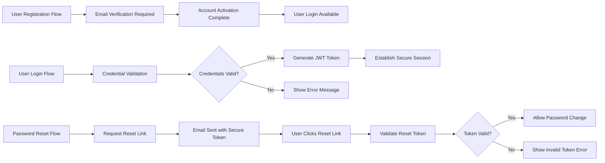

# User Actors and Authentication Requirements Document

## Executive Summary

This document defines the comprehensive authentication and authorization framework for the shoppingMall e-commerce platform. The system supports three primary user actors: customers, sellers, and administrators, each with distinct permissions and capabilities. The authentication system ensures secure access control while providing seamless user experience across all platform functionalities.

## User Actor Definitions

### Customer Actor
**Role**: Standard platform user with purchasing capabilities

**Business Capabilities**:
- Browse and search product catalog
- Add items to shopping cart
- Place orders and make payments
- Track order status and history
- Manage personal profile and preferences
- Create and manage wishlists
- Save shipping addresses and payment methods
- Write product reviews and ratings

**Authentication Requirements**:
- Self-service registration with email verification
- Standard login with email/password
- Password recovery functionality
- Session management with automatic logout

### Seller Actor
**Role**: Product provider with inventory management capabilities

**Business Capabilities**:
- Create and manage product listings
- Update inventory levels and pricing
- Process customer orders
- Generate sales reports and analytics
- Manage seller profile and store information
- Communicate with customers regarding orders
- Handle returns and refund requests

**Authentication Requirements**:
- Seller registration with business verification
- Enhanced security for financial operations
- Multi-factor authentication for sensitive actions
- Role-based access for team members

### Admin Actor
**Role**: Platform administrator with full system control

**Business Capabilities**:
- Manage all user accounts (customers, sellers, administrators)
- Oversee product catalog and content moderation
- Monitor and manage platform orders
- Configure system settings and policies
- Generate platform-wide analytics and reports
- Handle escalated customer service issues
- Manage payment gateway configurations

**Authentication Requirements**:
- Administrative registration requires super-admin approval
- Strict multi-factor authentication
- Session timeout with automatic re-authentication for sensitive operations
- Audit logging for all administrative actions

## Authentication System Requirements

### Core Authentication Functions

**User Registration**:
- WHEN a new user attempts to register, THE system SHALL validate email format and uniqueness
- THE system SHALL require email verification before account activation
- WHERE registration is for seller accounts, THE system SHALL require business verification
- WHERE registration is for admin accounts, THE system SHALL require approval from existing administrators

**User Login**:
- WHEN a user provides login credentials, THE system SHALL validate and authenticate within 2 seconds
- THE system SHALL implement secure password hashing using bcrypt algorithm
- IF login attempts exceed 5 within 10 minutes, THEN THE system SHALL temporarily lock the account
- THE system SHALL maintain user sessions with secure token management

**Password Management**:
- WHEN a user requests password reset, THE system SHALL send secure reset link to registered email
- THE system SHALL enforce password complexity requirements (minimum 8 characters, including uppercase, lowercase, numbers, and special characters)
- THE system SHALL prevent password reuse from last 5 passwords
- WHERE password change is requested, THE system SHALL require current password verification

**Session Management**:
- THE user session SHALL expire after 30 minutes of inactivity
- THE system SHALL provide secure logout functionality that invalidates all tokens
- WHERE sensitive operations are performed, THE system SHALL require re-authentication
- THE system SHALL support concurrent sessions across multiple devices

### Authentication Flow Requirements



## Permission Matrix and Access Control

### Customer Permissions Matrix

| Action | Customer | Seller | Admin |
|--------|----------|--------|-------|
| Browse products | ✅ | ✅ | ✅ |
| Search products | ✅ | ✅ | ✅ |
| Add to cart | ✅ | ❌ | ❌ |
| Place orders | ✅ | ❌ | ❌ |
| View own orders | ✅ | ❌ | ❌ |
| Write reviews | ✅ | ❌ | ❌ |
| Manage profile | ✅ | ✅ | ✅ |

### Seller Permissions Matrix

| Action | Customer | Seller | Admin |
|--------|----------|--------|-------|
| Create product listings | ❌ | ✅ | ✅ |
| Update inventory | ❌ | ✅ | ✅ |
| Manage own products | ❌ | ✅ | ✅ |
| Process orders | ❌ | ✅ | ✅ |
| View sales analytics | ❌ | ✅ | ✅ |
| Manage seller profile | ❌ | ✅ | ✅ |

### Admin Permissions Matrix

| Action | Customer | Seller | Admin |
|--------|----------|--------|-------|
| Manage all users | ❌ | ❌ | ✅ |
| Manage all products | ❌ | ❌ | ✅ |
| View all orders | ❌ | ❌ | ✅ |
| System configuration | ❌ | ❌ | ✅ |
| Platform analytics | ❌ | ❌ | ✅ |
| Content moderation | ❌ | ❌ | ✅ |

## JWT Token Management

### Token Structure Requirements

**Access Token Payload**:
```json
{
  "userId": "uuid-string",
  "email": "user@example.com",
  "role": "customer|seller|admin",
  "permissions": ["array-of-specific-permissions"],
  "iat": 1234567890,
  "exp": 1234567890
}
```

**Refresh Token Requirements**:
- THE refresh token SHALL have longer expiration (7 days)
- THE system SHALL store refresh tokens securely with user association
- WHEN access token expires, THE system SHALL use refresh token to generate new access token
- WHERE refresh token is compromised, THE system SHALL invalidate all associated tokens

### Token Security Specifications
- THE JWT secret key SHALL be at least 256 bits
- THE system SHALL rotate JWT secrets periodically
- THE system SHALL implement token blacklisting for logged-out users
- WHERE token theft is detected, THE system SHALL immediately revoke all tokens

## Security Requirements

### Authentication Security
- THE system SHALL enforce HTTPS for all authentication requests
- THE system SHALL implement rate limiting on login attempts
- THE system SHALL use secure cookies with HttpOnly and Secure flags
- WHERE sensitive data is transmitted, THE system SHALL use encryption

### Authorization Security
- THE system SHALL validate user permissions on every API request
- THE system SHALL implement role-based access control (RBAC)
- THE system SHALL log all authorization attempts and failures
- WHERE permission escalation is attempted, THE system SHALL deny access and log the event

### Data Protection
- THE system SHALL encrypt sensitive user data at rest
- THE system SHALL implement data minimization principles
- THE system SHALL provide data export and deletion capabilities
- WHERE GDPR compliance is required, THE system SHALL implement appropriate controls

## Error Handling and Recovery

### Authentication Error Scenarios

**Invalid Credentials**:
- WHEN login credentials are invalid, THE system SHALL return HTTP 401 with error code "INVALID_CREDENTIALS"
- THE system SHALL increment failed login counter
- IF failed attempts exceed threshold, THEN THE system SHALL lock account temporarily

**Account Locked**:
- WHEN account is locked due to excessive failed attempts, THE system SHALL return HTTP 423 with error code "ACCOUNT_LOCKED"
- THE system SHALL provide unlock instructions via email
- THE lock SHALL automatically expire after 30 minutes

**Token Expired**:
- WHEN JWT token expires, THE system SHALL return HTTP 401 with error code "TOKEN_EXPIRED"
- THE client SHALL use refresh token to obtain new access token
- IF refresh token is also expired, THEN THE user SHALL be required to login again

### Recovery Processes

**Password Recovery**:
- WHEN password reset is requested, THE system SHALL generate secure token with 1-hour expiration
- THE reset email SHALL contain clear instructions and security warnings
- WHERE reset token is used, THE system SHALL invalidate it immediately

**Account Recovery**:
- WHEN account access is lost, THE system SHALL provide email-based recovery
- THE recovery process SHALL require identity verification
- WHERE suspicious activity is detected, THE system SHALL require additional verification

## Integration Guidelines

### API Authentication Integration
- ALL API endpoints SHALL require valid JWT token in Authorization header
- THE system SHALL validate token signature and expiration on every request
- WHERE role-based access is required, THE system SHALL check user permissions

### Frontend Integration Requirements
- THE frontend SHALL store JWT tokens securely (localStorage or httpOnly cookies)
- THE frontend SHALL handle token expiration and refresh automatically
- WHERE authentication fails, THE frontend SHALL redirect to login page

### Third-Party Integration
- WHERE third-party authentication is supported, THE system SHALL implement OAuth 2.0
- THE system SHALL map third-party identities to internal user accounts
- WHERE social login is used, THE system SHALL collect necessary permissions

## Performance Requirements

### Authentication Performance
- THE login process SHALL complete within 2 seconds under normal load
- THE token validation SHALL add less than 100ms to API response time
- THE system SHALL support concurrent authentication of 1000 users per second

### Session Management Performance
- THE session creation SHALL complete within 500ms
- THE token refresh SHALL complete within 200ms
- THE system SHALL maintain session state with minimal performance impact

## Compliance Requirements

### Security Standards
- THE system SHALL comply with OWASP authentication security guidelines
- THE system SHALL implement PCI DSS requirements for payment-related authentication
- WHERE personal data is processed, THE system SHALL comply with GDPR

### Audit Requirements
- THE system SHALL log all authentication events
- THE system SHALL maintain audit trails for 7 years
- WHERE regulatory compliance is required, THE system SHALL provide audit reports

## Business Process Requirements

### Customer Registration Process
WHEN a customer initiates registration, THE system SHALL:
1. Collect email address and validate format
2. Check email uniqueness against existing accounts
3. Send verification email with secure token
4. Upon verification, create user account with customer role
5. Send welcome email with platform introduction

### Seller Onboarding Process
WHEN a seller applies for registration, THE system SHALL:
1. Collect business information and documentation
2. Verify business legitimacy through validation process
3. Approve seller account after business verification
4. Provide seller dashboard access and onboarding resources
5. Enable product listing capabilities upon approval

### Admin Account Creation Process
WHEN creating administrative accounts, THE system SHALL:
1. Require approval from existing super-admin
2. Implement strict security vetting process
3. Assign appropriate permission levels based on responsibilities
4. Provide comprehensive security training
5. Enable audit logging for all administrative actions

### Multi-Factor Authentication Implementation
WHERE enhanced security is required, THE system SHALL:
1. Support SMS-based verification codes
2. Implement authenticator app integration
3. Provide backup recovery codes
4. Allow user-configurable security preferences
5. Log all MFA attempts for security monitoring

## Authentication Enhancement Features

### Session Security Enhancements
- THE system SHALL detect suspicious login patterns and trigger additional verification
- WHERE login occurs from new device or location, THE system SHALL notify user
- THE system SHALL provide session management dashboard for users to monitor active sessions
- WHERE session hijacking is suspected, THE system SHALL allow users to terminate all sessions

### Password Security Features
- THE system SHALL implement password strength meter during registration
- THE system SHALL provide password health monitoring and expiration reminders
- WHERE weak passwords are detected, THE system SHALL require password updates
- THE system SHALL support password managers through secure integration

### Account Security Monitoring
- THE system SHALL monitor for compromised credentials through breach databases
- WHERE account security risks are detected, THE system SHALL require password reset
- THE system SHALL provide security notifications for suspicious activities
- Users SHALL receive regular security summary reports

> *Developer Note: This document defines **business requirements only**. All technical implementations (architecture, APIs, database design, etc.) are at the discretion of the development team.*