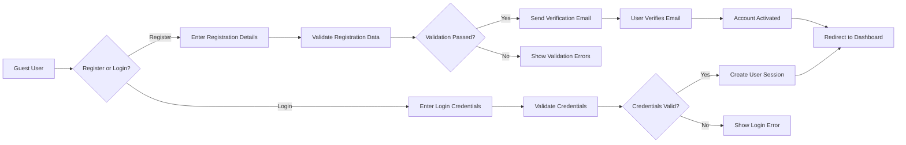

# User Actors and Authentication System Specification

## Introduction and Overview

This document defines the complete user actor structure and authentication requirements for the shoppingMall e-commerce platform. The system supports three primary actor types: customers, sellers, and administrators, each with distinct authentication flows and permission hierarchies.

## User Actor Definitions

### Customer Actor
Customers are registered users who can browse products, make purchases, and interact with the platform. They represent the primary consumer base.

**Key Characteristics:**
- Can browse and search products without authentication
- Must register/login to make purchases
- Can manage personal profiles and addresses
- Can write reviews and ratings for purchased products
- Can track order history and status

### Seller Actor
Sellers are business users who register to sell products on the platform. They manage their product catalog and handle order fulfillment.

**Key Characteristics:**
- Must undergo verification process to become sellers
- Can manage their product listings and inventory
- Can process orders from customers
- Have access to sales analytics and reporting
- Can communicate with customers regarding orders

### Admin Actor
Administrators have full system access to manage platform operations, users, and content.

**Key Characteristics:**
- Full access to all system data and functionality
- Can manage user accounts and permissions
- Can oversee platform-wide operations
- Have access to comprehensive analytics
- Can configure system settings and policies

## Authentication System Requirements

### Core Authentication Functions

**User Registration:**
- WHEN a guest attempts to register, THE system SHALL validate email format and password strength
- THE system SHALL send email verification to complete registration
- WHERE email verification is required, THE system SHALL prevent account activation until verification

**User Login:**
- WHEN a user provides credentials, THE system SHALL validate and authenticate within 2 seconds
- THE system SHALL maintain secure session management
- IF login attempts exceed 5 within 10 minutes, THE system SHALL implement temporary lockout

**Password Management:**
- THE system SHALL allow users to reset forgotten passwords via email
- THE system SHALL enforce password complexity requirements (minimum 8 characters with mixed characters)
- Users SHALL be able to change their passwords while logged in

**Session Security:**
- THE system SHALL automatically log out users after 30 minutes of inactivity
- Users SHALL be able to manually log out from any device
- THE system SHALL provide "logout from all devices" functionality

### Authentication Flow Diagram



## Permission Hierarchy and Capabilities Matrix

### Permission Matrix

| Action | Customer | Seller | Admin |
|--------|----------|--------|-------|
| Browse products | ✅ | ✅ | ✅ |
| Search products | ✅ | ✅ | ✅ |
| View product details | ✅ | ✅ | ✅ |
| Add to cart | ✅ | ❌ | ❌ |
| Create wishlist | ✅ | ❌ | ❌ |
| Place orders | ✅ | ❌ | ❌ |
| Write reviews | ✅ | ❌ | ❌ |
| Manage product catalog | ❌ | ✅ | ✅ |
| Update inventory | ❌ | ✅ | ✅ |
| Process orders | ❌ | ✅ | ✅ |
| View sales analytics | ❌ | ✅ | ✅ |
| Manage user accounts | ❌ | ❌ | ✅ |
| Platform configuration | ❌ | ❌ | ✅ |
| System monitoring | ❌ | ❌ | ✅ |
| Content moderation | ❌ | ❌ | ✅ |

### Actor Capabilities by Module

#### Product Management
- **Customer**: Can view, search, and browse products
- **Seller**: Can create, update, delete own products; manage inventory
- **Admin**: Can manage all products across the platform

#### Order Management
- **Customer**: Can place orders, track status, request cancellations
- **Seller**: Can process orders, update shipping status, handle returns
- **Admin**: Can view all orders, manage disputes, oversee platform transactions

#### User Management
- **Customer**: Can manage own profile, addresses, preferences
- **Seller**: Can manage seller profile, business information, payment settings
- **Admin**: Can manage all user accounts, approve seller registrations, set permissions

## Session Management Specifications

### Token-Based Authentication
THE system SHALL use JWT (JSON Web Tokens) for authentication with the following specifications:

**Access Token:**
- Expiration: 15 minutes
- Storage: Secure HTTP-only cookies
- Contains: user ID, role, permissions, issued at timestamp

**Refresh Token:**
- Expiration: 7 days
- Storage: Secure HTTP-only cookies
- Used to obtain new access tokens without re-authentication

### Session Security Rules
- WHEN a user logs out, THE system SHALL invalidate both access and refresh tokens
- THE system SHALL allow concurrent sessions from multiple devices
- IF suspicious activity is detected, THE system SHALL force re-authentication

## Security Requirements

### Password Policy
- THE system SHALL require passwords with minimum 8 characters
- THE system SHALL enforce password complexity (uppercase, lowercase, numbers, special characters)
- THE system SHALL prevent password reuse for last 5 passwords
- THE system SHALL implement secure password hashing using bcrypt

### Account Security
- THE system SHALL implement rate limiting on login attempts
- THE system SHALL provide email notifications for security events
- THE system SHALL support two-factor authentication for admin accounts
- THE system SHALL encrypt sensitive user data at rest and in transit

### Data Protection
- THE system SHALL comply with data privacy regulations
- THE system SHALL implement proper access controls
- THE system SHALL log all authentication events for audit purposes

## JWT Token Structure

### Customer Token Payload
```json
{
  "userId": "customer_12345",
  "role": "customer",
  "permissions": [
    "browse_products",
    "search_products", 
    "add_to_cart",
    "place_orders",
    "write_reviews",
    "track_orders",
    "manage_profile"
  ],
  "iat": 1730377070,
  "exp": 1730377970
}
```

### Seller Token Payload
```json
{
  "userId": "seller_67890",
  "role": "seller",
  "sellerId": "bus_12345",
  "permissions": [
    "manage_products",
    "update_inventory",
    "process_orders",
    "view_analytics",
    "communicate_customers"
  ],
  "iat": 1730377070,
  "exp": 1730377970
}
```

### Admin Token Payload
```json
{
  "userId": "admin_001",
  "role": "admin",
  "permissions": [
    "manage_users",
    "manage_products",
    "view_all_orders",
    "platform_config",
    "system_monitoring"
  ],
  "iat": 1730377070,
  "exp": 1730377970
}
```

## Actor-Specific Business Rules

### Customer Registration Rules
- WHEN a customer registers, THE system SHALL require email verification
- THE system SHALL prevent duplicate email registrations
- WHERE age verification is required for certain products, THE system SHALL collect birth date during registration

### Seller Approval Process
- WHEN a user applies to become a seller, THE system SHALL require business verification
- THE system SHALL review seller applications within 48 hours
- WHERE business documentation is incomplete, THE system SHALL request additional information

### Admin Access Controls
- THE system SHALL require additional verification for sensitive admin operations
- WHEN admin users access sensitive data, THE system SHALL log the activity
- THE system SHALL implement role-based access control for different admin permission levels

### Session Management Rules
- THE system SHALL automatically extend session duration for active users
- WHEN a user's device changes, THE system SHALL require re-authentication for sensitive operations
- THE system SHALL provide session timeout warnings 5 minutes before expiration

### Error Handling Scenarios
- IF authentication fails due to invalid credentials, THE system SHALL return specific error messages
- WHEN session tokens expire, THE system SHALL redirect to login page with appropriate message
- IF account access is restricted, THE system SHALL provide clear explanation to the user

## Integration Requirements

### Address Management
- THE system SHALL allow customers to manage multiple shipping addresses
- WHEN placing orders, THE system SHALL validate address completeness
- THE system SHALL provide address suggestions based on user input

### Notification System
- THE system SHALL send email notifications for authentication events
- WHEN password changes occur, THE system SHALL notify the user via email
- THE system SHALL provide in-app notifications for security-related activities

## Performance and Scalability Requirements

### Authentication Performance
- THE system SHALL handle 100 concurrent login attempts per minute
- User authentication SHALL complete within 2 seconds under normal load
- Session token validation SHALL process within 500 milliseconds

### Scalability Considerations
- THE authentication system SHALL support 10,000 concurrent user sessions
- User data storage SHALL scale to accommodate 1 million registered users
- Permission checks SHALL execute within 100 milliseconds regardless of user count

## Compliance and Regulatory Requirements

### Data Privacy Compliance
- THE system SHALL comply with GDPR requirements for user data protection
- User consent SHALL be obtained and recorded for data processing activities
- Data retention policies SHALL be implemented for authentication logs

### Security Standards
- THE system SHALL implement OWASP security guidelines for authentication
- Regular security audits SHALL be conducted for vulnerability assessment
- Security incident response procedures SHALL be documented and tested

## Business Continuity Requirements

### Authentication Service Availability
- THE authentication system SHALL maintain 99.9% uptime
- Failover mechanisms SHALL ensure service continuity during outages
- Backup authentication methods SHALL be available for emergency access

### Disaster Recovery
- User authentication data SHALL be backed up every 4 hours
- Recovery procedures SHALL restore authentication services within 2 hours
- Business continuity plans SHALL include authentication service restoration

This document defines the complete authentication and authorization framework for the e-commerce platform. All technical implementations (API design, database schema, encryption methods) are at the discretion of the development team based on these business requirements.