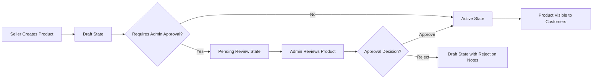

# Product Catalog Requirements Specification

## Executive Summary

This document defines the comprehensive business requirements for the shopping mall platform's product catalog management system. The product catalog serves as the foundation of the e-commerce platform, enabling customers to discover, browse, and purchase products while providing sellers with robust tools for product management and inventory control.

### Business Context
The product catalog must support a multi-vendor marketplace model where multiple sellers can list products within a unified categorization system. The catalog must scale to accommodate thousands of products across diverse categories while maintaining optimal performance and search accuracy.

## Product Management Overview

### Core Product Management Functions
THE product catalog system SHALL provide comprehensive product management capabilities for sellers and administrators.

WHEN a seller registers on the platform, THE system SHALL provide access to product listing and management tools.
WHEN a seller creates a new product listing, THE system SHALL validate all required product attributes before publication.
WHEN a product is published, THE system SHALL make it immediately available for customer browsing and purchase.

### Product Lifecycle States
THE product catalog SHALL manage products through the following lifecycle states:
- **Draft**: Product created but not visible to customers
- **Pending Review**: Product submitted for admin approval (if required)
- **Active**: Product published and available for purchase
- **Out of Stock**: Product temporarily unavailable
- **Archived**: Product permanently removed from catalog
- **Suspended**: Product temporarily removed due to policy violations

## Product Categories and Classification System

### Category Hierarchy Structure
THE product catalog SHALL organize products using a hierarchical category system with the following levels:
- **Level 1**: Major product groups (e.g., Electronics, Clothing, Home & Garden)
- **Level 2**: Subcategories (e.g., Electronics → Smartphones, Electronics → Laptops)
- **Level 3**: Specific product types (e.g., Smartphones → Android, Smartphones → iOS)

### Category Management Requirements
WHEN creating a new category, THE system SHALL require:
- Category name (2-50 characters)
- Category description (optional, max 500 characters)
- Parent category selection (for levels 2 and 3)
- Display order position
- Active/inactive status

WHILE a category is marked as inactive, THE system SHALL hide it from customer browsing while maintaining existing product associations.

### Product-Category Association
WHEN assigning a product to categories, THE system SHALL:
- Allow assignment to one primary category
- Allow assignment to up to three secondary categories
- Validate that categories exist and are active
- Prevent circular category references

## Product Attributes and Specifications

### Core Product Attributes
THE product catalog SHALL require the following mandatory attributes for all products:
- Product title (5-200 characters)
- Product description (10-2000 characters)
- Product images (minimum 1, maximum 8)
- Price (numeric, 2 decimal places, minimum $0.01)
- Stock quantity (integer, minimum 0)
- SKU (stock keeping unit, unique per seller, 3-50 characters)
- Category assignment
- Product condition (New, Used, Refurbished)

### Extended Product Attributes
WHERE products require additional specifications, THE system SHALL support attribute groups:
- **Electronics**: Brand, Model, Color, Storage Capacity, Screen Size
- **Clothing**: Size, Color, Material, Gender, Age Group
- **Home & Garden**: Dimensions, Weight, Material, Color
- **Books**: Author, ISBN, Publisher, Publication Date

### Attribute Validation Rules
WHEN a seller enters product attributes, THE system SHALL validate:
- Numeric attributes fall within acceptable ranges
- Text attributes meet length requirements
- Required attributes are not empty
- Attribute values match defined data types

## Search and Filtering Requirements

### Search Algorithm Specifications
WHEN a customer searches for products, THE system SHALL:
- Search across product titles, descriptions, and attributes
- Return results ordered by relevance score
- Support partial matching and fuzzy search
- Handle common misspellings and synonyms
- Return results within 500ms for typical queries

### Advanced Filtering Capabilities
THE product catalog SHALL provide filtering by:
- Price range (minimum and maximum)
- Product category and subcategory
- Product condition
- Seller rating and reputation
- Availability (in stock/out of stock)
- Brand and manufacturer
- Product attributes specific to category

### Search Performance Requirements
WHILE handling concurrent search requests, THE system SHALL maintain response times under 1 second for 95% of queries.
IF search query returns more than 1000 results, THEN THE system SHALL provide pagination with 20 products per page.

## Product Display Specifications

### Product Listing Display
WHEN displaying products in search results or category browsing, THE system SHALL show:
- Product thumbnail image
- Product title (truncated if necessary)
- Seller name and rating
- Current price
- Discount percentage (if applicable)
- "In Stock" or "Out of Stock" badge
- Quick add to cart button

### Product Detail Page Requirements
WHEN a customer views a product detail page, THE system SHALL display:
- Product image gallery with zoom capability
- Complete product title and description
- All product attributes and specifications
- Seller information with rating and contact options
- Customer reviews and ratings
- Related products suggestions
- Social sharing options

### Mobile Display Optimization
WHERE customers access the platform via mobile devices, THE product display SHALL be optimized for touch interaction and smaller screens.

## Inventory Management and Stock Control

### Real-time Inventory Tracking
THE product catalog SHALL maintain real-time inventory counts for all products.
WHEN a customer adds a product to cart, THE system SHALL reserve the quantity.
WHEN an order is completed, THE system SHALL deduct the purchased quantity from inventory.
WHEN an order is cancelled, THE system SHALL restore the inventory quantity.

### Low Stock Alerts
IF product inventory falls below a predefined threshold, THEN THE system SHALL notify the seller.
WHERE sellers set custom low-stock thresholds, THE system SHALL use those values for alert generation.

### Inventory Synchronization
WHILE multiple sellers offer the same product, THE system SHALL maintain separate inventory counts for each seller.

## Product Lifecycle Management

### Product Publication Workflow

### Product Modification Rules
WHEN a seller modifies an active product, THE system SHALL:
- Maintain the product's active status during editing
- Save changes as a new version while preserving the live version
- Require seller confirmation to publish changes
- Log all modification activities for audit purposes

### Product Archiving and Deletion
WHEN a seller archives a product, THE system SHALL:
- Remove the product from search results and category browsing
- Maintain the product record for order history purposes
- Allow restoration within 30 days
- Permanently delete product data after 90 days of archiving

## Performance and Scalability Requirements

### Catalog Performance Standards
THE product catalog SHALL meet the following performance benchmarks:
- Category browsing: < 200ms response time
- Product search: < 500ms response time
- Product detail loading: < 300ms response time
- Image loading: < 1 second for standard quality images

### Scalability Requirements
WHILE the platform grows to 10,000+ products, THE catalog system SHALL maintain performance standards.
WHEN concurrent users exceed 1,000, THE system SHALL continue to operate without degradation.

### Caching Strategy
THE product catalog SHALL implement caching for:
- Category hierarchies and product counts
- Popular search results
- Product detail pages for high-traffic items
- Attribute lists and filter options

## Integration Requirements

### Shopping Cart Integration
THE product catalog SHALL provide real-time inventory information to the shopping cart system.
WHEN products are added to cart, THE catalog SHALL update inventory reservations immediately.

### Order Management Integration
THE product catalog SHALL maintain product information consistency with completed orders.
WHILE orders reference specific product versions, THE catalog SHALL preserve product data as it existed at order time.

### Seller Management Integration
THE product catalog SHALL integrate with seller management systems to:
- Validate seller permissions for product management
- Track seller performance metrics
- Enforce seller-specific product listing limits

## Error Handling and Edge Cases

### Product Not Found Scenarios
IF a customer requests a product that does not exist, THEN THE system SHALL return a user-friendly error message.
IF a product has been archived or suspended, THEN THE system SHALL inform the customer appropriately.

### Inventory Discrepancies
WHEN inventory quantities become negative due to system errors, THEN THE system SHALL:
- Log the discrepancy for investigation
- Prevent further purchases until resolved
- Notify administrators and affected sellers

### Search Performance Degradation
IF search performance degrades below acceptable thresholds, THEN THE system SHALL:
- Implement search query optimization
- Provide fallback search mechanisms
- Notify administrators of performance issues

## Business Rules and Validation

### Product Pricing Rules
THE system SHALL enforce minimum and maximum price limits based on product category.
WHEN sellers attempt to set prices outside acceptable ranges, THE system SHALL reject the price setting.

### Product Content Moderation
THE system SHALL automatically flag products containing prohibited content based on:
- Keyword filtering for restricted terms
- Image analysis for inappropriate content
- Seller reputation and history

### Duplicate Product Prevention
THE system SHALL detect and prevent listing of identical products by the same seller.
WHEN similar products are detected, THE system SHALL suggest product variation options instead.

## Success Metrics and Monitoring

### Key Performance Indicators
THE product catalog success SHALL be measured by:
- Product discovery rate (searches leading to views)
- Conversion rate (views leading to purchases)
- Search accuracy and relevance scores
- Inventory accuracy percentage
- System uptime and performance metrics

### Monitoring Requirements
THE system SHALL provide real-time monitoring of:
- Search query performance
- Inventory synchronization status
- Product publication success rates
- Category browsing performance

## Additional Business Processes

### Product Import and Export
WHEN sellers need to bulk manage products, THE system SHALL provide:
- CSV import functionality for product creation
- Export capabilities for inventory reporting
- Template-based product upload with validation
- Batch processing for large product catalogs

### Product Variation Management
WHERE products have variations (size, color, etc.), THE system SHALL support:
- Parent-child product relationships
- Variation-specific pricing and inventory
- Combined product listings with option selection
- Visual variation representation

### Cross-selling and Upselling
THE product catalog SHALL implement intelligent product recommendations:
- "Customers who bought this also bought" suggestions
- Complementary product recommendations
- Bundle creation capabilities
- Seasonal and promotional product highlighting

### Product Review and Rating System
WHEN customers interact with products, THE system SHALL:
- Collect and display customer reviews
- Calculate average product ratings
- Moderate review content for appropriateness
- Provide helpfulness voting for reviews

### Product Analytics and Reporting
THE catalog system SHALL provide sellers with:
- Product view and conversion statistics
- Search term performance analysis
- Inventory turnover rates
- Customer engagement metrics

This document defines the complete business requirements for the product catalog system. Development teams should use these requirements to design and implement the technical solution that meets these business needs while maintaining flexibility for future enhancements.