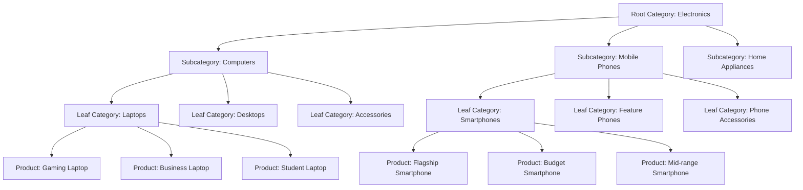
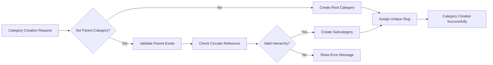
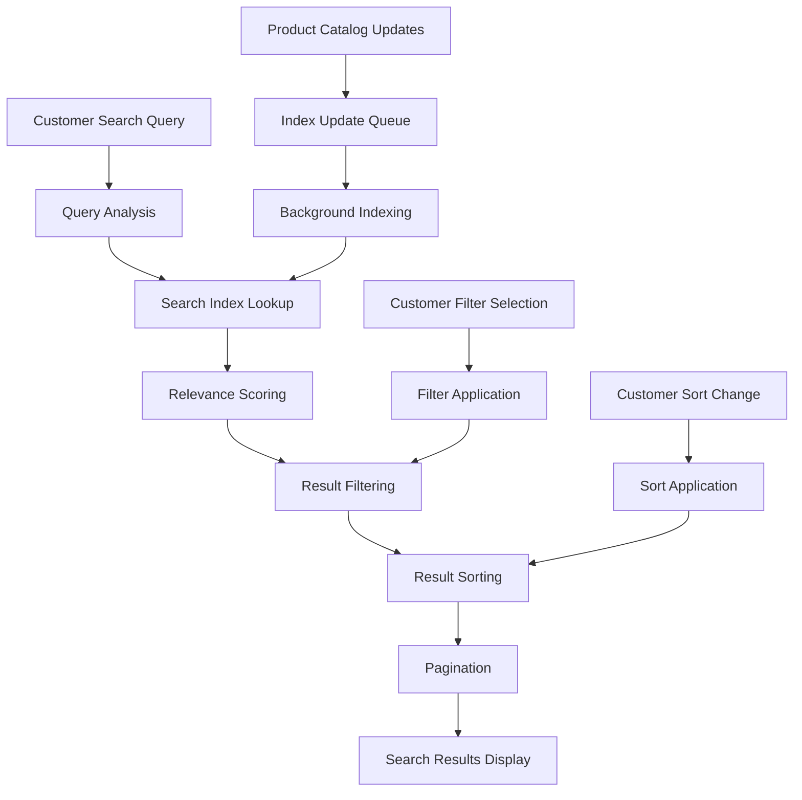

# Product Catalog Management System Requirements Specification

## Executive Summary

This document defines the complete product catalog management system for the e-commerce shopping mall platform. The catalog system serves as the foundation for the shopping experience, enabling customers to discover, browse, and purchase products while providing sellers with comprehensive tools to manage their inventory and product offerings.

## Business Context

The product catalog is the central repository of all products available on the platform. It must support complex product relationships, variant management, and real-time inventory tracking to ensure accurate product information and availability status for customers.

## 1. Product Management Overview

### 1.1 Core Product Management Functions

**Product Lifecycle Management**
- WHEN a seller creates a new product, THE system SHALL require basic product information including title, description, and category assignment
- WHEN a product is created, THE system SHALL generate a unique product identifier
- WHILE a product is in draft status, THE system SHALL prevent it from appearing in customer-facing catalogs
- WHEN a seller publishes a product, THE system SHALL make it available for customer browsing and purchase
- IF a product reaches zero inventory across all variants, THEN THE system SHALL automatically mark it as out of stock

**Product Status Management**
- THE system SHALL support the following product statuses: draft, published, unpublished, out of stock, discontinued
- WHEN a product status changes, THE system SHALL update all related product listings immediately
- WHERE products are marked as discontinued, THE system SHALL prevent new orders but maintain order history

### 1.2 Product Information Requirements

**Mandatory Product Fields**
- Product title: 5-200 characters, unique within seller catalog
- Product description: 50-5000 characters with formatting support
- Product category: Must be assigned to valid existing category
- Base price: Positive numeric value with maximum 2 decimal places
- Stock status: Available, out of stock, or discontinued

**Optional Product Information**
- Product specifications and technical details
- Manufacturer information and warranty details
- Product dimensions and weight for shipping calculations
- SEO metadata for search engine optimization
- Product tags for enhanced discoverability

## 2. Category Hierarchy System

### 2.1 Multi-Level Category Structure

**Category Management Requirements**
- THE system SHALL support a hierarchical category structure with maximum 3 nesting levels
- WHEN creating categories, THE system SHALL require category name, description, and parent category assignment
- EACH category SHALL have a unique identifier and SEO-friendly URL slug
- THE system SHALL prevent circular references in category hierarchies

**Category Assignment Rules**
- WHEN assigning products to categories, THE system SHALL allow multiple category assignments
- WHERE a product belongs to multiple categories, THE system SHALL display it in all assigned category listings
- THE system SHALL maintain category assignment integrity when parent categories are modified
- Products SHALL only be assigned to leaf-level categories (no products in parent categories)

**Category Navigation**
- WHEN customers browse categories, THE system SHALL display subcategories and product counts
- THE system SHALL support breadcrumb navigation showing the complete category path
- Category pages SHALL display featured products and promotional content

### 2.2 Category Management Operations

**Category Creation Workflow**

**Category Validation Rules**
- Category names must be unique within the same parent category
- Category slugs must be URL-safe and unique across the platform
- Maximum category depth of 3 levels must be enforced
- Category deletion must handle orphaned products appropriately

## 3. Product Variant Specifications

### 3.1 Variant Type Management

**Variant Definition Requirements**
- THE system SHALL support product variants based on attributes like color, size, material, and other custom options
- WHEN defining variant types, THE system SHALL require attribute name and possible values
- EACH variant type SHALL support multiple selection options with visual representations
- Variant attributes SHALL be configurable per product category

**Variant Combination Generation**
- WHEN a seller defines multiple variant types, THE system SHALL automatically generate all possible combinations
- FOR EACH variant combination, THE system SHALL create a unique SKU with individual pricing and inventory
- THE system SHALL prevent duplicate variant combinations within the same product
- Maximum of 5 variant types per product to maintain performance

**Variant Display Requirements**
- WHEN customers view product details, THE system SHALL display available variant options
- WHERE variants affect pricing, THE system SHALL update displayed prices dynamically
- THE system SHALL show inventory status for each variant combination
- Out-of-stock variants SHALL be clearly indicated and unavailable for selection

### 3.2 Color Variant Specifications

**Color Management**
- THE system SHALL support color variants with hexadecimal color codes
- WHEN defining color variants, THE system SHALL require color name and code
- THE system SHALL display color swatches in product listings
- WHERE color images are available, THE system SHALL show product images for each color
- Color names SHALL be standardized to prevent duplication (e.g., "Red" vs "Crimson")

**Size Variant Specifications**
- THE system SHALL support standardized size charts (clothing, shoes, etc.)
- WHEN size variants are used, THE system SHALL provide size guide references
- THE system SHALL track inventory separately for each size variant
- Size validation SHALL prevent invalid combinations (e.g., mismatched clothing sizes)

### 3.3 Custom Variant Options

**Custom Attribute Support**
- THE system SHALL support custom variant attributes beyond standard options
- Examples: material type, pattern, style, configuration options
- Custom attributes SHALL have defined value sets to maintain consistency
- Attribute values SHALL be searchable and filterable

**Variant Pricing Rules**
- Base product price SHALL serve as default for all variants
- Individual variant prices SHALL override base price when specified
- Price differences SHALL be clearly displayed to customers
- Variant-specific discounts SHALL be supported

## 4. SKU Management Requirements

### 4.1 SKU Lifecycle Management

**SKU Generation Rules**
- WHEN a product variant is created, THE system SHALL generate a unique SKU identifier
- THE SKU format SHALL follow: [ProductID]-[VariantCode]-[SequenceNumber]
- THE system SHALL ensure SKU uniqueness across the entire platform
- SKU format SHALL be configurable per seller or product category

**SKU Information Requirements**
- EACH SKU SHALL track: inventory quantity, price, weight, dimensions, barcode
- WHEN SKU information is updated, THE system SHALL propagate changes to all relevant product listings
- THE system SHALL maintain SKU history for audit purposes
- SKU-level pricing SHALL support currency conversion for international sales

**Inventory per SKU**
- THE system SHALL track inventory quantities separately for each SKU
- WHEN inventory decreases below threshold, THE system SHALL trigger restock notifications
- THE system SHALL prevent overselling by validating inventory before order completion
- Backorder capability SHALL be configurable per SKU

### 4.2 SKU Performance Optimization

**Inventory Query Optimization**
- THE system SHALL cache frequently accessed SKU inventory data
- Real-time inventory updates SHALL prioritize performance over immediate consistency
- Bulk inventory operations SHALL use batch processing for efficiency
- Inventory queries SHALL support pagination for large product catalogs

## 5. Inventory Tracking

### 5.1 Real-Time Inventory Management

**Inventory Update Rules**
- WHEN an order is placed, THE system SHALL immediately deduct inventory from relevant SKUs
- WHEN an order is cancelled, THE system SHALL restore inventory to the relevant SKUs
- WHEN inventory reaches zero, THE system SHALL mark the variant as out of stock
- THE system SHALL support negative inventory tracking for backordered items
- Inventory updates SHALL be atomic to prevent race conditions

**Stock Level Alerts**
- THE system SHALL notify sellers when inventory falls below predefined thresholds
- WHEN inventory is critically low, THE system SHALL highlight products in seller dashboards
- THE system SHALL provide inventory history reports showing stock movements
- Automated reordering suggestions SHALL be generated based on sales patterns

**Inventory Synchronization**
- THE system SHALL maintain consistent inventory counts across all system components
- WHEN inventory data conflicts occur, THE system SHALL use the most recent update
- THE system SHALL support batch inventory updates for bulk operations
- Inventory synchronization SHALL occur within 1 second across all systems

### 5.2 Advanced Inventory Features

**Multi-location Inventory**
- THE system SHALL support inventory tracking across multiple warehouse locations
- WHEN customers browse products, THE system SHALL show availability by location
- Shipping calculations SHALL consider inventory location for delivery estimates
- Inventory transfers between locations SHALL be tracked and managed

**Seasonal Inventory Management**
- THE system SHALL support seasonal inventory planning and forecasting
- Inventory levels SHALL be adjustable based on seasonal demand patterns
- Automatic inventory adjustments SHALL be configurable for seasonal products
- Historical sales data SHALL inform future inventory planning

## 6. Product Search and Filtering

### 6.1 Advanced Search Capabilities

**Search Functionality**
- WHEN customers search for products, THE system SHALL return relevant results based on product title, description, and attributes
- THE search system SHALL support fuzzy matching for typo tolerance
- THE system SHALL provide search suggestions as customers type
- Search results SHALL be ranked by relevance, popularity, and other factors

**Search Performance Requirements**
- Search queries SHALL return results within 2 seconds for typical queries
- THE system SHALL handle 100+ concurrent search operations
- Search index updates SHALL occur within 5 minutes of product changes
- Search functionality SHALL be available during peak traffic periods

**Filtering System**
- THE system SHALL support filtering by: price range, category, brand, availability, rating
- WHEN variant attributes exist, THE system SHALL provide filtering by color, size, and other attributes
- THE system SHALL display available filter options based on current result set
- Filter combinations SHALL be saved for frequent use cases

**Sorting Options**
- THE system SHALL support sorting by: relevance, price (low to high), price (high to low), newest, rating, popularity
- WHEN sorting by price, THE system SHALL use variant-specific pricing
- THE system SHALL remember customer sorting preferences
- Custom sorting algorithms SHALL be configurable per category

### 6.2 Search Architecture

## 7. Image and Media Management

### 7.1 Product Media Requirements

**Image Management**
- THE system SHALL support multiple product images per product (minimum 1, maximum 10)
- WHEN uploading images, THE system SHALL validate file format and size (max 10MB per image)
- THE system SHALL generate thumbnail versions for listing displays
- THE system SHALL support high-resolution images for product detail views
- Image optimization SHALL reduce file size without visible quality loss

**Variant-Specific Media**
- WHERE variants have different appearances, THE system SHALL support variant-specific images
- WHEN customers select a variant, THE system SHALL display corresponding images
- THE system SHALL maintain image associations with specific variant combinations
- Default product images SHALL be used when variant-specific images are unavailable

**Media Organization**
- THE system SHALL allow sellers to set primary images for products
- THE system SHALL support image ordering to control display sequence
- THE system SHALL provide bulk image upload and management capabilities
- Image metadata SHALL be stored for SEO optimization

### 7.2 Advanced Media Features

**Video Support**
- THE system SHALL support product demonstration videos
- Video uploads SHALL be limited to 100MB with format restrictions
- Video thumbnails SHALL be automatically generated
- Video playback SHALL be optimized for mobile and desktop

**360-Degree Product Views**
- THE system SHALL support interactive 360-degree product images
- Image sequences SHALL be uploaded as organized sets
- 360-view functionality SHALL work on both desktop and mobile devices
- Loading performance SHALL be optimized for large image sequences

## 8. Pricing and Discount Strategies

### 8.1 Pricing Management

**Variant-Specific Pricing**
- THE system SHALL support different pricing for each product variant
- WHEN variant prices differ, THE system SHALL display price ranges
- THE system SHALL calculate accurate pricing based on selected variants
- Currency conversion SHALL be applied consistently across all pricing

**Tiered Pricing Support**
- THE system SHALL support quantity-based tiered pricing
- Bulk purchase discounts SHALL be configurable per product
- Tiered pricing SHALL be clearly displayed to customers
- Minimum and maximum quantity restrictions SHALL be enforced

**Discount System**
- THE system SHALL support percentage-based and fixed-amount discounts
- WHEN discounts apply, THE system SHALL display original and discounted prices
- THE system SHALL support time-limited promotional pricing
- THE system SHALL prevent stacking of incompatible discounts
- Discount eligibility SHALL be validated before application

### 8.2 Advanced Pricing Features

**Dynamic Pricing**
- THE system SHALL support algorithm-based dynamic pricing
- Pricing rules SHALL consider competitor pricing, demand, and inventory levels
- Price change history SHALL be maintained for audit purposes
- Dynamic pricing SHALL have manual override capabilities

**Subscription Pricing**
- THE system SHALL support subscription-based product pricing
- Recurring billing cycles SHALL be configurable (weekly, monthly, annually)
- Subscription management SHALL include renewal and cancellation workflows
- Trial periods and introductory pricing SHALL be supported

**Currency and Tax Handling**
- THE system SHALL support multiple currencies with exchange rate management
- WHEN displaying prices, THE system SHALL include applicable taxes based on customer location
- THE system SHALL provide clear price breakdowns showing base price, discounts, and taxes
- Tax-exempt customers SHALL have tax calculations disabled

## 9. Performance and Scalability Requirements

### 9.1 System Performance Expectations

**Search Performance**
- THE system SHALL return search results within 2 seconds for typical queries
- WHEN filtering large result sets, THE system SHALL provide instant feedback
- THE system SHALL support concurrent search operations from multiple users
- Search index rebuilds SHALL complete within 30 minutes for 1 million products

**Catalog Browsing Performance**
- THE system SHALL load category pages within 3 seconds
- WHEN browsing product listings, THE system SHALL provide smooth pagination
- THE system SHALL cache frequently accessed product data
- Product detail pages SHALL load within 2 seconds

**Inventory Accuracy**
- THE system SHALL maintain real-time inventory accuracy across all operations
- WHEN inventory changes occur, THE system SHALL update all relevant displays within 5 seconds
- THE system SHALL prevent race conditions in inventory updates
- Inventory synchronization SHALL have maximum 1-second delay

### 9.2 Scalability Architecture

**Horizontal Scaling Support**
- THE system SHALL support distributed product catalog across multiple servers
- Database sharding SHALL be implemented for large product catalogs
- Caching layers SHALL reduce database load for frequent queries
- Load balancing SHALL distribute traffic evenly across servers

**Performance Monitoring**
- THE system SHALL monitor response times for all catalog operations
- Performance metrics SHALL be collected and analyzed regularly
- Automatic scaling SHALL be triggered based on performance thresholds
- Capacity planning SHALL be based on historical growth patterns

## 10. Business Rules and Validation

### 10.1 Data Validation Rules

**Product Information Validation**
- WHEN creating products, THE system SHALL require: title (3-200 characters), description (10-5000 characters), category assignment
- THE system SHALL validate that product prices are positive numbers
- THE system SHALL ensure that inventory quantities are non-negative integers
- Product images SHALL meet minimum quality standards

**Variant Validation**
- WHEN creating variants, THE system SHALL require unique combination of attribute values
- THE system SHALL validate that variant prices are consistent with product pricing rules
- THE system SHALL prevent creation of variants with duplicate attribute combinations
- Variant inventory SHALL be validated against parent product settings

**Category Validation**
- THE system SHALL validate category names for uniqueness within the same parent category
- WHEN moving categories, THE system SHALL prevent creation of circular hierarchies
- THE system SHALL ensure category slugs are URL-safe and unique
- Category deletion SHALL handle product reassignment appropriately

### 10.2 Business Logic Enforcement

**Pricing Rules Enforcement**
- Minimum advertised price (MAP) policies SHALL be enforced
- Price change approvals SHALL be required for significant adjustments
- Competitive pricing rules SHALL be automatically applied
- Price history SHALL be maintained for compliance auditing

**Inventory Control Rules**
- Safety stock levels SHALL be maintained for high-demand products
- Reorder points SHALL trigger automatic purchase orders
- Inventory aging SHALL be tracked for perishable products
- Obsolete inventory SHALL be identified and managed

## 11. Error Handling and User Experience

### 11.1 Error Scenarios

**Product Not Found**
- WHEN a product cannot be found, THE system SHALL display a friendly error message
- THE system SHALL suggest similar products or redirect to category listings
- 404 error pages SHALL provide helpful navigation options
- Broken product links SHALL be logged for administrative review

**Inventory Issues**
- WHEN a product variant is out of stock, THE system SHALL clearly indicate unavailable status
- THE system SHALL prevent addition of out-of-stock items to cart
- THE system SHALL provide restock notifications for interested customers
- Backorder options SHALL be presented when available

**Search Errors**
- WHEN search returns no results, THE system SHALL provide helpful suggestions
- THE system SHALL handle special characters and complex search queries gracefully
- Search timeout errors SHALL be handled with appropriate user feedback
- Search performance degradation SHALL trigger administrative alerts

### 11.2 User Experience Optimization

**Progressive Loading**
- Product listings SHALL use infinite scroll or pagination based on user preference
- Image lazy loading SHALL improve page load performance
- Critical content SHALL load first with secondary content loading progressively
- Loading indicators SHALL provide feedback during data retrieval

**Mobile Optimization**
- THE system SHALL provide responsive design for all screen sizes
- Touch-friendly interface elements SHALL be implemented
- Mobile-specific features SHALL be optimized for touch interaction
- Performance SHALL be optimized for mobile network conditions

## 12. Integration Requirements

### 12.1 External System Integration

**Image Storage Integration**
- THE system SHALL integrate with cloud storage services for product image management
- WHEN images are uploaded, THE system SHALL optimize them for web display
- CDN integration SHALL ensure fast global image delivery
- Image backup and recovery procedures SHALL be implemented

**Search Engine Integration**
- THE system SHALL integrate with search engines for advanced search capabilities
- THE system SHALL maintain search index synchronization with product catalog changes
- Search analytics SHALL provide insights into user search behavior
- Search performance monitoring SHALL identify optimization opportunities

**Analytics Integration**
- THE system SHALL track product views, searches, and conversion rates
- THE system SHALL provide data for product performance analysis
- Customer behavior analytics SHALL inform product recommendations
- A/B testing capabilities SHALL be integrated for optimization

### 12.2 Internal System Dependencies

**Order Management Integration**
- Real-time inventory updates SHALL synchronize with order processing
- Product availability SHALL be accurately reflected during checkout
- Order confirmation SHALL trigger inventory reservation
- Cancelled orders SHALL automatically restore inventory

**User Management Integration**
- Product recommendations SHALL utilize customer purchase history
- Wishlist functionality SHALL be integrated with product catalog
- Customer preferences SHALL influence product discovery
- Personalized shopping experiences SHALL be supported

## 13. Compliance and Regulatory Requirements

### 13.1 Data Privacy Compliance

**GDPR Compliance**
- Product data processing SHALL comply with GDPR requirements
- Customer data access requests SHALL include product interaction history
- Data retention policies SHALL apply to product catalog information
- Privacy impact assessments SHALL consider catalog data usage

**Accessibility Compliance**
- Product images SHALL have descriptive alt text for screen readers
- Product navigation SHALL be keyboard accessible
- Color contrast SHALL meet WCAG standards for all product displays
- Mobile accessibility SHALL be maintained across all catalog functions

### 13.2 Industry Standards

**Product Classification Standards**
- THE system SHALL support standard product classification systems
- Industry-specific attribute standards SHALL be implemented where applicable
- Product data exports SHALL support standard formats for integration
- Compliance with regulatory product labeling requirements

**Quality Assurance**
- Product data quality SHALL be monitored through automated checks
- Data validation rules SHALL prevent incorrect product information
- Regular data audits SHALL identify and correct data quality issues
- Product information accuracy SHALL be measured and reported

> *Developer Note: This document defines **business requirements only**. All technical implementations (architecture, APIs, database design, etc.) are at the discretion of the development team.*